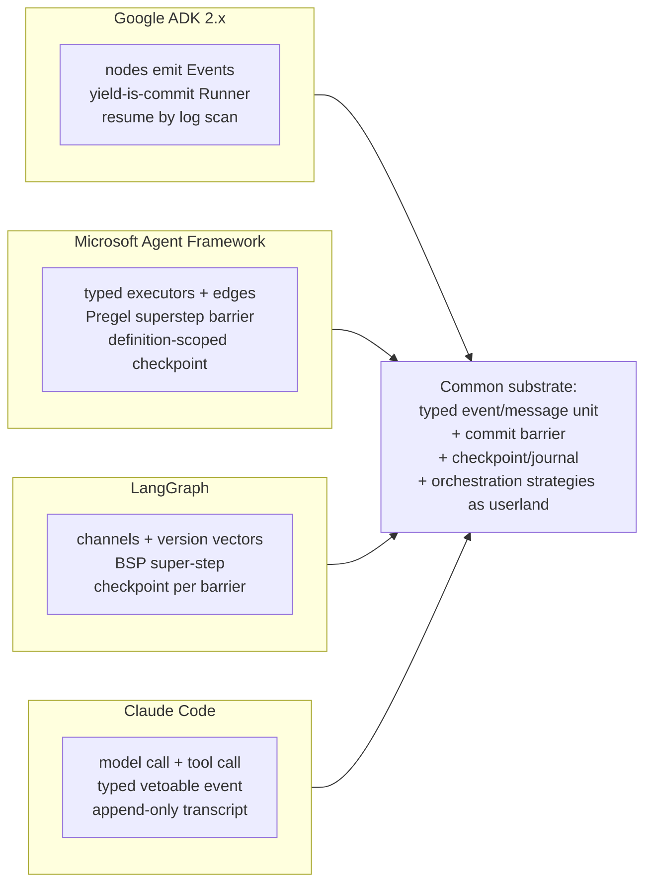

# 02 — Ecosystem Research: Integrative Synthesis

> **Post-review status (2026-08-16, phase 2).** This document was drafted before the adversarial
> review; the review's binding adjudications live in the Amendment log of
> `research/DESIGN-SPINE.md` (A1–A14), with the full findings in `research/ADVERSARIAL-REVIEW.md`.
> They are now reflected in the body.
> **Applied here:** A9(i) (graph-absence claim rescoped to the seven source-inspected coding
> agents + Copilot-by-platform-docs + Windsurf `n/e` — §2.4, §3.1), A9(ii) (Realtime/Live
> lowering relabeled INFERENCE/HIGH — §2.12), plus the capability-negotiation consistency fix
> (§5 gap 3 restated as four one-information-source fragments, aligning with
> `03-HARNESS-COMPARISON.md` §2.5/E2 and spine §6).
> **Outstanding:** none. Where this document conflicts with the Amendment log, **the amendment
> log governs**.

Status: derived from `research/DESIGN-SPINE.md` (pre-adversarial-review). This document is the
cross-cutting synthesis of the thirteen research notes in `research/notes/`; the notes remain
the deep record and every claim here points back into them. Labels and confidence follow
`research/METHODOLOGY.md`. Sections that state design positions are OUR PROPOSAL by default;
evidence claims carry explicit labels.

Companion documents: `01-EXECUTIVE-THESIS.md` (conclusion), `03-HARNESS-COMPARISON.md`
(system-by-system matrix), `04-ORCHESTRATION-MODELS.md` (orchestration strategies in depth),
`05-KERNEL-PRIMITIVES.md` (the kernel vocabulary this evidence justifies),
`06-CAPABILITY-SPEC.md` (the capability contract), `08-EVENT-AND-STATE-MODEL.md`
(journal/checkpoint design), `11-SECURITY-AND-POLICY.md` (grants and policy pipeline).

---

## 1. Method and source discipline

Thirteen domains were researched between 2026-08-11 and 2026-08-15, each producing one note
with its own source ledger (URL, source type, what it evidenced — see §7). The evidence
hierarchy, per `research/METHODOLOGY.md`: FACT (official docs/spec), SOURCE-CODE OBSERVATION
(we read the implementation), OBSERVED BEHAVIOR (reproducible/widely-reported), INFERENCE (our
reasoning), OUR PROPOSAL (no evidentiary weight). Non-FACT claims carry HIGH/MEDIUM/LOW
confidence.

Three discipline points matter for reading this synthesis:

1. **Source-code observation dominates where repos are open.** For ADK, LangGraph, MAF,
   AutoGen, the OpenAI Agents SDKs, Codex (Rust core), seven of eight coding agents, the six
   framework survey targets, MCP, A2A, and the durable-execution docs-sources, claims rest on
   cloned repositories read directly. These are the strongest claims in the program.
2. **Proprietary systems are capped at INFERENCE.** Cursor's server side, Copilot's cloud
   agent internals, Codex cloud scheduling/budgets, Windsurf/Cascade, and the closed harness
   binary inside the Claude Agent SDK are never treated above INFERENCE regardless of how
   plausible the reconstruction, and no low-confidence claim about them is load-bearing for the
   spine. Where a note relied on search-engine extracts of blocked official pages (Cursor,
   several OpenAI/Anthropic blog posts), the note says so and this document inherits the caveat.
3. **Absences are findings.** Several notes verify absence claims against complete spec trees
   or source trees ("no budget field anywhere in the schema"). These FACT-by-absence claims
   drive the gap map (§5) and are as load-bearing as any positive claim.

---

## 2. Per-ecosystem synthesis

### 2.1 Anthropic: Claude Code, the Claude Agent SDK, the Messages API

*(research/notes/anthropic-claude-code-agent-sdk.md)*

**What it is architecturally.** A closed, Claude-locked harness (Anthropic's own documented
term: "agentic harness") whose agent loop reduces to: model call → tool calls → execute →
feed back → stop when a response contains no tool calls. The Agent SDK is a *thin supervisor*:
it spawns a bundled closed-source `claude` CLI binary and speaks NDJSON over stdio
(SOURCE-CODE OBSERVATION, HIGH). Around the loop sit a 32-event hook system with veto
semantics, a fixed six-step permission pipeline (hooks → deny → ask → mode → allow →
callback, with deny and hooks non-bypassable even under `bypassPermissions`), OS sandboxing
(Seatbelt/bubblewrap + egress proxy + credential masking), and an append-only JSONL transcript
per session (all FACT).

**What it hard-codes.** The model. There is no model adapter anywhere in the stack; the system
prompt carries model-version-conditional lines; Anthropic-schema client tools exist because
Claude was trained on them; effort levels and aliases are Claude-specific (FACT). It also
hard-codes the loop shape while making everything around it pluggable (hooks, skills, MCP,
permission rules).

**What it proves.** The entire stack reduces to four primitives — model call, tool call, typed
vetoable event, append-only transcript — with subagents (fresh transcript + tool call),
skills (lazy context artifact + expiring one-turn grant), dynamic workflows (generated JS
against `agent()`/`pipeline()` executed outside the conversation), and checkpoints (file
snapshots keyed to transcript positions) all compositions of those four (INFERENCE, HIGH).
Three further lessons: context management is migrating into the model API (server-side
compaction `compact_20260112`, context editing — FACT), so compaction must be an event with
pluggable executors, not a harness function; budgets were visibly retrofitted (tree-wide
`maxBudgetUsd` only since v2.1.217, depth/concurrency as env vars — INFERENCE, MEDIUM); and
the trust boundary between agents is real enough that Anthropic ships regex-scanning of
subagent output for instruction-shaped injections (FACT) — the retrofit that structural
taint labels (spine §3, Artifact) replace.

### 2.2 OpenAI: Agents SDK, Responses API, Codex

*(research/notes/openai-agents-sdk-codex.md)*

**What it is architecturally.** Three separately implemented instances of the same loop.
The Agents SDK: `Agent` is a pure configuration dataclass; `Runner` owns a `while True` turn
loop whose outcomes form a closed four-way union — continue / handoff / final output /
interruption (SOURCE-CODE OBSERVATION, HIGH). Codex: a Rust core (~100 crates) behind an
event-sourced Submission Queue/Event Queue protocol and an App Server JSON-RPC surface, with
rollout JSONL as its durable record. The Responses API: a provider-side execution service —
server-held conversation state, hosted tools, a V8 sandbox for programmatic tool calling,
background mode — with the Assistants API sunset (2026-08-26) confirming the direction (FACT).

**What it hard-codes.** Termination heuristics (no-pending-tools ⇒ done; first-handoff-wins);
the 13-member closed `Tool` union in which the *execution venue* is baked into the type; and a
fat `Model` interface that leaks agent semantics (`handoffs`) and OpenAI session tokens
(`previous_response_id`) into every adapter (SOURCE-CODE OBSERVATION, HIGH).

**What it proves.** Handoffs are source-verified to be plain function tools plus a runner-side
interception rule — delegation needs interception, not a primitive (SOURCE-CODE OBSERVATION,
HIGH). RunState (schema 1.15/1.18, agent definitions excluded, invocation fingerprints for
exactly-once) shows the cost of checkpointing *above* the runtime, while Codex's rollout
journal is the healthier design inside the same company (INFERENCE, HIGH). Temporal wrapping
the *unmodified* SDK — loop in Workflow, model/tool calls as Activities — proves the
deterministic-orchestration/journaled-effects split can be enforced without touching reasoning
(FACT; spine H3). The beta sandbox-agents package introduces `Capabilities.default()`,
skills, and derived memory — OpenAI independently arriving at capability vocabulary (FACT).
Codex cloud internals (attempt budgets, scheduling) are proprietary; nothing budget-shaped
exists in any open layer beyond `max_turns` and token *reporting* (FACT-by-absence for the
OSS layers; cloud enforcement is unverifiable — INFERENCE, LOW).

### 2.3 Cursor

*(research/notes/cursor.md — proprietary; server internals never above INFERENCE)*

**What it is architecturally.** A proprietary, server-coupled, multi-model harness exposed
through five surfaces (IDE, Agents Window, CLI, web/mobile, TypeScript SDK) claiming one
runtime. All model traffic transits Cursor's backend (traffic-level SOURCE-CODE OBSERVATION:
gRPC to api2.cursor.sh); context assembly, the Merkle-tree/embedding index (server-side index,
client-side ground truth), the fast-apply model, and the Router are server-side and closed.
The open edges are exactly the ecosystem standards: MCP, ACP, AGENTS.md, SKILL.md (FACT).

**What it hard-codes.** The harness *per model*. Cursor's own blog defines the harness as
"system prompts + tool definitions + error handling + context management," versioned and
eval-gated (CursorBench), and documents weeks of per-model adaptation — renaming tools to
match GPT-5.1-Codex-Max's RL training distribution, preserving reasoning traces (~30%
degradation without), reordering messages (FACT via search extracts of official posts).

**What it proves.** This is the decisive evidence for spine counter-hypothesis C2: harness
quality *is* model coupling. Composer was RL-trained inside the production harness against a
shadow deployment of the production backend — the harness is inside the model's training
distribution (FACT). A single agent turn can involve five models (frontier + apply + reapply
escalation + router classifier + memory sidecar), so model invocation must be a cheap,
multi-instance capability, not a singleton slot (INFERENCE, HIGH). Durability is state
transfer, not replay: the `&` cloud handoff migrates a live thread to a cloud cell, resumable
by ID — commercial proof that checkpoint-as-portable-state works (FACT for the feature;
INFERENCE, HIGH that no deterministic replay exists behind it). Consequence adopted by the
spine: Kyxo promises a substrate beneath swappable, benchmarkable harness×model pairs, not a
universal harness.

### 2.4 The coding-agent landscape (eight systems)

*(research/notes/coding-agents-landscape.md)*

**What it is architecturally.** Eight competitive systems (Gemini CLI, Copilot cloud agent +
agent mode, OpenCode, Cline, Roo Code, Continue, Aider, Windsurf) spanning four loop models:
bounded-reflection rewrite pipeline (Aider), the canonical streaming native-tool-call loop
(six systems), an explicit per-tool-call state machine (Gemini CLI's scheduler), and an
artifact-mediated remote pipeline (Copilot cloud: issue → ephemeral Actions VM → draft PR).

**What it hard-codes.** Each hard-codes its loop shape and prompt scaffolding; none share an
orchestration format. Copilot cloud's enforcement is notable for living in credentials and
network, not the harness: single-branch push scope, draft-PR-only, egress firewall (FACT).

**What it proves.** Zero of the **seven source-inspected** systems contain a graph or DAG
engine (SOURCE-CODE OBSERVATION, HIGH); the Copilot cloud agent shows none in its documented
pipeline (FACT, platform docs); Windsurf/Cascade is press-level only and is **not evidenced
either way** — matching the `n/e` Graph-support cell in `03-HARNESS-COMPARISON.md` §2.2.
Scoped per amendment A9(i): the earlier phrasing ("zero of eight … SOURCE-CODE
OBSERVATION/FACT across all eight") claimed source verification for two systems where none
exists. *(Superseded label retained here because the correction is the point: the conclusion
survives on honest labels, and it is still the strongest breadth evidence for spine H1.)*
"Plan mode" is uniformly the same loop under a restrictive policy profile (INFERENCE, HIGH).
Delegation converged independently five times on: fresh session + capability/policy diff +
prompt + single result message, with optional background/resume-by-id/separate budget
(INFERENCE, HIGH — the spine's delegation-system definition). The shadow-git checkpoint was
independently implemented 3–4 times with the same semantics: snapshot = (workspace state,
conversation state, pending action), restorable on independent axes. Patch application is a
model-conditioned capability requiring negotiation *with feedback*: Aider binds edit formats
per model in its catalog; Copilot's `EditToolLearningService` maintains per-model success
bitsets per edit tool and adapts the exposed toolset at runtime (SOURCE-CODE OBSERVATION,
HIGH) — the empirical ancestor of the spine's declared-manifest + probe + outcome-telemetry
triple (C3). Verification splits into two altitudes — in-loop (OpenCode fuses LSP diagnostics
into the edit tool's result) and out-of-loop platform gates (Copilot's CodeQL/advisory-DB/
secret-scanning + human-gated CI) — both observed, neither a kernel hook anywhere.

### 2.5 Google ADK

*(research/notes/google-adk.md)*

**What it is architecturally.** Post-2.0 (GA 2026-05-19), a graph-based Workflow Runtime over
an event-sourced substrate: `BaseAgent` literally subclasses `BaseNode`;
Sequential/Parallel/Loop agents are deprecated one major version after shipping (SOURCE-CODE
OBSERVATION, HIGH). The one non-negotiable contract is **yield-is-commit**: a node's effects
(state delta, artifact delta, checkpoint) commit atomically when the Runner accepts its event,
and execution resumes only after commit — preserved across the 1.x→2.x rewrite, re-implemented
across a task boundary with a queue+ack handshake (FACT + SOURCE-CODE OBSERVATION). Three
orchestration styles — declarative graph, imperative `ctx.run_node`, LLM-driven transfer —
are interchangeable layers producing the same event stream.

**What it hard-codes.** The provider shape: `Event` extends `LlmResponse`, and google.genai
types are the interlingua all adapters bend to; the 2.0 migration notes document downstream
breakage from widening this envelope (FACT). Budgets are one integer: `max_llm_calls`
(default 500) — that is the whole built-in budget system (SOURCE-CODE OBSERVATION, HIGH).

**What it proves.** The strongest single confirmation of H1: Google shipped "everything is an
agent," found deterministic orchestration didn't fit the agent abstraction, and re-founded on
"everything is a node emitting events" within a year. It also proves one log can carry state,
checkpoints, undo (rewind as inverse-delta event), compaction, routing, HITL, and visibility
filtering (`branch`, `isolation_scope` as event fields) — and simultaneously demonstrates the
cost of doing so with an untyped widening envelope, which is why the spine's Event is typed
and provider-independent (kernel object 4). Inline verification is absent — evaluation is a
rich but offline subsystem (SOURCE-CODE OBSERVATION; gap §5.2).

### 2.6 LangGraph

*(research/notes/langgraph.md)*

**What it is architecturally.** Not a graph engine. The kernel is: named, typed, versioned
**channels** + a BSP scheduler that plans tasks by diffing version vectors (`versions_seen`
vs `channel_versions`) + a checkpoint of channel values/versions per super-step. `StateGraph`
is a compiler onto this — edges compile to trigger channels and do not exist at runtime;
joins are a channel type (`NamedBarrierValue`); the Temporal-shaped functional API
(`@entrypoint`/`@task` with memoized effects) is a second frontend on the identical substrate
(SOURCE-CODE OBSERVATION, HIGH).

**What it hard-codes.** Nothing model-shaped — the kernel doesn't know models exist (nodes
are opaque callables). What it fixes is the durability quantum: the super-step barrier. The
consequence is the program's clearest abstraction leak: `interrupt()` resumes by *re-executing
the node body*, pushing idempotency discipline into user code, with a documented
exponential-replay footgun (FACT).

**What it proves.** Graph is a frontend, not a kernel concept (H1); dynamic dispatch always
wins (`Send`, `Command(goto)`, mid-step `accept_push` — three escape hatches from static
topology, absorbed cleanly *because* the kernel was never a graph); deterministic task/effect
identity (uuid5 over checkpoint/step/path) is the linchpin of resume, memoization, and fork
(all SOURCE-CODE OBSERVATION, HIGH). The platform layer proves the control-plane thesis:
assistants/threads/runs/crons/double-texting are all built outside the kernel, enabled solely
by the checkpoint contract (INFERENCE, HIGH). The ecosystem verdict on multi-agent-as-graph:
`langgraph-supervisor` is no longer maintained; the recommended pattern is subagents-as-tools
(FACT). Policy, budgets, sandboxing, verification: absent from OSS (§5). The
checkpointer-conformance suite is the operational discipline the spine copies for storage
(spine §8).

### 2.7 Microsoft: AutoGen → Semantic Kernel → Agent Framework

*(research/notes/microsoft-autogen-sk-agent-framework.md)*

**What it is architecturally.** The convergence product of three abandoned computational
models. What survived into MAF 1.0 (GA 2026-04-03): typed executors consuming typed messages
over conditional edges, Pregel supersteps with commit-at-barrier state, **definition-scoped
checkpoints** (bound to a `graph_signature_hash` + lineage chain, portable across instances),
typed request/response ports for all external interaction (HITL requests persisted *inside*
checkpoints), a single discriminated-union event stream, three-level middleware
(agent/model/tool), and context providers with per-message provenance attribution
(SOURCE-CODE OBSERVATION, HIGH throughout). What was killed: standalone LLM planners
(SK, 2024), the distributed gRPC actor mesh (no MAF successor in-repo), and conversation as
the core state object.

**What it hard-codes.** Very little above the substrate — that is the finding. Group chat,
handoff, and Magentic are builders that emit workflows; the Claude-Code-class harness is
`create_harness_agent()`: pure composition of loop middleware (judge/todo predicates),
providers (todo, memory, skills, mode, background subagents), and tool approval around an
unchanged loop (SOURCE-CODE OBSERVATION, HIGH).

**What it proves.** Harness = composition, demonstrated by the largest vendor: no new kernel
concept was needed to build one (spine §2's harness-as-behaviour). Durability engines attach
from outside if barriers are deterministic (the Durable Task extension was deliberately
*extracted* from core). Policy can live in the data plane: FIDES propagates
integrity/confidentiality labels through middleware and enforces deterministically at the tool
boundary, including over MCP `_meta.ifc` — productized information-flow control, but as
opt-in middleware rather than an invariant (SOURCE-CODE OBSERVATION, HIGH; the spine makes it
structural, kernel object 5). MAF and LangGraph landing independently on BSP supersteps +
checkpoint-at-barrier, differing only in data plane (typed point-to-point messages vs merged
channel document), is the convergence pair at the heart of §3.1.

### 2.8 The framework field: CrewAI, PydanticAI, LlamaIndex Workflows, Mastra, Letta, smolagents

*(research/notes/agent-frameworks-crewai-pydantic-llamaindex-mastra-letta.md)*

**What it is architecturally.** Six frameworks compositing five recurring computational
models: event-driven steps, typed step graphs, role teams, code-as-action, and
memory-as-agent-state. All five reduce to one scheduling contract — a strategy that, given
(event log, state, capability results), decides the next set of capability invocations —
plus join/barrier semantics (INFERENCE, HIGH).

**What each hard-codes and proves.** CrewAI hard-codes role/goal/backstory and two crew
processes, and has demoted crews to components invoked from deterministic Flows — role teams
are a prompt-layer pattern, not a runtime primitive (INFERENCE, HIGH). **PydanticAI v2 ships
the closest existing artifact to the spine's Capability**: an attachable bundle contributing
tools + lifecycle hooks + instructions + model settings + model *selection*, loadable
on-demand by the model, with durability itself delivered as a capability
(`TemporalDurability`) (FACT; spine H2). LlamaIndex makes events the execution substrate —
the only surveyed framework where the observability stream and execution log coincide.
Mastra contributes the cleanest typed-suspension design (`suspendSchema`/`resumeSchema`),
adopted by the spine's Invocation contract, plus durable agents that run the loop inside a
workflow with memoized steps. **Letta is the memory reference**: labeled, char-limited,
shareable `Block`s; context as a deterministic `Memory.compile()` over persisted state with
full token accounting; memory management reassignable to a different principal (sleep-time
agent) — the spine's memory-system definition verbatim (SOURCE-CODE OBSERVATION, HIGH).
smolagents proves the action grammar (JSON tool call vs Python snippet) is a pluggable
decode/execute pair and that code-as-action forces an execution-environment capability with a
real policy surface. Durability across all six lands in exactly two families — in-framework
snapshot/resume, or delegation to an external durable engine across an explicit determinism
boundary (FACT for the integrations; INFERENCE, HIGH for the generalization).

### 2.9 MCP

*(research/notes/mcp-protocol.md)*

**What it is architecturally.** As of revision 2026-07-28, a *stateless* client–host–server
protocol: protocol sessions and the initialize handshake are gone; every request carries
version + capabilities in `_meta`; server-initiated requests are replaced by MRTR — typed
`input_required` results carrying sealed, integrity-protected continuation state
(`requestState`) the client echoes back; durability lives in the Tasks *extension* as
server-owned handles (all FACT).

**What it hard-codes.** Deliberately little — and it publishes what it refuses to own: agent
lifecycle, delegation, budgets, planning, conversational checkpoints, memory, policy language,
exactly-once semantics are all out of scope (FACT-by-absence, verified against the full doc
tree). Capabilities are feature-support declarations, *not* authority — authority lives
entirely in OAuth scopes and host policy.

**What it proves.** The capability grammar the spine adopts survived a full architectural
rewrite: three tiers (named typed capabilities / `experimental` bag / governed reverse-DNS
`extensions` with settings objects), negotiation-by-typed-error rather than handshake, a
12-month deprecation floor, and conformance-test-gated SEPs (FACT). Two deaths instruct the
design: transport-level stream resumability was shipped (2025-03) and deleted (2026-07) in
favor of durable handles — durability = handles over state, not replayable byte streams; and
sampling (server borrows the client's model) was deprecated for low adoption — protocol-
mediated model access loses to direct APIs unless it is near-zero-friction, which constrains
how Kyxo exposes model invocation to plugins (INFERENCE, HIGH). Elicitation survived with a
form/URL split so secrets never transit the runtime — the host's durable monopoly is the
user, and the spine's humans-as-capabilities contract copies it.

### 2.10 A2A

*(research/notes/a2a-protocol.md)*

**What it is architecturally.** A Linux-Foundation protocol (v1.0, 2026-03-12; proto
canonical, ProtoJSON derived) standardizing exactly three layers: discovery/identity (signed
Agent Cards at a well-known URI), a server-owned task lifecycle, and progress observation —
while leaving every cognitive and execution layer opaque. The 9-state `TaskState` enum
partitions into terminal {completed, failed, canceled, rejected} and interrupted/resumable
{input-required, auth-required} classes (SOURCE-CODE OBSERVATION of the canonical proto,
HIGH).

**What it hard-codes.** Server-generated task IDs, task immutability once terminal
(refinement = new task in the same context), and the split "state is authoritative, events
are advisory" — streams and webhooks are lossy hints to go read the Task record (FACT +
INFERENCE, HIGH).

**What it proves.** Total executor opacity is standardizable (spine H2): no model, planner,
memory, or tool concept appears in 156KB of spec, so everything a kernel wants to guarantee
must live in the envelope. `AUTH_REQUIRED` chaining — a typed requirement propagating up an
opaque delegation chain until someone can approve it — is the prototype the spine generalizes
into its interrupted class (`approval-required`, `budget-exceeded`) on the Invocation state
machine (kernel object 3). Skills are advisory, never invocable — the sharpest contrast with
MCP's schema-typed tools, and evidence that enforced protocol-capabilities and advisory
domain-capabilities must be distinguished in a manifest. The absences (budgets, deadlines,
verification, provenance, policy language, replay, delegation-depth control — FACT-by-absence)
enumerate the kernel's value-add surface almost line for line (§5).

### 2.11 Durable execution: Temporal, Restate, DBOS (+ Orleans, OTP)

*(research/notes/durable-execution.md)*

**What it is architecturally.** Three systems, one invariant, three mechanisms: Temporal
replays code and positionally matches emitted commands against recorded events; Restate
re-executes and *injects* journaled results at context actions; DBOS looks up checkpointed
step outputs in Postgres. All three impose the identical contract — deterministic
orchestration, journaled/idempotent effects — and none exempts AI; all three explicitly place
LLM calls at the effect edge (FACT). Orleans/Restate/Temporal independently reinvented the
keyed single-writer stateful entity (grain / Virtual Object / Entity Workflow) — the spine's
Cell (INFERENCE, HIGH).

**What it hard-codes.** Temporal hard-codes *code as the durable artifact*: history limits
(51,200 events / 50 MB / 2 MB payloads), patch-marker versioning ceremony, RunState bound to
tool-graph identity. The 2025–2026 first-party AI integrations are the empirical record of
what that costs: sessions rebuilt as replay-safe objects that die at Continue-As-New; usage
accounting silently lost across the activity boundary (a child agent's tokens never charged
to the parent — the budget-lineage cautionary tale); token streaming built out of
Signals/Updates with retry attempts *necessarily* visible to observers though invisible to
durable state — the truth-plane/observation-plane split made explicit (all FACT).

**What it proves.** Spine H3 and H5. The determinism split is real and enforceable
externally (Temporal × unmodified OpenAI SDK); but for AI workloads the correct emphasis is
journal-first record-and-inject with first-class checkpoints and a two-tier store (references
in the log, payloads in CAS) — every history-growth pathology above is a retrofit of that
missing primitive (INFERENCE, HIGH). OTP supplies what all three lack: supervision *above*
the loop with bounded restart intensity and escalation, which the spine extends to token/cost
budgets (spine §7). Verification is absent in all three — success = no exception
(FACT-by-absence). And there is no portable record format: "durable execution in 2026 has no
MCP-equivalent" — each vendor's record is open-source but nonportable (FACT), the opening for
spine gap 5.

### 2.12 Open-model infrastructure

*(research/notes/open-model-infrastructure.md)*

**What it is architecturally.** The open-model "model API" is a locally-run serving engine
(vLLM, SGLang, llama.cpp, Ollama) exposing a lossy, unversioned subset of the OpenAI dialect
plus native extensions through `extra_body` — the ecosystem's confession that the standard is
insufficient (INFERENCE, HIGH). The real harness↔model contract is the model-shipped chat
template (two incompatible template languages) plus per-family tool-call and reasoning
*parsers*: vLLM ships ~25 named tool-call parsers and a plugin interface; "the model" in the
open world is weights + tokenizer + template + parsers — code on both the encode and decode
edges (FACT).

**What it hard-codes.** Nothing centrally — which is the problem. Capability discovery is
near-absent (`/v1/models` returns IDs; Anthropic's typed capability tree is the lone
exception); unknown-field behavior is itself divergent — stripping unknown fields is correct
on one provider and a hard 400 on another (DeepSeek's echo-required `reasoning_content`,
Gemini's enforced thought signatures, Anthropic's tamper-rejected thinking signatures)
(FACT/OBSERVED BEHAVIOR, HIGH).

**What it proves.** Spine H4's refinement. Model interaction paradigms diverge on ~16
independent axes with tiers — statefulness, prompt-encoding level, reasoning
visibility/replay/budget (three orthogonal sub-axes; five incompatible paradigms), tool
emission/result dialects, streaming grammar, transport/session model, structured-output
expressivity (four tiers), caching contract (four shapes with different economics and
prompt-construction obligations), sampling surface, task types beyond chat, resource
lifecycle, discovery, error semantics. LCD flattening is empirically *fatal*, not just lossy
(400s, silent capability loss, silent cost regressions). Hence: axis-typed tiered negotiation;
a typed provider-native passthrough that is policy-visible and never silently dropped; opaque
provenance-tagged carry-through artifacts for provider state; and both request/response *and*
bidirectional-session invocation shapes as first-class — Realtime/Live cannot be lowered onto
function calls (**INFERENCE, HIGH**, grounded in transport-level FACTs: persistent duplex
sessions, server-initiated turns, interruption/barge-in semantics that a request/response
function call has no place to express). Amendment A9(ii) governs the label: the spine's
earlier FACT/HIGH was an elevation of the note's own INFERENCE/HIGH, and
`research/METHODOLOGY.md` has no label-elevation mechanism. The conclusion is unchanged.
All of the above are spine §4 commitments.

### 2.13 Non-AI prior art

*(research/notes/prior-art-negotiation-extension.md)*

**What it is architecturally.** A pattern library from ~15 systems, clustering into a
negotiation cluster and an authority cluster. Negotiation: LSP's two-sided capability sets at
bind; TLS 1.3's asymmetric rules (must-ignore unknown offers, abort on unsolicited responses)
and its frozen version field — any field an intermediary can read gets ossified; GREASE as
continuously-tested ignore paths; Wayland's registry making discovery an event stream with
version-at-bind; Kubernetes CRDs as userland types on kernel machinery with one storage
version + conversion; HTTP's `Vary` as negotiation provenance (all FACT). Authority: four
independent systems (E, Cap'n Proto, seL4, Zircon) converged on unforgeable references,
possession = authority, attenuate-on-delegate, transitive revocation, no ambient authority
(FACT; INFERENCE HIGH that the convergence is the strongest signal in the program).

**What it proves for the spine.** The kernel-admission constitution is Liedtke's minimality
test, adopted verbatim (spine §3), with Mach's corollary: the crossing primitive must be
near-zero-cost or minimalism loses to monoliths — hence zero-copy Artifact references (kernel
object 5). OTP behaviours are the harness contract (generic loop in kernel/stdlib, strategy
as callbacks) and supervision-with-restart-budgets is the failure model. The vendor-prefix
failure is the standing warning against identity sniffing — frameworks branching on model
names are re-committing the UA-string sin, which capability probes replace. One genuine
novelty check: no surveyed system implements *budgets as attenuated quantitative rights*
(seL4 untyped-memory retyping and Zircon job policies are close but not identical) — the
spine's Grant is flagged accordingly as the one kernel object with limited prior art.

---

## 3. The five cross-cutting convergences

Independent convergent evolution is the strongest evidence class this program has: unrelated
teams under production pressure arriving at the same shape. Five convergences recur across
the notes.

### 3.1 Kernel convergence: the substrate beneath four unrelated systems

**Evidence.** ADK 2.0 deprecated its own Sequential/Parallel/Loop agents and re-founded on
nodes-emitting-events over a yield-is-commit runner (SOURCE-CODE OBSERVATION, HIGH —
research/notes/google-adk.md). MAF collapsed AutoGen + SK into typed executors + supersteps +
checkpoint-at-barrier + typed request ports + one discriminated event stream, with group
chat, planners, and a full harness demoted to libraries (SOURCE-CODE OBSERVATION, HIGH —
research/notes/microsoft-autogen-sk-agent-framework.md). LangGraph's kernel is channels +
version-vector scheduling + barrier checkpoints; edges do not exist at runtime; two
frontends compile onto it (SOURCE-CODE OBSERVATION, HIGH — research/notes/langgraph.md).
Claude Code reduces to four primitives with everything else as composition (INFERENCE, HIGH —
research/notes/anthropic-claude-code-agent-sdk.md). Breadth check, scoped per amendment
A9(i): zero of the seven source-inspected coding agents contain a graph engine (SOURCE-CODE
OBSERVATION, HIGH); the Copilot cloud agent shows none in its documented pipeline (FACT,
platform docs); Windsurf is not evidenced either way (`n/e`). Plan mode is uniformly a policy
profile across the inspected set (research/notes/coding-agents-landscape.md). The planner as
a component is dead across Microsoft's stack and thin-to-absent everywhere else (ADK's
`BasePlanner` is a prompt shim).

**Interpretation.** Loop, graph, workflow, planner, supervisor, and swarm are orchestration
strategies over a small event/commit/checkpoint substrate; none is kernel material.

**Implication.** Spine H1 confirmed; the nine kernel objects of spine §3 start where these
systems *arrived*. Detail in `04-ORCHESTRATION-MODELS.md` and `05-KERNEL-PRIMITIVES.md`.

**Confidence.** HIGH — four independent source-verified arrivals plus a **seven-system
source-inspected** absence sweep, corroborated by one documented-pipeline check (Copilot
cloud, FACT) and one abstention (Windsurf, `n/e`). The four convergent arrivals carry the
argument on their own; the absence sweep is corroboration, so the A9(i) rescoping does not
move the confidence.

### 3.2 Capability-vocabulary convergence

**Evidence.** PydanticAI v2 ships first-class attachable capabilities spanning tools + hooks
+ instructions + model selection (FACT —
research/notes/agent-frameworks-crewai-pydantic-llamaindex-mastra-letta.md). OpenAI's beta
sandbox-agents package introduces `Capabilities.default()`; Codex grew `capabilities.rs` and
`permissions.rs` at the protocol layer (FACT / SOURCE-CODE OBSERVATION —
research/notes/openai-agents-sdk-codex.md). MCP's three-tier capability grammar survived a
full protocol rewrite (FACT — research/notes/mcp-protocol.md). A2A's Agent Card enforces
protocol-capabilities with typed errors (FACT — research/notes/a2a-protocol.md). MAF does
capability discovery by structural typing (`Supports*Tool` runtime-checkable protocols —
SOURCE-CODE OBSERVATION). Prior art supplies the mature forms: LSP bind-time capability sets,
Wayland registry globals, WIT worlds (research/notes/prior-art-negotiation-extension.md).

**Interpretation.** The ecosystem is independently groping toward "capability" as the unit of
composable function — but every current instance is either declaration-only (MCP, A2A, LSP)
or untyped/informal (MAF isinstance checks). The critical amendment comes from the coding
agents: the same logical capability needs per-model dialects *and* runtime outcome telemetry
(Aider's per-model edit formats; Copilot's EditToolLearningService; Cursor's tool renaming —
research/notes/coding-agents-landscape.md, research/notes/cursor.md).

**Implication.** Spine H2 with amendment: manifests carry axis-typed, tiered dialects;
declarations gate eligibility, probes verify, telemetry drives selection (spine C3). Full
contract in `06-CAPABILITY-SPEC.md`.

**Confidence.** HIGH for the convergence; HIGH for the amendment (source-verified in two
independent systems, corroborated by a third).

### 3.3 Delegation-algebra convergence

**Evidence.** Five coding agents independently implement subagent = fresh session +
capability/policy diff + prompt + single result message (Roo `new_task`, OpenCode `task.ts`
with resumable delegation and derived permissions, Gemini CLI subagents-as-tools, Cline
read-only research subagents with per-child budgets, Copilot custom agents) (SOURCE-CODE
OBSERVATION/FACT — research/notes/coding-agents-landscape.md). Claude Code's Agent tool:
fresh transcript, no parent history, result-as-tool-result, background by default, tree-wide
budget (FACT). OpenAI's handoffs are source-verified plain tools + interception; agents-as-
tools is the composition dual (SOURCE-CODE OBSERVATION, HIGH). ADK's task mode + transfer
tool implement delegation entirely with existing tool/event machinery. MAF's
BackgroundAgentsProvider exposes subagents as tools over sessions. LangGraph's ecosystem
migrated from supervisor graphs to subagents-as-tools (FACT). smolagents' managed agents are
tools.

**Interpretation.** Delegation is not a mechanism; it is invocation of an orchestrating
capability under a modified policy/grant, plus an interception rule. Nobody needed a
dedicated protocol — and the systems that shipped three delegation mechanisms that cannot
compose (OpenAI: handoff, as_tool, Codex subagents) show the cost of hard-coding any one.

**Implication.** The spine's delegation-system definition (§2) and the mandate that
attenuation-on-delegation be construction, not convention (§6.6) — because the convergent
algebra everywhere *lacks* enforced child ≤ parent authority (see §5.4).

**Confidence.** HIGH — nine-plus independent implementations of the same shape.

### 3.4 Journal/checkpoint convergence

**Evidence.** Append-only logs are the working source of truth in ADK (session event log with
state/artifacts/undo folded from it), Claude Code (JSONL transcript; resume/fork as log
operations), Codex (rollout JSONL; `thread/resume` replays it), and Restate (journal as WAL,
processor state as materialized view) (SOURCE-CODE OBSERVATION/FACT across four notes).
Checkpoints converge on snapshot + position + pending work: LangGraph's
channel-values/versions/pending-writes tuple; MAF's definition-scoped checkpoint with
topology hash and lineage; the shadow-git snapshot implemented independently 3–4 times with
(workspace, conversation, pending action) semantics; CrewAI's explicit resume-vs-fork;
Mastra's schema-validated suspend snapshots. The counter-evidence is equally consistent:
Temporal-style positional replay taxes AI code whose prompts change weekly (patching
ceremony, RunState bound to tool-graph identity, session-on-heap pathologies —
research/notes/durable-execution.md), and MCP tried transport-level replayable streams and
deleted them in 16 months in favor of durable handles (FACT).

**Interpretation.** The ecosystem's stable point is journal-first (record-and-inject) with
first-class checkpoints, not replay-first (re-emit-and-match); and the log must be two-tier
(references in the journal, payloads content-addressed) because every history-growth
pathology observed is a retrofit of that split.

**Implication.** Spine H5: Event + Checkpoint kernel objects, two-tier store, fork-from-
checkpoint as the primary repair/upgrade verb. Detail in `08-EVENT-AND-STATE-MODEL.md`.

**Confidence.** HIGH.

### 3.5 Policy/hook convergence

**Evidence.** Claude Code: 32 typed lifecycle events, matcher subscription, five handler
runtimes, exit-code veto, fixed six-step permission pipeline with non-bypassable deny
(FACT). Cursor hooks: same stdin-JSON/allow-block idiom at the same interposition points,
honored by cloud agents (FACT via search extracts; INFERENCE HIGH that the isomorphism is
convergent, not copied coordination). Codex: `SessionStart`/`PreToolUse`/`PermissionRequest`/
`PostToolUse`/`Stop` hooks plus the `AskForApproval` × `SandboxPolicy` two-axis matrix
(OBSERVED BEHAVIOR MEDIUM-HIGH / FACT). Gemini CLI: TOML rule engine with priorities;
OpenCode: last-match-wins wildcard rulesets; Copilot cloud: enforcement in credentials and
network (research/notes/coding-agents-landscape.md). MAF: three-level typed middleware plus
FIDES label enforcement at the tool boundary; ADK: plugins/callbacks as imperative policy
(SOURCE-CODE OBSERVATION).

**Interpretation.** Vendors have converged on (a) ordered evaluation with non-bypassable
deny stages, (b) interposition points at prompt-submit / pre-tool / post-tool / stop /
subagent lifecycle, and (c) a two-tier trust model separating context-persuasion from
client-enforcement. What no one has is a declarative, kernel-owned pipeline; everywhere it is
product-specific configuration or in-process code.

**Implication.** The spine's policy pipeline mechanism (§3): ordered declarative stages,
evaluated at bind and at every effectful invocation, deny-class non-bypassable — Claude
Code's pipeline as the proven shape, generalized. Detail in `11-SECURITY-AND-POLICY.md`.

**Confidence.** HIGH.

---

## 4. The divergences that matter

Convergence tells us what the kernel is; divergence tells us what the kernel must *not*
normalize.

**4.1 Model interaction axes.** The ~16-axis divergence catalog
(research/notes/open-model-infrastructure.md) is the single strongest constraint on the
capability contract. Headline features decompose into independently varying sub-axes
(reasoning = visibility × replay contract × budget control, with five incompatible paradigms
on that axis alone), failure modes are asymmetric and loud (the same client behavior —
stripping unknown fields — is correct on one provider and a hard 400 on another), and caching
contracts constrain a *different* subsystem (context construction) than the one that declares
them. Consequence (OUR PROPOSAL, from spine §4): axis-typed tiered negotiation; bind-time
loud failure instead of silent degradation; typed provider-native passthrough; opaque
carry-through artifacts; two invocation shapes (request/response and bidirectional session);
non-chat task profiles first-class. A universal model API in the LCD sense is not merely
suboptimal — it is empirically broken.

**4.2 Retrieval philosophies.** Four genuinely different architectures coexist profitably:
static-analysis graph ranking (Aider's PageRank repo map), content-addressed hybrid indexing
(Continue's four-index pipeline), model-driven retrieval (Windsurf Riptide / SWE-grep — an
RL-trained retrieval subagent; OBSERVED BEHAVIOR, MEDIUM), split-trust server-side embedding
retrieval (Cursor), and plain agentic grep with retrieval-as-delegation (OpenCode `explore`,
Cline research subagents) (research/notes/coding-agents-landscape.md, research/notes/cursor.md).
Two of these are themselves agents. Interpretation: retrieval is workload- and economics-
dependent and must stay userland — a capability parameterized by the kernel's budget
primitive, never a kernel service. This bounds `09-CONTEXT-AND-MEMORY.md`.

**4.3 Replay vs journal.** Temporal's positional command-matching buys the richest
nondeterminism detection and charges for it in versioning ceremony that AI code cannot
sustainably pay; Restate's injection and DBOS's checkpoint-lookup are looser and cheaper;
LangGraph/MAF checkpoint state at barriers and re-execute node bodies (with the `interrupt()`
idempotency leak as the cost); Cursor ships state-transfer with no replay at all
(research/notes/durable-execution.md, research/notes/langgraph.md, research/notes/cursor.md).
These are real trade-off positions, not maturity levels. The spine's choice — journal-first
with deterministic effect identity and explicit checkpoints — takes Restate/DBOS semantics
with LangGraph's task-identity discipline and Cursor's portable-state migration, and rejects
Temporal's patching model for the AI layer (version-by-data instead; spine §7).

**4.4 Harness–model coupling.** The deepest divergence is philosophical: Cursor, Copilot,
Aider, and Windsurf treat the harness as model-specific by necessity (weeks of per-model
tuning; learned per-model edit-tool selection; per-model edit formats; task-specialized
in-house models), while ADK, MAF, LangGraph, and the SDK vendors present model-agnostic
surfaces — whose agnosticism is partly illusory (ADK's Gemini-shaped Event; OpenAI's session
tokens in the Model interface). Cursor training Composer inside the production harness ends
the argument: separability is asymmetric and eroding from both directions (FACT —
research/notes/cursor.md). Resolution adopted by the spine (C2): model-independence lives in
the kernel and the record format; model-specificity lives in adapters and harnesses,
first-class and benchmarkable as pairs. `03-HARNESS-COMPARISON.md` carries the matrix;
`10-HARNESS-AND-GRAPH-RUNTIME.md` the behaviour contract.

---

## 5. The gap map: what no system owns

Spine §6 claims six gaps. This section gives the per-gap evidence of absence. The pattern
that matters: each gap is attested independently across *protocols, frameworks, harnesses,
and durable engines* — these are not features one vendor forgot but a layer nobody owns.

| # | Gap | Evidence of absence (labels: FACT-by-absence unless noted) |
|---|---|---|
| 1 | **Budgets as resource lineage** | State of the art is scalar caps: OpenAI `max_turns`; ADK `max_llm_calls=500` as the entire budget system (SOURCE-CODE OBSERVATION); Claude Code's tree-wide USD cap retrofitted in v2.1.217 with depth/concurrency as env vars; MCP has no cost/token/rate budget anywhere in the schema; A2A has no budget/deadline/priority field on tasks; Codex OSS layers expose only `max_turns` + token *reporting*; Temporal×PydanticAI silently loses child-agent usage across the activity boundary (FACT — the lineage failure in production). No system has hierarchical, attenuating, delegation-spanning budget enforcement. |
| 2 | **Verification at the commit point** | All three durable engines: success = no exception (research/notes/durable-execution.md). ADK: rich offline eval, no inline gate (SOURCE-CODE OBSERVATION). A2A: artifact acceptance explicitly assigned to the client, out of protocol. MCP: schema validation only. What exists is in-loop feedback (OpenCode's LSP-fused edit results; PydanticAI `ModelRetry`) and out-of-loop platform gates (Copilot CodeQL/secret-scanning) — never a kernel hook gating what enters the truth plane. |
| 3 | **Axis-typed capability negotiation for models** | `/v1/models` returns IDs, not capabilities; clients hardcode (research/notes/open-model-infrastructure.md). `extra_body` is the untyped escape hatch nothing validates. Anthropic's typed capability tree is the lone counterexample and negotiates nothing. MCP/A2A/LSP negotiate *protocol* features, not model-interaction axes. What exists are **four fragments, each carrying exactly one information source** — static declared dialects (Aider edit formats), declaration-with-fail-closed (Cline modality manifests), a protocol handshake (Codex App Server `initialize`), and empirical outcome telemetry (Copilot's `EditToolLearningService`) — all SOURCE-CODE OBSERVATION. None is two-sided, axis-typed, or tiered, and none combines sources; the matrix rates them BASIC in `03-HARNESS-COMPARISON.md` §2.5 for exactly that reason. "Nothing negotiates" is shorthand for "nothing negotiates on more than one information source". |
| 4 | **Delegation attenuation and recursion control** | The convergent subagent algebra (§3.3) passes policy *diffs* by convention; no system enforces child ≤ parent as construction. Claude Code subagents inherit the parent's permission mode and certain modes cannot be tightened per-subagent (FACT). A2A has no delegation depth, loop protection, or on-behalf-of identity. smolagents' code agents can construct new agents at runtime with no attenuation answer (the note flags this as a genuine gap). Depth/concurrency caps, where they exist, are env vars, not lineage-aware grants. |
| 5 | **Structural provenance/taint** | FIDES exists — as opt-in MAF middleware, not an invariant (SOURCE-CODE OBSERVATION). Claude Code pattern-scans subagent output text after the fact (FACT) — a retrofit acknowledging the need. MAF attributes injected context per provider; ADK carries `branch`/`isolation_scope` for visibility. Nobody propagates integrity/confidentiality labels structurally on every artifact and context element as a kernel guarantee. |
| 6 | **Portable execution-record format** | "Durable execution has no MCP-equivalent" (research/notes/durable-execution.md): Temporal history, Restate journal, DBOS tables are open-source but mutually nonportable. OpenAI RunState is SDK-version-bound with agent definitions excluded; Codex App Server schemas drift per release (clients pin binaries); ADK's event JSON is a de facto five-SDK wire format with no governed spec; LangGraph checkpoints have a conformance suite for *storage* but no cross-runtime record standard. No journal + checkpoint schema is published as a contract anywhere. |

Two cross-checks strengthen the map. First, MCP's maintainers declare the adjacent territory
out of scope explicitly (agent lifecycle, budgets, checkpoints, policy — FACT), so the gaps
are not accidental: the protocol layer *refuses* them and the framework layer cannot enforce
them. Second, counter-hypothesis C1 (spine §1) priced in the partial coverage that does
exist — MCP + A2A + LangGraph/MAF + Temporal cover tools, federation, orchestration state,
and durability respectively — and the six gaps above are precisely what remains. That
remainder is Kyxo's product surface: an execution kernel and capability substrate *beneath*
agent frameworks, speaking MCP southbound, A2A at the federation edge, and provider APIs via
adapters (spine §6).

---

## 6. What Phase 1 resolves: the model-vs-harness boundary for Anthropic and OpenAI

The mission's Phase-1 question — where does the model end and the harness begin, and what
does that imply for a model-independent kernel — resolves differently, and instructively, for
the two flagship vendors.

**Anthropic: the boundary is thin but nonzero, and it is moving into the API.** Loop
mechanics, the hook/event model, the permission pipeline, the session log, and the MCP client
are model-agnostic in design and would port (INFERENCE, HIGH). What does not port: the tuned
system prompt including model-version-conditional lines (the harness patches per-model
behavioral drift in its prompt — FACT), trained Anthropic-schema client tools, effort
semantics, and termination judgment itself, which lives in the model — the harness merely
detects the absence of tool calls (INFERENCE, HIGH). Meanwhile compaction, context editing,
server tools, and tool search have migrated *into* the Messages API (FACT). Resolution for
Kyxo: (a) a model adapter must carry a per-model *behavior profile* — prompt fragments, caps,
defaults — as part of its manifest, the component this stack conspicuously lacks; (b)
compaction and context management are events with pluggable executors (client, harness, or
provider-side), never hard-coded client-side; (c) provider-side execution is a federated
remote cell with mirrored artifacts/budgets/policy, not a proxied function call (spine §5).

**OpenAI: the boundary is dissolving into the provider, and the SDK leaks it.** The `Model`
interface receives `handoffs`, `output_schema`, and OpenAI state tokens — every non-OpenAI
adapter must understand OpenAI's session semantics (SOURCE-CODE OBSERVATION, HIGH). The
Responses API stores state, executes hosted tools and MCP calls server-side, runs V8
programs, and executes in background; the Assistants sunset confirms this is the permanent
direction (FACT). OpenAI itself maintains three parallel loop implementations (SDK, Codex,
Responses hosted-tool execution) sharing only the wire API (INFERENCE, HIGH). Resolution for
Kyxo: (a) the kernel's model-adapter contract is thin — items-in/typed-events-out plus an
axis-typed manifest — with provider statefulness modeled explicitly rather than leaked into
the interface; (b) reasoning items/signatures are opaque, provenance-tagged carry-through
artifacts (spine §2, model adapter); (c) "execution that happens inside the provider" is a
foreign execution domain the kernel federates — mirrored budgets, policy, and observability —
or coverage silently ends exactly where the interesting work happens (spine §5, providers-
are-becoming-runtimes).

The two resolutions agree on the deep point: **the model boundary is not a line but a band**
(templates, parsers, behavior profiles, provider-side state and execution live inside it),
and the kernel must own the band's *contract* — manifest, negotiation, carry-through,
federation — while never absorbing its contents.

---

## 7. Source ledger index

Every note carries a full source ledger (URL, source type, what it evidenced) plus an honest
dead-ends record for egress-blocked hosts. This document cites notes, not raw sources; consult
the ledgers below for primary citations.

| Note | Domain | Primary evidence class |
|---|---|---|
| research/notes/anthropic-claude-code-agent-sdk.md | Claude Code, Agent SDK, Messages API, hooks/permissions/sandboxing | Official docs + SDK source; blog via search (flagged) |
| research/notes/openai-agents-sdk-codex.md | Agents SDK (Py/JS), Responses/Conversations, Codex core + App Server | Source (both SDKs, codex-rs) + in-repo docs; platform docs via search (flagged) |
| research/notes/cursor.md | Cursor IDE/CLI/cloud agents, Composer/Tab/apply models, index | Search extracts of official pages + community-captured artifacts + traffic analysis; **proprietary — INFERENCE-capped** |
| research/notes/coding-agents-landscape.md | 8 coding agents | Cloned source for 7 systems + github/docs; Windsurf press-only (flagged) |
| research/notes/google-adk.md | ADK 2.x Workflow Runtime, Runner, events, A2A/MCP edges | Cloned source (v2.6.3) + docs repo |
| research/notes/langgraph.md | Pregel kernel, checkpointing, platform layer | Cloned source (1.2.11) + docs repo |
| research/notes/microsoft-autogen-sk-agent-framework.md | AutoGen, SK, MAF 1.x, harness, FIDES | Cloned source (MAF 1.14.0, AutoGen) + ADRs; MS docs via search (flagged) |
| research/notes/agent-frameworks-crewai-pydantic-llamaindex-mastra-letta.md | CrewAI, PydanticAI, LlamaIndex Workflows, Mastra, Letta, smolagents | In-repo docs + source via raw fetches |
| research/notes/mcp-protocol.md | MCP 2026-07-28 spec, capability grammar, MRTR, tasks, governance | Cloned spec repo (normative sources) |
| research/notes/a2a-protocol.md | A2A v1.0.x spec, proto, lifecycle, cards, SDK executor | Spec markdown + canonical proto + SDK source |
| research/notes/durable-execution.md | Temporal, Restate, DBOS, Orleans, OTP, AI integrations | Cloned docs-sources + examples repos; some sites via search (flagged) |
| research/notes/open-model-infrastructure.md | vLLM/SGLang/llama.cpp/Ollama, templates/parsers/grammars, provider paradigms | Docs sources via raw fetches; closed-provider details partly via search/cached reference (flagged) |
| research/notes/prior-art-negotiation-extension.md | LSP, TLS/QUIC/GREASE, Wayland, WIT, ocap, OTP, L4/seL4, K8s, VS Code, Plan 9, Linda, Linux ABI | Official specs/mirrors via raw fetches; some search-verified (flagged) |

**Standing honesty note.** The systems where this program's conclusions rest partly on
INFERENCE about proprietary internals are: Cursor (server-side orchestration, prompt
assembly, checkpoint implementation, Router), GitHub Copilot cloud agent (planner prompts,
session format, verification blocking semantics), Codex cloud (scheduling, budget
enforcement), Windsurf/Cascade (all internals), the Claude Code CLI binary (system-prompt
assembly, internal control protocol), and managed platform runtimes (Agent Runtime, Foundry,
LangSmith distributed mode). Per METHODOLOGY, none of these reconstructions is a foundational
architectural assumption: every spine decision is anchored on source-verified or
spec-normative evidence, with proprietary observations serving as corroboration or market
signal only. Where that discipline bites hardest — Cursor's role in C2 — the load-bearing
claims (per-model harness adaptation, Composer trained in-harness, reasoning-trace
degradation) are FACTs from Cursor's own published engineering posts, retrieved indirectly
and flagged as such in the note's ledger.

---

## Revision record (2026-08-16, phase 2)

Amendment reconciliation against `research/DESIGN-SPINE.md` A1–A14. Edits were surgical:
superseded *labels* were corrected in place and the superseded wording is quoted where the
correction is itself the finding. No conclusion in this document changed.

| Amendment | Change |
|---|---|
| **A9(i)** | §2.4 *What it proves*: "Zero of eight … (SOURCE-CODE OBSERVATION/FACT across all eight, HIGH)" replaced by the scoped triple — zero of the **seven source-inspected** systems (SCO/HIGH), Copilot cloud agent shows none in its **documented pipeline** (FACT, platform docs), Windsurf/Cascade **not evidenced either way** (`n/e`). §3.1 *Evidence*: breadth check restated on the same triple. §3.1 *Confidence*: "eight-system absence sweep" → seven-system source-inspected sweep plus one documented-pipeline check and one abstention, with a note that the four convergent arrivals, not the sweep, carry H1. All three now agree with the `n/e` Graph-support cell in `03-HARNESS-COMPARISON.md` §2.2 and with `04-ORCHESTRATION-MODELS.md` §2.A/§4.1. §1 discipline point 1 already said "seven of eight coding agents" and needed no change — the inconsistency was between §1 and §2.4/§3.1 of this same document. |
| **A9(ii)** | §2.12 *What it proves*: "Realtime/Live cannot be lowered onto function calls" now carries **INFERENCE/HIGH** with its grounding transport FACTs named (persistent duplex sessions, server-initiated turns, interruption/barge-in), and states that the spine's earlier FACT/HIGH was an elevation `research/METHODOLOGY.md` provides no mechanism for. Conclusion and the two-invocation-shapes commitment unchanged. |
| **Consistency (gap map ↔ matrix)** | §5 gap 3: "nothing probes / nothing negotiates" restated as **four fragments, each carrying exactly one information source** (Aider declared dialects, Cline declaration-fail-closed, Codex App Server handshake, Copilot `EditToolLearningService` telemetry), which is what doc 03's four BASIC negotiation cells rate. Removes the apparent contradiction between spine §6's "nothing negotiates today" and doc 03 §2.5. |
| **A1–A8, A10–A14** | No occurrence in this document. It is an evidence synthesis of external systems; it states no Kyxo mechanism that those amendments changed. The mechanism-bearing text lives in docs 05–14 and the ADRs. |
