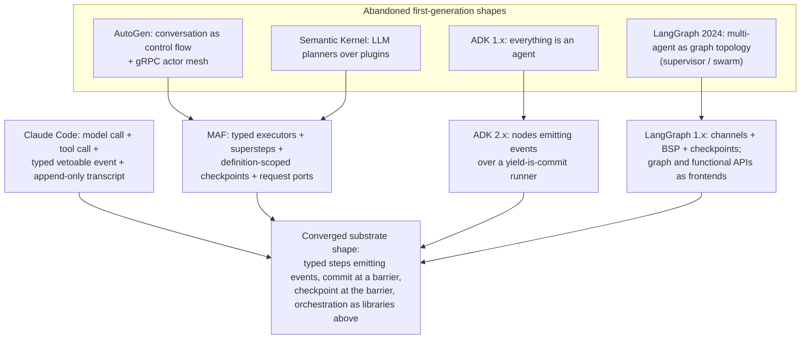
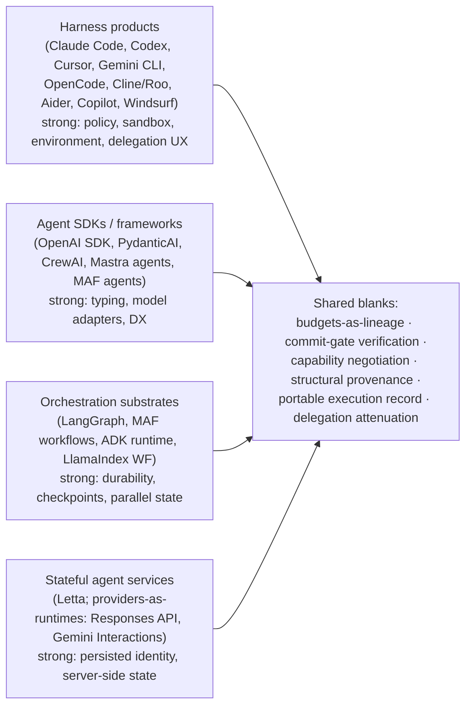

# 03 — Harness Comparison: Nineteen Systems, Thirty-One Dimensions

> **Post-review status (2026-08-16, phase 2).** This document was drafted before the adversarial
> review; the review's binding adjudications live in the Amendment log of
> `research/DESIGN-SPINE.md` (A1–A14), with the full findings in `research/ADVERSARIAL-REVIEW.md`.
> They are now reflected in the body.
> **Applied here:** A9(i) (note B1 rescoped to the seven source-inspected agents + Copilot-by-
> platform-docs + this table's own Windsurf `n/e` cell — §2.2), plus the two consistency fixes
> the confidence audit flagged: the PydanticAI cost-controls cell now reads **caps without
> lineage** (§2.6, note F1, §4.1 row 1) and every capability-negotiation cell is labelled with
> the **single information source** it carries (§2.5, note E2, §4.1 row 3). A2 and A13 are
> referenced where they change what Kyxo adds beyond the surveyed field (notes F1, E2).
> **Outstanding:** none. Where this document conflicts with the Amendment log, **the amendment
> log governs**.

Status: DRAFT for adversarial review. Written from `research/DESIGN-SPINE.md` (binding) and the
research notes cited per row; claim labels and confidence follow `research/METHODOLOGY.md`.
Sections that state design positions are OUR PROPOSAL by default; evidence claims carry
explicit labels. Vocabulary follows spine §2 exactly — *agent*, *harness*, *workflow*,
*durable execution*, etc. are never interchangeable here.

Cross-references: dimension definitions ground in doc 05 (05-KERNEL-PRIMITIVES.md);
orchestration strategy consequences in doc 04; the capability contract that answers the
negotiation findings in doc 06; failure semantics in doc 08; verification design in doc 16.

---

## 1. Scope, method, and rating scale

### 1.1 What is being compared

The title says "harness comparison" as shorthand; per spine §2 most of these systems are not
harnesses. Each row is classified before it is rated, because the same dimension means
different work at different altitudes (a *harness* that lacks graph support is making a
choice; an *orchestration substrate* that lacks a sandbox is staying in its lane). The
classification itself is a finding: the industry has stratified into four system classes that
correspond to different subsets of the kernel surface.

| # | System | Class (spine §2 terms) | Evidence tier | Primary note |
|---|---|---|---|---|
| 1 | Claude Code + Claude Agent SDK | Harness product + agent SDK (thin supervisor over closed harness binary) | Docs + SDK source; CLI binary closed | research/notes/anthropic-claude-code-agent-sdk.md |
| 2 | OpenAI Agents SDK | Agent SDK / library runtime (you own the process) | Source (MIT) | research/notes/openai-agents-sdk-codex.md |
| 3 | Codex (CLI/cloud) | Harness product behind an event protocol; cloud = managed execution environments | Source (Rust core) + docs; cloud proprietary | research/notes/openai-agents-sdk-codex.md |
| 4 | Cursor | Harness product, server-coupled, proprietary | Docs/press via search + captured artifacts; internals closed | research/notes/cursor.md |
| 5 | Google ADK 2.x | Framework + event-sourced runtime (nodes over a yield-is-commit runner) | Source + docs source | research/notes/google-adk.md |
| 6 | LangGraph | Orchestration substrate (channels + BSP + checkpoints); platform adds control plane | Source + docs source | research/notes/langgraph.md |
| 7 | Microsoft Agent Framework (MAF) | Framework + orchestration substrate + shipped harness layer | Source + ADRs | research/notes/microsoft-autogen-sk-agent-framework.md |
| 8 | AutoGen (legacy) | Actor runtime + conversation framework; maintenance mode | Source | research/notes/microsoft-autogen-sk-agent-framework.md |
| 9 | CrewAI | Framework (role teams + event-reaction flows) | Source + in-repo docs | research/notes/agent-frameworks-crewai-pydantic-llamaindex-mastra-letta.md |
| 10 | PydanticAI v2 | Agent SDK / typed framework with a capability extension system | Source + in-repo docs | research/notes/agent-frameworks-crewai-pydantic-llamaindex-mastra-letta.md |
| 11 | LlamaIndex Workflows | Orchestration substrate (event-driven steps) | Source + in-repo docs | research/notes/agent-frameworks-crewai-pydantic-llamaindex-mastra-letta.md |
| 12 | Mastra | Framework: schema-typed workflow engine + agents + memory system | Source + in-repo docs | research/notes/agent-frameworks-crewai-pydantic-llamaindex-mastra-letta.md |
| 13 | Letta | Stateful agent service (agent = persisted server state; harness interchangeable) | Source + docs snippets | research/notes/agent-frameworks-crewai-pydantic-llamaindex-mastra-letta.md |
| 14 | OpenCode | Harness product, client/server | Source | research/notes/coding-agents-landscape.md |
| 15 | Cline/Roo | Harness products (shared lineage; rated jointly, divergences flagged) | Source | research/notes/coding-agents-landscape.md |
| 16 | Aider | Edit pipeline with reflection valve (deliberately not an agent loop) | Source | research/notes/coding-agents-landscape.md |
| 17 | Gemini CLI | Harness product | Source + docs | research/notes/coding-agents-landscape.md |
| 18 | GitHub Copilot cloud agent | Platform pipeline (artifact-mediated); "(agent mode)" cells cite the same vendor's open-source VS Code harness | Platform docs; agent-mode source | research/notes/coding-agents-landscape.md |
| 19 | Windsurf/Cascade | Harness product, proprietary; press-level evidence only | Press/secondary | research/notes/coding-agents-landscape.md |

### 1.2 The rating scale (operational definitions)

No numeric scores. Each cell gets exactly one of five categorical ratings, defined by what an
integrator would experience, not by marketing claims:

- **ABS (ABSENT)** — no mechanism exists in the system for this dimension; achieving the
  behavior requires building it entirely outside the system's surface. ABSENT is an
  evidence-backed claim about what we inspected, not an abstention (see `n/e` below). Where a
  system's own docs declare the omission deliberate, we note it — deliberate absence is
  design information, not a defect.
- **EXT (VIA-EXTENSION)** — achievable through a documented external integration whose
  *semantics* the system does not own (e.g., durability via Temporal; distribution via a
  commercial control plane). The test: if the extension vanished, the dimension would revert
  to ABSENT without any change to the system's core.
- **BAS (BASIC)** — a shipped mechanism exists but with a narrow contract: a single knob, a
  convention rather than an enforcement, or a visibly retrofitted feature. The test: the
  mechanism works in the happy path but has no invariant the rest of the system is built on.
- **FC (FIRST-CLASS)** — a designed subsystem with its own contract, lifecycle, and
  documented invariants, load-bearing for other parts of the system.
- **DIF (DIFFERENTIATING)** — first-class *and* among the strongest instances in the surveyed
  field: a competitive differentiator, a mechanism others demonstrably copy, or the reference
  design our spine cites. More than one system may hold DIF on a dimension.

Markers: **†** = confidence LOW–MEDIUM (proprietary internals, indirect retrieval, or
press-level evidence; per METHODOLOGY, never above INFERENCE). **n/e** = not evidenced in our
notes either way — an abstention, deliberately distinct from ABS. Windsurf/Cascade and parts
of the AutoGen, Copilot-cloud and Cursor rows carry these markers heavily.

### 1.3 Dimension glossary

Dimensions are grouped into seven families (one table each in §2). Meanings, in spine-§2
terms, applied to each system's closest analogue:

| Dimension | Operational question |
|---|---|
| Model abstraction | Is there a model adapter boundary — can a different model be substituted without rewriting the system? |
| Model routing | Can model choice be made per-request/per-task by a mechanism (router, classifier, catalog metadata)? |
| Provider portability | Does the same system behavior survive moving across model APIs without redesign? |
| Agent loop | Quality/pluggability of the reactive strategy inside one harness turn cycle (termination, continuation policy). |
| Dynamic planning | Plan artifacts or plan modes produced/consumed at runtime (planner-as-component is dead everywhere; see §4.2). |
| Graph support | A declarative node/edge orchestration frontend with validation. |
| Static/dynamic workflow | Orchestration strategy artifacts: authorable, validatable, persistable, re-runnable; runtime mutability. |
| Subagents | Delegation to child executions with their own context (spine: delegation system). |
| Recursive delegation | Can delegates delegate; is depth/width controlled? |
| Parallelism | Concurrent tools/steps/child executions inside one logical run. |
| Context isolation/sharing | Mechanisms controlling which context a delegated or parallel execution sees. |
| Memory | Durable labeled state beyond the transcript (spine: memory system, not context management). |
| Durable execution | Journal/checkpoint/resume semantics owned by the system. |
| Checkpoint/resume | Named restorable cuts; fork/rewind semantics. |
| Distributed execution | One logical run (or roster) spanning processes/machines. |
| Event model | Internal event vocabulary: typed? append-only? vetoable? one stream or many? |
| Streaming | Incremental delivery of model/tool/lifecycle output to consumers. |
| Observability | Traces/metrics/cost accounting as projections of execution. |
| Cost controls | Enforced budgets (tokens, money, wall-clock, spawn) — not mere reporting. |
| Capability discovery | Enumerating what tools/capabilities exist (manifests, listings, search). |
| Capability negotiation | Computing a working feature set between consumer and provider (any mechanism: handshake, dialects, telemetry). |
| Extensibility | Sanctioned surfaces for third parties to change behavior (hooks, plugins, middleware, skills). |
| Failure recovery | Mid-run recovery: retries, fallbacks, partial-step recovery, repair loops. |
| Verification | Checking outputs/effects — in-loop feedback, out-of-loop gates, or commit-point gating. |
| Self-modification | The system durably modifying its own instructions/memory/capabilities, and whether that is governed. |
| Human approval | Humans as decision points: typed suspensions, approval RPCs, gated actions. |
| Permissions | The policy layer: rules, pipelines, enforcement vs persuasion. |
| Sandboxing | OS/VM/interpreter isolation of effects. |
| MCP / A2A | Support for the two protocols, as client and/or server. |

---

## 2. The matrix

Ratings reflect **our evidence base only** (the notes cited in §1.1). Contentious or
surprising cells are justified in the notes under each table.

### 2.1 Family A — model plane

| System | Model abstraction | Model routing | Provider portability |
|---|---|---|---|
| Claude Code + SDK | ABS (deliberate: Claude-only) | BAS | ABS |
| OpenAI Agents SDK | FC (fat interface — see A1) | BAS | BAS |
| Codex | FC (`wire_api` chat/responses) | BAS | FC |
| Cursor | FC† (server-side, per-model harness variants) | DIF (Cursor Router) | BAS (manual, weeks per model) |
| ADK 2.x | FC (Gemini-shaped interlingua — see A2) | BAS | BAS |
| LangGraph | ABS (deliberate: nodes are opaque callables) | ABS | EXT (via LangChain) |
| MAF | FC | ABS | FC |
| AutoGen (legacy) | BAS† | ABS | BAS† |
| CrewAI | BAS | ABS | BAS |
| PydanticAI v2 | FC | BAS | FC |
| LlamaIndex WF | EXT | ABS | EXT |
| Mastra | FC (AI SDK) | BAS | FC |
| Letta | BAS | ABS | BAS |
| OpenCode | FC (75+ providers) | ABS | FC |
| Cline/Roo | FC (fail-closed modality manifests) | ABS | FC |
| Aider | FC (per-model edit-format catalog) | BAS (architect/editor split) | FC |
| Gemini CLI | BAS (Gemini-specific) | FC (classifier router, quota fallback) | ABS |
| Copilot cloud agent | BAS | BAS | ABS |
| Windsurf/Cascade | BAS† | BAS† | n/e |

**A1.** SOURCE-CODE OBSERVATION (HIGH): the OpenAI `Model` interface receives `handoffs`,
`output_schema`, `previous_response_id`, `conversation_id` — agent semantics and provider
state leak into every adapter (research/notes/openai-agents-sdk-codex.md). Rated FC because
the boundary exists and works across providers; the leakage is the documented cost.

**A2.** SOURCE-CODE OBSERVATION (HIGH): ADK's `Event` extends `LlmResponse` — the Gemini
response shape reaches the persistence layer (research/notes/google-adk.md). Model-*pluggable*
is not model-*neutral*; FC with that ceiling.

**A3.** The two DIF/FC routing entries are instructive opposites: Cursor Router is a
proprietary server-side classifier with billing-load-bearing decisions (FACT via search
extract, research/notes/cursor.md); Gemini CLI's router is the only open-source classifier
router in the field (SOURCE-CODE OBSERVATION HIGH,
research/notes/coding-agents-landscape.md). Everyone else routes by static config.

### 2.2 Family B — execution model

| System | Agent loop | Dynamic planning | Graph support | Static/dynamic workflow |
|---|---|---|---|---|
| Claude Code + SDK | DIF | FC (plan mode + generated workflows) | ABS (deliberate) | FC (generated JS over `agent()`/`pipeline()`) |
| OpenAI Agents SDK | FC (closed NextStep union) | BAS | ABS (deliberate) | ABS (deliberate: "write code") |
| Codex | FC | BAS (`plan_tool`, Review) | ABS | ABS |
| Cursor | FC† | FC (Plan Mode → editable plan artifact) | ABS | ABS (Automations = triggers only) |
| ADK 2.x | FC (yield-is-commit runner) | BAS (planner = prompt shim) | FC (Workflow Runtime) | FC (graph + `ctx.run_node` + LLM-driven) |
| LangGraph | BAS (prebuilt, deprecated outward) | ABS (userland) | DIF (frontend; edges gone at runtime) | DIF (two frontends, one kernel) |
| MAF | FC (loop + `AgentLoopMiddleware`) | BAS (Magentic as library) | FC (typed executors/edges) | FC (code + YAML on one runner) |
| AutoGen (legacy) | FC | BAS (Magentic-One) | BAS (GraphFlow) | BAS |
| CrewAI | FC (dual grammar: native + ReAct) | BAS (AgentPlanner, manager) | BAS (implicit reaction graph) | FC (Flows) |
| PydanticAI v2 | FC (typed graph traversal) | ABS (graph is the plan) | FC (edges from return types) | FC |
| LlamaIndex WF | ABS (loops are flows you build) | ABS | BAS (recovered by static analysis) | FC (pub/sub steps + validation) |
| Mastra | FC | ABS | FC (combinators) | FC |
| Letta | FC (compile→LLM→tools→persist) | ABS | ABS | ABS |
| OpenCode | FC | BAS (plan agent = ruleset) | ABS | ABS |
| Cline/Roo | FC (`submit_and_exit` termination contract) | FC (Plan/Act; architect → todos-as-data) | ABS | ABS |
| Aider | BAS (reflection valve, `max_reflections=3`) | ABS | ABS | ABS |
| Gemini CLI | FC (next-speaker check + loop detection) | ABS | ABS | ABS |
| Copilot cloud agent | FC (autopilot caps; pipeline†) | FC (platform plan phase) | ABS | BAS (Automations) |
| Windsurf/Cascade | BAS† | BAS† | n/e | n/e |

**B1.** Evidence — scoped per amendment A9(i), which this table's own `n/e` cell forced:
zero of the **seven source-inspected** coding agents contain a graph engine (SOURCE-CODE
OBSERVATION/HIGH); the Copilot cloud agent shows none in its **documented pipeline** (FACT,
platform docs); Windsurf/Cascade is press-level only and is rated `n/e` in the Graph-support
column above — not evidenced either way, and therefore never counted as an absence. Every
"plan mode" in the inspected set is a policy profile (tool filtering) over the same loop
(research/notes/coding-agents-landscape.md and the vendor notes). Interpretation — the agent
loop is commoditized; systems differ only in *continuation policy* (next-speaker LLM check,
autopilot caps, mistake budgets, completion-tool contracts, judge middleware). Implication —
the kernel exposes loop events and leaves continuation to harness behaviours (spine §5).
Confidence — HIGH, unchanged: A9(i) narrows which systems the SCO label covers, not what the
inspected ones contain. Docs 02 §2.4/§3.1 and 04 §2.A/§4.1 now state the identical triple.

**B2.** The three FC/DIF workflow substrates (LangGraph, MAF, ADK) all compile their graph
frontends onto a non-graph kernel (channels/BSP; executors/supersteps; nodes/event-log) —
SOURCE-CODE OBSERVATION HIGH in each note. This is spine H1's convergence evidence restated
as a matrix column.

### 2.3 Family C — delegation and concurrency

| System | Subagents | Recursive delegation | Parallelism | Context isolation/sharing |
|---|---|---|---|---|
| Claude Code + SDK | DIF (background default, resumable, output-scanned) | FC (depth cap, default 3) | FC (annotation-driven tools; ≤16 workflow agents; teams) | FC (fresh-context children; forks share; skills disclose progressively) |
| OpenAI Agents SDK | FC (handoffs + agents-as-tools) | BAS (uncapped nesting) | BAS | BAS (handoff input filters) |
| Codex | BAS† (subagent profiles) | n/e | BAS (cloud best-of-N 1–4) | BAS (threads; AGENTS.md walk) |
| Cursor | FC (async, resumable by ID) | FC (subagent trees) | FC (8 worktree agents; best-of-N across models) | FC (own windows; worktrees) |
| ADK 2.x | FC (task mode, transfer, AgentTool) | BAS | FC (`max_concurrency`, branches) | FC (`branch`/`isolation_scope` filters over one log) |
| LangGraph | BAS (subgraphs; subagents-as-tools pattern) | BAS | FC (Send fan-out, reducers) | FC (namespaced checkpoints; private Send state) |
| MAF | FC (BackgroundAgentsProvider) | FC (sub-workflow request interception) | FC (edge groups, supersteps) | FC (`full_conversation` threaded explicitly; attribution) |
| AutoGen (legacy) | FC (group chat, Swarm) | BAS | BAS | BAS |
| CrewAI | FC (crews; manager delegation) | BAS (crews inside flows) | BAS (`and_`/`or_` joins) | BAS |
| PydanticAI v2 | BAS (agent-as-tool, deliberate minimum) | BAS (usage accrual composes) | BAS | BAS (caller-owned history) |
| LlamaIndex WF | BAS (workflows-as-steps) | BAS | FC (multi-subscriber fan-out) | BAS (one Context per run) |
| Mastra | FC (auto-scoped memory IDs) | BAS | FC (`.parallel`, `.foreach(concurrency)`) | FC (resource/thread scoping) |
| Letta | BAS (groups over shared blocks; sleep-time) | ABS | BAS | FC (shared blocks, real-time views) |
| OpenCode | FC (background, resumable `task_id`, derived permissions) | BAS | BAS | BAS (`explore` subagent protects context) |
| Cline/Roo | FC (boomerang; parallel research subagents w/ budgets) | BAS (Cline children can't nest) | BAS | FC (self-contained child instructions; result-only return) |
| Aider | ABS (only architect→editor model split) | ABS | ABS | BAS (editor gets empty history — deliberate) |
| Gemini CLI | FC (subagents-as-tools; remote A2A subagents) | BAS | BAS | BAS |
| Copilot cloud agent | BAS (custom agents) | ABS | BAS† | BAS (ephemeral env per task) |
| Windsurf/Cascade | BAS† (SWE-grep retrieval subagent) | n/e | BAS† (8 parallel calls) | n/e |

**C1.** Evidence — INF/HIGH from five independent implementations
(research/notes/coding-agents-landscape.md §6): a subagent is exactly *fresh session +
capability/policy diff + prompt + single result message*, with optional background,
resume-by-id, and separate budget. Interpretation — delegation is a configuration over
session/policy/budget primitives, not a mechanism. Implication — the kernel ships cells +
grants; the delegation system is userland (spine §2, §3). Confidence — HIGH.

**C2.** Only Claude Code enforces anything *tree-shaped* about delegation (budget cap
propagated across the subagent tree, spawn-depth env var, permission-mode inheritance that
children cannot relax — FACT, research/notes/anthropic-claude-code-agent-sdk.md). Nobody
implements attenuation as construction: child ≤ parent is convention or absent everywhere
else. This is spine gap 6.

### 2.4 Family D — state and durability

| System | Memory | Durable execution | Checkpoint/resume | Distributed execution |
|---|---|---|---|---|
| Claude Code + SDK | FC (CLAUDE.md tiers + auto memory) | BAS (transcript replay; no effect journal, no deadlines) | BAS (file snapshots ≠ session resume; split mechanisms) | BAS (cloud/self-hosted runners; teams) |
| OpenAI Agents SDK | BAS (Session = conversation storage; real memory only in sandbox beta) | EXT (Temporal GA; RunState not crash-safe) | BAS (RunState, schema-versioned, defs excluded) | EXT (Temporal; Responses background) |
| Codex | BAS (memories crate; AGENTS.md) | BAS (rollout JSONL, replayable) | FC (fork/rollback/resume as wire ops) | BAS (cloud containers; App Server surfaces) |
| Cursor | FC (sidecar memories, user-approved) | BAS (state transfer, no replay) | FC (per-turn checkpoints + `&` cloud handoff) | FC (local/worktree/cloud/SSH one roster) |
| ADK 2.x | FC (MemoryService; Vertex Memory Bank) | FC (event-sourced resume, replay barriers) | BAS (log-scan resume; rewind FC; checkpoint records pending) | EXT (Agent Runtime managed) |
| LangGraph | BAS (checkpointer + store; policy userland) | DIF (checkpoint-per-superstep, pending_writes, durability modes) | DIF (time travel, fork lineage, conformance suite) | EXT (platform: stateless workers over Postgres/Redis) |
| MAF | FC (context providers: mem0/Redis/Cosmos/file) | FC (superstep checkpoints core; DTF external) | DIF (definition-scoped, `graph_signature_hash`, lineage) | EXT (protocol hosting; mesh killed) |
| AutoGen (legacy) | n/e | ABS | n/e | FC (gRPC worker mesh — shipped, then killed) |
| CrewAI | FC (STM/LTM/entity + flow remember/recall) | BAS (`@persist` snapshots) | FC (resume-vs-fork semantics) | EXT† (AMP) |
| PydanticAI v2 | ABS (deliberately caller-owned) | EXT (six engines, shipped as capabilities) | BAS (graph persistence; resumable cancellation) | EXT |
| LlamaIndex WF | BAS (Context store = state, not memory) | BAS (serializable Context; DBOS package) | BAS | EXT (server/control-plane pkgs) |
| Mastra | FC (working/semantic/observational + processors) | FC (durable agents: loop in memoized workflow) | FC (snapshots, time travel, restart APIs) | EXT (Inngest) |
| Letta | DIF (blocks/tiers/self-editing — the reference) | FC (inherent: agent = DB state) | BAS (`.af` export; no run checkpoints) | BAS (cloud state / local harness split) |
| OpenCode | BAS | BAS (SQL + event projectors) | FC (git snapshot service: track/patch/restore/revert/diff) | BAS (client/server, sessions server-side) |
| Cline/Roo | BAS (rule files, focus chain) | BAS (hub authority runtime) | FC (shadow git per task, on by default, three-axis restore) | BAS (hub attach/detach) |
| Aider | ABS | ABS | BAS (real git auto-commits + `/undo`) | ABS |
| Gemini CLI | BAS (GEMINI.md + compression) | ABS | BAS (shadow git, off by default) | BAS (a2a-server experimental) |
| Copilot cloud agent | BAS† | BAS (branch + session logs; env ephemeral) | BAS (branch/PR as state) | FC† (platform-hosted async tasks) |
| Windsurf/Cascade | BAS† (memories) | n/e | BAS† | n/e |

**D1.** Evidence — the shadow-git checkpoint was independently implemented 4+ times (Gemini
CLI, Cline, Roo, OpenCode; SCO/HIGH, research/notes/coding-agents-landscape.md §8), with
Cline's three restore axes (files / task / both) the richest semantics. Interpretation —
checkpoint = (workspace state, conversation state, pending action), restorable per-axis, is
de facto standard semantics; storage mechanism is incidental. Implication — the kernel
Checkpoint object (spine §3.8) adopts the semantics and keeps storage pluggable. Confidence —
HIGH.

**D2.** Evidence — Temporal wrapped the unmodified OpenAI SDK (FACT); PydanticAI ships
Temporal/DBOS/Prefect as attachable capabilities (FACT); Mastra re-hosts its own agent loop
inside a memoized workflow (FACT). Interpretation — durability layers on precisely when
deterministic orchestration is separated from journaled effects; every serious attempt
rediscovers the split (spine H3). Implication — Kyxo enforces the split natively rather than
as an integration. Confidence — HIGH.

**D3.** Nobody in the field runs an in-kernel distributed mesh and thrives: AutoGen's gRPC
mesh is the one shipped attempt and MAF killed it (SCO/HIGH,
research/notes/microsoft-autogen-sk-agent-framework.md). Every surviving distribution story
is protocol edges + portable state (LangGraph's checkpoint contract; Cursor's `&` handoff;
Codex/Copilot cloud containers). Matches spine §8 "single-node first."

### 2.5 Family E — capability surface and interop

| System | Tools | MCP | A2A | Capability discovery | Capability negotiation | Extensibility |
|---|---|---|---|---|---|---|
| Claude Code + SDK | FC | FC (4 transports; deferral; 25k spill) | ABS | BAS (skill descriptions; tool search) | ABS | DIF (skills/plugins/hooks/marketplaces; agentskills.io) |
| OpenAI Agents SDK | FC (closed 13-type union — see E1) | FC (+hosted MCP) | ABS | BAS (`ToolSearchTool` deferral) | ABS | BAS (closed union: new venue = SDK change) |
| Codex | FC (execpolicy, code-mode, dynamic tools) | FC (client + server) | ABS | BAS (`initialize` handshake; capabilities.rs) | BAS — **fragment, one source: handshake** (App Server `initialize`; protocol features only, no axes/tiers, no probe, no telemetry) | FC (hooks, skills, plugins, connectors) |
| Cursor | FC† (per-model tool renaming) | FC | ABS | BAS (agent-requested rules; skills metadata) | ABS (per-model skinning done by humans) | FC (MCP/hooks/skills/ACP; core closed) |
| ADK 2.x | FC (`process_llm_request` rewriting; toolsets) | FC (consume + expose agent as server) | FC (bidirectional, reference impl, experimental) | BAS (cards + listings at edges) | ABS | FC (plugins, processors, feature registry) |
| LangGraph | EXT (ToolNode in prebuilt/LangChain) | EXT (adapters; platform exposes) | EXT (platform `/a2a`) | ABS | ABS | FC (channels, checkpointers + conformance, serde) |
| MAF | FC (middleware + approval + budgets) | FC (client/server/skills/IFC labels) | FC (client + hosting) | BAS (structural `Supports*Tool` protocols) | ABS (structural typing is the ceiling) | FC (3-level middleware, providers, staged features) |
| AutoGen (legacy) | BAS† | BAS† | ABS | ABS | ABS | BAS |
| CrewAI | BAS | BAS | ABS | ABS | ABS | BAS |
| PydanticAI v2 | FC (toolsets, deferred tools, output functions) | FC (client + server) | ABS (not in evidence) | BAS (on-demand capability loading) | ABS | DIF (capabilities system — spine H2 prior art) |
| LlamaIndex WF | EXT | EXT | ABS | ABS | ABS | BAS (retry policies, resources, runtime abstraction) |
| Mastra | FC | FC | ABS | ABS | ABS | BAS |
| Letta | FC (uniform action space incl. `send_message`) | BAS | ABS | ABS | ABS | BAS |
| OpenCode | FC (LSP fused into edit results) | FC | ABS | BAS | ABS | BAS (agents-as-config; ACP) |
| Cline/Roo | FC (native tool-call parser) | FC | ABS | BAS | BAS — **fragment, one source: declaration** (provider operation manifests, fail-closed; one-sided, untiered, never verified against behaviour) | FC (modes, SDK layers, hub) |
| Aider | ABS (edits are the output format) | BAS | ABS | ABS | BAS — **fragment, one source: declaration** (per-model edit-format dialects, static catalog; chosen, not negotiated) | BAS |
| Gemini CLI | FC (scheduler state machine per call) | FC | DIF (only system consuming *and* serving A2A in its class) | BAS | ABS | BAS |
| Copilot cloud agent | FC (platform tools; virtual tool grouping (agent mode)) | FC | ABS | BAS | BAS — **fragment, one source: outcome telemetry** (`EditToolLearningService` windowed success bitsets per model×tool, agent mode; no declaration or probe layer to reconcile against) | BAS |
| Windsurf/Cascade | BAS† | BAS | ABS† | n/e | n/e | BAS† (hooks) |

**E1.** SOURCE-CODE OBSERVATION (HIGH): OpenAI's Tool union bakes execution venue (SDK
process, host, provider infra, hosted V8, sandbox) into the *type*; adding a venue is an SDK
change (research/notes/openai-agents-sdk-codex.md). The counter-design is the spine's
capability manifest: venue, isolation, approval, discoverability as orthogonal attributes of
one primitive.

**E2 (the negotiation-column reconciliation).** Evidence — four BASIC cells, and each is a
**fragment carrying exactly one information source**, which is why none of them is rated
above BASIC and why the spine's gap map (§6, gap 3) can say "nothing negotiates today"
without contradicting this table:

| Fragment | Its one information source | What it cannot do |
|---|---|---|
| Aider per-model edit-format catalog (SCO/HIGH) | **declared** (static, one-sided) | verify the declaration; adapt on failure; express tiers |
| Cline/Roo provider operation manifests, fail-closed (SCO/HIGH) | **declared** (static, one-sided) | negotiate — it refuses rather than degrades or intersects |
| Codex App Server `initialize` capabilities (SCO/HIGH; semantics MEDIUM) | **declared**, exchanged two-sidedly at the *protocol* layer | say anything about model-interaction axes; no tiers, no probes |
| Copilot `EditToolLearningService` (SCO/HIGH, agent mode) | **observed outcome telemetry** | state a contract up front; gate eligibility before spend |

Interpretation — the field has fragments of two of the three information sources C3 requires
(declared, probed, observed). **Probing is at zero instances**: no surveyed system executes a
capability probe and caches the result as evidence. Nothing is two-sided *and* axis-typed
*and* tiered; MCP/A2A discovery lists but does not negotiate. A BASIC rating here means "one
source, no intersection", not "partial negotiation". Implication — spine H2/H4 and doc 06:
the Kyxo contract must combine all three sources, and must supply the missing one itself,
because each fragment above proves exactly one of them necessary and none proves it
sufficient. Per amendment A13, the combined result gates **eligibility**; choosing among
eligible candidates is a separate routing-strategy contract. Confidence — HIGH.

### 2.6 Family F — governance

| System | Human approval | Permissions | Sandboxing | Cost controls |
|---|---|---|---|---|
| Claude Code + SDK | FC (prompts, `canUseTool`, escalate) | DIF (six-step pipeline; deny survives bypass; expiring per-turn grants) | DIF (Seatbelt/bubblewrap + egress proxy + credential masking; model-visible violations) | BAS (`maxBudgetUsd` tree-wide — retrofitted v2.1.217; depth/concurrency as env vars) |
| OpenAI Agents SDK | FC (`needs_approval` → interruption → resume) | BAS (guardrails at 3 fixed positions) | BAS (sandbox package, beta) | ABS (only `max_turns`) |
| Codex | FC (server→client approval RPCs; `Granular`) | FC (approval × sandbox two-axis matrix; execpolicy) | DIF (Seatbelt/Landlock+seccomp; network-off default; `ExternalSandbox`) | ABS (TokenCount is reporting; cloud enforcement n/e) |
| Cursor | FC (gates, hooks allow/block) | FC (token grammar `Shell()`/`Read()`/`Write()`/`Mcp()`; admin-required rules) | FC (dynamic Seatbelt profiles; early secret-exposure caveats) | BAS† (router cost modes; no user budget primitive) |
| ADK 2.x | FC (ToolConfirmation; auth round-trips; interrupts) | BAS (imperative plugins/callbacks; no declarative policy) | BAS (pluggable executors; BaseEnvironment experimental; no default) | BAS (`max_llm_calls` only) |
| LangGraph | FC (`interrupt()`/`Command(resume)` — re-execution leak) | ABS (HITL is the de facto authorization) | ABS (in-process arbitrary Python) | ABS (`recursion_limit` only) |
| MAF | DIF (typed request ports persisted in checkpoints) | DIF (approval rules + FIDES IFC — field's only deterministic taint enforcement, opt-in) | FC (Hyperlight WASM; Monty interpreter) | BAS (function-invocation budget in harness) |
| AutoGen (legacy) | BAS (UserProxy pattern) | BAS (InterventionHandler on the bus) | n/e | ABS |
| CrewAI | BAS (`@human_feedback`, LLM-interpreted) | ABS (RBAC only in proprietary AMP) | ABS | BAS (usage metrics, tool `max_usage_count` — mostly measurement) |
| PydanticAI v2 | BAS (via graph iteration/persistence + durable engines) | ABS (UsageLimits is budget, not policy) | ABS | FC — **caps without lineage** (UsageLimits: tokens/requests/tool-calls/spend, enforced per run; delegation accrual is manual via `usage=ctx.usage` and is *lost* across a durability boundary; no attenuation, no per-branch attribution; see F1) |
| LlamaIndex WF | FC (InputRequired/HumanResponse events first-class in validation) | ABS | ABS | ABS |
| Mastra | DIF (`suspendSchema`/`resumeSchema` typed suspension — spine's Invocation pattern) | ABS | ABS | ABS |
| Letta | ABS | ABS (server auth; partial tool rules) | BAS (letta-code harness options) | BAS (block char limits; token accounting) |
| OpenCode | FC (rulesets default `ask`; session always-allow) | FC (per-agent rulesets, last-match-wins; agents = permission profiles) | ABS (worktrees only) | ABS |
| Cline/Roo | FC (auto-approve groups; mistake-limit asks) | BAS (groups; mode-scoped tool groups w/ file regex) | ABS | BAS (per-subagent token/cost tracking rolled into totals) |
| Aider | BAS (interactive confirms) | ABS (git is the safety mechanism, by design) | ABS | BAS (`map_tokens` context budget) |
| Gemini CLI | FC (`awaiting_approval` state; confirmation bus) | FC (TOML rule engine w/ priorities; shell-safety analysis) | FC (Seatbelt/container) | ABS |
| Copilot cloud agent | FC (draft-PR-only; human-gated CI; requester-cannot-approve) | DIF (enforcement at credential/platform layer: branch-scoped tokens, firewall) | FC (ephemeral Actions VM + egress firewall) | n/e |
| Windsurf/Cascade | BAS† | n/e | n/e | n/e |

**F1 (the cost-controls reconciliation).** Evidence — the entire cost-controls column: ten
ABS/n-e cells; the best shipped surfaces are one retrofitted tree-wide USD cap (Claude Code),
**caps without lineage** (PydanticAI UsageLimits: real enforcement per run, but delegation
accrual is hand-carried in user code via `usage=ctx.usage`, and Temporal's activity boundary
copies the context so a child agent's spend is silently never charged to the parent — FACT,
research/notes/durable-execution.md §2), one integer (`max_llm_calls`, ADK), and tracking
without enforcement (CrewAI, Cline). Interpretation — the FIRST-CLASS rating on the
PydanticAI cell measures the *cap* mechanism, which is genuinely designed, contract-bearing
and load-bearing for the framework; it does **not** measure lineage, of which there is none.
Budgets are universally bolted on and nowhere an attenuable, hierarchical resource with
lineage; the closest thing to attenuation is Claude Code's tree-wide cap plus non-relaxable
permission-mode inheritance. This is the whole of the apparent tension with spine gap 1 — the
gap is lineage, not caps, and one FC cell in this column is therefore consistent with "budgets
as resource lineage are absent everywhere". Implication — spine gap 1 and the Grant object
(§3.7) are confirmed as the field's largest open surface. Enforcement semantics live in doc 08
and are now **reserve-at-lease / settle-at-outcome / release-remainder** per amendment A2:
what Kyxo adds beyond a cap is (a) reservation before dispatch, so exhaustion is detectable
before spend, (b) settlement at outcome against every ancestor grant, so a child's spend
cannot be lost at a boundary the way PydanticAI's is, and (c) attenuation as construction.
Confidence — HIGH.

**F2.** Evidence — Copilot cloud enforces at the credential and network layer (push
restricted to `copilot/*` branches by credential design; default-on firewall; draft-PR-only —
FACT); Codex separates approval intent from sandbox mechanism (FACT); Claude Code's deny
rules and hooks survive `bypassPermissions` (FACT). Interpretation — the mature end of the
field already knows enforcement lives in what the environment *can* do, not in what the model
is told; prompts are persuasion, grants are enforcement. Implication — the kernel's
policy pipeline + Grants encode this two-tier trust model as an invariant. Confidence — HIGH.

### 2.7 Family G — events, observation, reliability

| System | Event model | Streaming | Observability | Failure recovery | Verification | Self-modification |
|---|---|---|---|---|---|---|
| Claude Code + SDK | DIF (32 typed vetoable hooks; 5 handler runtimes incl. LLM) | FC | FC (OTel; per-tree cost) | BAS (transcript resume; in-flight lost; no leases) | BAS (model-performed + hook gates) | FC (auto memory, skill/workflow authoring; trust-gated) |
| OpenAI Agents SDK | BAS (streams + lifecycle hooks; point-to-point) | FC (incl. realtime second loop) | FC (typed spans, 30+ processors) | BAS (error handlers, tripwires) | BAS (guardrails + output schemas) | ABS |
| Codex | DIF (SQ/EQ + App Server JSON-RPC — spine's outer-protocol template) | FC (JSONL item streams) | FC (OTel; W3C trace ctx on submissions) | BAS (resume, RecoverTurn) | BAS (Review mode, output schemas, execpolicy) | BAS |
| Cursor | BAS (hooks out, Automations in; no public log) | FC† | BAS (transcripts, hook taps, enterprise audit) | BAS† (reapply escalation; checkpoint restore) | FC (Bugbot multi-pass + validator voting; browser iteration; best-of-N) | BAS (memories; `agentCanUpdateSnapshot`) |
| ADK 2.x | DIF (one append-only Event log; yield-is-commit) — see G1 | FC (SSE/BIDI live) | FC (OTel GenAI semconv) | FC (retries/timeouts, resume, rewind) | BAS (schema validation inline; eval offline; no gate) | ABS |
| LangGraph | BAS (stream modes as bus; no typed journal) | FC (7 modes, subgraph propagation) | BAS (LangSmith proprietary; debug streams OSS) | FC (retry/timeout/error-handler; pending_writes; drain) | ABS | ABS |
| MAF | FC (one discriminated union) | FC | FC (OTel; trace ctx survives checkpoints) | FC (checkpoint rehydration, retries) | BAS (judge middleware, todo predicates — loop-termination, not gate) | ABS |
| AutoGen (legacy) | FC (typed pub/sub topics, CloudEvents) | BAS | BAS | ABS | ABS | ABS |
| CrewAI | BAS (observability bus ≠ execution triggers) | BAS | BAS | BAS | BAS (manager validates; guardrails MEDIUM) | ABS |
| PydanticAI v2 | BAS (AgentStreamEvent) | FC | FC (Logfire/OTel) | FC (ModelRetry repair loop w/ retry budgets; fallback models) | FC (typed output validation as termination) | ABS |
| LlamaIndex WF | DIF (events ARE execution — unique) | FC | FC (OTel/Phoenix auto) | BAS (per-step retry policies) | ABS | ABS |
| Mastra | BAS (stream chunks, pubsub, signals) | FC (resumable via `observe(runId)`) | FC (OTel + scorer records) | FC (auto durable-agent recovery) | FC (sampled per-step scorers, persisted — observers, not gates) | ABS |
| Letta | BAS (message stream) | BAS | BAS (context-window inspector — uniquely inspectable compile) | BAS | ABS | DIF (self-editing memory is the founding design; sleep-time dreaming) |
| OpenCode | FC (server bus + projectors) | FC | BAS | BAS | FC (LSP diagnostics fused into edit results — zero extra turns) | ABS |
| Cline/Roo | FC (hub lifecycle events, requestId/clientId correlation) | BAS | BAS | BAS (mistake budgets, restore) | BAS (checkpoint diff review; debug mode) | BAS (agent-edited rule files) |
| Aider | ABS | BAS | ABS | FC (apply fallback ladder + structured-error reflection) | FC (auto-lint default-on + tests feeding reflection) | ABS |
| Gemini CLI | BAS (confirmation bus + stream) | FC | BAS | BAS (model fallback; loop-detection abort) | BAS (hooks; loop detection; citation checks) | ABS |
| Copilot cloud agent | BAS (GitHub artifacts as the event medium) | BAS | FC (session logs, audit, signed commits) | BAS (iterate on CI/review) | DIF (CodeQL + advisory DB + secret scanning + human-gated CI — institutional pipeline) | ABS |
| Windsurf/Cascade | n/e | BAS† | n/e | n/e | BAS† (lint-fix claims, LOW) | n/e |

**G1.** Evidence — ADK's single append-only Event log folds state, checkpoints, undo,
compaction, routing, HITL and UI from one record type (SCO/HIGH) — and its envelope widening
(`Event` extends `LlmResponse`; 2.0 schema additions broke downstream validators — FACT) is
the documented cost of doing it untyped. Interpretation — event-sourced truth works; untyped
envelopes rot. Implication — spine §3.4: typed, versioned Event, inheriting from no provider
shape. Confidence — HIGH.

**G2.** Evidence — verification cells cluster at exactly two altitudes: in-loop feedback
(OpenCode LSP-fused results, Aider reflection, PydanticAI ModelRetry, MAF judge loops,
Mastra scorers) and out-of-loop institutional gates (Copilot's CodeQL/secret-scanning/human-
gated CI). No system gates the *commit of an outcome into its own record of truth* —
ADK's note records the absence explicitly, as do the durable-execution and A2A notes cited in
spine §6. Interpretation — both altitudes are real and needed; the commit point between them
is unowned. Implication — the verification hook of spine §5 / doc 16 is genuine
differentiation, not repackaging. Confidence — HIGH.

---

## 3. Architectural identities

One sentence of computational model; what the system hard-codes; its most instructive
mechanism. Ratings above justify themselves through these.

**Claude Code + Claude Agent SDK.** A closed reactive harness reducible to four primitives —
model call, tool call, typed vetoable event, append-only transcript — with subagents, skills,
workflows and checkpoints as compositions. Hard-codes: Claude as the only model (behavior
patched per model version in the system prompt); the six-step permission order; termination
by no-tool-call. Most instructive mechanism: progressive disclosure as context economics —
capability *metadata* (skill descriptions, deferred MCP schemas) addressed separately from
capability *payload* — plus the hook bus whose handlers can themselves be models.

**OpenAI Agents SDK.** Agent-as-dataclass, Runner-as-loop, with every turn resolving to a
closed four-way union: continue / handoff / final / pause-for-approval. Hard-codes: the
union's detection heuristics (no-pending-tools ⇒ done; first handoff wins) and the 13-member
tool union that types the execution venue. Most instructive mechanism: handoffs
source-verified as ordinary function tools plus a runner-side interception rule — proof that
delegation needs interception, not a primitive (research/notes/openai-agents-sdk-codex.md).

**Codex.** One Rust harness core behind an event-sourced submission/event protocol
(SQ/EQ, App Server JSON-RPC), serving CLI, IDE, desktop, web and cloud from a replayable
rollout JSONL. Hard-codes: the approval-policy × sandbox-policy two-axis matrix; per-release
generated protocol schemas (the documented drift failure the Kyxo protocol versioning
answers, spine §8). Most instructive mechanism: server→client approval RPCs — the human is a
wire-level participant whose *response* is part of the protocol — and fork/rollback as log
operations.

**Cursor.** A server-coupled proprietary harness whose per-model variants are the unit of
engineering, running agents as portable conversation+workspace state across local, worktree,
cloud and SSH substrates. Hard-codes: server-side context assembly and Cursor-cloud transit
for all model traffic. Most instructive mechanism: per-model harness adaptation — tools
renamed to match a model's RL training distribution, reasoning traces preserved at a measured
~30% penalty when dropped (FACT via search extract) — plus the `&` handoff proving
state-transfer migration commercially. This row is the spine's C2 evidence: harness quality
IS model coupling.

**Google ADK 2.x.** Nodes emitting events over a yield-is-commit runner, with declarative
graph, imperative `ctx.run_node`, and LLM-driven transfer as interchangeable frontends over
one append-only log — Google's own 1.x "everything is an agent" deprecated one major version
after shipping. Hard-codes: Gemini shapes as interlingua down to the persisted event.
Most instructive mechanisms: yield-is-commit (effects commit atomically when the runner
accepts the event) and context visibility as a filter over the shared log
(`branch`/`isolation_scope`).

**LangGraph.** Channels + version-vector BSP scheduling + barrier checkpoints; StateGraph and
the Temporal-shaped functional API are compilers onto that kernel, and edges do not exist at
runtime. Hard-codes: the super-step as the durability quantum — the source of the
`interrupt()` re-execution leak and its idempotency disciplines. Most instructive mechanism:
deterministic task identity (uuid5 over checkpoint/namespace/step/path) as the linchpin of
resume, memoization, error routing and fork — the precedent for Kyxo's deterministic
invocation identity (spine §5).

**Microsoft Agent Framework.** Typed executors + typed conditional edges + Pregel supersteps
+ definition-scoped checkpoints + one discriminated event union; group chat, handoff,
Magentic, and a Claude-Code-class harness are all libraries over that substrate. Hard-codes:
last-write-wins within a superstep; message-typed routing. Most instructive mechanisms: typed
request/response ports persisted *inside* checkpoints — HITL, approvals and parent-mediated
delegation as one primitive — and FIDES: integrity/confidentiality labels enforced
deterministically at the tool boundary, the only shipped information-flow control in the
field (opt-in middleware, hence spine gap 4).

**AutoGen (legacy).** A virtual-actor pub/sub runtime (Orleans-style addressing, typed topic
subscriptions, gRPC worker mesh) with conversation patterns layered above; now in maintenance
mode. Hard-codes: conversation as the state object. Its instructive contribution is its
death: both conversation-as-control-flow and the distributed actor mesh were dropped in the
MAF convergence — distribution moved to protocol edges, exactly the spine's non-primitive
list.

**CrewAI.** Two computational models stapled together: LLM-orchestrated role teams (crews)
demoted to callable components inside developer-orchestrated event-reaction flows
(`@start`/`@listen`/`@router` with typed state). Hard-codes: the role/goal/backstory
template and the decorator DSL. Most instructive mechanism: resume-vs-fork rehydration on
`@persist` snapshots — the cleanest checkpoint-identity semantics in the framework cohort —
and the framework's own demotion of its headline abstraction.

**PydanticAI v2.** A typed state machine whose run traverses an explicit graph, with
schema-validated output as the termination condition and validation failure feeding a bounded
repair loop. Hard-codes: Pydantic as the universal validation substrate; the fixed
prompt→model→tools node shape. Most instructive mechanism: the capabilities system —
attachable bundles contributing tools + lifecycle hooks + instructions + model settings +
model *selection*, loadable on demand by the model, with durability itself shipping as a
capability. This is the spine's H2 prior art and the nearest existing relative of the Kyxo
Capability object.

**LlamaIndex Workflows.** Type-routed pub/sub: emitting an event of type T *is* the routing
act; the graph exists only as static analysis over annotations, validated before running.
Hard-codes: event classes as the only routing currency; asyncio. Most instructive property:
it is the only surveyed system where the observability stream and the execution substrate are
the same thing — the spine's event-system design (§3.4, truth plane = execution) generalizes
exactly this.

**Mastra.** Explicitly composed, schema-typed step graphs where every boundary is a validated
contract and pausing is a typed operation. Hard-codes: schema validation at every boundary;
the combinator vocabulary; the Vercel AI SDK model layer. Most instructive mechanisms:
`suspendSchema`/`resumeSchema` typed suspension — adopted verbatim as the Kyxo Invocation
suspension pattern (spine §3.3) — and `createDurableAgent`, which re-hosts the agent loop
inside a memoized workflow, demonstrating loop-and-workflow as two strategies over one
substrate within a single product.

**Letta.** The agent *is* its state: the context window is compiled per step from
database-resident labeled blocks; memory editing is ordinary tool calls; memory management is
reassignable to a sleep-time principal over shared blocks. Hard-codes: the memory hierarchy
and its tool names; server-side persistence of everything. Most instructive mechanisms:
`Memory.compile()` as a deterministic, token-accounted context construction over persisted
state — the spine's memory-system reference — and the cloud-state/local-harness split, which
makes the harness stateless and interchangeable.

**OpenCode.** The purest client/server coding harness: sessions live in an HTTP+WebSocket
server with event projectors; agents are permission profiles; delegation is background,
resumable, permission-derived. Hard-codes: agents-as-rulesets. Most instructive mechanism:
LSP diagnostics fused into the edit tool's return value — typed verification with zero extra
turns — the concrete model for in-loop verifier attachment in doc 16.

**Cline/Roo.** A layered stateless-loop/stateful-core harness (Cline SDK: `@cline/agents` vs
`@cline/core`, hub daemon with attach/detach) and a mode-based fork (Roo) sharing the
shadow-git checkpoint lineage. Hard-codes: mode/tool-group taxonomy. Most instructive
mechanisms: Roo's boomerang delegation — the child receives only self-contained instructions
and returns only a summary the prompt declares "the source of truth" — and Cline's three-axis
restore (files / task / both), the richest checkpoint restore semantics surveyed.

**Aider.** Deliberately not an agent loop: one completion whose text *is* the edit in a
declared per-model format, applied by a fallback ladder (exact → whitespace-tolerant →
elision handling → fuzzy at 0.8), with a bounded reflection valve (`max_reflections=3`).
Hard-codes: edit formats as the model's output contract; git as the safety mechanism. Most
instructive mechanism: per-model edit dialects in the model catalog plus the architect/editor
cross-model split — capability dialect selection before anyone named it, and half of the
spine's H2 amendment.

**Gemini CLI.** The canonical tool loop with the field's most reified machinery around it: a
per-call scheduler state machine (`validating → scheduled → awaiting_approval → executing →
…`), an LLM next-speaker continuation check, a repetition-detecting loop service, a TOML
policy engine with priorities, and a classifier model router. Hard-codes: the Gemini API.
Most instructive properties: the tool-call lifecycle as an explicit state machine with
approval as a *state*, and being the only coding harness that both consumes and serves A2A —
the one live experiment in cross-runtime federation in its class.

**GitHub Copilot cloud agent.** An artifact-mediated remote pipeline — task → ephemeral
Actions VM → draft PR — whose "protocol" is GitHub itself (issues, branches, review threads,
logs). Hard-codes: GitHub as the medium; draft-PR-only output. Most instructive mechanisms:
enforcement at the credential layer (branch-scoped tokens, default-on firewall,
requester-cannot-approve preserving review semantics) and the platform verification pipeline
(CodeQL, advisory DB, secret scanning, human-gated CI). In the same vendor's open-source
agent mode, `EditToolLearningService` is the field's only *empirical* capability negotiation
— measured per-model edit-tool success driving tool exposure.

**Windsurf/Cascade.** Proprietary; press-level evidence only (all cells †, INFERENCE at
best). Apparent model: Cascade flows over task-specialized in-house models, with retrieval
itself an RL-trained subagent (SWE-grep: ≤4 turns, up to 8 parallel grep/read/glob calls,
~2,800 tok/s — OBSERVED BEHAVIOR, MEDIUM). Instructive even at low confidence: retrieval as a
fast, purpose-trained harness×model pair — independent support for the spine's C2 conclusion
that harness×model pairs specialize, per function, below any universal harness.

---

## 4. Findings

### 4.1 Universally weak — the gap map, confirmed column by column

Each of the spine's six claimed gaps (§6) corresponds to a matrix column (or column pair)
whose best cell tops out at BASIC or at a single opt-in FIRST-CLASS:

| Spine gap | Matrix evidence | Best-in-field, and why it falls short |
|---|---|---|
| 1. Grants: hierarchical budgets + authority with attenuation | Cost controls column: 10 of 19 ABS/n-e | PydanticAI UsageLimits — **caps without lineage** (real per-run enforcement; delegation accrual hand-carried and lost at a durability boundary); Claude Code tree-wide USD cap (retrofitted, one currency). No lineage, no attenuation-on-delegation as construction, and no reservation before dispatch (note F1) |
| 2. Verification at the commit point | Verification column: strong at two altitudes, empty in the middle (note G2) | Copilot's institutional pipeline gates *PR promotion*, not the agent's own record; Mastra scorers observe, never block; MAF judges terminate loops, never gate commits |
| 3. Axis-typed capability negotiation | Negotiation column: 4 BASIC fragments, 15 ABS (note E2) | Each fragment carries **exactly one** information source — three declared (Aider, Cline/Roo, Codex handshake), one observed telemetry (Copilot); **probing is at zero instances**. None is two-sided *and* axis-typed *and* tiered, and none intersects sources |
| 4. Structural provenance/taint | No dedicated column; surfaced under permissions/context: MAF FIDES (opt-in middleware), Claude Code subagent-output pattern-scanning (retrofit), ADK/MAF attribution markers (annotations) | FIDES is deterministic and real but per-framework and opt-in; nobody makes labels a runtime invariant |
| 5. Portable execution record | Every system has a log or checkpoint format — JSONL transcripts (CC), rollout JSONL (Codex), Event log (ADK), channel checkpoints (LG), definition-scoped checkpoints (MAF), RunState (OAI, "supported schema versions" lists) — all proprietary and version-bound | LangGraph is the only one that conformance-tests its storage interface; none publishes an interchange format |
| 6. Delegation attenuation / recursion control | Subagents commoditized (note C1); recursion column mostly BAS/uncapped | Claude Code's depth/concurrency env vars + non-relaxable mode inheritance are the ceiling — convention plus two knobs, not construction |

OUR PROPOSAL: these six columns are Kyxo's product surface precisely because they are the
only columns where the field-wide maximum is this low. Everything else in the matrix has at
least one DIF incumbent.

### 4.2 Commoditized — the floor everyone stands on

These dimensions are solved, convergent, and not worth competing on; the kernel should host
them, not reinvent them:

- **The agent loop.** One canonical native-tool-call loop across every harness; all variation
  is continuation policy (note B1). The planner-as-component is dead in every stack surveyed
  — SK's planners deprecated, ADK's `BasePlanner` a prompt shim, "plan mode" a policy profile
  everywhere (FACT/SCO across notes).
- **MCP.** Universal client support; server-side exposure increasingly common (Codex, ADK,
  MAF, PydanticAI, LangGraph platform). The tool edge is standardized; doc 06 projects onto
  it rather than replacing it.
- **The subagent algebra.** Session + capability/policy diff + budget + single result message,
  five-plus independent convergences (note C1).
- **Loop interposition (hooks).** Claude Code, Cursor, Codex, and Gemini CLI ship isomorphic
  stdin-JSON / allow-block lifecycle hooks — a de facto standard the kernel's policy pipeline
  subsumes (INFERENCE/HIGH, research/notes/cursor.md, research/notes/coding-agents-landscape.md).
- **Shadow-git workspace checkpointing** (note D1) and **instruction-file hierarchies**
  (AGENTS.md/CLAUDE.md/GEMINI.md/rules — every harness).
- **Typed event streams for observation + OTel export.** Nearly every FC observability cell is
  OpenTelemetry; the exceptions are proprietary SaaS (LangSmith) or platforms (Copilot).

### 4.3 Differentiating — where products actually compete

The DIF cells cluster on a short list, and it is not the list the frameworks market:

1. **Harness×model co-tuning.** Cursor's per-model harness variants and in-harness RL
  training; Copilot's per-model prompt snapshots and learned edit-tool selection; Aider's
  per-model edit formats; Anthropic's model-conditional system-prompt lines. Evidence —
  FACT/SCO across four vendors. Interpretation — the harness is inside the model's training
  distribution and vice versa; neutrality is not on offer (spine C2). Implication — Kyxo
  hosts versioned, benchmarkable harness×model pairs; the kernel and record format carry the
  model-independence. Confidence — HIGH.
2. **Sandboxing and enforcement depth.** Claude Code (credential-masking egress proxy), Codex
  (network-off default, two-axis policy), Copilot (credential-layer enforcement). The
  strongest governance in the field is physical, not textual.
3. **Model routing as a policy product** (Cursor Router — billing-load-bearing; Gemini CLI's
  OSS classifier router).
4. **Durable-execution substrates** (LangGraph and MAF checkpointing; Mastra durable agents)
  — commoditizing *within* the framework class but still absent from every harness product.
5. **Context construction/retrieval** — four coexisting philosophies (PageRank map, hybrid
  index, RL retrieval subagents, agentic grep) with no convergence; correctly out of the
  kernel (spine §5).
6. **Memory architecture** (Letta) and **event-protocol surfaces** (Codex App Server) — each
  effectively defining its sub-field.
7. **Verification products** (Bugbot's voting validator; Copilot's institutional pipeline) —
  monetized precisely because the runtime layer beneath them offers no verification hook.

### 4.4 Structural reading — three system classes, one missing substrate

Evidence — the four convergences above, each SOURCE-CODE OBSERVATION/HIGH in its note, each
reached independently under production pressure. Interpretation — spine H1: loop, graph,
workflow, planner, supervisor, swarm are orchestration strategies; none is kernel material.
Implication — Kyxo starts where these systems *arrived*. Confidence — HIGH.

The class structure explains the complementary gap pattern in the matrix:

No class fills another's blanks: harness products have the field's best policy and worst
durability; substrates have the best durability and no policy, sandbox, or model awareness at
all (LangGraph's permissions/sandbox/verification cells are ABS); SDKs have the best typing
and the thinnest governance; and the provider-side runtimes (Responses API state and hosted
tools, Gemini Interactions, server-side compaction) are absorbing execution *out of all
three* — which is why spine §5 models them as federated remote cells rather than wrapped
functions (INFERENCE/HIGH, research/notes/openai-agents-sdk-codex.md,
research/notes/google-adk.md).

### 4.5 What the matrix fixes in the Kyxo design

OUR PROPOSAL — consequences this comparison makes binding, beyond restating the spine:

1. **Every DIF cell is an adapter target, not a competitor.** LangGraph/MAF as strategy
   backends, Letta-shaped memory as a capability, Codex App Server as protocol prior art,
   Copilot's pipeline as an out-of-loop verifier capability. The rejected EXTEND option
   (spine §10) holds: the six gap columns are structural in those systems' public contracts.
2. **The kernel must not own any column where a DIF incumbent exists** — retrieval, routing,
   sandbox mechanisms, memory policy, harness behavior. It owns the six blank columns and the
   substrate contract (§4.4) that lets incumbents plug in.
3. **The scale's EXT rating is a design pattern, not a demerit.** PydanticAI shipping
   durability as an attachable capability, and MAF extracting DTF into an external repo, are
   the two cleanest demonstrations that execution semantics can be late-bound through a
   capability mechanism — exactly how Kyxo hosts strategies (spine §5) and durable backends
   (spine §8).
4. **Windsurf-class opacity is the norm to plan for.** Three of nineteen rows are
   substantially unverifiable. Federation with opaque executors is the A2A design point, and
   the capability contract must work with declaration + probe + telemetry when source
   inspection is impossible (spine C3).

---

## 5. Confidence audit

Per METHODOLOGY: no LOW-confidence observation about a proprietary system is load-bearing.

- Rows drawn primarily from source inspection (HIGH): OpenAI SDK, Codex core, ADK, LangGraph,
  MAF, AutoGen, CrewAI, PydanticAI, LlamaIndex WF, Mastra, Letta, OpenCode, Cline/Roo, Aider,
  Gemini CLI, Copilot agent mode.
- Rows resting on official docs with closed implementations (claims FACT where documented;
  internals INFERENCE): Claude Code CLI binary, Codex cloud, Copilot cloud platform.
- Rows resting on indirect retrieval of official pages plus third-party analysis (FACT-via-
  search at best; † throughout): Cursor. Nothing in §4's findings depends on a Cursor-only
  claim except the harness×model co-tuning finding, which is independently corroborated by
  Copilot (source) and Aider (source).
- Press-level only (all cells †/n-e; excluded from findings except as corroboration):
  Windsurf/Cascade.
- Tensions raised for the adversarial review, and their disposition (2026-08-16, phase 2):
  (i) PydanticAI cost controls rated FC while the spine's gap 1 says budgets are absent
  everywhere — **resolved**: the cell, note F1, and the §4.1 gap row all now read **"caps
  without lineage"**, and the rating is stated to measure the cap mechanism, not lineage;
  the same wording is used in the spine's gap map and in doc 02 §5 row 1.
  (ii) four BASIC cells in the negotiation column versus the spine's "nothing negotiates
  today" — **resolved**: every negotiation cell is now labelled with the single information
  source it carries, note E2 tabulates the four fragments and records that probing is at zero
  instances, and doc 02 §5 gap 3 carries the identical framing.
  (iii) the "zero of eight coding agents" breadth claim versus this table's own `n/e`
  Windsurf Graph-support cell — **resolved by amendment A9(i)**: note B1 and docs 02/04 are
  rescoped to the seven source-inspected systems plus Copilot-by-platform-docs, with Windsurf
  an abstention. This table's cell was already correct and is what forced the amendment.
  (iv) the PydanticAI A2A cell is rated ABSENT on absence of evidence in our note, not on
  verified absence in the project — **open**, and the honest reading is `n/e`; left as ABS
  pending a re-check of the project, since no finding depends on it.

---

## Revision record (2026-08-16, phase 2)

Amendment reconciliation against `research/DESIGN-SPINE.md` A1–A14. Edits were surgical: no
rating was changed, and no finding in §4 moved. What changed is what the cells and notes
*say* a rating means, so that this matrix, doc 02's gap map and the spine agree word for word.

| Amendment | Change |
|---|---|
| **A9(i)** | §2.2 note B1: "zero of the coding harnesses contain a graph engine (FACT/SCO)" replaced by the scoped triple — zero of the **seven source-inspected** agents (SCO/HIGH), Copilot cloud agent's **documented pipeline** shows none (FACT, platform docs), Windsurf `n/e` and never counted as an absence. The note now states that this table's own `n/e` Graph-support cell is what forced the amendment, and points at the matching text in docs 02 and 04. The Windsurf Graph-support cell itself was already correct and is unchanged. Confidence stays HIGH. |
| **Consistency: cost controls** | §2.6 PydanticAI cost-controls cell restated as **FC — caps without lineage**, spelling out per-run enforcement, manual `usage=ctx.usage` delegation accrual, and loss across a durability boundary. Note F1 rewritten to say explicitly that the FC rating measures the *cap* mechanism and not lineage, so one FC cell is consistent with spine gap 1; the Temporal×PydanticAI accounting loss is cited as the FACT that makes the distinction concrete. §4.1 gap row 1 aligned to the same phrase. §5 tension (i) marked resolved. |
| **Consistency: negotiation** | §2.5 Codex / Cline-Roo / Aider / Copilot negotiation cells each annotated with the **one information source** they carry (handshake-declared, declared, declared, observed telemetry) and what that source cannot do. Note E2 rewritten as the reconciliation anchor with a four-row fragment table, plus the sharper finding that **probing is at zero instances** across the field. §4.1 gap row 3 aligned. §5 tension (ii) marked resolved. |
| **A2** | Referenced in note F1 only, to name what Kyxo adds beyond a cap: reserve-at-lease / settle-at-outcome / release-remainder, with reservation durable before dispatch and settlement against every ancestor grant. No decrement-at-commit language appears in this document. |
| **A13** | Referenced in note E2: the combined three-source contract gates **eligibility**; selection among eligible candidates is a separate routing-strategy contract. |
| **A9(ii)** | No occurrence — the Realtime/Live lowering claim is not made in this document. |
| **A1, A3–A8, A10–A12, A14** | No occurrence. This document rates external systems; it states no Kyxo mechanism those amendments changed. |
