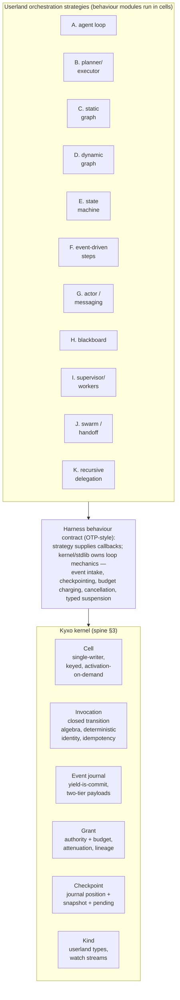
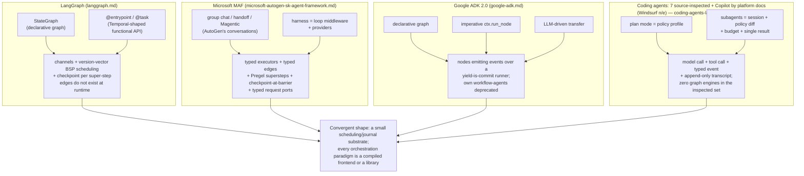

# 04 — Orchestration Models: Eleven Paradigms, One Kernel

> **Post-review status (2026-08-16, phase 2).** This document was drafted before the adversarial
> review; the review's binding adjudications live in the Amendment log of
> `research/DESIGN-SPINE.md` (A1–A14), with the full findings in `research/ADVERSARIAL-REVIEW.md`.
> They are now reflected in the body.
> **Applied here:** A9(i) (graph-absence rescoped to the seven source-inspected agents +
> Copilot-by-platform-docs + Windsurf `n/e`, and the "all eight run the loop" overcount
> corrected — §2.A, §4.1 fact 4 and its diagram), A2 (reserve-at-lease / settle-at-outcome /
> release-remainder replaces decrement-at-commit — §4.2 requirement 7, §4.4), A10 (suspension
> `origin` discriminator on `budget-exceeded` — §4.4). §4.4 also records that grant limits are
> chain-enforced **ceilings**, not partitions, per `17-KERNEL-SEMANTICS.md` §9a.
> **Outstanding:** none. Where this document conflicts with the Amendment log, **the amendment
> log governs**.

Status: derived from `research/DESIGN-SPINE.md` (pre-adversarial-review). This document is the
Phase-3 deep analysis of execution paradigms. It profiles eleven orchestration paradigms
against a fixed dimension set, then argues the adjudication of the mission's central
hypothesis (spine H1): that loop, graph, workflow, planner, supervisor, and swarm are
**orchestration strategies** — userland behaviour modules over the Kyxo kernel — and that
none of them is kernel material. Labels and confidence follow `research/METHODOLOGY.md`;
sections stating design positions are OUR PROPOSAL by default; evidence claims carry explicit
labels and cite the research notes.

Companion documents: `02-ECOSYSTEM-RESEARCH.md` (cross-cutting synthesis),
`03-HARNESS-COMPARISON.md` (system matrix), `05-KERNEL-PRIMITIVES.md` (the nine kernel
objects this document consumes), `06-CAPABILITY-SPEC.md` (the capability contract strategies
are packaged in), `08-EVENT-AND-STATE-MODEL.md` (journal/checkpoint design that makes the
strategies durable), `11-SECURITY-AND-POLICY.md` (Grants, which make them safe).

Vocabulary discipline (spine §2, binding): *agent loop* is the reactive strategy inside one
harness turn cycle; *harness* is a behaviour contract, not a runtime; *graph/workflow* is a
declarative orchestration strategy artifact compiled to cell steps; *state machine* names
both the kernel's invocation lifecycle and an available userland strategy; *planner* is any
capability that emits Plan artifacts; *delegation system* is invocation of a capability that
is itself an orchestrator, under an attenuated grant. The mission mandate labels paradigm F
"event-driven runtime"; per the spine's vocabulary, nothing userland is a runtime, so this
document treats F as the **event-driven steps** strategy. These terms are never
interchangeable below.

---

## 1. The question and the dimension set

Every agent system in the evidence base orchestrates model and tool invocations using some
composition of eleven recurring paradigms. The question this document answers is not "which
paradigm is best" — the evidence is unambiguous that different workloads genuinely favor
different paradigms — but **what a kernel must provide so that all eleven are expressible as
userland strategies with full fidelity**, and what is lost by refusing to make any one of
them the kernel.

Each paradigm is profiled on: definition; production evidence; strengths; weaknesses;
context growth; determinism; termination; failure/recovery; cost/observability; and the
situations where it is *superior* to the alternatives. The superiority claims matter most:
a kernel that hosts all eleven is only justified if no single paradigm dominates.

---

## 2. The eleven paradigms

### A. Agent loop

**Definition.** The reactive strategy inside one harness turn cycle: compile context → model
invocation → decode emitted actions → execute tool invocations → append results → repeat
until a termination policy fires. The model is the planner; the loop is a thin dispatcher.

**Production evidence.** The dominant paradigm by deployment mass — but not universal, and the
exceptions matter. **Six of the eight** surveyed coding agents run the canonical streaming
native-tool-call loop (Gemini CLI among them, wrapping it in an explicit per-tool-call
scheduler state machine — paradigm E applied to tool dispatch, not a different outer loop).
The two that do **not** are Aider, a bounded-reflection rewrite pipeline that is deliberately
not an agent loop, and the Copilot cloud agent, an artifact-mediated remote pipeline. See the
loop-model taxonomy in `02-ECOSYSTEM-RESEARCH.md` §2.4
(research/notes/coding-agents-landscape.md). Graph engines are
absent across the inspected set, scoped per amendment A9(i): zero of the **seven
source-inspected** agents contain one (SOURCE-CODE OBSERVATION/HIGH); the Copilot cloud agent
shows none in its documented pipeline (FACT, platform docs); Windsurf/Cascade is press-level
only and not evidenced either way (`n/e`, `03-HARNESS-COMPARISON.md` §2.2). *(The earlier
"all eight run it, and zero contain a graph engine — SCO/HIGH" overstated both halves: it
counted four distinct loop models as one, and asserted source verification for two systems
where none exists.)* Claude Code reduces to model call + tool call +
vetoable event + append-only transcript (research/notes/anthropic-claude-code-agent-sdk.md).
MAF's function-calling loop plus `AgentLoopMiddleware`, ADK's `BaseLlmFlow`, smolagents'
`_run_stream`, CrewAI's dual-grammar `CrewAgentExecutor`, and LangGraph's
`create_react_agent` (itself a two-node compiled graph) are the same shape
(research/notes/microsoft-autogen-sk-agent-framework.md, google-adk.md,
agent-frameworks-crewai-pydantic-llamaindex-mastra-letta.md, langgraph.md).

- **Strengths:** handles unknown action spaces; absorbs environment feedback (lint results,
  LSP diagnostics, test output) without topology changes; simplest to ship and to reason
  about locally; the loop shape itself is convergent and thin — differentiation lives in
  continuation policy (next-speaker checks, autopilot caps, loop detectors, mistake budgets,
  completion-tool contracts, LLM judges — all observed as small policies over turn events,
  research/notes/coding-agents-landscape.md §1, microsoft note §5).
- **Weaknesses:** no a-priori auditability (the plan exists only in the model's head); no
  native parallel joins; termination is model-judged; long tasks degrade as the transcript
  saturates the context window.
- **Context growth:** linear in turns; the transcript *is* the state. Compaction is
  mandatory infrastructure (two-stage clearing+summarization in Claude Code; strategy
  libraries in MAF; compaction-as-event in ADK; provider-side `compact_20260112` arriving in
  the API — anthropic note §6, FACT).
- **Determinism:** nondeterministic core (the model decides every branch); mechanics around
  it (tool dispatch, event append) are deterministic and journalable.
- **Termination:** absence of tool calls in a response, i.e. model judgment, guarded by
  policy caps (max turns, budget, loop detection, judge verdicts). Runaway loops are the
  characteristic failure; every mature harness grew a guard (OBSERVED across six systems,
  coding-agents note §1).
- **Failure/recovery:** in-loop reflection and retry; resume by transcript replay;
  workspace state via shadow-git checkpoints (independently invented 4×, coding-agents §8).
- **Cost/observability:** cost ∝ turns × context length — the expensive paradigm per unit
  of work at long horizons, mitigated by caching. Observability is excellent: the transcript
  is a total record.
- **Superior when:** the action space cannot be enumerated in advance; feedback from the
  environment is rich and cheap; a single competent model with good tools beats any
  structure you could impose. *Loops beat graphs when you cannot draw the graph.*

### B. Planner/executor

**Definition.** A planner capability emits a Plan artifact (ordered steps, dependencies);
executors carry out steps; a control policy replans on failure or drift.

**Production evidence.** The *component* is dead; the *pattern* survives in three demoted
forms. FACT: SK's LLM planners were deprecated in 2024 in favor of function calling; MAF
ships no planner concept at all; ADK's `BasePlanner` is a prompt-shaping shim
(microsoft note §1, google-adk.md §11). What survived: (1) **plan mode as a policy
profile** — the same loop under a read-only permission ruleset, converged in four coding
agents (INFERENCE/HIGH, coding-agents §3); (2) **plan-as-artifact** — Roo's mandated todo
lists flowing into delegation as data, Copilot cloud agent's platform-level plan phase,
MAF/Claude-Code todo providers; (3) **two-model split** — Aider's architect/editor, where
reasoning and edit-formatting are separate model invocations (FACT + SCO/HIGH,
coding-agents §4).

Evidence — planner-as-component deprecated across Microsoft's stack, absent in ADK 2.0 and
all coding agents; plan-as-policy-profile and plan-as-artifact ubiquitous.
Interpretation — planning migrated *into the model* (reasoning/thinking) and *into data*
(Plan artifacts, todo lists); what remains architecturally is a gate on intent, not an
engine.
Implication — Kyxo needs a Plan **Kind** and a policy stage that can require an approved
Plan artifact before effectful invocations — never a planner component.
Confidence — HIGH.

- **Strengths:** intent is inspectable and approvable before effects; upfront cost
  estimation; clean audit trail of intended-vs-actual.
- **Weaknesses:** plans go stale against a changing world; replan loops oscillate; the
  plan's granularity is guessed before information exists.
- **Context growth:** favorable — the plan is compact, executor sessions start fresh per
  step, the coordinator sees summaries.
- **Determinism:** plan *generation* is nondeterministic; execution against a fixed plan is
  auditable and largely replayable.
- **Termination:** plan exhaustion; replanning requires an explicit budget or it becomes an
  unbounded loop one level up.
- **Failure/recovery:** replan is the natural repair verb; the hazard is silent divergence
  between plan and world (verification hooks between steps are the mitigation).
- **Cost/observability:** extra upfront model calls; excellent progress observability
  (fraction of plan complete is a real metric).
- **Superior when:** a human or policy must approve *intent* before any effect executes
  (regulated changes, destructive operations); when cost must be estimated before work
  begins.

### C. Static graph

**Definition.** A declared topology — typed nodes, edges, conditions, joins — compiled
before execution; the orchestration strategy artifact of spine §2 ("Graph/Workflow").

**Production evidence.** LangGraph `StateGraph`, MAF `WorkflowBuilder` (typed executors +
edge groups + Pregel supersteps), Mastra combinator graphs with schema-validated
boundaries, pydantic-graph (edges from return-type annotations), LlamaIndex's statically
validated implicit graph, ADK 2.0 declarative workflows, MAF's YAML declarative plane — all
SOURCE-CODE OBSERVATION/HIGH in the respective notes. Crucially, every one of these ships a
pre-run validator and a diagram generator (INFERENCE/HIGH, frameworks note §7): static
checkability is *the* value proposition of the paradigm. Equally crucially, none of them
*runs* the graph: LangGraph compiles edges away entirely; MAF lowers to superstep message
delivery; ADK's graph engine is itself a node over the event log (§4 below).

- **Strengths:** auditability (the topology is a reviewable artifact); parallel fan-out
  with **joins** (LangGraph's `NamedBarrierValue` — the join is a channel type, not
  scheduler logic; MAF fan-in edge groups); build-time type validation (MAF validates
  executor signatures; Mastra validates every step boundary); checkpoint identity bound to
  topology (`graph_signature_hash`); cross-language parity.
- **Weaknesses:** every static graph in production grew dynamic escape hatches — Send,
  Command(goto), mid-step `accept_push` in LangGraph; `ctx.run_node` in ADK; sub-workflow
  request interception in MAF (SCO/HIGH each). The topology cannot express what the model
  decides at runtime, so control flow leaks out of the edges (langgraph.md §4,
  INFERENCE/HIGH).
- **Context growth:** bounded by the state schema, not by history — O(state), not
  O(transcript). The cost moved into checkpoint size ∝ state size (LangGraph's DeltaChannel
  beta is a patch on exactly this, langgraph.md §5).
- **Determinism:** scheduling is deterministic given node outputs (LangGraph sorts task
  paths before folding writes; deterministic task-ID derivation with a resume-time
  checksum); node contents are as nondeterministic as their models.
- **Termination:** quiescence (no channel updates can trigger a node) plus a recursion
  limit (default 25 in LangGraph, 100 iterations in MAF). Joins introduce a liveness
  hazard: a barrier whose writer never fires stalls the run (deferred channels/`finish()`
  are the mitigation).
- **Failure/recovery:** the best story of any paradigm — checkpoint-at-barrier;
  `pending_writes` recovering completed parallel branches within a failed step; per-node
  retry/timeout/error-handler composition; fork-from-checkpoint time travel (langgraph.md
  §5–7, FACT/SCO HIGH).
- **Cost/observability:** near-zero orchestration overhead; the rendered topology plus
  per-node event streams is the strongest a-priori observability in the survey.
- **Superior when:** the process is enumerable in advance; audit/compliance demands a
  reviewable topology; parallel branches must join deterministically; runs must be
  re-executed, forked, and diffed. *Graphs beat loops for auditability and parallel joins.*

### D. Dynamic graph

**Definition.** Graph-shaped execution whose topology is decided at runtime: nodes spawn
nodes, routes are computed, fan-out width is data-dependent. Includes
orchestration-as-generated-code.

**Production evidence.** LangGraph `Send` (runtime fan-out with caller-supplied private
state), `Command` (runtime goto + cross-graph routing), functional-API mid-step task
injection (SCO/HIGH, langgraph.md §4); ADK dynamic workflows via `ctx.run_node`
(SCO/HIGH, google-adk.md §4); Claude Code dynamic workflows — Claude-*written* JS scripts
over `agent()`/`pipeline()` primitives, ≤16 concurrent, ≤1,000 agents, resumable with
completed-agent results replayed from cache (FACT, anthropic note §9). The spine's summary:
**dynamic dispatch always wins** — every static-topology system converged on it
(spine §5; INFERENCE/HIGH).

- **Strengths:** expresses map-reduce over unknown N; lets the model or generated code own
  control flow while the substrate owns durability; subsumes C (a static graph is a
  degenerate dynamic graph whose spawns are precomputed).
- **Weaknesses:** the audit story of C evaporates (LangGraph's `add_node(..., ends=...)`
  exists *purely* to help static rendering of routes only known at runtime — SCO/HIGH);
  unbounded fan-out is a budget hazard; reproducibility requires engineering, it is not
  free.
- **Context growth:** parent state stays slim when children receive private state
  (`Send.arg`); total footprint is data-dependent — the width of the fan-out.
- **Determinism:** achievable and load-bearing: LangGraph derives dynamic task identity
  from (checkpoint, namespace, step, parent path, write index) so resume re-matches saved
  writes to re-created tasks; Claude Code replays workflow agents order-dependently from
  cache. Deterministic *identity* substitutes for deterministic *topology*
  (langgraph.md §2, §4; INFERENCE/HIGH).
- **Termination:** quiescence cannot be proven from topology; requires spawn budgets
  (depth/width) and recursion caps as external bounds.
- **Failure/recovery:** memoized resume — completed children return recorded results
  instead of re-executing; the linchpin is deterministic invocation identity.
- **Cost/observability:** cost is decided at runtime by data (the budget hazard);
  observability requires reconstructing the realized topology from the journal, which the
  kernel's correlation/causation IDs make cheap.
- **Superior when:** fan-out width is data-dependent; orchestration is best expressed as a
  program (generated or written) over spawn primitives; a workload needs graph-grade
  durability without a knowable topology.

### E. State machine

**Definition.** A closed set of named states with an explicit transition relation;
orchestration = running the machine, with actions attached to states/transitions. In Kyxo
the kernel's invocation lifecycle *is* a state machine (spine §3, Invocation); this section
concerns the userland strategy.

**Production evidence.** Gemini CLI's tool scheduler is the most explicit shipped instance:
`validating → scheduled → awaiting_approval → executing → success | error | cancelled` with
a confirmation bus (SCO/HIGH, coding-agents §1c). A2A's task lifecycle is a state machine
at the protocol edge; plan/act dual modes are a two-state machine over policy profiles
(INFERENCE/HIGH, coding-agents §3). Notably, Mastra does *not* embed xstate — the
hypothesis that agent frameworks build on FSM libraries was checked and is unsupported
(SCO/HIGH, frameworks note §4).

- **Strengths:** the strongest termination and verification story — terminal states are
  enumerable, illegal transitions are rejectable by construction; policy attaches cleanly
  per state (approval gates on specific transitions).
- **Weaknesses:** state explosion under real workloads; LLM work is fuzzy — most of an
  agent's interesting situations do not reduce to a small closed state set, which is why no
  surveyed system uses an FSM as its *outer* orchestration model.
- **Context growth:** minimal — current state label + transition inputs; history lives in
  the journal, not the working context.
- **Determinism:** the transition function is fully deterministic; only in-state actions
  are nondeterministic.
- **Termination:** by construction (terminal class), the best of all eleven.
- **Failure/recovery:** resume = load state; the machine definition versions as data.
- **Cost/observability:** near-zero overhead; transitions are ideal telemetry events.
- **Superior when:** the set of legal situations *is* enumerable: lifecycles, protocol
  edges, approval/auth flows, tool-call scheduling. This is why Kyxo puts exactly one state
  machine in the kernel — the invocation lifecycle — and leaves the rest to userland.

### F. Event-driven steps

**Definition.** Steps subscribe to typed events; emitting an event is the act of routing;
the "graph" exists only implicitly as the closure of emit/consume type relationships.

**Production evidence.** LlamaIndex Workflows is the pure form — "events ARE execution,"
with static validation recovering the implicit graph (every produced event consumed, all
steps reachable, only `StopEvent` terminal) (SCO/HIGH, frameworks note §3). CrewAI Flows
are the completion-listening variant (`@listen`, `@router`, `and_`/`or_`)
(FACT, frameworks note §1). ADK 2.0's whole substrate is event-driven: nodes emit events,
the runner commits them, and state/routing/checkpoints/HITL all fold from the one log
(google-adk.md §2–4). Claude Code's 32-event hook system is the same paradigm applied to
policy rather than orchestration (anthropic note §3).

- **Strengths:** space/time decoupling — producers and consumers need not know each other
  or coexist; new consumers attach without touching producers (the extensibility win);
  observability and execution are the same channel (the property only LlamaIndex fully
  exploits — INFERENCE/HIGH, frameworks note §7).
- **Weaknesses:** control flow is invisible in the code; termination is a global property
  no local step can see; fan-in needs explicit buffering (`ctx.collect_events`); poison
  events need dead-lettering that the surveyed frameworks mostly lack.
- **Context growth:** per-step payloads only — no shared transcript; the journal grows
  linearly but working context does not.
- **Determinism:** concurrent emission interleavings are nondeterministic unless barriered;
  the type-routing itself is deterministic.
- **Termination:** requires a distinguished terminal event, ideally validated statically
  (LlamaIndex `_validate` is the proof this is practical).
- **Failure/recovery:** replay from the journal; retry policies per step; a crashed
  consumer resumes from its subscription position.
- **Cost/observability:** cheap; the event log is the complete trace by construction.
- **Superior when:** the trigger set is open (external events, ambient work, hooks); the
  consumer population changes at runtime; many writers must coordinate without coupling.

### G. Actor / message-passing

**Definition.** Addressed, stateful actors processing messages one at a time; virtual-actor
variants activate on demand under stable identity.

**Production evidence.** autogen-core is the in-domain instance: `AgentId = (type, key)`
Orleans-style addressing, direct send + pub/sub topics, intervention handlers at the bus
(SCO/HIGH, microsoft note §2). Outside AI, the convergence is overwhelming: Orleans grains,
Restate Virtual Objects, Temporal Entity Workflows independently reinvented keyed
single-writer stateful identity three times (INFERENCE/HIGH,
research/notes/durable-execution.md §6). And the decisive negative: **MAF killed AutoGen's
distributed actor mesh** — no gRPC agent mesh exists in MAF; distribution moved to protocol
boundaries (SCO/HIGH, microsoft note §7).

Evidence — actor identity/state (grains/VOs/entities) independently converged 3×; actor
transport (AutoGen's gRPC mesh, topic subscription fabric) killed in the MAF convergence;
conversation-as-control-flow demoted to a pattern library.
Interpretation — the paradigm split in half under production pressure: the *state and
identity* half is kernel-grade; the *topology and transport* half is not.
Implication — Kyxo's **Cell** absorbs the surviving half (keyed, single-writer,
activation-on-demand); actor *messaging semantics* (topics, mailboxes, routing) are a
userland strategy over invocations and events; distribution stays at protocol edges.
Confidence — HIGH.

- **Strengths:** per-key serialization eliminates data races by construction; natural fit
  for long-lived sessions; activation-on-demand scales dormant populations for free.
- **Weaknesses:** no global view — cross-actor invariants are hard; message-ordering
  guarantees across actors are weak; distributed tracing of message cascades is painful
  (part of why the mesh died).
- **Context growth:** bounded per actor — state is delivered with the request (Restate
  model), not accumulated in a transcript.
- **Determinism:** per-key deterministic (single-writer turns); cross-key nondeterministic.
- **Termination:** none globally — actors are perpetual; termination is per-request, or
  imposed by supervision.
- **Failure/recovery:** the classic strength — supervision restart (OTP), reactivation from
  persisted state, poison-message quarantine.
- **Cost/observability:** message volume can dominate; per-actor mailboxes and state are
  cleanly inspectable; causality across actors requires correlation IDs.
- **Superior when:** many concurrent, long-lived, stateful sessions with per-key
  consistency needs — which is why the kernel keeps the cell and lets everything else go.

### H. Blackboard

**Definition.** Specialists coordinate through a shared workspace: they watch it,
contribute when their expertise applies, and never address each other. Linda's generative
communication is the canonical form (FACT via search-verified paper,
research/notes/prior-art-negotiation-extension.md §14).

**Production evidence.** Thinner and more indirect than the others — mostly convergent
fragments: Letta's shared memory blocks with a sleep-time agent reorganizing them
asynchronously (a second principal working the same blackboard — FACT/HIGH, frameworks note
§5); Claude Code agent teams' shared task list (FACT, anthropic note §7); LangGraph's
cross-thread `BaseStore`; and, read structurally, every coding agent uses **the repository
itself as a blackboard** — files are the shared workspace that model, linters, tests, and
humans all watch and mutate (INFERENCE/MEDIUM, coding-agents-landscape.md). Kubernetes'
CRD-plus-controllers pattern is blackboard coordination at industrial scale: desired-state
objects watched by decoupled reconcilers (FACT, prior-art note §10).

- **Strengths:** open contributor sets — agents appear/disappear mid-run without
  re-wiring; knowledge accretes incrementally; asynchronous specialists (sleep-time
  memory management) compose without a coordinator.
- **Weaknesses:** the historical failure mode is documented: unscoped shared mutable space
  becomes a contention and security mess (OBSERVED BEHAVIOR/MEDIUM, prior-art §14);
  quiescence ("are we done?") has no natural owner; stale or poisoned contributions
  propagate silently without provenance.
- **Context growth:** the space grows monotonically unless curated; readers pay retrieval
  cost, not transcript cost. Letta's char-limited, labeled blocks are the disciplined
  version — quota'd cells, not an unbounded heap.
- **Determinism:** race-prone by default; restored by single-writer cells plus commutative
  reducers on shared state.
- **Termination:** requires an explicit goal-satisfaction checker or closer role; nothing
  intrinsic.
- **Failure/recovery:** excellent survivability — the space outlives any contributor
  (Linda's time-decoupling); the risk is *corruption*, not loss, hence provenance/taint
  labels as the recovery precondition.
- **Cost/observability:** watch/poll cost; causality is invisible without per-contribution
  provenance — exactly what Artifact provenance labels supply.
- **Superior when:** the contributor set is unknown or changing; work is knowledge
  accretion rather than a task pipeline; coordination must survive any individual
  participant. In Kyxo this is Kind-typed cells + watch streams + artifact provenance —
  the paradigm falls out of kernel objects with almost no strategy code.

### I. Supervisor/workers

**Definition.** A coordinator decomposes work and delegates to workers, integrating their
results. Two rival encodings existed: supervisor-as-topology (a routing node in a graph)
and supervisor-as-caller (subagents exposed as tools).

**Production evidence.** The encoding war is settled. FACT: `langgraph-supervisor` (and by
ecosystem association `langgraph-swarm`) "is no longer actively maintained"; the documented
replacement is the subagents pattern — "a main agent coordinates specialized workers by
calling them as tools" (langgraph.md §13). AutoGen's group-chat managers survive only as a
pattern library compiling to MAF workflows (microsoft note §4); CrewAI demoted crews to
components invoked from flows (frameworks note §1, INFERENCE/HIGH). Meanwhile five coding
agents independently converged on the same delegation algebra: *subagent = fresh session +
capability/policy diff + budget + single result message to a paused or notified parent*
(INFERENCE/HIGH, coding-agents §6), with background-by-default execution and resumable
delegation as refinements (Claude Code, OpenCode).

Evidence — supervisor-as-topology abandoned by its own vendors; subagents-as-tools
converged across five independent coding agents plus MAF's `BackgroundAgentsProvider` and
Claude Code's Agent tool.
Interpretation — coordination routed through the model's tool-calling beats coordination
encoded in edges: the supervisor is a *caller with a budget*, not a topology.
Implication — Kyxo needs no supervisor construct: dynamic spawn + attenuated Grant +
single-result invocation contract *is* the paradigm. Separately, OTP-style
supervision-of-failure (restart classes, intensity budgets, escalation) is
kernel-adjacent policy (spine §7) — distinct from supervision-of-work, and the notes show
no durable-execution vendor has it (durable-execution.md §6).
Confidence — HIGH.

- **Strengths:** context-window protection — the entire point; the coordinator sees one
  result message per worker (Cline frames subagents explicitly as context protection);
  heterogeneous worker configurations; clean budget partitioning per worker.
- **Weaknesses:** the coordinator is a bottleneck and a single point of misjudgment;
  results-only visibility means the parent cannot audit *how* a worker concluded
  (mitigated by worker transcripts being separately persisted); decomposition quality is
  model-dependent.
- **Context growth:** the winning profile: parent grows by one summary per delegation;
  workers start fresh. Depth-wise compression is the paradigm's economic engine.
- **Determinism:** delegation decisions are model-made (nondeterministic) unless scripted;
  the delegation *mechanics* (spawn, result return) journal deterministically.
- **Termination:** coordinator judgment plus per-worker caps; a worker that never returns
  needs lease timeouts (the stall-watchdog gap in Claude Code — no per-subagent wall-clock
  deadline — is a documented hole, anthropic note §10).
- **Failure/recovery:** worker failure is isolated by construction — the parent receives a
  typed error result and decides retry/respawn/escalate; OTP restart intensity extended to
  cost budgets is the missing discipline the kernel adds.
- **Cost/observability:** duplicated context-gathering per worker is the known
  inefficiency; per-worker cost attribution is clean when the runtime tracks it (Cline
  rolls subagent budgets into task totals; Temporal×PydanticAI *loses* child usage across
  the activity boundary — the cautionary tale, durable-execution.md §2).
- **Superior when:** work decomposes into independent subproblems; the coordinator's
  context must be protected; specialists need different capability sets or models; budget
  must be partitioned and attributed per branch.

### J. Swarm / decentralized handoff

**Definition.** No standing coordinator: peers transfer control directly (handoff — the
current agent decides who acts next), or coordination emerges through a shared environment.

**Production evidence.** The weakest production record of the eleven. AutoGen shipped
`Swarm` as a group-chat variant; MAF retains handoff only as `_handoff.py` in the
orchestration *library*, compiled to workflows (SCO/HIGH, microsoft note §4);
`langgraph-swarm` is unmaintained alongside the supervisor package (FACT-by-association,
langgraph.md §13); LangChain's multi-agent docs keep "handoffs" as a state-driven pattern,
not a package. The one genuinely decentralized surface that is *growing* is the federation
edge: A2A-mediated delegation between runtimes that share no coordinator, as in Gemini
CLI's remote subagents (SCO/HIGH, coding-agents §6).

- **Strengths:** the peer currently holding the conversation genuinely does know best who
  should act next in conversation-shaped work (triage, escalation between specialist
  roles); no coordinator to bottleneck or misroute; the only paradigm that works across
  trust domains where a shared coordinator *cannot exist*.
- **Weaknesses:** no global termination guarantee (control can cycle among peers
  indefinitely — round caps are external patches); budget accounting across handoffs is
  undefined in every surveyed implementation; auditability is poor: the realized control
  flow is discoverable only from the journal after the fact.
- **Context growth:** handoff variants transfer the full conversation wholesale — the
  expensive move (MAF threads `full_conversation` through graph messages explicitly);
  federation variants transfer only task + artifacts (A2A), which is the sustainable form.
- **Determinism:** the least deterministic paradigm — every transition is a model
  judgment.
- **Termination:** weakest of the eleven; requires externally imposed round/budget caps.
- **Failure/recovery:** a peer failing mid-handoff strands the conversation; no surveyed
  system defines recovery beyond session-level retry (INFERENCE/MEDIUM).
- **Cost/observability:** full-history transfer per hop; attribution murky without a
  grant-lineage spine.
- **Superior when:** control transfer is conversation-shaped and locally decidable; or the
  participants are sovereign runtimes federated over A2A, where decentralization is a
  *constraint*, not a choice. Inside one trust domain, the evidence says supervisor/workers
  dominates it.

### K. Recursive delegation

**Definition.** Any orchestrator may invoke a capability that is itself an orchestrator, to
arbitrary depth — the delegation system of spine §2, applied recursively. Not a special
mechanism: composition of the other paradigms under attenuated grants.

**Production evidence.** Claude Code: spawn depth default 3, concurrency 20, tree-wide
`maxBudgetUsd` enforced since v2.1.217 with a concrete contract — spawning fails with
`Budget limit reached`, running background children are stopped (FACT, anthropic note §2,
§7). OpenCode: resumable delegation with derived subagent permissions; Roo: boomerang
orchestration; Gemini CLI: recursion across runtime boundaries via A2A
(coding-agents §6). PydanticAI: child usage accrues to the parent via `usage=ctx.usage` —
and loses exactly that accounting when the Temporal activity boundary copies the context
(FACT, durable-execution.md §2). smolagents' CodeAgent lets generated code construct new
agents with **no attenuation answer at all** — the frameworks note flags this as a genuine
gap no framework owns (frameworks note, open question 6).

- **Strengths:** matches problems whose decomposition depth is unknowable upfront;
  orchestrators become reusable capabilities (a graph strategy invoked by a loop invoked by
  a planner — every level a Binding).
- **Weaknesses:** the explosion risk — width × depth × cost multiply; observed controls in
  the wild are flat env-var caps, one integer (`max_llm_calls` in ADK), or nothing;
  cross-level budget accounting is broken in the one place it was tested against a durable
  engine.
- **Context growth:** per-level compression (each child fresh, each parent gets a
  summary); *total* footprint across the tree is the multiplicative hazard.
- **Determinism:** inherited from per-level strategies; resume-safety requires
  deterministic invocation identity at every spawn point.
- **Termination:** the tree terminates iff every leaf terminates *and* spawn bounds hold —
  termination must be imposed by construction (grants), not hoped for.
- **Failure/recovery:** subtree failure escalates to the parent as a typed result;
  revocation must be transitive over the delegation tree (the seL4 property, prior-art
  §7); budget exhaustion is a suspension state, not a crash.
- **Cost/observability:** multiplicative cost; attribution is possible only if the kernel
  owns lineage — which no surveyed system's kernel does (spine gap map §6, item 1).
- **Superior when:** the problem is recursively self-similar with unknown depth (research
  trees, large refactors, multi-repo work). The paradigm is *only safe* under kernel-owned
  attenuation — which is §4.4's subject.

---

## 3. Comparative summary

| Paradigm | Context growth | Determinism | Termination | Recovery | Beats the others when |
|---|---|---|---|---|---|
| A. Agent loop | O(transcript); compaction mandatory | Model-driven core | Model-judged + caps | Transcript replay; reflection | Action space unknown |
| B. Planner/executor | Compact plan; fresh executors | Auditable vs plan | Plan exhaustion | Replan | Intent needs approval first |
| C. Static graph | O(state schema) | Deterministic scheduling | Quiescence + limit | Barrier checkpoints, partial-step | Audit + parallel joins |
| D. Dynamic graph | Data-dependent fan-out | Deterministic *identity* | Needs spawn bounds | Memoized resume | Fan-out width data-dependent |
| E. State machine | O(1) working state | Fully deterministic transitions | By construction | Load state | Legal situations enumerable |
| F. Event-driven steps | Per-step payloads | Interleaving-nondeterministic | Terminal event, validated | Journal replay | Open trigger/consumer sets |
| G. Actor/messaging | Bounded per key | Per-key deterministic | None global | Supervision restart | Many long-lived keyed sessions |
| H. Blackboard | Space grows; needs quotas | Race-prone w/o reducers | Needs explicit closer | Space outlives contributors | Open contributor sets |
| I. Supervisor/workers | Parent gets summaries only | Model-made delegation | Coordinator + caps | Isolated worker failure | Context protection, budget split |
| J. Swarm/handoff | Full-history per hop (or A2A artifacts) | Least deterministic | Weakest; external caps | Undefined mid-handoff | Federation across trust domains |
| K. Recursive delegation | Per-level compression; tree-total hazard | Per-level | Only via grant bounds | Escalation + revocation | Unknown decomposition depth |

No row dominates. The paradigms are genuinely complementary, which is the empirical case
for a kernel that privileges none of them.

---

## 4. One kernel, many strategies

### 4.1 The adjudication

The mission's central hypothesis (H1) was that orchestration paradigms are strategies over
a minimal kernel, not kernel material. The spine records it CONFIRMED; this section carries
the argument, because the confirming evidence is of the strongest class available in
architecture research: **independent convergent evolution under production pressure**, four
times, plus two decisive negative results.

The five convergence facts, stated sharply:

1. **The flagship graph runtime does not run a graph.** LangGraph's kernel is channels +
   version-vector task planning + barrier checkpoints; `StateGraph.compile()` lowers nodes
   and edges onto channel wiring, a multi-source edge becomes a `NamedBarrierValue` channel,
   and *no runtime edge data structure exists*. Two dissimilar frontends — a declarative
   graph and a Temporal-shaped imperative API — compile to identical kernel constructs
   (SCO + INFERENCE/HIGH, langgraph.md §2–3, §8).
2. **Microsoft compiled conversations away.** Three generations (conversation-as-control-
   flow, planner-over-plugins, distributed typed actors) collapsed into typed executors +
   supersteps + checkpoint-at-barrier + typed request ports + one discriminated event
   stream; group chat, handoff, Magentic, and a Claude-Code-class harness all became
   libraries over that substrate (SCO/HIGH, microsoft note §4–5, §8).
3. **Google deprecated its own orchestration agents one major version after shipping
   them.** ADK 2.0 dropped from "everything is an agent" to "everything is a node emitting
   events," with `SequentialAgent`/`ParallelAgent`/`LoopAgent` formally deprecated and
   three interchangeable strategy styles (graph, imperative, LLM-driven) over one
   event log (FACT + SCO/HIGH, google-adk.md §1, §4).
4. **The most commercially successful agents have no graphs at all.** Zero of the **seven
   source-inspected** coding agents contain a DAG engine (SOURCE-CODE OBSERVATION/HIGH); the
   Copilot cloud agent shows none in its documented pipeline (FACT, platform docs);
   Windsurf/Cascade is press-only and not evidenced either way (`n/e`, the Graph-support cell
   in `03-HARNESS-COMPARISON.md` §2.2). Across the inspected set "plan mode" is uniformly a
   policy profile over the same loop and orchestration is prompts + delegation + triggers
   (coding-agents §3, §10). Scoped per amendment A9(i). The conclusion is unchanged, and its
   role is unchanged too: this is *corroboration* for convergences 1–3, which are four
   independent source-verified arrivals and carry the adjudication on their own.
5. **Supervisor-as-topology lost to subagents-as-tools** in the one ecosystem that shipped
   both and could measure adoption: LangGraph's supervisor/swarm packages are unmaintained,
   the migration doc points at subagents; CrewAI demoted crews under flows; five coding
   agents converged on the identical delegation algebra without ever building a topology
   (FACT + INFERENCE/HIGH, langgraph.md §13, frameworks note §1, coding-agents §6).

Evidence — items 1–5 above, each independently sourced.
Interpretation — when four unrelated organizations under production pressure all move
orchestration out of their core and reduce the core to (typed state cells | typed messages)
+ barrier scheduling + commit-point checkpointing + an event stream, the remaining core is
the kernel and the moved parts are provably userland. The paradigms did not fail — they
were *relocated*.
Implication — Kyxo admits no paradigm into the kernel. The kernel is the substrate all
eleven compile onto; each paradigm ships as a strategy capability with a manifest, run in a
cell under the harness behaviour contract.
Confidence — HIGH.

### 4.2 What the kernel must provide

For all eleven paradigms to be implementable as userland strategies *without fidelity
loss*, the kernel must supply exactly the mechanisms the convergent systems either built or
visibly lack. Seven requirements, each traceable to evidence:

1. **Deterministic invocation identity.** Every spawned invocation gets an identity derived
   from (checkpoint ID, cell namespace, step, spawn path, ordinal) — uuid5-style, verified
   on resume. This is the linchpin of everything downstream: memoized resume (completed
   children return recorded results), dedup windows, partial-step recovery, fork replay.
   LangGraph hangs its entire resumability on exactly this derivation and asserts the
   checksum on resume (SCO/HIGH, langgraph.md §2); the durable-execution triangle
   (at-least-once + idempotency key + dedup = exactly-once illusion) requires it
   (durable-execution.md §5).
2. **Typed suspension.** The invocation lifecycle's interrupted class (`input-required`,
   `auth-required`, `approval-required`, `budget-exceeded`) carries schema-typed payloads —
   Mastra's `suspendSchema`/`resumeSchema` is the cleanest prior art (frameworks note §4);
   MAF persists pending request-info ports *inside checkpoints* so a paused workflow
   rehydrates in a fresh process (microsoft note §4); Restate's awakeables prove suspension
   must be free while waiting (durable-execution.md §3). This one mechanism serves HITL,
   auth, approvals, budget stops, and parent-mediation across every paradigm.
3. **Yield-is-commit.** A strategy's effects (state delta, artifact delta, checkpoint
   marker) commit atomically when the kernel accepts its event, and execution resumes only
   after commit. ADK's one contract that survived its rewrite intact — re-implemented
   across a task boundary with a queue+ack handshake rather than abandoned
   (SCO/HIGH, google-adk.md §3). This is the transactional floor beneath paradigms A, C, D,
   F, and the reason resume never re-executes committed effects.
4. **Dynamic spawn as a native verb.** Not an escape hatch: `Send`, `Command`,
   `ctx.run_node`, the Agent tool, and generated-code workflows are the same operation —
   schedule a new invocation with private input and derived identity. Graphs are one
   frontend over it; generated imperative code is another (spine §5).
5. **Joins and barriers as state-cell reducers.** The deepest lesson from LangGraph: a join
   is not scheduler logic, it is a *typed state cell* — `NamedBarrierValue` becomes
   available when its declared writer set has written; reducer cells
   (`BinaryOperatorAggregate`) make concurrent writes commutative; MAF's fan-in edge groups
   and LlamaIndex's `collect_events` are the same semantics in other clothes. Kyxo cells
   therefore expose named, typed state slots with attached reducers and barrier types;
   fan-in across paradigms C, D, F, H is data, not code (SCO/HIGH sources; the
   generalization is OUR PROPOSAL).
6. **Single-writer cells.** The Orleans-grain/Virtual-Object/entity-workflow convergence,
   reinvented three times (INFERENCE/HIGH, durable-execution.md §6): stable keyed identity,
   activation-on-demand, one writer turn at a time, shared reads. Paradigm G reduces to
   this object; paradigms A and I get session consistency from it for free; paradigm H
   becomes safe on top of it.
7. **Budget and lineage on grants.** Every spawn carries an attenuated Grant: rights plus
   quantitative budget (tokens, money, wall-clock, invocations, spawn depth/width), forming
   a lineage tree the kernel charges against by **reserving at lease and settling at
   outcome** (amendment A2; the decrement-at-commit model is retired everywhere — see §4.4).
   This is the one requirement with *no*
   adequate prior art — the state of the art is `max_llm_calls` (one integer), env-var
   caps, and a usage-accounting hole through Temporal's activity boundary
   (google-adk.md §3, anthropic note §11, durable-execution.md §2) — and it is what makes
   paradigms I, J, K safe at all (spine §3, Grant; gap map §6).

Supporting these seven, the kernel's journal (truth plane), checkpoint object, policy
pipeline, and scheduler are assumed from `05-KERNEL-PRIMITIVES.md` and
`08-EVENT-AND-STATE-MODEL.md`.

### 4.3 Paradigm → kernel consumption map

| Paradigm | Kernel features consumed | Remains userland (the strategy) |
|---|---|---|
| A. Agent loop | Cell (session); Invocation for model/tool calls; journal + yield-is-commit; budget charging; typed suspension (approvals); checkpoint | Context compilation; action grammar (JSON tools vs code); continuation/termination policy; compaction strategy |
| B. Planner/executor | Plan as a registered Kind; Artifact provenance; policy stage requiring approved Plan before effects; invocation lineage | Plan schema; planner prompt/model; replan policy; executor selection |
| C. Static graph | Reducer + barrier state cells (joins); deterministic invocation identity; checkpoint-at-yield; scheduler quiescence detection | Graph DSL + compiler to cell steps; build-time validation; edge conditions; visualization |
| D. Dynamic graph | Dynamic spawn with derived identity; memoized resume; grant width/budget bounds; joins as reducers | Spawn logic (model- or code-driven); generated-code sandbox bindings; realized-topology rendering |
| E. State machine | Machine definitions as Kinds; typed suspension per transition; policy stages bound to transitions; journal as transition log | State vocabulary; transition guards; per-state actions |
| F. Event-driven steps | Journal + derived watch streams; cell activation on event match; idempotency keys; barrier cells for fan-in | Event schemas; subscription table; routing semantics; terminal-event validation |
| G. Actor/messaging | Cell = keyed single-writer identity with activation-on-demand; invocation as message; checkpoint of cell state | Topic/pub-sub semantics over events; mailbox policies; supervision-of-work |
| H. Blackboard | Kind-typed shared cells + watch; single-writer + reducers; Artifact CAS with taint/provenance; grants scoping views of the space | Matching/trigger rules; curation and quota policy; contribution schemas; closer/goal-check role |
| I. Supervisor/workers | Dynamic spawn; mandatory grant attenuation; budget partitioning + lineage attribution; single-result invocation contract; suspension for escalation | Decomposition prompts; worker configurations; result aggregation; retry/respawn policy |
| J. Swarm/handoff | Cell-to-cell control transfer as invocation + checkpoint/state handoff; attenuated grants travel with control; A2A adapter at the federation edge | Speaker/next-owner selection; handoff payload schema; round caps |
| K. Recursive delegation | Grant lineage with depth/width/budget attenuation; transitive revocation; correlation/causation IDs; `budget-exceeded` suspension | Decomposition policy; per-level strategy choice; result synthesis |

Reading the table columnwise is the argument in miniature: the left column is the same
short list of kernel objects repeated eleven times; the right column is where all the
product differentiation lives. That is precisely the shape of a correct kernel boundary
(Liedtke's test, spine §3): competing userland implementations of every right-column entry
already exist in the evidence base.

### 4.4 Recursive-explosion control

Recursion (K), fan-out (D), and delegation (I) share one failure mode: multiplicative
resource consumption that no surveyed system controls structurally. The observed state of
the art is flat caps — depth-3/concurrency-20 env vars and one tree-wide USD budget
retrofitted in a point release (FACT, anthropic note §7, §11); one integer in ADK
(SCO/HIGH); *nothing* in smolagents' code-spawned agents (frameworks note, open q. 6); and
a durable-execution integration that silently drops child usage accounting at an effect
boundary (FACT, durable-execution.md §2).

Kyxo's control is construction, not convention (OUR PROPOSAL, per spine §3 Grant and §7):

- **Attenuation is mandatory and monotone.** A spawn mints a child Grant with strictly
  non-amplified rights and budgets: `child.depth = parent.depth − 1`,
  `child.width ≤ parent.width_remaining`, `child.tokens/money/wall-clock ≤ parent's
  unspent balance`, risk class ≤ parent's. The kernel refuses any spawn whose grant would
  exceed the parent's remainder — the seL4 mint-with-subset rule applied to quantitative
  rights (prior-art §7). A child's limits are a **ceiling enforced along the whole chain at
  admission, not a partition set aside for it**: siblings are each validated against the
  parent independently and may therefore overcommit in aggregate, while actual spend stays
  bounded because admission re-checks every ancestor's remaining budget
  (`17-KERNEL-SEMANTICS.md` §9a — thin provisioning, chosen because AI workloads cannot
  predict how spend distributes across delegated branches).
- **The kernel reserves at lease and settles at outcome** (amendment A2). Admission reserves
  the requested amount against the remaining budget of *every* grant in the chain, and the
  reservation is durable **before** dispatch so a crash cannot lose a hold; at outcome the
  kernel settles the actual amount and releases the unused remainder, as three distinct
  journal event kinds (`grant.reserved`, `grant.settled`, `grant.released`). Exhaustion is
  therefore detectable *before* spend. *(Superseded: this bullet previously read "the kernel
  decrements at commit". Retained as history because the analysis that forced the change is
  instructive — charging only at commit leaves a check-then-spend window in which two
  concurrent admissions both pass against the same remaining balance, and a crash between
  dispatch and commit loses the hold entirely. Federation's reserve/reconcile is the same
  mechanism with lagged settlement, not an exception.)* Charges land against the grant
  lineage, so a child's spend is *by construction* visible to every ancestor. This closes the
  Temporal/PydanticAI accounting hole: usage cannot be lost at a boundary because usage is not
  carried by user code at all.
- **Exhaustion is a typed suspension, not a crash.** `budget-exceeded` is an interrupted
  state in the invocation algebra, escalating to the parent cell (or a human capability)
  with a typed payload carrying `origin: kernel` (amendment A10 — suspension records carry a
  provider | policy | kernel discriminator, and the three have different resume semantics).
  This promotes the observed Claude Code contract (refuse-spawn, stop background children,
  typed error result) from product behavior to kernel semantics.
- **Restart intensity extends to cost.** OTP's MaxR/MaxT restart budgets, extended to
  token/dollar intensity: a subtree that keeps failing exhausts its restart budget and
  escalates rather than retrying forever (durable-execution.md §6, spine §7).
- **Revocation is transitive over lineage.** Killing a delegation kills everything it
  delegated, including leased environments — the ocap property four independent systems
  converged on (prior-art §7). The unresolved edge — checkpoints that embed grant
  references vs. transitive revocation — is flagged as an open issue for
  `11-SECURITY-AND-POLICY.md`.

With these five rules, paradigm K is exactly as safe as the grant it runs under, and the
"recursive explosion" ceases to be an argument against hosting recursion: the tree cannot
outspend its root grant, cannot outlive revocation, and cannot fail invisibly.

---

## 5. The honest counter-case: where a dedicated graph engine wins

Refusing to make the graph the kernel has real costs. Four are worth stating without
hedging, because the adversarial review should test them:

1. **Peak throughput and checkpoint economics.** A dedicated graph engine with a sealed
   topology can pre-plan scheduling, batch barrier commits, specialize state layout, and
   optimize checkpoint size against the known schema — LangGraph's DeltaChannel work is
   exactly this kind of substrate-level optimization, possible because the engine owns the
   channel semantics end-to-end (langgraph.md §5). Kyxo interposes a policy pipeline and a
   journal append on every effectful crossing, for every paradigm, always. If that crossing
   is not near-zero-cost, the minimal kernel loses to monoliths on latency exactly as Mach
   lost to monolithic kernels (FACT/HIGH on the history, prior-art §9). This is a
   falsifiable engineering bet, not a settled question; the V1 answer (in-process reference
   passing, spine §8) defers rather than resolves it.
2. **Universal static guarantees.** MAF validates executor message types at build time;
   LlamaIndex proves every emitted event is consumed and only terminal events terminate;
   Mastra type-checks every step boundary. A graph *engine* makes such guarantees for
   everything that runs on it. In Kyxo, a graph *strategy* can validate its own artifact,
   but the kernel cannot extend that guarantee to arbitrary strategies — a loop or a swarm
   strategy carries no statically checkable topology. We give up "all execution is
   pre-validated" as a system property.
3. **Replay-tightness.** Temporal's positional command-matching detects nondeterministic
   drift in orchestration code at the exact point of divergence (durable-execution.md §1).
   Kyxo's journal-first record-and-inject model (spine H5) will not catch a strategy whose
   control flow silently changed between versions — it will just follow the new path.
   We trade drift *detection* for freedom from patching ceremony.
4. **Tooling gravity.** Visual builders, time-travel debuggers, studio UIs, and
   cross-language ports come easier when the runtime *is* the graph (ADK's Visual Builder,
   LangSmith Studio, MAF's declarative YAML plane). Strategy-level graphs must rebuild this
   tooling per strategy, against journal projections.

**Why we accept the tradeoff.** Three reasons, in descending order of force. First, the
vendors who owned dedicated graph engines dismantled them from the inside: LangGraph's
edges don't exist at runtime, ADK deprecated its workflow agents, MAF's graph is a
compilation target for everything its predecessors called core — the graph-as-kernel
position has no remaining proponents among its own former holders (§4.1; the strongest
class of evidence we have). Second, every static topology in production grew dynamic
backdoors, so a graph kernel would *still* need Kyxo's dynamic-spawn/deterministic-identity
machinery — the graph engine is additive complexity, not alternative complexity. Third, the
things a graph engine cannot be retrofitted to own — grant lineage and budgets,
commit-point verification, structural provenance, capability negotiation, a portable
record format — are precisely the unowned control surfaces of the gap map (spine §6), and
they are worth more than the four costs above because nobody else can sell them. Where a
workload genuinely needs dedicated-engine performance (item 1) or universal static
validation (item 2), the correct Kyxo answer is federation, not surrender: LangGraph or MAF
mounted as a remote cell behind a capability manifest, its checkpoints mirrored into the
Kyxo record format — integration targets, not kernel models (spine §10).

The costs are real; the counter-position is unoccupied; the trade is taken with eyes open.

---

## 6. Cross-references

- The nine kernel objects consumed in §4.2–4.3: `05-KERNEL-PRIMITIVES.md`.
- Journal/checkpoint mechanics assumed throughout: `08-EVENT-AND-STATE-MODEL.md`; failure
  semantics and the 17-scenario mapping: document 13.
- Grants, attenuation, and the policy pipeline of §4.4: `11-SECURITY-AND-POLICY.md`.
- Strategies as capabilities with manifests (how a graph strategy is packaged, versioned,
  and benchmarked): `06-CAPABILITY-SPEC.md`.
- Per-system evidence behind every profile in §2: `02-ECOSYSTEM-RESEARCH.md` and
  `03-HARNESS-COMPARISON.md`.
- Normative kernel semantics for everything §4.2/§4.4 assumes (commit barrier, grants as
  ceilings, reserve/settle, fork dispositions): `17-KERNEL-SEMANTICS.md`,
  `18-KERNEL-INVARIANTS.md`, and the executable model in `prototypes/kernel-semantics/`.

---

## Revision record (2026-08-16, phase 2)

Amendment reconciliation against `research/DESIGN-SPINE.md` A1–A14 and the executable
semantics in `prototypes/kernel-semantics/src/kernel.ts`. Edits were surgical; the eleven
paradigm profiles and the H1 adjudication are unchanged. Superseded mechanism statements were
corrected in place with the analysis that forced each change retained and marked.

| Amendment | Change |
|---|---|
| **A9(i)** | §2.A *Production evidence*: "All eight competitive coding agents run it, and zero contain a graph engine (SCO/HIGH)" replaced — the loop claim is now **six of eight** running the canonical loop (Gemini CLI among them, its scheduler read as paradigm E applied to tool dispatch), with Aider and the Copilot cloud agent named as the two that do not — matching doc 02 §2.4's loop-model taxonomy, which this document previously contradicted, and stated as a partition that sums to eight; the graph claim is now the scoped triple — seven source-inspected (SCO/HIGH), Copilot cloud by documented pipeline (FACT), Windsurf `n/e`. §4.1 convergence fact 4 rescoped identically and re-labelled as corroboration for facts 1–3 rather than load-bearing evidence. The §4.1 mermaid diagram's "Coding agents ×8 … zero graph engines" subgraph relabelled to the inspected set. Docs 02 §2.4/§3.1 and 03 §2.2/B1 now state the identical triple. |
| **A2** | §4.2 requirement 7: "a lineage tree the kernel decrements at commit" → reserve-at-lease / settle-at-outcome. §4.4 bullet 2 rewritten: admission reserves against every ancestor's remaining budget with the reservation durable **before** dispatch; outcome settles and releases the remainder; three distinct event kinds (`grant.reserved`, `grant.settled`, `grant.released`); federation's reserve/reconcile named as the same mechanism with lagged settlement. The retired decrement-at-commit wording is quoted with the reason it failed (check-then-spend window; hold lost on a crash between dispatch and commit). |
| **A10** | §4.4 bullet 3: `budget-exceeded` suspensions carry `origin: kernel`, per the provider / policy / kernel discriminator with distinct resume semantics. |
| **Consistency (doc 17 §9a)** | §4.4 bullet 1: added that grant limits are **ceilings enforced along the whole chain at admission**, not partitions — siblings are validated independently and may overcommit in aggregate while spend stays chain-bounded. Guards against reading §2.I's "clean budget partitioning per worker" (a description of the supervisor *paradigm's* affordance) as a statement of Kyxo kernel semantics. |
| **A9(ii)** | No occurrence — the Realtime/Live lowering claim is not made in this document. |
| **A1, A3–A8, A11–A14** | No occurrence. §4.4's revocation-transitivity and grant-arithmetic text was already consistent with A8 (handles) and A13 (eligibility vs selection); the fork/effect-identity mechanics of A1 are stated in docs 08/17, not here. |
