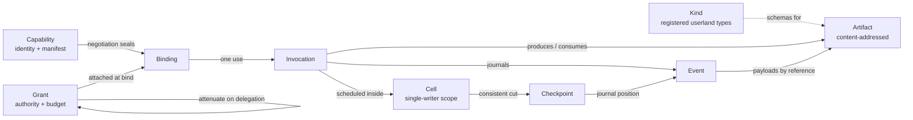
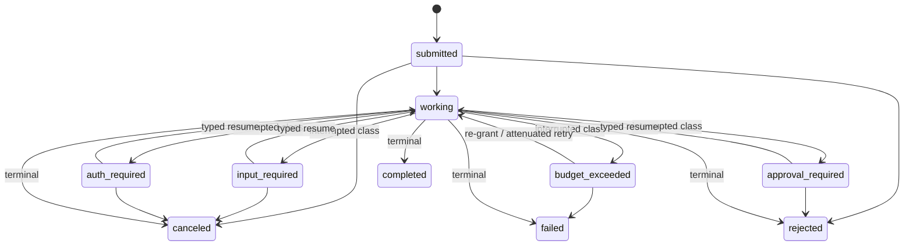

# 05 — Kernel Primitives: Deriving the Minimal Vocabulary

Status: derived from `research/DESIGN-SPINE.md` §2–§3 (pre-adversarial-review). Claim labels follow
`research/METHODOLOGY.md`. Everything in this document not carrying an explicit evidence label is
OUR PROPOSAL. Sibling references: doc 02 (Ecosystem Research), doc 03 (Harness Comparison), doc 04
(Orchestration Strategies), doc 06 (Capability Contract), doc 08 (Failure Semantics), doc 09/10
(Context and Memory), doc 16 (ADRs).

This document answers mission Phase 4: what is the smallest set of concepts the Kyxo kernel may
contain, why each survives the admission test, and — equally important — why eighteen familiar
concepts are refused admission and what represents them instead.

---

## 1. The admission rule

The constitution of this document is Liedtke's minimality principle, quoted verbatim:

> "A concept is tolerated inside the µ-kernel only if moving it outside the kernel, i.e.,
> permitting competing implementations, would prevent implementation of the system's required
> functionality."
> — Jochen Liedtke, *On µ-Kernel Construction*, SOSP '95 (FACT, research/notes/prior-art-negotiation-extension.md)

The historical context matters because it carries two corollaries we adopt as binding:

- **The Mach corollary.** First-generation microkernels (Mach) failed not because minimality was
  wrong but because the primitive everything was forced through — IPC at ~100µs — was slow;
  Liedtke's L4 recovered the architecture with order-of-magnitude cheaper IPC through radical
  minimality (FACT, research/notes/prior-art-negotiation-extension.md). Kyxo's IPC-equivalent is
  the context/artifact handoff between harness, model adapter, and tool runtime. If crossing the
  kernel boundary copies megabyte-scale payloads, the minimal kernel loses to monolithic
  frameworks exactly as Mach lost to monolithic kernels. Hence Artifact (§2.5) is designed as a
  near-zero-cost reference-passing primitive before it is anything else.
- **The removal corollary.** The L4 family later deleted features initially thought minimal (long
  IPC, IPC timeouts, hierarchical process models), and seL4 pushed even kernel memory allocation
  into userland (FACT, research/notes/prior-art-negotiation-extension.md). Minimality is a test
  you keep applying. Every object below is designed so that its future removal or demotion does
  not break the userland contract.

**Required functionality** is defined, exhaustively, as four properties. A concept enters the
kernel only if competing userland implementations of it would prevent one of these:

| Property | Meaning in Kyxo |
|---|---|
| **Security** | No userland composition can forge authority, amplify privilege, or bypass a deny-class policy stage. "The AI cannot grant itself privilege" must be structural, not conventional. |
| **Accounting** | Every unit of consumption (tokens, money, wall-clock, invocations, spawn depth) is attributed to a grant lineage and charged atomically with the effect that consumed it. |
| **Recovery** | Any execution can be resumed, forked, or repaired from a kernel-owned consistent record after arbitrary failure, without cooperation from the code that crashed. |
| **Coordination** | Independently authored components interoperate through one invocable contract without pairwise glue, and observe one truth plane without private side channels. |

Everything else — intelligence, planning, conversation, memory policy, orchestration shape — is
explicitly *not* required functionality, because the evidence shows competing userland
implementations of each are not only possible but are the healthy state of the ecosystem
(research/DESIGN-SPINE.md §1, H1).

Each candidate primitive is interrogated with the mission's six questions, verbatim:

1. *Why does this need to exist?*
2. *Can it be represented using another primitive?*
3. *Fundamental or convenient?*
4. *Does it encode assumptions about today's AI?*
5. *Would removing it reduce expressiveness?*
6. *Could a future paradigm fit within it?*

---

## 2. The nine kernel objects

The object graph, for orientation:

### 2.1 Capability

**Definition.** The unit of invocable function: a stable identity plus a versioned, axis-typed
manifest declaring invocation shapes (request/response-with-streaming and bidirectional session
are both first-class), feature axes with tiers, an `experimental` bag, and governed reverse-DNS
extensions (detail in doc 06). Everything northbound and southbound of the kernel is one: model
adapters, tools, MCP servers, harnesses, graph strategies, verifiers, humans, execution
environments, remote runtimes.

**The six questions.**
1. *Why does this need to exist?* Coordination is the required functionality it carries. Without
   one invocable contract, every component pairing is bespoke glue, and policy/accounting have no
   uniform interposition point.
2. *Can it be represented using another primitive?* No. Its manifest is data and could live in a
   Kind, but invocability is not data: dispatch, policy attachment, and grant checking at the
   call boundary must be kernel behavior, or a userland "capability" is just a name a model can
   fabricate.
3. *Fundamental or convenient?* Fundamental — it is the ground type every other object references.
4. *Does it encode assumptions about today's AI?* No. The manifest grammar is axis-typed and
   contains no chat, token, or transformer assumptions; models appear only as adapters behind
   capabilities, and non-chat task shapes (embed, rerank, classify, transcribe) are invocation
   profiles, not chat impersonations (research/DESIGN-SPINE.md §4).
5. *Would removing it reduce expressiveness?* Yes, catastrophically: no uniform invocation means
   no uniform policy, accounting, or provenance — the kernel would guarantee nothing about
   anything it did not itself implement.
6. *Could a future paradigm fit within it?* Yes. A new interaction paradigm arrives as new
   manifest axes plus (at worst) a new invocation profile; the bidirectional-session shape
   already covers non-request/response paradigms.

**Prior art.**

> **Evidence** — MCP's three-tier capability grammar (typed named capabilities + `experimental` +
> governed `extensions`) survived a full architectural rewrite of its host protocol (FACT,
> research/notes/mcp-protocol.md). A2A standardizes a totally opaque executor behind a declared
> card, proving delegation needs no visibility into cognition (FACT/SOURCE-CODE OBSERVATION,
> research/notes/a2a-protocol.md). LSP, Wayland globals, TLS extensions, QUIC parameters, and WIT
> worlds independently converge on declared, feature-granular contracts (FACT,
> research/notes/prior-art-negotiation-extension.md). MAF reaches for the same thing with
> informal `Supports*Tool` runtime-checkable protocols — unversioned, non-negotiated
> (SOURCE-CODE OBSERVATION, research/notes/microsoft-autogen-sk-agent-framework.md). PydanticAI,
> OpenAI's sandbox-agents beta, and Codex all grew first-class capability constructs in 2026
> (research/DESIGN-SPINE.md §1, H2).
> **Interpretation** — every mature system needs this object; the ones that lack a formal version
> of it (MAF) hit a documented ceiling (no negotiation, no versioning).
> **Implication** — Capability is admitted with the manifest grammar specified in doc 06.
> **Confidence** — HIGH.

**Deliberately does NOT include.** Competence claims — a declaration gates *eligibility* only;
probe results and outcome telemetry are separate evidence streams that drive *selection*
(research/DESIGN-SPINE.md §1, C3). No execution semantics, no pricing, no UI surface, no
authority (that is Grant). A capability that merely exists confers nothing.

### 2.2 Binding

**Definition.** The sealed result of capability negotiation: capability identity + the chosen
dialect/tier set (intersection of two-sided declared feature sets) + the attached Grant + the
resolved policy route. Sealed at bind time: unknown declared features are ignored
(must-ignore), use of an unnegotiated feature is a hard error (unsolicited-use-is-error), and
GREASE values are injected from v0 to keep every implementation's ignore path exercised.

**The six questions.**
1. *Why does this need to exist?* Security and accounting attach here. The moment of converting a
   discovered manifest into usable authority is exactly where policy must interpose and where the
   feature set must be fixed so later invocations are checkable.
2. *Can it be represented using another primitive?* No. A userland binding is a forgeable claim;
   the negotiation-and-seal step must be kernel-performed or an orchestration strategy could
   assert dialects and grants the target never agreed to.
3. *Fundamental or convenient?* Fundamental. The prior-art synthesis identifies declaration
   (registry) and authority (references) as duals, with *binding as the act that converts a
   discovery into a capability under policy* (research/notes/prior-art-negotiation-extension.md).
4. *Does it encode assumptions about today's AI?* No — the mechanism is lifted from LSP/TLS/QUIC,
   systems with zero AI content. The *axes being negotiated* encode today's model diversity, but
   axes are data, not kernel structure.
5. *Would removing it reduce expressiveness?* Yes: without a sealed feature set, every invocation
   must renegotiate or guess, and the documented failure modes return — silent degradation on one
   provider, hard 400s on another (research/DESIGN-SPINE.md §1, H4).
6. *Could a future paradigm fit within it?* Yes; negotiation is feature-granular, never
   version-granular, precisely so a 2026 consumer can bind a 2030 provider by intersection.

**Prior art.**

> **Evidence** — LSP's two-sided `initialize` capability exchange with must-ignore rules (FACT);
> TLS 1.3's frozen version field, extension-vector negotiation, abort-on-unsolicited rule, and
> GREASE (FACT); Wayland's bind-at-chosen-version against advertised globals (FACT); HTTP `Vary`
> as negotiation provenance (FACT) — all research/notes/prior-art-negotiation-extension.md. MCP
> re-based negotiation on per-request declaration plus typed mismatch errors and kept it through
> the stateless pivot (FACT, research/notes/mcp-protocol.md).
> **Interpretation** — bind-time intersection with asymmetric tolerance rules is the only
> negotiation design with a multi-decade survival record.
> **Implication** — Binding admitted; its computation is the "capability negotiation" entry in
> the vocabulary (§6) and the sole way authority meets function.
> **Confidence** — HIGH.

**Deliberately does NOT include.** A transport connection or session — bindings are
transport-agnostic and survive reconnects (MCP's session removal is the cautionary precedent,
research/notes/mcp-protocol.md). Not a permission by itself: authority quantity lives in the
Grant it references. Not discovery: registries and advertisement events are stdlib.

### 2.3 Invocation

**Definition.** One use of a Binding. Async-first task lifecycle with a **closed transition
algebra** extending A2A's states; carries an idempotency key, correlation ID, causation ID, and
grant reference. Suspensions are typed payloads (suspend/resume schemas), generalizing A2A's
auth-required escalation chaining to approvals and budget exhaustion.

**The six questions.**
1. *Why does this need to exist?* Accounting and recovery hang on it: budgets are decremented at
   invocation commit, the exactly-once illusion (at-least-once delivery + kernel-owned dedup
   windows keyed by idempotency key) is enforced here, and lineage (correlation/causation) makes
   the journal auditable.
2. *Can it be represented using another primitive?* Not fully. Its history is Events, but the
   *closed* algebra is an enforcement property: a userland lifecycle is a naming convention any
   strategy can violate, and A2A demonstrates the cost of leaving transitions spec-implied
   rather than enumerated (INFERENCE/HIGH, research/notes/a2a-protocol.md, open question 1).
3. *Fundamental or convenient?* Fundamental. Every surveyed durable system has an effect unit
   (Activity, `ctx.run`, step) with the same idempotency requirement (FACT,
   research/notes/durable-execution.md).
4. *Does it encode assumptions about today's AI?* One deliberate bias: async-first with typed
   human/policy suspensions, because agents wait on humans for days. That is an assumption about
   *deployment reality*, not model architecture, and the blocking fast path is a caller
   convenience flag.
5. *Would removing it reduce expressiveness?* Yes: without a kernel lifecycle there is no commit
   point, hence no place to charge budgets, gate verification, or deduplicate retries.
6. *Could a future paradigm fit within it?* Yes. New suspension *kinds* arrive as typed payloads
   on the existing interrupted states, not as new states — a deliberate divergence from A2A's
   state-machine extensions, flagged in §7.

**Prior art.**

> **Evidence** — A2A's nine-state enum with terminal/interrupted classification, including the
> two states most designs forget (`rejected`, `auth-required`) (SOURCE-CODE OBSERVATION/HIGH,
> research/notes/a2a-protocol.md). MCP's Tasks extension independently converged on a
> near-isomorphic lifecycle (FACT, research/notes/mcp-protocol.md). Restate/DBOS/Temporal impose
> identical idempotency-on-effects requirements and synthesize exactly-once from at-least-once
> plus dedup keys, never as a transport guarantee (FACT, research/notes/durable-execution.md).
> MRTR shows suspensions can be sealed, replica-independent data (FACT,
> research/notes/mcp-protocol.md).
> **Interpretation** — the opaque long-running executor contract has been invented at least three
> times; the kernel should implement it once and project it onto A2A and MCP-tasks as dialects.
> **Implication** — Invocation admitted with the closed algebra above; doc 08 carries the failure
> mapping.
> **Confidence** — HIGH.

**Deliberately does NOT include.** Retry policy (a policy-pipeline concern), progress
percentages (advisory-plane projections), tool schema semantics (manifest), planning of any
kind. The kernel schedules invocations; it never plans them (research/notes/durable-execution.md).

### 2.4 Event

**Definition.** A typed, versioned, append-only journal record — the truth plane. Two-tier by
construction: payloads live in content-addressed Artifacts, the journal holds references. Every
event carries correlation, causation, and actor IDs plus the config/definition hashes it was
produced under. Live observation streams (tokens, attempts, progress) are *projections* with
explicitly weaker guarantees: at-least-once, truncatable, retry-visible — the advisory plane.

**The six questions.**
1. *Why does this need to exist?* Recovery and audit require kernel-owned truth. If two
   components disagree about what happened, the journal is the arbiter; nothing else may be.
2. *Can it be represented using another primitive?* No — everything else is represented *in* it.
   It is the bottom of the representational stack.
3. *Fundamental or convenient?* Fundamental; every system studied that works has an append-only
   record as its working source of truth (research/DESIGN-SPINE.md §1, H5).
4. *Does it encode assumptions about today's AI?* The two-tier split is motivated by today's
   megabyte-scale contexts, but reference-passing is the correct design at any payload size (the
   Mach corollary), so the assumption is load-bearing without being paradigm-coupled.
5. *Would removing it reduce expressiveness?* Removing it removes the system. The real question
   is typed-vs-untyped, answered by ADK's failure below.
6. *Could a future paradigm fit within it?* Yes: event types are versioned with
   one-storage-version-plus-conversion semantics (the CRD discipline applied to our own record
   format), so new event kinds and schema evolution are the designed-for case.

**Prior art.**

> **Evidence** — ADK's `Event` extends the provider response type `LlmResponse`, and widening it
> (adding `node_info`, `output`) broke downstream session stores and validators in 2.0 (FACT +
> SOURCE-CODE OBSERVATION, research/notes/google-adk.md). ADK also proves the upside: state,
> checkpoints, undo, compaction, routing, HITL, and UI all fold from one log. Temporal's Workflow
> Streams documentation concedes the truth plane and the live observation plane cannot be one
> channel — retried attempts' partial tokens must reach observers while durable state sees only
> the successful return (FACT, research/notes/durable-execution.md). A2A independently lands on
> "state is authoritative, events are advisory" (INFERENCE/HIGH, research/notes/a2a-protocol.md).
> MAF collapsed its event hierarchy into one versioned discriminated union for serialization and
> cross-language parity (SOURCE-CODE OBSERVATION, research/notes/microsoft-autogen-sk-agent-framework.md).
> **Interpretation** — one journal, typed envelope, never inheriting a provider shape, with a
> separate advisory plane, is the consensus of everyone's scars.
> **Implication** — Event admitted as specified; the journal schema is a published contract
> (portable execution record, gap 5 in research/DESIGN-SPINE.md §6).
> **Confidence** — HIGH.

**Deliberately does NOT include.** Provider message shapes (adapter concern); the live streams
themselves (projections, stdlib); OTel spans (an export projection, never a second bus);
positional-replay determinism — Kyxo is journal-first (record-and-inject), not replay-first,
because prompts change weekly and Temporal-style command matching taxes exactly that
(research/notes/durable-execution.md, implication 1).

### 2.5 Artifact

**Definition.** Content-addressed, immutable payload plus provenance: producing invocation,
inputs, and structural labels (taint/integrity/confidentiality) that propagate through
derivation. The kernel's crossing primitive: passing an Artifact across any boundary passes a
reference, never a copy.

**The six questions.**
1. *Why does this need to exist?* Three required properties meet here: coordination (zero-copy
   handoff — the Mach lesson), security (labels enforced structurally, not by scanning), and
   recovery (the journal stays small because payloads live here).
2. *Can it be represented using another primitive?* Events could inline payloads — and every
   system that did so hit hard limits: 51,200-event/50MB histories, 2MB payload caps, base64 tax,
   sessions dying at Continue-As-New (FACT, research/notes/durable-execution.md). The claim-check
   retrofits (Temporal External Storage, DBOS "return S3 pointers") are this object, built late.
3. *Fundamental or convenient?* Fundamental by the accumulated retrofit evidence.
4. *Does it encode assumptions about today's AI?* No; content addressing and immutability are
   paradigm-free. The *label vocabulary* (prompt-injection taint) reflects today's threat model
   but labels are extensible data.
5. *Would removing it reduce expressiveness?* Yes: no provenance means verification gates have
   nothing to check; no content addressing means no memoization, no cache keys, no dedup.
6. *Could a future paradigm fit within it?* Yes — any paradigm's outputs are bytes with
   provenance. Modality changes (audio, video, weights-diffs) are new media types, not new
   objects.

**Prior art.**

> **Evidence** — the history-growth pathology is the single most repeated AI-specific failure in
> durable execution (FACT, research/notes/durable-execution.md, implication 2). A2A makes
> Artifacts the mandatory output channel ("Messages SHOULD NOT be used to deliver task outputs")
> but declares lineage explicitly out of scope, pushing version tracking to clients (FACT,
> research/notes/a2a-protocol.md). ADK versions artifacts but has no content addressing and no
> provenance beyond the log (SOURCE-CODE OBSERVATION, research/notes/google-adk.md). FIDES
> productizes label propagation with deterministic enforcement at the tool boundary — as
> middleware, per-framework (SOURCE-CODE OBSERVATION,
> research/notes/microsoft-autogen-sk-agent-framework.md). HTTP's `Vary` shows derived results
> must record what they depended on (FACT, research/notes/prior-art-negotiation-extension.md).
> **Interpretation** — everyone needs this object; nobody makes provenance-plus-labels an
> invariant. Retrofitting it as middleware (FIDES) works but does not compose across frameworks.
> **Implication** — Artifact admitted with provenance and labels as kernel invariants (gap 4 in
> research/DESIGN-SPINE.md §6).
> **Confidence** — HIGH.

**Deliberately does NOT include.** Mutation (a "new version" is a new artifact linked by
provenance); semantic typing (that is a Kind schema applied to an artifact); storage backend
choice (conformance-tested interface, doc 16); retention/GC policy (policy pipeline).

### 2.6 Cell

**Definition.** A keyed, single-writer, stateful execution scope with activation-on-demand.
Sessions, agent configurations at runtime, harness runs, and graph executions all live in cells.
One write-turn at a time per key; shared-read access concurrent; state delivered with
activation; journal partitioned per cell.

**The six questions.**
1. *Why does this need to exist?* Coordination and recovery: single-writer consistency is the
   property that makes "append to the journal" and "fold state" race-free, and a consistent cut
   (Checkpoint) is only definable over a scope with one writer.
2. *Can it be represented using another primitive?* No. A userland mutual-exclusion convention is
   exactly the thing concurrent strategies violate first; Temporal users rebuilding Entity
   Workflows out of Continue-As-New gymnastics is the documented cost of not having it (FACT,
   research/notes/durable-execution.md).
3. *Fundamental or convenient?* Fundamental, by the strongest convergence signal in the durable
   note: Orleans grains, Restate Virtual Objects, and Temporal entity workflows are three
   independent reinventions of keyed single-writer stateful identity (INFERENCE/HIGH,
   research/notes/durable-execution.md).
4. *Does it encode assumptions about today's AI?* No — the shape predates AI agents (Orleans,
   2014-era). Its AI instantiation (session-as-cell) is one use among many.
5. *Would removing it reduce expressiveness?* Yes: no isolation scope means no per-scope budgets,
   no consistent checkpoints, and every strategy must hand-roll locking.
6. *Could a future paradigm fit within it?* Yes; anything that executes over time with state fits
   a keyed scope. A paradigm with no state at all simply uses ephemeral cells.

**Prior art.**

> **Evidence** — the triple convergence above (INFERENCE/HIGH, research/notes/durable-execution.md);
> Restate's queue-per-key write serialization with shared-read handlers (FACT); LangGraph's
> thread as a checkpoint lineage tree (SOURCE-CODE OBSERVATION, research/notes/langgraph.md);
> Erlang processes/Fuchsia processes/Plan 9 namespaces defining an executing entity
> extensionally, by what it holds (FACT, research/notes/prior-art-negotiation-extension.md).
> **Interpretation** — keyed single-writer scope is the unit an "agent" actually runs in once
> the word agent is decomposed.
> **Implication** — Cell admitted; the scheduler (§3.2) owns its turns.
> **Confidence** — HIGH.

**Deliberately does NOT include.** A process, container, or thread — execution environments are
leasable capabilities, and a cell may span environment restarts. Not an agent (an agent is a
configuration *placed in* a cell). No default reentrancy. Not a distribution unit: V1 is
single-node; distribution is portable checkpoints plus protocol edges, never an in-kernel mesh
(research/DESIGN-SPINE.md §8; AutoGen's gRPC mesh death, SOURCE-CODE OBSERVATION,
research/notes/microsoft-autogen-sk-agent-framework.md).

### 2.7 Grant

**Definition.** An unforgeable, attenuable, revocable authority reference carrying both rights
(what may be invoked, at what risk class) and quantitative budget (tokens, money, wall-clock,
invocations, spawn depth/width). Grants form a lineage tree; delegation mints a child that is
mandatorily ≤ its parent; revocation is transitive over the subtree; the kernel decrements
budgets atomically at invocation commit. Object-capability discipline throughout: no ambient
authority, and interposition is invisible to the holder.

**The six questions.**
1. *Why does this need to exist?* It *is* the security property, and half the accounting
   property. "The AI cannot grant itself privilege" reduces to: authority is a kernel-issued
   reference, not a name a model can emit.
2. *Can it be represented using another primitive?* The rights half could naively be an ACL
   database consulted by policy — but ACL evaluation centralizes and does not attenuate cleanly
   under delegation-heavy workloads (INFERENCE/MEDIUM,
   research/notes/prior-art-negotiation-extension.md). The budget half cannot be userland at
   all: decrement must be atomic with journal commit or double-spending across concurrent
   invocations is unpreventable. A userland ledger reading the journal is always one race behind.
3. *Fundamental or convenient?* Rights: fundamental, on four-way independent convergence
   (seL4, Zircon, Cap'n Proto, E). Budgets-as-attenuated-quantitative-rights: fundamental by
   argument, with limited direct prior art — this is our one genuinely novel kernel object and is
   flagged as the design's largest evidentiary exposure (research/DESIGN-SPINE.md §3;
   research/notes/prior-art-negotiation-extension.md, open question 6).
4. *Does it encode assumptions about today's AI?* Budget dimensions (tokens) name today's cost
   unit, but dimensions are an open set; the structure (metered attenuable rights) is
   paradigm-free.
5. *Would removing it reduce expressiveness?* Yes — it removes the product. The ecosystem
   state-of-the-art without it is `max_llm_calls = 500` as an integer (SOURCE-CODE OBSERVATION,
   research/notes/google-adk.md) and delegate-agent token usage silently dropped at effect
   boundaries (FACT, research/notes/durable-execution.md, Pydantic AI leak inventory).
6. *Could a future paradigm fit within it?* Yes: any future consumable (GPU-seconds, sandbox
   leases, human attention minutes) is a new budget dimension on the same lineage algebra.

**Prior art.**

> **Evidence** — seL4's mint-with-subset-of-rights and transitive revoke; Zircon's
> rights-on-handles with kernel objects doing no authorization; Cap'n Proto's
> possession-is-authority references; E's no-ambient-authority discipline (all FACT,
> research/notes/prior-art-negotiation-extension.md). Absence of budget lineage everywhere in
> the AI stack: no budget concept in MCP (FACT-by-absence, research/notes/mcp-protocol.md), none
> in A2A (FACT-by-absence, research/notes/a2a-protocol.md), none in any durable engine, one
> integer in ADK, a single function-invocation budget key in MAF's harness (SOURCE-CODE
> OBSERVATION, research/notes/microsoft-autogen-sk-agent-framework.md).
> **Interpretation** — authority-as-reference is settled engineering; metered authority is the
> unclaimed extension the mission exists to claim.
> **Implication** — Grant admitted; doc 08 specifies decrement/refund semantics and the
> budget-exceeded escalation chain; the checkpoint-vs-revocation tension is an open issue (§7).
> **Confidence** — HIGH on rights; MEDIUM on budgets (novelty risk, not mechanism risk).

**Deliberately does NOT include.** Principal identity and authentication — those live at
protocol edges (OAuth 2.1, CIMD, JWS-signed cards; FACT, research/notes/mcp-protocol.md,
research/notes/a2a-protocol.md); a Grant references an actor, it does not authenticate one. No
policy language (pipeline). No price schedules or billing (userland over accounting events).

### 2.8 Checkpoint

**Definition.** A named consistent cut of a cell: journal position + state snapshot + pending
invocations (including pending typed suspensions), bound to definition identity (strategy hash +
config lineage), portable across processes. Fork-from-checkpoint is the primary repair and
upgrade verb.

**The six questions.**
1. *Why does this need to exist?* Recovery. Only the journal owner can cut consistently; a
   userland snapshotter races the very writes it snapshots.
2. *Can it be represented using another primitive?* Journal position alone suffices in theory
   (replay from zero), but O(history) resume is the documented pathology — Temporal's sticky
   cache and Fowler's snapshots both exist to escape it (FACT,
   research/notes/durable-execution.md); ADK's full log-scan resume with replay barriers is the
   in-the-wild cost, and first-class checkpoint records are ADK's own open TODO (SOURCE-CODE
   OBSERVATION, research/notes/google-adk.md). Snapshot + journal position + pending effects is
   one composite primitive, per LangGraph's `pending_writes` lesson (SOURCE-CODE OBSERVATION,
   research/notes/langgraph.md).
3. *Fundamental or convenient?* Fundamental for recovery at any realistic history length.
4. *Does it encode assumptions about today's AI?* One: it is bound to definition identity because
   AI "code" (prompts, tool wiring, model choice) is data that changes weekly, so checkpoints
   must validate compatibility by hash rather than assume code stability
   (research/notes/durable-execution.md, implication 8). That assumption strengthens rather than
   narrows the design.
5. *Would removing it reduce expressiveness?* Resume, fork-for-debugging, migration, and upgrade
   all degrade to replay-from-zero or disappear.
6. *Could a future paradigm fit within it?* Yes; any paradigm executing in a cell inherits cuts
   for free. Provider-side state (Responses-API conversations) is mirrored via remote cells and
   carry-through artifacts rather than breaking the cut (research/DESIGN-SPINE.md §5).

**Prior art.**

> **Evidence** — MAF's `WorkflowCheckpoint` is definition-scoped, lineage-chained
> (`previous_checkpoint_id`), topology-hash-validated (`graph_signature_hash`), and stores
> pending request-info events so a paused-awaiting-human workflow rehydrates in a fresh process
> (SOURCE-CODE OBSERVATION/HIGH, research/notes/microsoft-autogen-sk-agent-framework.md).
> LangGraph's checkpoint (channel values + version vectors + pending writes) plus a published
> checkpointer conformance suite (SOURCE-CODE OBSERVATION, research/notes/langgraph.md). DBOS
> fork-from-step and Restate 1.6 restart-from-any-journal-point as the operational verbs agents
> actually need (FACT/OBSERVED BEHAVIOR, research/notes/durable-execution.md). Cursor's `&`
> handoff proves commercial state-transfer migration (research/DESIGN-SPINE.md §3, citing
> cursor.md).
> **Interpretation** — checkpoint-as-portable-artifact, validated by definition hash, is the
> convergent production shape.
> **Implication** — Checkpoint admitted; the storage interface is conformance-tested
> (research/DESIGN-SPINE.md §8).
> **Confidence** — HIGH.

**Deliberately does NOT include.** The journal itself (a checkpoint references a position); any
requirement that old code paths survive upgrades (the anti-Temporal-patching decision,
research/DESIGN-SPINE.md §7); a live-migration wire protocol (protocol edge, later wave).

### 2.9 Kind

**Definition.** A registered userland type — the CRD move. Objective, Plan, Evidence, Memory
block, TestReport, and every future concept are Kinds: the kernel provides storage, JSON-schema
validation, multi-version serving with one storage version plus conversion, and watch streams.
All *semantics* live in userland controllers and strategies.

**The six questions.**
1. *Why does this need to exist?* Coordination over time: it is how new concepts arrive without
   kernel changes — the future-proofing mechanism itself. Competing userland type registries
   would fragment the one thing that must be shared: the schema of what exists.
2. *Can it be represented using another primitive?* Artifacts hold instances; Kind holds the
   *schemas and serving machinery*. Without kernel-served validation and watch, every strategy
   pair needs bilateral schema agreements.
3. *Fundamental or convenient?* Fundamental for evolution, on the strength of the most successful
   userland-types mechanism in production software (FACT: Kubernetes CRDs,
   research/notes/prior-art-negotiation-extension.md).
4. *Does it encode assumptions about today's AI?* None — deliberately. Kind exists precisely so
   that today's AI concepts (Objective, Plan) are *not* kernel objects.
5. *Would removing it reduce expressiveness?* Not immediately — and that is the trap: every
   concept pressure would then aim at the kernel, and the kernel would grow. Kind is the
   pressure-relief valve that keeps the other eight objects at nine.
6. *Could a future paradigm fit within it?* This question is Kind's definition. Yes.

**Prior art.**

> **Evidence** — K8s CRDs with single storage version + conversion webhooks + watch (FACT);
> VS Code contribution points indexed without executing extension code (FACT) — both
> research/notes/prior-art-negotiation-extension.md. MCP's extensions framework and A2A's
> URI-keyed extensions are the same move at protocol scale, with graduation ladders (FACT,
> research/notes/mcp-protocol.md, research/notes/a2a-protocol.md).
> **Interpretation** — mature platforms all externalize type growth; the ones that do not
> (ADK's widening Event) pay in breakage.
> **Implication** — Kind admitted; the mission's "Objective/Plan/Evidence" candidates land here,
> not in the kernel (§5).
> **Confidence** — HIGH.

**Deliberately does NOT include.** Controllers, reconciliation logic, or any interpretation of
instances; invocability (a Kind is not callable — a controller watching a Kind is a capability);
no blessed ontology (the stdlib ships starter Kinds; they are replaceable).

---

## 3. The two kernel mechanisms

Mechanisms, not objects: they have no persistent identity of their own; they are behavior the
kernel performs over the nine objects. Their *configurations* are data (policy stages, schedules)
referencing capabilities.

### 3.1 Policy pipeline

**Definition.** An ordered, declarative sequence of stages evaluated at bind time and at every
effectful invocation; deny-class stages are non-bypassable; stages may mutate (attenuate,
redact, reroute), require (Evidence artifacts before commit — the verification gate), or veto.
Interposition is invisible to the holder of the interposed capability.

**The six questions.** (1) *Why does this need to exist?* Security: a policy layer that userland
can reorder or skip is not a policy layer; the ordering and non-bypassability are the kernel
property. (2) *Can it be represented using another primitive?* Stages are capabilities and their
configuration is Kind-registered data — only the guaranteed evaluation semantics need the
kernel, which is why this is a mechanism rather than a tenth object. (3) *Fundamental or
convenient?* Fundamental; every framework grew an imperative approximation (ADK plugins as
"de facto policy engine" in in-process Python — INFERENCE/MEDIUM, research/notes/google-adk.md;
MAF middleware bundles — SOURCE-CODE OBSERVATION,
research/notes/microsoft-autogen-sk-agent-framework.md), and imperative in-process policy is
exactly what a compromised strategy bypasses. (4) *Assumptions about today's AI?* The stage
vocabulary (taint checks, approval gates) reflects today's threats; the pipeline shape does not.
(5) *Removing it?* Policy becomes convention; the security property evaporates. (6) *Future
paradigm?* New stage types are new capabilities; the pipeline is indifferent to what it gates.

**Prior art.** Claude Code's six-step permission pipeline is the proven shape
(research/DESIGN-SPINE.md §3, citing anthropic-claude-code-agent-sdk.md). FIDES demonstrates
deterministic label-based enforcement at the tool boundary, but as per-framework middleware
(SOURCE-CODE OBSERVATION, research/notes/microsoft-autogen-sk-agent-framework.md). seL4
interposition and Component Model import-virtualization are the same move — wrap a capability in
a filter the holder cannot detect (FACT, research/notes/prior-art-negotiation-extension.md). The
commit-point verification hook is absent in every system studied — ADK, A2A, MCP, and all three
durable engines equate success with "no exception" (FACT-by-absence across
research/notes/google-adk.md, research/notes/a2a-protocol.md, research/notes/durable-execution.md)
— making the gate genuine differentiation, not repackaging. Confidence: HIGH.

**Deliberately does NOT include.** A policy *language* (stages are declarative data + capability
references; expression languages are userland); judgment (verifiers are capabilities; the
pipeline only requires and checks their Evidence).

### 3.2 Scheduler

**Definition.** Kernel dispatch of invocations within and across cells: cell write-turns, leases
with visibility timeouts on every external effect, timeouts, deadline enforcement, and
cancellation propagation along the causation/grant tree.

**The six questions.** (1) *Why does this need to exist?* Coordination and accounting:
single-writer turns must be arbitrated by the entity that owns the journal, and deadlines/leases
are how wall-clock budget becomes enforceable. (2) *Can it be represented using another
primitive?* No — someone must run the loop; a userland scheduler over kernel cells reintroduces
the forgeable-ordering problem. (3) *Fundamental or convenient?* Fundamental; "the kernel
schedules; it never plans" is the observed split in all three durable systems (FACT,
research/notes/durable-execution.md). (4) *Assumptions about today's AI?* None; leases and
turns are queue-systems engineering (the Celery/SQS triangle: lease + at-least-once + idempotent
consumer — INFERENCE/HIGH, research/notes/durable-execution.md). (5) *Removing it?* No turns, no
cuts, no cancellation guarantees. (6) *Future paradigm?* Scheduling policy (placement, fairness,
priority) is pluggable above the mechanical floor; Orleans' pluggable placement is the precedent
(FACT, research/notes/durable-execution.md).

**Deliberately does NOT include.** Planning, prioritization semantics beyond deadlines, and
distribution (single-node V1; LangGraph's version-vector task planner and MAF's superstep runner
show sophisticated scheduling can live in *strategies* over a simpler kernel floor — SOURCE-CODE
OBSERVATION, research/notes/langgraph.md, research/notes/microsoft-autogen-sk-agent-framework.md).

---

## 4. Rejected primitives

Each entry states why the concept fails the admission test, what represents it, and the cost of
exclusion — stated honestly, because every exclusion has one. The recurring pattern: these
concepts all have *competing userland implementations in production today*, which is the
admission test failing by inspection.

**Agent.** Fails because competing implementations are the ecosystem's normal state, and the
largest vendor abandoned agent-as-type: ADK 2.0's `BaseAgent` subclasses `BaseNode` and its own
workflow-agents are deprecated one major version after shipping (SOURCE-CODE OBSERVATION/HIGH,
research/notes/google-adk.md); prior art defines an executing entity extensionally — it is what
it holds (FACT, research/notes/prior-art-negotiation-extension.md). Represented by: a
configuration — harness + bound capability set + grants + a cell. Cost: DX distance; users think
in agents, so the SDK ships the word as a profile/facade while the kernel never sees it.

**Harness.** Fails because harness quality *is* model coupling (C2): Cursor-class evidence shows
harnesses must be swappable, versioned, benchmarkable per model — i.e., competing implementations
are the product surface, not a threat (research/DESIGN-SPINE.md §1). Microsoft built a
Claude-Code-class harness as pure composition — middleware plus providers around an unchanged
loop, no new kernel concept (SOURCE-CODE OBSERVATION/HIGH,
research/notes/microsoft-autogen-sk-agent-framework.md). Represented by: a behaviour-contract
capability (OTP generic/callback split — FACT, research/notes/prior-art-negotiation-extension.md)
run in a cell; the kernel/stdlib owns generic loop mechanics. Cost: the kernel cannot
special-case one loop's hot path, so the crossing primitive must be near-free (§1, Mach
corollary) — this is a real engineering obligation, priced in.

**Graph.** Fails because the flagship graph runtime does not run a graph: LangGraph's edges do
not exist at runtime — they compile to channels and version-vector scheduling (SOURCE-CODE
OBSERVATION/HIGH, research/notes/langgraph.md); ADK's graph engine is itself a node over the
event log (SOURCE-CODE OBSERVATION, research/notes/google-adk.md); MAF's orchestrations are
builders that emit workflows (SOURCE-CODE OBSERVATION,
research/notes/microsoft-autogen-sk-agent-framework.md). Represented by: a Kind-registered
strategy artifact compiled to cell steps, over kernel-native dynamic invocation spawn with
deterministic identity. Cost: the kernel cannot statically verify topology; whole-graph
analysis moves into strategy compilers.

**Loop.** Fails because termination and continuation policies are irreducibly plural
(no-pending-tools, next-speaker checks, judge verdicts, mistake budgets — all observed variants,
research/DESIGN-SPINE.md §5), so any kernel loop would privilege one. Represented by: harness
behaviour callbacks over scheduler turns. Cost: effectively none observed; zero of eight
competitive coding agents put the loop anywhere but userland (research/DESIGN-SPINE.md §1).

**Planner.** Fails because it is dead as a component across the industry: SK planners deprecated,
MAF ships none (FACT, research/notes/microsoft-autogen-sk-agent-framework.md); ADK's "planner" is
a prompt-shaping shim (SOURCE-CODE OBSERVATION, research/notes/google-adk.md). Represented by:
any capability that emits Plan artifacts (a Kind). Cost: no kernel-level plan awareness, so
plan-adherence guarantees are a userland verification concern.

**Workflow.** Fails for the same reason as Graph — a declarative authoring notation over the same
substrate (MAF's YAML plane compiles to the same runner; LangGraph's functional API is a second
frontend on the same kernel — SOURCE-CODE OBSERVATION, both notes). Represented by: versioned
strategy artifact; runtime mutation = new plan version + fork-from-checkpoint. Cost: workflow
migration semantics are userland; the kernel only pins definition hashes.

**Prompt.** Fails because a prompt is a provider-specific rendering of a compiled context; prompt
encoding level is a negotiated manifest axis, not a structure (research/DESIGN-SPINE.md §4).
Represented by: the context compiler's output view (an Artifact with provenance) encoded by the
model adapter. Cost: prompt-engineering tools get no kernel hook; they operate on context-view
artifacts instead — strictly better provenance, unfamiliar workflow.

**Message/Chat array.** Fails because it is the single most damaging coupling observed: ADK's
`Event extends LlmResponse` leaked one provider's chat shape into the persistence layer and every
consumer (SOURCE-CODE OBSERVATION/HIGH, research/notes/google-adk.md); MCP deprecated sampling —
the protocol-mediated chat inversion — for lack of adoption (FACT,
research/notes/mcp-protocol.md). Represented by: journal Events (truth) + compiled context views
(per-invocation). Cost: every chat-shaped SDK pays a view-compilation step; paid once per
adapter, amortized.

**Tool.** Fails because a tool is a capability profile, not a distinct type — the distinction
tool/agent/model dissolves under the invocable contract (a "tool" is a capability with a simple
request/response profile and effect labels). MCP tools map onto manifests at the protocol edge.
Represented by: Capability with the tool profile. Cost: none in expressiveness — unification is
strictly more expressive (humans, verifiers, and remote runtimes become invocable the same way);
the cost is pedagogical, borne by the SDK.

**Model.** Fails because every substrate that works keeps the model out: it is ABSENT as a kernel
concept in all three durable engines, in A2A entirely, and in MCP after sampling's deprecation
(FACT-by-absence, research/notes/durable-execution.md, research/notes/a2a-protocol.md,
research/notes/mcp-protocol.md). Represented by: model adapter capabilities with axis-typed
manifests. Cost: the kernel cannot do model-aware optimization (batching, KV-cache affinity);
those live in adapters and the stdlib — accepted, because the alternative is ADK's fate.

**Provider.** Fails because branching on provider identity is the UA-string mistake reborn;
vendor prefixes are the canonical failure and feature detection the canonical fix (FACT,
research/notes/prior-art-negotiation-extension.md). Represented by: manifests + probes + outcome
telemetry; provider-native surfaces via typed passthrough declared in the manifest
(research/DESIGN-SPINE.md §4). Cost: provider-specific auth/billing flows must be modeled at
protocol edges rather than special-cased — more upfront adapter work.

**Memory-tier.** Fails because tier policy (working/episodic/semantic; decay; consolidation) is
judgment with many live competitors, while the substrate need is only durable labeled state:
LangGraph splits checkpointer from store and leaves policy to userland (FACT,
research/notes/langgraph.md); MAF ships four competing memory providers in one framework
(SOURCE-CODE OBSERVATION, research/notes/microsoft-autogen-sk-agent-framework.md). Represented
by: state cells + Memory-block Kinds + a reassignable memory-manager principal
(research/DESIGN-SPINE.md §5). Cost: no blessed memory model — competing memory systems, which is
the intended market structure.

**Objective.** Fails because the kernel has no opinion about goals; interpreting an objective is
the whole job of strategies. Represented by: a Kind consumed by strategies and controllers.
Cost: "did we achieve the objective?" is not kernel-answerable — it is a verification-gate
question with Evidence, by design.

**Result.** Fails because it is a projection: the terminal Event of an invocation plus the
Artifacts it references. A distinct Result object would duplicate both and invite divergence
(which copy is true?). Represented by: terminal Event + referenced Artifacts; SDKs synthesize
convenience views. Cost: trivial-call ergonomics need SDK sugar (`await invocation` returns the
projected result).

**Observation.** Fails because the RL vocabulary (agent observes, then acts) maps onto journal
reads and compiled views without remainder; admitting Observation would hard-code one cognitive
framing into the substrate. Represented by: Event projections and context views. Cost: RL-style
paradigms must translate vocabulary at the SDK, not structure at the kernel.

**Action.** Fails symmetrically: an action is an effectful Invocation under a Grant. The
terminology difference carries no structural difference. Represented by: Invocation. Cost: none
identified.

**Task-vs-Invocation.** We reject keeping both words as distinct objects. A2A's Message-vs-Task
duality creates documented modeling ambiguity resolved by documentation rather than protocol
(FACT + INFERENCE/MEDIUM, research/notes/a2a-protocol.md), and MCP grew a near-isomorphic Task
lifecycle independently (FACT, research/notes/mcp-protocol.md). Represented by: Invocation only —
everything is a (possibly instantly-completed) invocation with a cheap fast path; A2A Tasks and
MCP tasks are two wire dialects of it at protocol edges. Cost: bookkeeping overhead on trivial
calls — the fast path must be engineered (an unmeasured risk, flagged in §7).

**Supervisor.** Fails twice: as a topology (supervisor-graphs lost to subagents-as-tools;
`langgraph-supervisor` is unmaintained — FACT, research/notes/langgraph.md) and as a kernel
object (OTP shows supervision is a *behaviour* — a library over spawn/monitor primitives, with
restart classes and bounded intensity as declared policy — FACT,
research/notes/prior-art-negotiation-extension.md). Represented by: policy stages (restart
classes, restart-intensity budgets extended to token/cost) + escalation to parent cells or
humans via typed suspensions (research/DESIGN-SPINE.md §7). Cost: no single blessed supervision
tree; the stdlib ships one and it is replaceable.

---

## 5. The mission's candidate vocabulary, mapped

The mission's Phase-4 candidate list, adjudicated. None of the thirteen becomes a kernel object
under its own name; each is either a kernel object under a more precise name, a Kind, or a
derived construct.

| Mission candidate | Verdict | Maps to |
|---|---|---|
| **Objective** | Kind | Userland type consumed by strategies/controllers; kernel stores, validates, watches — never interprets. |
| **Contract** | Kernel, decomposed | Capability manifest (offered contract) + Binding (sealed negotiated contract). Two objects because offer and agreement have different forgery surfaces. |
| **Context** | Derived construct | The compiled per-invocation view produced by the context-management system (stdlib pipeline) — an Artifact with provenance labels, never a stored kernel object. |
| **State** | Kernel, as Cell state | Labeled state within a Cell; durable via Checkpoint; folded from the journal. |
| **Resource** | Kernel, decomposed | Quantitative dimensions on Grants (budgets) + leasable execution-environment capabilities. "Resource" alone was too ambiguous to admit. |
| **Action** | Kernel, renamed | An effectful Invocation under a Grant. |
| **Observation** | Derived construct | A projection of Events (advisory plane) or a journal read (truth plane). |
| **Evidence** | Artifact kind | Content-addressed Artifact of Kind Evidence, produced by verifier capabilities, demanded by policy-pipeline gates at the commit point. |
| **Policy** | Kernel mechanism | Declarative stage configurations (data, Kind-registered) evaluated by the non-bypassable pipeline; stages themselves are capabilities. |
| **Identity** | Split | Inside the kernel: Grant lineage chain + actor IDs on every Event. At protocol edges: OAuth/CIMD/JWS endpoint identity. The kernel never conflates the two. |
| **Execution** | Kernel behavior | The Invocation lifecycle, scheduled in Cells, journaled in Events — not a noun, a composition. |
| **Task** | Kernel, renamed | Invocation. A2A Task and MCP task are protocol-edge dialects of it. |
| **Result** | Derived construct | Terminal Event + referenced Artifacts; SDK-synthesized view. |

---

## 6. The 26-term vocabulary

The full vocabulary of `research/METHODOLOGY.md` and `research/DESIGN-SPINE.md` §2, with
one-line definitions and where each concept lives. "Kernel" = the nine objects and two
mechanisms; "stdlib" = standard capabilities shipped with the runtime; "userland" = replaceable
strategies/plugins; "protocol edge" = adapters to external wire contracts.

| # | Term | One-line definition | Lives in |
|---|---|---|---|
| 1 | Model | Weights + inference procedure behind an API; the kernel never sees it. | Outside (behind protocol edge) |
| 2 | Model API | A wire protocol to inference (Messages, Responses, Realtime/Live); divergent by design, never normalized to an LCD. | Protocol edge |
| 3 | Model adapter | Code-bearing plugin (encode context→wire, decode wire→typed events) with an axis-typed manifest and opaque carry-through artifacts. | Userland capability (stdlib ships common ones) |
| 4 | Agent | A configuration: harness + bound capability set + grants + a cell to run in; never a type. | Userland (SDK facade) |
| 5 | Agent SDK | A vendor's packaged harness + supervisor API consumed as a capability. | Userland / protocol edge |
| 6 | Agent loop | The reactive strategy inside one harness turn cycle. | Userland |
| 7 | Harness | A behaviour contract turning a model into a competent worker; kernel/stdlib owns generic loop mechanics, harness supplies callbacks; itself a capability. | Userland (contract defined in stdlib) |
| 8 | Context-management system | The deterministic context compiler: ordered, inspectable processor pipeline assembling the per-invocation view under a token budget. | Stdlib |
| 9 | Memory system | Durable labeled state cells with provenance, quotas, and a compile hook; management is a reassignable principal. | Stdlib over kernel Cells |
| 10 | Tool runtime | Standard capability providers for effectful primitives (shell, HTTP, files, MCP client) plus their sandboxes. | Stdlib |
| 11 | Execution environment | A leasable capability (workspace, VM, container, browser) with declared build/snapshot lifecycle. | Userland capability (stdlib providers) |
| 12 | Planner | Any capability that emits Plan artifacts; not a component. | Userland |
| 13 | Graph | A declarative orchestration-strategy artifact compiled to cell steps. | Userland |
| 14 | Workflow | Same family as graph: versioned declarative strategy, mutable at runtime via new plan versions. | Userland |
| 15 | State machine | The kernel's closed invocation lifecycle; also available as a userland orchestration strategy. | Kernel (lifecycle) / userland (strategy) |
| 16 | Task runtime | Kernel scheduling of invocations within cells: turns, leases, deadlines, cancellation. | Kernel (scheduler) |
| 17 | Delegation system | Invocation of a capability that is itself an orchestrator, under a mandatorily attenuated grant; a composition, not a mechanism. | Kernel-composed (grants) / userland (patterns) |
| 18 | Multi-agent architecture | Any orchestration strategy coordinating multiple cells via delegation and the artifact space. | Userland |
| 19 | Protocol | External wire contracts (MCP, A2A, ACP-class, provider APIs); adapters at edges, never the internal architecture. | Protocol edge |
| 20 | Capability discovery | Enumerating manifests: registry (static, indexed without execution) + runtime advertisement/removal events + probe invocations. | Stdlib (registry/probes) + kernel (events) |
| 21 | Capability negotiation | Computing a Binding: intersecting requirements with a manifest, choosing dialects/tiers, sealing a typed feature set. | Kernel |
| 22 | Policy/security layer | Grants (object-capability authority + budgets) + the ordered interposition pipeline + structural taint labels. | Kernel |
| 23 | Durable execution | Journal + checkpoint + resume semantics; journal-first, fork-from-checkpoint as the repair verb. | Kernel |
| 24 | Event system | The typed append-only journal (truth plane) + derived live streams (advisory plane, weaker guarantees). | Kernel (journal) / stdlib (projections) |
| 25 | Observability | Projections of the journal (OTel export, traces, dashboards); never a second bolted-on bus. | Stdlib / userland |
| 26 | Application/product UX | Surfaces above the SDK, attached via the same event protocol. | Out of scope / protocol edge |

---

## 7. Standing tensions carried forward

Stated here so the adversarial review attacks the right joints:

1. **Grant budgets are the least-evidenced admission.** The rights half has four-way prior-art
   convergence; the budget half has near-none (research/notes/prior-art-negotiation-extension.md,
   open question 6). Our atomicity argument (decrement must commit with the journal) is an
   argument, not an observation.
2. **Revocation vs. checkpoints.** Transitive revoke of a grant subtree conflicts with resumable
   checkpoints that embed grant references — resume-under-re-resolution (petname-style) weakens
   pure ocap; embedding weakens revocation (research/notes/prior-art-negotiation-extension.md,
   open question 3). Doc 08 must decide; this document only exposes the conflict.
3. **Closed algebra vs. extensible suspensions.** We close the state set and extend via typed
   suspension payloads, deliberately rejecting A2A-style state-machine extensions. If a future
   escalation genuinely needs a new *class* (neither interrupted nor terminal), the algebra
   revs the kernel protocol version — the cost of closedness, accepted for portable
   orchestrators.
4. **The cheap-path bet.** Rejecting the Message/Task duality assumes instantly-completed
   invocations can be made near-free. Unmeasured; the Mach corollary says this number decides
   whether the minimal kernel wins. The prototype (task 4) must produce it.
5. **Kind/Capability boundary.** A Kind plus a watching controller can emulate invocation by
   reconciliation. We hold the line at "Kinds are not callable," but the redundancy is real and a
   reviewer may argue one of the two should absorb the other.
