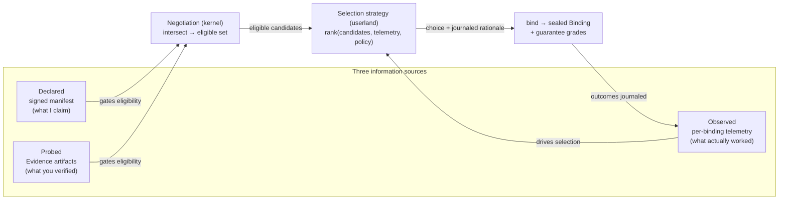
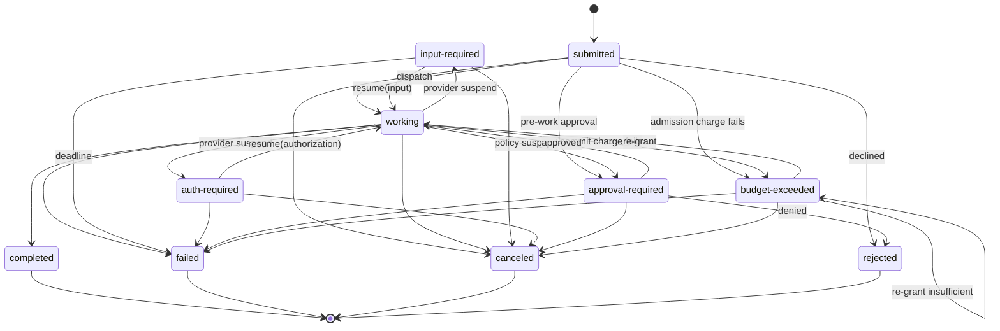

# 06 — Capability Specification

> **Post-review status (2026-08-16).** This document predates the adversarial review; the review's
> binding adjudications live in the Amendment log of `research/DESIGN-SPINE.md` (A1–A14), with the
> full findings in `research/ADVERSARIAL-REVIEW.md`.
> **Applied here:** A2 (reserve/settle/release on the lifecycle and the event vocabulary, §6.2,
> §6.3, §8), A3 (guarantee grades per axis and sealed on the Binding, §2.3a, §5.7),
> A4 (the frozen facade, §8a), A8 (handle-shaped grant references; non-resolvable journal
> references, §5.2, §5.3, §5.7), A9(ii) (Realtime/Live relabeled INFERENCE/HIGH; the
> "elevated to FACT" phrasing deleted, §6.5, §8), A10 (tiered ladders are manifest data, §2.2;
> suspension `origin`, §6.4; journaled cancellation requests, §6.2), A11 (reliability dedup
> window ≠ replay cache, §6.3), A13 (the selection contract, §4.4), A14 (catalog scope and
> badge discipline, §3.4). Also adds the capability **trait** set the executable kernel branches
> on (§2.7). **Outstanding:** none.
> Where this document conflicts with the Amendment log, **the amendment log governs**.
>
> **Executable semantics supersede prose.** `prototypes/kernel-semantics/src/` (`kernel.ts`,
> `types.ts`, `capabilities.ts`) is the normative reference for the provider contract, the
> proposal channel, and the invocation lifecycle. Where this document's narrative and that code
> disagree, the code is correct and this document is the defect. The most consequential
> supersession: **a capability provider holds no kernel handle** (§8, §8a).


**Status: V0 DRAFT (pre-adversarial-review).** This document is the normative specification of
the Kyxo capability contract: identity, manifest grammar, discovery, probes, negotiation,
binding, invocation lifecycle, escape hatches, and the projection of external systems onto the
contract. It elaborates `research/DESIGN-SPINE.md` §4 (capability contract) and §3 objects 1–3
(Capability, Binding, Invocation) and is written to be implementable against
`prototypes/kernel/types.ts`, which realizes a strict subset of this spec. Where this document
goes beyond the prototype, the delta is marked **[V0-OPEN]**.

Conventions: MUST / SHOULD / MAY per RFC 2119/8174. All normative design content is OUR
PROPOSAL by default; evidence claims carry explicit labels per `research/METHODOLOGY.md`.
Vocabulary is used exactly as defined in the design spine §2 and 05-KERNEL-PRIMITIVES.md —
in particular *capability*, *Binding*, *Invocation*, *harness*, *model adapter*, and *cell*
are never interchangeable.

Sibling documents: the kernel objects this spec depends on are derived in
05-KERNEL-PRIMITIVES.md; the journal/checkpoint semantics referenced in §6 are specified in
08-EVENT-AND-STATE-MODEL.md; Grant/policy mechanics in 11-SECURITY-AND-POLICY.md; the
extension governance machinery in 12-EXTENSION-MODEL.md.

---

## 1. CapabilityIdentity

### 1.1 Identifier

Every capability carries a `CapabilityIdentity`:

```json
{
  "id": "cap:com.anthropic/messages-adapter",
  "version": "3.2.0",
  "publisher": "https://publishers.example/com.anthropic",
  "stability": "stable",
  "manifestHash": "sha256:9f2c…",
  "signatures": [ { "protected": "eyJhbGciOi…", "signature": "MEUCIQ…" } ]
}
```

- `id` is a URN-shaped string `cap:<publisher-namespace>/<name>`, where
  `<publisher-namespace>` is a reverse-DNS namespace whose ownership is verifiable
  (DNS or repository-hosting proof). The name grammar is `[a-z0-9_.-]{1,128}` on both
  segments. Evidence for the namespace discipline: the MCP Registry uses reverse-DNS
  namespacing with DNS/GitHub-verified ownership (`io.github.user/server`,
  `com.example/server`) — FACT (research/notes/mcp-protocol.md §15); MCP `_meta` and
  extension keys use the same grammar — FACT (research/notes/mcp-protocol.md §4, §13).
- `version` is semver. The full reference form is `cap:ns/name@version`. Kernel-protocol
  versioning is date-based and orthogonal (§9): semver identifies *the capability's contract*,
  the date version identifies *the kernel envelope grammar it is expressed in*.
- `manifestHash` content-addresses the exact manifest (canonicalized per §1.2), so a Binding
  can pin not just a version but the precise declaration it negotiated against.
- `publisher` is a dereferenceable HTTPS URL serving publisher metadata and a JWKS. This is
  the CIMD pattern — "identity = dereferenceable URL you control" — which MCP adopted for
  OAuth client identity after deprecating Dynamic Client Registration; FACT
  (research/notes/mcp-protocol.md §11).
- `stability` is one of `experimental | testing | stable | deprecated` (§9).

### 1.2 Signature (JCS + JWS, per A2A precedent)

Manifests MAY carry detached JWS signatures. The signing input is the manifest object minus
the `signatures` field and minus unset optional fields, canonicalized with RFC 8785 JCS. The
protected header MUST carry `alg` and `kid`, and MAY carry `jku` pointing at the publisher's
JWKS. Consumers SHOULD verify at least one signature before trusting a manifest obtained from
an unauthenticated channel; the registry (§3.1) MUST verify at publish time.

**Evidence** — A2A Agent Cards use exactly this construction: detached RFC 7515 JWS over the
RFC 8785-canonicalized card minus `signatures`, protected header `alg`/`typ`/`kid`, optional
`jku`; it is A2A's only integrity primitive for capability claims. FACT
(research/notes/a2a-protocol.md F7).
**Interpretation** — the pattern is proven at ecosystem scale and, critically, it
authenticates the *declaration document*, not the live endpoint.
**Implication** — Kyxo adopts it verbatim for manifests, and closes the gap A2A left open:
because Kyxo also owns invocation, a Binding records the `manifestHash` it was sealed
against, so a signed claim is checkable against what was actually negotiated and (via probes,
§4) against observed behavior. A signature is necessary but never sufficient — declared ≠
competent (spine §1 C3).
**Confidence** — HIGH.

## 2. Manifest grammar

### 2.1 Three tiers

A `CapabilityManifest` has exactly three declaration tiers:

1. **`axes`** — typed, named, negotiable capability axes (this section). Only axes
   participate in negotiation (§5).
2. **`experimental`** — a free-form bag. Visible, never negotiated, MAY vanish without
   deprecation process.
3. **`extensions`** — governed reverse-DNS extension identifiers mapping to settings objects
   (`"com.anthropic/native-passthrough": { … }`). An empty object means "supported, no
   settings". Extensions follow the graduation ladder in §9.3.

**Evidence** — MCP's capability grammar has precisely these three tiers (named typed
capabilities / `experimental` / `extensions` with reverse-DNS ids and settings objects) and
the tiering survived MCP's full 2026-07-28 architectural rewrite unchanged. FACT
(research/notes/mcp-protocol.md §3, §12–13). **Interpretation** — the shape is the proven
evolution mechanism: experiments stay out of production reach, governed extensions get
identity and settings, core stays typed. **Implication** — adopted as-is, including the
"empty object = supported" convention and the documented-fallback rule for extensions.
**Confidence** — HIGH.

### 2.2 Axis typing: tiers and shapes, not booleans

Each entry in `axes` is an `AxisDeclaration`:

```json
"model.structured": {
  "shape": "tiered",
  "tier": "json-schema-subset",
  "ladder": ["none", "json-mode", "json-schema-subset", "regex", "cfg"],
  "enforcement": "enforced",
  "stability": "stable",
  "settings": { "subset": { "recursiveSchemas": false, "numericBounds": false } }
}
```

Four value shapes are defined:

| Shape | Semantics | Negotiation predicate |
|---|---|---|
| `tiered` | one position on an ordered ladder, **ladder declared in the manifest** (low → high) | `tier-at-least` |
| `options` | an unordered offered set (dialects, encodings) | `one-of` |
| `flag` | boolean presence | `enabled` |
| `quantitative` | numeric limit (context tokens, payload bytes) **[V0-OPEN — not in prototype]** | `min` |

**A tiered axis MUST carry its own ordered ladder as manifest DATA (normative; amendment
A10).** The kernel compares positions *within the ladder the manifest supplied*; it holds no
table of axis semantics, no built-in ordering, and no knowledge of what `cfg` means or why it
outranks `json-mode`. A manifest declaring `shape: "tiered"` without a `ladder` is invalid,
and a requirement expressed as `tier-at-least` against an axis whose ladder does not contain
the requested tier fails the bind rather than guessing an ordering. This is the property that
lets a 2030 axis negotiate on a 2026 kernel binary: adding an axis is publishing data, never
shipping kernel code (SOURCE-CODE OBSERVATION of our own prototype —
`prototypes/kernel-semantics/src/types.ts`, `CapabilityManifest.axes:
Record<string, { value, ladder }>`).

Booleans are rejected as the axis type because the evidence shows headline features
decompose into independently-varying sub-axes: "supports reasoning" decomposes into
visibility, replay contract, and budget control, and any two providers differ on at least one
sub-axis, several failing *loudly* (HTTP 400) when treated as another — INFERENCE/HIGH
(research/notes/open-model-infrastructure.md §5, §10).

### 2.3 Enforced vs advisory

Every axis declares `"enforcement": "enforced" | "advisory"`.

- **Enforced** axes are contracts: the kernel gates on them at bind and invoke time, and
  violations produce typed errors (§5.4, §6.6).
- **Advisory** axes are routing hints: they inform selection, never gate it, and MUST NOT be
  treated as trusted for security decisions.

**Evidence** — A2A splits exactly this way: `AgentCapabilities` (streaming, pushNotifications,
extensions) are machine-enforced protocol features whose undeclared use MUST yield specific
typed errors, while `AgentSkill` entries are "largely a descriptive concept", advisory and
never invocable. FACT (research/notes/a2a-protocol.md F3, F7). MCP likewise marks tool
annotations as untrusted hints. FACT (research/notes/mcp-protocol.md §5).
**Interpretation** — the split is what makes capability declaration workable under executor
opacity: enforce what the envelope can check, advise about what it cannot.
**Implication** — the intersection algorithm (§5.3) consumes enforced axes only; advisory
axes feed routing (§4.3). A manifest that marks a negotiable axis advisory is invalid.
**Confidence** — HIGH.

### 2.3a Guarantee grades (normative; amendment A3)

`enforcement` and *guarantee grade* answer two different questions and MUST NOT be conflated:

- `enforcement: enforced | advisory` — **does the kernel gate on this axis?** It is a
  negotiation property: enforced axes participate in the intersection and their unsolicited
  use is a typed error; advisory axes only inform selection.
- `guaranteeGrade: enforced | observed | declared` — **what backs the claim that the property
  actually holds in the world?** It is an honesty property, sealed on the Binding (§5.7) and
  journaled.

| Grade | Meaning | What earns it |
|---|---|---|
| `enforced` | Kernel-mediated: the behaviour cannot deviate without going through kernel mediation. | The property is realised **below the mediation waterline** — local tools, self-hosted/open models, sandboxed effects — where Kyxo owns the execution path. |
| `observed` | Post-hoc reconciliation: deviation is detectable after the fact from journaled outcomes or probe Evidence, not preventable. | A probe suite (§4.1) covers the axis, or outcome telemetry reconciles the claim (e.g. a provider's reported usage against metered budget). |
| `declared` | Manifest-trusted: the publisher's word, signed but unverified. | Nothing beyond the signature. This is the **default** for any axis with no probe backing. |

Normative rules:

1. Every enforced axis in a sealed Binding MUST carry a grade. A Binding that gates policy on
   a property whose grade it cannot state is invalid.
2. `enforced` MUST NOT be claimed above the mediation waterline. Delegated vendor harnesses
   and provider-side execution domains are `observed` at best — attestation plus audit, never
   kernel enforcement (this is the honest-positioning half of A3).
3. Grade never widens silently. A capability whose probe Evidence expires falls back to
   `declared`, and that fallback is journaled; it does not keep an `observed` grade it can no
   longer support.
4. Grades are per property, not per capability. A single model adapter routinely carries
   `enforced` on budget metering (the kernel counts), `observed` on structured-output
   conformance (probes verify), and `declared` on data-residency claims (nobody local can
   check).

### 2.4 The model-facing axis catalog

The sixteen divergence axes documented in research/notes/open-model-infrastructure.md §10 are
the normative requirements list for the `model.*` axis family. Every model adapter manifest
MUST declare the enforced rows below (declaring `none`/empty is legal; omitting is not — an
undeclared enforced axis is a manifest validation error, because silence is precisely the
ambiguity this grammar exists to remove).

| Axis | Shape | Values / ladder (illustrative) | Enf. | Evidence (all research/notes/open-model-infrastructure.md) |
|---|---|---|---|---|
| `model.state` | options | `stateless`, `server-state-optional`, `session-required` | E | axis 1: Messages/Chat Completions vs Responses `store` vs Realtime/Live |
| `model.encoding` | options | `provider-rendered`, `template-rendered` (settings: `jinja`\|`go-template`), `raw-tokens` | E | axis 2: chat templates are model-shipped renderers; two template languages |
| `model.reasoning.visibility` | tiered | `absent < hidden < summarized < separate-field < raw` | A | axis 3 / §5 |
| `model.reasoning.replay` | options | `none`, `drop-tolerated`, `opaque-carry-required`, `echo-verbatim-required`, `signature-verified` | E | axis 4: DeepSeek 400s, Anthropic signatures, Gemini thought signatures, OpenAI encrypted items |
| `model.reasoning.budget` | options | `none`, `boolean`, `level` (settings: levels), `effort`, `token-budget` | E | axis 5: not inter-convertible without policy decisions |
| `model.tools.emission` | options | `none`, `typed-api`, `parsed` (settings: parser id/family), `grammar-forced` | E | axis 6: ~25 vLLM parsers, pythonic vs JSON grammars |
| `model.tools.results` | options | `role-tool`, `tool-result-block`, `function-call-output`, `template-defined` | E | axis 7: four wire encodings of one concept |
| `model.streaming` | options | `none`, `sse-delta`, `sse-typed-blocks`, `ndjson`, `typed-bidi` | E | axis 8: parsers are not shared even within "SSE" |
| `model.transport` | options | `http`, `sse`, `websocket`, `webrtc`, `sip` (settings: `ephemeralCredentials`) | E | axis 9 / §7 |
| `model.structured` | tiered | `none < json-mode < json-schema-subset < regex < cfg` (settings: exact subset descriptor) | E | axis 10: four expressivity tiers; each provider subset differs |
| `model.caching` | options | `none`, `automatic-prefix`, `explicit-annotation` (settings: breakpoints/minima/TTL), `server-resource` (settings: lifecycle verbs) | E | axis 11 / §8: four incompatible contracts, different billing and prompt obligations |
| `model.sampling` | data (settings only) | per-parameter status: `exposed` \| `ignored` \| `rejected` | E | axis 12: same parameter required on one target, 400 on another |
| `model.tasks` | options | `chat`, `completion`, `fim`, `embed`, `rerank`, `classify`, `apply`, `transcribe`, `image-gen`, `realtime-av` | E | axis 13 / §9: distinct endpoints, not one universal call |
| `model.resources` | options | `none`, `residency` (`keep-alive`), `context-alloc` (`num-ctx`), `quantization` | E | axis 14: local-only lifecycle knobs cloud APIs hide |
| `model.discovery` | tiered | `none < ids-only < typed-tree < probe-conformant` | A | axis 15: `/v1/models` returns IDs; Anthropic's typed tree is the exception |
| `model.unknownFields` | options | `silent-ignore`, `documented-reject`, `hard-error` | E | axis 16: stripping unknowns is correct on one provider and fatal on another |

`model.unknownFields` deserves emphasis: it is the axis that makes the escape hatch (§7)
safe. A consumer MUST NOT send undeclared fields to a target declaring `hard-error`, and MUST
NOT assume undeclared fields were honored by a target declaring `silent-ignore`.

### 2.5 Axis families for non-model capabilities

The same grammar covers every capability profile; only the axis vocabulary changes. Normative
family definitions (full catalogs are appendix material for V1; the load-bearing axes are):

- **`tool.*`** — `tool.effect` (options: `read-only`, `additive`, `destructive`; unlike MCP's
  untrusted annotations these are *enforced* against the policy pipeline: a Grant scoped
  read-only cannot bind a destructive tool — the retrofit MCP cannot do, FACT-by-absence,
  research/notes/mcp-protocol.md §5, §17); `tool.idempotency` (options: `natural`, `keyed`,
  `none`); `tool.schemaDialect` (options: `json-schema-2020-12`, …); `tool.sandbox`
  (requirement expression over `env.*` axes — a tool can *require* an execution environment
  class); `tool.secrets` (flag: whether invocation payloads may contain credential-class
  data — gates the form/URL split, §10.4).
- **`env.*`** (execution environments) — `env.lifecycle` (options: `build`, `snapshot`,
  `restore`, `teardown`); `env.lease` (options: `exclusive`, `shared`; settings: TTL);
  `env.latencyClass` (tiered: `resident < warm < cold-build`); `env.persistence` (flag).
  Prior art: Cursor `environment.json` declares build/snapshot lifecycle (spine §2).
- **`harness.*`** — harnesses are capabilities (spine §2), so they carry manifests too:
  `harness.behaviour` (options: behaviour-contract versions implemented);
  `harness.termination` (options: `no-pending-tools`, `judge-verdict`, `mistake-budget`, …);
  `harness.checkpointing` (tiered: `none < turn-boundary < yield-is-commit`); and — the
  H2-critical one — `harness.modelRequirements`: a requirement-expression list (§5.2) over
  `model.*` axes. This is how harness×model pairing becomes negotiable data: a harness that
  needs verbatim reasoning replay *declares* `require model.reasoning.replay one-of
  [echo-verbatim-required, signature-verified]`, and binding it to an incapable model adapter
  fails loudly. Evidence that pairing is load-bearing: spine §1 C2 (Cursor's ~30% loss when
  dropping reasoning traces; per-model harness adaptation), FACT/HIGH via
  research/DESIGN-SPINE.md citing research/notes/cursor.md.
- **`human.*`** — `human.elicitation` (options: `form`, `url`; secrets MUST use `url` so
  credentials never transit the runtime — MCP's surviving client feature, FACT,
  research/notes/mcp-protocol.md §6); `human.responseClass` (tiered latency expectation);
  `human.escalation` (options: escalation policies supported); `human.responsibility`
  (data, **mandatory**: who consents, who approves — humans are never anonymous tools,
  spine §5).
- **`remote.*`** (remote runtimes / federation) — `remote.dialect` (options: `a2a-1.0`,
  `mcp-2026-07-28`, …); `remote.lifecycleFidelity` (options: which of Kyxo's ten Invocation
  states the remote can represent, §10); `remote.checkpointPortability` (flag);
  `remote.budgetMirroring` (flag); `remote.provenance` (tiered: `none < task-level <
  artifact-level`).

### 2.6 Schemas in the manifest

A manifest MUST carry `requestSchema`/`resultSchema` (JSON Schema 2020-12) for each declared
task shape, and `suspendSchemas`: a map from suspension reason to
`{ suspendSchema, resumeSchema }` pairs (§6.4). Typed boundary payloads are the one interop
currency every surveyed framework independently adopted — INFERENCE/HIGH
(research/notes/agent-frameworks-crewai-pydantic-llamaindex-mastra-letta.md, Implication 6).

### 2.7 Capability traits: the only things the kernel branches on

Beside its axes, every manifest declares a small, closed `traits` record. Traits are the
*mechanical* properties the kernel needs in order to perform recovery, accounting, and
cancellation correctly — as distinct from axes, which describe the *dialect* a capability
speaks. The set is normative and closed at the kernel-protocol version (executable form:
`CapabilityTraits` in `prototypes/kernel-semantics/src/types.ts`):

| Trait | Type | What the kernel does with it |
|---|---|---|
| `effectClass` | `pure \| local \| external-idempotent \| external-compensatable \| external-irreversible` | Decides every recovery question: whether a re-lease after an unknown outcome is safe, whether a fork may replay the effect, whether an uncertain outcome may be auto-resolved. |
| `probeable` | flag | Whether `resolveUncertainty({kind:'probe'})` is available — i.e. whether the kernel can ask "did my effect land?" instead of guessing. |
| `compensatable` | flag | Whether `compensate` is a legal disposition for a landed effect. Compensation is the normative repair for irreversible effects (A1). |
| `resumable` | flag | Whether the capability may suspend and be re-entered with a typed payload. Re-entry re-invokes the provider, so a `resumable` capability MUST be able to reconstruct its position from the suspension payload alone — no serialized continuation is preserved. |
| `streaming` | flag | Whether incremental output precedes the outcome. Streamed content is **advisory plane only**; it is never durable truth. |
| `cancellable` | flag | Whether cooperative cancellation is honored. Requests are journaled regardless (§6.2), so a `false` here is a documented non-guarantee rather than a silent one. |
| `externallyStateful` | flag | Whether the capability's own state lives outside the kernel (provider sessions, remote conversations). Gates checkpoint portability and fork behaviour: a forked lineage cannot assume it owns the remote state its parent created. |

**Declaring a trait creates an obligation.** `probeable: true` requires a working `probe`;
`compensatable: true` requires a working `compensate`; a capability that declares either and
does not implement it fails conformance (§9.4), and the kernel raises a typed error rather than
proceeding on the strength of the claim. Traits carry guarantee grades like any other declared
property (§2.3a): `effectClass` on a sandboxed local tool is `enforced` (the kernel mediates
the syscall boundary); `effectClass` on a remote payment API is `declared` until a probe suite
backs it.

#### 2.7.1 Why this is not "branching on capability kind"

The kernel invariant is that no kernel code path may branch on *what kind of thing* a
capability is — model, tool, agent, harness, human, remote runtime. Branching on declared
traits does not violate it, for four reasons:

1. **Kind is identity; traits are declared, negotiated properties.** Branching on kind is the
   UA-string mistake — identity sniffing, which the negotiation literature settled against
   decades ago (FACT, research/notes/prior-art-negotiation-extension.md §12). Branching on a
   declared trait is feature detection, which is the settled *correct* form of the same
   operation.
2. **The trait vocabulary is closed and versioned; the kind vocabulary is open and grows with
   fashion.** New categories of thing (swarm, judge, memory manager, whatever 2029 names)
   arrive constantly and would each demand kernel changes. The seven traits above are part of
   the kernel protocol and change only with a protocol revision — which is exactly the
   difference between data the kernel reads and code the kernel ships.
3. **Traits cut across kinds, and that is the point.** A payment API and an email sender are
   different kinds and identical to the kernel: both `external-irreversible`, both get the
   never-auto-retry path, both must resolve uncertainty explicitly. One LLM adapter is
   `externallyStateful` (a Realtime session) and another is not, though both are "models". If
   kind determined mechanics, neither of those facts could be expressed.
4. **Traits are falsifiable; kinds are not.** A declared trait is checkable by probe and
   contradictable by journaled outcomes (a capability declaring `cancellable` whose cancel
   requests are never honored shows up as a journal pattern, §6.2). "This is an agent" is not
   a claim any test can fail.

The practical test we hold ourselves to: **the kernel source contains no identifier naming a
category of capability.** It names effect classes and traits only. The universality suite runs
eleven heterogeneous constructs — raw model, pure tool, MCP server, coding agent, graph
strategy, opaque A2A remote, human approver, local model, a failing verifier, a deliberately
malicious capability, and an infinitely recursive one — through the identical contract, and
they differ only in declared traits and in what they propose.

## 3. Discovery

Discovery has three planes, deliberately separated (the static/dynamic split MCP's registry
formalizes — INFERENCE/MEDIUM, research/notes/mcp-protocol.md §15).

### 3.1 Registry (static)

The registry stores signed manifests, indexed **without executing capability code**. The
model is VS Code contribution points: static JSON declarations read by the workbench without
running extension code, which is what lets a marketplace and a policy engine reason about
thousands of plugins at zero cost — FACT (research/notes/prior-art-negotiation-extension.md
§11). Registry entries carry activation conditions ("activate when a binding request matches
axes X") for lazy start. Registry namespace ownership is verified (§1.1). The registry is a
standard capability, not a kernel object: the kernel needs manifests, not a marketplace
(A2A's lesson — own the declaration format, leave registries pluggable; INFERENCE/HIGH,
research/notes/a2a-protocol.md, Implication 9).

### 3.2 Runtime advertisement (dynamic)

Availability is an event stream, not a startup handshake. The kernel journal carries
`capability.advertised { identity, manifestHash }` and `capability.removed { id, reason }`
events; consumers watch the stream and MUST tolerate removal mid-session (hotplug is the
normal case, not an error). At bind time the consumer binds at a chosen version ≤ the
advertised maximum. This is the Wayland registry pattern (`global` / `global_remove`,
version-at-bind) — FACT (research/notes/prior-art-negotiation-extension.md §5). LSP's
dynamic `registerCapability`/`unregisterCapability` is the in-domain confirmation — FACT
(research/notes/prior-art-negotiation-extension.md §1).

Wayland's documented failure mode — extension fragmentation across compositors — is
addressed by named **profiles** (baseline capability worlds) defined in 12-EXTENSION-MODEL.md;
discovery without a conformance story fragments (OBSERVED BEHAVIOR/MEDIUM, same note §5).

### 3.3 Authenticated extended manifests

A capability MAY declare `extendedManifest: true` and serve a richer manifest to
authenticated principals via `describe(principal)` (§8): additional axes, extensions, or
settings visible only under authorization. Precedent: A2A's `GetExtendedAgentCard`, which MAY
reveal additional skills per authenticated identity and SHOULD replace the cached public card
for the session — FACT (research/notes/a2a-protocol.md F7). The same replacement rule
applies: an extended manifest supersedes the public one for that principal's bindings, and
the Binding records which manifest hash it sealed.

Discovery is an optimization, never a dependency: binding requests are self-describing
(they carry the consumer's declared set and requirements), so a consumer that has never
watched the registry can still bind. This is MCP's stateless-pivot lesson — the handshake
was deleted in favor of self-describing requests plus an optional cached `server/discover` —
INFERENCE/HIGH (research/notes/mcp-protocol.md §3, Implication 2).

### 3.4 What the catalog actually promises (normative scope; amendment A14)

A manifest grammar is cheap to specify and expensive to populate. The scope of the shipped
catalog is therefore a normative statement, not an aspiration:

1. **V1 ships conformance-derived manifests for the four MVP adapters only** — Anthropic
   Messages, OpenAI Responses, Gemini, and one OpenAI-compat adapter carrying a vLLM manifest
   and an Ollama manifest (the roster is doc 14's, canonical per amendment A7).
   *Conformance-derived* has a specific meaning: every axis marked as probe-backed in those
   manifests was generated from a recorded probe run against a real target, with the Evidence
   artifact retained and referenced. Nothing else in the catalog is a Kyxo claim.
2. **The community catalog is a governance deliverable, not a kernel promise** (it belongs to
   the Wave-0 governance workstream, amendment A5). Third-party manifests are publishable to
   the registry and bind exactly like first-party ones — but they enter at `declared` grade
   carrying their publisher's signature, and no amount of registry presence upgrades them.
3. **Enforcement badges appear only on probe-backed axes.** Any surface that renders capability
   claims — registry UI, `kyxo capability describe`, docs tables — MUST render a probe-backed
   axis and a manifest-trusted axis differently, and MUST label manifest-trusted axes
   `declared` (§2.3a). A badge that does not distinguish "we verified this" from "they told us
   this" is a lie with a checkmark on it.
4. **Curation cost is per-target and ongoing.** Manifests drift when providers drift (parser
   breakage across DeepSeek v3→v3.2 is the documented case,
   research/notes/open-model-infrastructure.md OQ2). Four targets is the number we can commit
   to re-probing on a schedule; the honest consequence is that catalog breadth is a funded
   governance activity rather than an emergent property of publishing a schema.

## 4. Probes and telemetry: the three information sources

Declared capability ≠ competence (spine §1 C3). The contract therefore has three information
sources, and routing consumes all three:



### 4.1 Probes

A **probe** is a first-class invocation profile (`probe` in §8), not a side channel: probe
runs go through Bindings, are journaled, budgeted, and policy-gated like any Invocation.
A probe executes a named conformance suite against a capability and produces an **Evidence
artifact** (a registered Kind, spine §3.9): content-addressed, carrying
`{ capabilityId, version, manifestHash, suiteId, suiteVersion, results, producedAt }` plus
provenance. Evidence is cacheable: valid while `(capabilityId, version, manifestHash,
suiteVersion)` is unchanged, with an optional TTL for time-decaying claims (latency classes).

Probe suites exist per axis family: a `model.structured` probe submits schema/regex/CFG
constraints and checks conformance; a `model.unknownFields` probe sends greased fields and
records ignore/reject/400 behavior; a `model.reasoning.replay` probe verifies round-trip
integrity requirements. The probe suite for top model targets is standalone early value
(spine §10) — precisely because the ecosystem's discovery status quo is "`/v1/models`
returns IDs; clients hardcode" — FACT (research/notes/open-model-infrastructure.md §10 axis
15, Implication 10). Feature detection over identity sniffing is the web platform's settled
verdict; branching on model/provider names is the UA-string mistake reborn — FACT + INFERENCE/HIGH
(research/notes/prior-art-negotiation-extension.md §12).

### 4.2 Telemetry

The kernel journal already records every Invocation outcome against its Binding. Telemetry
is a *projection* of that journal (no second event bus — spine §2 observability): per
`(capabilityId, version, consumer identity, negotiated axis configuration)` the runtime
maintains outcome statistics — success/failure/rejection rates, retry counts, suspension
frequencies, cost distributions. For model adapters the consumer identity is the
harness×model pair, which is what makes `model × harness` benchmarking expressible (spine
§9): both sides are capabilities with manifests, and the journal attributes outcomes to the
pair, not to either alone. Evidence that per-pair empirical feedback is required, not
optional: H2's amendment — Aider's per-model edit formats, Copilot's EditToolLearningService,
Cursor's tool renaming (research/DESIGN-SPINE.md §1 H2, FACT/HIGH via
research/notes/coding-agents-landscape.md, research/notes/cursor.md).

### 4.3 Routing rule

Normative consumption order:

1. **Declared** enforced axes gate *eligibility* (the intersection, §5.3). A target missing a
   required axis is ineligible — never "eligible with degradation".
2. **Probed** Evidence MAY be required by policy before first binding (a policy stage
   `require-evidence(suiteId)`), and stale/failed Evidence removes eligibility.
3. **Observed** telemetry drives *selection* among eligible targets and MAY trigger
   advisory-plane alerts (e.g. declared tier contradicted by outcomes), but telemetry alone
   MUST NOT expand eligibility beyond declarations. Degrading a declared-but-failing
   capability is a policy decision, journaled, never a silent kernel action.

## 5. Negotiation and Binding

### 5.1 Two-sided declared sets

Negotiation is two-sided: the consumer presents a requirement set plus its own declared
capability set (consumers have manifests too — a harness's `harness.*` axes, a surface's
supported event grammar); the target presents its manifest. Precedent: LSP's
ClientCapabilities/ServerCapabilities exchange, feature-granular, intersection-semantics —
FACT (research/notes/prior-art-negotiation-extension.md §1); MCP requires the client's
relevant capabilities on every request and enforces bidirectionally ("A server MUST NOT rely
on capabilities the client has not declared", with a typed error) — FACT
(research/notes/mcp-protocol.md §3).

### 5.2 Requirement expressions

```json
{
  "capabilityId": "cap:com.anthropic/messages-adapter",
  "grantId": "grant_7f…",
  "requirements": [
    { "axis": "model.tasks",            "need": "one-of", "anyOf": ["chat"] },
    { "axis": "model.structured",       "need": "tier-at-least", "tier": "json-schema-subset" },
    { "axis": "model.reasoning.replay", "need": "one-of",
      "anyOf": ["signature-verified", "echo-verbatim-required"] },
    { "axis": "model.caching",          "need": "one-of", "anyOf": ["explicit-annotation"],
      "optional": true },
    { "axis": "model.contextTokens",    "need": "min", "value": 200000 }
  ]
}
```

Predicates: `tier-at-least` (position comparison on the manifest's own ladder), `one-of`,
`enabled`, `present`, and `min` for quantitative axes **[V0-OPEN — `min` is not in the
prototype]**. `optional: true` marks preferences: absence is recorded, never fatal.
HTTP q-values were considered for graded preference and deferred to V1 — binary
optional/required covers the observed use cases; q-weighting is additive later
(research/notes/prior-art-negotiation-extension.md §2).

### 5.3 Intersection algorithm

Given requirements R and manifest M, `bind()` MUST:

1. Verify the Grant covers `invoke:<capabilityId>` (rights check precedes everything;
   negotiation never substitutes for authority — declaration and capability-authority are
   orthogonal primitives, research/notes/prior-art-negotiation-extension.md, synthesis).
2. For each non-optional requirement in R: locate the axis in M's *enforced* axes; evaluate
   the predicate; on failure, **fail the bind** with a typed `BindError` naming every
   unsatisfied requirement (all failures reported, not first-failure).
3. For each optional requirement: evaluate; on failure record the axis in `absentOptional`.
4. Record every enforced axis in M not mentioned by R in `ignoredAxes`
   (must-ignore-unknown, §5.4).
5. Evaluate the policy pipeline's bind-phase stages; seal the surviving stage route.
6. Emit `binding.created` (or `binding.rejected`) to the journal and return the sealed
   Binding.

### 5.4 The asymmetric tolerance rules

Two rules, both mandatory, in tension by design:

- **Must-ignore-unknown (liberal on offers).** Unknown axes, unknown manifest fields,
  unknown extension ids, and unknown event kinds on advisory streams MUST be ignored and
  recorded, never errored.
- **Unsolicited-use-is-error (strict on use).** Invoking against an axis configuration not
  sealed in the Binding — sending a parameter the manifest marks `rejected`, using a
  passthrough extension the Binding did not negotiate, emitting an event grammar the consumer
  did not declare — MUST be a hard typed error at the kernel boundary.

**Evidence** — TLS 1.3: "Servers MUST ignore unrecognized extensions" but an unsolicited
extension response MUST abort the handshake with `unsupported_extension`; the version *field*
ossified and died while the extension vector survived. FACT (research/notes/
prior-art-negotiation-extension.md §3). QUIC: MUST-ignore unknown transport parameters, with
reserved values in the core spec to exercise the rule. FACT (same note §4). MCP: servers
MUST NOT send input requests the client didn't declare. FACT (research/notes/mcp-protocol.md
§7). **Interpretation** — the asymmetry is what lets a protocol evolve without leaking: the
ignore half enables evolution, the strict half catches bugs and confused deputies.
**Implication** — both halves are kernel-enforced, not SDK convention. **Confidence** — HIGH.

### 5.5 GREASE from v0

The kernel MUST routinely inject reserved, meaningless values across the negotiation
surface: greased axis names (reserved namespace `zz-grease.*`), greased extension ids,
greased event kinds on advisory streams, and greased manifest fields. Conformant
implementations ignore them; implementations that choke are caught in CI, not in the field.
Precedent: RFC 8701, whose reserved values are deliberately sparse so peers cannot
special-case them — FACT (research/notes/prior-art-negotiation-extension.md §3). Greasing
inside signed/hashed records is constrained: greased fields are injected *outside* the JCS
signing input and journal-hashed payloads **[V0-OPEN — the exact carve-out is unresolved;
see open issues]**.

### 5.6 Fail loudly at bind; never degrade silently

A binding that cannot satisfy a required axis MUST fail at bind time. The kernel MUST NOT
silently downgrade, strip, or approximate. The evidence that silent degradation is the
ecosystem's most dangerous property: silent capability loss (Ollama dropping `tool_choice`;
Chat Completions dropping reasoning with measurable quality regression per OpenAI's own
cookbook), silent cost regressions (cache-contract mismatch), and asymmetric hard 400s — all
FACT/OBSERVED BEHAVIOR (research/notes/open-model-infrastructure.md §6, §8, Implication 5).
Degradation is always available *explicitly*: the consumer re-binds with weaker requirements,
and the journal shows both the failure and the retreat.

### 5.7 The sealed Binding record

```json
{
  "id": "bind_01J…",
  "capabilityId": "cap:com.anthropic/messages-adapter",
  "capabilityVersion": "3.2.0",
  "manifestHash": "sha256:9f2c…",
  "grantId": "grant_7f…",
  "negotiated": {
    "model.tasks": "chat",
    "model.structured": "json-schema-subset",
    "model.reasoning.replay": "signature-verified"
  },
  "ignoredAxes": ["model.caching", "model.resources"],
  "absentOptional": ["model.caching"],
  "policyRoute": ["deny-destructive-without-approval", "taint-propagation", "budget-precheck"],
  "requirementsHash": "sha256:aa10…",
  "grease": ["zz-grease.4f21"],
  "createdAt": "2026-08-16T09:12:04Z"
}
```

The Binding is a kernel object (spine §3.2) and is immutable once sealed. Policy and
accounting attach here; a userland-forged Binding is the attack this object exists to
prevent. Mid-session capability change (a `capability.removed` event for a bound target)
does not mutate the Binding: it invalidates it, and affected Invocations fail loudly with a
`BindingInvalidated` error — re-binding is the recovery verb.

## 6. Invocation contract

### 6.1 The closed lifecycle

An Invocation is one use of a Binding. Its lifecycle is a **closed transition algebra**: ten
states, four interrupted, four terminal, and a transition table outside of which any
transition is a `TransitionError`. This extends A2A's nine-state machine — which classifies
`input-required`/`auth-required` as interrupted and `completed`/`failed`/`canceled`/
`rejected` as terminal but deliberately leaves the transition graph permissive (FACT +
INFERENCE/HIGH, research/notes/a2a-protocol.md F2) — in two ways: two new interrupted states
(`approval-required`, `budget-exceeded`) generalizing A2A's AUTH_REQUIRED escalation chaining
(spine §3.3; research/notes/a2a-protocol.md Implication 6), and a *closed* table, because
Kyxo owns both sides of the boundary and can afford strictness A2A could not (A2A's
permissiveness is a consequence of executor opacity; ours is not needed since providers
signal through typed events, not free state writes).



### 6.2 Transition table (normative)

| From | To | Trigger |
|---|---|---|
| `submitted` | `working` | scheduler dispatches; bind-sealed admission stages allow |
| `submitted` | `rejected` | provider or deny-class policy stage declines before work |
| `submitted` | `canceled` | caller cancels before dispatch |
| `submitted` | `approval-required` | policy stage requires approval before work starts |
| `submitted` | `budget-exceeded` | admission charge against the Grant fails |
| `working` | `input-required` | provider yields `suspend(input-required, payload)` |
| `working` | `auth-required` | provider yields `suspend(auth-required, payload)` |
| `working` | `approval-required` | policy stage suspends at an effectful invocation point |
| `working` | `budget-exceeded` | kernel commit-point charge fails |
| `working` | `completed` | provider yields `result`; commit gate (verification hook) passes |
| `working` | `failed` | provider yields `fail`, crashes, or a lease expires |
| `working` | `canceled` | cooperative cancel acknowledged |
| `input-required` | `working` | `resume(payload)` validating against the sealed `resumeSchema` |
| `input-required` | `canceled` / `failed` | cancel / deadline-escalation exhausted |
| `auth-required` | `working` | `resume` carrying authorization evidence |
| `auth-required` | `canceled` / `failed` | cancel / deadline |
| `approval-required` | `working` | approving principal grants; journaled with approver identity |
| `approval-required` | `rejected` | approving principal denies |
| `approval-required` | `canceled` / `failed` | cancel / deadline |
| `budget-exceeded` | `working` | resume with a fresh or extended Grant (the re-grant verb) |
| `budget-exceeded` | `budget-exceeded` | re-grant still insufficient at re-admission |
| `budget-exceeded` | `canceled` / `failed` | cancel / abandonment |
| any terminal | — | none; terminal tasks are immutable (A2A precedent, FACT, research/notes/a2a-protocol.md F4) |

Semantics: `rejected` means a principal (provider, policy, approver) *declined* the work;
`failed` means the work was attempted and did not succeed. Note the asymmetry in the table:
`submitted → failed` is deliberately unrepresentable in V0 (infrastructure failure at
dispatch surfaces as a bind/kernel error, not a lifecycle transition) — flagged for
adversarial review.

### 6.3 Async-first, exactly-once illusion

Invocations are async-first: `invoke()` returns an Invocation handle immediately; awaiting
terminal state is a caller convenience. This inverts A2A's blocking-by-default
`SendMessage` (FACT + INFERENCE/MEDIUM that blocking-default is a DX concession a substrate
should invert — research/notes/a2a-protocol.md F3, Implication 1). Every Invocation carries
an `idempotencyKey` (dedup window enforced by the kernel), `correlationId`, `causationId`,
and a Grant reference; at-least-once delivery + keyed dedup produces the exactly-once
illusion (spine §7). State is authoritative; progress events are advisory (§6.7).

### 6.4 Typed suspensions

Suspensions are typed, not free-form. The manifest's `suspendSchemas` map each suspension
reason to a `{ suspendSchema, resumeSchema }` pair; the kernel validates the provider's
suspension payload on the way out and the resume payload on the way in. This is Mastra's
`suspendSchema`/`resumeSchema` design, the cleanest typed-suspension contract in the
framework survey — FACT (research/notes/agent-frameworks-crewai-pydantic-llamaindex-mastra-letta.md
§4, Implication 6). Providers MAY additionally seal opaque continuation state into the
suspension record; consumers MUST echo it back unmodified and MUST NOT inspect it —
integrity-protected continuation tokens per MCP MRTR's `requestState` discipline (FACT +
INFERENCE/HIGH: suspensions as sealed continuations beat live callbacks for durable
execution — research/notes/mcp-protocol.md §7, Implication 3). Budget exhaustion is the one
suspension only the kernel may raise: providers cannot observe Grants (`SuspendReason`
excludes `budget-exceeded`; SOURCE-CODE OBSERVATION, `prototypes/kernel/types.ts`).

### 6.5 Invocation shapes

Two wire shapes are first-class; neither is lowered onto the other:

1. **Request/response with streaming** — the default; the provider yields a typed event
   stream (`progress`, `charge`, `artifact`, `suspend`, `result`, `fail`) terminating per the
   lifecycle.
2. **Bidirectional session** — for capabilities declaring `model.state:
   session-required` or `typed-bidi` streaming: the Invocation's lifetime is a typed
   bidirectional event channel (client-sent and server-sent event vocabularies declared in
   the manifest), with session credentials minted per `model.transport` settings. Realtime
   and Live-class APIs "break every assumption of the request/response abstraction at once"
   and cannot be expressed as function calls — INFERENCE/HIGH, elevated to FACT/HIGH in the
   spine (research/notes/open-model-infrastructure.md §7; research/DESIGN-SPINE.md §4). The
   session still runs the same lifecycle: `working` for the channel's life, the same
   interrupted states, the same terminal states.

**Non-chat task shapes** — `embed`, `rerank`, `classify`, `apply`, `transcribe` (and the
rest of the `model.tasks` set) are invocation profiles with their own request/result
schemas, not chat impersonations: every serving engine already exposes them as distinct
endpoints, and pipelines compose them constantly — FACT + INFERENCE/HIGH
(research/notes/open-model-infrastructure.md §9, Implication 8). A profile fixes the schema
pair and the legal event grammar (an `embed` invocation cannot suspend for input).

### 6.6 Enforcement at invoke time

Every effectful Invocation re-evaluates the Binding's sealed invoke-phase policy stages
(deny-class stages non-bypassable, spine §3 mechanisms). Unsolicited-use violations (§5.4)
are checked here: payload fields against the sealed axis configuration, event grammar
against the declared streaming axis, passthrough against negotiated extensions.

### 6.7 Progress semantics

`progress` events are advisory-plane: typed `{ note, data?, units? }`, ordered per
invocation, never a substitute for state. Consumers reconnecting MUST recover from the
authoritative Invocation record + journal, not from replayed progress (A2A's
"state is authoritative, events are advisory" split, INFERENCE/HIGH,
research/notes/a2a-protocol.md F5 — with the kernel going one tier further: the journal is
durable and cursored even though the advisory stream is not, spine §3.4).

## 7. Escape hatches

A three-layer design, mandatory (spine §4):

1. **Portable baseline** — the axis catalog's lowest common tiers; anything expressible here
   runs anywhere.
2. **Negotiated optional tiers** — everything above baseline, reached only through §5;
   absence fails loudly or is recorded as `absentOptional`.
3. **Typed provider-native passthrough** — provider-specific request/response surface that
   fits no axis, carried as a governed extension (e.g.
   `"com.anthropic/native-passthrough": { "fields": ["container", "mcp_servers"] }`):
   **declared** in the manifest, **negotiated** into the Binding, **policy-visible** (stages
   can inspect and deny passthrough content), and **provenance-labeled** (artifacts produced
   under passthrough carry a `provider-native` label). It is `extra_body` made honest — the
   ecosystem's confession that the standard is insufficient, currently untyped and
   unvalidated by any client — INFERENCE/HIGH (research/notes/open-model-infrastructure.md
   §6). Silently dropping passthrough content is forbidden in both directions; whether the
   target tolerates unknowns at all is governed by its `model.unknownFields` axis.

**Opaque carry-through artifacts.** Provider conversation state that must survive the
consumer's hands — OpenAI encrypted reasoning items, Anthropic thinking-block signatures,
Gemini thought signatures, DeepSeek's echo-required `reasoning_content` — is a first-class
Artifact kind (`ProviderState`), bound to `(provider, model, conversation position)`,
content-addressed, taint-labeled `opaque-provider-state`. The kernel MUST replay it verbatim
at the bound position, MUST prevent context-management processors ("history sanitizers")
from stripping it, and MUST treat replay onto a different `(provider, model)` as a loud
error or a *declared* drop policy — never a silent one. Evidence: all four providers impose
the same requirement with different mechanics, and generic OpenAI-compatible clients
stripping the field produce hard 400s across multiple ecosystems — FACT/OBSERVED
BEHAVIOR/HIGH (research/notes/open-model-infrastructure.md §5, Implication 2). This is a
kernel invariant rather than adapter convention because the failure is caused precisely by
intermediate layers that do not know what they are holding.

## 8. The Capability interface, revised

The mission hypothesized a minimal interface of roughly this shape (reconstructed from the
mission statement; the original text is not in-repo — see open issues):

```typescript
// Mission hypothesis (Phase 5), approximate original:
interface Capability {
  name: string;
  describe(): CapabilityManifest;
  invoke(input: unknown): Promise<unknown>;
  destroy?(): Promise<void>;
}
```

The spec's actual provider contract (normative; the prototype implements the unmarked
subset):

```typescript
interface CapabilityProvider {
  /** §1: URN-ish id + semver + publisher + signatures + stability. */
  readonly identity: CapabilityIdentity;

  /** §2: static three-tier manifest — data, indexable without executing this provider. */
  readonly manifest: CapabilityManifest;

  /** §3.3: authenticated extended manifest (A2A extended-card pattern). [V0-OPEN] */
  describe?(principal: PrincipalRef): Promise<CapabilityManifest>;

  /**
   * §6: one use of a sealed Binding. Returns a typed event stream, not a value.
   * Suspension is an event; resume re-enters with ctx.resume populated.
   * The kernel facade in ctx is the provider's ONLY authority (no ambient authority).
   */
  invoke(request: unknown, ctx: InvokeCtx): AsyncIterable<CapabilityEvent>;

  /** §6.5 shape 2: bidirectional session for session-required capabilities. [V0-OPEN] */
  openSession?(config: unknown, ctx: InvokeCtx): CapabilitySession;

  /** §4.1: conformance probe producing a cacheable Evidence artifact. */
  probe?(suite: ProbeSuiteRef, ctx: ProbeCtx): Promise<ProbeReport>;
}
```

Every change from the hypothesis, with its reason:

| # | Change | Why (evidence) |
|---|---|---|
| 1 | `name: string` → `CapabilityIdentity` | Bare names invite identity sniffing and collision; A2A doesn't even guarantee server-name uniqueness (FACT, research/notes/mcp-protocol.md §5). Versioning, verified publisher namespace, and JCS+JWS signatures make claims attributable and pinnable (§1). |
| 2 | `describe()` method → `manifest` as static data (+ optional authenticated `describe`) | The registry and the policy engine must index capabilities *without executing them* — VS Code's contribution-point lesson (FACT, research/notes/prior-art-negotiation-extension.md §11). Dynamic, per-principal richness moves to the extended-manifest path (§3.3). |
| 3 | No `negotiate()` on the provider — negotiation is a kernel mechanism over manifest data | Binding is where policy and accounting attach (spine §3.2); provider-computed bindings could forge feature sets, and data-driven intersection is what lets negotiation run without instantiating the provider. LSP/MCP negotiation is likewise declarative, not code (FACT, research/notes/prior-art-negotiation-extension.md §1; research/notes/mcp-protocol.md §3). |
| 4 | `invoke → Promise<unknown>` → `AsyncIterable<CapabilityEvent>` | Streaming is first-class, not an overload; the event vocabulary carries `charge` (budget decrements at kernel commit points), `artifact` (taint-labeled outputs), `suspend`, `progress`. Precedents: A2A's SDK contract is executor-publishes-events-to-a-queue (SOURCE-CODE OBSERVATION, research/notes/a2a-protocol.md F11); every surveyed framework independently bolted a typed step-event stream onto execution (INFERENCE/HIGH, research/notes/agent-frameworks-crewai-pydantic-llamaindex-mastra-letta.md §7). |
| 5 | Suspension/resume/cancel are protocol, not methods | Suspend is a typed event with sealed continuation state (§6.4); resume is kernel-mediated re-entry (`ctx.resume`), matching A2A's return-and-reinvoke executor semantics and MCP MRTR's stateless continuations (FACT, research/notes/a2a-protocol.md F11; research/notes/mcp-protocol.md §7). Cancel is cooperative: the kernel owns the state machine, the provider observes a cancellation signal. |
| 6 | `probe` added | Declared ≠ competent (spine §1 C3): probes are the second information source, producing cacheable Evidence artifacts (§4.1). |
| 7 | `openSession` added | Bidirectional session capabilities cannot be lowered onto request/response (FACT/HIGH, spine §4; research/notes/open-model-infrastructure.md §7). |
| 8 | `destroy()` dropped | Lifecycle belongs to cells and leases (spine §3.6), not provider self-management; environment teardown is an `env.lifecycle` axis verb invoked like anything else. |
| 9 | `ctx.kernel` facade injected per invocation | Object-capability discipline: the provider's entire authority is what it is handed — no ambient kernel access, and composite capabilities (harnesses, graph strategies) delegate through the facade under their own attenuated Grants (FACT on the ocap convergence, research/notes/prior-art-negotiation-extension.md §7). |

## 9. Versioning and evolution

### 9.1 Two version systems, deliberately different

- **Capability manifests**: semver (§1.1). Breaking a manifest contract mints a new major
  version; Bindings pin `(version, manifestHash)`.
- **Kernel protocol** (envelope grammar: events, manifests, lifecycle, binding records):
  **date-versioned** (`kyxo/2026-08`), revised only on breaking change, carried on every
  envelope alongside the sender's relevant declared capabilities — MCP's per-request model
  after the stateless pivot, which proved a handshake unnecessary and made every request
  independently routable (FACT + INFERENCE/HIGH, research/notes/mcp-protocol.md §3, §12).
  No load-bearing version *integer* exists anywhere: within a protocol revision all feature
  variation is capability-negotiated, because version fields ossify and die where extension
  vectors survive (TLS 1.3's frozen `legacy_version` — FACT,
  research/notes/prior-art-negotiation-extension.md §3).

### 9.2 Stability classes and the deprecation clock

Every axis, extension, and kernel-protocol feature carries a stability class:
`experimental → testing → stable → deprecated`. Once `stable`, observed behavior is
guaranteed (the Linux regression constitution: the contract holds even where the old
behavior was a bug; kernel internals refactor freely — FACT,
research/notes/prior-art-negotiation-extension.md §15). Deprecation requires a documented
rationale and migration path and starts a **minimum twelve-month clock** before removal,
tracked in a canonical deprecation registry — MCP's feature lifecycle, which survived being
exercised by MCP's own 2026 pivot (FACT, research/notes/mcp-protocol.md §12).

### 9.3 Extension graduation ladder

`experimental` bag (no identity, no promises) → named `experimental-ext` namespace
(incubation, opt-in only) → governed extension (reverse-DNS id, own versioning — breaking
change mints a new id, never silently revises: A2A's rule, FACT,
research/notes/a2a-protocol.md F10) → core axis (kernel-protocol revision). Experiments are
never reachable under production names — the vendor-prefix failure is the canonical warning
(FACT, research/notes/prior-art-negotiation-extension.md §12).

### 9.4 Conformance gates

Graduation to `stable` — for axes, extensions, and protocol features alike — REQUIRES a
conformance scenario in the Kyxo conformance suite, with normative MUST/SHOULD statements
traced to check IDs. This copies the strongest evolution-governance mechanism observed in
the research: MCP's SEP-2484 rule that Standards-Track changes cannot reach Final without a
merged conformance scenario and a traceability file (FACT + INFERENCE/MEDIUM,
research/notes/mcp-protocol.md §16). GREASE (§5.5) runs inside the same suite, keeping every
ignore path continuously exercised.

## 10. Projections: how existing systems wear this contract

The kernel never speaks foreign protocols internally; adapters at the edges project external
systems onto the capability contract (spine §2 "Protocol", §6).

### 10.1 MCP servers

An MCP server projects as one capability per server (with tools as invocation profiles) or —
for aggregation-heavy hosts — one capability per tool; the adapter chooses and namespaces
(tool-name collisions are explicitly the aggregator's problem in MCP — FACT,
research/notes/mcp-protocol.md §5).

| MCP surface | Kyxo contract |
|---|---|
| `server/discover` result: `supportedVersions`, `capabilities`, `instructions` | manifest axes (`tool.*` family) + advisory `instructions` field; `ttlMs`/`cacheScope` → registry cache metadata |
| `Tool.inputSchema` / `outputSchema` | `requestSchema` / `resultSchema` per profile |
| `ToolAnnotations` (`readOnlyHint`, `destructiveHint`, …) | mapped to **advisory** axes on import (MCP marks them untrusted); promotion to enforced `tool.effect` requires probe Evidence or publisher signature |
| `tools/call` → `resultType: "complete"` | `working → completed` |
| MRTR `resultType: "input_required"` + `requestState` | `working → input-required`; `inputRequests` become the suspension payload; `requestState` is the sealed continuation blob, echoed verbatim (§6.4) |
| Tasks extension (`working / input_required / completed / failed / cancelled`) | direct lifecycle projection; `submitted`, `rejected`, `auth-required`, `approval-required`, `budget-exceeded` are unrepresentable on the MCP side and declared in `remote.lifecycleFidelity` |
| Elicitation (form / URL modes) | delegated to a bound `human.*` capability — only the host owns the user (INFERENCE/HIGH, research/notes/mcp-protocol.md §6) |
| `_meta` extension keys | extension-tier passthrough (§7 layer 3), negotiated per Binding |
| OAuth 2.1 RS + scopes | out-of-band credential acquisition recorded on the Binding's Grant route; MCP capabilities are feature declarations, never authority (FACT, research/notes/mcp-protocol.md §3, §11) — Grants remain Kyxo-side |

### 10.2 A2A agents

A remote A2A agent is a capability whose invocations project onto A2A tasks; the cell keying
maps `contextId` (spine §3.6).

| A2A surface | Kyxo contract |
|---|---|
| Agent Card `capabilities` (streaming, pushNotifications, extensions) | enforced axes (`remote.*`, `model.streaming`-analogous) |
| `AgentSkill` entries | advisory axes only — never negotiated (FACT: skills are not invocable, research/notes/a2a-protocol.md F7) |
| Card `signatures` (JCS+JWS) | verified on import; re-signed into the Kyxo manifest by the importing adapter's publisher key, with the original signature preserved as provenance |
| `GetExtendedAgentCard` | authenticated extended manifest (§3.3) |
| `SendMessage` → Task | `invoke()`; the Message-vs-Task dual return collapses — everything is an Invocation, instantly-completed if cheap (removing the modeling ambiguity A2A resolves by documentation — INFERENCE/MEDIUM, research/notes/a2a-protocol.md F6) |
| `TASK_STATE_SUBMITTED/WORKING/COMPLETED/FAILED/CANCELED/REJECTED` | same-named states, 1:1 |
| `TASK_STATE_INPUT_REQUIRED` + status Message | `input-required`; the free-form status message becomes the suspension payload (untyped on the A2A side — `suspendSchema` is `{}` unless an A2A extension declares better) |
| `TASK_STATE_AUTH_REQUIRED` (+ escalation chaining) | `auth-required`, chaining upward through Kyxo's delegation tree with typed payloads — the generalization A2A itself concedes is undefined (§7.6.4) (FACT, research/notes/a2a-protocol.md F9) |
| `Artifact` / `TaskArtifactUpdateEvent` | Artifacts with provenance; A2A's explicitly-punted artifact lineage (FACT, F4) is recorded Kyxo-side |
| streams / push configs | advisory plane; recovery is snapshot-first re-subscribe (F5) with the journal as Kyxo-side truth |
| `approval-required`, `budget-exceeded`, Grants, deadlines | absent in A2A (FACT-by-absence, F13); expressed to conformant peers via a Kyxo A2A extension URI, else confined to the local side of the boundary |

### 10.3 Provider model APIs

A model adapter (spine §2: a *code-bearing* plugin — encode/decode duties, per the
vLLM/SGLang parser-plugin evidence, FACT, research/notes/open-model-infrastructure.md §3)
instantiates the `model.*` catalog. Illustrative bindings of real targets, per the evidence
in research/notes/open-model-infrastructure.md:

- **Anthropic Messages**: `model.state: stateless`; `model.reasoning.replay:
  signature-verified`; `model.reasoning.budget: effort`; `model.caching:
  explicit-annotation` (settings: 4 breakpoints, per-model minima, TTLs); `model.streaming:
  sse-typed-blocks`; `model.structured: json-schema-subset` (subset descriptor: no recursive
  schemas, no numeric bounds); `model.tools.results: tool-result-block`.
- **OpenAI Responses**: `model.state: server-state-optional`; `model.reasoning.replay:
  opaque-carry-required` (encrypted reasoning items); `model.caching: automatic-prefix`;
  `model.tools.results: function-call-output`. Server-side state (`previous_response_id`,
  hosted tools, background mode) projects as a **remote cell** with mirrored artifacts and
  budgets (spine §5, "providers are becoming runtimes").
- **vLLM-served open model**: `model.encoding: template-rendered` (jinja);
  `model.tools.emission: parsed` (settings: parser id, e.g. `hermes`); `model.structured:
  cfg` (backends xgrammar/guidance/outlines); `model.reasoning.visibility: raw` with
  `model.reasoning.replay: none` — unless it is DeepSeek's hosted API, where replay is
  `echo-verbatim-required` (the 400 evidence); `model.caching: none` (engine-internal radix
  caching, no wire contract).
- **Ollama**: `model.resources: residency + context-alloc`; `model.streaming: ndjson`
  (native) with `model.sampling` marking `tool_choice`, `logit_bias`, `n` as `rejected`
  on the compat surface; `model.unknownFields: silent-ignore` — the axis that makes its
  lossy compat layers safe to route around rather than trip over.

Carry-through artifacts (§7) apply to all four, keyed differently per target. Bidirectional
targets (Realtime, Live) bind through `openSession` with `model.transport` settings for
ephemeral credential minting.

### 10.4 Humans

A human is a capability with an elicitation-shaped contract, never an anonymous tool (spine
§5). Projection:

| Human interaction | Kyxo contract |
|---|---|
| request for structured input | `invoke()` on a `human.*` capability; `requestSchema` is the form schema (MCP form-mode elicitation, FACT, research/notes/mcp-protocol.md §6) |
| secret-bearing interaction (credentials, OAuth) | `human.elicitation: url` — out-of-band completion so secrets never transit the runtime (MCP's normative rule: servers MUST NOT collect secrets via form mode) |
| approval of a pending effect | the *approver* side of `approval-required`: the suspended Invocation's typed suspension payload is presented; resolution transitions `approval-required → working | rejected`, journaled with the approver's identity |
| response-time expectations | `human.responseClass` (advisory) + per-invocation deadlines with escalation policies (`failed` on exhaustion, §6.2) |
| accountability | `human.responsibility` metadata is mandatory on the manifest and sealed into every Binding: who consented to be interruptible, who may approve what — non-negotiable, not an axis that intersection can drop |

Humans differ from A2A's `AUTH_REQUIRED` chain in one structural way: in Kyxo the human is a
*bound capability with identity and responsibility metadata*, so escalation routes are
computed over Bindings and Grants rather than by convention up an opaque chain.

---

## V0 open items (spec-internal)

Tracked for the adversarial review; duplicated in the program's issue list: the greased-field
carve-out from signed/hashed records (§5.5); the `min` quantitative predicate and
`describe`/`openSession` provider methods are specified but not prototyped; the
`submitted → failed` gap (§6.2); q-weighted preferences deferred (§5.2); the exact axis
catalogs for `env.*`/`harness.*` families are load-bearing-sampled here and completed in
12-EXTENSION-MODEL.md.
