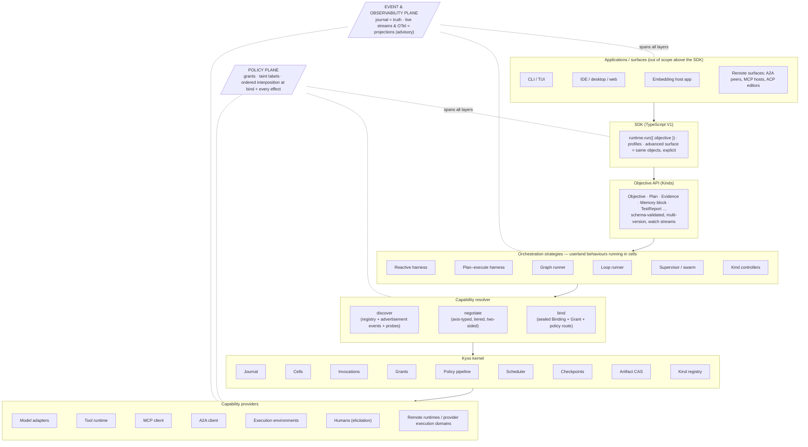
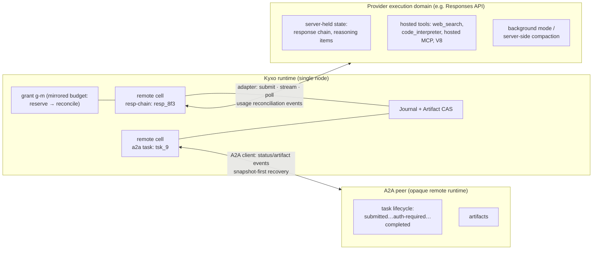

# 07 — Runtime Architecture

Status: DRAFT for adversarial review. Derived from `research/DESIGN-SPINE.md` (binding contract);
claim labels per `research/METHODOLOGY.md`. Everything in this document is OUR PROPOSAL unless
explicitly labeled otherwise; evidence claims carry explicit labels with note citations.
Vocabulary is spine §2 and is used strictly — *model*, *model adapter*, *harness*,
*orchestration strategy*, *kernel*, and *runtime* are never interchangeable here.

Companion documents: 04-ORCHESTRATION-MODELS (strategies in depth), 05-KERNEL-PRIMITIVES (the
nine objects and two mechanisms), doc 06 (capability contract and manifest grammar), doc 08
(failure semantics), docs 09/10 (context-management and memory systems), 16-ADR (decision
records). This document is the assembled whole: how the layers compose, where the boundaries
sit, and what one objective's execution actually looks like on the wire.

---

## 1. The layer stack

The Kyxo runtime is a narrow-waisted stack. The waist is the kernel's nine objects (Capability,
Binding, Invocation, Event, Artifact, Cell, Grant, Checkpoint, Kind) plus two mechanisms
(policy pipeline, scheduler). Everything above the waist is authored against the Objective API
and the kernel event protocol; everything below it is a capability provider behind a manifest.
Two planes cut across every layer: the **event/observability plane** (the journal is truth;
live streams and OTel export are projections with explicitly weaker guarantees) and the
**policy plane** (grants plus the interposition pipeline, evaluated at bind time and at every
effectful invocation — deny-class stages non-bypassable).



Reading the stack top-down: a surface never talks to a harness, a harness never talks to a
model API, and nothing anywhere holds ambient authority. Surfaces speak the versioned kernel
event protocol (§7). The SDK constructs Kind instances and grants. Orchestration strategies —
harnesses, graph runners, loop runners, planners, supervisors — are userland behaviour modules
executing in cells; the kernel supplies the generic loop mechanics (event intake, checkpoint
at yield-is-commit points, budget charging, cancellation, typed suspension) and the strategy
supplies callbacks. Strategies acquire everything they use — models, tools, environments,
humans, other runtimes, *other strategies* — through the capability resolver, which returns
sealed Bindings. The kernel executes Invocations against Bindings and journals everything.
Providers do the nondeterministic work at the edge.

**Evidence** — Four independent systems converged on exactly this inversion: LangGraph's
"graph" API and its Temporal-shaped functional API are both compilers onto a channel/super-step
/checkpoint substrate with no runtime edges (SOURCE-CODE OBSERVATION, research/notes/langgraph.md);
Codex is one Rust core behind an event protocol powering TUI, IDE, desktop, cloud
(SOURCE-CODE OBSERVATION, research/notes/openai-agents-sdk-codex.md); Cursor exposes one
proprietary agent runtime through five surfaces (FACT, research/notes/cursor.md); the durable-
execution vendors all put the loop in userland over a journal/checkpoint kernel
(research/notes/durable-execution.md).
**Interpretation** — The load-bearing layer boundary in every mature system is *substrate vs.
strategy*, not *framework vs. app*.
**Implication** — Kyxo hard-commits: no orchestration concept (loop, graph, planner, workflow,
supervisor) exists below L4; no surface-specific API exists below L1.
**Confidence** — HIGH.

## 2. Subsystem responsibilities — and explicit non-responsibilities

The non-responsibility column is normative: an implementation that grows one of these features
inside the named subsystem is architecturally wrong, not merely untidy.

| Subsystem | Owns | Explicitly does NOT own |
|---|---|---|
| **Journal** | Typed, versioned, append-only event records; correlation/causation/actor IDs; two-tier storage (payloads by Artifact reference); commit order per cell | Live delivery guarantees (advisory plane), payload bytes (CAS), event *semantics* (userland Kinds/strategies) |
| **Scheduler** (task runtime) | Cell turns (single-writer), leases + visibility timeouts, deadlines, cancellation propagation, activation-on-demand | Planning, routing, model selection, retry *policy* content (declared per binding/strategy) |
| **Policy pipeline** | Ordered declarative stages at bind + every effectful invocation; deny-class non-bypassable; verdicts journaled | Judgment (verifiers are capabilities), consent UX (surfaces), authority itself (Grants) |
| **Grants** | Unforgeable, attenuable, revocable authority + quantitative budget; lineage tree; decrement at commit; child ≤ parent | Feature declarations (manifests), authentication of external principals (protocol edges: OAuth etc.) |
| **Cells** | Keyed single-writer stateful scopes; lifecycle; state fold from journal | What the state *means*; conversation semantics; memory policy |
| **Invocations** | Closed transition algebra; idempotency keys; exactly-once illusion; typed suspension payloads | Deciding *what* to invoke (strategies) or *how* work is done (providers) |
| **Checkpoints** | Consistent cuts: journal position + snapshot + pending invocations, bound to definition identity; portability | Workspace/file snapshots (execution-environment capability), git |
| **Artifact CAS** | Content-addressed immutable payloads; provenance; taint/integrity/confidentiality label propagation | Retrieval ranking, semantic search (memory/retrieval capabilities) |
| **Kind registry** | Storage, schema validation, one storage version + conversion, watch streams | All Kind semantics — controllers are userland strategies |
| **Capability resolver** | Discovery (registry, advertisement events, probes), axis-typed negotiation, sealing Bindings; loud bind-time failure | Executing anything; capability *quality* judgments (telemetry-driven selection is a routing strategy) |
| **SDK** | DX contract (`runtime.run` with defaults, profiles); typed access to the same objects | Any semantics not expressible through the event protocol — the SDK is sugar, never a side channel |
| **Orchestration strategies** | Loop/graph/plan/supervision logic; termination and continuation policies; context-compilation choices | Journaling, budget arithmetic, grant enforcement, checkpoint mechanics — kernel-owned so strategies cannot get them wrong |
| **Context-management system** | Deterministic per-invocation view compilation under token budget, provenance-labeled; compaction as an event with pluggable executors | Durable state (memory system), the model's wire format (adapter) |
| **Memory system** | Durable labeled state cells, quotas, provenance, compile hooks | When to remember/forget (a reassignable principal — userland) |
| **Tool runtime** | Standard effectful primitives (shell, HTTP, files) + sandbox mechanisms; MCP client southbound | Approval decisions (policy plane), venue taxonomy (venue is a manifest attribute, not a type — the OpenAI closed 13-type Tool union is the documented failure, research/notes/openai-agents-sdk-codex.md) |
| **Model adapters** | Encode context→wire, decode wire→typed events; axis manifest; opaque carry-through artifacts | Loop policy, tool choice heuristics, session semantics beyond declared statefulness axes |
| **Event/observability plane** | Journal projections: filtered live streams, OTel export, token/attempt visibility | Truth. Retried attempts and partial tokens appear here and never in the journal (the two-plane split; research/notes/durable-execution.md, Workflow Streams) |

## 3. The boundary question: model adapter vs. harness vs. orchestration strategy vs. kernel

These four words name four different altitudes, and the ecosystem's documented failures come
from collapsing them:

- A **model adapter** is a code-bearing translation plugin. It has no loop, no tools, no
  policy. OpenAI's `Model` interface leaking `handoffs` and `previous_response_id` into every
  adapter is the anti-pattern (SOURCE-CODE OBSERVATION, research/notes/openai-agents-sdk-codex.md);
  Kyxo adapters see typed context in and emit typed events out, plus declared carry-through
  artifacts for provider state.
- A **harness** is one orchestration strategy: the behaviour that turns a model into a
  competent worker (context compilation choices, tool exposure, loop policy, termination,
  recovery). Harnesses are versioned, benchmarkable capabilities, expected to be
  model-specific: Cursor spends weeks per model, renames tools to match a model's RL training
  distribution, and lost ~30% performance dropping reasoning traces (FACT,
  research/notes/cursor.md). Kyxo hosts harness×model pairs; it does not promise a universal
  harness (spine C2).
- **Orchestration strategies** are the superset: harnesses, graph runners, planners,
  supervisors, Kind controllers — all userland behaviours in cells (04-ORCHESTRATION-MODELS).
- The **kernel** owns none of the above and all of what they must not: journal, cells,
  invocations, grants, policy, scheduling, checkpoints, CAS, kinds.

### 3.1 Two capabilities named "Claude": the manifests

The sharpest way to draw the boundary is the mission's Phase-7 test case: *a Claude model
invocation* and *a Claude Code invocation* are two different capabilities with two different
manifests, even though the same weights sit at the bottom of both. The first is an inference
function; the second is an **agent SDK** — a vendor's packaged harness behind a thin
supervisor API — which Kyxo models as a *delegated execution domain*.

Manifest A — the model adapter (axes abridged; full grammar in doc 06):

```jsonc
{
  "id": "anthropic.adapter/claude-messages",
  "version": "2.3.0", "stability": "stable",
  "class": "model-adapter",                          // code-bearing encode/decode plugin
  "invocation_profiles": ["request-response-streaming"],
  "axes": {
    "statefulness":      { "tier": "stateless", "caching": "explicit-prefix-breakpoints" },
    "prompt_encoding":   { "level": "typed-message-blocks" },
    "reasoning":         { "visibility": "summarized", "replay": "opaque-carry-through",
                           "budget_control": "token-budget" },
    "tool_emission":     { "dialect": "anthropic.tool-use/json" },
    "streaming":         { "grammar": "sse-typed-deltas" },
    "structured_output": { "tier": "json-schema-constrained" },
    "compaction":        { "executors": ["client", "provider"] },   // provider-side migrating in
    "modalities":        { "in": ["text","image","pdf"], "out": ["text"] },
    "error_semantics":   { "dialect": "anthropic.http" }
  },
  "passthrough":   { "declared": ["beta-headers"], "policy_visible": true },   // never silent
  "carry_through_artifacts": ["reasoning-signature-blocks"],
  "effects":       { "network": ["api.anthropic.com:443"], "filesystem": "none", "processes": "none" },
  "budget_denominations": ["input-tokens", "output-tokens", "usd"],
  "federation":    { "provider_side_execution": ["server-tools:declared-per-binding"] }
}
```

Manifest B — the delegated harness:

```jsonc
{
  "id": "anthropic.harness/claude-code",
  "version": "bundled-cli", "stability": "testing",
  "class": "delegated-harness",                      // agent SDK: closed harness binary + supervisor API
  "invocation_profiles": ["bidirectional-session", "task"],
  "axes": {
    "statefulness":   { "tier": "session", "resume": "by-session-id", "internal_state": "opaque" },
    "objective_encoding": { "level": "natural-language-prompt" },
    "result":         { "shape": "single-result-message + transcript-artifact" },
    "events":         { "stream": "vendor-typed", "mapping": "projected-into-journal" },
    "interposition":  { "hooks": ["pre-tool-use", "post-tool-use", "permission-callback"] },
    "delegation":     { "internal_subagents": true, "depth_control": "external-only" },
    "budget_observability": { "tier": "coarse", "signals": ["usage-events", "max-turns"] },
    "termination":    { "policy": "internal", "cancel": "cooperative" }
  },
  "effects":  { "network": "policy-routed", "filesystem": "workspace-lease-required",
                "processes": "spawns-tools" },
  "requires": { "execution_environment": "workspace-lease",
                "model_access": "embedded-own-adapter" },
  "budget_denominations": ["usd", "wall-clock", "turns"],
  "federation": { "class": "local-subprocess-execution-domain",
                  "mirroring": ["budgets:reconciled-from-usage-events",
                                "policy:hook-interposition-only",
                                "artifacts:transcript + file-diff-capture"] },
  "grant_requirements": { "attenuation": "mandatory", "risk_class": "effectful-autonomous" }
}
```

The differences the kernel acts on: Manifest A has **no world effects** and per-token budget
metering — the kernel owns the loop around it, and policy interposes on every tool call the
harness above it makes. Manifest B **contains its own loop, tools, and context management** —
the kernel can interpose only at declared hooks, meters budget only as coarsely as the vendor's
usage events allow, and therefore must treat the whole thing as a federated execution domain
under a mandatorily attenuated grant. An orchestration strategy whose grant requires
per-effect deny stages cannot bind Manifest B — the bind **fails loudly** rather than silently
degrading policy coverage (spine §4).

**Evidence** — OpenAI itself maintains this triple split: Agents SDK (library — you own the
process), Codex (product harness — it owns the process), Responses API (provider runtime —
OpenAI owns the process), sharing nothing but the wire API (INFERENCE/HIGH,
research/notes/openai-agents-sdk-codex.md). Claude Agent SDK is a thin supervisor over a
closed harness binary (spine §2). Competitive coding agents converged on delegation as
`session + capability/policy diff + budget + single result message` (spine H1).
**Interpretation** — "Invoke a model" and "invoke someone else's loop" differ in effect
surface, interposition, and budget observability — exactly the fields a manifest exists to
declare.
**Implication** — One capability contract, two manifests; eligibility and policy routing fall
out of manifest axes, not out of special-cased types.
**Confidence** — HIGH.

## 4. One objective's life: the event trace

Scenario: a user runs `runtime.run({ objective: "Make the failing test in acme/api pass" })`
from the CLI surface under the default profile (one reactive harness, standard tools, sane
budgets). The listing below is the journal — the truth plane. Every event carries
`corr = obj-1` (the objective run) and a `cause` (the event that necessitated it); actors are
principals (`u:jo`), strategies (`cell:…`), or the kernel (`kern`). Payloads live in the CAS
and appear as `art-*` references (two-tier discipline). Live streams (token deltas, attempt
progress) are projections and do not appear here.

| # | Event | Actor | Cause | Notes (refs) |
|---|---|---|---|---|
| e1 | `kind.created` Objective `obj-1` | u:jo via CLI surface | — | spec text as `art-obj` |
| e2 | `policy.evaluated` admission → allow | kern | e1 | pipeline version pinned `pol@7` |
| e3 | `grant.issued` `g-root` | kern | e1 | 500k tokens, $5.00, 30 min, spawn depth 2, risk ≤ workspace-write |
| e4 | `cell.activated` `cell:objective/obj-1` | kern | e1 | default-profile Objective controller (userland) picked up via Kind watch |
| e5 | `binding.requested` | cell:objective/obj-1 | e4 | requires: harness behaviour; axes: tool-use dialect any, reasoning ≥ summarized |
| e6 | `binding.sealed` `b-h` → `kyxo.strategy/reactive-harness@1.4` | resolver | e5 | grant `g-h` ≤ `g-root` (400k tok, $4.00); policy route attached |
| e7 | `invocation.submitted` `inv-run` on `b-h` | cell:objective/obj-1 | e6 | idempotency key `ik-run-1` |
| e8 | `cell.activated` `cell:run/r-1` | kern | e7 | harness behaviour instance |
| e9 | `invocation.working` `inv-run` | kern | e7 | |
| e10 | `binding.sealed` `b-m` → `anthropic.adapter/claude-messages` | resolver | e9 | dialects chosen: tool-use/json, summarized reasoning; grant `g-m` ≤ `g-h` |
| e11 | `context.compiled` view `art-cx1` | cell:run/r-1 | e9 | deterministic compile; provenance labels survive into view; compile hash recorded |
| e12 | `invocation.submitted` `inv-m1` on `b-m` | cell:run/r-1 | e11 | model turn 1 |
| e13 | `invocation.completed` `inv-m1` | kern | e12 | `art-m1` (assistant msg, tool call `run_shell: pytest -x`); carry-through `art-rs1` |
| e14 | `grant.charged` `g-m` −12,4k tok | kern | e13 | decrement at commit; lineage rollup to `g-root` |
| e15 | `policy.evaluated` shell exec → allow (sandboxed) | kern | e13 | stage trace journaled |
| e16 | `invocation.submitted` `inv-t1` on `b-shell` | cell:run/r-1 | e15 | lease `ls-1` (visibility timeout 120 s), key `ik-t1` |
| e17 | `invocation.completed` `inv-t1` | kern | e16 | `art-t1` test output; taint label `workspace` |
| e18 | `checkpoint.cut` `ck-1` on `cell:run/r-1` | kern | e17 | yield-is-commit turn boundary; journal pos + snapshot + no pending |
| e19 | `invocation.completed` `inv-m2` (turn 2, submitted/charged as above, elided) | kern | e18 | `art-m2`: edit proposal for `src/rate_limit.py` |
| e20 | `policy.evaluated` file write → **require-approval** | kern | e19 | stage `write-scope`: path outside auto-allow list |
| e21 | `invocation.interrupted` `inv-t2` → `approval-required` | kern | e20 | typed suspension payload: diff `art-m2`, requested authority delta |
| e22 | `checkpoint.cut` `ck-2` | kern | e21 | pending `inv-t2` captured; cell may deactivate — suspension is free |
| e23 | `invocation.resumed` `inv-t2` verdict=approved | u:jo via CLI surface | e21 | responsibility metadata: who approved, when — non-negotiable (spine §5) |
| e24 | `invocation.completed` `inv-t2` | kern | e23 | `art-t2` diff applied; provenance: produced-by inv-t2, inputs art-m2 |
| e25 | `invocation.completed` `inv-t3` (pytest rerun) | kern | e24 | `art-t3`: all tests pass |
| e26 | `invocation.completed` `inv-v1` on `b-verify` (`kyxo.verify/test-report`) | kern | e25 | Evidence Kind `ev-1` minted from `art-t3` |
| e27 | `invocation.completed` `inv-m3` (final turn) | kern | e26 | `art-m3` summary; `grant.charged` folded in |
| e28 | `invocation.completed` `inv-run` | kern | e27 | result = `art-m3` + `ev-1`; termination policy: no pending tools ∧ verifier verdict |
| e29 | `cell.deactivated` `cell:run/r-1` | kern | e28 | final checkpoint retained |
| e30 | `kind.updated` Objective `obj-1` → `completed` | cell:objective/obj-1 | e28 | **commit gate**: policy stage required `ev-1` before promotion — the verification hook absent in every system studied (spine §5) |
| e31 | `grant.settled` `g-root` | kern | e30 | usage rollup: 78k tokens, $0.61, 6m 12s; lineage tree closed |

Three properties to notice. First, *causation is a tree rooted at e1* — provenance of the final
state is a query, not a reconstruction. Second, *the human appears twice as a first-class
actor* (e1, e23), never as an anonymous callback: approval is a typed suspension of the
invocation algebra, the same shape MCP reached with sealed `input_required` continuations and
A2A with `AUTH_REQUIRED` escalation (FACT, research/notes/mcp-protocol.md;
research/notes/a2a-protocol.md §7.6). Third, *budgets are events*: every charge is a journal
record against a grant with lineage — the accounting hole documented when Temporal activity
boundaries silently dropped a delegate's token usage cannot occur structurally (FACT,
research/notes/durable-execution.md, Pydantic AI leak inventory).

## 5. The deterministic / nondeterministic split

The mission's Critical Principle, confirmed as spine H3: deterministic orchestration,
journaled nondeterministic effects. Kyxo is **journal-first (record-and-inject), not
replay-first**: recovery resumes from checkpoint + journal injection; userland strategy code
is *not* required to be positionally replay-deterministic, because prompts and wiring change
weekly and Temporal's patching ceremony is the documented cost of pretending otherwise
(research/notes/durable-execution.md).

**Evidence** — All three durable-execution systems impose the identical invariant with
different packaging (FACT, research/notes/durable-execution.md §7); Temporal wrapped the
*unmodified* OpenAI Agents SDK by putting the loop in a Workflow and model calls in Activities
(FACT, research/notes/openai-agents-sdk-codex.md §9).
**Interpretation** — The split is enforceable without touching reasoning code; but in agent
workloads the deterministic core shrinks to a fold while everything interesting is an effect,
so the journal, not replay, must carry the weight.
**Implication** — The table below is exhaustive and normative: every responsibility is
assigned a side, and the kernel enforces the assignment.
**Confidence** — HIGH.

| Responsibility | Side | Enforced by |
|---|---|---|
| Journal append order & event identity | **Deterministic** | Single-writer per cell; monotonic per-cell sequence |
| Invocation/task identity derivation | **Deterministic** | uuid5-style derivation from (cell, checkpoint, step, spawn path) — memoized resume; LangGraph's task-ID scheme is the precedent (SOURCE-CODE OBSERVATION, research/notes/langgraph.md) |
| Cell state fold | **Deterministic** | State = pure fold of journaled events in commit order |
| Budget decrement & grant lineage | **Deterministic** | Charged at commit from journaled usage records |
| Policy pipeline evaluation | **Deterministic** | Pure function of (event, grant, pinned policy version); verdict journaled |
| Context compilation | **Deterministic** | Ordered processor pipeline over journaled sources; compile hash journaled |
| Checkpoint cut & restore | **Deterministic** | Journal position + snapshot + pending invocations + definition identity |
| Kind validation/conversion | **Deterministic** | One storage version + registered converters |
| Binding negotiation | **Deterministic** (given manifests + probe cache) | Declared-set intersection; sealed result journaled |
| Termination/continuation rule application | **Deterministic** | Rules evaluate journaled facts; any judge/model consultation is an N-side invocation whose verdict lands in the journal first |
| Scheduling across cells | Wall-clock **nondeterministic**; truth = commit order | Per-cell order is deterministic (single writer); cross-cell interleaving is never part of the contract |
| Model inference | **Nondeterministic** | Journaled invocation outcome + usage; idempotency key; never re-executed on recovery |
| Tool / effect execution | **Nondeterministic** | Leases + visibility timeouts + idempotency keys; at-least-once + dedup = exactly-once illusion (doc 08) |
| Human interaction | **Nondeterministic** | Typed suspension; journaled response with responsibility metadata |
| Clock, randomness, env reads | **Nondeterministic** | Record-and-inject kernel utilities |
| Compaction *execution* | **Nondeterministic** | Pluggable executor (client/harness/provider); result artifact journaled; *application* of the compaction event is deterministic |
| Verifier execution | **Nondeterministic** | Evidence artifacts journaled; commit-gate application is deterministic |
| Capability probes | **Nondeterministic** | Cacheable evidence artifacts |
| Federated/remote execution | **Nondeterministic** | Remote-cell mirroring + reconciliation events (§6) |
| Strategy behaviour code | **Nondeterminism-tolerated** | Not replayed; recovery = checkpoint + journal injection (anti-Temporal-patching decision, spine §7) |

## 6. Federation: provider-side execution domains as remote cells

Providers are becoming runtimes. The Responses API stores conversation state
(`previous_response_id`, Conversations), executes hosted tools and MCP calls server-side, runs
V8 programs, and executes in background; the Assistants sunset confirms the direction is
permanent (FACT, research/notes/openai-agents-sdk-codex.md §7). Anthropic is migrating
compaction into the API (spine §5). A runtime that models providers as pure functions silently
loses policy, budget, and observability coverage exactly where the interesting work happens.

Kyxo therefore **federates rather than proxies**: any execution that happens inside a
provider's domain is a **remote cell** — a kernel cell whose single writer is the provider,
keyed by the provider's durable handle (response chain ID, conversation ID, A2A task ID,
Claude Code session ID), with three things mirrored locally:

1. **Artifacts.** Server-held state the provider will need back (reasoning items, signatures,
   compaction summaries, hosted-tool outputs) is represented as opaque carry-through artifacts
   in the CAS with provenance and taint labels — declared in the adapter manifest, never
   silently dropped. A provider-side compaction is journaled as a compaction event whose
   payload is {provider state handle + summary artifact ref}.
2. **Budgets.** Reservation at submit, reconciliation at usage report: the remote cell's grant
   is decremented from journaled provider usage events, and unreconciled reservations expire
   with the lease. This closes the cross-boundary accounting hole observed in the wild
   (research/notes/durable-execution.md).
3. **Policy.** Provider-side effects (hosted web search, code interpreter, server-side MCP,
   background mode) are manifest-declared effects evaluated at *bind time*: a grant that does
   not cover provider-side tool execution fails the bind loudly. Runtime interposition inside
   the provider is impossible by construction, so the policy pipeline treats the whole remote
   cell as one effect with the union of its declared authorities — the same treatment as
   Manifest B in §3.



The A2A edge demonstrates why the invocation algebra was designed as an *extension of A2A's
state machine* (spine §3.3): a remote agent's `submitted → working → input-required /
auth-required → terminal` lifecycle maps 1:1 onto kernel invocation states, `AUTH_REQUIRED`
chaining maps onto typed-suspension escalation, and A2A's "state is authoritative, events are
advisory" split (INFERENCE/HIGH, research/notes/a2a-protocol.md F5) is precisely the kernel's
truth-plane/advisory-plane split — so A2A tasks and long-running MCP tasks are two wire
dialects of one remote-cell contract (MCP's experimental Tasks lifecycle is near-isomorphic;
FACT, research/notes/a2a-protocol.md F12). What the remote cell adds over both protocols is
exactly what both omit: budget lineage, deadlines, verification gates, and artifact provenance
carried in the *local* envelope (research/notes/a2a-protocol.md F13;
research/notes/mcp-protocol.md §17).

## 7. Surfaces, the event protocol, and deployment topology

### 7.1 One client contract: the versioned kernel event protocol

Every surface — CLI, IDE extension, web app, embedding host, remote A2A/MCP/ACP peer —
attaches through a single contract: the **kernel event protocol**, a bidirectional
submission/event interface over the journal (submit operations in; correlated typed events
out; server-initiated typed suspensions — approvals, elicitations — flowing to whichever
surface holds the responsible principal).

**Evidence** — Codex's SQ/EQ + App Server serves TUI, IDE, desktop, and web from one core, with
server→client approval RPCs and a replayable JSONL log; its documented weakness is per-release
schema drift forcing clients to pin CLI binaries (SOURCE-CODE OBSERVATION + independent
corroboration, research/notes/openai-agents-sdk-codex.md §11). Cursor ships ACP so third-party
editors can host its loop (FACT, research/notes/cursor.md §10). MCP's 2026 pivot demonstrates
the versioning mechanics that survive scale: per-request version + capability declaration,
typed negotiation errors, a 12-month deprecation clock, and intermediary-visible envelope
metadata (FACT, research/notes/mcp-protocol.md §§1,3,12).
**Interpretation** — "One harness, many surfaces" requires an event protocol, not an API; and
the protocol must be versioned as a real spec, not generated types.
**Implication** — The protocol is date+semver versioned with stability classes from day one
(spine §8); requests carry protocol version; mismatches produce typed errors; a documented
intermediary-visible projection of the envelope (method, cell key, principal, risk class)
exists for gateways and audit taps. ACP and A2A are projections implemented as adapters at
the edge — protocols are never the internal architecture (spine §2).
**Confidence** — HIGH.

### 7.2 Deployment modes

| Mode | Process layout | Surface attachment | Storage |
|---|---|---|---|
| **Embedded** | Kernel as a library inside the host app's process | In-process protocol client (same schema, no socket) | App-supplied paths: SQLite/JSONL journal + file CAS |
| **CLI** | Kernel in the CLI process; terminal is just the first surface | Loopback protocol; other local surfaces (IDE) may attach to the same node | `~/.kyxo` journal + CAS |
| **Server** | Kernel as a long-lived service; queue of cells | Protocol over WebSocket/HTTP; A2A + MCP northbound edges expose selected capabilities/objectives to peers | Server-managed storage; same conformance-tested interface |

All three run the identical kernel; the mode changes who owns the process, never the contract
— the split OpenAI enforces accidentally across three codebases (Agents SDK / Codex /
Responses API), Kyxo enforces by construction in one.

### 7.3 Single-node V1 and distribution by checkpoint transfer

V1 is single-node by decision (spine §8): SQLite/JSONL journal, file CAS, in-process
scheduler. There is deliberately **no in-kernel distribution mesh** — AutoGen's gRPC mesh was
killed in the MAF convergence (spine H1), and LangGraph's entire commercial control plane is
stateless workers composing through nothing but the checkpoint contract (INFERENCE/HIGH,
research/notes/langgraph.md §12).

Distribution is **checkpoint transfer**: a cell migrates by (1) quiescing at a yield-is-commit
point, (2) cutting a Checkpoint (journal position + snapshot + pending invocations + definition
identity), (3) shipping the checkpoint plus CAS closure by content hash, (4) re-validating and
re-attenuating grants at the target node's policy root, (5) activating on the target and
tombstoning at the source — single-writer preserved throughout. Cursor's `&` cloud handoff
proves state-transfer migration of a live session is commercially shippable (FACT,
research/notes/cursor.md §8); Kyxo makes it a kernel verb instead of a product feature. The
same verb serves upgrade and repair: fork-from-checkpoint is the primary recovery mechanism
(doc 08), so distribution adds no new semantics — a remote node is just a place a checkpoint
can land.

Cost stated plainly: cross-node cells get no shared journal, so cross-cell coordination
between nodes rides protocol edges (A2A between Kyxo nodes included) with the federation
mirroring of §6. That is slower and weaker than an in-kernel mesh — and it is the price of a
kernel that stays nine objects.

## 8. Process and isolation model

### 8.1 V1: in-process, reference passing

The V1 reference kernel is one TypeScript process. Capabilities load as in-process modules;
the crossing primitive is **reference passing** — invocation arguments and results carry
Artifact references (content hashes) and grant handles, never payload copies. Grants are
kernel-held table entries; userland code holds opaque handles the kernel resolves and
validates on every use.

Honest limits, stated as costs: in-process JavaScript cannot *confine* a hostile plugin —
a malicious capability can reach ambient Node APIs regardless of ocap discipline. V1's trust
model is therefore explicit: in-process capabilities are vetted code; the ocap/grant machinery
in V1 buys **auditability and correctness** (no ambient authority in the API surface, every
authority use journaled) but not containment. Real containment in V1 exists only where the
tool runtime already provides it — OS-level sandboxes for shell/file effects (the
Seatbelt/Landlock pattern every shipping harness converged on: FACT,
research/notes/openai-agents-sdk-codex.md §11; research/notes/cursor.md §6) and process
isolation for MCP servers, which are already subprocess- or network-shaped.

### 8.2 The roadmap, and the Mach/L4 caveat

Isolation arrives in waves, each gated on a measured crossing cost:

- **Wave 2 — subprocess capability hosting.** Untrusted tool providers and MCP servers move
  behind the existing invocation contract over local IPC; artifact payloads stay in the CAS
  and cross as references + file-backed mappings.
- **Wave 3 — WASM component hosting.** Capability plugins compile to WASM components; the
  manifest's aspiration to WIT-style typed worlds (spine §4) becomes literal — the world *is*
  the manifest, grants become host imports, and confinement is structural rather than
  contractual.

The caveat that governs all waves is the Mach/L4 lesson the spine encodes in the Artifact
primitive (research/DESIGN-SPINE.md §3): first-generation microkernels died on
boundary-crossing cost, and the second generation survived by making the crossing primitive
near-zero-cost (INFERENCE/HIGH — systems-history reading adopted by the spine as an admission
rule). Kyxo's version of that rule: **an isolation boundary is admitted only with a published
crossing benchmark inside budget**, and the two-tier event design exists precisely so that
what crosses a boundary is a reference, never a payload. If a WASM hosting design requires
serializing multi-megabyte contexts across the membrane per invocation, it is rejected — the
correct fix is shared, host-managed CAS mappings, not a faster serializer. The kernel's
value proposition (journaled truth, enforced grants, portable checkpoints) must never be paid
for twice: once in discipline and again in copies.

## 9. What this architecture refuses to do

A closing inventory, because refusals are architecture: no universal harness (harness×model
pairs are hosted, versioned, benchmarked — spine C2); no in-kernel graph/loop/planner (all
strategies — spine H1); no new wire protocols (MCP southbound, A2A at the federation edge,
ACP-class projections to surfaces — spine §10); no normalization of model APIs to a lowest
common denominator (axis-typed manifests with loud bind failure — spine H4); no silent policy
degradation across any boundary, local, delegated, or federated. Every one of these refusals
is load-bearing for the one promise the ecosystem provably lacks: a substrate where budgets,
authority, provenance, verification, and the execution record are structural invariants
rather than per-vendor conventions (spine §6).
