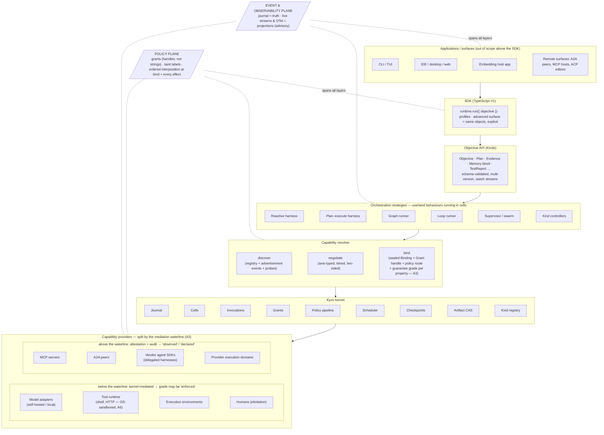
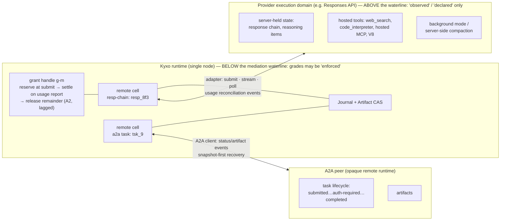

# 07 — Runtime Architecture

> **Post-review status (2026-08-16, phase 2).** This document predates the adversarial review; the
> review's binding adjudications live in the Amendment log of `research/DESIGN-SPINE.md` (A1–A14),
> with the full findings in `research/ADVERSARIAL-REVIEW.md`.
> **Applied here:** A2 (reserve-at-lease / settle-at-outcome / release-remainder throughout: §2, §4,
> §5, §6), A3 (guarantee grades on the Binding and the mediation waterline through the stack: §1,
> §2, §3.1, §4, §6.1, §9), A4 (the frozen facade joins the frozen wire schemas: §2, §7.1, §7.2,
> §8.1), A6 (the MVP non-cooperative enforcement floor and the honest V1 isolation story: §8.1,
> §8.2) — plus A7 alignment of the isolation waves onto doc 15's canonical 0–5 numbering (§8.2) and
> A12 precision on what the policy pipeline journals (§2). **Outstanding:** none known.
> Where this document conflicts with the Amendment log, **the amendment log governs**.
>
> **Executable semantics supersede prose.** `prototypes/kernel-semantics/` — with normative prose in
> `docs/17-KERNEL-SEMANTICS.md`, checked invariants in `docs/18-KERNEL-INVARIANTS.md`, and the
> falsification record in `docs/20-SEMANTIC-TEST-RESULTS.md` — is the reference for lifecycle,
> budgets, authority and the commit barrier. Where this document's narrative disagrees with that
> code, the code is correct and this document is the defect.


Status: DRAFT for adversarial review. Derived from `research/DESIGN-SPINE.md` (binding contract);
claim labels per `research/METHODOLOGY.md`. Everything in this document is OUR PROPOSAL unless
explicitly labeled otherwise; evidence claims carry explicit labels with note citations.
Vocabulary is spine §2 and is used strictly — *model*, *model adapter*, *harness*,
*orchestration strategy*, *kernel*, and *runtime* are never interchangeable here.

Companion documents: 04-ORCHESTRATION-MODELS (strategies in depth), 05-KERNEL-PRIMITIVES (the
nine objects and two mechanisms), doc 06 (capability contract and manifest grammar), doc 08
(failure semantics), docs 09/10 (context-management and memory systems), 16-ADR (decision
records). This document is the assembled whole: how the layers compose, where the boundaries
sit, and what one objective's execution actually looks like on the wire.

---

## 1. The layer stack

The Kyxo runtime is a narrow-waisted stack. The waist is the kernel's nine objects (Capability,
Binding, Invocation, Event, Artifact, Cell, Grant, Checkpoint, Kind) plus two mechanisms
(policy pipeline, scheduler). Everything above the waist is authored against the Objective API
and the kernel event protocol; everything below it is a capability provider behind a manifest.
Two planes cut across every layer: the **event/observability plane** (the journal is truth;
live streams and OTel export are projections with explicitly weaker guarantees) and the
**policy plane** (grants plus the interposition pipeline, evaluated at bind time and at every
effectful invocation — deny-class stages non-bypassable).

One further line cuts *horizontally* rather than vertically: the **mediation waterline**
(amendment A3). Below it — local tools, self-hosted models, sandboxed effects — execution passes
through the kernel, so a Binding may seal an `enforced` guarantee grade. Above it — delegated
vendor harnesses, provider-side execution domains — the kernel sees declarations and reports, so
the honest grades are `observed` (post-hoc reconciliation against journaled evidence) or
`declared` (manifest-trusted). The waterline is not a layer of the stack; it runs *through* L7,
splitting capability providers by how much of their execution Kyxo actually mediates.



Reading the stack top-down: a surface never talks to a harness, a harness never talks to a
model API, and nothing anywhere holds ambient authority. Surfaces speak the versioned kernel
event protocol (§7). The SDK constructs Kind instances and grants. Orchestration strategies —
harnesses, graph runners, loop runners, planners, supervisors — are userland behaviour modules
executing in cells; the kernel supplies the generic loop mechanics (event intake, checkpoint
at yield-is-commit points, budget **reservation and settlement**, cancellation, typed
suspension) and the strategy supplies callbacks. Strategies acquire everything they use —
models, tools, environments, humans, other runtimes, *other strategies* — through the capability
resolver, which returns sealed Bindings carrying their guarantee grades. The kernel executes
Invocations against Bindings and journals everything. Providers do the nondeterministic work at
the edge: they receive data, propose effects, and hold no kernel handle through which they could
write truth (the structural commit barrier, doc 17 §4).

**Evidence** — Four independent systems converged on exactly this inversion: LangGraph's
"graph" API and its Temporal-shaped functional API are both compilers onto a channel/super-step
/checkpoint substrate with no runtime edges (SOURCE-CODE OBSERVATION, research/notes/langgraph.md);
Codex is one Rust core behind an event protocol powering TUI, IDE, desktop, cloud
(SOURCE-CODE OBSERVATION, research/notes/openai-agents-sdk-codex.md); Cursor exposes one
proprietary agent runtime through five surfaces (FACT, research/notes/cursor.md); the durable-
execution vendors all put the loop in userland over a journal/checkpoint kernel
(research/notes/durable-execution.md).
**Interpretation** — The load-bearing layer boundary in every mature system is *substrate vs.
strategy*, not *framework vs. app*.
**Implication** — Kyxo hard-commits: no orchestration concept (loop, graph, planner, workflow,
supervisor) exists below L4; no surface-specific API exists below L1.
**Confidence** — HIGH.

## 2. Subsystem responsibilities — and explicit non-responsibilities

The non-responsibility column is normative: an implementation that grows one of these features
inside the named subsystem is architecturally wrong, not merely untidy.

| Subsystem | Owns | Explicitly does NOT own |
|---|---|---|
| **Journal** | Typed, versioned, append-only event records; correlation/causation/actor IDs; two-tier storage (payloads by Artifact reference); commit order per cell | Live delivery guarantees (advisory plane), payload bytes (CAS), event *semantics* (userland Kinds/strategies) |
| **Scheduler** (task runtime) | Cell turns (single-writer), leases + visibility timeouts, deadlines, cancellation propagation, activation-on-demand | Planning, routing, model selection, retry *policy* content (declared per binding/strategy) |
| **Policy pipeline** | Ordered declarative stages at bind + every effectful invocation; deny-class non-bypassable; **every refusal journaled**, allow-path traces journaled per the policy-class knob (amendment A12: advisory by default, truth-plane in the regulated profile; a model-judge verdict gating an effect is always journaled with an input hash) | Judgment (verifiers are capabilities), consent UX (surfaces), authority itself (Grants) |
| **Grants** | Unforgeable **handle-identity** authority (amendment A8) + quantitative budget; lineage tree; **reserve at admission, settle at outcome, release the remainder** (amendment A2 — decrement-at-commit is retired); child ≤ parent | Feature declarations (manifests), authentication of external principals (protocol edges: OAuth etc.), *resolution of raw id strings* — journal grant references are non-resolvable identifiers |
| **Cells** | Keyed single-writer stateful scopes; lifecycle; state fold from journal | What the state *means*; conversation semantics; memory policy |
| **Invocations** | Closed transition algebra (including the explicit `uncertain` state); content-inclusive, lineage-scoped effect keys; the exactly-once *illusion* where a key plus a bounded dedup window plus lease fencing can construct it (doc 17 §5.1 — general exactly-once is not claimed); typed suspension payloads with an `origin` discriminator | Deciding *what* to invoke (strategies) or *how* work is done (providers); guessing an unknown external outcome |
| **Checkpoints** | Consistent cuts: journal position + snapshot + pending invocations, bound to definition identity; portability | Workspace/file snapshots (execution-environment capability), git |
| **Artifact CAS** | Content-addressed immutable payloads; provenance; taint/integrity/confidentiality label propagation | Retrieval ranking, semantic search (memory/retrieval capabilities) |
| **Kind registry** | Storage, schema validation, one storage version + conversion, watch streams | All Kind semantics — controllers are userland strategies |
| **Capability resolver** | Discovery (registry, advertisement events, probes), axis-typed negotiation, sealing Bindings **with a guarantee grade per policy-relevant property** (amendment A3: `enforced` \| `observed` \| `declared`); loud bind-time failure | Executing anything; capability *quality* judgments (telemetry-driven selection is a routing strategy); claiming `enforced` for anything above the mediation waterline |
| **Kernel facade** (`KernelApi` / `HarnessCtx` host-facing; `InvokeCtx` capability-facing) | A Wave-0 frozen, versioned, conformance-tested verb list (amendment A4) — bind, invoke, resume, cancel, attenuate, getGrant (handle-shaped), charge, storeArtifact/readArtifact, scoped journal read, checkpoint, createCell, listCapabilities, the Kind verbs, injected clock | Any verb not in the frozen list; a capability-facing kernel handle — `InvokeCtx` is **data only**, and effect proposals are a provider's sole channel to durable truth |
| **SDK** | DX contract (`runtime.run` with defaults, profiles); typed access to the same objects | Any semantics not expressible through the event protocol *or* the frozen facade — the SDK is sugar, never a side channel |
| **Orchestration strategies** | Loop/graph/plan/supervision logic; termination and continuation policies; context-compilation choices | Journaling, budget arithmetic, grant enforcement, checkpoint mechanics — kernel-owned so strategies cannot get them wrong |
| **Context-management system** | Deterministic per-invocation view compilation under token budget, provenance-labeled; compaction as an event with pluggable executors | Durable state (memory system), the model's wire format (adapter) |
| **Memory system** | Durable labeled state cells, quotas, provenance, compile hooks | When to remember/forget (a reassignable principal — userland) |
| **Tool runtime** | Standard effectful primitives (shell, HTTP, files) + sandbox mechanisms; MCP client southbound | Approval decisions (policy plane), venue taxonomy (venue is a manifest attribute, not a type — the OpenAI closed 13-type Tool union is the documented failure, research/notes/openai-agents-sdk-codex.md) |
| **Model adapters** | Encode context→wire, decode wire→typed events; axis manifest; opaque carry-through artifacts | Loop policy, tool choice heuristics, session semantics beyond declared statefulness axes |
| **Event/observability plane** | Journal projections: filtered live streams, OTel export, token/attempt visibility | Truth. Retried attempts and partial tokens appear here and never in the journal (the two-plane split; research/notes/durable-execution.md, Workflow Streams) |

## 3. The boundary question: model adapter vs. harness vs. orchestration strategy vs. kernel

These four words name four different altitudes, and the ecosystem's documented failures come
from collapsing them:

- A **model adapter** is a code-bearing translation plugin. It has no loop, no tools, no
  policy. OpenAI's `Model` interface leaking `handoffs` and `previous_response_id` into every
  adapter is the anti-pattern (SOURCE-CODE OBSERVATION, research/notes/openai-agents-sdk-codex.md);
  Kyxo adapters see typed context in and emit typed events out, plus declared carry-through
  artifacts for provider state.
- A **harness** is one orchestration strategy: the behaviour that turns a model into a
  competent worker (context compilation choices, tool exposure, loop policy, termination,
  recovery). Harnesses are versioned, benchmarkable capabilities, expected to be
  model-specific: Cursor spends weeks per model, renames tools to match a model's RL training
  distribution, and lost ~30% performance dropping reasoning traces (FACT,
  research/notes/cursor.md). Kyxo hosts harness×model pairs; it does not promise a universal
  harness (spine C2).
- **Orchestration strategies** are the superset: harnesses, graph runners, planners,
  supervisors, Kind controllers — all userland behaviours in cells (04-ORCHESTRATION-MODELS).
- The **kernel** owns none of the above and all of what they must not: journal, cells,
  invocations, grants, policy, scheduling, checkpoints, CAS, kinds.

### 3.1 Two capabilities named "Claude": the manifests

The sharpest way to draw the boundary is the mission's Phase-7 test case: *a Claude model
invocation* and *a Claude Code invocation* are two different capabilities with two different
manifests, even though the same weights sit at the bottom of both. The first is an inference
function; the second is an **agent SDK** — a vendor's packaged harness behind a thin
supervisor API — which Kyxo models as a *delegated execution domain*.

Manifest A — the model adapter (axes abridged; full grammar in doc 06):

```jsonc
{
  "id": "anthropic.adapter/claude-messages",
  "version": "2.3.0", "stability": "stable",
  "class": "model-adapter",                          // code-bearing encode/decode plugin
  "invocation_profiles": ["request-response-streaming"],
  "axes": {
    "statefulness":      { "tier": "stateless", "caching": "explicit-prefix-breakpoints" },
    "prompt_encoding":   { "level": "typed-message-blocks" },
    "reasoning":         { "visibility": "summarized", "replay": "opaque-carry-through",
                           "budget_control": "token-budget" },
    "tool_emission":     { "dialect": "anthropic.tool-use/json" },
    "streaming":         { "grammar": "sse-typed-deltas" },
    "structured_output": { "tier": "json-schema-constrained" },
    "compaction":        { "executors": ["client", "provider"] },   // provider-side migrating in
    "modalities":        { "in": ["text","image","pdf"], "out": ["text"] },
    "error_semantics":   { "dialect": "anthropic.http" }
  },
  "passthrough":   { "declared": ["beta-headers"], "policy_visible": true },   // never silent
  "carry_through_artifacts": ["reasoning-signature-blocks"],
  "effects":       { "network": ["api.anthropic.com:443"], "filesystem": "none", "processes": "none" },
  "budget_denominations": ["input-tokens", "output-tokens", "usd"],
  "federation":    { "provider_side_execution": ["server-tools:declared-per-binding"] }
}
```

Manifest B — the delegated harness:

```jsonc
{
  "id": "anthropic.harness/claude-code",
  "version": "bundled-cli", "stability": "testing",
  "class": "delegated-harness",                      // agent SDK: closed harness binary + supervisor API
  "invocation_profiles": ["bidirectional-session", "task"],
  "axes": {
    "statefulness":   { "tier": "session", "resume": "by-session-id", "internal_state": "opaque" },
    "objective_encoding": { "level": "natural-language-prompt" },
    "result":         { "shape": "single-result-message + transcript-artifact" },
    "events":         { "stream": "vendor-typed", "mapping": "projected-into-journal" },
    "interposition":  { "hooks": ["pre-tool-use", "post-tool-use", "permission-callback"] },
    "delegation":     { "internal_subagents": true, "depth_control": "external-only" },
    "budget_observability": { "tier": "coarse", "signals": ["usage-events", "max-turns"] },
    "termination":    { "policy": "internal", "cancel": "cooperative" }
  },
  "effects":  { "network": "policy-routed", "filesystem": "workspace-lease-required",
                "processes": "spawns-tools" },
  "requires": { "execution_environment": "workspace-lease",
                "model_access": "embedded-own-adapter" },
  "budget_denominations": ["usd", "wall-clock", "turns"],
  "federation": { "class": "local-subprocess-execution-domain",
                  "mirroring": ["budgets:reconciled-from-usage-events",
                                "policy:hook-interposition-only",
                                "artifacts:transcript + file-diff-capture"] },
  "grant_requirements": { "attenuation": "mandatory", "risk_class": "effectful-autonomous" }
}
```

The differences the kernel acts on: Manifest A has **no world effects** and per-token budget
metering — the kernel owns the loop around it, and policy interposes on every tool call the
harness above it makes. Manifest B **contains its own loop, tools, and context management** —
the kernel can interpose only at declared hooks, meters budget only as coarsely as the vendor's
usage events allow, and therefore must treat the whole thing as a federated execution domain
under a mandatorily attenuated grant. An orchestration strategy whose grant requires
per-effect deny stages cannot bind Manifest B — the bind **fails loudly** rather than silently
degrading policy coverage (spine §4).

**And the difference the *Binding* records: the guarantee grade** (amendment A3). The manifests
above declare axes; the sealed Binding additionally states, per policy-relevant property, what
backs the claim that the property holds in the world (06-CAPABILITY-SPEC §2.3a is the normative
vocabulary). For Manifest A bound to a locally-hosted or kernel-metered endpoint: budget
metering is `enforced` (the kernel counts the tokens it journals), structured-output conformance
is `observed` (probe Evidence), data-residency is `declared`. For Manifest B, the honest grades
are strictly weaker: per-effect policy coverage is `declared` (hook interposition is the
vendor's mechanism, not ours), budget is `observed` at best (reconciled from usage events, with
the lag those events carry), and nothing about the internal loop can be graded `enforced` at
all. This is why the bind of Manifest B under a policy route requiring `enforced` per-effect
denial fails: not because delegated harnesses are disallowed, but because **the grade the
Binding can honestly seal is below what the grant demands**. A runtime that let that bind
succeed would be selling enforcement it cannot perform — the precise failure amendment A3 was
adopted to prevent.

**Evidence** — OpenAI itself maintains this triple split: Agents SDK (library — you own the
process), Codex (product harness — it owns the process), Responses API (provider runtime —
OpenAI owns the process), sharing nothing but the wire API (INFERENCE/HIGH,
research/notes/openai-agents-sdk-codex.md). Claude Agent SDK is a thin supervisor over a
closed harness binary (spine §2). Competitive coding agents converged on delegation as
`session + capability/policy diff + budget + single result message` (spine H1).
**Interpretation** — "Invoke a model" and "invoke someone else's loop" differ in effect
surface, interposition, and budget observability — exactly the fields a manifest exists to
declare.
**Implication** — One capability contract, two manifests; eligibility and policy routing fall
out of manifest axes, not out of special-cased types.
**Confidence** — HIGH.

## 4. One objective's life: the event trace

Scenario: a user runs `runtime.run({ objective: "Make the failing test in acme/api pass" })`
from the CLI surface under the default profile (one reactive harness, standard tools, sane
budgets). The listing below is the journal — the truth plane. Every event carries
`corr = obj-1` (the objective run) and a `cause` (the event that necessitated it); actors are
principals (`u:jo`), strategies (`cell:…`), or the kernel (`kern`). Payloads live in the CAS
and appear as `art-*` references (two-tier discipline). Live streams (token deltas, attempt
progress) are projections and do not appear here.

| # | Event | Actor | Cause | Notes (refs) |
|---|---|---|---|---|
| e1 | `kind.created` Objective `obj-1` | u:jo via CLI surface | — | spec text as `art-obj` |
| e2 | `policy.evaluated` admission → allow | kern | e1 | pipeline version pinned `pol@7` |
| e3 | `grant.issued` `g-root` | kern | e1 | 500k tokens, $5.00, 30 min, spawn depth 2, risk ≤ workspace-write |
| e4 | `cell.activated` `cell:objective/obj-1` | kern | e1 | default-profile Objective controller (userland) picked up via Kind watch |
| e5 | `binding.requested` | cell:objective/obj-1 | e4 | requires: harness behaviour; axes: tool-use dialect any, reasoning ≥ summarized |
| e6 | `binding.sealed` `b-h` → `kyxo.strategy/reactive-harness@1.4` | resolver | e5 | grant handle `g-h` ≤ `g-root` (400k tok, $4.00); policy route attached; grades: budget `enforced`, termination policy `enforced` (local strategy below the waterline) |
| e7 | `invocation.submitted` `inv-run` on `b-h` | cell:objective/obj-1 | e6 | content-inclusive, lineage-scoped effect key `ek-run-1` (doc 17 §9) |
| e8 | `cell.activated` `cell:run/r-1` | kern | e7 | harness behaviour instance |
| e9 | `invocation.working` `inv-run` | kern | e7 | |
| e10 | `binding.sealed` `b-m` → `anthropic.adapter/claude-messages` | resolver | e9 | dialects chosen: tool-use/json, summarized reasoning; grant handle `g-m` ≤ `g-h`; grades: token metering `observed` (reconciled from provider usage reports — a vendor endpoint sits *above* the waterline), reasoning-replay `declared` |
| e11 | `context.compiled` view `art-cx1` | cell:run/r-1 | e9 | deterministic compile; provenance labels survive into view; compile hash recorded |
| e12 | `grant.reserved` `g-m` 20k tok / $0.40 hold | kern | e11 | admission reserves against remaining budget on **every ancestor grant** before dispatch, durably (A2) |
| e12b | `invocation.submitted` `inv-m1` on `b-m` | cell:run/r-1 | e12 | model turn 1; dispatch only after the reservation is durable |
| e13 | `invocation.completed` `inv-m1` | kern | e12b | `art-m1` (assistant msg, tool call `run_shell: pytest -x`); carry-through `art-rs1` |
| e14 | `grant.settled` `g-m` 12.4k tok + `grant.released` (unused 7.6k of the e12 hold) | kern | e13 | settlement at outcome, remainder released, both inside the same atomic commit record as e13 (A2); lineage rollup to `g-root` |
| e15 | `policy.evaluated` shell exec → allow (OS sandbox tier `os`, grant-scoped egress) | kern | e13 | allow-path trace: advisory plane in the default profile, truth plane in the regulated profile (A12) |
| e16 | `invocation.submitted` `inv-t1` on `b-shell` | cell:run/r-1 | e15 | lease `ls-1` (visibility timeout 120 s), effect key `ek-t1`; grades: filesystem scope + egress `enforced` (the enforcement floor, A6/§8.1) |
| e17 | `invocation.completed` `inv-t1` | kern | e16 | `art-t1` test output; taint label `workspace` |
| e18 | `checkpoint.cut` `ck-1` on `cell:run/r-1` | kern | e17 | yield-is-commit turn boundary; journal pos + snapshot + no pending |
| e19 | `invocation.completed` `inv-m2` (turn 2 — reserve/dispatch/settle/release cycle as above, elided) | kern | e18 | `art-m2`: edit proposal for `src/rate_limit.py` |
| e20 | `policy.evaluated` file write → **require-approval** | kern | e19 | stage `write-scope`: path outside auto-allow list |
| e21 | `invocation.interrupted` `inv-t2` → `approval-required` | kern | e20 | typed suspension payload: diff `art-m2`, requested authority delta |
| e22 | `checkpoint.cut` `ck-2` | kern | e21 | pending `inv-t2` captured; cell may deactivate — suspension is free |
| e23 | `invocation.resumed` `inv-t2` verdict=approved | u:jo via CLI surface | e21 | responsibility metadata: who approved, when — non-negotiable (spine §5) |
| e24 | `invocation.completed` `inv-t2` | kern | e23 | `art-t2` diff applied; provenance: produced-by inv-t2, inputs art-m2 |
| e25 | `invocation.completed` `inv-t3` (pytest rerun) | kern | e24 | `art-t3`: all tests pass |
| e26 | `invocation.completed` `inv-v1` on `b-verify` (`kyxo.verify/test-report`) | kern | e25 | Evidence Kind `ev-1` minted from `art-t3` |
| e27 | `invocation.completed` `inv-m3` (final turn) | kern | e26 | `art-m3` summary; the turn's `grant.settled` / `grant.released` pair rides the same commit record |
| e28 | `invocation.completed` `inv-run` | kern | e27 | result = `art-m3` + `ev-1`; termination policy: no pending tools ∧ verifier verdict |
| e29 | `cell.deactivated` `cell:run/r-1` | kern | e28 | final checkpoint retained |
| e30 | `kind.updated` Objective `obj-1` → `completed` | cell:objective/obj-1 | e28 | **commit gate**: policy stage required `ev-1` before promotion — the verification hook absent in every system studied (spine §5) |
| e31 | `grant.settled` `g-root` + `grant.released` (remaining holds) | kern | e30 | settlement rollup: 78k tokens, $0.61, 6m 12s; every outstanding reservation on the lineage released; lineage tree closed |

Four properties to notice. First, *causation is a tree rooted at e1* — provenance of the final
state is a query, not a reconstruction. Second, *the human appears twice as a first-class
actor* (e1, e23), never as an anonymous callback: approval is a typed suspension of the
invocation algebra, the same shape MCP reached with sealed `input_required` continuations and
A2A with `AUTH_REQUIRED` escalation (FACT, research/notes/mcp-protocol.md;
research/notes/a2a-protocol.md §7.6). Third, *budgets are events in three kinds, not one*:
`grant.reserved` at admission, `grant.settled` at outcome, `grant.released` for the unused
remainder (amendment A2). A reservation is durable before dispatch, so a crash can neither lose
a hold nor let concurrent in-flight invocations overdraw one grant chain — and the accounting
hole documented when Temporal activity boundaries silently dropped a delegate's token usage
cannot occur structurally (FACT, research/notes/durable-execution.md, Pydantic AI leak
inventory). *(Superseded by A2: the earlier reading of this trace was "every charge is a journal
record", a single decrement-at-commit event. Retained because the analysis that forced the
change is instructive — decrement-at-commit detects exhaustion only* after *the spend, which is
exactly the wrong side of an irreversible effect.)* Fourth, *every sealed Binding states what
backs it* (e6, e10, e16): the same run carries `enforced` grades for the locally-mediated shell
effect and `observed` grades for the vendor endpoint's metering, and the difference is recorded
rather than glossed (amendment A3).

## 5. The deterministic / nondeterministic split

The mission's Critical Principle, confirmed as spine H3: deterministic orchestration,
journaled nondeterministic effects. Kyxo is **journal-first (record-and-inject), not
replay-first**: recovery resumes from checkpoint + journal injection; userland strategy code
is *not* required to be positionally replay-deterministic, because prompts and wiring change
weekly and Temporal's patching ceremony is the documented cost of pretending otherwise
(research/notes/durable-execution.md).

**Evidence** — All three durable-execution systems impose the identical invariant with
different packaging (FACT, research/notes/durable-execution.md §7); Temporal wrapped the
*unmodified* OpenAI Agents SDK by putting the loop in a Workflow and model calls in Activities
(FACT, research/notes/openai-agents-sdk-codex.md §9).
**Interpretation** — The split is enforceable without touching reasoning code; but in agent
workloads the deterministic core shrinks to a fold while everything interesting is an effect,
so the journal, not replay, must carry the weight.
**Implication** — The table below is exhaustive and normative: every responsibility is
assigned a side, and the kernel enforces the assignment.
**Confidence** — HIGH.

| Responsibility | Side | Enforced by |
|---|---|---|
| Journal append order & event identity | **Deterministic** | Single-writer per cell; monotonic per-cell sequence |
| Invocation/task identity derivation | **Deterministic** | uuid5-style derivation from (cell, checkpoint, step, spawn path) — memoized resume; LangGraph's task-ID scheme is the precedent (SOURCE-CODE OBSERVATION, research/notes/langgraph.md) |
| Cell state fold | **Deterministic** | State = pure fold of journaled events in commit order |
| Budget reservation, settlement, release & grant lineage | **Deterministic** | Reserved at admission against every ancestor grant (durable *before* dispatch), settled at outcome commit from journaled usage, remainder released — amendment A2; decrement-at-commit is retired. Checked by doc 18 invariant I23 (`reserved + settled ≤ limits`, never negative) and by differential agreement with an independently-written reference model (doc 20 §4) |
| Policy pipeline evaluation | **Deterministic** | Pure function of (event, grant, pinned policy version); verdict journaled |
| Context compilation | **Deterministic** | Ordered processor pipeline over journaled sources; compile hash journaled |
| Checkpoint cut & restore | **Deterministic** | Journal position + snapshot + pending invocations + definition identity |
| Kind validation/conversion | **Deterministic** | One storage version + registered converters |
| Binding negotiation | **Deterministic** (given manifests + probe cache) | Declared-set intersection; sealed result journaled |
| Termination/continuation rule application | **Deterministic** | Rules evaluate journaled facts; any judge/model consultation is an N-side invocation whose verdict lands in the journal first |
| Scheduling across cells | Wall-clock **nondeterministic**; truth = commit order | Per-cell order is deterministic (single writer); cross-cell interleaving is never part of the contract |
| Model inference | **Nondeterministic** | Journaled invocation outcome + usage; content-inclusive effect key; a recorded outcome is never re-executed, and an *unrecorded* one is triaged by declared effect class rather than assumed either way (doc 17 §6) |
| Tool / effect execution | **Nondeterministic** | Leases + visibility timeouts + content-inclusive effect keys; at-least-once + a bounded dedup window + lease fencing = the exactly-once *illusion* where those three hold, and the explicit `uncertain` state where they do not (doc 17 §5.1) |
| Human interaction | **Nondeterministic** | Typed suspension; journaled response with responsibility metadata |
| Clock, randomness, env reads | **Nondeterministic** | Record-and-inject kernel utilities |
| Compaction *execution* | **Nondeterministic** | Pluggable executor (client/harness/provider); result artifact journaled; *application* of the compaction event is deterministic |
| Verifier execution | **Nondeterministic** | Evidence artifacts journaled; commit-gate application is deterministic |
| Capability probes | **Nondeterministic** | Cacheable evidence artifacts |
| Federated/remote execution | **Nondeterministic** | Remote-cell mirroring + reconciliation events (§6) |
| Strategy behaviour code | **Nondeterminism-tolerated** | Not replayed; recovery = checkpoint + journal injection (anti-Temporal-patching decision, spine §7) |

## 6. Federation: provider-side execution domains as remote cells

Providers are becoming runtimes. The Responses API stores conversation state
(`previous_response_id`, Conversations), executes hosted tools and MCP calls server-side, runs
V8 programs, and executes in background; the Assistants sunset confirms the direction is
permanent (FACT, research/notes/openai-agents-sdk-codex.md §7). Anthropic is migrating
compaction into the API (spine §5). A runtime that models providers as pure functions silently
loses policy, budget, and observability coverage exactly where the interesting work happens.

Kyxo therefore **federates rather than proxies**: any execution that happens inside a
provider's domain is a **remote cell** — a kernel cell whose single writer is the provider,
keyed by the provider's durable handle (response chain ID, conversation ID, A2A task ID,
Claude Code session ID), with three things mirrored locally:

1. **Artifacts.** Server-held state the provider will need back (reasoning items, signatures,
   compaction summaries, hosted-tool outputs) is represented as opaque carry-through artifacts
   in the CAS with provenance and taint labels — declared in the adapter manifest, never
   silently dropped. A provider-side compaction is journaled as a compaction event whose
   payload is {provider state handle + summary artifact ref}.
2. **Budgets.** The same three-step mechanism as any local invocation, with lagged settlement
   (amendment A2): `grant.reserved` at submit against the remote cell's grant chain,
   `grant.settled` when the provider's usage report arrives, `grant.released` for the unused
   hold — and an unreconciled reservation released when its lease expires. Federation's
   reserve/reconcile is **not an exception to the budget model; it is the budget model with a
   longer gap between reserve and settle**. This closes the cross-boundary accounting hole
   observed in the wild (research/notes/durable-execution.md).
3. **Policy.** Provider-side effects (hosted web search, code interpreter, server-side MCP,
   background mode) are manifest-declared effects evaluated at *bind time*: a grant that does
   not cover provider-side tool execution fails the bind loudly. Runtime interposition inside
   the provider is impossible by construction, so the policy pipeline treats the whole remote
   cell as one effect with the union of its declared authorities — the same treatment as
   Manifest B in §3.
4. **Guarantee grades.** Because (3) is true, the Binding to a remote cell seals `observed` or
   `declared` grades on every property the provider actually executes, never `enforced`
   (amendment A3). The three mirrors above are exactly what makes `observed` possible: mirrored
   artifacts and usage reports are the evidence a post-hoc reconciliation runs against. Grades
   are sealed at bind, journaled, and re-derived — an expired probe demotes a property from
   `observed` back to `declared`, and that demotion is itself journaled rather than silently
   assumed to still hold.



The A2A edge demonstrates why the invocation algebra was designed as an *extension of A2A's
state machine* (spine §3.3): a remote agent's `submitted → working → input-required /
auth-required → terminal` lifecycle maps 1:1 onto kernel invocation states, `AUTH_REQUIRED`
chaining maps onto typed-suspension escalation, and A2A's "state is authoritative, events are
advisory" split (INFERENCE/HIGH, research/notes/a2a-protocol.md F5) is precisely the kernel's
truth-plane/advisory-plane split — so A2A tasks and long-running MCP tasks are two wire
dialects of one remote-cell contract (MCP's experimental Tasks lifecycle is near-isomorphic;
FACT, research/notes/a2a-protocol.md F12). What the remote cell adds over both protocols is
exactly what both omit: budget lineage, deadlines, verification gates, and artifact provenance
carried in the *local* envelope (research/notes/a2a-protocol.md F13;
research/notes/mcp-protocol.md §17).

### 6.1 The mediation waterline (amendment A3)

Federation is where the honest positioning becomes an architectural statement rather than a
marketing one, so it is stated here in the form the kernel can act on.

**Below the waterline** — local tool runtime, self-hosted and open models, sandboxed execution
environments, anything whose execution path the kernel owns — Kyxo mediates every effect, and a
Binding may seal `enforced` on the properties that mediation covers: which effects can happen at
all, what budget they consume, what labels their outputs carry, whether an outcome enters the
truth plane before its Evidence does.

**Above the waterline** — delegated vendor harnesses (Manifest B in §3.1), provider-side
execution domains (§6), opaque A2A peers — Kyxo offers **attestation plus audit**, not
enforcement: signed manifests, mirrored artifacts, reconciled usage, journaled hook
interpositions where the vendor exposes hooks. The corresponding grades are `observed` where
evidence reconciles the claim, `declared` where nothing but the publisher's signature does.

Three consequences worth stating plainly:

1. **A remote cell cannot be graded up by wrapping it.** Interposing a local filter on a remote
   Binding constrains what *we* send and what *we* accept; it says nothing about what the
   provider's own loop does inside its domain. The grade follows the mediation, not the wrapper.
2. **Mixed deployments are normal and the grades are per property.** One objective's journal
   routinely carries `enforced` filesystem scope (local shell under the enforcement floor, §8.1)
   next to `observed` token metering (vendor endpoint) — as the §4 trace shows at e10 and e16.
3. **The waterline is measurable, and is measured.** Amendment A3 adds a leading indicator
   tracked from V1: *the share of effectful journal events originating in remote or delegated
   domains*. A deployment whose effects mostly happen above the waterline is a deployment where
   Kyxo's enforcement claims mostly do not apply — and the runtime should be able to say so from
   its own journal rather than leaving operators to infer it. This is also why V1's target
   segments are the mediation-dominant ones (self-hosted/open-model stacks, regulated and
   air-gapped deployments, local-first products) — spine A3.

## 7. Surfaces, the event protocol, and deployment topology

### 7.1 Two frozen contracts: the event protocol *and* the facade

Every surface — CLI, IDE extension, web app, embedding host, remote A2A/MCP/ACP peer —
attaches through a single contract: the **kernel event protocol**, a bidirectional
submission/event interface over the journal (submit operations in; correlated typed events
out; server-initiated typed suspensions — approvals, elicitations — flowing to whichever
surface holds the responsible principal).

**And amendment A4 adds a second frozen surface beside it.** The wire schemas alone were never
sufficient: an in-process strategy or a capability provider does not touch the wire, it touches
the *facade*. A4 therefore promotes `KernelApi` / `InvokeCtx` / `HarnessCtx` to a Wave-0 frozen,
versioned, conformance-tested contract — the same status as the record format, not a convenience
layer that drifts under it. The verb list is closed for the freeze (bind, invoke, resume with a
re-grant option, cancel, attenuate, getGrant, charge, storeArtifact/readArtifact, scoped journal
read, checkpoint, createCell, listCapabilities, the Kind verbs, injected clock) and it was
decided by what the prototypes demonstrably needed rather than by what looked complete;
05-KERNEL-PRIMITIVES §3.3 and 06-CAPABILITY-SPEC §8a carry the normative statement. The
capability-facing half is asymmetric on purpose: `InvokeCtx` is **data only**, so a provider has
no handle through which it could append to the journal, mint authority, promote an artifact, or
charge a grant. Two things follow for this document: the deployment modes of §7.2 preserve
*both* contracts unchanged, and ADR-010's "the TypeScript reference kernel is replaceable" claim
is scoped to the execution record until facade conformance fixtures exist — the facade freeze is
what removes that qualifier.

**Evidence** — Codex's SQ/EQ + App Server serves TUI, IDE, desktop, and web from one core, with
server→client approval RPCs and a replayable JSONL log; its documented weakness is per-release
schema drift forcing clients to pin CLI binaries (SOURCE-CODE OBSERVATION + independent
corroboration, research/notes/openai-agents-sdk-codex.md §11). Cursor ships ACP so third-party
editors can host its loop (FACT, research/notes/cursor.md §10). MCP's 2026 pivot demonstrates
the versioning mechanics that survive scale: per-request version + capability declaration,
typed negotiation errors, a 12-month deprecation clock, and intermediary-visible envelope
metadata (FACT, research/notes/mcp-protocol.md §§1,3,12).
**Interpretation** — "One harness, many surfaces" requires an event protocol, not an API; and
the protocol must be versioned as a real spec, not generated types.
**Implication** — The protocol is date+semver versioned with stability classes from day one
(spine §8); requests carry protocol version; mismatches produce typed errors; a documented
intermediary-visible projection of the envelope (method, cell key, principal, risk class)
exists for gateways and audit taps. ACP and A2A are projections implemented as adapters at
the edge — protocols are never the internal architecture (spine §2).
**Confidence** — HIGH.

### 7.2 Deployment modes

| Mode | Process layout | Surface attachment | Storage |
|---|---|---|---|
| **Embedded** | Kernel as a library inside the host app's process | In-process protocol client — same schema *and* the same frozen facade (A4), no socket | App-supplied paths: SQLite/JSONL journal + file CAS |
| **CLI** | Kernel in the CLI process; terminal is just the first surface | Loopback protocol; other local surfaces (IDE) may attach to the same node | `~/.kyxo` journal + CAS |
| **Server** | Kernel as a long-lived service; queue of cells | Protocol over WebSocket/HTTP; A2A + MCP northbound edges expose selected capabilities/objectives to peers | Server-managed storage; same conformance-tested interface |

All three run the identical kernel; the mode changes who owns the process, never the contracts
(both of them — event protocol and facade, A4) — the split OpenAI enforces accidentally across
three codebases (Agents SDK / Codex / Responses API), Kyxo enforces by construction in one.

### 7.3 Single-node V1 and distribution by checkpoint transfer

V1 is single-node by decision (spine §8): SQLite/JSONL journal, file CAS, in-process
scheduler. There is deliberately **no in-kernel distribution mesh** — AutoGen's gRPC mesh was
killed in the MAF convergence (spine H1), and LangGraph's entire commercial control plane is
stateless workers composing through nothing but the checkpoint contract (INFERENCE/HIGH,
research/notes/langgraph.md §12).

Distribution is **checkpoint transfer**: a cell migrates by (1) quiescing at a yield-is-commit
point, (2) cutting a Checkpoint (journal position + snapshot + pending invocations + definition
identity), (3) shipping the checkpoint plus CAS closure by content hash, (4) re-validating and
re-attenuating grants at the target node's policy root, (5) activating on the target and
tombstoning at the source — single-writer preserved throughout. Cursor's `&` cloud handoff
proves state-transfer migration of a live session is commercially shippable (FACT,
research/notes/cursor.md §8); Kyxo makes it a kernel verb instead of a product feature. The
same verb serves upgrade and repair: fork-from-checkpoint is the primary recovery mechanism
(doc 08), so distribution adds no new semantics — a remote node is just a place a checkpoint
can land.

Cost stated plainly: cross-node cells get no shared journal, so cross-cell coordination
between nodes rides protocol edges (A2A between Kyxo nodes included) with the federation
mirroring of §6. That is slower and weaker than an in-kernel mesh — and it is the price of a
kernel that stays nine objects.

## 8. Process and isolation model

### 8.1 V1: in-process, reference passing — with a non-cooperative enforcement floor

The V1 reference kernel is one TypeScript process. Capabilities load as in-process modules;
the crossing primitive is **reference passing** — invocation arguments and results carry
Artifact references (content hashes), never payload copies. Authority does not cross that
boundary at all in the provider direction: a **driver or strategy** holds kernel-minted Grant
and Binding *handles* whose validity is object identity in a kernel-private registry (amendment
A8), while a **capability provider** receives `InvokeCtx`, which is data only, and reaches
durable truth solely by yielding effect proposals the kernel validates before committing (A4;
doc 17 §4).

That structural barrier is executable, and it was attacked deliberately: a malicious capability
enumerating its context finds no kernel, journal, storage or grant object to call, and cannot
report success past a commit gate — a provider returning `{status:'ok'}` while proposing failing
Evidence under `requiresEvidence` lands in `failed` with zero artifacts promoted
(`universality.test.ts`; doc 20 §4).

**What that does not buy, stated as a cost:** in-process JavaScript cannot *confine* a hostile
module. The commit barrier stops a malicious capability from writing truth or widening
authority; it does not stop it from reaching ambient Node APIs — `fs`, `net`, `child_process` —
and doing damage the kernel never sees, because that damage never passes through a kernel verb.

**The enforcement floor closes the part of that gap that matters most (amendment A6).** The
review retracted "cannot be retrofitted" as the sole BUILD discriminator on exactly this ground:
middleware retrofits bind only cooperative code, and a V1 that also bound only cooperative code
would be selling the same thing. So a **minimal non-cooperative floor moves into the MVP**:
every effectful standard capability — shell and HTTP first — runs OS-sandboxed (the
Seatbelt / Landlock+seccomp / bubblewrap pattern every shipping harness converged on: FACT,
research/notes/openai-agents-sdk-codex.md §11; research/notes/cursor.md §6) with
**grant-scoped credentials and grant-scoped egress**, so that the authority a sandboxed
capability holds is bounded by the OS and the network, not by its own good behaviour. Process
isolation for MCP servers comes free, since they are already subprocess- or network-shaped.

The result is a caveat with a much smaller scope than V1 started with. Restated precisely:

| Component in V1 | Containment | What the ocap/grant machinery buys |
|---|---|---|
| Effectful standard capabilities (shell, HTTP) | **OS sandbox + grant-scoped credentials/egress** (the A6 floor) | Enforcement: the grant's filesystem/network rights *are* the sandbox profile and the egress allowlist |
| MCP servers, subprocess/remote providers | Process or network boundary (pre-existing) | Enforcement at the boundary; declared-vs-actual gap handled by grades (§6.1) |
| In-process strategy code and vetted in-process capabilities | **None** — this is where "auditability, not containment" still applies | Auditability and correctness: no ambient authority in the API surface, no path to the journal, every authority use journaled |

The honest one-line version: *V1 contains effects, not code.* Claim F7 (a malicious strategy
cannot exceed its grant) is therefore falsifiable in the MVP for the effect classes the floor
covers, and openly unfalsifiable for in-process code until the isolation waves land — which is
the trigger condition for the EXTEND fallback in §8.2.

### 8.2 The roadmap, and the Mach/L4 caveat

Isolation arrives in waves, each gated on a measured crossing cost. Wave numbers below follow
doc 15's canonical 0–5 scheme (amendment A7); an earlier draft of this section numbered these
"Wave 2" and "Wave 3" against a different scale, which is superseded:

- **Wave 2 (MVP) — the enforcement floor.** Shipped *with* the standard capabilities, not after
  them: shell and HTTP run OS-sandboxed with grant-scoped credentials and egress (§8.1,
  amendment A6). This is not an isolation wave — it is the floor that makes the isolation waves
  a matter of extending coverage rather than of introducing enforcement for the first time.
- **Wave 4 — subprocess capability hosting and the published crossing benchmark.** Untrusted
  tool providers and MCP servers move behind the existing invocation contract over local IPC;
  artifact payloads stay in the CAS and cross as references + file-backed mappings. This wave
  produces the in-process-vs-isolated baseline everything later is measured against.
- **Wave 5 — WASM component hosting (spike first).** Capability plugins compile to WASM
  components; the manifest's aspiration to WIT-style typed worlds (spine §4) becomes literal —
  the world *is* the manifest, grants become host imports, and confinement is structural rather
  than contractual. The spike measures against the Wave-4 baseline before any commitment.

**The fallback this schedule carries.** Amendment A6 keeps EXTEND alive as a documented
fallback, not a rejected option: if the Wave-4/5 isolation measurements fail the crossing-cost
budget, the response is Kyxo as strategies plus a spec-only record format hosted on MAF or
LangGraph — the enforcement floor and the record format survive that move, the nine-object
kernel does not. Naming the trigger in advance is the point; a fallback discovered after the
measurement is a rationalization.

The caveat that governs all waves is the Mach/L4 lesson the spine encodes in the Artifact
primitive (research/DESIGN-SPINE.md §3): first-generation microkernels died on
boundary-crossing cost, and the second generation survived by making the crossing primitive
near-zero-cost (INFERENCE/HIGH — systems-history reading adopted by the spine as an admission
rule). Kyxo's version of that rule: **an isolation boundary is admitted only with a published
crossing benchmark inside budget**, and the two-tier event design exists precisely so that
what crosses a boundary is a reference, never a payload. If a WASM hosting design requires
serializing multi-megabyte contexts across the membrane per invocation, it is rejected — the
correct fix is shared, host-managed CAS mappings, not a faster serializer. The kernel's
value proposition (journaled truth, enforced grants, portable checkpoints) must never be paid
for twice: once in discipline and again in copies.

## 9. What this architecture refuses to do

A closing inventory, because refusals are architecture: no universal harness (harness×model
pairs are hosted, versioned, benchmarked — spine C2); no in-kernel graph/loop/planner (all
strategies — spine H1); no new wire protocols (MCP southbound, A2A at the federation edge,
ACP-class projections to surfaces — spine §10); no normalization of model APIs to a lowest
common denominator (axis-typed manifests with loud bind failure — spine H4); no silent policy
degradation across any boundary, local, delegated, or federated — a boundary that cannot carry
the policy fails the bind or lowers the sealed grade, and either way says so.

And one refusal that is newer than the rest: **no enforcement claim above the mediation
waterline.** Every one of these refusals is load-bearing for the promise the ecosystem provably
lacks, and amendment A3 requires that promise to be stated at the grade it can actually be kept.
The precise formulation:

> Below the mediation waterline — local tools, self-hosted models, sandboxed effects, all of
> which pass through kernel verbs — budgets, authority, provenance, verification and the
> execution record are **kernel-enforced invariants**: they cannot be bypassed by a cooperating
> or an uncooperative participant, because there is no API through which to bypass them, and
> (for effects, per the A6 floor) no OS-level authority with which to route around them.
> Above the waterline — delegated vendor harnesses, provider-side execution domains, opaque
> remote peers — the same five properties are carried by **attestation, mirroring and audit**,
> and each Binding says which of the two it is, per property, in a sealed and journaled grade.

The old phrasing of this paragraph claimed those five properties as "structural invariants"
without qualification. *(Superseded by amendment A3; retained because the analysis that forced
the change is instructive: the reviewer's objection was not that the invariants are weak below
the waterline — the executable kernel holds 24 of them under 9,300 per-operation assertions,
doc 18 — but that an unqualified claim silently annexes execution Kyxo does not mediate, which
is precisely the ground on which every "policy layer" in the landscape overpromises.)* The
qualified claim is still the differentiator, because per spine §6 nobody owns even the qualified
version.

---

## Revision record (2026-08-16, phase 2)

Amendments A2, A3, A4 and A6 applied to the body, with A7 alignment on wave numbering and A12
precision on pipeline journaling. Nothing in this document should now state pre-review behaviour
as current fact; superseded readings are retained only where the analysis that forced the change
is instructive, and are marked as superseded at the point of use.

**A2 — reserve-at-lease / settle-at-outcome / release-remainder.**
- §1: the kernel's generic loop mechanics are "budget reservation and settlement", not "budget
  charging".
- §2 (Grants row): reserve at admission / settle at outcome / release the remainder, with
  decrement-at-commit named as retired.
- §4 trace: new `grant.reserved` step (e12) before dispatch, with the reservation durable first;
  e14 carries settlement **and** release of the unused hold in the same commit record; e19 and
  e27 no longer say "charged"; e27's `grant.charged` is deleted outright; e31 settles and
  releases the root grant's outstanding holds.
- §4 closing prose: "three properties" → four; "budgets are events" restated as *three distinct
  event kinds*, with the retired single-decrement reading preserved as superseded and the reason
  it failed (exhaustion detected on the wrong side of the spend) kept.
- §5 determinism table: the budget row rewritten around reserve/settle/release, with invariant
  I23 and the differential reference-model check cited.
- §6 item 2 (federation budgets): "decremented from usage events" replaced by reserve → settle →
  release with lagged settlement, and the A2 statement that federation is the same mechanism
  rather than an exception.
- §6 diagram: the grant node now shows the three-step lifecycle.

**A3 — guarantee grades and the mediation waterline.**
- §1: new paragraph introducing the waterline as a horizontal cut through L7; stack diagram
  splits capability providers into below/above subgraphs and the `bind` node now seals a
  guarantee grade.
- §2: capability-resolver row seals grades and is explicitly forbidden from claiming `enforced`
  above the waterline.
- §3.1: new paragraph deriving the two "Claude" manifests' grades, and restating the loud bind
  failure of Manifest B as *the grade the Binding can seal is below what the grant demands*.
- §4 trace: e6, e10 and e16 record grades; the fourth closing property covers them.
- §6: new mirror item 4 (grades) and new **§6.1 The mediation waterline**, including the three
  consequences and the A3 leading indicator (share of effectful journal events originating in
  remote/delegated domains) and the mediation-dominant V1 target segments.
- §9: the "structural invariants" overclaim rewritten into the below-/above-the-waterline
  formulation, with the old unqualified claim retained as superseded and the reviewer's actual
  objection recorded.

**A4 — the facade joins the frozen surfaces.**
- §1: providers described as holding no kernel handle (structural commit barrier).
- §2: new **Kernel facade** row with the frozen verb list and the data-only `InvokeCtx`.
- §7.1 retitled *Two frozen contracts: the event protocol and the facade*, with the Wave-0
  freeze, the closed verb list, the asymmetry between host-facing and capability-facing halves,
  and ADR-010's scoped replaceability qualifier.
- §7.2/§7.3: deployment modes preserve both contracts.
- §8.1: authority handles belong to drivers/strategies; providers get data and propose effects.

**A6 — the MVP enforcement floor and the honest V1 isolation story.**
- §8.1 retitled and rewritten: the structural commit barrier (with the executable malicious-
  capability result from doc 20 §4), the explicit statement that it does not confine ambient
  Node APIs, the non-cooperative floor moving into the MVP (OS sandbox + grant-scoped
  credentials/egress for shell and HTTP), and a table scoping "auditability, not containment"
  to in-process strategy code and vetted in-process capabilities only. Claim F7 is stated as
  falsifiable for covered effect classes and openly unfalsifiable for in-process code.
- §8.2: the floor added as the MVP entry; EXTEND named as a live fallback with its trigger
  (Wave-4/5 isolation measurements failing the crossing-cost budget).

**A7 (alignment, not this document's assignment).** §8.2's isolation waves were numbered against
a scale that is not doc 15's canonical 0–5; renumbered to Wave 4 (subprocess hosting + published
crossing benchmark) and Wave 5 (WASM spike), with the superseded numbering noted in place.

**A12 (alignment).** §2's policy-pipeline row no longer says simply "verdicts journaled": every
refusal is journaled, allow-path traces follow the policy-class knob, and model-judge verdicts
gating effects are always journaled with an input hash. §4 trace e15 annotated accordingly. The
policy class itself is defined in doc 11 §3.5.

**Executable-semantics alignment (not an amendment).** §2's Invocations row and §5's model- and
tool-execution rows no longer assert a general exactly-once guarantee or "never re-executed on
recovery"; both now point at doc 17 §5.1/§6, where the guarantee is bounded and the `uncertain`
state is explicit.
