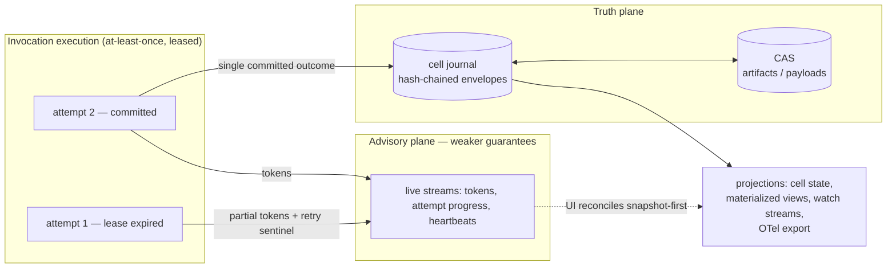
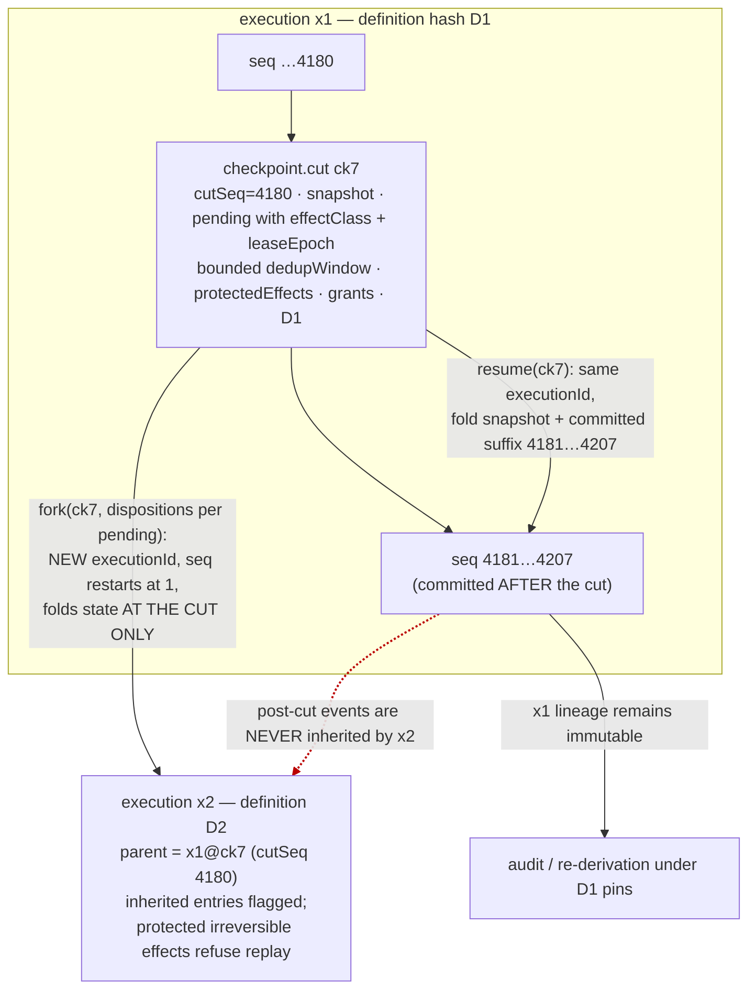

# 08 — Event and State Model

> **Post-review status (2026-08-16, phase 2).** This document predates the adversarial review; the review's
> binding adjudications live in the Amendment log of `research/DESIGN-SPINE.md` (A1–A14), with the
> full findings in `research/ADVERSARIAL-REVIEW.md`. Since phase 2 the **executable semantics** in
> `prototypes/kernel-semantics/` — normative prose in `docs/17-KERNEL-SEMANTICS.md`,
> `docs/18-KERNEL-INVARIANTS.md`, `docs/19-CRASH-RECOVERY-MODEL.md` — supersede prose wherever the two
> disagree; this document is the *rationale and evidence* record for the same mechanisms.
> **Applied here:** A1, A2, A10, A11, A12 (plus A8 where it bears on journal grant references) — see
> the Revision record at the foot of this document. **Outstanding:** none known.
> Where this document conflicts with the Amendment log or the executable semantics, **those govern**.


Status: DECIDED per `research/DESIGN-SPINE.md` §3 (kernel object 4: Event; object 8: Checkpoint), §5, §7, §8. Everything in this document is OUR PROPOSAL unless carrying an explicit evidence label per `research/METHODOLOGY.md`. Vocabulary follows spine §2 exactly: *kernel* (the minimal core), *runtime* (kernel + standard capabilities + SDKs), *harness* (a behaviour contract run in a cell — never the kernel), *event system* (typed append-only journal + derived advisory streams).

This document specifies the event system and the state model: the journal-first durability decision, the event envelope, the full event taxonomy, the two-plane guarantee split, two-tier storage and compaction, cells/checkpoints/resume/fork, delivery semantics, schema evolution, and — as the headline deliverable — the failure table mapping all seventeen mission failure scenarios onto kernel mechanisms. Sibling docs: object definitions in 05-KERNEL-PRIMITIVES.md, manifests and negotiation in 06-CAPABILITY-SPEC.md, process architecture in 07-RUNTIME-ARCHITECTURE.md, orchestration strategies in 04-ORCHESTRATION-MODELS.md, supervision policy detail in doc 13, verification in doc 16.

**Normative pointer (phase 2).** The record format, the checkpoint composite, the resume/fork split, the effect-class taxonomy, the dedup/replay-cache split and the uncertainty lifecycle are specified normatively in **`docs/17-KERNEL-SEMANTICS.md`** (with the checked invariants in `docs/18-KERNEL-INVARIANTS.md` and the crash matrix in `docs/19-CRASH-RECOVERY-MODEL.md`) and are executable in `prototypes/kernel-semantics/`. This document states *why* those mechanisms are shaped as they are and carries the failure table; where a field list or a state name differs, doc 17 wins.

---

## 1. The journal-first decision (record-and-inject, not replay-determinism)

All three mature durable-execution systems enforce one invariant — deterministic orchestration code, journaled nondeterministic effects — but they differ in *how recovery reconciles code with record*, and that difference is the decision this document rests on.

**Evidence.**
- FACT: Temporal recovers by re-executing workflow code and matching each emitted Command *positionally* against recorded history; a mismatch is a non-determinism error. Its versioning story is the direct cost: `patched()` marker semantics need ~100 doc lines of edge cases, worker-versioning pins executions to deployments, and the docs recommend periodic Continue-As-New "just to escape old code versions" (research/notes/durable-execution.md).
- FACT: Temporal's own AI integrations document the friction inventory: the upstream `MemorySession` is "not replay safe"; the replacement dies at Continue-As-New; HITL serializes `RunState` whose validity requires "the same tool names, handoff graph, and MCP servers as the run that produced it"; persisted payload schemas become "durable contracts across deployments"; delegate-agent token usage inside activities is silently lost to the parent's accounting (research/notes/durable-execution.md).
- FACT: Restate recovers by re-invoking the handler and *injecting* journaled results at each context action ("skip execution and inject the response it finds in the journal"); DBOS recovers by checkpoint lookup — before each step, return the checkpoint if present, resume at the first miss (research/notes/durable-execution.md).
- FACT: Restate 1.6 and DBOS both expose *restart-from-journal-point / fork-from-step* as ordinary operational verbs; DBOS's fork replaced its former time-travel debugger (research/notes/durable-execution.md).
- SOURCE-CODE OBSERVATION (HIGH): LangGraph's kernel durability is a state snapshot per barrier plus a `pending_writes` side channel, with fork (`source: "fork"`) as the branching verb — no positional replay anywhere (research/notes/langgraph.md).
- SOURCE-CODE OBSERVATION (HIGH): ADK, Claude Code, and Codex all treat an append-only event/transcript log as the working source of truth, with resume implemented as log scan or transcript replay, and fork-as-copy (research/notes/google-adk.md, research/notes/anthropic-claude-code-agent-sdk.md).
- INFERENCE (HIGH, from the Temporal AI-integration record): every friction point traces to one root cause — Temporal assumes *code is the durable artifact and data flows through it*, whereas an agent's durable artifact is the event data, and the code (prompts, model choice, tool wiring) is the volatile part (research/notes/durable-execution.md).

**Interpretation.** Positional replay buys the strictest failure detection in exchange for making orchestration code a versioned durable contract. In agent workloads the deterministic core shrinks to a trivial fold (append event, check pending invocations, loop) while prompts, models, tool schemas and harness wiring change weekly. The contract Temporal sells is therefore levied on exactly the part of the system that churns fastest. Restate and DBOS demonstrate that the same durability invariant holds under a *record-and-inject* discipline in which the journal, not the code, is the identity of the run.

**Implication.** The Kyxo journal is **journal-first**: the truth plane records typed outcomes of effects (Invocation transitions, Artifact productions, Grant reservations and settlements); cell state is a projection over the journal; recovery is *load checkpoint → fold the committed journal suffix → **triage** pending invocations by declared effect class* — re-lease the classes that are safe to re-execute, and move the classes that are not into the explicit `uncertain` state that only a journaled disposition can leave (§7.5) — never re-execute-and-match. (Amendment A1: the earlier phrasing "re-lease pending invocations" is retired; blanket re-lease is exactly the double-apply bug the effect-class triage exists to prevent.) There is no `patched()` equivalent, no requirement that old code paths survive in new binaries, and no positional identity between code and history. What we give up — Temporal's mismatch detection as a bug alarm — we replace with (a) definition hashes pinned in every checkpoint and every event (§6), so drift is detected as a *data* comparison at resume time rather than a replay crash mid-run, and (b) fork-from-checkpoint as the sanctioned response to drift (§6). Deterministic *re-derivation of projections* is still guaranteed — folding the same journal always yields the same state — which is the property audit, debugging and conformance testing actually need.

**Confidence.** HIGH. Three independent systems demonstrate the invariant is separable from positional replay; the friction inventory against AI workloads is first-party documentation, not our reconstruction.

---

## 2. The event envelope

The Event is kernel object 4 (spine §3): typed, versioned, append-only, two-tier. ADK is the documented counterexample that shapes the envelope: its `Event` *extends* the provider response type `LlmResponse`, and widening it in 2.0 (`node_info`, `output`) broke downstream stores and validators — the cost of an untyped envelope inheriting a model shape (SOURCE-CODE OBSERVATION + FACT, research/notes/google-adk.md). The Kyxo envelope inherits from nothing, carries payloads by reference, and reserves a namespaced metadata field in the MCP `_meta` style (FACT: `_meta` evolved into MCP's control plane — version, identity, tracing all ride there; research/notes/mcp-protocol.md).

### 2.1 Envelope fields

| Field | Type | Semantics |
|---|---|---|
| `id` | ULID | Globally unique, time-sortable. Assigned by the kernel at append. |
| `seq` | integer | Journal position within one **execution** — the lineage that owns the journal (a cell's current lineage; a fork starts a new execution at `seq` 1, §6.5). Dense, strictly monotonic, never reused. The recovery cursor, and the consistency boundary a checkpoint cuts at (`cutSeq`, §6.4). |
| `kind` | string | Reverse-namespaced event kind, e.g. `kyxo.invocation.completed`. The registry of kinds is closed for `kyxo.*`; userland kinds live under Kind-instance events (§3). |
| `schemaVersion` | integer | Version of this kind's payload schema. `(kind, schemaVersion)` is the unit of evolution (§8). |
| `protocolVersion` | string | Date-versioned kernel protocol revision the writer spoke (spine §8; MCP-style `YYYY-MM-DD`). |
| `occurredAt` | RFC3339 | Wall-clock at emission. Ordering authority is `seq`, never `occurredAt`. |
| `cellId` | id | The cell whose journal this event belongs to. Every event lives in exactly one cell journal. |
| `invocationId` | id? | The invocation this event describes or was emitted within. |
| `correlationId` | id | Constant across a causal tree (typically the root Objective's id). The audit query key. |
| `causationId` | id? | The `id` of the event that directly caused this one. Gives the causal DAG. |
| `actorId` | principal | Who caused it: a capability identity, a human principal, or `kernel`. **Stamped kernel-side, never writer-supplied** — Temporal's Principal Attribution sets the precedent that attribution must be unforgeable (FACT, research/notes/durable-execution.md). |
| `grantId` | id? | The grant under whose authority the action ran. Absent only on kernel housekeeping events. **Non-resolvable identifier** (amendment A8): it names authority for audit and lineage queries; it can never be presented back to the kernel to *obtain* authority. Authority is the unforgeable Grant handle the kernel minted, and handle identity — not string equality — is what the kernel checks (doc 11, ADR-013). |
| `payload` | object? | Small, typed, inline data. Anything above the inline threshold (§5) must be an artifact ref. |
| `payloadHash` | hash | Content hash of the canonical payload. Present even for inline payloads — this is what the chain covers (§2.3). |
| `artifacts` | ref[] | Content-addressed references `{ref, role, labels}` into the CAS. Roles: `input`, `result`, `error`, `evidence`, `suspension`, `snapshot`, … |
| `pins` | object | Version-by-data hashes in force when the event was produced: `{definition, config, prompt?, model?, manifest?}` (§6.5). |
| `meta` | object | Namespaced extension bag (reverse-DNS keys; `kyxo.*` reserved). Carries W3C trace context for OTel export, MCP-style. |
| `integrity` | object | `{prev, self}` hash-chain links (§2.3). |

### 2.2 Examples

A kernel event on the truth plane — an invocation committing:

```json
{
  "id": "01J8FZK7Q0X3N9V4T2B6M8R1SD",
  "seq": 4182,
  "kind": "kyxo.invocation.completed",
  "schemaVersion": 1,
  "protocolVersion": "2026-08-01",
  "occurredAt": "2026-08-15T09:12:33.412Z",
  "cellId": "cell_review-run-7",
  "invocationId": "inv_01J8FZJH...",
  "correlationId": "obj_payments-refactor",
  "causationId": "01J8FZJH2M...",
  "actorId": "cap_anthropic-adapter@2.3.1",
  "grantId": "grant_01J8FY...",
  "payload": {
    "outcome": "completed",
    "effectKey": "sha256:5f2a...",
    "effectClass": "external-idempotent",
    "leaseEpoch": 2,
    "landedExternal": true
  },
  "payloadHash": "sha256:7c1e...",
  "artifacts": [
    { "ref": "sha256:9ab2...", "role": "result", "labels": { "integrity": "model-output", "confidentiality": "project" } }
  ],
  "pins": { "definition": "sha256:d41d...", "config": "sha256:a1b2...", "model": "sha256:claude-fable-5#2026-06" },
  "meta": { "kyxo.trace": { "traceparent": "00-4bf9..." } },
  "integrity": { "prev": "sha256:e3b0...", "self": "sha256:11f4..." }
}
```

Two things this example encodes. The **effect key is content-inclusive** (amendment A1): it is a hash over `(capability, step, request)`, not a positional `cell:turn:step` string, so the same step re-issued with different arguments is a *different* effect and cannot be absorbed as a duplicate. And **budget movement is not a field of the outcome** (amendment A2): the settlement rides in its own `kyxo.grant.settled` event, emitted inside the same atomic commit record as this one. A commit record is the unit of atomicity — its events land entirely or not at all, and a torn trailing record is discarded at recovery — which is what lets outcome, artifact provenance and budget settlement be separate typed events without being separately durable.

A userland Kind-instance event — an Objective transitioning (see §3.3):

```json
{
  "id": "01J8G02WQH...",
  "seq": 4183,
  "kind": "kyxo.kind.instance.updated",
  "schemaVersion": 1,
  "protocolVersion": "2026-08-01",
  "occurredAt": "2026-08-15T09:12:34.001Z",
  "cellId": "cell_objective-controller",
  "correlationId": "obj_payments-refactor",
  "causationId": "01J8FZK7Q0X3N9V4T2B6M8R1SD",
  "actorId": "cap_objective-controller@1.0.0",
  "grantId": "grant_01J8FX...",
  "payload": {
    "kindRef": "kyxo.dev/Objective@v1",
    "instanceId": "obj_payments-refactor",
    "transition": { "from": "executing", "to": "verifying" }
  },
  "payloadHash": "sha256:31aa...",
  "artifacts": [{ "ref": "sha256:c0de...", "role": "result", "labels": {} }],
  "pins": { "definition": "sha256:77aa..." },
  "integrity": { "prev": "sha256:11f4...", "self": "sha256:beef..." }
}
```

### 2.3 Immutability and the redaction strategy

**Immutability rule.** A journal event is never updated and never deleted. Corrections, undo, and compaction are all *new events*: ADK's rewind — an inverse delta appended as an ordinary event — is the shipped precedent that even undo belongs in the log (SOURCE-CODE OBSERVATION, research/notes/google-adk.md), and Fowler's Retroactive Events pattern (correction as companion events, never rewrites) is the pattern-level ancestor (FACT-via-snippets, research/notes/durable-execution.md). Temporal's Reset likewise forks; it does not rewrite (FACT, research/notes/durable-execution.md).

**The redaction problem.** Observability must not become a data-leak vector: journals will contain references to secrets accidentally pasted into prompts, personal data subject to erasure requests, and outputs of later-discovered-compromised capabilities (§9 row 12). Naive deletion breaks both immutability and any integrity chain; naive retention makes the journal an unerasable liability.

**Design: tombstones + envelope-level integrity.** The hash chain is deliberately constructed so that *payload bytes are never chain input*:

1. Each envelope's `integrity.self` is the hash of the canonical envelope with `payload` replaced by `payloadHash` and artifacts represented by their refs (which are already hashes). `integrity.prev` is the previous envelope's `self`. The chain therefore commits to *what the payload was* (its hash) without containing it.
2. Redaction of a CAS payload deletes the bytes and installs a **tombstone entry** in the CAS index at the same hash: refs resolve to `{redacted: true, tombstone: "evt_..."}` rather than a miss — so a redacted artifact is distinguishable from a corrupted or lost one.
3. Redaction of an inline payload replaces `payload` with a tombstone marker while `payloadHash` is retained untouched. Chain verification still passes end-to-end.
4. Every redaction appends a truth-plane event `kyxo.artifact.redacted` recording the target ref/event, a reason class, the authorizing `grantId`, and the acting principal. Redaction is an exercise of authority and is itself audited; the policy pipeline gates it (redaction rights are a Grant right like any other, spine §3 object 7).
5. Projections and observability exports derived from redacted ranges are invalidated and re-derived; because all views are projections of the journal (§6.1), post-redaction rebuilds are mechanical.

The result: the journal remains verifiable end-to-end (every link checks), auditable (the *fact* and authority of every redaction is permanent), and erasable (the *content* is genuinely gone). What is lost is only the ability to re-read redacted content — which is the point.

---

## 3. Event taxonomy

Two families. **Kernel events** (`kyxo.*`) are the closed vocabulary the kernel itself emits and validates — capability, binding, invocation, artifact, evidence, approval, checkpoint, grant/budget, policy, cell, and Kind machinery. **Kind-instance events** carry all userland semantics — Objective, Plan, Evidence-typed reports, Memory blocks — through the generic `kyxo.kind.instance.*` kinds plus the Kind's own registered schema (spine §3 object 9, the CRD move). The mission's proposed `ObjectiveCreated … ObjectiveCancelled` list lands entirely in the second family: the kernel never learns what an Objective is.

### 3.1 Kernel events

| Event kind | Emitter | Payload (summary) | Plane |
|---|---|---|---|
| `kyxo.capability.registered` | registry (via kernel) | capability identity, manifest hash, stability class | truth |
| `kyxo.capability.advertised` / `.removed` | provider (via kernel) | runtime availability announcement/removal (Wayland pattern, spine §4) | truth |
| `kyxo.capability.probed` | prober capability | probe verdict, evidence artifact ref, cache TTL | truth |
| `kyxo.binding.sealed` | kernel negotiator | capability id, chosen dialect/tier set, grantId, policy route, manifest hash | truth |
| `kyxo.binding.failed` | kernel negotiator | typed missing-axis / version-mismatch reasons (fail-loud, spine §4) | truth |
| `kyxo.binding.revoked` | kernel | reason, revoking principal | truth |
| `kyxo.invocation.admitted` | kernel | bindingId, effect key, **effect class**, args refs, deadline, `requiresEvidence`, correlation/causation. Admission is authority check + policy stages + budget **reservation**, all before dispatch | truth |
| `kyxo.invocation.dispatched` | kernel | effect key, effect class, lease epoch, `external` flag. This is the *intent record*: without it a crash between decision and effect is undetectable (§7.5) | truth |
| `kyxo.invocation.suspended` | kernel | **`origin` discriminator (`provider` \| `policy` \| `kernel`)** — amendment A10 — plus suspension class (`input-required` \| `auth-required` \| `approval-required` \| `budget-exceeded`) and typed suspension payload ref. Origin determines resume semantics: a provider suspension re-enters the provider with a typed payload, a policy suspension resumes only after the policy condition clears, a kernel suspension is lifted by the kernel (budget top-up, lease re-issue) | truth |
| `kyxo.invocation.resumed` | kernel | resume payload ref, resuming principal, `origin` echoed from the suspension | truth |
| `kyxo.invocation.completed` | kernel (at commit) | effect key, outcome refs, lease epoch, `landedExternal`, evidence refs if gated | truth |
| `kyxo.invocation.failed` | kernel | error class, error artifact ref, attempts consumed, `landedExternal` | truth |
| `kyxo.invocation.cancel.requested` | kernel | target invocation/cell, requesting principal, reason. **The request is journaled, not only the honored transition** (amendment A10): a request that is never honored — provider ignored it, lease lapsed first — is exactly the case audit needs and the case an honored-transitions-only log erases | truth |
| `kyxo.invocation.canceled` / `.rejected` | kernel | cancel origin / rejection reason (A2A `rejected` adopted — executors may decline; FACT, research/notes/a2a-protocol.md); `landedExternal` records whether an external effect had already landed when cancellation took hold | truth |
| `kyxo.invocation.uncertain` | kernel (recovery triage) | effect key, effect class, descriptor, since. The external outcome is unknown; never guessed (§7.5) | truth |
| `kyxo.invocation.uncertainty.resolved` | kernel | disposition (`probe` \| `adopt-landed` \| `compensate` \| `abandon-failed`), resolved state, probe verdict or authorizing principal | truth |
| `kyxo.attempt.started` / `.progress` / `.failed` | executing provider | attempt number, lease id, partial output deltas, retry sentinel | **advisory** |
| `kyxo.artifact.produced` | kernel | content hash, size, producing invocationId, input refs, **label/kind** (amendment A10), taint/integrity/confidentiality labels. **Journaled once per producing invocation even when the CAS dedups the bytes** (A10/I14): content addressing dedups *payloads*, never *records* (§7.1) | truth |
| `kyxo.artifact.promoted` | kernel commit gate | target ref, evidence refs that satisfied the gate (doc 16) | truth |
| `kyxo.artifact.redacted` | kernel | tombstoned ref/event, reason class, authorizing grant | truth |
| `kyxo.evidence.recorded` | verifier capability (via kernel) | verdict, target ref, verifier binding, criteria ref | truth |
| `kyxo.approval.requested` | kernel policy stage | typed request payload (what/why/risk class), approver principal, deadline, escalation policy | truth |
| `kyxo.approval.granted` / `.denied` / `.expired` | human capability / scheduler | decision, responsibility metadata (who consented — non-negotiable, spine §5) | truth |
| `kyxo.effect.deduplicated` | kernel | effect key, original invocationId, original outcome. A re-issued effect the replay cache already holds; **always journaled** (A10/I14) | truth |
| `kyxo.delivery.duplicate` | kernel | effect key, original invocationId, original outcome. A redelivery absorbed by the bounded reliability window; **always journaled** (A10/I14) | truth |
| `kyxo.commit.retried` | kernel | commit token of a retried commit whose duplicate write was suppressed (doc 17 §9 mechanism 6) | truth |
| `kyxo.checkpoint.cut` | kernel | `cutSeq`, state-snapshot ref, pending-invocation set (with effect class + lease epoch), bounded dedup window, protected effects, grant states, definition hash, protocol version (§6.4) | truth |
| `kyxo.cell.created` / `.archived` | kernel | cell key, owning grant, behaviour (strategy) ref | truth |
| `kyxo.execution.forked` | kernel | parent execution + checkpoint + `cutSeq`, **per-pending-invocation dispositions** (A1), new definition hash, any protected-effect replay override with its stated reason (§6.5) | truth |
| `kyxo.cell.activated` / `.passivated` | scheduler | activation lifecycle (Orleans-style, operational only) | advisory |
| `kyxo.grant.issued` / `.attenuated` | kernel | parent grant (lineage), rights, budget vector (tokens, usd, wall-clock, invocations, spawn depth/width, risk class) | truth |
| `kyxo.grant.reserved` | kernel (at admission) | reserved units per dimension, reserving invocationId. Durable **before** dispatch, so a crash cannot lose the hold (A2) | truth |
| `kyxo.grant.settled` | kernel (at outcome commit) | actual units per dimension, settled invocationId; retires the matching reservation (A2) | truth |
| `kyxo.grant.released` | kernel | released (unused) reservation units, invocationId, reason — failure, cancellation, denial, or remainder after a smaller settlement (A2) | truth |
| `kyxo.grant.denied` | kernel | invocationId + typed reason (`revoked` \| `expired` \| `budget-exhausted` \| `revoked-mid-flight`). Admission-time refusal and the commit-time authority re-check both land here | truth |
| `kyxo.grant.exhausted` | kernel | dimension has no remaining headroom (limit − reserved − settled = 0); triggers `budget-exceeded` suspensions | truth |
| `kyxo.grant.revoked` | kernel | reason, revoking principal, affected bindings, `transitive` flag for lineage descendants | truth |
| `kyxo.policy.denied` | policy pipeline | stage id, rule ref, denied target, typed reason, phase (`admission` \| `commit`) | truth |
| `kyxo.policy.evaluated` | policy pipeline | full allow-path evaluation trace. **Plane is a policy-class knob** (amendment A12): advisory by default, **truth** in the regulated profile. A model-judge verdict that gates an effect is *always* truth-plane and always carries an input hash (§3.1 note) | advisory \| truth (profile) |
| `kyxo.journal.trimmed` | kernel | trim boundary (checkpoint id), archive location | truth |
| `kyxo.kind.registered` | kernel | Kind name, schema, storage version, served versions | truth |
| `kyxo.kind.instance.created` / `.updated` / `.deleted` | controllers/strategies (via kernel) | kindRef, instanceId, validated diff/transition, spec+status refs | truth |

Three placement decisions deserve justification.

*Attempt events are advisory* because Temporal's history is explicitly an outcome log, not an attempt log (`ActivityTaskScheduled` alone exists while retrying; FACT, research/notes/durable-execution.md) — recording attempts in truth would couple journal growth to retry weather and put uncommitted effects in the fold path (§4).

*Allow-path policy traces are a policy-class knob; denials are always truth* (amendment A12). Denials change what happened — they are outcomes with audit weight — while allow traces are high-volume diagnostics, so the default profile keeps them advisory and reconstructible (policy stages are deterministic over journaled inputs). But "reconstructible in principle" is not an audit record: a regulated deployment must be able to prove what was *permitted*, not only what was refused. The **regulated profile therefore promotes allow-path traces to the truth plane** as a declared policy class, with the journal-growth cost accepted explicitly rather than discovered later. Two cases are truth-plane in *every* profile: an allow decision that consumed a **model-judge verdict** gating an effect (journaled with a hash of the judge's inputs, so a non-deterministic gate is at least an attributable one — A12), and any allow whose stage is marked deny-class.

*Dedup and duplicate-delivery absorptions are truth, never a counter* (amendment A10, invariant I14). The superseded reading — "duplicate dropped and counted on the advisory plane" — made the audit trail depend on a metric. Suppressing an *effect* is correct; suppressing the *record* that a duplicate arrived destroys the evidence that recovery behaved correctly. Every absorption emits `kyxo.effect.deduplicated` or `kyxo.delivery.duplicate` naming the original invocation and its outcome. The same rule governs content addressing: **the CAS dedups bytes, the journal never dedups records** (§7.1).

### 3.2 Watch streams

Kind-instance events power **watch streams** (spine §3 object 9): a consumer subscribes to a Kind and receives its instance events as a projection — snapshot-first on attach, then ordered updates. This is the A2A recovery shape (Subscribe delivers a full Task snapshot before events, closing the get/subscribe race; FACT, research/notes/a2a-protocol.md) applied to every registered Kind.

### 3.3 The mission's objective lifecycle, mapped

The mission's `ObjectiveCreated … ObjectiveCancelled` events are *not* kernel kinds. Objective is a registered Kind; its controller (a userland strategy running in a cell) owns the state machine; the kernel contributes storage, schema validation, the watch stream, and the journal. The mapping:

| Mission event | Kyxo realization |
|---|---|
| ObjectiveCreated | `kyxo.kind.instance.created` (kindRef `Objective`), spec validated against the registered schema |
| ObjectivePlanned | `kyxo.kind.instance.updated` — status transition + Plan artifact attached by ref (Plan is itself a Kind; planners are capabilities, spine §2) |
| ObjectiveStarted / Progressed | `.updated` transitions driven by the controller as invocations complete; progress detail rides refs, not inline blobs |
| ObjectiveBlocked | `.updated` to a blocked status, causationId pointing at the suspending `kyxo.invocation.suspended` event |
| ObjectiveVerified | `.updated` after `kyxo.evidence.recorded` + `kyxo.artifact.promoted` satisfy the objective's acceptance gate (doc 16) |
| ObjectiveCompleted / ObjectiveFailed | `.updated` to terminal status; result artifacts promoted |
| ObjectiveCancelled | `.updated` to `cancelled`, downstream propagation via the kernel's cancellation machinery (§7.3), not by the controller touching children directly |

The payoff of this split is future-proofing: a team that wants `Experiment`, `Incident`, or `MigrationWave` lifecycles gets journal, watch, validation, and audit without any kernel change — precisely the CRD lesson (spine §3 object 9).

---

## 4. The two-plane model: durable truth vs live observation

**Evidence.**
- FACT: Temporal Workflow Streams — built from Signals/Updates/Queries — must surface *failed attempts' partial tokens* to subscribers, "because if the library waited for a successful Activity return before surfacing anything, there would be nothing to stream," while the workflow's durable state sees only the successful return; consumers must handle retry sentinels; and because every publish is a Signal, long streams consume history quota and force Continue-As-New (research/notes/durable-execution.md).
- INFERENCE (HIGH, a2a note): A2A's delivery semantics are deliberately weak — streams and webhooks are lossy hints; the server-held Task record is the consistency anchor; reconnect = snapshot-first re-subscribe ("state is authoritative, events are advisory") (research/notes/a2a-protocol.md).
- FACT: MCP added transport-level stream resumability (`Last-Event-ID`) in 2025-03-26 and deleted it in 2026-07-28, keeping durable task handles instead — durability moved from replayable byte streams to handles over state within ~16 months (research/notes/mcp-protocol.md).
- FACT: DBOS ships durable streams as a *separate* per-write table, not as workflow history (research/notes/durable-execution.md).

**Interpretation.** The truth plane and the live observation plane cannot be the same channel. Truth requires exactly-once landing of committed outcomes; observation requires immediate visibility of *uncommitted* work — tokens from an attempt that may yet fail and be retried. Any design that funnels observation through truth either pollutes the fold path with uncommitted effects or inherits truth's cost model for firehose data (Workflow Streams demonstrates both failure modes at once). Retried attempts' partial output is the sharpest case: under at-least-once execution (§7), attempt N's partial tokens can coexist with attempt N+1's committed outcome; if partials landed in truth, projections would fold effects that never happened.

**Implication.** Kyxo's event system is two planes with explicitly different guarantees, and the advisory plane's weakness is a documented contract, not an implementation shortfall:

| Property | Truth plane (journal) | Advisory plane (live streams) |
|---|---|---|
| Content | Committed outcomes, transitions, budget reservations/settlements/releases, evidence, approvals, dedup and duplicate-delivery absorptions | Token deltas, attempt progress, heartbeats, activation lifecycle, and allow-path policy traces *in the default profile only* (A12: the regulated profile moves them to truth; judge-gated allows are always truth) |
| Ordering | Total per cell (`seq`) | Best-effort per stream |
| Delivery | Exactly-once *effect* landing (at-least-once ingress + bounded reliability dedup, §7.1); absorbed duplicates are themselves journaled | At-least-once or lossy; truncatable; bounded buffers |
| Retry visibility | Never — outcome log, not attempt log | Always — partial output of failed attempts flows, marked with retry sentinels |
| Retention | Until snapshot+trim archival (§5.2) | Ephemeral; bounded ring buffers |
| Recovery role | The recovery substrate | None. Never consulted for recovery |
| Consumer reconciliation | Is the anchor | Snapshot-first attach against truth (watch-stream shape, §3.2) |



Observability (spine §2) is a projection of the truth plane — OTel export included — never a separate bolted-on bus; the advisory plane is the *only* additional channel, and it carries nothing that recovery or audit depends on.

**Confidence.** HIGH. Two independent systems (Temporal, A2A) articulate the split explicitly; MCP's reversal is a third confirmation from the protocol side.

---

## 5. Two-tier storage: refs in the journal, payloads in CAS

### 5.1 The claim-check as a primitive, not a retrofit

Evidence is unanimous that single-tier event logs fail under AI payloads: Temporal's hard caps (51,200 events / 50 MB history, 2 MB payloads, base64 tax on binary, image outputs rejected outright by the Pydantic AI integration) forced External Storage claim-checks with "AI agent conversations" as the named motivation; DBOS documents "keep step outputs small, use S3 + pointer"; Workflow Streams' carried state is the entire in-memory log; Claude Code spills tool results over 25k tokens to files (all FACT: research/notes/durable-execution.md, research/notes/anthropic-claude-code-agent-sdk.md). Every one of these is a retrofit of the same missing primitive.

Kyxo makes the split constitutive. The journal stores envelopes; payload bytes above a small inline threshold (V1: 4 KB canonical JSON — tunable, conformance-tested) live in the content-addressed store as Artifacts (kernel object 5), referenced by hash. Inline payloads below the threshold still carry `payloadHash`, so the integrity and redaction machinery (§2.3) is uniform. Because Artifacts are content-addressed and immutable with provenance and labels — including the **label/kind field** amendment A10 adds to `ArtifactMeta`, so a consumer can tell a compiled context view from a model output from an evidence bundle without parsing bytes — cross-boundary passing is by reference at near-zero cost (the Mach/L4 lesson the spine encodes, spine §3 object 5). One consequence is load-bearing and easy to get wrong: content addressing means two invocations that produce identical bytes share one blob. That dedups **storage**, and nothing else. Each producing invocation still journals its own `kyxo.artifact.produced` event with its own provenance (A10/I14); first-writer-wins provenance was a real prototype defect, not a hypothetical (§7.1). Storage V1 is SQLite/JSONL journal + file CAS behind a conformance-tested storage interface (spine §8; LangGraph's published checkpointer conformance suite is the precedent — SOURCE-CODE OBSERVATION, research/notes/langgraph.md).

### 5.2 Snapshot + trim as first-class compaction

Continue-As-New is a workaround for absent log compaction: it destroys sessions (`WorkflowSafeMemorySession` does not survive it), forces state to be re-threaded as arguments, and exists because history has hard caps (FACT, research/notes/durable-execution.md). Restate's shape is the correct one: processor snapshots to object store enable log trimming and fast catch-up as runtime-internal mechanics, no user ceremony (FACT, research/notes/durable-execution.md); Fowler's snapshots are the pattern ancestor.

Kyxo compaction is therefore **snapshot + trim, first-class, no ceremony**:

1. The kernel cuts a Checkpoint for the cell (§6.4) — an ordinary `kyxo.checkpoint.cut` event.
2. The journal prefix strictly before the checkpoint's position becomes trimmable: moved to cold archive per retention policy (default: archive, not delete — the hash chain spans archive and hot tier; the chain head of the hot tier is anchored in the checkpoint).
3. `kyxo.journal.trimmed` records the boundary and archive location.
4. Reliability state survives trims because it lives in the checkpoint composite, not in trimmed prefix scans — the Workflow Streams TTL lesson generalized (§7.1). Precisely (amendment A11): the **bounded dedup window**, the **protected-effect set** and the **pending-invocation set** are checkpoint fields; the **replay cache** is part of the folded state snapshot and carries its own, separately-governed retention. Trimming the journal must never be able to silently shorten either — a trim that outran the dedup window would resurrect duplicates, and a trim that dropped protected effects would let a fork redo an irreversible one.

Vocabulary guard: this is *journal* compaction, a kernel mechanic. *Context* compaction — summarizing conversation history for a model's window — is an entirely different operation: an event with pluggable executors (client-side, harness, or provider-side, since Anthropic now ships server-side `compact_20260112`; FACT, research/notes/anthropic-claude-code-agent-sdk.md), owned by the context-management system (doc 09). The two never share machinery; conflating them is ADK's `compaction`-as-EventAction ambiguity, which we deliberately avoid.

---

## 6. State: projections, views, checkpoints, forks, version-by-data

### 6.1 Cells as projections

A Cell (kernel object 6) is a keyed, single-writer, stateful execution scope; its state is *defined* as a fold over its journal. This is the Restate architecture generalized: the Bifrost log is the WAL and partition-processor state is the materialized view (INFERENCE HIGH, research/notes/durable-execution.md); it is also LangGraph's checkpoint-as-channel-values under a different fold (SOURCE-CODE OBSERVATION, research/notes/langgraph.md) and ADK's state-folded-from-`state_delta`s (SOURCE-CODE OBSERVATION, research/notes/google-adk.md). Single-writer turns are scheduled by the kernel scheduler; shared-read access is served from the projection without taking the writer turn (Orleans single-threaded execution + reentrancy, Restate `shared` handlers — FACT, research/notes/durable-execution.md). Child invocations run in **fresh cells**, never re-entrantly in the parent's (amendment A10): spawning into one's own single-writer scope is a deadlock by construction, and the kernel designs it away rather than documenting around it.

**Cell and execution.** A cell is the *addressable* scope (keyed, single-writer, long-lived); an **execution** is the *lineage* whose journal the cell's state folds over. They coincide until a fork: forking produces a new execution with its own `seq` sequence and its own effect-identity scope, while the parent lineage stays immutable (§6.5). Wherever this document says "the cell's journal", the precise referent is the journal of the cell's current execution — the distinction only becomes load-bearing at forks, and doc 17 states it normatively.

### 6.2 Materialized views

Beyond per-cell state, the kernel maintains registered **materialized views** updated transactionally with journal append: the invocation index (by status — DBOS's "agent inbox is just `list_workflows(status=PENDING)`" made structural; FACT, research/notes/durable-execution.md), the grant/budget ledger (limits, reserved, settled — A2), the capability telemetry store (outcome counts per capability×model pair, feeding the selection contract per spine C3 and amendment A13), **two separate tables for the two dedup mechanisms** (the bounded reliability window and the content-keyed replay cache — A11, §7.1), and Kind storage with its watch streams. Views are rebuildable from the journal by construction; view schema changes are deploy-time rebuilds, never journal migrations.

### 6.3 Memory cells

The memory system (doc 10) is not a kernel special case: memory blocks are labeled durable state cells whose writes are ordinary events with provenance (`actorId`, `grantId`, causation), quotas enforced as grant budget dimensions, and whose content participates in context compilation via the compile hook. What the event/state model contributes is exactly this: memory mutations are journaled, attributable, redactable (§2.3), and survive provider replacement because nothing in the envelope references a provider shape.

### 6.4 The checkpoint composite

A Checkpoint (kernel object 8) is a named consistent cut of one cell:

```
Checkpoint = {
  id,                     // checkpoint identity
  executionId,            // the lineage this cut belongs to
  cutSeq,                 // the consistency boundary: last COMMITTED seq folded in
  stateSnapshot,          // CAS ref: folded cell state, artifacts, replay cache, evidence
  pending: [{             // in-flight invocations at the cut — one entry each
    id,
    effectKey,            // content-inclusive effect identity (A1)
    effectClass,          // pure | local | external-idempotent
                          //   | external-compensatable | external-irreversible
    leaseEpoch,           // fencing token; stale-epoch commits are rejected (§7.2)
    state                 // dispatched | suspended | uncertain
  }],
  dedupWindow,            // BOUNDED reliability window only — TTL >= retry horizon.
                          //   NOT the replay cache (A11); that lives in stateSnapshot
  protectedEffects,       // landed irreversible effects a fork may never silently redo
  grants,                 // grant states: limits, reserved, settled, revoked (A2/A8)
  definitionHash,         // strategy hash + config/prompt/model pin lineage
  protocolVersion         // date-versioned kernel protocol the cut was written under
}
```

Each component earns its place from a documented failure or success elsewhere. *Snapshot alone is insufficient*: LangGraph needed `pending_writes` as a write-ahead side channel to avoid re-running successful parallel branches after a mid-step failure — their own correction toward "snapshot + pending effect log as one composite" (SOURCE-CODE OBSERVATION + the note's implication #3, research/notes/langgraph.md). *Definition identity is mandatory*: MAF scopes checkpoints to definitions (spine §3 object 8), and Temporal's `RunState` — valid only against an identical tool graph — is the failure mode when definition identity is implicit (FACT, research/notes/durable-execution.md). *Pending invocations* make the checkpoint the recovery unit for §7 semantics without journal-prefix scans (ADK's resume-by-full-log-scan, with its own TODO admitting checkpoints should be first-class, is the counterexample — SOURCE-CODE OBSERVATION, research/notes/google-adk.md). Checkpoints are portable across processes: state-transfer migration is the distribution story (spine §8), commercially proven by Cursor's handoff (spine §3 object 8).

Four fields exist because of phase-2 findings and did not appear in the pre-review composite:

- **`cutSeq` is a committed boundary, not a position marker.** The cut names the last *committed* seq folded into the snapshot. A checkpoint therefore never covers staged-but-uncommitted work — staging is by construction non-durable — and `cutSeq` is always strictly less than the seq of the `checkpoint.cut` event that records it (invariant I9).
- **`pending` carries the effect class and the lease epoch per invocation**, not just ids. Recovery and fork both branch on *declared effect class* to decide whether re-execution is admissible; a pending set that records only identity forces the kernel to guess, which is precisely how a non-idempotent effect gets double-applied (A1, §7.5).
- **`dedupWindow` is bounded** (amendment A11). The pre-review composite said "dedup state", and the phase-1 prototype implemented that as an unbounded set — which is what made graph delta-execution look free. Bounded reliability dedup and the content-keyed replay cache are two mechanisms with two contracts (§7.1); only the former is a checkpoint field, and its TTL is bound to the retry horizon.
- **`protectedEffects`** records landed irreversible effects so that a fork cannot silently redo one. Without it, an inherited irreversible effect is indistinguishable from a cache hit at the caller — a fork would either re-charge the credit card or report a parent's charge as its own success (A1; the falsification is recorded against the fork suite).

`grants` carries full grant *state* — limits, reserved, settled, revoked — because reserve/settle accounting (A2) must survive a crash: a reservation lost on restart is budget that can be spent twice. Read it correctly, though: a grant's limits are **ceilings enforced along the whole chain at admission, not partitions set aside for a branch** (doc 17 §9a). Sibling grants may each declare more than the parent's remainder, and admission still bounds their *collective* spend, denying the overflow with a journaled `grant.denied`; the reserved/settled figures record what is in flight and what has been consumed, not an allocation. Thin provisioning is deliberate — AI workloads cannot predict how spend distributes across delegated branches, and hard partitioning would strand budget in branches that never run. The stored value is state, not authority: restoring a checkpoint does not resurrect a grant revoked after the cut, and it hands back no usable authority, since authority is a handle the kernel mints, never an id in a record (A8, invariant I21).

### 6.5 Resume continues a lineage, fork branches one; version-by-data

**Evidence.** DBOS `forkWorkflow(id, startStep)` is both the mass-recovery tool and the documented AI debugging tool ("rerun the misbehaving step under the exact conditions… then re-test with a fixed prompt"), and it *replaced* their time-travel debugger; Restate 1.6 ships restart-from-any-journal-point; Temporal's Reset forks with history copied to a chosen event; LangGraph forks checkpoints (`source: "fork"`) into diverging branches of a thread tree; Claude Code forks sessions by transcript copy (FACT / SOURCE-CODE OBSERVATION across research/notes/durable-execution.md, research/notes/langgraph.md, research/notes/anthropic-claude-code-agent-sdk.md).

**Interpretation.** Four independent systems converged on fork-from-recorded-position as the verb that survives contact with AI workloads — because when the "code" (prompt, model, wiring) is data that changes weekly, *patching a live lineage* is the wrong primitive and *branching from a known cut* is the right one.

**Implication — two verbs, and they are not variants of each other** (amendment A1). Phase 1 conflated them: restoring a checkpoint replayed the journal past the cut, so "rewind" silently rebuilt the future it was supposed to discard. The two verbs are now distinguished by what they fold and by whose identity the result carries:

| | **resume(checkpoint)** | **fork(checkpoint, dispositions)** |
|---|---|---|
| Lineage | **Continues** the same one | **Branches** a new one |
| Execution identity | Unchanged — same `executionId`, `seq` continues | **New** `executionId`, `seq` restarts at 1, `correlationId` inherited |
| What is folded | Snapshot **plus every committed event after the cut** | State **at the cut only** |
| Post-cut parent events | Inherited — they are this lineage's own history | **Never inherited**, by construction |
| The checkpoint is | An accelerator over the journal (fold-from-snapshot must equal fold-from-journal at the cut — invariant I20) | A branch point |
| Pending invocations | Triaged by effect class and re-leased or made `uncertain` (§7.5) | **Every one requires an explicit disposition** (below) |
| Journaled as | `kyxo.invocation.resumed` / recovery fold | `kyxo.execution.forked` carrying parent, `cutSeq` and the dispositions |

Because a fork folds only to the cut, **effect identity is lineage-scoped** (A1, invariant I24): the child's replay cache cannot contain outcomes the parent produced after the cut, so the child never absorbs a parent's later effect as its own duplicate. Entries that *do* cross the cut are marked **inherited**, which matters for exactly one case: an inherited effect of a class that cannot be safely re-executed is not a cache hit. Reporting a parent's irreversible effect as the child's success is indistinguishable, at the caller, from having performed it — so the kernel **refuses loudly** and journals the refusal instead of answering. Divergence between lineages about the state of the world is a first-class, documented condition, not a bug to suppress.

**Forking with pending invocations requires explicit, journaled dispositions** (A1). If the cut has in-flight invocations, `fork` fails loudly unless the caller supplies a disposition for **each** one, and the chosen dispositions are recorded in the `kyxo.execution.forked` event:

| Disposition | Meaning in the child lineage | Constraint |
|---|---|---|
| `adopt` | Take the parent's in-flight effect as landed and completed; the child inherits it and will not redo it | Irreversible adoptions join `protectedEffects` |
| `re-lease` | Treat it as not performed and re-execute it in the child | **Refused** for `external-compensatable` and `external-irreversible` pendings — the outcome is unknown and replay could double-apply — unless the caller supplies an explicit `allowReplayOfProtected` override *with a stated reason*, which is itself journaled |
| `compensate` | Run the declared compensation, then let the child proceed as if the effect had not landed | Requires a `compensatable` capability; **compensation is the normative repair for irreversible effects** (A1, doc 13 scenario E, ADR-002) |
| `abandon` | Record the effect as failed in the child and continue without it | The parent lineage keeps its own record; divergence is explicit |

There is deliberately **no default**. A default disposition is a guess about the world, and the whole point of A1 is that the kernel does not guess about world effects — an unaddressed pending is an error at the fork call, before anything branches.

Two consequences of the split are easy to miss and are stated here so no sibling document assumes otherwise. **Merge is not supported.** Two lineages that diverged have divergent world effects, and no automatic rule reconciles them safely; reconciliation, where it is wanted, is ordinary work performed by a strategy in a third lineage. And **resume is not unconditional**: if a suspended invocation's provider cannot be re-entered — its declared `resumable` trait is false, or the external session behind it is gone — the invocation fails explicitly rather than silently restarting, because a silent restart is a re-execution wearing a resume's name.

**Implication — version-by-data.** Every event pins the definition/config/prompt/model hashes in force when it was produced (`pins`, §2.1); every checkpoint carries `definitionHash`. On resume, the kernel compares the resuming behaviour's definition hash against the checkpoint's. Match → continue the lineage. Mismatch → the kernel refuses silent continuation and offers exactly one verb: **fork** — a new execution lineage (`kyxo.execution.forked`) referencing the parent checkpoint, running the new definition forward under the disposition rules above. The old lineage stays immutable and auditable under the hashes that actually produced it. There is no patch-marker API, no worker-versioning, no requirement that old code paths exist in new binaries — the anti-Temporal-patching decision (spine §7). Upgrades, prompt fixes, and repairs are all the same operation, and the journal records precisely which definition produced which events.

**Confidence.** HIGH on fork-as-verb (four-way convergence). HIGH on the resume/fork split and the mandatory-disposition rule — both are now executable and property-tested (`prototypes/kernel-semantics/`, fork and crash suites; doc 19), which is the A1 Wave-0 exit gate. MEDIUM remains on the refuse-then-fork *strictness knob* — whether continuation should be permitted when only non-semantic config changed is still a policy question, not a mechanism one.



---

## 7. Delivery semantics

### 7.1 The exactly-once illusion: at-least-once + effect keys + two distinct dedup mechanisms

FACT: every system studied converges on the same triangle — at-least-once redelivery, lease/visibility timeouts, idempotent consumers — with "exactly-once" always synthesized via dedup keys, never a transport guarantee: Restate ingress `Idempotency-Key` with 24 h retention; DBOS `deduplication_id`; Workflow Streams `(publisher_id, sequence)` dedup with a 15-minute TTL that must exceed the 10-minute publish-retry window; Celery `acks_late` + mandatory idempotency (research/notes/durable-execution.md). A2A and MCP stop short: A2A has no exactly-once anywhere and MCP's idempotency is an untrusted hint (FACT, research/notes/a2a-protocol.md, research/notes/mcp-protocol.md) — which is why this layer must be kernel-owned.

Kyxo contract:

- Every Invocation carries an **effect key** — the kernel's identity for "this effect". It is **content-inclusive** (amendment A1): derived from `(capability, step, canonical request)`, with caller-supplied step identity optional and the argument hash **mandatory**. The pre-review formulation — a positional key over `(cellId, turn/step, spawn path)` in LangGraph's uuid5 style (SOURCE-CODE OBSERVATION, research/notes/langgraph.md) — is *retained as the derivation of step identity* but is no longer sufficient on its own: a position-only key makes "same step, different arguments" collide, so a retry after a corrected argument would be absorbed as a duplicate and the corrected effect would never happen.
- Delivery to capability providers is **at-least-once**. Exactly-once is synthesized at commit, and the synthesis is what the next two bullets separate.
- **Effect keys are lineage-scoped** (A1): a key is meaningful within one execution lineage. Forks inherit entries marked as inherited, never as their own (§6.5).

**Two mechanisms, two contracts** (amendment A11). Conflating them was the phase-1 prototype's cheat — one unbounded table served both, which is what made graph delta-execution look free and made an unbounded dedup window look like a design choice rather than a leak. These two are the pair the amendment separates; doc 17 §9 enumerates the full set of **six** distinct dedup mechanisms in the system (adding invocation dedup, CAS/artifact dedup, commit-token dedup, and *event dedup, which must not exist*), and conflating any two of them produces a real bug. The two that matter for delivery semantics:

| | **Reliability dedup window** | **Replay cache** |
|---|---|---|
| Question it answers | "Have I already *taken delivery* of this exact effect?" | "Do I already *know the outcome* of this effect in this lineage?" |
| Keyed by | Effect key, within a bounded time window | Effect key, content-inclusive, lineage-scoped |
| Retention | **Bounded**: `dedupTTL ≥ maxRetryHorizon` (per-attempt timeout × max attempts + backoff sum + lease slack). Workflow Streams' 15-min-TTL-vs-10-min-retry coupling proves this is a correctness knob, not tuning trivia (FACT, research/notes/durable-execution.md). A binding whose retry policy violates the rule **fails at bind time** (spine §4 fail-loud) | Indefinite by default, **policy-governed** — a declared retention/invalidation policy, not a side effect of a reliability timer |
| Purpose | Absorb redeliveries so an at-least-once transport cannot double-apply an effect | Serve memoized outcomes: resume-after-crash, delta execution, graph re-entry |
| Lives in | The checkpoint composite, as a bounded field (§6.4) | The folded state snapshot, with its own retention contract |
| On absorption | Journals `kyxo.delivery.duplicate` | Journals `kyxo.effect.deduplicated` |
| Wrong to assume | That it is a cache. Its TTL bounds the *redelivery* horizon, nothing more; a delivery arriving after expiry falls through to the replay cache, which is why both exist and why the bind-time coupling rule is enforced | That it is a reliability guarantee. It is a *memo* under a policy that may evict it; it is not what stops a non-idempotent effect from being re-executed — declared effect class and `protectedEffects` do that (§7.5, §6.5) |

**Every absorption is journaled** (A10, invariant I14). Suppressing the effect is the point; suppressing the record is a bug. A duplicate delivery, a replay-cache hit, and a fork's refusal to replay a protected effect each emit a truth-plane event naming the original invocation and its outcome. Three corollaries follow:

1. **The CAS dedups bytes; the journal never dedups records.** Two invocations that produce identical content share one blob and still journal one `kyxo.artifact.produced` event *each*, with their own provenance. First-writer-wins provenance was an observed phase-1 defect: the audit trail lost the fact that a second invocation had produced anything at all (§5.1).
2. **A dedup hit is not silence.** A caller that receives a deduplicated outcome can see, from the journal, that it received a memo rather than a fresh execution — which is what makes "did this actually run?" answerable after the fact.
3. **Counting is not recording.** The superseded phrasing "dropped and counted (advisory)" is retired: advisory-plane counters are lossy by contract (§4), so an audit that depends on them has no evidence.

Reliability-window state and protected effects survive journal trims because they are checkpoint fields (§5.2, §6.4); the replay cache survives as part of the state snapshot.

### 7.2 Leases, visibility timeouts, fencing

Every effectful invocation is dispatched under a **lease** with a visibility timeout and heartbeat renewal (the SQS/Celery pattern; FACT-by-convergence, research/notes/durable-execution.md). Lease expiry → redelivery to another provider under the same effect key — but only for effect classes where re-execution is admissible; for the unsafe classes a lapsed lease produces uncertainty, not a redelivery (§7.5). Each redelivery increments a **lease epoch**, and commits carry the epoch: a zombie worker completing after its lease expired presents a stale epoch and is rejected at commit — closing the duplicate-commit race that pure dedup windows leave open when a "dead" worker was merely slow. Poison-pill protection follows Celery's deliberate exception (a task that kills its worker is not redelivered forever; FACT, research/notes/durable-execution.md): attempts are capped, and cap exhaustion converts to `kyxo.invocation.failed` with the attempt trail attached as evidence, escalating per supervision policy (doc 13).

### 7.3 Cancellation propagation

Cancellation is a first-class kernel flow, not an exception convention (ADK's don't-catch-BaseException discipline is the documented failure of exceptions-as-control; SOURCE-CODE OBSERVATION, research/notes/google-adk.md):

1. `cancel` targets an invocation or cell. **The request itself is journaled** as `kyxo.invocation.cancel.requested`, at the moment it is made — not merely the transition it eventually causes (amendment A10). This is a deliberate correction of the phase-1 prototype, which recorded only honored cancellations: a request that was never honored (the provider ignored the signal, the lease lapsed first, the effect had already landed) left no trace, so the journal could not distinguish "nobody asked to cancel" from "we asked and it did not stop" — the difference that matters in an incident review. Request and honored transition are separate events with separate causation.
2. The kernel propagates down the invocation tree via grant lineage — every child invocation's grant descends from the parent's, so the blast set is computable, including spawn-depth descendants.
3. Local invocations receive a typed cancellation signal at the next scheduler checkpoint; opaque remote executors (A2A, MCP tasks) get cooperative cancellation and are polled to a terminal state or lease expiry (A2A `CancelTask` is best-effort by spec; FACT, research/notes/a2a-protocol.md).
4. Kernel guarantees on cancel commit: no further budget charges against the canceled subtree, leases are not renewed, pending suspensions are voided, and `kyxo.invocation.canceled` lands terminally only after children resolve or their leases lapse.

### 7.4 Deadlines

Every invocation and every suspension may carry a **deadline**; the scheduler enforces them with durable timers (Orleans's volatile-timers vs durable-reminders split names the requirement; FACT, research/notes/durable-execution.md). Deadlines are absent from A2A entirely and from Claude Code (no top-level session timeout, no per-subagent wall-clock cap — FACT, research/notes/a2a-protocol.md, research/notes/anthropic-claude-code-agent-sdk.md); they are part of the gap map this layer fills. Deadline expiry is a typed outcome (`failed` with deadline class, or escalation per policy for `approval-required` — §9 row 10), never a hang.

### 7.5 Uncertain outcomes: the state the pre-review lifecycle was missing

The lifecycle in §3.1 and spine §3 object 3 had terminal states for *known* outcomes and interrupted states for *waiting* — and nothing for the condition that dominates real crash recovery: **the effect may have happened; we died before recording whether it did**. Phase 1 papered over it, and the paper was load-bearing: with no representation for "unknown", an auto-retry of a non-idempotent effect is indistinguishable from correct recovery. The fix is a state, not a convention.

**Effect classes.** Every invocation carries a **declared effect class**, negotiated at bind time and pinned in `invocation.admitted`. The kernel branches on this — a declared, negotiated property — never on what kind of thing a capability is:

| Class | Meaning | Recovery admissibility |
|---|---|---|
| `pure` | No effect outside the kernel | Freely re-executable |
| `local` | Mutates kernel-owned state only (cells, artifacts) | Re-executable under dedup |
| `external-idempotent` | External, declared idempotent under the effect key | Safe to re-lease after a crash |
| `external-compensatable` | External, not idempotent, reversible via a declared compensation | **Never auto-retried**; compensate, then decide |
| `external-irreversible` | External, not idempotent, not reversible | **Never auto-retried** under any circumstance |

**The uncertain state** (invariants I13, I15). Recovery folds committed truth and then triages: an invocation with a `dispatched` record and no outcome record is in-flight across the crash. If its class is safe, it is re-leased under the same effect key. If its class is one of the two unsafe classes, the kernel commits `kyxo.invocation.uncertain` and stops. `uncertain` is **not terminal and not interrupted**: no budget is settled against it, no result is fabricated, no retry is scheduled, and no projection is allowed to read it as either success or failure. This is why `invocation.dispatched` is journaled as an *intent record* before the effect is attempted (§3.1) — without a durable "we were about to do this", the crash window is invisible and uncertainty cannot be detected at all.

**Resolution is by explicit, journaled disposition — only.** An `uncertain` invocation leaves that state through exactly one path: a disposition recorded as `kyxo.invocation.uncertainty.resolved`, naming who or what decided.

| Disposition | Mechanism | Resolves to |
|---|---|---|
| `probe` | Ask the capability whether the effect landed (`probeable` trait). The verdict is journaled | `completed` on *landed*, `failed` on *not-landed*, **stays `uncertain`** on *unknown* — a probe that cannot answer resolves nothing, and saying so is the correct outcome |
| `adopt-landed` | An authority (operator, supervising strategy, reconciliation capability) asserts the effect landed | `completed`, with the asserting authority recorded |
| `compensate` | Run the declared compensation (`compensatable` trait); its result is journaled | `failed` on successful compensation (the world is back), **stays `uncertain`** if compensation itself failed |
| `abandon-failed` | An authority asserts the effect did not land, or that its consequences are accepted | `failed`, with the asserting authority recorded |

Three properties fall out and are worth stating plainly. **Uncertainty can persist**: `probe → unknown` and `compensate → failed` both leave the invocation uncertain, and a design that forced a resolution here would be inventing knowledge. **Every resolution names an authority or a verdict**, so "who decided the payment went through" is answerable from the journal alone. And **a resolution to `completed` on an irreversible class adds the effect to `protectedEffects`**, so no later fork can quietly redo it (§6.5). Uncertainty is bounded by attention, not by a timer: it surfaces on the operator surface and via supervision escalation (doc 13), because a silent timeout that picked a disposition would be exactly the guess this whole mechanism exists to forbid.

---

## 8. Schema evolution

The journal outlives every code version; evolution is therefore a specified mechanism, not a migration afterthought. Fowler names schema evolution the enduring unsolved cost of event sourcing, addressed in practice by upcasters and versioned event types (FACT-via-snippets, research/notes/durable-execution.md). Kyxo adopts that discipline with two regimes, matching the two mutability classes in the system:

**Immutable journal events: write-once, upcast-at-read.** An envelope is stored forever at the `(kind, schemaVersion)` it was written with — immutability (§2.3) forbids rewrite-in-place migrations. Readers obtain the current version through a registered **upcaster chain**: pure, total functions `vN → vN+1`, composed. Upcasters may only add/derive/rename fields; anything lossy mints a new kind. Unknown fields are preserved round-trip (must-ignore + must-preserve), so consumers older than writers degrade safely — the MCP/TLS lesson the spine bakes into bindings, applied to storage.

**Mutable Kind instances: one storage version + conversion (the CRD pattern).** Kind storage serves multiple schema versions while persisting exactly one storage version, converting at the boundary — the Kubernetes CRD mechanism the spine adopts as kernel object 9. A Kind bumps its storage version by registering converters; the kernel migrates instances lazily on write. This keeps userland schema churn (Objectives, Plans, Memory blocks — the fastest-moving schemas in the system) out of the journal-evolution machinery entirely: the journal records *that* an instance changed and the diff ref; the Kind store owns *shape*.

**Governance of the kernel vocabulary.** The kernel protocol is date-versioned with stability classes and a 12-month deprecation floor (spine §4) — directly lifted from MCP's machinery, which demonstrably survived a full architectural rewrite of its own protocol using its own versioning model (FACT, research/notes/mcp-protocol.md). Event kinds carry stability classes (`experimental/testing/stable/deprecated`); deprecated kinds keep their upcasters for the full window.

**Event-schema conformance tests.** Two precedents make this non-optional: MCP requires a conformance scenario mapping every normative MUST/SHOULD to a check ID *before* a SEP reaches Final (FACT, research/notes/mcp-protocol.md), and LangGraph ships `Checkpoint.v`, checkpoint migrations, and a published checkpointer conformance suite (SOURCE-CODE OBSERVATION, research/notes/langgraph.md). Kyxo's suite, shipped with the protocol schema (spine §8): a golden corpus of envelopes per kind per version; round-trip tests (serialize/deserialize/preserve-unknown); upcaster chain tests (every historical version reaches current, idempotently); hash-chain and redaction-tombstone verification over corpus journals; and storage-adapter conformance (append, fold determinism, trim, checkpoint restore) that any third-party journal/CAS backend must pass. ADK's five language SDKs re-deriving an unversioned de facto event schema — with 2.0's additive fields breaking downstream validators — is the documented failure this prevents (FACT, research/notes/google-adk.md).

---

## 9. The failure table

All seventeen mission failure scenarios, mapped onto the mechanisms above. Conventions: "supervision" = OTP-style restart classes with restart-intensity budgets extended to token/cost, escalating to parent cells or humans (spine §7; detail in doc 13 — the OTP model is the documented missing complement in all durable runtimes, which retry flat with no hierarchy above the loop: FACT/INFERENCE HIGH, research/notes/durable-execution.md). "Worker" here means a capability provider process executing an invocation; "runtime crash" means the Kyxo runtime process itself. Every recovery path below terminates in a journaled, typed outcome — nothing hangs, nothing fails silently.

| # | Scenario | Detected by | Kernel behavior | Recovery path | Absorbing primitive(s) |
|---|---|---|---|---|---|
| 1 | **Model timeout** | Per-attempt timeout / lease expiry on the model-adapter invocation; no commit arrives | Attempt marked failed (advisory); redeliver under the same effect key per binding retry policy with backoff; attempts capped; the reservation is held across attempts and settled or released once (A2) | Retry to commit; on cap exhaustion → `invocation.failed` with attempt trail, supervision escalates (swap binding, degrade tier, or surface) | Invocation lifecycle + scheduler leases + retry policy |
| 2 | **Provider outage** | Failure-rate spike in capability outcome telemetry; typed provider errors across bindings | Mark capability unhealthy via advertisement events; new bindings to it fail eligibility; in-flight invocations suspend (interrupted class) rather than burn retry budget | Re-negotiate Bindings to an eligible alternate (manifest gates eligibility, telemetry drives selection — spine C3); or park with deadline until health recovers | Binding re-negotiation + capability telemetry + suspension states |
| 3 | **Tool failure** (clean error result) | Invocation commits with `failed` outcome and typed error artifact | Journal the failure; **settle actual usage and release the unused reservation** (A2); no kernel-initiated retry unless the manifest declares a safely re-executable effect class and policy allows | Error becomes context for the strategy/model to self-correct (Claude Code's model-visible violation pattern — FACT, research/notes/anthropic-claude-code-agent-sdk.md); harness decides retry/replan under its mistake budget | Invocation terminal state + Event-as-context; strategy concern above the kernel |
| 4 | **Partial tool side effects** (crash mid-effect) | `invocation.dispatched` intent record with no outcome record; lease expiry without a terminal event | Triage by **declared effect class**: `external-idempotent` → redeliver under the same effect key, provider dedups. `external-compensatable` / `external-irreversible` → **no auto-retry**; invocation → **`uncertain`** (§7.5) with lease/attempt evidence. (Supersedes the pre-review `failed(effect-uncertain)` reading: an unknown outcome is not a failure, and recording it as one is a guess that closes off `adopt-landed`.) | Explicit journaled disposition only: `probe` the external state, `adopt-landed`, `compensate` (the normative repair for irreversible effects, A1), or `abandon-failed`. Choice is made by supervision, a reconciliation capability, or a human; `approval-required` if the risk class demands it. A `completed` resolution on an irreversible class joins `protectedEffects` | Effect keys + leases + **effect-class declaration** + uncertainty lifecycle + verification gate |
| 5 | **Worker crash** (provider process dies) | Heartbeat loss → lease/visibility timeout | Lease epoch incremented; invocation redelivered to another provider instance; stale-epoch commits from a zombie rejected (§7.2); partial advisory output carries retry sentinel | Next attempt commits exactly once via the reliability window (with the absorbed duplicate journaled); poison-pill cap prevents crash loops, converting to failed + escalation. A worker crash on an unsafe effect class goes to `uncertain`, not to another attempt (§7.5) | Leases/epochs + at-least-once redelivery + content-inclusive effect keys + effect-class triage |
| 6 | **Runtime crash** (Kyxo process dies) | Restart recovery scan finds executions with committed journal beyond the last fold / pending invocations | Rebuild from committed truth only: discard any torn trailing commit record; **resume** each lineage (load its latest checkpoint, fold the committed suffix — same execution identity, §6.5); restore the bounded dedup window, protected effects, grant reserve/settle state and pending set from the composite; then **triage pending invocations by effect class** — re-lease the safe classes, move the unsafe ones to `uncertain` (§7.5). Staged-but-uncommitted proposals are lost by construction, and advisory streams are lost by contract (§4) | Safe classes reconcile via effect keys on redelivery, with each absorbed duplicate journaled; unsafe classes wait for an explicit disposition; durable timers re-armed; reservations that never settled are released | Journal + Checkpoint composite + CAS + effect-class triage; the two-plane split makes the loss surface exactly the advisory plane and the staging area |
| 7 | **Context overflow** | Context compiler's deterministic token accounting pre-flight; or provider length error decoded by the adapter | Not a durability failure: kernel emits a compaction-required event; compaction executed by a pluggable executor (client/harness/provider-side — doc 09; spine §5) | Invocation retried with recompiled view; journal untouched (truth ≠ context window); repeated thrash bounded by mistake budget (Claude Code's thrash detector is the precedent — FACT, research/notes/anthropic-claude-code-agent-sdk.md) | Context-management system + compaction-as-event; journal unaffected |
| 8 | **Budget exhausted** | **Reserve-at-lease** (amendment A2): admission reserves against `limit − reserved − settled` on every grant in the chain and finds no headroom — or a lagged/federated **settlement** at outcome consumes the last of a dimension | Admission refused before dispatch with `grant.denied(budget-exhausted)`; `grant.exhausted` journaled for the dimension; affected invocations → `budget-exceeded` (interrupted class, spine §3 object 3); spawning refused; running children of the grant subtree stopped (Claude Code's tree-wide enforcement contract — FACT, research/notes/anthropic-claude-code-agent-sdk.md). **Decrement-at-commit is retired** (A2): it could only detect exhaustion *after* the spend, and left concurrent in-flight invocations under one grant chain free to overdraw it between dispatch and commit. (Reservation bounds *in-flight* spend; it does not partition a grant among its children — limits are ceilings checked along the chain at admission, doc 17 §9a) | Escalation up the grant lineage (A2A AUTH_REQUIRED chaining generalized — FACT/INFERENCE HIGH, research/notes/a2a-protocol.md): parent or human issues an attenuated top-up grant and resumes, or cancels. Reservations held by invocations that never reached an outcome are **released** (`grant.released`), so a crash or cancellation cannot strand budget | Grant (budgets as attenuated quantitative rights) + `grant.reserved`/`.settled`/`.released` + interrupted state + escalation chain |
| 9 | **Permission denied** | Policy pipeline deny stage at bind time or at effectful invocation | Bind-time: `binding.failed`, loud, typed. Run-time: `policy.denied` + invocation `rejected`; deny stages non-bypassable (spine §3, mechanisms) | Typed denial returns as context (model self-corrects or re-plans); if policy routes to escalation instead: `approval-required` suspension to a human capability | Policy pipeline + Binding fail-loud + Invocation rejected/approval-required |
| 10 | **Human approval delayed** | Durable deadline timer on the `approval-required` suspension | Suspension is durable and free: typed suspension payload journaled, cell passivated while waiting (Restate awakeable/suspend economics — FACT, research/notes/durable-execution.md) | On deadline: escalation policy — remind, route to alternate approver, auto-deny, or fail; every branch journaled with responsibility metadata (who was asked, who decided) | Typed suspension + scheduler deadlines + humans-as-capabilities contract (spine §5) |
| 11 | **Remote agent disappears** (A2A peer / remote cell) | Federation-edge lease: poll/subscribe failures against the remote task handle beyond retry horizon | Remote executor is opaque — recovery is by handle, not by reaching inside: re-attach snapshot-first (A2A Subscribe semantics), keep the invocation parked (interrupted) meanwhile | Handle recovered → resync mirrored state and continue. Horizon exceeded → `failed(remote-lost)` with evidence; re-negotiate binding to an alternate capability or escalate; telemetry demotes the remote for selection | Invocation lifecycle + leases at the federation edge + Binding + remote-cell mirroring (spine §5) |
| 12 | **MCP server compromised** | Policy interposition anomalies; verification failures on its outputs; taint-label propagation flags derived artifacts; telemetry deviation | Revoke every Grant bound to the capability (revocation immediate; interposition invisible to holder — spine §3 object 7); bindings die with grants; quarantine artifacts by structural taint labels | Blast radius computed *from the journal*: provenance identifies every artifact/context derived from the compromised source; affected cells **fork** from pre-compromise checkpoints — each in-flight invocation at that cut needing an explicit journaled disposition, which is where "did the compromised server already write to the ticketing system?" gets answered deliberately rather than by replay (§6.5) — leaked payloads redacted via tombstones (§2.3); post-mortem re-derivation from archive under pinned hashes | Grant revocation + Artifact taint/provenance + policy pipeline + fork-with-dispositions + redaction |
| 13 | **Duplicate event delivery** | Effect-key hit in the **bounded reliability window** at commit (redelivery), or in the **replay cache** (re-issued effect); stale lease epoch at commit | The *effect* is suppressed, the *record* never is: `delivery.duplicate` or `effect.deduplicated` is journaled on the truth plane naming the original invocation and its outcome (A10/I14). The superseded "dropped and counted (advisory)" behavior is retired — advisory counters are lossy by contract, so audit had no evidence. Window-vs-retry coupling is validated at bind so late duplicates can't outlive their window (§7.1) | None needed — absorption *is* the recovery. The bounded window survives trims via the checkpoint composite; the replay cache rides the state snapshot under its own retention policy (A11) | Content-inclusive effect keys + bounded dedup window + replay cache + lease epochs + exactly-once *effect* landing |
| 14 | **Checkpoint corruption** | Content-address mismatch on snapshot read; envelope-chain verification failure; definition-hash validation at resume | Checkpoints are an optimization over the journal, never sole truth: discard the corrupt checkpoint | Fall back to previous checkpoint + longer journal-suffix fold; if the journal itself is damaged, the hash chain localizes the earliest bad link — fork from the last verifiable prefix; archive tier serves trimmed history | CAS integrity + journal-as-truth (checkpoint = rebuildable cache) + hash chain + fork |
| 15 | **Malformed model output** | Model adapter decode stage: unparseable tool call, schema-violating structured output | Raw wire output still committed as an artifact (audit + telemetry); typed decode-failure event; **settle actual usage, release the remainder** (A2) — a failed decode still consumed provider tokens | Harness retry with error-as-context (re-prompt), bounded by mistake budget / restart intensity; per-capability×model outcome telemetry records the miss and feeds selection and dialect tuning (spine H2 amendment, C3) | Model adapter contract + Invocation retry + outcome telemetry + Grant-bounded retries |
| 16 | **Impossible plan** (references unbindable capabilities / contradictory constraints) | Bind time, before execution: negotiation fails on missing axes or empty eligibility set; plan-to-cell-steps compilation fails | `binding.failed` events with typed reasons; the kernel never silently degrades (spine §4); nothing executes; no reservation is taken beyond the planning invocation's own, and it settles normally | Plan is a versioned Kind instance: planner capability (userland) revises → new plan version; unresolvable → objective `blocked` + escalation to the objective's principal | Binding fail-loud + Kind (plan versions) + escalation |
| 17 | **Verification repeatedly fails** | Commit gate: successive `evidence.recorded` events with failing verdicts against the same invocation/promotion; counter per scope | Outcome stays uncommitted/unpromoted — the truth plane never accepts an outcome whose required evidence is missing, and the gate is *structural*: a capability holds no kernel handle, so it cannot write the journal at all and cannot present a failed verification as success (doc 16, doc 17 §5, invariant I17); each retry reserves and settles against its grant | Restart-intensity budget (N failures per window, OTP-style, extended to token/cost — spine §7) exhausts → supervision escalates to parent cell or human with the full evidence trail; parent may re-plan, re-bind, relax criteria (authority permitting), or cancel | Verification commit gate + Evidence artifacts + supervision restart budgets + Grant |

Reading the table columns vertically confirms the spine's economy claim: seventeen scenarios are absorbed by the nine kernel objects plus the two kernel mechanisms, with zero scenario-specific machinery. The invocation lifecycle's interrupted class absorbs rows 8–11; leases + effect keys absorb rows 1, 5, 13; journal + checkpoint absorb rows 6 and 14; grants absorb rows 8, 12, 15, 17; and the strategies above the kernel (harness retry, re-planning) handle exactly the rows where *judgment*, not mechanism, is required (3, 7, 15, 16, 17) — which is where it belongs.

One row is now absorbed by a mechanism that did not exist pre-review, and the change is worth naming rather than hiding: **row 4 belongs to the uncertainty lifecycle** (§7.5), not to idempotency. The pre-review table routed it to "idempotency keys + leases", which is sufficient only when every effect is either idempotent or cleanly failed. The adversarial review's FATAL-1 was precisely that the middle case — *unknown* — had no representation, so the mechanism list was absorbing a scenario it could not actually decide. Adding a state rather than a policy is what keeps the economy claim honest: `uncertain` is a lifecycle state on an existing kernel object, not new machinery.

---

## 10. Open commitments this document makes on siblings

- Doc 04 (Orchestration Models): strategies observe only truth-plane events and typed suspensions; any strategy that needs attempt-level visibility must subscribe to the advisory plane and may not fold it into durable state. A strategy that forks must supply dispositions for every pending invocation at the cut (§6.5) — there is no default.
- Doc 06 (Capability Spec): manifests must declare the **effect class** (§7.5 — row 4 and all of recovery triage depend on it, and boolean "idempotent" is insufficient: it cannot distinguish compensatable from irreversible), the `probeable`/`compensatable`/`resumable`/`cancellable` traits that make dispositions executable, retry-policy bounds (dedup-window coupling, §7.1), tiered axis ladders as manifest **data** (A10), and suspension payload schemas with their `origin` semantics (A10).
- Doc 07 (Runtime Architecture): the storage interface must pass the §8 conformance suite; recovery scan order, torn-record discard, effect-class triage and lease-timer restoration are runtime-architecture obligations. Its determinism table must read reserve/settle/release, not decrement-at-commit (A2).
- Doc 11 (Security and Policy): the allow-path journaling policy class (A12) is defined there; this document only specifies the two planes it can land on.
- Doc 13: restart-intensity vocabulary (classes, windows, token/cost extensions) referenced in rows 1, 15, 17; supervision owns escalation for invocations parked in `uncertain`.
- Doc 16: the evidence-before-commit gate referenced in §3.1, §9 rows 4, 12, 17.
- Docs 17/18/19 (phase 2, normative): doc 17 owns the record format, the checkpoint composite, the resume/fork split and the dedup/replay-cache contracts; doc 18 owns the checked invariants cited here (I9, I14, I15, I17, I20); doc 19 owns the crash matrix that this document's rows 4, 5, 6 and 13 summarize.

---

## Revision record (2026-08-16, phase 2)

Amendments A1, A2, A10, A11 and A12 applied to the body; A8 aligned where it touches journal grant references. Nothing in this document should now state pre-review behavior as current fact; superseded readings are retained only where the analysis that forced the change is instructive, and are marked as superseded at the point of use.

**A1 — fork/effect-identity semantics.**
- §1 (Implication): recovery is no longer "re-lease pending invocations"; it is fold-then-**triage by declared effect class**.
- §2.2: the example payload carries a content-inclusive `effectKey` and `effectClass` in place of the positional `idempotencyKey`.
- §6.4: `pending` entries now carry effect class and lease epoch; `protectedEffects` added with its rationale.
- §6.5: retitled and rewritten around **resume continues a lineage / fork branches one** — comparison table (execution identity, what is folded, post-cut inheritance), lineage-scoped effect identity, inherited-vs-own entries, loud refusal to replay a protected irreversible effect, and the **mandatory per-pending disposition** table (`adopt` / `re-lease` / `compensate` / `abandon`) with the no-default rule and the `re-lease` refusal for unsafe classes. Mermaid diagram redrawn to show both verbs, the cut, and the never-inherited post-cut suffix.
- §7.1: effect keys are content-inclusive and lineage-scoped; the positional derivation is retained as *step identity* only, with the collision it causes on its own stated.
- §9 rows 4 and 12 rewritten accordingly.

**A2 — reserve-at-lease / settle-at-outcome / release-remainder.**
- §3.1: `kyxo.grant.charged` **removed**; `grant.reserved`, `grant.settled`, `grant.released`, `grant.denied` added with emission points; `grant.exhausted` restated as `limit − reserved − settled = 0`.
- §1, §2.2, §4: "charges" restated as reservations/settlements; settlement moved out of the outcome payload into its own event inside the same atomic commit record.
- §6.4: checkpoint carries full grant state (limits/reserved/settled/revoked) so a crash cannot strand or double-spend a reservation.
- §9 rows 3, 8, 15, 17: decrement-at-commit retired explicitly in row 8, with the reason it failed (post-hoc detection, sibling overdraft) preserved.

**A10 — prototype-driven contract fixes.**
- §3.1: `invocation.suspended`/`.resumed` carry the **`origin` discriminator** (provider | policy | kernel) with distinct resume semantics; `invocation.cancel.requested` added as its own kind; `artifact.committed` renamed `artifact.produced` and specified as **once per producing invocation even when the CAS dedups the bytes**, with a label/kind field; `effect.deduplicated` and `delivery.duplicate` added as truth-plane kinds.
- §3.1 note: third placement decision added — absorptions are truth, never a counter.
- §5.1: CAS-dedups-bytes-not-records stated where content addressing is introduced; ArtifactMeta label/kind noted.
- §6.1: child invocations run in **fresh cells** (spawn-into-own-scope deadlock designed away, not documented around); cell-vs-execution vocabulary bridged for §6.5.
- §7.3 step 1: cancellation **requests** journaled at request time, with the never-honored case named as the reason.
- §10: doc 06 commitment extended to traits and tiered-axis ladders as manifest data.

**A11 — memoization is not dedup.**
- §7.1 retitled and given a two-column contract table separating the **bounded reliability dedup window** (TTL ≥ retry horizon, checkpoint field, absorbs redeliveries) from the **content-keyed replay cache** (lineage-scoped, policy-governed retention, state-snapshot resident, serves memoized outcomes), including what each is *wrong to assume*.
- §5.2 point 4 and §6.4: `dedupWindow` specified as **bounded**; the unbounded phase-1 reading named as the reason delta execution looked free.
- §6.2: the single "dedup table" materialized view split into two.
- §9 row 13 rewritten across both mechanisms.

**A12 — audit-grade allow path.**
- §3.1: `policy.evaluated` plane is a **policy-class knob** — advisory by default, truth in the regulated profile; judge-gated allows always truth with an input hash.
- §3.1 note and §4 content row updated to match; the old flat "allow traces are advisory" claim is gone.

**A8 (incidental).** §2.1: `grantId` specified as a **non-resolvable identifier** — it names authority for audit and can never be presented back to obtain it.

**New material.**
- §7.5 **Uncertain outcomes**: the effect-class taxonomy (`pure` / `local` / `external-idempotent` / `external-compensatable` / `external-irreversible`), the non-terminal `uncertain` state, why `invocation.dispatched` must be journaled as an intent record, and the four journaled dispositions (`probe` / `adopt-landed` / `compensate` / `abandon-failed`) with the two that legitimately resolve to *still uncertain*.
- Header: normative pointer to docs 17/18/19 and to `prototypes/kernel-semantics/`.
- §9 closing paragraph: row 4's reassignment from idempotency to the uncertainty lifecycle stated openly, since it is the one place the pre-review mechanism inventory was absorbing a scenario it could not decide.

**Reconciled against docs 17–19 (written concurrently).**
- §6.4: grant limits stated as **ceilings enforced along the chain at admission, not partitions** (doc 17 §9a) — sibling grants may overcommit their ceilings while chain admission bounds collective spend. §9 row 8's reservation claim narrowed to *in-flight* invocations accordingly, so this document cannot be read as promising partitioned budgets.
- §6.5: **merge is not supported** (divergent lineages have divergent world effects), and resume fails explicitly when a suspended invocation's provider cannot be re-entered.
- §7.1: the two contracts here are the pair A11 separates; doc 17 §9 enumerates all **six** distinct dedup mechanisms, including event dedup, which must not exist. `kyxo.commit.retried` added to the §3.1 taxonomy for mechanism 6.
- Invariant citations added at the points they bind: I9, I13, I14, I15, I17, I20, I21, I24.
