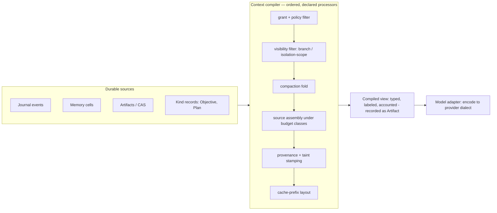
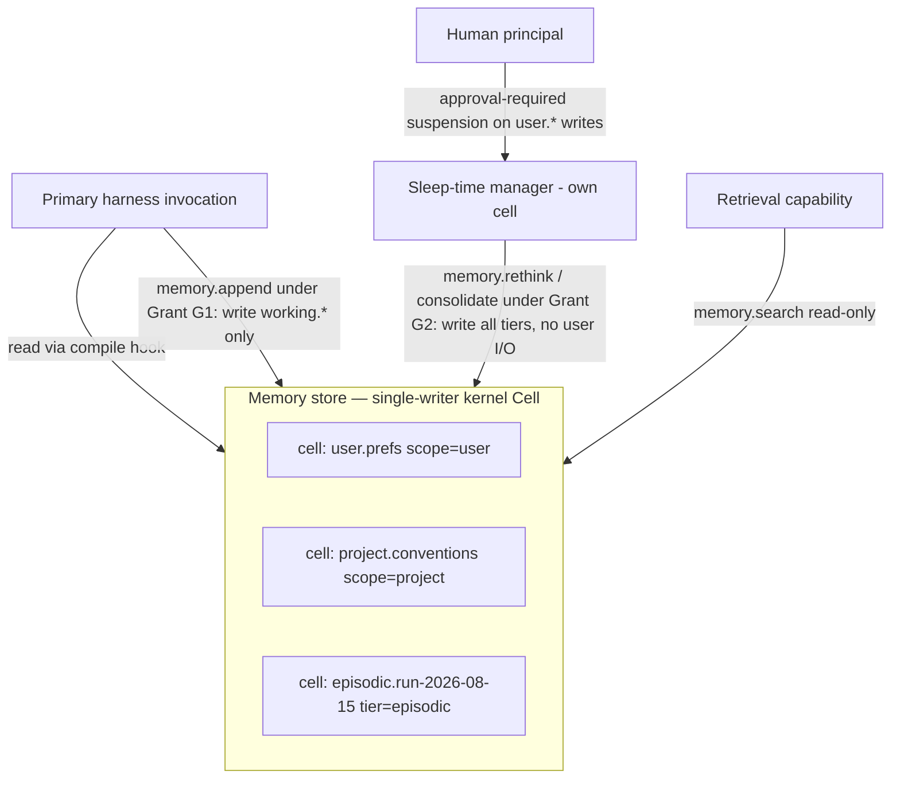

# 09 — Context and Memory

Status: DECIDED (pre-adversarial-review). Derived from `research/DESIGN-SPINE.md` §5; claim
labels per `research/METHODOLOGY.md`. Everything not carrying an explicit evidence label is
OUR PROPOSAL. Sibling references: doc 04 (Orchestration Models) for strategies that consume
compiled context, doc 05 (Kernel Primitives) for the nine kernel objects used throughout, doc
06 (Capability Spec) for manifests/negotiation, doc 07 (Runtime Architecture) for where the
components live, doc 08 for failure semantics, doc 10 for verification gates.

Vocabulary is spine §2 and is load-bearing in this document: the **context-management
system** is the deterministic *context compiler*; the **memory system** is durable labeled
state; a **harness** configures the compiler but does not own the mechanism; a model call is
an **Invocation** of a model-adapter **Binding**; the append-only truth plane is the
**journal** of **Events**; payloads live in **Artifacts**.

---

## PART A — Context: the deterministically compiled per-invocation view

### A.1 Context ≠ Memory is a hard architectural split

The single most consequential decision in this document: **context is a value, memory is
state.** Context is the per-invocation view compiled deterministically from durable sources
under a token budget; it is derived, disposable, and regenerable. Memory is the durable,
labeled, quota'd state the compile reads from; it is the thing that persists. No component in
the Kyxo runtime may treat the compiled view as a store, and none may treat memory as
something that "is" the prompt.

```
Evidence      — Letta renders in-context memory via a deterministic compile function:
                Memory.compile() turns a list of Block(label, value, limit) objects into the
                prompt, wrapping each block in tags with current/limit character counts, with
                the rendering strategy versioned per agent type; a ContextWindowOverview
                schema gives full token accounting of the compiled window
                (SOURCE-CODE OBSERVATION/HIGH,
                research/notes/agent-frameworks-crewai-pydantic-llamaindex-mastra-letta.md).
                smolagents recomputes context from a typed step log on every turn via
                write_memory_to_messages() rather than keeping a rolling transcript
                (SOURCE-CODE OBSERVATION/HIGH, same note). Letta Code persists the agent
                ("memory, identity, and conversation history") in cloud state while "the
                execution harness runs on various machines" (FACT, same note) — the
                durable-state/derived-view split is what makes the harness interchangeable.
Interpretation— When durable state is addressable and context is a pure function over it,
                "the agent" reduces to state plus policies, and any harness — or any model
                behind any provider — can execute the next step. The systems that conflate
                the two (caller-owned message arrays as the only state, which is every
                OpenAI-dialect framework's default) cannot swap the executor without losing
                the agent.
Implication   — Kyxo makes the split structural: memory lives in cells and artifacts
                (Part B); context is compiled per Invocation by an inspectable pipeline
                (A.2) and recorded as a derived Artifact. Provider replacement (B.6) is the
                acceptance test: anything that would be lost when the model or provider is
                swapped must live in memory or the journal, never only in a compiled view or
                in provider-side session state.
Confidence    — HIGH.
```

A corollary that recurs below: the conversation transcript is *not* memory either — it is
one journal projection among several that the compiler folds into the view. ADK demonstrates
this at scale: session history, state, checkpoints, and compaction records all fold from one
append-only event log, and the message history handed to the model is a *filtered query* over
that log (SOURCE-CODE OBSERVATION/HIGH, research/notes/google-adk.md).

### A.2 The context compiler: an ordered, inspectable processor pipeline

Three unrelated production systems independently converged on the same shape for context
construction — an ordered pipeline of processors executed per model invocation:

- ADK's `BaseLlmFlow` runs a fixed, ordered list of request processors: `basic` → auth →
  confirmation → `instructions` → `identity` → `compaction` (deliberately before `contents`
  "so compacted events are reflected") → interactions → `contents` (message history built
  from the event log, applying branch/isolation filters) → context-cache → planning → code
  execution → output schema (SOURCE-CODE OBSERVATION/HIGH, research/notes/google-adk.md).
- Microsoft Agent Framework runs `ContextProvider`s per invocation over a `SessionContext`;
  each provider can inject messages, instructions, tools, and middleware, and **every
  injected message carries an `attribution` marker** (`source_id`, `source_type`,
  `origin_session_ids`) "for governance, audit, or behavioral-analysis purposes"; compaction
  is itself a provider in the same slot (SOURCE-CODE OBSERVATION/HIGH,
  research/notes/microsoft-autogen-sk-agent-framework.md).
- Claude Code assembles: system prompt preset → CLAUDE.md chain (managed-policy → user →
  project → local, concatenated root-down, delivered as a user message *after* the system
  prompt) → path-scoped `.claude/rules` (lazy-loaded on file match) → auto-memory index
  (first 200 lines / 25KB of MEMORY.md) → skill *descriptions* (bodies on invocation) → tool
  schemas (MCP schemas deferred via tool search) → accumulating conversation (FACT,
  research/notes/anthropic-claude-code-agent-sdk.md).

INFERENCE (HIGH): the ordered per-invocation pipeline is the proven shape; the differences
between the three are which stages exist and whether the pipeline is inspectable. Claude
Code's is the richest worked example and the least inspectable (closed binary; assembly order
observable, not declared); Letta is the only surveyed system that exposes token-level
accounting of the result.

**The Kyxo compiler contract** (OUR PROPOSAL — this is the definition of the
context-management system for the whole runtime):

1. **Deterministic.** `compile(journal position, memory-cell versions, pipeline config hash,
   binding manifest, budget) → compiled view`. Pure function of durable inputs. Same inputs,
   same view — this is what makes fork-from-checkpoint (spine §7) and pipeline A/B testing
   possible.
2. **Pipeline-as-data.** The processor list is a declared, versioned artifact (registered as
   a Kind), diffable and inspectable before any invocation runs — not hard-coded per flow
   class (ADK's pipeline is proven but hard-coded per flow subclass; we make the order
   itself configuration).
3. **Budget-enforcing.** Every source class carries a budget class (A.4); the compiler emits
   a per-compile accounting record (the Letta `ContextWindowOverview` precedent) so "what is
   eating the window" is a queryable fact, not archaeology.
4. **Provenance-preserving.** Every span in the compiled view is labeled: source class,
   producing capability, cell/artifact version, integrity/confidentiality taint, freshness
   timestamp. Labels survive *into* the view (MAF attribution and FIDES labels are the
   precedents; spine Artifact labels are the mechanism).
5. **Visibility-filtering.** Branch and isolation-scope filters run inside the compile
   (A.6), so delegation isolation is a query, not a separate store.
6. **Adapter-terminated.** The compiler emits a *typed* view (content blocks, tool
   declarations, carry-through slots); the model adapter encodes it to the wire. Rendering
   to tokens is model-shipped code — Jinja/Go chat templates prove the encode step belongs
   to the adapter, not the compiler (FACT for the two incompatible template languages,
   research/notes/open-model-infrastructure.md). The compiler must never emit
   provider-dialect message arrays.

The compiled view (or, for economy, its hash plus the compile manifest) is recorded on the
Invocation. This is the record-and-inject journaling posture of spine H5 applied to context:
we can answer "what exactly did the model see" for any past invocation — a capability absent
from every surveyed system except partially Letta's context-window inspector.

Where it lives (cross-ref doc 07): the compiler is **standard library, not kernel**. It
passes Liedtke's test in the negative — competing compilers are not only tolerable but
required (retrieval variety, A.6/B.4). The kernel's involvement is exactly: Events (sources),
Artifacts (views and payload references), Grants (what the compile may read), and the policy
pipeline (label enforcement when the view crosses a trust boundary at the model-adapter
invocation).



### A.3 Source classes

The compiler draws from a closed, extensible list of source classes. Each class declares: a
**provider** (the capability that materializes it), a **freshness policy**, **provenance
labels**, and a **budget class** (defined in A.4). The mission's full list, mapped:

| Source class | Content | Provider (capability) | Freshness policy | Budget class | Evidence precedent |
|---|---|---|---|---|---|
| **working** | current-task scratch: todos, mode, focus | working-tier memory cells | recomputed every compile | pinned | Letta core blocks pinned in prompt (SCO/HIGH); MAF `TodoProvider`/`AgentModeProvider` (SCO/HIGH) |
| **conversation** | turn history of this cell | journal fold | exact at journal position | elastic (primary compaction target) | universal; ADK `contents` processor (SCO/HIGH) |
| **execution** | run status: pending invocations, background children, budget remaining | kernel introspection (scheduler/cell) | per-compile | pinned (small) | background-subagent status surfacing (FACT, anthropic note); MAF `BackgroundAgentsProvider` (SCO/HIGH) |
| **task** | Objective, Plan, acceptance criteria | Kind records | event-updated | pinned | Roo plans-as-todo-data (SCO/HIGH, coding-agents note); Plan artifacts (spine §3.9) |
| **project** | project conventions/instructions | procedural cells scoped `project` | event-invalidated (file-change events) | resident | CLAUDE.md project tier; GEMINI.md/AGENTS.md hierarchies (FACT, both notes) |
| **org** | org policy, required standards | org-scoped cells / managed config | admin-versioned | resident, non-evictable floor | managed-policy CLAUDE.md tier (FACT); Cursor admin-*required* Team Rules (FACT, cursor.md) |
| **user** | user preferences, identity-scoped facts | user-scoped cells | as-written; writes approval-gated | resident (small) | Cursor memories with user approval (FACT); ADK `user:` state prefix (SCO/HIGH) |
| **repository** | code/workspace structure | retrieval capabilities (B.4) | TTL / index-sync | elastic + on-demand | Aider PageRank map under `--map-tokens` (FACT+SCO/HIGH); Cursor Merkle ~10-min re-sync (FACT, indirect) |
| **retrieved** | query-driven fetches (RAG, web, docs) | retrieval capabilities | timestamped at fetch | elastic | Continue 4-index + reranker (SCO/HIGH); web tools |
| **episodic** | prior runs/sessions, summaries | episodic cells + journal search | as-written, decays | on-demand | Letta `conversation_search` over full history (SCO/HIGH); Cursor @Past Chats (FACT) |
| **semantic** | durable facts/knowledge | semantic cells, archival search | as-written, confidence-decayed | on-demand / elastic | Letta archival memory (FACT/HIGH); Mastra semantic recall (FACT) |
| **procedural** | skills, rules, how-tos | skill registry | version-pinned | descriptions: resident metadata; bodies: elastic with re-attachment budget | skills progressive disclosure (FACT); MAF `SkillsProvider` (SCO/HIGH); ADK `SkillToolset` (FACT) |
| **tool-state** | tool declarations, per-model dialect skins, learned tool preferences | capability manifests via the Binding | bind-time; deferred load | on-demand | deferred MCP schemas via tool search (FACT); Copilot virtual-tool grouping (SCO/HIGH); `EditToolLearningService` (SCO/HIGH) |
| **environment** | cwd, OS, sandbox profile, environment spec | execution-environment capability introspection | per-compile + event-invalidated (`CwdChanged` etc.) | pinned (small) | Claude Code env events (FACT); Cursor `environment.json` (FACT) |
| **artifact state** | outputs produced so far: versions, diffs, references | artifact service / CAS | exact versions | elastic — references preferred over payloads | ADK `artifact_delta` (SCO/HIGH); Claude Code 25k-token tool results spilled to file and replaced with a path (FACT) |

Two structural notes. First, the 25k spill-to-file behavior is the load-bearing precedent for
**reference-passing into context**: large payloads enter the view as Artifact references the
model can dereference through a tool, not as inlined bytes — the same zero-copy discipline
the kernel applies to Events (spine §3.5). Second, `tool-state` deserves its unusual
membership: tool *schemas* are context too, and both Copilot's virtual tools (clustering
tools under synthetic group-tools the model expands on demand, SCO/HIGH,
research/notes/coding-agents-landscape.md) and Claude Code's deferred MCP schemas prove that
the same budget economics govern them.

### A.4 Token budgeting

**Budget classes.** Every source class is assigned one of five classes; the compiler enforces
them and the accounting record reports them:

| Class | Semantics | Compaction survival |
|---|---|---|
| `pinned` | always present, recomputed each compile; small by obligation | survives by reconstruction |
| `resident` | stable across turns; re-injected after compaction by declared policy | survives by re-injection |
| `elastic` | competes for remaining budget; evictable, compactable | executor's discretion under policy |
| `on-demand` | zero cost until invoked; only metadata resident | body dies; metadata persists |
| `transient` | single-invocation lifetime (one tool result, one probe) | never survives |

The per-source budgets are not kernel state; they are compiler-pipeline configuration owned
by the harness. But the *total* is a Grant: the token budget of the cell's grant bounds the
sum, and the kernel decrements at commit (spine §3.7). A harness cannot configure its way
past its grant.

**Progressive disclosure is the proven economy — the highest-leverage mechanism observed.**

```
Evidence      — Skill descriptions load at session start; bodies load on invocation and
                persist; `disable-model-invocation: true` keeps even the description out of
                context (FACT, research/notes/anthropic-claude-code-agent-sdk.md). MCP tool
                schemas are deferred by default and loaded on demand via tool search (FACT,
                same note). Copilot groups overflowing toolsets under synthetic virtual
                tools expanded on demand (SOURCE-CODE OBSERVATION/HIGH,
                research/notes/coding-agents-landscape.md). Cursor's Agent-Requested rules
                load on model decision from a description (FACT, research/notes/cursor.md).
                MAF reimplemented Anthropic-style progressive-disclosure skills wholesale
                (SOURCE-CODE OBSERVATION/HIGH, microsoft note); ADK adopted the Agent
                Skills spec with incremental context loading (FACT, google-adk.md);
                PydanticAI capabilities "can be always-on or loaded on-demand by the model
                itself" (FACT, agent-frameworks note).
Interpretation— Six independent vendors converged on the same economics: capability
                *metadata* and capability *payload* are different objects with different
                lifecycles, and the model itself is the demand signal for loading payloads.
Implication   — Kyxo addresses descriptions and bodies as distinct Artifacts with
                independent budget classes (resident metadata vs elastic body). This falls
                out of the capability contract for free: a manifest (doc 06) *is* the
                description tier, and `on-demand` is the default budget class for every
                capability's payload. The compiler never inlines what a reference plus a
                loader tool can defer.
Confidence    — HIGH.
```

**Stable-prefix obligations: the caching contract constrains the compiler.** This is the
clearest cross-layer constraint in the whole architecture, and the reason budget layout
cannot be an afterthought:

- Anthropic's caching is explicit: `cache_control` breakpoints (max 4), prefix-hash
  semantics, per-model minimum prefix lengths, mandated ordering `tools → system → messages`
  — the harness must maintain prompt-assembly discipline or silently forfeit ~10× read
  discounts (FACT, research/notes/open-model-infrastructure.md).
- OpenAI's is automatic by prefix (≥1024 tokens) with a routing hint; Gemini's explicit
  `cachedContents` are *server-side resources* with TTL and storage billing; open engines
  (RadixAttention, vLLM prefix caching) cache implicitly with no wire contract at all (FACT,
  same note — four incompatible contracts for one optimization).
- Claude Code's workflow runtime staggers identical-prefix fan-outs by 5 seconds
  specifically to exploit prompt caching (FACT, anthropic note). OpenAI's own cookbook
  reports cache utilization rising 40%→80% when reasoning items are correctly carried
  (FACT, open-models note).

INFERENCE (HIGH): the compiler's final stage must therefore be **cache-prefix layout**,
parameterized by the Binding's negotiated caching axis: stable spans (org/project/procedural,
tool declarations) sort ahead of volatile spans (conversation tail, working state);
breakpoints are placed per the provider's contract; and on providers with resource-shaped
caches, the cache object is a leased provider-side resource tracked like any other remote
state (B.6). A compiler that ignores the caching axis is not merely slower — it changes the
cost model of every strategy running above it, which is why the caching contract is a
negotiated capability axis (doc 06) and not a harness implementation detail.

### A.5 Compaction: an event with pluggable executors

Compaction is where "context is a value" earns its keep. In Kyxo, compaction is a **journal
Event recording that a fold happened** — executor identity, input range, summary artifact
references, drop set, policy version — and future compiles fold that record. ADK already
works exactly this way: compaction results are stored as events in the log and honored by the
`contents` processor (SOURCE-CODE OBSERVATION/HIGH, research/notes/google-adk.md).

The executor is a capability, and must be, because the ecosystem ships at least three
incompatible executor families *and the boundary is actively moving*:

```
Evidence      — (1) Client-side two-stage: Claude Code "clears older tool outputs first,
                then summarizes the conversation if needed" (FACT) — microcompaction then
                summarization. (2) Strategy libraries: MAF ships TruncationStrategy,
                SlidingWindow, SelectiveToolCallCompaction, ToolResultCompaction,
                Summarization, TokenBudgetComposed as pluggable CompactionProvider
                strategies (SOURCE-CODE OBSERVATION/HIGH); Roo, OpenCode, Gemini CLI each
                run their own LLM condensers (SCO/FACT, coding-agents note). (3)
                Provider-side: Anthropic's context-editing beta prunes tool results and
                thinking server-side (`clear_tool_uses_20250919`, `clear_thinking_20251015`)
                while "your client maintains the full unmodified history"; the
                `compact_20260112` beta has the API detect a threshold (default 150k),
                generate the summary, return a `compaction` content block, and on subsequent
                requests "automatically drop all content blocks prior to the compaction
                block" — documented as "the recommended strategy" for long-running
                conversations (FACT, research/notes/anthropic-claude-code-agent-sdk.md).
Interpretation— Compaction, historically the harness's flagship job, is migrating into the
                provider API. Any runtime that hard-codes client-side compaction will fight
                its own providers within a year; any that hard-codes provider-side will
                strand open models, which have no such service.
Implication   — The kernel defines only the event (compaction happened, with this record)
                and the trigger policy hook; executors — clear-tool-outputs, summarize,
                provider-side — are negotiated capabilities. When the provider compacts, the
                executor is a *remote* capability and its summary block is mirrored into the
                journal like any provider-side state (B.6); the journal remains the truth
                plane either way.
Confidence    — HIGH.
```

**Trigger policy** is pluggable too: watermarks (provider default 150k; ADK's
`compaction_interval`/`token_threshold`, SCO/HIGH), and pathology guards — Claude Code's
thrashing detector stops auto-compaction with an error if the window refills immediately
(FACT); in Kyxo that terminal outcome maps to the `budget-exceeded` interrupted class of the
invocation algebra (spine §3.3, doc 08).

**What survives compaction is policy, not executor behavior.** The precedents are precise:
after compaction, Claude Code re-reads and re-injects CLAUDE.md, but nested CLAUDE.md files
and path-scoped rules are *not* re-injected until re-triggered; invoked skills survive under
an explicit budget — most-recent invocation of each skill re-attached, first 5,000 tokens
each, 25,000-token shared budget (all FACT, anthropic note). This is exactly a per-source
survivor policy, and Kyxo makes it declarative via the budget classes of A.4: `pinned`
reconstructs, `resident` re-injects per its declared policy, `elastic` competes, `transient`
dies. Steering the summary itself (Claude Code's intent-matched "summary instructions"
section — FACT) is an executor input, carried in the compaction policy.

Two interactions worth stating as decisions:

- **Compaction vs caching.** Compaction invalidates cached prefixes; the context-editing
  docs document the tradeoff explicitly (FACT). The compiler's trigger policy should
  therefore be cache-aware — prefer compacting at cache-TTL boundaries and re-laying the
  prefix in the same pass (OUR PROPOSAL; no surveyed system does this; cost of ignoring it
  is silent cache-write churn).
- **Compaction vs verification.** Compaction is lossy by design. Evidence artifacts awaiting
  a commit gate (doc 10) must be referenced from Kind records or memory cells — never only
  from conversation spans — or a compaction can destroy the evidence a gate needs. The
  compiler enforces this by refusing `transient`/`elastic` classification for spans labeled
  as pending Evidence.

```mermaid
sequenceDiagram
  participant H as Harness (in its cell)
  participant K as Kernel (journal + policy pipeline)
  participant X as Compaction executor (bound capability)
  H->>K: context.pressure event (watermark crossed)
  K->>K: policy selects executor binding (client / provider-side)
  K->>X: invoke compact(range, survivor policy, steering)
  X-->>K: compaction record: summary artifact refs + drop set
  K->>K: append compaction Event (truth plane)
  Note over H,K: next compile folds the record; pinned reconstructs, resident re-injects, transient is gone
```

### A.6 Isolation, sharing, poisoning, freshness — and the retrieval-vs-window axis

**Isolation is a compile-time filter over labeled events, not separate stores.** ADK stamps
every event with a `branch` (hierarchical dot-path: parallel peers don't see each other's
history) and an `isolation_scope` (task delegation: a delegated task sees only its own
events), and the `contents` processor filters by both when building the view
(SOURCE-CODE OBSERVATION/HIGH, research/notes/google-adk.md). Claude Code reaches the same
end state by construction — a subagent gets a fresh session with only the Agent-tool prompt
and project instructions, never parent history, while forks explicitly *do* inherit (FACT,
anthropic note); Roo requires delegation instructions to be self-contained for the same
reason (SCO/HIGH, coding-agents note). INFERENCE (HIGH): visibility labels on events, filtered
at compile time, subsume both designs — fresh-context delegation is "compile with a scope
that matches nothing of the parent's," fork is "compile with the parent's scope," and
selective sharing is any label predicate in between. Kyxo adopts the ADK mechanism with the
spine's typed-event correction: visibility labels are typed fields of the Event envelope, and
the delegation system (doc 04) sets them from the attenuated Grant, so what a child *can see*
is derived from what it was *granted*, one mechanism instead of two.

**Context poisoning: structural labels, not text scanning.**

```
Evidence      — Claude Code v2.1.210+ scans subagent final messages for instruction-shaped
                patterns before the parent reads them: neutralizing imitation
                <system-reminder> tags, flagging permission-config mentions, escaping
                Human:/Assistant: turn markers (FACT, anthropic note). Copilot's cloud agent
                filters hidden characters out of user input (FACT, coding-agents note). MAF
                productizes FIDES: TRUSTED/UNTRUSTED integrity and
                PUBLIC/PRIVATE/USER_IDENTITY confidentiality labels attached to content,
                propagated by middleware; untrusted content is automatically hidden behind
                variable indirection (var_xxx) so the planner model never reads it;
                `quarantined_llm` runs an isolated call over labeled data; policy blocks
                tool calls that would exfiltrate above `max_allowed_confidentiality`;
                MCP results carry `_meta.ifc` labels (SOURCE-CODE OBSERVATION/HIGH,
                research/notes/microsoft-autogen-sk-agent-framework.md).
Interpretation— Text scanning at trust boundaries is the retrofit; label propagation with
                deterministic enforcement at the tool boundary is the structural version of
                the same defense. Both exist in production, which proves the need; only one
                generalizes.
Implication   — Kyxo compiled views carry taint per span (A.2 contract #4), inherited
                structurally from source Artifacts/Events (spine §3.5). Enforcement points:
                (1) compile time — a processor may lower, never raise, a span's integrity;
                (2) invocation time — the policy pipeline evaluates the view's label vector
                when it crosses to a provider (confidentiality egress) and when tool calls
                are proposed from a view containing untrusted spans (FIDES-style deny);
                (3) quarantine as a pattern — a separate Invocation, under a Binding whose
                structured-output tier can enforce the response schema, is the sanctioned
                way to *read* untrusted content; its output re-enters labeled. Pattern
                scanning survives only as one optional deny-class policy stage, not as the
                defense.
Confidence    — HIGH for the mechanism's necessity; MEDIUM that label granularity at span
                level (vs message level) carries acceptable overhead — flagged for the
                prototype (task 4).
```

Note the memory consequence, developed in B.1: labels must persist *into memory cells*,
because memory is the cross-session poisoning vector — an untrusted fact written today is an
injected instruction next week if the label is dropped at the write.

**Freshness.** Each source class declares a freshness policy (A.3): recomputed-per-compile,
event-invalidated (the file/config-change event classes Claude Code already emits — FACT),
TTL'd (index sync; Cursor's ~10-minute Merkle re-sync is the canonical staleness window —
FACT, indirect), or executed-at-compile (Claude Code skills' `` !`command` `` dynamic
injection runs *before* the model sees the content — FACT). The compiler stamps every span
with its freshness time; policy can require re-materialization of spans older than a bound
for designated classes (e.g., repository state before an edit-heavy strategy). Provider-held
conversation state (Gemini Interactions API "the service retains prior state" — SCO/HIGH,
google-adk.md) is a freshness hazard by construction: the journal mirror, not the provider's
copy, is authoritative, and divergence is detected by comparing at checkpoint (B.6).

**Large-context vs retrieval is a routing-visible axis, not a doctrine.** Context windows
span roughly 8K to 1M+ across production targets, with window size a *deployment knob* on
local engines (FACT, open-models note). Whether to stuff the window or retrieve into it is
therefore an economic decision per (model × harness) pair: Cursor reports semantic search
improving agent accuracy for essentially every model in its harness (FACT, ~12.5% figure
MEDIUM, cursor.md), while five of eight coding agents ship no index at all and rely on
agentic grep (SCO/FACT, coding-agents note), and Anthropic's doctrine explicitly prefers
compaction + note-taking + subagents over retrieval infrastructure (MEDIUM, indirect,
anthropic note). Kyxo refuses to adjudicate: window size, caching contract, and per-token
cost are axes in the model adapter's manifest; retrieval providers are capabilities with
outcome telemetry (B.4); and routing (doc 06, spine C3) selects the mix. The design
obligation here is only that *both inputs be visible to the router* — which the manifest
grammar and capability telemetry already guarantee.

---

## PART B — Memory: durable labeled state

### B.1 Memory cells

A **memory cell** is the unit of durable memory: a labeled, quota'd, versioned record.
Terminology note, to keep spine §2 clean: a memory cell is *not* the kernel Cell. Memory
cells are records of a registered Kind (`memory.block/v1` — spine §3.9 lists "Memory block"
as a canonical Kind); their write path is serialized through a single-writer kernel Cell (the
memory store's execution scope), which is how the kernel's consistency guarantee applies to
them without adding a kernel object. Large values live in the CAS and are referenced;
metadata lives in the record.

Proposed schema (OUR PROPOSAL; evidence anchors noted per field):

| Field | Content | Precedent |
|---|---|---|
| `label` | addressable name, e.g. `user.prefs.editor` | Letta `Block(label, …)` (SCO/HIGH) |
| `tier`, `scope` | content-kind tag + sharing scope (B.2) | ADK `app:`/`user:`/`temp:` prefixes (SCO/HIGH); Mastra resource/thread scoping (FACT) |
| `value` \| `artifact_ref` | inline small value or CAS reference | two-tier store, spine H5 |
| `quota` | size limit enforced at write and compile | `Block.limit` char capacity (SCO/HIGH); Claude Code auto-memory 200-line/25KB gate (FACT) |
| `provenance` | producing invocation, source class, origin session(s) | MAF `origin_session_ids` attribution (SCO/HIGH) |
| `integrity`, `confidentiality` | taint labels, persisted (A.6, B.5) | FIDES label vocabulary (SCO/HIGH) |
| `confidence` | writer-asserted, telemetry-adjustable | OUR PROPOSAL (no direct precedent; spine C3 telemetry analog) |
| `decay` | review-by / half-life policy reference | OUR PROPOSAL (LOW evidence; see open issues) |
| `invalidation` | event patterns that stale this cell | file/config-change event classes (FACT, anthropic note) |
| `contradicts` | links to conflicting cells, unresolved by default | Letta `memory_rethink` as the manual repair verb (SCO/HIGH) |
| `version` | monotonic; every write is a journal Event; history in CAS | Letta Code MemFS "tracked via git" (FACT) |

Honesty about the evidence base: labels, quotas, sharing, versioning, and provenance are all
directly evidenced. **Confidence, time-decay, and contradiction metadata are proposal-only**
— no surveyed system ships them; the closest artifacts are Letta's `memory_rethink` ("large
sweeping changes") as a manual contradiction-repair tool and Cursor's approval gate as a
human confidence filter. We include them as *reserved schema fields plus userland
controllers* (a contradiction-checking controller watching the Kind's watch stream), not as
kernel semantics — the Kind mechanism exists precisely so this can evolve without kernel
change.

Shareability is evidenced and essential: Letta memory blocks are shared between agents with
consistent real-time views, and the sleep-time architecture depends on it (FACT/HIGH +
SCO, agent-frameworks note). In Kyxo, sharing is a Grant over the cell's label pattern —
read, write, or both — attenuable on delegation like everything else.

### B.2 Tiers are policy over cells, not kernel types

The mission names nine tiers: working / episodic / semantic / procedural / artifact / user /
project / org / execution. The evidence says two things about them. First, every system's
tiering is different: Letta's core/recall/archival, Mastra's working/semantic-recall/
observational, CrewAI's STM/LTM/entity plus flow memory, Claude Code's CLAUDE.md tiers plus
auto memory (all FACT/SCO across the notes) — tier taxonomies are product opinions. Second,
the mission's own list conflates two axes: *content kind* (working, episodic, semantic,
procedural, artifact, execution) and *sharing scope* (user, project, org) — ADK's state
prefixes and CLAUDE.md's four-level chain are scope mechanisms, not content mechanisms. We
therefore split them: cells carry both a `tier` tag and a `scope` tag (B.1), and a **tier is
a named policy bundle** binding a label pattern to: default quota, default budget class at
compile, retention class, decay policy, and write-principal rules.

This is also what the spine demands — "Memory tier policy" is on the explicit non-primitives
list (spine §3), and the ecosystem confirms the demotion: every framework that hard-coded a
tier taxonomy is unwinding it (Letta moving memory policy into swappable per-agent-type
compile functions — noted as the direction in
research/notes/agent-frameworks-crewai-pydantic-llamaindex-mastra-letta.md, INFERENCE/HIGH
there). The kernel stores cells and validates schemas; which tiers exist is a profile choice
(spine §9), and the default profile ships the nine-tier vocabulary above as configuration.

### B.3 Self-editing memory, and memory management as a reassignable principal

```
Evidence      — Letta's defining toolset is ordinary tool calls that edit memory:
                core_memory_append/replace, memory_replace/insert/rethink,
                archival_memory_insert/search, conversation_search — even send_message is a
                tool, making the action space uniform (SOURCE-CODE OBSERVATION/HIGH).
                Sleep-time agents: creating one agent actually creates two sharing memory
                blocks — the primary talks to the user but *lacks memory-editing tools*;
                those tools attach to a background sleep-time agent that reorganizes memory
                during idle periods (FACT/HIGH + SCO). Cursor evaluated both a
                main-loop `update_memory` tool and a sidecar observer model that proposes
                memories for *user approval*, chose the sidecar for user-control
                conservatism, and ships both paths (FACT + SCO/MEDIUM,
                research/notes/cursor.md). Mastra's observational memory runs background
                agents compressing history into "dense observations" (FACT). Claude Code's
                auto memory is harness-driven writes to a size-gated index (FACT).
Interpretation— Memory editing needs no special machinery — it is capability invocation.
                And *who* edits memory is a live design variable in production systems:
                the acting model, a background principal, a harness routine, or a
                human-approval loop — four assignments of the same authority.
Implication   — Kyxo ships memory operations as a standard capability profile
                (`memory.append/replace/rethink/search`) invoked under Grants. Everything
                composes from existing kernel objects: the policy pipeline interposes
                (Cursor-style approval is an approval-required suspension on the write
                invocation); budgets charge writes; the journal records every edit with
                provenance; taint propagates into the cell (B.1). Memory *management* — the
                consolidating, reorganizing principal — is an agent configuration in its own
                cell holding a Grant with memory-write rights the primary lacks: the
                sleep-time pattern falls out of Grant attenuation, requiring no new
                mechanism, and the assignment is revocable/reassignable at runtime.
Confidence    — HIGH.
```



### B.4 Retrieval is a set of interchangeable capability providers

The coding-agents landscape documents four genuinely different retrieval philosophies
coexisting in production (all evidenced in research/notes/coding-agents-landscape.md):

1. **Static analysis + graph ranking** — Aider's tree-sitter tags + personalized PageRank
   over a reference graph, selecting signatures under an explicit token budget
   (FACT + SCO/HIGH). No embeddings, no index server.
2. **Indexed hybrid retrieval** — Continue's content-addressed, branch-aware incremental
   index feeding four artifact indexes (code snippets, FTS5, chunks, embeddings) plus a
   reranker pipeline (SCO/HIGH).
3. **Model-driven retrieval** — Windsurf's Riptide LLM reranker, then SWE-grep: an
   RL-trained retrieval *subagent* limited to grep/read/glob, 8 parallel tool calls, ≤4
   turns (OBSERVED BEHAVIOR/MEDIUM — proprietary).
4. **Agentic search** — the loop itself greps, with dedicated read-only explore/research
   subagents as the refinement (OpenCode `explore`, Cline parallel research subagents —
   SCO/FACT).

Plus the split-trust variant: Cursor keeps embeddings + masked metadata server-side and
ground truth client-side, re-hydrating at query time (FACT, indirect; INFERENCE/MEDIUM on
rationale, research/notes/cursor.md).

INFERENCE (HIGH): these are interchangeable providers of one capability profile — call it
`context.retrieve(query, budget) → labeled spans` — differing in cost structure, freshness
characteristics, and infrastructure demands, not in contract. Two of the four are themselves
agents, which is decisive for placement: retrieval cannot be *in* the kernel or even in the
compiler proper, because a retrieval provider may itself be an orchestrated cell with its own
grant and budget. The compiler's `repository`/`retrieved`/`episodic`/`semantic` source
classes are backed by whichever retrieval bindings the harness holds; routing selects among
them using declared manifests plus outcome telemetry per capability×model pair (spine C3 —
Cursor's per-model gains and Windsurf's tokens/sec economics are exactly the telemetry a
router needs). Retrieval results enter the view as spans labeled with provider, freshness,
and taint (a web retrieval is UNTRUSTED by default; a repo-map span inherits the
repository's integrity).

### B.5 Privacy and retention: labels drive both

The label vector on cells and artifacts (integrity, confidentiality, scope) is also the
retention and redaction mechanism — one metadata system, three enforcement uses:

- **Egress control at compile/invocation time.** A cell labeled `confidentiality: PRIVATE`
  is never compiled into a view bound for a Binding whose target lacks the clearance — the
  FIDES `max_allowed_confidentiality` enforcement generalized from tool calls to model calls
  (SCO/HIGH for the precedent, microsoft note). Secrets go further: Claude Code's credential
  masking replaces secrets with per-session sentinels inside the sandbox and re-injects real
  values at the proxy (FACT, anthropic note) — the pattern Kyxo adopts is that true secrets
  are *never memory-cell content at all*; they live behind the elicitation form/URL split
  (spine §5) and enter only at protocol edges.
- **Retention windows per label class.** Retention is a tier-policy field (B.2):
  episodic cells might default to 90 days, org procedural cells to indefinite,
  `transient`-derived caches to days (OpenCode's 7-day snapshot prune is the modest
  ecosystem precedent — SCO/HIGH, coding-agents note). Expiry is a controller acting on the
  Kind's watch stream, journaled like any write.
- **Redaction that survives audit.** Because the journal holds references and payloads live
  in the CAS (two-tier store, spine H5), erasure is payload deletion plus a tombstone: the
  event spine — who did what, when, under which grant — remains intact and verifiable while
  the content is gone. Cursor's privacy mode (no plaintext code persisted server-side —
  FACT) shows the commercial demand; our two-tier design makes it a storage operation
  rather than a re-architecture.

OUR PROPOSAL, stated as a decision with its cost: privacy classification is *at write time,
by label*, not at export time by scanning. The cost is discipline — every write path must
label, and mislabeled data is mishandled data. The mitigation is the same as for taint:
labels default to the most restrictive plausible class (`untrusted`, scope-private) and are
loosened by policy, never silently.

### B.6 Provider replacement: what survives the swap

The acceptance test from A.1, now made operational. When the model or provider behind a
Binding is replaced:

| State | Survives? | Mechanism |
|---|---|---|
| Memory cells (all tiers) | **Yes** | provider-independent by construction (B.1) |
| Journal + checkpoints | **Yes** | kernel truth plane; checkpoints bind to definition identity, not provider (spine §3.8) |
| Artifacts / CAS | **Yes** | content-addressed, provider-agnostic |
| Compiled views | Regenerable | derived values; recompiled against the new Binding |
| Provider carry-through artifacts (reasoning items, thinking signatures, thought signatures, echo-required reasoning fields) | **No — by design** | typed opaque artifacts bound to (provider, model, position); dropped with a journal record on swap |
| Provider session state (Responses `store`/`previous_response_id`, Gemini Interactions, Foundry threads, `cachedContents`) | Only if mirrored | modeled as remote cells with mirrored artifacts/budgets/policy (spine §5); unmirrored provider state is defined as *lost* |
| Cache standing (prefix caches, cache resources) | No | economic state, rebuilt; the swap's cost spike is budgeted, not hidden |

The carry-through row is the sharpest, and it is why the category exists at all in the model
adapter contract (spine §2): Anthropic thinking blocks carry signatures that must be echoed
unchanged and are *silently dropped* when replayed onto a different model; Gemini enforces
thought signatures with hard 400s; DeepSeek 400s when OpenAI-compatible clients strip
`reasoning_content`; OpenAI's encrypted reasoning items must be round-tripped (FACT /
OBSERVED BEHAVIOR/HIGH, research/notes/open-model-infrastructure.md). These are all one
kernel requirement — an opaque, provenance-tagged channel the harness must not touch and the
runtime must know is non-portable. The cost of losing it is also measured: Cursor found
dropping reasoning traces cost ~30% performance for Codex-class models (FACT, cursor.md).
Provider replacement *forfeits* that channel; the design obligation is that the forfeiture be
explicit, journaled, and priced — never a silent strip that the next provider punishes with
a 400 or a quality cliff.

**Migration walkthrough** (the normative sequence; failure handling per doc 08):

1. **Checkpoint.** Cut the cell: journal position + state snapshot + pending invocations
   (spine §3.8). Cursor's `&` handoff — migrating a live local thread to a cloud agent by
   state transfer — is the commercial proof this class of migration works (FACT,
   research/notes/cursor.md); Letta's cloud-persisted agent executed by interchangeable
   local harnesses is the architectural proof (FACT, agent-frameworks note).
2. **Negotiate the new Binding.** Intersect the harness's required axes with the new
   target's manifest (doc 06). If a required axis is missing — say the harness depends on a
   reasoning-replay tier or a structured-output tier the new model lacks — **bind fails
   loudly now**, before any state is touched (spine §4; the silent-loss anti-pattern is the
   documented ecosystem failure).
3. **Journal the migration event.** Enumerate what is being forfeited: N carry-through
   artifacts invalidated, provider cache resources released, provider session mirrors
   frozen. This event is the audit boundary.
4. **Recompile.** The first invocation on the new Binding compiles purely from durable
   sources: memory cells, journal fold, Kind records. The pipeline re-lays the cache prefix
   for the new caching contract, re-renders tool declarations in the new dialect skin
   (capability dialects, spine H2), and re-derives budgets from the new window. Nothing is
   translated from the old provider's wire shapes — the view was never stored in them.
5. **Mark telemetry.** Outcome telemetry for the capability×model pair is segmented at the
   migration boundary so the new pair is not charged with transition costs (cold cache, lost
   reasoning continuity) when routing evaluates it later.

What makes this walkthrough short is the point of the whole document: steps 1–5 contain no
data migration because Parts A and B put nothing load-bearing where the provider could hold
it hostage. Everything of the agent that matters is cells, journal, artifacts — and context
is just the next compile.

---

## Open issues

Carried into the adversarial review; also surfaced in the summary block.

1. **"Memory cell" vs kernel Cell naming.** Resolved locally by convention (memory cells are
   Kind records serialized through a store Cell); the spine should ratify the terms before
   sibling docs drift.
2. **Confidence/decay/contradiction metadata is proposal-only** (B.1) — no ecosystem
   precedent. Reserved-fields-plus-controllers is the hedge; review should decide whether
   even that belongs in V1 schema.
3. **Span-level provenance overhead is unmeasured.** The compile contract stamps every span;
   if that proves too heavy, message-level granularity is the fallback and weakens FIDES-style
   enforcement.
4. **Compiled-view-as-recorded-artifact cost.** Recording every view (vs hash + manifest)
   may strain the H5 journal economy; the prototype must measure before the contract fixes
   the default.
5. **Provider-side compaction vs kernel policy.** `compact_20260112` generates the summary
   on provider infrastructure — outside survivor policy and taint enforcement. Mirroring
   semantics for provider-executed compaction need a decision (accept-and-label vs
   re-summarize-client-side for labeled ranges).
6. **Quarantine depends on structured-output tiers.** The quarantined-invocation pattern
   (A.6) is only as strong as the enforcing grammar; on tier-3/4 targets ("json mode"/none)
   the guarantee degrades. Negotiation must be able to express "minimum tier for quarantine
   duty" — check this is representable in doc 06's axis grammar.
