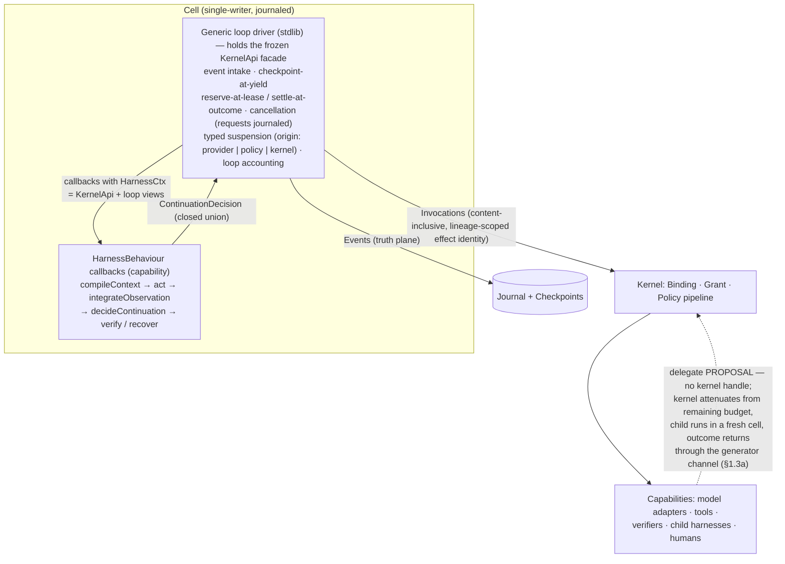
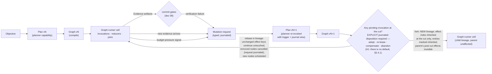

# 10 — Harness and Graph Runtime

> **Post-review status (2026-08-16, phase 2).** This document predates the adversarial review; the
> review's binding adjudications live in the Amendment log of `research/DESIGN-SPINE.md` (A1–A14),
> with the full findings in `research/ADVERSARIAL-REVIEW.md`. Since phase 2 the **executable
> semantics** in `prototypes/kernel-semantics/` — normative prose in `docs/17-KERNEL-SEMANTICS.md`
> and `docs/18-KERNEL-INVARIANTS.md` — supersede prose wherever the two disagree.
> **Applied here:** A1 (§5.2, §5.4, §5.4.1, §5.5, §6), A2 (§1.2, §2.3), A4 (§1.3, §1.3a, §1.4),
> A10 (§1.2, §2.4, §3.2, §3.4, §5.3, §5.4, §5.5, §7.2), A13 (§2.3, §4.2, §4.3, §5.2), with A3,
> A8, A11, A12 and A14 aligned incidentally where they touch this document's surfaces — see the
> Revision record at the foot of this document. **Outstanding:** none known.
> Where this document conflicts with the Amendment log or the executable semantics, **those
> govern**.


Status: DRAFT for adversarial review. Written from `research/DESIGN-SPINE.md` (binding) under
the claim-labeling discipline of `research/METHODOLOGY.md`. Everything not carrying an explicit
evidence label is OUR PROPOSAL. Covers mission Phases 11 (planner architecture), 13 (loop
runtime), 14 (graph runtime), 15 (harness contract). Sibling docs referenced by number are
being written concurrently from the same spine.

Vocabulary is spine §2 and is load-bearing throughout: a **harness** is a behaviour contract,
never "the runtime"; an **agent** is a configuration, never a type; a **graph/workflow** is a
declarative orchestration strategy artifact, never an engine; the **agent loop** is the
reactive strategy inside one harness turn cycle; the **planner** is a capability that emits
Plan artifacts.

---

## 1. The harness is a behaviour contract

### 1.1 The two poles of evidence

The industry has produced two extreme answers to "what is a harness, architecturally," and
they bound the design space.

**Pole A — harness as pure composition (Microsoft Agent Framework).**

- Evidence — SOURCE-CODE OBSERVATION (HIGH): MAF's `create_harness_agent()` assembles a
  Claude-Code-class harness entirely from existing extension slots: `AgentLoopMiddleware`
  (multi-pass loop with pluggable termination — todo predicates, background-task checks, an
  LLM judge returning a structured `JudgeVerdict`), `TodoProvider`, `AgentModeProvider`,
  `FileMemoryProvider`, `BackgroundAgentsProvider` (subagents as tools), and
  `ToolApprovalMiddleware` with a function-invocation budget. No new runtime concept was
  introduced; the harness is middleware plus context providers around an unchanged
  function-calling loop (research/notes/microsoft-autogen-sk-agent-framework.md).
- Interpretation — A Claude-Code-shaped harness requires zero kernel primitives beyond good
  interception and injection slots. "Harness" is provably a library-level composition.
- Implication — The harness must not be a kernel object. What the kernel must supply is the
  substrate the composition hangs on: interception points, an injection pipeline with
  provenance, budgets, and a journaled loop.
- Confidence — HIGH.

**Pole B — harness as opaque product (Claude Code).**

- Evidence — FACT + SOURCE-CODE OBSERVATION (HIGH): Anthropic's own docs name Claude Code
  "the agentic harness around Claude"; the Claude Agent SDK is a thin supervisor that spawns
  a closed-source CLI binary over NDJSON stdio — the loop, compaction prompts, and system
  prompt assembly are unobservable; the SDK contributes only the host-process surface (hooks,
  `canUseTool`, message stream) (research/notes/anthropic-claude-code-agent-sdk.md).
- Interpretation — A harness can be a sealed, versioned, invocable unit of value delivered
  behind a supervisor API. The cost is total loss of loop observability, policy interposition
  from outside is limited to sanctioned hook points, and the harness is welded to one model
  family.
- Implication — Kyxo adopts the *packaging* lesson of Pole B (a harness is a shippable,
  versioned, invocable artifact) and the *construction* lesson of Pole A (it is built from
  callbacks over a generic substrate, not a monolith), and rejects the opacity: the loop's
  interior is journal-visible by construction (§3.4).
- Confidence — HIGH.

Between the poles sits corroborating convergence: LangChain's own taxonomy separates
runtime (LangGraph) from harness (Deep Agents, Claude Agent SDK) as distinct layers (FACT,
research/notes/langgraph.md), and all eight competitive coding agents implement the harness
as a separable layer over swappable models (SOURCE-CODE OBSERVATION/HIGH,
research/notes/coding-agents-landscape.md).

### 1.2 The OTP-shaped split

OUR PROPOSAL. Kyxo structures the harness the way OTP structures `gen_server`: a generic,
battle-hardened driver owns the mechanics every loop needs; the specific behaviour supplies
callbacks. The split of responsibilities:

**Kernel/stdlib owns (generic loop mechanics — identical for every harness):**

| Mechanic | What it does | Evidence anchor |
|---|---|---|
| Event intake | Delivers user input, tool observations, external events, suspension resolutions into the cell as journal-ordered events | Codex SQ/EQ; ADK event loop (both notes) |
| Checkpoint-at-yield | Every callback return is a yield-is-commit point: effects in the returned decision are journaled atomically before the behaviour resumes | ADK's one contract that survived the 1.x→2.x rewrite intact (research/notes/google-adk.md, SOURCE-CODE OBSERVATION/HIGH) |
| Budget charging | Grant reserve-at-lease / settle-at-outcome (amendment A2), tree-wide; refusal-to-spawn and child-stop on exhaustion | Claude Code `maxBudgetUsd` tree enforcement pattern, retrofitted there, native here (research/notes/anthropic-claude-code-agent-sdk.md) |
| Cancellation | Propagated between callbacks at commit points; a behaviour never needs cancellation logic. The *request* is journaled when it is made, not only when it is honoured (amendment A10), so an operator interrupt racing a completion leaves a trace | Codex `Op::Interrupt`; LangGraph `request_drain()` |
| Typed suspension | `approval-required` / `input-required` / `auth-required` invocation states with typed payloads, persisted in checkpoints; every suspension record carries an `origin` discriminator — `provider` \| `policy` \| `kernel` — because the three resume differently (amendment A10) | MAF request-info ports stored inside checkpoints; OpenAI `NextStepInterruption` + RunState (both notes) |
| Loop accounting | Iteration counters, progress hashes, failure streaks — computed by the driver, handed to policy (§3) | Gemini CLI LoopDetectionService; Roo mistake counters (research/notes/coding-agents-landscape.md) |

**The harness supplies (callbacks — the judgment):** context compilation, action choice,
observation integration, continuation judgment, verification, recovery.

### 1.3 The callback interface

OUR PROPOSAL — the V1 TypeScript behaviour contract. Types referenced from doc
05-KERNEL-PRIMITIVES (kernel objects) and doc 06-CAPABILITY-SPEC (manifests, negotiation).

```typescript
/**
 * `HarnessCtx` is NOT a bespoke surface. It is a typed extension of `KernelApi`
 * — the Wave-0 frozen, versioned, conformance-tested facade (amendment A4; the
 * normative verb list is doc 06 §8a.1, restated in doc 05 §3.3 and doc 07) —
 * narrowed to one cell and one Grant handle and widened only by loop-specific
 * *views*, never by new verbs. There is no ambient authority. The behaviour
 * cannot reach around this surface: every effect is an Invocation, every
 * persisted fact a journal Event, every payload an Artifact reference.
 */
interface HarnessCtx extends KernelApi {
  // Inherited, unchanged, from the frozen facade: bind, invoke, resume (with the
  // re-grant option), cancel, attenuate, getGrant, charge, storeArtifact /
  // readArtifact, scoped journal read, checkpoint, createCell, listCapabilities,
  // the Kind verbs (registerKind / createKindObject / getKindObject / watch), and
  // the injected clock. Adding a verb is a protocol revision, not a minor release.

  readonly cell: CellRef;                       // single-writer scope this run occupies
  readonly objective: ArtifactRef<Objective>;   // the Kind instance being pursued
  readonly grant: GrantHandle;                  // unforgeable handle, not a string (A8):
                                                // getGrant() reports rights + remaining
                                                // state; the journal's grant reference is
                                                // a NON-resolvable identifier
  readonly bindings: BindingSet;                // sealed negotiation results, incl. the
                                                // model adapter binding, its per-property
                                                // guarantee grades (A3), and its
                                                // model-behavior profile (§2.4)
  readonly journal: JournalView;                // scoped read/query over this cell's lineage
  readonly policy: LoopPolicyView;              // the declarative controls of §3.2
  readonly now: () => LogicalTime;              // injected clock — a strategy that reads a
                                                // wall clock is one whose replay diverges

  /** The only effect verb. Async-first; returns a handle whose lifecycle is the
   *  kernel invocation state machine. Effect identity is content-inclusive and
   *  lineage-scoped (§5.2, amendment A1). */
  invoke(req: InvocationRequest): InvocationHandle;

  /** Append a typed harness event to the journal (ordered; committed atomically at
   *  the next yield-is-commit point). Metered usage settles against the invocation's
   *  reservation — reserve at lease, settle at outcome, release the remainder (A2). */
  emit(evt: HarnessEvent): void;

  /** Block on an external decision (human, guardian capability, parent cell).
   *  Checkpoints underneath; survives process death. The record carries an `origin`
   *  discriminator — provider | policy | kernel — and resume semantics differ per
   *  origin (A10); a kernel-origin (budget) suspension resumes with a re-grant. */
  suspend<T>(s: TypedSuspension<T>): Promise<T>;
}

/** A harness is a behaviour module implementing this contract. It ships with a
 *  capability manifest and is registered, negotiated, invoked, versioned, and
 *  benchmarked exactly like any other capability (§1.4). */
interface HarnessBehaviour<S> {
  readonly manifest: CapabilityManifest;        // axes: task classes, model-profile
                                                // requirements, tool-surface shape,
                                                // termination policies supported

  /** Establish initial behaviour state from the objective. Pure of effects. */
  init(ctx: HarnessCtx): Promise<S>;

  /** Deterministically compile the per-invocation view: instructions, memory
   *  cells, retrieved artifacts, tool schemas — under the token budget, with
   *  provenance labels surviving into the view (doc 09). */
  compileContext(ctx: HarnessCtx, state: S): Promise<CompiledContext>;

  /** One decision step: typically a model-adapter invocation followed by zero
   *  or more capability invocations. Returns intents, not raw effects — the
   *  driver journals and executes them. */
  act(ctx: HarnessCtx, state: S, view: CompiledContext): Promise<ActResult>;

  /** Fold one observation (tool result, verifier finding, child-cell result,
   *  suspension resolution) into behaviour state. */
  integrateObservation(ctx: HarnessCtx, state: S, obs: Observation): Promise<S>;

  /** Judgment: what happens next. The driver calls this after observations are
   *  integrated AND whenever a loop-policy signal fires; `signals` carries the
   *  driver's accounting (iteration count, progress hash delta, failure streak,
   *  budget fraction remaining, deadline proximity). */
  decideContinuation(
    ctx: HarnessCtx, state: S, signals: LoopSignals
  ): Promise<ContinuationDecision>;

  /** Optional: produce Evidence artifacts for a candidate outcome. Runs before
   *  the commit gate (doc 08); the gate itself is kernel policy, not harness. */
  verify?(ctx: HarnessCtx, state: S, candidate: ArtifactRef): Promise<EvidenceRef[]>;

  /** Optional: map a failure record to a recovery decision. Absent, the cell's
   *  supervision policy applies directly (doc 08 §7; normatively doc 17 §6 for
   *  effect-class triage and doc 19 for the crash matrix — NOT doc 13, which is
   *  the future-scenario test). */
  recover?(ctx: HarnessCtx, state: S, failure: FailureRecord): Promise<RecoveryDecision>;
}

/** Closed decision union — the control-flow vocabulary of every strategy. */
type ContinuationDecision =
  | { kind: "continue" }                                  // next iteration
  | { kind: "finalize"; output: ArtifactRef }             // subject to verify + commit gate
  | { kind: "delegate"; req: InvocationRequest;           // child cell under attenuated grant
      attenuation: AttenuationSpec }
  | { kind: "suspend"; suspension: TypedSuspension<unknown> }
  | { kind: "switch-strategy"; harness: CapabilityRequirement;  // §7 composition
      carry: ArtifactRef[] }
  | { kind: "escalate"; to: EscalationTarget; reason: string }  // model ladder or human
  | { kind: "rollback"; to: CheckpointRef }
  | { kind: "fail"; error: FailureRecord };
```

- Evidence — SOURCE-CODE OBSERVATION (HIGH): OpenAI's runner resolves every turn into a
  closed four-way union (`NextStepFinalOutput | NextStepHandoff | NextStepRunAgain |
  NextStepInterruption`); its note concludes the union is the real control-flow contract while
  the detection heuristics are hard-coded (research/notes/openai-agents-sdk-codex.md).
- Interpretation — The union is right; the hard-coding is the mistake. Kyxo keeps a closed
  decision vocabulary (so the driver, checkpoints, and journal projections stay total over
  it) and moves the *judgment that selects among decisions* into the behaviour callback plus
  declarative policy, extending the union with the observed variants OpenAI lacks
  (strategy switch, rollback, model escalation).
- Implication — Every orchestration strategy in this document — reactive loop, graph runner,
  generated-code runner, supervisor — implements this same interface. Composition (§7)
  follows from that uniformity, not from special mechanisms.
- Confidence — HIGH.

### 1.3a The facade is frozen — and delegation needs no handle at all

**Frozen, not merely documented (amendment A4).** `KernelApi` / `HarnessCtx` / `InvokeCtx` are
a Wave-0 frozen, versioned, conformance-tested contract *alongside* the wire schemas, not an
SDK convenience that can be widened when a strategy wants one more verb. Hence the shape of
§1.3: `HarnessCtx` is **defined as a typed extension of `KernelApi`**, so there is exactly one
verb list in the system and this document does not get to invent a second one. The price is
accepted deliberately — adding a verb after Wave 0 is a protocol revision with conformance
fixtures — and the benefit is that ADR-010's replaceability claim (swap the TypeScript kernel
for a Rust one with no userland change) stops being scoped to the execution record alone once
the facade fixtures exist.

**Delegation needs no kernel handle at all.** This is an executable finding, not a
restatement: the phase-1 design handed a composite capability a small `ctx.kernel` facade so it
could invoke children, on the reasoning that a *small* handle is a safe handle. The
kernel-semantics prototype removed the handle entirely
(`prototypes/kernel-semantics/src/types.ts`, `kernel.ts`). A capability receives `InvokeCtx`,
which is **data only** — ids, an injected clock value, the request, an optional resume payload,
a cancellation predicate — and *proposes* delegation:

```typescript
// Inside a capability: no kernel object is in scope. The generator channel is the
// entire interface to the kernel, in both directions.
const outcome: DelegationOutcome =
  yield { type: 'delegate', capabilityId: 'reviewer@2', request, step: 'review' };
```

The kernel resolves the proposal, mints the child's authority by **attenuating from the
parent's current remaining budget**, runs the child in a **fresh cell** (A10), and returns the
`DelegationOutcome` into the generator. Four consequences bind this document:

1. **A harness invoked as a capability holds nothing.** §1.4 makes harnesses capabilities;
   when one runs in that position its `{ kind: "delegate" }` continuation lowers to a delegate
   proposal. `AttenuationSpec` is therefore a *request*, and the kernel's attenuation is what
   binds — a capability cannot widen a grant by delegating (invariants I5, I18).
2. **The driver holds the facade; the behaviour does not hold the kernel.** The two halves of
   the facade are deliberately different shapes — verbs above the callback line (stdlib driver,
   `HarnessCtx`), data-in / proposals-out below it (capability, `InvokeCtx`). §3.4's claim that
   a harness cannot run an invisible inner loop rests on this asymmetry, not on good manners.
3. **Refused delegation is journaled, not silent.** An attenuation that cannot be satisfied, or
   a spawn-depth ceiling hit, commits `policy.denied` and returns a failed outcome (invariant
   I22). The prototype's first implementation computed the child budget from a *captured*
   parent state that predated the parent's own reservation, overshooting the true remaining;
   the correction — read authority fresh at every hop — is recorded as doc 20 F-3.
4. **`ActResult` and `ContinuationDecision` stay a closed union** precisely because they are
   lowered onto proposals: a decision vocabulary the kernel cannot enumerate is a decision
   vocabulary it cannot validate before commit.

*(Retained for the record: the phase-1 "small handle" reasoning was ocap-correct about
authority and wrong about the commit barrier — any callable handle makes the barrier
cooperative rather than structural. Doc 06 §8 change #9 carries the full autopsy.)*

### 1.4 Harnesses are capabilities

OUR PROPOSAL, mandated by spine §2/§3. A `HarnessBehaviour` ships with a versioned manifest
and enters the same registry as tools and model adapters. Consequences, each doing real work:

1. **Invocable.** `runtime.run({objective})` resolves the default profile's harness by
   negotiation like any capability; a graph node can require a harness (§5); a harness can
   delegate to a different harness under an attenuated Grant — by *proposing* the delegation
   when it is itself running as a capability, never by holding a kernel handle (§1.3a).
2. **Versioned.** Harness identity is `name@semver + behaviour-hash`; events pin it
   (version-by-data, spine §7), so a journal entry always names exactly which harness logic
   produced it, and fork-from-checkpoint across harness versions is a first-class repair verb.
3. **Benchmarkable.** Because harness and model adapter are both manifest-bearing
   capabilities, `model × harness` matrices are a mechanical enumeration (§2.3) — the spine §9
   DX requirement.
4. **Negotiable.** A harness manifest declares which model-behavior profile axes it requires
   (e.g. "needs reasoning-trace carry-through", "needs parallel-tool-call safety"); binding a
   harness to a model adapter that lacks a required axis fails loudly at bind time (spine §4),
   instead of silently degrading in production.



---

## 2. The mission's harness questions, answered

### 2.1 Is the harness kernel-first-class? No.

Apply the spine §3 admission rule: a concept enters the kernel only if competing userland
implementations would prevent required functionality (security, accounting, recovery,
coordination). The harness fails the test decisively — competing userland implementations not
only could exist, they *dominate the evidence*: MAF's harness is middleware
(SOURCE-CODE OBSERVATION/HIGH), Deep Agents is a package over LangGraph (FACT), ADK's
`App`+`Runner` harness sits over a node/event substrate it does not own (SOURCE-CODE
OBSERVATION/HIGH), and eight coding agents each built their own without any shared runtime
(SOURCE-CODE OBSERVATION/HIGH). Security, accounting, recovery, and coordination are all
supplied *to* the harness by Grants, budgets, checkpoints, and cells — none is supplied *by*
it. The harness is a behaviour/strategy: spine §3's explicit non-primitive list stands.

What IS kernel-adjacent is the driver (§1.2): the generic loop mechanics live in the stdlib
against kernel objects, because checkpoint-at-yield and budget settlement must be
uniform across all harnesses or the accounting and recovery guarantees fracture. The line:
mechanics below the callback interface, judgment above it.

### 2.2 Do different harnesses run the same model? Yes — and pairs are the unit.

- Evidence — FACT (HIGH): GPT-5.1-Codex-Max runs under at least two production harnesses with
  materially different skins: OpenAI's shell-oriented Codex harness, and Cursor's harness
  after weeks of adaptation — tools renamed to shell-like equivalents matching the model's RL
  training distribution, reasoning traces preserved across turns (dropping them cost ~30%
  performance), message ordering rearranged (research/notes/cursor.md). FACT: Claude models
  run under Claude Code, MAF, Cursor, Aider, and OpenCode harnesses simultaneously.
  SOURCE-CODE OBSERVATION (HIGH): Aider binds edit format per model in its model catalog;
  Copilot's `EditToolLearningService` measures per-model edit-tool success and adapts the
  exposed toolset at runtime (research/notes/coding-agents-landscape.md). FACT: Cursor
  trained Composer *inside* the production harness with a shadow backend so tools behaved
  identically to production (research/notes/cursor.md).
- Interpretation — Spine C2, confirmed from three independent directions: harness quality is
  partially model coupling. The same logical harness carries per-model dialects; the same
  model behaves differently under different harnesses; and the frontier of integration is
  models trained into a specific harness. There is no universal harness, and there is no
  model-agnostic harness of competitive quality.
- Implication — Kyxo's unit of deployment, versioning, and measurement is the
  **harness×model pair**: `(harness@version, model-adapter@version, profile-overrides)` — a
  registered artifact with its own outcome-telemetry stream. The kernel and record format
  stay model-independent; pairs are model-specific, first-class, and unashamed (spine C2).
- Confidence — HIGH.

### 2.3 The benchmark design: matrix runs over one objective corpus

OUR PROPOSAL (executes the spine §9 requirement; scoped in detail by doc 37). The design
falls out of §1.4 with almost no new machinery:

1. **Enumeration.** Both factors are capabilities with manifests. The benchmark runner (itself
   an orchestration strategy in a cell) enumerates `harness × model-adapter` pairs, discarding
   pairs whose bind-time negotiation fails (a required profile axis missing). Declarations
   gate *eligibility* (spine C3) — an ineligible pair is a recorded fact, not a zero score.
   **Eligibility is not selection** (amendment A13): among eligible candidates, choosing is a
   routing strategy with the contract `rank(candidates, telemetry, policy) → choice +
   journaled rationale`. The benchmark runner pins `rank` to *enumerate-all* precisely so that
   measurement does not silently inherit the router's bias — which is the failure mode of
   measuring a fleet through its own production router.
2. **Corpus.** A versioned corpus of Objective artifacts (a Kind), each carrying acceptance
   criteria as required Evidence types (tests pass, artifact schema-valid, judge rubric ≥
   threshold). The corpus is content-addressed; a benchmark result cites corpus version,
   pair versions, and policy hash, or it is not comparable.
3. **Matrix runs.** Each cell of the matrix = one Objective run under an identical Grant
   slice (same token/money/wall-clock budget, same loop policy, same tool capability set).
   The one sanctioned per-pair variation is the model-behavior profile (§2.4): prompt
   patches, dialect choices, trace-carry settings. Rationale: Cursor's evidence shows
   un-adapted harnesses understate a model by large margins (FACT — the ~30% reasoning-trace
   figure), so "identical prompts" would measure adaptation debt, not capability. The profile
   applied is pinned in the run record.
4. **Paired metrics from the journal.** Every metric is a projection of the truth plane — no
   separate instrumentation. The Phase-37 metric set, all derivable from kernel objects:
   verified success rate (Evidence gates passed), cost-per-success (Grant **settlements**:
   tokens, USD — reserved at lease, settled at outcome, remainder released, amendment A2, so
   abandoned and failed attempts are counted rather than vanishing at the commit point),
   wall-clock and invocation latency distributions, iterations to termination,
   termination cause histogram (§3.3), stagnation and repeated-failure events, escalations
   (model-ladder and human), recovery success after injected faults (doc 13's scenario set),
   delegation depth/width, compiled-context sizes, and plan-mutation counts for graph
   strategies (§5.4).
5. **Telemetry feedback.** Results write into the pair's capability record as outcome
   telemetry, in the schema the selection contract consumes. Routing consumes it: telemetry is
   the `telemetry` argument of `rank(candidates, telemetry, policy)` (amendment A13), and the
   chosen candidate's **rationale is journaled** — a benchmark can therefore be replayed
   against the routing decisions it later informs. V1's default `rank` is deliberately dumb:
   declared preference order plus probe freshness. Telemetry-driven ranking is Wave-3 scope
   with its schema frozen now, so the feedback loop is wired before it is closed rather than
   retrofitted onto a shipped router. This closes the loop that Copilot's
   EditToolLearningService implements locally
   (SOURCE-CODE OBSERVATION/HIGH) — Kyxo makes the same measure-and-adapt cycle a substrate
   feature spanning all capabilities, not one hard-coded edit-tool service.

### 2.4 Model-behavior profiles live in the adapter manifest

- Evidence — FACT (HIGH): Anthropic documents that "Claude Opus 5 delegates to subagents more
  readily than earlier models," and Claude Code's system prompt carries a model-conditional
  line suppressing Agent-tool use on Opus 5 — the harness patches its prompt per model
  version to compensate for behavioral drift. FACT: loop termination in Claude Code is
  "response contains no tool calls," i.e. completion judgment lives in the model and the
  harness merely detects it; per-model tool-use system prompts differ in token count per
  model (research/notes/anthropic-claude-code-agent-sdk.md). SOURCE-CODE OBSERVATION (HIGH):
  Cline anchors termination on an explicit `submit_and_exit` tool call instead — a per-model
  choice about whether termination judgment can be trusted to silence
  (research/notes/coding-agents-landscape.md).
- Interpretation — Termination judgment, delegation eagerness, edit-dialect competence,
  reasoning-trace requirements, and effort semantics are *model-behavioral* facts that every
  serious harness ends up encoding somewhere — today as scattered prompt hacks and
  hard-coded conditionals inside closed loops.
- Implication — Kyxo reifies them as the **model-behavior profile**: a section of the model
  adapter's axis-typed manifest (doc 06), versioned per model release, consumed by harnesses
  at bind time. V1 fields: `termination` (silence-is-done | completion-tool-required |
  judge-recommended), `delegationBias` (with per-version patches), `reasoningCarry`
  (required | beneficial | unsupported — with opaque carry-through artifacts per spine §2),
  `editDialects` (ranked, telemetry-updated), `toolNamingStyle` (e.g. shell-like), `parallelToolSafety`, `promptPatches`
  (keyed by model version, provenance-labeled), `effortSemantics`. Declared values are the
  adapter author's claims; probe results and outcome telemetry overlay them (spine C3's three
  information sources), and only the probe-backed ones may carry an enforcement badge (A14).
  Every ranked or tiered field here — `editDialects`, `effortSemantics`, `reasoningCarry` —
  **carries its own ordered ladder as manifest data** (amendment A10). The kernel compares and
  gates ladder positions for an axis whose meaning it has never been taught; it does not know
  what an edit dialect *is*. The failure mode this forecloses is the one the prototype
  produced: a ladder hard-coded in kernel source, which quietly makes every new tier a kernel
  release (invariant I1).
- Confidence — HIGH on the need; MEDIUM on the exact V1 field set (the axes are extracted
  from four independent systems, but no prior art validates this particular schema).

---

## 3. The loop runtime

### 3.1 One skeleton, many policies

- Evidence — SOURCE-CODE OBSERVATION (HIGH): across eight coding agents, the loop skeleton is
  identical (compile context → model → execute tools → integrate → repeat) and the *entire
  divergence* is continuation/termination policy: Gemini CLI's LLM next-speaker check and
  repetition-detecting LoopDetectionService; Copilot's autopilot caps (`MAX_AUTOPILOT_ITERATIONS
  = 5`); Roo's consecutive-mistake budget surfacing a human ask; Cline's completion-tool
  contract; Aider's `max_reflections = 3` (research/notes/coding-agents-landscape.md).
  SOURCE-CODE OBSERVATION (HIGH): MAF's `AgentLoopMiddleware` makes the same point from the
  framework side — termination predicates are pluggable values (`todos_remaining`,
  `background_tasks_running`, LLM judge) around one loop
  (research/notes/microsoft-autogen-sk-agent-framework.md).
- Interpretation — The loop is commodity; the controls are the product surface. Hard-coding
  any single termination heuristic (as OpenAI hard-codes no-pending-tools) forecloses the
  space every production system actually explores.
- Implication — Kyxo ships one generic bounded loop in the stdlib — the driver of §1.2
  running an observe/orient/act/verify skeleton (`integrateObservation` /` compileContext` /
  `act` / `verify`) — and expresses **every control as declarative policy** attached to the
  cell, evaluated by the driver, with decisions delegated to `decideContinuation`.
- Confidence — HIGH.

### 3.2 All controls as declarative policy

OUR PROPOSAL — the `LoopPolicy` schema (a Kind; validated, versioned, hash-pinned per run):

```typescript
interface LoopPolicy {
  maxIterations?: number;              // hard cap on turn cycles
  budget?: BudgetSliceSpec;            // attenuated child of the cell's Grant: tokens, USD,
                                       // invocations, spawn depth/width. "Slice" is a
                                       // historical name and slightly misleading — the limits
                                       // are CEILINGS checked along the whole chain at
                                       // admission, not a partition set aside for this loop
                                       // (doc 17 §9a). Siblings may overcommit; chain
                                       // admission still bounds collective spend.
  deadline?: DurationSpec;             // wall-clock; driver-enforced (absent in Claude
                                       // Code — a documented gap we close)
  stagnation?: {
    progressHash: ProgressHashSpec;    // what counts as progress: hash over declared
                                       // state cells + artifact versions + open todo set
    window: number;                    // unchanged hash for N iterations => signal
    action: PolicyAction;
  };
  repeatedFailure?: {
    maxConsecutive: number;            // Roo-style mistake budget
    matcher?: FailureClassSpec;        // which failure classes count
    action: PolicyAction;
  };
  escalationLadder?: {                 // model escalation as data — the ordered ladder is
    rungs: CapabilityRequirement[];    // policy/manifest DATA, never kernel knowledge (A10);
                                       // e.g. fast model -> frontier model
    triggers: EscalationTrigger[];     // stagnation | repeated-failure | verify-failed
    maxRungs: number;
  };
  termination: TerminationPolicy[];    // ordered; first verdict wins (§3.3)
  onExhaustion: PolicyAction;          // what happens when caps hit
}

type PolicyAction =
  | { kind: "signal-behaviour" }       // surface in LoopSignals; behaviour decides
  | { kind: "switch-strategy"; harness: CapabilityRequirement }
  | { kind: "rollback"; to: "last-verified-checkpoint" | CheckpointRef }
  | { kind: "escalate-model" }         // next rung of the ladder
  | { kind: "escalate-human"; suspension: TypedSuspension<HumanDecision> }
  | { kind: "finalize-partial" }       // emit best candidate + Evidence of incompleteness
  | { kind: "fail" };
```

Notes on the two novel members. **Stagnation via progress-hash**: the nearest prior art is
Gemini CLI's chunk-level repetition detector and Claude Code's compaction-thrashing detector
(both SOURCE-CODE OBSERVATION/FACT) — output-similarity heuristics. Kyxo instead hashes
*declared progress state* (state cells, artifact versions, todo set), which is cheap because
those are already journaled, and semantically honest: no new artifacts and no state movement
across N iterations *is* stagnation, whereas similar-looking text may not be. INFERENCE
(MEDIUM): this is a strict improvement, but it depends on strategies declaring their progress
cells; the default profile derives them from the harness manifest. **Escalation ladders**:
Cursor Router proves model selection is a per-request policy decision with billing
consequences (FACT, research/notes/cursor.md); Aider's architect/editor and Cursor's
`reapply`-escalates-to-a-smarter-model prove intra-task model switching works
(FACT/SOURCE-CODE OBSERVATION). Kyxo makes the ladder a declared sequence of capability
requirements resolved through ordinary negotiation, so an escalation is a new Binding — 
policy-visible, budget-charged, journaled.

### 3.3 Termination policies are pluggable values

Every observed variant becomes a `TerminationPolicy` provider — none is hard-coded:

| Policy | Verdict rule | Observed in (label) |
|---|---|---|
| `no-pending-tools` | model response with zero tool calls ⇒ done | Claude Code, OpenAI Agents SDK (FACT/SOURCE-CODE OBSERVATION) |
| `completion-tool` | explicit `finish`-class tool call required | Cline `submit_and_exit`, ADK task-mode `finish_task` (SOURCE-CODE OBSERVATION) |
| `next-speaker-check` | cheap structured side-model call adjudicates continue/stop | Gemini CLI (SOURCE-CODE OBSERVATION) |
| `judge-verdict` | second model returns structured done/more verdict. Where that verdict gates an effect (finalization behind a commit gate, promotion of a candidate), it is **always journaled with an input hash** regardless of policy profile — amendment A12 | MAF `with_judge` (SOURCE-CODE OBSERVATION) |
| `todos-remaining` | open items in a plan/todo state cell ⇒ continue | MAF, Roo (SOURCE-CODE OBSERVATION) |
| `mistake-budget` | consecutive-failure count exceeds cap ⇒ stop/escalate | Roo (SOURCE-CODE OBSERVATION) |
| `evidence-satisfied` | objective's required Evidence artifacts all present and gate-passed | none — OUR PROPOSAL, enabled by the doc-08 commit gate |

The last row is the differentiated one: because verification is a kernel hook (spine §5),
"done" can be defined as *verified done*, which no studied system can express in its loop
(ADK's note records verification-absent-from-the-loop explicitly; INFERENCE/HIGH).

### 3.4 Loops are observable via the journal — never hidden

OUR PROPOSAL, enforced by construction: the driver emits typed events for every phase —
`loop.iteration-started`, `loop.context-compiled` (with source provenance and token
accounting), `loop.acted` (invocation refs), `loop.observation-integrated`,
`loop.continuation-decided` (the decision **and the signals that produced it**),
`loop.policy-triggered` (which rule, which threshold). Cancellation *requests* are journaled
at the moment they are issued rather than only when they are honoured (amendment A10), so an
operator interrupt that loses a race with a completing invocation still leaves its intent in
the record. Since callbacks can only act through `HarnessCtx` — and a harness running as a
capability holds no kernel object at all, only the proposal channel (§1.3a) — a harness
*cannot* run an invisible inner loop: every model call and tool call is an Invocation on the
journal. This is the direct negation of the two opaque poles — Claude
Code's closed binary and Cursor's server-side loop (FACT: even Cursor's own hooks expose only
sanctioned taps; the loop interior is unobservable) — and it is what makes §2.3's metrics
projections and doc 13's supervision possible. Live observation streams remain the advisory
plane with weaker guarantees (spine §2); the journal is the truth.

---

## 4. Planner architecture (Phase 11)

### 4.1 The planner component is dead; planning as data is alive

- Evidence — FACT (HIGH): SK's Stepwise/Handlebars planners were deprecated in 2024 in favor
  of function calling; MAF ships no planner concept at all
  (research/notes/microsoft-autogen-sk-agent-framework.md). SOURCE-CODE OBSERVATION (HIGH):
  ADK's `BasePlanner` is a two-method prompt shim (thinking-config passthrough or ReAct tag
  format) — not an orchestrator (research/notes/google-adk.md). SOURCE-CODE OBSERVATION
  (HIGH): across eight coding agents, a dedicated planner component is ABSENT everywhere;
  "plan mode" is uniformly the same loop under a read-only policy profile; but plans-as-
  artifacts thrive: Roo's mandated `update_todo_list` and checklist-carrying `new_task`,
  Copilot cloud's surfaced implementation-plan stage, Cursor's editable Plan-Mode plan with
  structured to-dos, Codex's `plan_tool` (research/notes/coding-agents-landscape.md,
  research/notes/cursor.md, research/notes/openai-agents-sdk-codex.md).
- Interpretation — What died is the planner as a privileged runtime component that *owns
  control flow*. What survived, in every system, is (a) planning as model reasoning and (b)
  the plan as an inspectable, editable data artifact that other things consume.
- Implication — In Kyxo a **planner is any capability that emits Plan artifacts** (spine §2).
  It holds no control flow, no special runtime position, no authority. Strategies consume
  plans; the kernel stores and versions them.
- Confidence — HIGH.

### 4.2 The Plan Kind

OUR PROPOSAL. `Plan` is a registered Kind (spine §3, object 9): schema-validated, versioned
with one storage version + conversion, watchable.

```typescript
interface Plan {
  kind: "kyxo.dev/Plan@v1";
  objective: ArtifactRef<Objective>;
  version: number;                       // monotonic; mutations create new versions (§5.4)
  provenance: PlanProvenance;            // producing invocation (which planner, which
                                         // model), inputs, trigger for this version
  steps: PlanStep[];
  dependencies: Array<[stepId, stepId]>; // partial order; parallelism is its absence
  assumptions?: EvidenceRef[];           // what this plan believes; invalidation
                                         // of an assumption is a mutation trigger
}

interface PlanStep {
  id: string;
  intent: string;                        // human/model-readable purpose
  requires: CapabilityRequirement;       // an expression over manifests — NEVER a
                                         // binding, NEVER an endpoint, NEVER code
  inputs: InputMapping;                  // state cells / artifacts consumed
  acceptance: EvidenceRequirement[];     // what Evidence must exist to call it done
  budgetHint?: BudgetEstimate;           // advisory; sourced from the selection contract's
                                         // telemetry (A13), never invented — and the Grant
                                         // is not the plan's to give
}
```

**Cost estimates come from the selection contract, not from the planner's imagination
(amendment A13).** `budgetHint` is not a number a planner model produces from vibes. It is
read from the same outcome-telemetry stream the selection contract consumes:
`rank(candidates, telemetry, policy) → choice + journaled rationale`. Bind-time negotiation
decides which capabilities are *eligible* for a step; the routing strategy that later picks
among them reads the identical stream, so a plan's cost estimate and the router's eventual
choice cannot silently disagree about what the step costs. Two honest qualifications. First,
V1's default `rank` is declared preference order plus probe freshness, so V1 hints are
**`declared`-grade** (A3) until a step class has settlement history — and a hint with no
telemetry behind it must be labeled as such, so that policy can refuse to admit a plan whose
consequential steps are costed by assertion. Second, the settlements the hints are built from
are reserve/settle records (A2), which means failed and abandoned attempts are in the history
— an estimator trained only on successes systematically under-prices exactly the steps that
tend to fail.

**Plan = data, never code with authority.** Three enforcement rules: a Plan carries no Grant
and cannot be granted to; a `PlanStep.requires` is resolved to a Binding only by the
*executing strategy* at execution time, through ordinary negotiation under the executing
cell's Grant; and a Plan is inert — nothing in the kernel executes a Plan, only strategies
that read one. This is the structural answer to plan-injection: a poisoned or hallucinated
plan can propose anything and authorize nothing, because authority flows exclusively through
the Grant lineage (spine §3, object 7). Contrast the generated-code frontend (§6), which IS
code — and therefore runs sandboxed under an attenuated grant, precisely because it crosses
this line deliberately.

### 4.3 Planner families as interchangeable providers

All expose the same capability profile (`planner`: Objective + context in → Plan artifact
out), differing only in manifest axes and telemetry:

| Family | Mechanism | Prior-art anchor | Cost profile |
|---|---|---|---|
| Reactive | no upfront plan; the agent loop plans-as-it-goes, optionally maintaining a todo state cell as a degenerate rolling Plan | every coding agent's default mode (SOURCE-CODE OBSERVATION/HIGH) | zero upfront, opaque lookahead |
| Hierarchical | decompose objective → sub-objectives recursively; emits nested Plans; sub-plans producible lazily | Roo orchestrator prompt pattern; Magentic-One orchestrator-as-library (SOURCE-CODE OBSERVATION) | medium; bounded by decomposition depth |
| LLM single-shot | one strong-model call drafts the full Plan; cheap to re-run on mutation triggers | Cursor Plan Mode, Copilot cloud plan phase (FACT) | one frontier call per version |
| Symbolic/constraint | deterministic solver over typed step libraries (build graphs, migration orderings); no model call | no direct agent-stack prior art — classical planning imported; flagged as such (INFERENCE/MEDIUM that demand exists, e.g. release/migration pipelines) | cheap, complete, narrow domain |
| Cost-aware | wraps any of the above; optimizes step assignment over capability outcome telemetry and remaining budget (which pair for which step class). It is a **consumer of the A13 selection contract, not a second routing mechanism**: it calls the same `rank(candidates, telemetry, policy)` and its choices carry the same journaled rationale | Cursor Router's cost/quality routing modes (FACT) generalized | adds a scoring pass |

Because planners are capabilities, they are benchmarkable with the §2.3 matrix (planner ×
executor-strategy × model), and selectable through the same two-step contract as everything
else (amendment A13): bind-time negotiation gates eligibility, `rank` chooses among the
eligible, and the rationale lands in the journal so "why this planner" is answerable after the
fact.

---

## 5. The graph runtime is a strategy (Phase 14)

### 5.1 Why the graph is a frontend: the channels evidence

- Evidence — SOURCE-CODE OBSERVATION (HIGH): In LangGraph, edges do not exist at runtime.
  `StateGraph.compile()` lowers nodes and edges onto channels (`branch:to:X` ephemeral
  channels for edges, `NamedBarrierValue` channels for joins, reducer channels for state
  keys); task planning is version-vector diffing (`versions_seen` vs `channel_versions`),
  "no runtime edge data structure at all"; the functional API compiles to the identical
  substrate (research/notes/langgraph.md). Convergently: MAF runs typed executors in Pregel
  supersteps with checkpoint-at-barrier (SOURCE-CODE OBSERVATION/HIGH); ADK 2.0's `Workflow`
  is itself a node whose loop-state is *not persisted* — reconstructed from the same event
  log as everything else (SOURCE-CODE OBSERVATION/HIGH). And zero of eight coding agents
  contain a graph engine (SOURCE-CODE OBSERVATION/HIGH,
  research/notes/coding-agents-landscape.md).
- Interpretation — The strongest graph runtimes in the industry do not run graphs; they run
  a state/step/checkpoint substrate and compile the graph notation onto it. The graph is an
  authoring and verification surface. Meanwhile the systems that skipped graphs entirely lost
  nothing they needed.
- Implication — Kyxo's graph runtime is a userland strategy: a `HarnessBehaviour` (§1.3)
  that reads a Graph artifact and compiles it to kernel invocations in a cell. No graph
  concept enters the kernel (spine §3 non-primitives). The kernel contributes exactly what
  the convergent substrates contribute: journaled effects, checkpoint-at-yield, dynamic
  invocation spawn with deterministic identity, budget charging, typed suspension.
- Confidence — HIGH.

### 5.2 The graph artifact schema and compile-to-invocations

OUR PROPOSAL. `Graph` is a Kind, typically compiled from a Plan (and back-referencing it):

```typescript
interface Graph {
  kind: "kyxo.dev/Graph@v1";
  planRef?: ArtifactRef<Plan>;           // provenance chain: Objective -> Plan -> Graph
  version: number;
  nodes: GraphNode[];
  edges: GraphEdge[];
  joins: JoinSpec[];
  defaults: { retry?: RetrySpec; timeout?: DurationSpec };
}

interface GraphNode {
  id: string;
  requires: CapabilityRequirement;       // requirement expression — resolved to a
                                         // Binding per occurrence at execution time;
                                         // a node may require a harness (§7)
  input: InputMapping;                   // reads from state cells / artifacts
  output: OutputBinding;                 // writes to state cells (via reducers)
  attenuation: AttenuationSpec;          // grant slice for this node's invocations
  retry?: RetrySpec; timeout?: DurationSpec;
}

interface GraphEdge {
  from: string; to: string;
  when?: ConditionExpr;                  // declarative predicate over the source
                                         // node's emitted events / route values /
                                         // state-cell reads — data, not callbacks
}

interface JoinSpec {
  id: string;
  over: StateCellRef;                    // joins are properties of state, not scheduler
  reducer: ReducerRef;                   // registered reducer capability or builtin
                                         // (append, merge, last-value, custom)
  barrier: { awaiting: string[] }        // named writers that must have written
         | { count: number }             // or a dynamic-fan-in count
         | { predicate: ConditionExpr };
}
```

Design decisions and their evidence:

- **Nodes are capability requirement expressions, not hardcoded bindings.** The graph says
  *what kind of worker* each step needs; negotiation at execution time gates which providers
  are **eligible**, and a routing strategy then **selects** among them under current telemetry
  and budget — two steps with two contracts, not one blurred act (amendment A13:
  `rank(candidates, telemetry, policy) → choice + journaled rationale`). The rationale is
  committed beside the node's invocation, so a graph run can answer "why this provider for
  this node, on this attempt" without re-deriving it. This is what makes one graph artifact
  portable across
  harness×model pairs and what makes the §2.3 matrix runnable over graph strategies. The
  anti-pattern is MAF's serialized edges installing "loud-failing proxies" when a named
  callable is missing after deserialization (SOURCE-CODE OBSERVATION) — identity-by-code-
  reference breaks portability; identity-by-requirement survives it.
- **Joins as state-cell reducers/barriers.** LangGraph proves joins are correctly a property
  of state, not of the scheduler: multi-input edges compile to `NamedBarrierValue` channels,
  and reducers attached to channels are what make parallel fan-in deterministic
  (SOURCE-CODE OBSERVATION/HIGH). Kyxo adopts this: a join is a reducer + barrier condition
  on a Kind-typed state cell; the graph runner merely watches for barrier satisfaction. Write
  ordering into reducers is deterministic (sorted by invocation identity), copying
  LangGraph's sort-by-task-path rule.
- **Compile-to-invocations with content-inclusive, lineage-scoped identity.** Each ready node
  occurrence becomes an Invocation whose **step identity** is `uuid5(cellId,
  graphArtifactHash, version, nodeId, occurrenceIndex, dynamicPath)` and whose **effect key**
  is derived from `(capability, step identity, hash of the request)` — the args hash is
  mandatory, the position optional (amendment A1). Using the positional tuple *as* the effect
  key is retired: a call site whose arguments changed under an unchanged position would
  otherwise inherit a stale outcome as a silent cache hit, which is a data-corruption bug
  wearing a performance optimization's clothes. Effect identity is additionally
  **lineage-scoped**: a fork inherits index entries at or before the cut, each marked
  `inherited`, and an inherited `external-irreversible` or `external-compensatable` effect
  **refuses loudly** rather than returning as a hit (doc 17 §8.2; invariants I13, I24; the
  falsifying case is doc 20 F-1). Evidence this is the linchpin: LangGraph derives task IDs
  `uuid5/xxhash over (checkpoint_id, ns, step, node, path)` and hangs resume, memoization,
  and error-handler routing off them; MAF validates checkpoint compatibility with a
  `graph_signature_hash` (both SOURCE-CODE OBSERVATION/HIGH). Stable identity is what lets a
  resumed or mutated graph *not* re-execute completed side effects — served by the
  **content-keyed replay cache**, which is a different mechanism with a different lifetime
  from the bounded reliability dedup window (amendment A11; only the window belongs in the
  checkpoint).
- **Dynamic fan-out is native, not an escape hatch.** LangGraph accreted `Send`, `Command`,
  and mid-step `accept_push` as backdoors from static topology; ADK added `ctx.run_node`
  (both SOURCE-CODE OBSERVATION/HIGH; both notes conclude "dynamic dispatch always wins").
  Kyxo starts there: a node's invocation may spawn further invocations with derived identity
  (`dynamicPath` extends the tuple); the static topology is the *verifiable skeleton*, not a
  cage. Doc 04 carries the strategy-level analysis.

### 5.3 Execution model

The graph runner behaviour maps onto §1.3 directly: `compileContext` = evaluate ready set
(edges whose conditions hold, barriers satisfied) against the journal; `act` = negotiate
bindings and emit invocations for ready nodes (parallel branches = concurrent pending
invocations in the cell; the kernel scheduler owns actual concurrency and leases);
`integrateObservation` = fold node completions into state cells through reducers;
`decideContinuation` = `continue` while nodes are pending/ready, `finalize` when terminal
outputs exist, `suspend` when a node's invocation enters `approval-required`/`input-required`
(MAF's request-info-port pattern generalized — the suspension is typed and checkpointed, and
carries an `origin` discriminator, `provider | policy | kernel`, because the three resume
differently: a provider-origin suspension re-enters the provider, a policy-origin one waits
for the policy condition to clear, and a kernel-origin one — budget exhaustion — resumes only
with a re-grant; amendment A10),
policy actions per §3.2 otherwise. Loop policy applies to graph runs unchanged: a graph cell
has iteration caps (supersteps), budget, deadline, stagnation detection over its state cells.

**Persistence and recovery need nothing graph-specific.** A Checkpoint (spine §3, object 8)
of the graph cell — journal position + state snapshot + pending invocations, bound to the
graph artifact hash — is complete recovery state. Evidence this suffices: ADK's graph engine
keeps *no private persistence*, reconstructing node status entirely from the shared event log
(SOURCE-CODE OBSERVATION/HIGH); MAF's checkpoint (in-flight messages + state + pending
requests + signature hash) is definition-scoped and rehydrates in a fresh process
(SOURCE-CODE OBSERVATION/HIGH); LangGraph's entire commercial control plane is stateless
workers over the checkpoint contract (FACT). Kyxo inherits that property by construction:
the graph runner is a client of the journal like every other strategy.

### 5.4 Mutation as new plan/graph versions

OUR PROPOSAL. The pipeline is `Objective → Plan (planner capability) → Graph (compiler
capability) → execution (graph-runner strategy)`, and it is a *loop*, not a line:



Mutation triggers, each a typed journal event: **verification failure** (a node's Evidence
fails its acceptance requirement — the gate rejects promotion and the graph must route around
or retry differently), **evidence arrival** (new information invalidates a Plan assumption —
`Plan.assumptions` exists precisely to make this checkable), **budget pressure** (Grant
depletion crosses a declared threshold; the cost-aware planner can re-plan onto cheaper
pairs or prune optional branches). The mutation itself is: re-invoke a planner capability
with the trigger and the current journal view; it emits Plan vN+1; compilation emits Graph
vN+1; the runner **rebases** — invocations whose *effect key* is unchanged between versions
continue untouched (the key contains nodeId + args hash, not graph version, for exactly this
reason — §5.2); removed nodes are cancelled through normal cancellation, with the cancellation
**request** journaled when it is issued rather than only when it is honoured (amendment A10);
new nodes schedule normally.

**Provenance of mutations** is non-optional: `PlanProvenance` on each version records the
triggering event, the planner invocation that produced the version, and the diff — so the
journal answers "why did the plan change, who changed it, what did it believe at the time."
No studied system versions its plans at all (the closest are Cursor's human-editable plan and
Roo's mutable todo list, both un-provenanced — FACT/SOURCE-CODE OBSERVATION); this is
genuine differentiation enabled by Kinds + Artifacts, not repackaging. INFERENCE (MEDIUM):
plan mutation mid-flight remains the least production-validated mechanism in this document,
and the rebase rules still need prototype validation at graph altitude. The specific hole this
paragraph used to defer — mutation while a join is only partially satisfied — is **no longer
deferred**: it is answered by §5.4.1 below under amendment A1 and by doc 17 §8.2, rather than
being left to a future doc-08 treatment.

#### 5.4.1 Mutation while a join is partially satisfied (amendment A1)

A join barrier is satisfied when its named writers have written (§5.2), so mutation can arrive
with some writers complete and others still in flight. The phase-1 draft left this open. It is
now closed, and the closing insight is deflationary: **a partially-satisfied join is just a set
of pending invocations, and pending invocations are never dispositioned by default.**

1. **Effect identity is lineage-scoped.** A rebase that stays in the same lineage keeps the
   effect index, so a writer that already landed is not re-run. A mutation applied by
   *forking* the graph cell — the normal move when the old and new plans must both survive —
   creates a new lineage whose index holds only entries at or before the cut, each marked
   `inherited`. The parent's post-cut writes are invisible to the child, and that is correct
   rather than lossy: the child may legitimately need to do that work itself, and must never
   be told it already happened.
2. **Every pending writer needs an explicit, journaled disposition.** Forking with an
   unaddressed in-flight join writer **fails loudly**. The four dispositions are `adopt` (the
   write landed in the world; treat the writer as satisfied and add it to the protected set),
   `re-lease` (re-execute — permitted only for safe effect classes, or under an explicit
   override carrying a reason, journaled in the fork event), `compensate` (run the declared
   compensation and treat the writer as unsatisfied), and `abandon` (drop the writer and let
   the barrier fail or fall back to its `predicate` form). Silence about an unknown external
   outcome is precisely the bug this rule exists to prevent.
3. **Compensation is the normative repair for irreversible writers.** A writer whose declared
   effect class is `external-irreversible` cannot be re-leased into the new plan. If the
   mutation invalidates its contribution, the repair is a compensating invocation recorded in
   the journal — forward motion, not a rewind (doc 13 scenario E, promoted to normative by
   A1; doc 17 §5).

The reducer sees all of this as ordinary data, not as a special case: `adopt` writes the landed
value through the reducer under the writer's original identity, `abandon` removes the writer
from the barrier's `awaiting` set in the new version, and a `count`-form barrier's target is
recomputed from the dispositions rather than inherited. What the runner may **not** do is
quietly carry a partially-satisfied barrier across a mutation and trust that the arithmetic
still holds — that was the phase-1 reading, and it is the reason this subsection exists. A
world-effect divergence between the parent and child lineages is a first-class, documented
state here, not an anomaly to be reconciled automatically; merge is not supported, and
reconciliation, where wanted, is ordinary work performed by a strategy in a third lineage.

### 5.5 Nested and recursive graphs under grant attenuation

A `GraphNode.requires` may resolve to a capability that is itself an orchestrator — another
graph strategy, a loop harness, a remote runtime. The child runs in a **fresh** cell under an
attenuated Grant (child ≤ parent: rights and quantitative budget, including spawn
depth/width — spine §3, object 7). Fresh is normative, not incidental (amendment A10): a child
never re-enters its parent's single-writer scope, so the reentrancy deadlock is designed away
rather than documented around. Recursion is structurally bounded: a graph that spawns graphs
exhausts spawn-depth budget, not the operator's patience — and the depth ceiling is checked
against the parent's *current* remaining state at each hop, never against a state captured
before the parent's own reservation (the executable kernel's F-3 correction). Parent interposition
on child suspensions follows MAF's proven pattern — a parent executor can intercept a
sub-workflow's request-info messages and answer or escalate (SOURCE-CODE OBSERVATION/HIGH) —
generalized here as: a child cell's typed suspensions surface to the parent cell first, which
may resolve, transform, or propagate them. Delegation is thus the ordinary invocation
mechanism (spine §2 "delegation system"), not a graph feature.

---

## 6. Generated-code orchestration: the third frontend

- Evidence — FACT (HIGH): Claude Code's dynamic workflows are JavaScript scripts, written by
  the model, executed by a runtime *outside the conversation* against exactly two primitives
  (`agent(prompt, {schema})`, `pipeline(list, fn)`); "the script holds the loop, the
  branching, and the intermediate results itself, so Claude's context holds only the final
  answer"; scripts are saveable and re-runnable as commands; runs are resumable with
  completed-agent results replayed from cache; the sandbox forbids user input, filesystem,
  shell, and `import()` (research/notes/anthropic-claude-code-agent-sdk.md). Convergent:
  OpenAI's `ProgrammaticToolCallingTool` runs model-emitted JS in a hosted V8 with only
  opted-in tools callable (FACT); MAF ships CodeAct in Hyperlight WASM micro-VMs and the
  Monty interpreter, with registered tools callable from inside the sandbox but not exposed
  as direct agent tools (SOURCE-CODE OBSERVATION/HIGH). Three vendors, independently, in one
  year.
- Interpretation — Once a delegation primitive with schema-validated outputs exists,
  orchestration-as-generated-imperative-code displaces graph DSLs for model-authored
  coordination: the model is better at writing programs than at emitting graph JSON, the
  script keeps intermediate state out of the context window, and repeatability comes from
  persisting the program. The Claude Code note states the kernel lesson directly: "a kernel
  needs a deterministic script sandbox with only kernel-API bindings, not a graph engine."
- Implication — Kyxo treats generated code as the **third orchestration frontend**, peer to
  the loop and the graph, with the same substrate underneath.
- Confidence — HIGH.

OUR PROPOSAL — the mechanism:

1. **The script runner is a strategy** (a `HarnessBehaviour` hosting a sandboxed interpreter
   — WASM component or isolate per doc 07's isolation waves). The sandbox's *only* imports
   are a subset of the frozen facade (§1.3a), pre-bound to the cell's Grant handle: `invoke`,
   state-cell read, `emit`, `suspend` — a narrowing of `KernelApi`, never a parallel surface. No filesystem, no network, no ambient anything: the script's blast radius is
   exactly its Grant, which is the structural difference from every "the model wrote code,
   run it" design — and the reason generated code may hold authority where a Plan (§4.2) may
   not: its authority is a kernel-attenuated Grant, not self-asserted.
2. **The script is a repeatability artifact**: content-addressed, provenance-carrying
   (which invocation generated it, from which objective), promotable through verification
   gates like any artifact, and re-invocable as a capability with a manifest derived from its
   declared inputs/outputs. This makes Claude Code's "save the workflow as a command" a
   substrate feature: one-off orchestration hardens into a named, versioned, benchmarkable
   capability with zero translation.
3. **Effects get content-inclusive, lineage-scoped identity** derived from `(capability,
   script hash, call-site index, iteration counters, **args hash — mandatory**)`, so resume
   serves completed invocations from the replay cache instead of re-executing them — the same
   contract as graph nodes (§5.2). Claude Code's order-dependent replay cache is the precedent
   and the warning: order-keyed caching is fragile under nondeterministic script control flow
   (INFERENCE/HIGH), which is why Kyxo keys on call-site + args, never on sequence position
   alone (amendment A1). Two consequences that are easy to lose: a *fork* of a script cell
   inherits only the entries at or before the cut and refuses loudly on inherited irreversible
   effects rather than reporting a cache hit for work it never did; and the replay cache is
   **not** the reliability dedup window — the window is bounded (`dedupTTL ≥ maxRetryHorizon`)
   and absorbs redeliveries, the replay cache is content-keyed and policy-governed, and only
   the window belongs in the checkpoint (amendment A11).
4. **Budget and depth are the loop policy's** (§3.2) — Claude Code's ≤16 concurrent / ≤1000
   agents / stagger rules (FACT) become ordinary declarative caps on the script cell's Grant
   slice rather than magic numbers in a runtime.

---

## 7. Choosing and composing strategies

### 7.1 Strategy-choice guidance

OUR PROPOSAL (synthesizing the whole evidence base; problem-class rows are judgment, the
per-row anchors are labeled in the cited notes):

| Problem class | Strategy | Why (anchor) |
|---|---|---|
| Open-ended, under-specified objective (debug this, research that) | Reactive loop harness | The universally converged default; planning-in-model beats upfront structure when the structure is unknowable (all eight coding agents) |
| Multi-step with known dependency structure, meaningful parallelism, human gates | Graph strategy from a Plan | Static skeleton is verifiable/auditable before spend; joins and typed suspensions are native (MAF/LangGraph substrate evidence) |
| High-volume homogeneous fan-out (per-file, per-record, map-reduce) | Generated-code frontend; or graph dynamic spawn | Script keeps N intermediate results out of context (Claude Code workflows); dynamic identity makes resume cheap |
| Deterministic, repeatable pipeline (release, migration, ETL-like) | Persisted generated-code artifact or declarative graph; symbolic planner upstream | Repeatability = persisted program/graph + journal; no model call needed at plan time |
| Verification-heavy work (high-stakes edits, compliance) | Loop harness + out-of-loop Evidence gates; `evidence-satisfied` termination | Two-altitude verification (spine §5); Copilot cloud's platform-gate pattern |
| Exploration/retrieval as a sub-task | Delegated subagent loop under tight budget slice | Convergent across five systems: session + policy diff + budget + single result (coding-agents landscape); SWE-grep/Cline research agents |
| Multi-perspective deliberation (review boards, debate) | Group-chat/supervisor strategy (userland library) | Demoted-to-library everywhere (MAF orchestrations; langgraph-supervisor unmaintained) — supported, never privileged |
| Long-horizon supervised automation (routines, PR stewarding) | Trigger → fresh cell running any of the above | Triggers are delivery, not orchestration (Copilot automations, Cursor automations, ambient agents) |

Default profile (spine §9, C4): `runtime.run({objective})` gets the reactive loop harness
with standard tools, the default LoopPolicy, and `no-pending-tools` + `evidence-satisfied`
termination. Everything above is opt-in configuration of the same objects.

### 7.2 Composition rules

Composition needs no mechanism beyond what §§1–6 established; it needs *rules*, all
consequences of "strategies are capabilities running in cells under Grants":

1. **A graph node can host a loop harness.** `GraphNode.requires` names a harness
   capability; the occurrence becomes a child cell running that behaviour under the node's
   attenuation. This is how "mostly-structured pipeline with one open-ended step" is
   expressed — the shape MAF reaches via `AgentExecutor`-wraps-agent-in-graph
   (SOURCE-CODE OBSERVATION/HIGH), here with budget and policy attenuation the wrapping
   lacks.
2. **A loop can spawn a graph.** A loop harness invokes a planner, gets a Plan, and issues
   `delegate` to a graph-runner capability with the compiled Graph — a delegate *proposal*
   when the loop harness is itself running as a capability (§1.3a); the kernel attenuates from
   the parent's remaining budget and runs the child graph cell as a **fresh** cell under that
   attenuated slice, and its single result returns as an observation through the same channel. Plan
   mode grows teeth: instead of "same loop, read-only tools" (the industry's plan mode,
   SOURCE-CODE OBSERVATION/HIGH), the plan becomes an executable, verifiable artifact.
3. **Generated code composes with both**: a script's `invoke` may target a harness or a
   graph runner; a graph node or loop may require the script-runner capability with a
   persisted script artifact.
4. **All composition is mediated by Invocation + Grant attenuation.** No strategy ever calls
   another in-process; there is no shared mutable state between strategies except declared
   state cells with reducers. Cross-strategy visibility is journal projection, never
   ambient.
5. **Recursion is bounded structurally**: spawn depth/width are quantitative Grant limits
   attenuated at every delegation hop and checked along the whole chain at admission. They are
   **ceilings, not partitions** (doc 17 §9a): sibling grants may overcommit their declared
   limits while chain admission still bounds collective spend, which is thin provisioning
   chosen because AI workloads cannot predict how spend distributes across delegated branches.
   Exhaustion produces the typed `budget-exceeded` suspension — a `kernel`-origin suspension
   in A10's discriminator, resumable only with a re-grant — so the outcome is escalation, not
   overflow (spine §3, object 7; the enforcement contract Claude Code documents as
   refuse-spawn/stop-children/typed-error, made uniform).
6. **`switch-strategy` is a first-class continuation** (§1.3): a stagnating loop can hand
   its objective and carried artifacts to a plan-execute strategy (or vice versa) inside the
   same cell lineage, journaled as an ordinary decision with its triggering signals.

### 7.3 What this document commits us to

The costs, stated plainly. (1) Six callbacks and a closed decision union are a *stronger*
contract than any studied system imposes on its harness layer; porting an existing harness
(e.g. wrapping the Claude Agent SDK's supervisor surface as a Kyxo harness capability) means
mapping an opaque loop onto our phases, and Pole-B harnesses will fit only coarsely (the
whole closed binary becomes one `act`). We accept coarse wrapping for foreign harnesses;
native harnesses get the full benefit. (2) Declarative loop policy trades expressiveness for
auditability; genuinely novel controls must extend the PolicyAction vocabulary through Kind
versioning rather than ad-hoc code. (3) Three frontends (loop, graph, generated code) over
one substrate is more surface than one blessed frontend; the LangGraph two-frontend
precedent (SOURCE-CODE OBSERVATION: graph + functional API over identical kernel constructs,
full fidelity) is our evidence the substrate, not the frontend count, is the load-bearing
design — but doc 37's benchmarks must confirm the frontends don't diverge semantically under
faults. (4) Model-behavior profiles put vendor-specific behavioral claims into manifests;
keeping them honest requires the probe + telemetry overlay to actually ship (doc 06), or the
profiles rot into folklore. (5) **The facade is frozen at Wave 0** (amendment A4): the six
callbacks, the closed decision union, and the `KernelApi` verb list `HarnessCtx` extends are
now a versioned, conformance-tested contract rather than a sketch this document may widen when
a strategy wants one more verb. Every future orchestration idea must be expressible as
callbacks over that surface, or it is a protocol revision — which is the intended pressure,
and also a real constraint on how fast this layer can absorb a surprise.

---

## Revision record (2026-08-16, phase 2)

Amendments A1, A4, A10 and A13 applied to the body; A2 (already applied in phase 1) carried
through the residual wording it had missed; A8 and A11 aligned where they touch this
document's surfaces. Nothing here should now state pre-review behavior as current fact.
Superseded readings are retained only where the analysis that forced the change is
instructive, and are marked as superseded at the point of use.

**A4 — facade freeze.**
- §1.3: `HarnessCtx` is now **defined as `interface HarnessCtx extends KernelApi`** — a typed
  extension of the Wave-0 frozen, versioned, conformance-tested facade (doc 06 §8a.1 carries
  the normative verb list), narrowed to one cell and one Grant handle and widened only by
  loop-specific *views*. The inherited verb list is stated inline so this document cannot
  drift into declaring a second one. `grant: GrantView` → `grant: GrantHandle` (A8); an
  injected clock added as a member; `bindings` noted as carrying per-property guarantee
  grades (A3).
- New §1.3a **The facade is frozen — and delegation needs no handle at all**: the freeze and
  its accepted price, then the executable finding that a capability holds *no* kernel object.
  A capability yields `{ type: 'delegate', capabilityId, request, step }` and receives a
  `DelegationOutcome` back through the generator channel; the kernel attenuates the child's
  authority from the parent's **current remaining** budget and runs it in a fresh cell. Four
  consequences drawn for this document: a harness running as a capability holds nothing and
  its `{ kind: "delegate" }` continuation lowers to a proposal, with `AttenuationSpec` demoted
  to a *request*; the driver (stdlib) is what holds the facade; refused delegation journals
  `policy.denied` (I22, doc 20 F-3); the decision union stays closed because it is lowered
  onto validatable proposals. The phase-1 "small handle is a safe handle" reasoning is
  retained, marked superseded, with its actual defect named (a callable handle makes the
  commit barrier cooperative rather than structural).
- §1.4 point 1 and the §1.4 diagram updated to the proposal-shaped delegation path.
- §7.3: new cost (5) — the freeze is a real constraint on how fast this layer can absorb a
  surprise, stated rather than elided.

**A1 — fork/effect-identity semantics.**
- §5.2 bullet 3 retitled **content-inclusive, lineage-scoped identity**: the positional tuple
  is demoted to *step identity* and the **effect key** is `(capability, step identity, args
  hash)` with the args hash mandatory. Using position as the effect key is named as retired,
  with the stale-cache-hit corruption it caused; inherited unsafe effects refuse loudly across
  forks (I13, I24; doc 20 F-1).
- New **§5.4.1 Mutation while a join is partially satisfied** — the question §5.4 previously
  deferred to a future doc-08 treatment. Three rules: lineage-scoped effect identity across
  rebase-vs-fork; a mandatory explicit journaled disposition per pending writer (`adopt` /
  `re-lease` / `compensate` / `abandon`) with fork-fails-loudly on an unaddressed pending; and
  compensation as the normative repair for `external-irreversible` writers. Reducer/barrier
  mechanics spelled out per disposition, including recomputing a `count`-form barrier's
  target. Merge stated as unsupported; divergence documented as first-class.
- §5.4: rebase keyed on the *effect key* rather than "deterministic identity"; the closing
  INFERENCE no longer defers the pending-join case.
- §5.4 mermaid redrawn: the mutation path now passes through an explicit disposition gate with
  both outcomes (in-lineage rebase, or fork into a new lineage inheriting the index at the cut
  only).
- §6 point 3: script-effect identity made content-inclusive and lineage-scoped, with fork
  behaviour and the replay-cache/dedup-window split stated (A11).

**A13 — selection contract.**
- §2.3 point 1: eligibility and selection separated explicitly; `rank(candidates, telemetry,
  policy) → choice + journaled rationale` named; the benchmark runner pins `rank` to
  enumerate-all so measurement does not inherit routing bias.
- §2.3 point 5: telemetry restated as the contract's `telemetry` argument; V1 default (declared
  preference order + probe freshness) and Wave-3 telemetry ranking with a now-frozen schema.
- §4.2: new paragraph **cost estimates come from the selection contract**; `budgetHint` is
  sourced from the same telemetry stream the router reads, so plan and router cannot disagree
  about a step's cost. Two qualifications kept honest: V1 hints are `declared`-grade until a
  step class has settlement history, and the history includes failed attempts (A2), so a
  success-only estimator under-prices the steps that fail.
- §4.3: the cost-aware planner family restated as a *consumer* of the selection contract
  rather than a second routing mechanism; the closing sentence rewritten around the two-step
  contract.
- §5.2 bullet 1: graph-node provider choice split into bind-time eligibility and a routing
  strategy's selection, with the rationale journaled beside the node's invocation.

**A10 — prototype-driven contract fixes.**
- §1.2 table: cancellation *requests* journaled when made; suspension records carry the
  `origin` discriminator (provider | policy | kernel).
- §1.3 `suspend` and §5.3: same, with the per-origin resume semantics spelled out
  (kernel-origin resumes only with a re-grant).
- §2.4: ranked/tiered model-behavior fields carry their **ordered ladder as manifest data**;
  the kernel gates ladder positions for axes whose meaning it was never taught (I1), with the
  hard-coded-ladder failure mode named.
- §3.2 `escalationLadder`: annotated as policy/manifest data.
- §3.4: cancellation-request journaling added to the loop's observability guarantees.
- §5.4: removed nodes cancelled with the request journaled at issue time.
- §5.5 and §7.2 rule 2: child orchestrators run in **fresh** cells, stated as normative, with
  the single-writer reentrancy deadlock named as the thing designed away; spawn-depth checked
  against the parent's current remaining state (doc 20 F-3).

**A2 (residual wording).** §1.2 diagram label and §2.3 point 4: "budget charge" / "Grant
decrements" → reserve-at-lease / settle-at-outcome / release-remainder, with the observation
that settlements include failed and abandoned attempts — which is the entire reason the charge
point was split from the commit point.

**A3 / A8 / A11 / A12 / A14 (incidental).** §1.3: grant handles are unforgeable objects and the
journal's grant reference is non-resolvable (A8); bindings carry per-property guarantee grades
(A3). §5.2 and §6: the content-keyed replay cache and the bounded reliability dedup window are
named as two mechanisms with two contracts, and only the window is checkpoint-resident (A11).
§3.3: a `judge-verdict` termination policy whose verdict gates an effect is always journaled
with an input hash regardless of policy profile (A12). §2.4: only probe-backed profile axes may
carry an enforcement badge (A14).

**§7.2 rule 5.** Grant limits restated as **ceilings enforced along the chain at admission**,
not partitioned reservations (doc 17 §9a), so this document cannot be read as promising
partitioned budgets to sibling branches.
