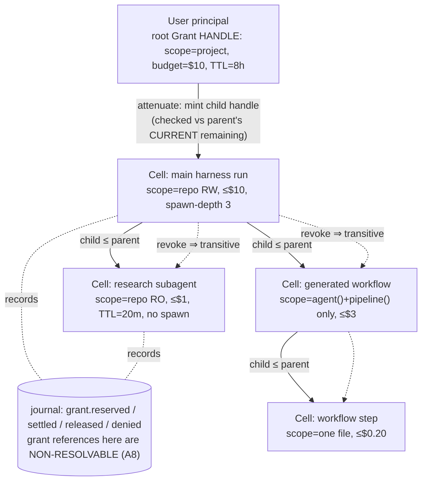

# 11 — Security and Policy

> **Post-review status (2026-08-16, phase 2).** This document predates the adversarial review; the
> review's binding adjudications live in the Amendment log of `research/DESIGN-SPINE.md` (A1–A14),
> with the full findings in `research/ADVERSARIAL-REVIEW.md`.
> **Applied here:** A2 (reserve/settle/release replaces decrement-at-commit: §2.1, §3.4 diagram),
> A3 (advisory-vs-enforced resolved into guarantee grades; the mediation waterline: §4.1, §7, §8),
> A6 (the MVP non-cooperative enforcement floor, which narrows the "auditability, not containment"
> caveat to in-process strategy code: §4.1a, §8), A8 (handle-identity authority, with the
> executable forgery finding: §2.2 I1, §2.6), A12 (allow-path journaling as a policy-class knob;
> model-judge verdicts always journaled: §3.4, §3.5). **Outstanding:** none known.
> Where this document conflicts with the Amendment log, **the amendment log governs**.
>
> **Executable semantics supersede prose.** The authority model, the commit barrier and the
> budget lifecycle are executable in `prototypes/kernel-semantics/` (normative prose in
> `docs/17-KERNEL-SEMANTICS.md`, checked invariants in `docs/18-KERNEL-INVARIANTS.md`,
> falsifications in `docs/20-SEMANTIC-TEST-RESULTS.md`). Two of this document's phase-1 claims
> were falsified by that code and are corrected in place (§2.6). Where the narrative here and
> that code disagree, the code is correct and this document is the defect.


Status: Phase 20 deliverable, written from `research/DESIGN-SPINE.md` (pre-adversarial-review).
Everything in this document not carrying an explicit evidence label is OUR PROPOSAL. Claim
labels and Evidence/Interpretation/Implication/Confidence blocks follow
`research/METHODOLOGY.md`. Vocabulary is spine §2 throughout: *kernel*, *Capability*,
*Binding*, *Invocation*, *Grant*, *Cell*, *Artifact*, *Event*, *harness*, *tool runtime*,
*policy/security layer* are never interchanged.

Position in the doc set: this document specifies the policy/security layer named in spine §2
— object-capability authority (Grants) + the ordered interposition pipeline + taint labels —
as kernel mechanism, not middleware. The objects it governs are defined in
05-KERNEL-PRIMITIVES; the manifest fields it consumes are defined in 06-CAPABILITY-SPEC; the
journal it writes to is defined in 08-EVENT-AND-STATE-MODEL; the context compiler that must
preserve its labels is defined in 09-CONTEXT-AND-MEMORY; the commit-gate verification hook it
feeds is detailed in doc 10; operational failure handling is doc 13.

The design goal in one sentence: **no sequence of model-emitted tokens may cause the
kernel-issued authority held by any Cell to grow.** Everything below is either machinery to make
that invariant structural, or an honest account of what the invariant does not buy. The
qualifier "kernel-issued" is load-bearing and is unpacked in §2.2 (I2): authority a component
brought with it — ambient OS credentials, the host process's own network stack — was never
issued by a Grant and is bounded by the enforcement floor of §4.1a, not by this invariant.

---

## 1. Threat model

The kernel's trust stance: **the model is an unprivileged principal.** Every model emission —
text, tool-call arguments, generated code, judgments — is untrusted input to the kernel, in
exactly the way syscall arguments are untrusted input to an OS kernel. This is not a claim
that models are adversarial; it is the recognition that a model's output channel is the
composition of everything in its context, and any part of that context may be
attacker-controlled.

| # | Threat | Vector | Observed in the wild (evidence) | Primary kernel counter (section) |
|---|---|---|---|---|
| T1 | Direct prompt injection | Hostile instructions in user input | Copilot cloud agent filters hidden characters in user input against injection (FACT, research/notes/coding-agents-landscape.md) | §3 pipeline, §5 labels (user input is trusted-integrity but still policy-gated) |
| T2 | Indirect prompt injection | Tool results, fetched web content, repo files, subagent outputs carrying instruction-shaped text | Claude Code v2.1.210+ scans subagent final messages for imitation `<system-reminder>` tags, escapes `Human:`/`Assistant:` markers (FACT, research/notes/anthropic-claude-code-agent-sdk.md); FIDES exists because this class is endemic (SOURCE-CODE OBSERVATION, research/notes/microsoft-autogen-sk-agent-framework.md) | §5 structural taint, quarantine, variable-reference hiding |
| T3 | Malicious capability manifests | A manifest declares `readOnly`/benign behavior it does not have; registry poisoning | MCP spec: "clients MUST consider tool annotations to be untrusted unless they come from trusted servers" (FACT, research/notes/mcp-protocol.md) | §7 signing + verification-by-evidence; §4 enforcement independent of declarations |
| T4 | Compromised MCP servers | A previously-good server starts returning poisoned results or rewritten tool descriptions | MCP registry explicitly delegates security scanning; annotations untrusted (FACT, research/notes/mcp-protocol.md) | §5 all southbound results labeled untrusted-integrity by default; §4 egress scoping per Binding |
| T5 | Confused-deputy delegation | A child executor exercises the parent's authority, or credentials minted for one target are replayed against another | MCP SEP-2352 keys client credentials by issuer, "never reuse across servers", named anti-confused-deputy (FACT, research/notes/mcp-protocol.md) | §2 attenuation-on-delegation; §6 audience-bound per-Binding credentials |
| T6 | Model-generated code | Generated orchestration scripts, code-act programs, patches executing with runtime authority | Claude Code dynamic workflows run generated JS in a restricted runtime (no fs, no `import()`) (FACT, research/notes/anthropic-claude-code-agent-sdk.md); OpenAI runs programmatic tool calling in a fresh hosted V8 with no fs/network (FACT, research/notes/openai-agents-sdk-codex.md) | §4 isolate-tier sandboxing; generated code binds only kernel-API capabilities under the spawning Cell's Grant |
| T7 | Exfiltration via observability | Sensitive payloads leaving through traces, logs, third-party trace processors | OpenAI SDK: `trace_include_sensitive_data` defaults to *true*, 30+ third-party processors documented (FACT); Claude Code excludes prompt text from OTel by default (FACT) (research/notes/openai-agents-sdk-codex.md, anthropic-claude-code-agent-sdk.md) | §5 label-driven redaction; exporters are capabilities with confidentiality ceilings |
| T8 | Recursive self-privilege-escalation | The system modifies its own policy/config, or spawns children with wider grants than it holds | Claude Code deny rules and hooks survive `bypassPermissions` precisely because everything else is model-influenceable (FACT, research/notes/anthropic-claude-code-agent-sdk.md) | §2 ocap: grants are not data the model can write; child ≤ parent by construction |
| T9 | Supply chain | Malicious skills/plugins/packages entering via marketplaces or dependency resolution | Copilot cloud agent checks new dependencies against the GitHub Advisory Database and runs secret scanning/CodeQL on agent output (FACT, research/notes/coding-agents-landscape.md) | §7 signed manifests + registry namespace verification; doc 10 commit-gate scanners; §8 honest limits below the kernel |

Two structural observations about this table. First, T2 and T8 are the two threats that no
surveyed system solves structurally: Claude Code's subagent-output scanning is a *text
heuristic bolted at one trust boundary* (§5 replaces it), and every ACL-shaped permission
system in the landscape is one config write away from self-widening (§2 replaces that).
Second, T5–T7 share a shape: authority or data crossing a boundary the policy layer does not
see. The consistent answer is that **every crossing is a kernel event carrying a Grant
reference and labels** — there is no unmediated path.

---

## 2. The object-capability foundation

### 2.1 Grants recap

The Grant (kernel object 7, 05-KERNEL-PRIMITIVES) is an unforgeable, attenuable, revocable
authority reference carrying rights (what) and quantitative budget (how much: tokens, money,
wall-clock, invocations, spawn depth/width, risk class). Grants form a lineage tree.

**Budget lifecycle (amendment A2).** The kernel **reserves** against every ancestor grant at
admission — durably, *before* dispatch — **settles** the actual usage at outcome commit, and
**releases** the unused remainder, emitting distinct `grant.reserved` / `grant.settled` /
`grant.released` events. *(Superseded by A2: this section previously said "the kernel decrements
budgets at commit". Retained because the analysis that forced the change is instructive —
decrement-at-commit can only detect exhaustion* after *the spend has happened, which for an
irreversible effect is the wrong side of the event; and concurrent in-flight invocations could
overdraw a single grant chain in the window between dispatch and commit.)* A grant's limits are
**ceilings enforced along the whole chain at admission, not partitioned reservations** — sibling
grants may overcommit while actual spend stays bounded by every ancestor (doc 17 §9a; doc 20
F-7, recorded as a contract defect precisely because readers assumed set-aside budget).

This section states the security invariants that make Grants the answer to T8, with their
evidence.

### 2.2 The six invariants

**I1 — Unforgeability: authority is object identity in a kernel-private registry, never a
string anyone can present** (amendment A8). The model's output channel is text. When a model
"calls a tool," it emits a *name*. In Kyxo, that name is resolved against the table of Bindings
the invoking Cell actually holds — the model only ever *names bindings the kernel already holds
on the Cell's behalf*. Emitting the name of a Binding the Cell does not hold is a resolution
failure, not an authority question. There is no path from token emission to authority:
designation without possession is inert. This is Cap'n Proto's rule — capabilities "both
designate an object to call and confer permission to call it" (FACT,
research/notes/prior-art-negotiation-extension.md) — split correctly for a world where the
principal can only emit designations.

The mechanism that makes "possession" real is stronger than the phrase "kernel reference"
suggests, and the difference is not academic:

- **Userland holds handles, not identifiers.** A Grant handle is an *object the kernel minted*
  and tracks in a private registry (a `WeakSet` in the reference kernel). Authority is decided by
  object identity: the kernel accepts a handle if and only if it minted that exact object.
  Constructing an object of the same class with a known id, forging the prototype, or shallow-
  copying a genuine handle all fail — three attacks asserted in `grants.test.ts`, with the
  genuine handle still working.
- **Journal grant references are non-resolvable.** The identifier written on an event names the
  authority for attribution and audit; it cannot be exchanged for the authority. Reading the
  journal, a trace, or an error message therefore confers nothing.

**This invariant exists because the reference kernel got it wrong first** (doc 20 F-2). The
initial implementation guarded `GrantHandle` construction with a `KERNEL_MINT` symbol — which the
types module *exported*. Any module that could `import { KERNEL_MINT }` could mint a valid handle
for any grant id read off a journal event: the exported guard was itself the forgery hole, and
the implementation had committed exactly the sin this document criticises in ACL designs — a
secret that is authority the moment you know it. The fix was to stop treating any *value* as
proof and make the kernel's own registry the arbiter. Recorded as invariant I21 in
18-KERNEL-INVARIANTS, and generalised as a design rule: **if authority can be reconstructed from
data, it is not authority — it is a password.**

**I2 — No ambient authority: an empty Cell has no authority.** A freshly created Cell holds
nothing: no tools, no filesystem, no network, no model access. Everything it can do arrives
as Bindings passed by its creator under Grants attenuated from the creator's own. Zircon is
the production precedent: "kernel objects do not have an intrinsic notion of security and do
not do authorization checks; security rights are held by each handle"; "an empty process has
no ambient authority" (FACT, research/notes/prior-art-negotiation-extension.md). The Kyxo
kernel makes the same commitment: kernel objects carry no intrinsic permissions; all
authority is on Grants.

**The honest boundary of I2: this is a statement about kernel-issued authority only.** Zircon
can say "an empty process has no ambient authority" because the OS owns every channel to the
outside world. Kyxo's kernel owns every channel *it issues* — and in V1 it shares an address
space with the code it is issuing to. So the invariant reads precisely:

> No sequence of model emissions, and no action by a strategy or capability, can cause the
> authority **the kernel has issued** to a Cell to grow. Authority a component *brought with it*
> — the host process's own file descriptors, environment variables, network stack, and ambient
> OS credentials — was never issued by the kernel, is not tracked by the Grant tree, and is not
> bounded by it.

Two mechanisms address the brought-authority half, and neither is I2: the **enforcement floor**
(§4.1a) puts effectful standard capabilities behind an OS boundary where the environment they can
reach *is* the grant-scoped one, and the **isolation waves** (07-RUNTIME-ARCHITECTURE §8.2)
extend that boundary to arbitrary providers. Until a component sits behind one of those
boundaries, the correct claim about it is auditability, not containment (§4.1a). Saying I2
covers brought authority would be the same overclaim that amendment A3 removed from the
positioning — enforcement asserted over execution the runtime does not mediate.

**I3 — Attenuation-on-delegation is mandatory, checked at mint time.** Delegation (spine §2:
invocation of a capability that is itself an orchestrator, under an attenuated grant) mints a
child Grant whose scope, budget, TTL, spawn depth, and risk-class ceiling are each ≤ the
parent's. The kernel refuses to mint otherwise — this is not policy, it is the Grant
constructor's type — and it validates against the parent's **current remaining state**, not a
snapshot taken earlier in the call (the stale-snapshot bug, doc 20 F-3). seL4's precedent:
copies are minted with a *subset* of rights, never amplified (FACT,
research/notes/prior-art-negotiation-extension.md). Budgets ride the same mechanism as rights,
with one property that must not be misread: a child's token/money/wall-clock limit is a
**ceiling ≤ the parent's remaining, not a partition carved out of it** (§2.1). Ten children of a
parent holding 5 invocations may each declare 4; admission then admits exactly 5 across all of
them, because it checks every ancestor in the chain. The delegation tree is still the
resource-lineage tree (spine §3.7 flags budgets-as-attenuated-quantitative-rights as our one
genuinely novel kernel object) — it is a tree of *limits*, not of *allocations*, and a surface
that renders a child's limit as reserved budget is misreporting it (doc 20 F-7).

**I4 — Revocation is transitive over the delegation tree.** Revoking a Grant invalidates
every Grant derived from it, atomically from the kernel's perspective: killing a Cell kills
everything it delegated, however deep. seL4's `seL4_CNode_Revoke` "deletes a capability and
every capability derived from it" (FACT, research/notes/prior-art-negotiation-extension.md).
In-flight Invocations under a revoked Grant are caught by an **authority re-check at the commit
point** — a time-of-use check, not only a time-of-admission one: the settlement path re-reads
the whole grant chain, and a revocation that landed mid-flight commits `grant.denied`
(`reason: revoked-mid-flight`) followed by `invocation.failed`
(`authorization-revoked-post-hoc`), releases the reservation, and **promotes no artifacts**, so
no benefit is conferred by work performed under authority that has since been withdrawn. If the
external world already saw an effect, that fact is journaled (`landedExternal`) rather than
hidden — a denied outcome must not erase evidence of what happened. *(Superseded reading: this
paragraph previously said such invocations "transition to `canceled` through the scheduler's
cancellation propagation". Cancellation propagation is a real and separate path — and
cancellation **requests** are themselves journaled, per A10 — but revocation is adjudicated at
the commit gate, and the distinction matters because `canceled` and `failed` carry different
meanings for an auditor.)*

**I5 — Interposition is invisible to the holder.** Policy wraps a Binding in a filter — a
recorder, a redactor, a rate-limiter, a sandbox adapter — and the holder cannot distinguish
the wrapped Binding from a direct one. This is seL4's "interpose access" and the WASI
Component Model's "virtualizable imports" (any import can be satisfied by another component,
and the component cannot tell) (FACT, research/notes/prior-art-negotiation-extension.md).
Invisibility matters for security, not just elegance: a model that can detect interposition
can condition its behavior on being observed.

**I6 — The commit barrier is structural: a capability holds nothing it could write truth
with.** The five invariants above bound what authority a participant *has*; this one bounds what
it can *assert*. A capability provider receives `InvokeCtx` — invocation id, execution id, an
injected clock value, an attempt counter, the request, an optional resume payload, and a
read-only cancellation signal. There is no kernel, journal, storage, or grant object on it
(amendment A4; ADR-017). Its only channel to durable truth is yielding typed **effect
proposals**, which accumulate in a staging area it cannot address and which the kernel validates
— re-checking authority to catch revocation mid-flight, running commit-phase policy stages,
applying the evidence gate — before constructing events and writing one atomic commit record.
Two security consequences: a capability cannot append an authoritative event (so history cannot
be fabricated), and **a capability cannot report success that the commit gate rejects** (so
"the agent said it verified the fix" is not a fact the journal will carry). Delegation needs no
exception: a capability yields a `delegate` proposal and receives the outcome back through the
generator channel while the kernel attenuates authority for the child — recursion is bounded by
authority rather than by a counter.

*(Phase-1 handed each capability a live kernel handle and described that handle as the
provider's authority. Superseded; retained because the analysis that forced the change is
instructive — a handle you are given in order to call back through is still ambient authority
relative to the commit point, and every future writer verb on it would have been a new bypass to
audit.)*

### 2.3 The convergence evidence

```
Evidence       — Four unrelated systems independently converged on identical authority
                 invariants: the E language lineage (designation conveys authority; "ambient
                 authority" coined as the anti-pattern), Cap'n Proto RPC (capabilities as
                 first-class references, possession = authority, attenuation via membranes),
                 seL4 (unforgeable tokens, mint-with-subset-of-rights, transitive revoke,
                 formally verified on top of this model), Fuchsia/Zircon (rights on handles,
                 no kernel-side authorization checks, no ambient authority in an empty
                 process). All FACT, research/notes/prior-art-negotiation-extension.md.
Interpretation — A language, an RPC protocol, a verified microkernel, and a production OS
                 arriving at the same five authority invariants (I1–I5; I6 is ours, from
                 the commit barrier) under unrelated pressures is the
                 strongest convergence signal in the entire research program (the note calls
                 it exactly that). These invariants are not a school of thought; they are
                 what authority looks like when delegation is the dominant operation.
Implication    — Grants adopt the invariants wholesale. Delegation-heavy workloads are
                 Kyxo's defining workload (every subagent spawn, every remote executor,
                 every generated workflow is a delegation), so the authority model must be
                 the one that composes under delegation.
Confidence     — HIGH.
```

### 2.4 Why ACL / policy-engine-only designs fail the test

The test: *can any sequence of model outputs cause a Cell's authority to grow?* Run every
surveyed permission system through it:

- **Rule engines over tool names** (Gemini CLI's TOML rules, OpenCode rulesets, Continue
  per-tool policies — SOURCE-CODE OBSERVATION, research/notes/coding-agents-landscape.md)
  adjudicate calls, but the rules are *files in the workspace the system can often edit*, and
  the authority being adjudicated is ambient (the process's own credentials and network). A
  model that can write config, or convince a human to, widens itself. Claude Code's designers
  understood this: deny rules and hooks are non-bypassable precisely because every other
  stage is influenceable (FACT, research/notes/anthropic-claude-code-agent-sdk.md) — an ocap
  instinct retrofitted onto an ACL design.
- **Central policy evaluation** (Kubernetes RBAC as the canonical instance) requires a
  policy-database write for every delegation, and evaluation cost/centralization scale
  poorly with delegation depth (INFERENCE/MEDIUM,
  research/notes/prior-art-negotiation-extension.md). The prior-art note's summary is the
  design rule: across seL4, Zircon, Cap'n Proto, and Plan 9 namespaces, "delegation =
  handing a narrower reference, never editing a policy database" (FACT-supported synthesis,
  same note).
- **Feature declarations are not authority.** MCP's capability objects are feature-support
  declarations; authority lives entirely in OAuth scopes and host policy — MCP "proves you
  can defer it to OAuth, and also shows the cost: no protocol-level budgets, leases, or
  fine-grained grants" (FACT + INFERENCE/HIGH, research/notes/mcp-protocol.md). A kernel
  cannot defer: it owns delegation, so it must own attenuation.

Under Grants, the test passes structurally: the model can only name Bindings its Cell holds
(I1); a Cell starts empty of kernel-issued authority (I2); minting requires a parent Grant with
a superset, checked against the parent's *current* remaining state rather than a stale snapshot
(I3); a capability cannot assert its way past the commit gate (I6); and policy state that
*could* widen authority (the pipeline definitions of §3) is itself reachable only through
capabilities that agent-facing Cells are never granted. Privilege escalation requires a
principal that already holds the privilege — which is the definition of not being an escalation.

The test's scope is the scope of I2's honest boundary: it is a claim about *issued* authority.
A component that already possesses ambient OS authority does not need to escalate, and no
invariant in this section pretends otherwise — that is the enforcement floor's job (§4.1a).

### 2.5 The delegation tree



Every edge is a kernel-minted attenuation; every node's authority is exactly the handles it
holds; revoking any edge severs the whole subtree. Limits on an edge are **ceilings, not
set-aside budget** (§2.1): siblings may declare more in total than the parent holds, and
admission — which checks remaining budget at every ancestor — is what keeps actual spend
bounded. Refusals are journaled (`grant.denied`) rather than swallowed; a delegation that failed
for lack of authority leaving no trace was a real defect in the reference kernel (doc 20 F-3).
The same tree carries budget lineage and — per §6 — is the audit trail.

### 2.6 What the executable kernel establishes — and what it does not

Everything above was, in phase 1, an argument. It is now partly a test result, and the
distinction between the parts matters more than the green tick. The reference implementation
lives in `prototypes/kernel-semantics/`; the falsification record is 20-SEMANTIC-TEST-RESULTS.

**Established by execution (attacks that were run and failed):**

| Claim | How it was attacked | Result |
|---|---|---|
| A malicious capability cannot reach the kernel, journal, storage or authority | A deliberately hostile provider enumerates every property of its `InvokeCtx` looking for a callable surface | Finds none — `InvokeCtx` is data (`universality.test.ts`, "malicious capability containment") |
| A capability cannot self-certify success past a commit gate | Provider returns `{status:'ok'}` while proposing failing Evidence under `requiresEvidence` | Invocation lands `failed`, **zero** artifacts promoted (doc 18 invariants I4, I17) |
| A Grant handle cannot be forged | Three attacks: construct the handle class with an id read off a journal event; forge the prototype; shallow-copy a genuine handle | All three rejected; the genuine object still works (doc 18 invariant I21) |
| Delegation cannot broaden authority, at any depth | Recursion-bound tests plus attenuation attacks (added rights, excess budget, stale-parent snapshots) | Refused and journaled at every hop (doc 18 invariants I5, I18) |
| An authority or policy refusal cannot vanish | Coverage guard requires ≥20 journaled policy denials per generated run | Enforced in CI (doc 18 invariant I22) |
| Revoked authority cannot be resurrected by a checkpoint | Revoke after the cut, then fork from the checkpoint | Grants are re-resolved at fork; revocation stays (doc 17 §8.2 — this is what closes R3 in §8) |

Scale for the whole suite: 4,500 coverage operations + 4,800 property operations + 32
crash-point recoveries, with the full invariant set asserted after **every** operation, plus
70,000 fuzz operations. Ten findings came out of it, three in the security machinery: F-2
(handle forgery, §2.2 I1) and F-3 (delegation computing child budgets from stale authority and
then swallowing the refusal, §2.5).

**Not established, and not claimed.** The suite exercises the *kernel's* boundaries inside one
process. It says nothing about (a) confinement of a capability that ignores the kernel entirely
and reaches ambient OS authority — that is the enforcement floor's job (§4.1a), and the
isolation waves' after it; (b) anything above the mediation waterline (§7), where the runtime
holds reports rather than execution; (c) whether a capability's *declared* effect class is
truthful — a lie there defeats recovery triage, and the mitigation is probes and telemetry, not
structure (doc 20 §5). A malicious capability that cannot corrupt the record can still do damage
in the world. What the kernel guarantees is that the damage is attributable, bounded by issued
authority, and never mistaken for verified success.

---

## 3. The policy pipeline

### 3.1 Shape

The policy pipeline is one of the kernel's two mechanisms (spine §3): **an ordered set of
declarative stages, evaluated at bind time and again at every effectful invocation.** Grants
answer "may this authority exist here at all"; the pipeline answers "may this particular use
proceed, and under what transformation." Both are required: Grants without a pipeline cannot
express contextual rules ("this write is fine, that write needs a human"); a pipeline without
Grants adjudicates ambient authority and fails §2.4.

Stage classes, in evaluation order:

| Order | Stage class | Verdicts | Bypassable by profile? |
|---|---|---|---|
| 1 | **Interpose** | wrap/observe/transform the Binding (invisible to holder, I5) | no (but stages are additive, not gating) |
| 2 | **Deny** | hard block; at bind time, removes the Binding from the offered surface entirely | **never** |
| 3 | **Label gate** | block/quarantine based on taint labels of arguments and target (§5) | never |
| 4 | **Verdict** | suspend the Invocation pending a decision by a named principal (§3.3) | configurable per risk class |
| 5 | **Allow** | positive match short-circuits to proceed | yes |
| 6 | **Default** | profile's default disposition (proceed / ask / deny) | yes — this *is* the profile |

Two evaluation points, deliberately: **bind-time** evaluation shapes what exists (a deny
stage matching at bind removes the capability from the negotiated surface, so the model never
sees it — the cheapest possible enforcement), and **invocation-time** evaluation judges each
effectful use with full argument and label visibility. Read-class invocations may be
fast-pathed by policy; effectful ones may not.

### 3.2 Evidence for the shape

```
Evidence       — Claude Code evaluates every tool call through a fixed six-step pipeline:
                 hooks → deny rules → ask rules → permission mode → allow rules → canUseTool
                 callback. Deny rules and hooks apply even in bypassPermissions mode.
                 Bare-name deny rules remove the tool definition from the request entirely —
                 the model never sees the tool (all FACT,
                 research/notes/anthropic-claude-code-agent-sdk.md). Gemini CLI ships a
                 priority-ordered TOML rule engine (allow|deny|ask); OpenCode uses
                 last-match-wins rulesets; both layer defaults < user < session approvals
                 (SOURCE-CODE OBSERVATION, research/notes/coding-agents-landscape.md).
Interpretation — Ordered pipelines with a non-bypassable deny class are convergent practice,
                 and the strongest implementation (Claude Code) discovered both key rules:
                 (a) some stages must survive every mode, or modes become escalation paths;
                 (b) denial is cheapest when applied to the offered surface, not the call.
                 "Modes" (plan, acceptEdits, bypass) are just profiles selecting stage
                 dispositions — the landscape note reaches the same verdict for plan mode
                 across four systems ("a policy profile, not an architectural construct",
                 INFERENCE/HIGH, research/notes/coding-agents-landscape.md).
Implication    — Kyxo makes the pipeline itself declarative data (a Kind, versioned and
                 auditable), makes deny-class stages structurally non-bypassable, and models
                 permission modes as profiles over stage dispositions rather than kernel
                 states.
Confidence     — HIGH.
```

### 3.3 Approval generalized: one verdict primitive

Every surveyed system independently built "an effect blocks until someone decides":

```
Evidence       — OpenAI Agents SDK: needs_approval → NextStepInterruption → serialized
                 RunState → approve/reject → resume (SOURCE-CODE OBSERVATION + FACT,
                 research/notes/openai-agents-sdk-codex.md). Codex: server→client RPCs
                 execCommandApproval / applyPatchApproval whose responses come from the
                 client; AskForApproval {UnlessTrusted, OnRequest, Granular, Never} (FACT /
                 SOURCE-CODE OBSERVATION, same note). MAF: ctx.request_info() typed
                 request/response ports, pending requests persisted inside checkpoints
                 (SOURCE-CODE OBSERVATION, research/notes/microsoft-autogen-sk-agent-framework.md).
                 MCP: MRTR input_required results with sealed, integrity-protected
                 requestState continuations (FACT, research/notes/mcp-protocol.md). A2A:
                 TASK_STATE_AUTH_REQUIRED with escalation chaining up the delegation chain
                 (FACT, research/notes/a2a-protocol.md).
Interpretation — Five independent designs, one shape: a typed suspension of an effect,
                 resolvable by an external decision, resumable across process boundaries.
                 The OpenAI note states the generalization exactly: "any effect may block on
                 a policy verdict from any principal (human, guardian model, execpolicy
                 rule)" (INFERENCE/HIGH).
Implication    — Kyxo has ONE verdict primitive. The Invocation lifecycle's interrupted
                 class (approval-required / auth-required / input-required /
                 budget-exceeded, spine §3.3) is that primitive; a Verdict-class pipeline
                 stage parks the Invocation with a typed suspension payload naming the
                 principal whose verdict is required. Humans, guardian models, and rule
                 engines are all capabilities that can hold the verdict role; suspensions
                 persist in Checkpoints (MAF's proof this composes with durability);
                 escalation up the Grant lineage reuses A2A's chaining pattern for
                 budget-exceeded and approval-required alike.
Confidence     — HIGH.
```

### 3.4 Policy handlers are capabilities — including model judges, with a hard caveat

Because pipeline stages dispatch to handlers, and handlers are invocable, **policy handlers
are themselves Capabilities** — a shell predicate, an HTTP endpoint, a rule engine, a human,
or a model. The precedent is live: Claude Code's hook system has `prompt` and `agent` handler
types (an LLM as policy evaluator) and its `auto` permission mode uses a model classifier
(FACT, research/notes/anthropic-claude-code-agent-sdk.md); MAF's harness terminates loops on
an LLM judge's structured verdict (SOURCE-CODE OBSERVATION,
research/notes/microsoft-autogen-sk-agent-framework.md).

The caveat is non-negotiable: **model-adjudicated policy is advisory-tier. A model verdict is
never the only gate on an irreversible action.** A model judge is a model — subject to the
same injection surface (T1/T2) and the same correlated failure modes as the principal it
judges. Capability manifests declare a risk class (06-CAPABILITY-SPEC); Grants carry a
risk-class ceiling (§2); and the pipeline enforces the tiering rule: for
irreversible/destructive-class effects, at least one Verdict stage must resolve to a
deterministic rule or a human principal. Model judges may *add* denials anywhere and may be
the sole gate only for reversible effects. Claude Code exhibits the same instinct in ACL
form: even in the model-adjudicated `auto` mode, deny rules still bind (FACT,
research/notes/anthropic-claude-code-agent-sdk.md).

**And the second half of the caveat, added by amendment A12: a model-judge verdict that gates an
effect is *always* journaled to the truth plane, with a hash of the judge's inputs — in every
profile, including the ones where ordinary allow-path traces stay advisory (§3.5).** The reason
is asymmetric with the rest of the pipeline. A deterministic stage can be re-evaluated later
from journaled inputs, so its allow trace is reconstructible; a model verdict cannot be, because
the same inputs may not produce the same verdict tomorrow, under a different model version, at a
different temperature. An unrecorded model verdict is therefore not a diagnostic that can be
regenerated — it is evidence that never existed. Journaling the verdict with an input hash does
not make a non-deterministic gate deterministic; it makes it **attributable**, which is the most
that can honestly be claimed for it. "Advisory-tier" governs what a judge is allowed to decide
alone; it never means the decision may go unrecorded.

```mermaid
flowchart LR
    M["model emits<br/>designation + args"] --> R["resolve against Cell's<br/>held Binding HANDLES (I1)"]
    R -->|no Binding| X1["resolution failure<br/>(inert)"]
    R --> ADM["admission:<br/>authority re-check +<br/>grant.reserved (A2)<br/>durable before dispatch"]
    ADM -->|no authority / no budget| XD["rejected —<br/>grant.denied journaled"]
    ADM --> P1["1 interpose"]
    P1 --> P2["2 deny<br/>(non-bypassable)"]
    P2 -->|match| X2["rejected —<br/>policy.denied journaled"]
    P2 --> P3["3 label gate (§5)"]
    P3 -->|taint violation| Q["quarantine /<br/>rejected (journaled)"]
    P3 --> P4["4 verdict"]
    P4 -->|suspend| S["approval-required<br/>(typed suspension →<br/>human / judge / rule)"]
    S -->|"verdict: allow<br/>(judge verdicts ALWAYS journaled<br/>with input hash — A12)"| P5
    S -->|verdict: deny| X3["rejected (journaled)"]
    P4 --> P5["5 allow / 6 default<br/>(allow-path trace: advisory by default,<br/>truth in the regulated profile — A12)"]
    P5 --> E["effect executes in<br/>enforcement layer (§4):<br/>OS sandbox + grant-scoped<br/>credentials/egress (A6)"]
    E --> V["commit-phase validation:<br/>authority re-checked (revocation<br/>mid-flight), evidence gate applied"]
    V -->|gate fails| XF["failed — staged artifacts<br/>discarded, not promoted (I6)"]
    V --> C["commit record (atomic):<br/>journal Events · labels on Artifact ·<br/>grant.settled + grant.released (A2)"]
```



### 3.5 What the pipeline journals: the allow-path knob (amendment A12)

A policy layer that records only its refusals can prove what it stopped and not what it
permitted. For an incident review — or a regulator — the second question is usually the
interesting one. But allow traces are also the highest-volume thing the pipeline produces, and
putting all of them in the truth plane taxes every deployment for a property most do not need.
Amendment A12 resolves this as a **policy class**, not a global default:

| What | Plane | Profile |
|---|---|---|
| **Every refusal** — `policy.denied`, `grant.denied`, label-gate rejections, quarantine | **Truth**, always | all |
| **Verdict-stage outcomes** — approvals, rejections, escalations, with the deciding principal and responsibility metadata | **Truth**, always | all |
| **Model-judge verdicts gating an effect** — with a hash of the judge's inputs (§3.4) | **Truth**, always | all |
| **Allow-path evaluation traces** — which stages ran, what matched, what transformed | **Advisory** (derived stream, not the ledger) | default |
| **Allow-path evaluation traces** | **Truth** — a declared policy class, with its journal-growth cost accepted deliberately | regulated |

The default is defensible precisely because deterministic policy stages are pure functions of
(event, grant, pinned policy version): an allow trace is *reconstructible* from journaled
inputs. But "reconstructible in principle" is not an audit record — reconstruction depends on
still having the policy version, the evaluator, and someone willing to re-run it. The regulated
profile therefore promotes allow traces to the truth plane as a declared class, so the deployment
that needs to *prove* what it permitted can, and the deployment that does not is not billed for
it. Two cases escape the knob in every profile, both listed above: judge-gated allows (not
reconstructible at all — §3.4) and allows whose stage is deny-class (the stage exists to be
non-bypassable; its outcome is an outcome).

Doc 08 §3.1 carries the event-kind detail and the two-plane guarantees; the policy class itself
is defined here, because it is a security decision rather than a storage one.

---

## 4. Enforcement layering: the ceiling is credentials + egress + sandbox

### 4.1 Three layers, honestly ranked

Everything above this section adjudicates *requests*. A sufficiently confused or injected
system component will eventually make a request the pipeline wrongly allows, or find a path
the pipeline does not mediate. The question that decides real-world containment is: **what
can the process physically do when policy fails?** The landscape gives an unambiguous
answer about where that ceiling lives:

```
Evidence       — Copilot cloud agent enforces its guarantees below the harness: pushes are
                 restricted to a single copilot/* branch by credential design ("cannot
                 directly run git push"); it can open only draft PRs and cannot
                 approve/merge; the requester cannot approve (preserving required-reviewer
                 semantics); a default-on egress firewall bounds the network; CodeQL,
                 advisory-database, and secret-scanning run as platform stages on the output
                 (all FACT, research/notes/coding-agents-landscape.md). The landscape note's
                 synthesis: "real enforcement lives in credentials and network, not prompts
                 — the kernel's policy layer must bind to capability grants (what tokens/
                 egress the environment holds), not just tool-call filtering."
Interpretation — Tool filtering is context-shaping — valuable for guiding the model and for
                 cheap denial, but it is the weakest layer: it constrains what the model is
                 offered, not what the process can do. The enforcement ceiling is set by
                 (a) which credentials exist in the environment and what they are scoped to,
                 (b) what the network permits, (c) what the sandbox permits.
Implication    — Kyxo Grants must COMPILE DOWN to these three backends, not merely gate
                 calls: a Grant's scope materializes as short-lived, audience-bound
                 credentials minted at the boundary (never long-lived secrets in the
                 environment); its network rights compile to egress-proxy allowlists for
                 the Cell's sandbox; its filesystem/process rights compile to the sandbox
                 profile. A Grant right that compiles to an enforcement backend is sealed
                 on the Binding with guarantee grade `enforced`; one that does not is
                 sealed `observed` or `declared` and says so (amendment A3) — the kernel
                 never lets declared policy silently exceed enforced policy.
Confidence     — HIGH.
```

*(Superseded by amendment A3: this paragraph previously said such a Grant is "flagged as advisory
at bind time". Retained because the analysis that forced the change is instructive — "advisory"
was doing two jobs at once. It named a *negotiation* property (does the kernel gate on this axis
at all?) and an *honesty* property (what backs the claim that the property holds in the world?),
and collapsing them meant a Binding could be enforced-and-unbacked with no vocabulary to say so.
The two are now separate fields: `enforcement: enforced | advisory` and
`guaranteeGrade: enforced | observed | declared`, normative in 06-CAPABILITY-SPEC §2.3a.)*

**Grades in this document's terms.** `enforced` means the effect cannot occur except through a
mediation Kyxo owns — the three backends above are what "owns" cashes out to. `observed` means
deviation is detectable after the fact from journaled outcomes or probe Evidence, but not
preventable. `declared` means the publisher's signed word and nothing else. Grades are **per
property, not per capability**: one model-adapter Binding routinely carries `enforced` on egress
scope (our proxy), `observed` on token metering (reconciled from usage reports), and `declared`
on data-residency (nobody local can check it). A grade never widens silently — expired probe
Evidence demotes `observed` to `declared`, and the demotion is journaled.

### 4.1a The MVP enforcement floor (amendment A6)

The paragraph above states the ceiling as a design intent. Amendment A6 makes part of it a
**shipping requirement of the MVP**, and the reasoning is worth keeping because it was the
review's fatal finding against the whole project's justification.

The original BUILD case rested partly on "grants and commit gates cannot be retrofitted into an
existing framework". The review retracted that as the sole discriminator, on this ground: a
middleware retrofit binds only *cooperative* code — and a V1 Kyxo whose enforcement is
in-process ocap discipline **also** binds only cooperative code. Two systems that both depend on
components choosing to go through the front door are not differentiated by one of them calling
its front door a kernel. Therefore:

> **Normative for the MVP:** every effectful standard capability — shell and HTTP first — runs
> **OS-sandboxed** (tier `os` of §4.2: Seatbelt / Landlock+seccomp / bubblewrap per platform)
> with **grant-scoped credentials** (§4.3's sentinel substitution and proxy re-injection) and
> **grant-scoped egress** (per-Binding allowlist at the proxy). The sandbox profile and the
> allowlist are *compiled from the Grant*, not configured beside it.

What this buys, stated exactly: for the effect classes the floor covers, claim F7 — *a malicious
strategy cannot exceed its grant* — becomes **falsifiable**, because the bound no longer depends
on the strategy's cooperation. A shell capability that decides to ignore every kernel verb still
cannot open a socket the egress proxy does not allow, read a path outside its workspace jail, or
see a credential the proxy has not injected. That is enforcement in the sense §4.1 means it, and
it is why the sandbox-escape and egress probes are red-team fixtures in the MVP test plan rather
than a hardening-wave nicety.

What this does **not** buy, and where the honest caveat now lives:

| Component | Containment in V1 | Therefore |
|---|---|---|
| Effectful standard capabilities (shell, HTTP) | OS sandbox + grant-scoped credentials/egress | `enforced` grades available on filesystem scope, egress, credential audience |
| MCP servers and other subprocess/remote providers | Process or network boundary (they are already shaped that way) | Enforced at the boundary; the declared-vs-actual gap is handled by grades (§7) |
| **In-process strategy code and vetted in-process capabilities** | **None** | This — and only this — is where "the ocap machinery buys auditability, not containment" applies |

So the caveat that phase 1 attached to the entire V1 runtime now attaches to one row of that
table. In-process code is trusted code: no ambient authority appears in the API surface, every
authority use is journaled, no path to the journal or to authority exists (§2.6) — and a
determined in-process module can still reach ambient Node APIs and do damage the kernel never
sees. The isolation waves (07-RUNTIME-ARCHITECTURE §8.2) extend the boundary to that row; until
they land, this document does not claim containment for it. EXTEND remains the documented
fallback if the Wave-4/5 crossing-cost measurements fail their budget — in which case the
enforcement floor survives the move and the nine-object kernel does not.

### 4.2 Sandbox tiers behind a declarative enum

```
Evidence       — Codex separates intent from mechanism as a two-axis matrix: AskForApproval
                 {UnlessTrusted, OnRequest, Granular, Never} × SandboxPolicy
                 {DangerFullAccess, ReadOnly, WorkspaceWrite, ExternalSandbox}, with
                 mechanisms (macOS Seatbelt, Linux Landlock+seccomp, bwrap) hidden behind
                 the enum and ExternalSandbox as the "already isolated" passthrough;
                 workspace-write disables network by default (FACT / SOURCE-CODE
                 OBSERVATION, research/notes/openai-agents-sdk-codex.md). Claude Code uses
                 Seatbelt / bubblewrap+socat+optional seccomp with a domain-allowlisted
                 egress proxy (FACT, research/notes/anthropic-claude-code-agent-sdk.md).
                 MAF runs code-act in a Hyperlight WASM micro-VM or the Monty interpreter,
                 with registered tools callable from inside the sandbox but not exposed
                 as direct agent tools (SOURCE-CODE OBSERVATION,
                 research/notes/microsoft-autogen-sk-agent-framework.md). OpenAI runs
                 model-emitted programs in a fresh hosted V8 with no fs/network and
                 tool access restricted to allowed_callers opt-in (FACT,
                 research/notes/openai-agents-sdk-codex.md).
Interpretation — The industry converged on: a small declarative policy surface, per-platform
                 mechanism plugins beneath it, a passthrough tier for pre-isolated
                 environments, and — for model-generated code specifically — isolate-tier
                 sandboxes whose ONLY imports are explicitly passed tool bindings. That last
                 pattern is ocap discipline reinvented at the sandbox boundary.
Implication    — Kyxo's execution-environment capabilities declare a sandbox tier enum:
                 `none` (trusted stdlib code in-process) · `os` (Seatbelt / Landlock+seccomp
                 / bubblewrap per platform) · `isolate` (WASM/Hyperlight/V8-class, for
                 code-act and untrusted plugins; imports = passed Bindings only, aligning
                 with the WASM-component extension path in spine §8) · `external`
                 (passthrough for environments isolated by the host: cloud VMs, Actions
                 runners). The Binding records which tier was satisfied, and the tier is
                 what earns the `enforced` guarantee grade on the rights the sandbox
                 actually bounds (§4.1); policy can require a minimum tier per risk class.
                 Tier `os` is the MVP floor for effectful standard capabilities (§4.1a),
                 not an opt-in. Mechanisms are per-platform plugins; the tier contract, not
                 the mechanism, is the portable surface.
Confidence     — HIGH.
```

### 4.3 Secrets never transit the runtime

Secrets get a dedicated design because they are the one data class where "labeled and
policy-gated" is not good enough — the correct amount of secret material in model context,
journals, and sandboxes is zero.

- **Sentinel substitution + proxy re-injection.** Inside sandboxes, credentials are replaced
  with per-session sentinels; the egress proxy re-injects real values only for allowlisted
  hosts (requiring TLS termination at the proxy; re-signing where needed). This is Claude
  Code's shipped mechanism (FACT, research/notes/anthropic-claude-code-agent-sdk.md). Kyxo
  adopts it as the standard tool-runtime posture: the Cell computes with sentinels; the
  Grant→credential compilation of §4.1 happens at the proxy, so possession of the sandbox
  never equals possession of the secret.
- **Environment hygiene by default.** Codex's shell environment policy excludes
  `*KEY*`/`*SECRET*`/`*TOKEN*` globs by default and adds extra protection for `.git`/`.env`
  (FACT, research/notes/openai-agents-sdk-codex.md). Kyxo's default execution-environment
  profile does the same; the environment a Cell sees is constructed (Plan 9-style, a mounted
  namespace), not inherited.
- **Form-vs-URL elicitation.** When a capability needs a secret from the human, it must use
  the URL elicitation mode — the user completes the sensitive interaction out-of-band and
  the secret never passes through the runtime. MCP standardized exactly this split and made
  it normative: "Servers MUST NOT collect secrets via form mode" (FACT,
  research/notes/mcp-protocol.md). Humans-as-capabilities in Kyxo (spine §5) inherit the
  split: form elicitation for data, URL elicitation for credentials, and the resulting
  authority arrives as a Grant referencing a vault-held credential — never as a value in an
  Artifact.

---

## 5. Taint and provenance as a kernel invariant

### 5.1 The mechanism

Every Artifact and every context fragment carries **integrity** (trusted / untrusted, with
source principal) and **confidentiality** (public / private / user-identity, extensible via
Kinds) labels, plus provenance (producing Invocation, inputs). Propagation is **structural**:
an Invocation's outputs are labeled with the join of its inputs' labels; the context compiler
(09-CONTEXT-AND-MEMORY) preserves labels through compilation, so the compiled per-invocation
view knows which spans came from where; compaction and memory writes propagate joins.
Declassification — lowering a label — is itself a capability, requiring a Grant and, for
integrity upgrades, Evidence artifacts through the commit gate (doc 10). Southbound results
(MCP servers, web fetches, remote executors) default to untrusted integrity; only manifest-
or policy-designated trusted sources start higher.

The label gate (§3, stage 3) is where labels become enforcement: untrusted-integrity content
cannot flow into the argument position of an effectful Invocation, and content above a
Binding's confidentiality ceiling cannot flow out through it, unless a quarantine or
declassification path intervenes.

### 5.2 Evidence: productization on one side, retrofit on the other

```
Evidence       — MAF ships FIDES (~2,950 lines, ADR-recorded): IntegrityLabel
                 TRUSTED/UNTRUSTED and ConfidentialityLabel PUBLIC/PRIVATE/USER_IDENTITY on
                 content; LabelTrackingFunctionMiddleware propagates labels and
                 automatically hides UNTRUSTED content behind variable references (var_xxx
                 indirection via a ContentVariableStore); PolicyEnforcementFunctionMiddleware
                 deterministically blocks violating tool calls including
                 max_allowed_confidentiality exfiltration prevention; quarantined_llm runs
                 isolated model calls over labeled data; MCP tool results carry per-result
                 _meta.ifc labels that are parsed and enforced (SOURCE-CODE OBSERVATION,
                 research/notes/microsoft-autogen-sk-agent-framework.md). On the other side:
                 Claude Code, lacking labels, scans subagent final messages for
                 instruction-shaped patterns — neutralizing imitation <system-reminder>
                 tags, flagging permission-config mentions, escaping Human:/Assistant:
                 markers (FACT, research/notes/anthropic-claude-code-agent-sdk.md).
Interpretation — The same problem, solved twice: FIDES is information-flow control carried
                 by the data plane (deterministic, boundary-enforced); Claude Code's scanner
                 is a pattern heuristic at one trust boundary, added in a point release —
                 the retrofit shape. The MAF note draws the kernel-relevant conclusion
                 itself: "retrofitting it as middleware works but is per-framework; making
                 it a kernel invariant is the differentiator." The Claude Code note agrees
                 from the other direction: "carry provenance/taint metadata on every message
                 and artifact rather than pattern-scanning text after the fact"
                 (INFERENCE/HIGH in both notes).
Implication    — Kyxo makes labels a property of the Artifact and Event objects themselves
                 (spine §3.5), not middleware: every crossing is labeled because unlabeled
                 crossings do not exist. Subagent output handling becomes automatic — a
                 child Cell's result Artifact carries untrusted-or-joined integrity and its
                 full provenance, and the parent's context compiler renders it inertly
                 (data, not instructions) or behind a variable reference per FIDES.
                 Instruction-shaped-text scanning survives only as an optional
                 defense-in-depth interposer, never the mechanism of record.
Confidence     — HIGH for the mechanism; MEDIUM for how much utility survives conservative
                 label joins in long chains (see §8).
```

### 5.3 Quarantine and variable-reference hiding

Two FIDES moves are adopted as kernel-supported patterns. **Variable-reference hiding**: the
context compiler can replace an untrusted span with an opaque reference (`var_ref`), so the
model can route and reason *about* the content ("summarize var_17 into the report") without
the content's text entering the reasoning context that drives effectful calls.
**Quarantined invocation**: a model Invocation flagged quarantined may dereference untrusted
content, but its own outputs are labeled untrusted and its Binding set is restricted to
non-effectful capabilities — an untrusted-input, untrusted-output enclave. Together these
give the CaMeL/FIDES-lineage guarantee: untrusted text can be processed, but there is no
label-respecting path from untrusted text to a privileged effect without an explicit,
granted, journaled declassification.

### 5.4 Label-driven redaction in observability

Observability (spine §2) is projections of the journal, and the journal is two-tier —
payloads live in content-addressed storage, Events carry references. This makes T7
tractable: **exporters are capabilities with a confidentiality ceiling in their Grant**, and
projection applies label-driven redaction — an OTel exporter granted `public` receives
structure, timings, actor IDs, and hashes, never `private`/`user-identity` payloads. The
divergent defaults in the field — Claude Code excludes prompt text from telemetry by
default, the OpenAI SDK includes sensitive data by default with 30+ third-party processors
attachable (both FACT, research/notes/anthropic-claude-code-agent-sdk.md,
research/notes/openai-agents-sdk-codex.md) — show why this must be labeled policy rather
than exporter etiquette: the safe behavior must be the structural one, chosen per exporter
Grant, not a flag each integration remembers or forgets.

---

## 6. Identity model

### 6.1 Principals

Kyxo separates principals that current systems conflate. Each has distinct identity, and no
mechanism treats them interchangeably:

| Principal | Identity | Why separate |
|---|---|---|
| **User** | authenticated human; consent/approval metadata is non-negotiable (spine §5) | the only source of certain verdicts; responsibility must be attributable |
| **Operator** | the runtime deployment owner (managed policy tier) | operator policy binds even against the user (cf. Claude Code managed settings, FACT, research/notes/anthropic-claude-code-agent-sdk.md) |
| **Objective** | the Kind instance work is performed under | budgets and audit aggregate per objective, not per session |
| **Cell** | keyed execution scope | the actor of Events; the unit of delegation and revocation |
| **Capability provider** | manifest identity, signer (§7) | supply-chain attribution; telemetry keys to provider×version |
| **Binding / Invocation** | sealed negotiation result; single use with idempotency key, correlation and causation IDs | per-use accountability; exactly-once accounting |
| **Remote system** | A2A card identity / MCP server identity (CIMD) / provider runtime | trust decisions differ per remote principal; credentials are audience-bound per remote |

Every Event in the journal carries actor IDs alongside correlation/causation IDs (spine
§3.4). Because delegation only happens by Grant minting (§2), and every effect is an
Invocation Event naming its Grant, **the delegation lineage tree cross-referenced with the
causation chain *is* the audit trail** — "which principal, holding which authority derived
from whom, caused this effect" is a journal query, not a forensic reconstruction. No
surveyed system can answer that question today; the A2A note lists cross-agent attribution
as an unsolved, hand-rolled concern in the ecosystem (OBSERVED BEHAVIOR/MEDIUM,
research/notes/a2a-protocol.md).

### 6.2 Mapping to MCP and A2A at the edges

Kyxo does not invent wire-level auth; it projects Grants onto the two standardized planes:

- **MCP (southbound tools).** MCP servers are OAuth 2.1 resource servers; clients MUST send
  RFC 8707 resource indicators, servers MUST validate audience binding and "MUST NOT accept
  or transit any other tokens"; SEP-2352 keys client credentials by issuer, never reused
  across servers; CIMD makes client identity a dereferenceable URL (all FACT,
  research/notes/mcp-protocol.md). These are the external analogs of Kyxo invariants:
  audience binding ≈ non-transferable Grants; no-token-passthrough ≈ no authority laundering
  across a Binding; per-issuer credentials ≈ per-remote-principal identity (T5). The MCP
  client capability holds credentials in the vault (§4.3), scoped per server principal, and
  MCP's step-up scope flow (incremental consent on `insufficient_scope`) maps onto our
  `auth-required` suspension: the escalation surfaces as a typed verdict request to the
  principal that can consent — the user, via elicitation.
- **A2A (federation edge).** A2A puts identity entirely at the transport layer, declares
  requirements via card security schemes, supports per-skill `security_requirements`, and
  models mid-task authorization needs as `AUTH_REQUIRED` interruptions that chain up the
  delegation path (all FACT, research/notes/a2a-protocol.md). Kyxo's Invocation algebra
  already generalizes that chaining (spine §3.3): a remote executor's `AUTH_REQUIRED`
  becomes a typed suspension propagating up our Grant lineage to whichever principal holds
  the needed authority — the same primitive as approval and budget escalation (§3.3), which
  is exactly the generalization the A2A note recommends ("generalize the pair
  {interrupted-state, typed-requirement-payload} rather than hardcoding auth",
  INFERENCE/HIGH). Where A2A concedes the escalation payload semantics are undefined
  (§7.6.4), the Kyxo envelope types them.

---

## 7. Trust in remote and opaque capabilities

Remote executors are opaque by design — A2A standardizes delegation while specifying
*nothing* about the peer's internals (FACT, research/notes/a2a-protocol.md). Introspection
is therefore not available as a trust mechanism. Kyxo's substitute has three parts:

**Signed manifests.** Capability manifests (06-CAPABILITY-SPEC) may carry detached JWS
signatures over an RFC 8785 (JCS) canonicalization — precisely A2A's card-signing design,
the one integrity primitive that protocol ships (FACT, research/notes/a2a-protocol.md) —
with registry namespace ownership verified DNS/GitHub-style as in the MCP registry (FACT,
research/notes/mcp-protocol.md). Signatures authenticate *origin and claim integrity*, not
behavior: a signed manifest proves who said it, never that it is true (T3 remains open at
this layer; see §8).

**Enforced vs. advisory axes — and, separately, guarantee grades (amendment A3).** A2A's card
design splits machine-enforced protocol capabilities (violations produce typed errors) from
advisory skills (routing hints, never a contract) (FACT, research/notes/a2a-protocol.md). Kyxo's
manifests keep that split explicit per axis: enforced axes participate in Binding negotiation
and their violation is a Binding fault; advisory axes inform routing only.

That split answers *does the kernel gate on this axis?* It does not answer *what backs the claim
that the axis is true?* — and for a remote, opaque capability that second question is the whole
security problem. So the sealed Binding carries a second, orthogonal field per policy-relevant
property, the **guarantee grade**:

| | `enforcement: enforced` | `enforcement: advisory` |
|---|---|---|
| **`guaranteeGrade: enforced`** | The kernel gates on it *and* mediates it — local sandboxed effects, kernel-metered budgets, label propagation in our own paths | (not meaningful: an ungated axis is not being mediated) |
| **`guaranteeGrade: observed`** | Gated at bind, verified after the fact — probe Evidence, reconciled usage reports | Routing hints backed by telemetry |
| **`guaranteeGrade: declared`** | **Gated on the publisher's word.** Legitimate, common, and the case that must never be silently read as enforcement | Unbacked routing hints |

The bottom-left cell is the honest one this section exists to name: a Binding can gate on an
axis whose truth nothing but a signature supports. That is not a defect — for a remote executor
it is often the only option — but it must be *visible*, because a policy decision taken on a
`declared` axis is a decision taken on trust. Grades are sealed at bind, journaled, and demoted
(never silently retained) when their backing evidence expires.

A2A 1.0's `tenant` routing field is honored and mirrored: Bindings to multi-tenant remote
endpoints are tenant-scoped, and the tenant ID participates in credential audience binding.

**Verification by evidence, not introspection.** The contract has three information sources
(spine C3): declared manifest (what the provider claims), probe results (what we verified —
first-class, cacheable Evidence artifacts from conformance/capability probes, spine §4), and
outcome telemetry (what actually worked, per capability×model pair). Declarations gate
*eligibility*; probes and telemetry drive *selection* and can demote a provider without any
protocol event. The precedents: Copilot's EditToolLearningService measuring per-model
edit-tool success windows (SOURCE-CODE OBSERVATION, research/notes/coding-agents-landscape.md)
and MCP's conformance-scenario-gated SEP process (FACT, research/notes/mcp-protocol.md) —
empirical verification is how mature systems handle claims they cannot inspect.

One further consequence of opacity (spine §5): provider-side execution domains — the
Responses API storing state and running hosted tools server-side is the leading case
(FACT/INFERENCE-HIGH, research/notes/openai-agents-sdk-codex.md) — are modeled as **remote
Cells with mirrored artifacts, budgets, and policy**, because any effect the kernel does not
mediate is an effect the pipeline, labels, and audit trail silently miss. Everything a remote
executor returns enters as untrusted-integrity Artifacts (§5.1); its authority over us is
whatever Grant we attached to the Binding, and nothing more.

**This is the mediation waterline, and it is where the security promise changes shape**
(amendment A3). Below it — local tool runtime under the enforcement floor (§4.1a), self-hosted
models, sandboxed environments — Kyxo mediates the execution path and a Binding may seal
`enforced`. Above it — delegated vendor harnesses, provider-side domains, opaque A2A peers — the
runtime holds declarations, mirrors and reports, so the offer is **attestation plus audit**:
signed manifests (origin), mirrored artifacts and reconciled usage (evidence), journaled hook
interpositions where the vendor exposes hooks. Wrapping a remote Binding in a local interposer
does not raise its grade; the grade follows the mediation, not the wrapper. The practical
consequence for a deployment is measurable rather than rhetorical: the share of effectful
journal events originating in remote or delegated domains is tracked from V1 as a leading
indicator (spine A3), because a deployment whose effects mostly happen above the waterline is a
deployment where most of this document applies only as audit.

---

## 8. Residual risks — what this design does not solve

Stating limits precisely is part of the contract. Each row: the risk, why the design does
not close it, and the posture we take.

| # | Residual risk | Why unsolved | Posture |
|---|---|---|---|
| R1 | **Model deception / misaligned intent** | Ocap bounds *authority*, not *intent*. A model pursuing the wrong goal inside its granted scope is invisible to every mechanism here; the kernel bounds blast radius, not judgment. | Least-authority defaults, risk-class ceilings, out-of-loop verification (doc 10), and human verdicts on irreversibility. Explicitly a mitigation, not a solution. |
| R2 | **Semantic injection surviving labels** | Labels stop untrusted text from *reaching privileged argument positions*; they do not stop untrusted text from *persuading* within permitted flows. A quarantined summary of a hostile document is trusted-path text whose content is still attacker-influenced. Declassification points concentrate exactly this risk. | Conservative joins by default; declassification requires Grants + Evidence; quarantine restricts effect reach. INFERENCE/MEDIUM that this materially reduces, does not eliminate, T2. |
| R3 | **Revocation vs. checkpoint resurrection** — *resolved in phase 2, retained for the reasoning* | Transitive revocation (I4) conflicts with Checkpoints that embed Grant references: restoring a Checkpoint could resurrect revoked authority; the prior-art note flagged this as an open question (research/notes/prior-art-negotiation-extension.md, open question 3). | **Closed by the executable semantics, in the direction this row proposed**: grants are re-resolved at resume *and* at fork against live state, and a checkpoint MUST NOT resurrect revoked authority (doc 17 §8.2; `grants.test.ts` fork-vs-revocation). The cost the row predicted stands: a resumed or forked Cell may find authority gone and must handle the refusal, which is why refusals are journaled rather than silent (§2.5). What is *not* closed moves to R10. |
| R4 | **Taint coarsening under compaction/summarization** | A summary of 50 mixed-label fragments joins to the worst label; long-running Cells trend toward everything-untrusted-and-private, and the workload migrates into declassification requests. No surveyed system has field data on sustained IFC utility in agentic loops (FIDES adoption unknown — open question in research/notes/microsoft-autogen-sk-agent-framework.md). | Span-level labels in compiled context (not document-level) to slow coarsening; measure declassification rates in the prototype; accept that labels may need granularity tuning. Confidence in long-run utility: MEDIUM. |
| R5 | **Judge-model correlated failure and approval fatigue** | Guardian models share training-distribution failure modes with the models they judge; human verdict principals under volume rubber-stamp (observed across every approval UX in the landscape). | Advisory tier for model verdicts (§3.4); verdict-rate budgets and escalation policies on human capabilities; diversity of verdict principals is configuration, not guarantee. |
| R6 | **Covert channels** | Budget consumption, invocation timing, event cadence, and error patterns are observable by anything watching derived streams and can encode information across confidentiality boundaries. Classical IFC does not close timing channels; neither do we. | Documented non-goal for V1. Exporter Grants (§5.4) bound the *audience* of derived streams, which is the practical mitigation. |
| R7 | **Supply chain beneath the kernel** | The kernel's own dependencies, the sandbox implementations, model weights, and the signing infrastructure are all below the mechanisms defined here; a compromised Seatbelt profile or WASM runtime voids §4. | Standard software-supply-chain hygiene (pinning, provenance attestation, minimal kernel deps per spine §8's minimality discipline). Out of scope of this document's mechanisms; in scope of engineering practice. |
| R8 | **Manifest truthfulness** | Signing (§7) proves origin; probes and telemetry narrow the declared-vs-actual gap but sample it, never close it (spine C3: declared capability ≠ competence — and ≠ honesty). A provider can behave until it matters. | Enforcement independence (§4): a lying manifest meets the credential/egress/sandbox ceiling, which never trusted the manifest — and for effectful standard capabilities that ceiling is now the MVP floor (§4.1a), not a future wave. What a manifest *can* still buy is a better guarantee grade than it deserves, so the grade of a manifest-trusted axis is `declared` by construction and enforcement badges appear only on probe-backed axes (amendment A14). Blast radius of a malicious capability = its Grant plus whatever ambient authority it brought (R9). |
| R9 | **Brought authority is outside the Grant tree** | I2 bounds authority the kernel *issued*. A component that already holds ambient OS credentials, file descriptors or network access did not receive them from a Grant, is not attenuated by one, and cannot be revoked through one. In V1 this covers all in-process code (§4.1a, row 3). | The enforcement floor converts brought authority into issued authority for effectful standard capabilities, and the isolation waves extend that to arbitrary providers (07-RUNTIME-ARCHITECTURE §8.2). Until then the claim for in-process code is auditability, not containment — stated in the invariant itself (§2.2 I2) rather than in a footnote, because an unqualified I2 would be exactly the overclaim A3 removed from the positioning. |
| R10 | **Grant handles do not survive a process restart** | Authority is object identity in a kernel-private registry (§2.2 I1), so handles are process-scoped by construction. That is correct ocap behaviour — a restarted process must *re-obtain* authority rather than re-materialise it from a string — but the re-acquisition path for long-running executions is unspecified. | Open design question, carried from doc 20 §5. Constraints already fixed: re-acquisition MUST NOT be "present the journal's grant id" (that would reintroduce F-2 through the recovery door), and revocation that happened while the process was down MUST survive re-acquisition (R3). Resolution is required before the facade freeze (A4) can claim to cover crash-spanning sessions. |

The honest summary: **below the mediation waterline**, this design makes escalation of
kernel-issued authority structural rather than probabilistic (§2, now executable and attacked —
§2.6), makes injection a labeled-dataflow problem rather than a text-heuristic problem (§5),
puts an OS boundary rather than good behaviour under every effectful standard capability from
the MVP onward (§4.1a), and makes every effect attributable to a principal and a Grant lineage
(§6). **Above the waterline**, it offers attestation, mirroring and audit, and each Binding
records — per property, in a sealed and journaled grade — which of the two a given claim rests
on (§7).

It does not make the model trustworthy; it does not bound authority a component brought with it
rather than received (R9); and no mechanism in this document should be described as if it did
either. The kernel's promise is **bounded blast radius for issued authority, with a complete and
non-forgeable audit trail, and an explicit grade wherever the bound is evidence rather than
enforcement** — that is the whole promise. It is a narrower sentence than phase 1 wrote, and it
is still enough to be worth building, because (spine §6) nobody else owns even the narrow
version.

---

## Revision record (2026-08-16, phase 2)

Amendments A2, A3, A6, A8 and A12 applied to the body, plus the executable results from
`prototypes/kernel-semantics/` (docs 17/18/20). Nothing in this document should now state
pre-review behaviour as current fact; superseded readings are retained only where the analysis
that forced the change is instructive, and are marked as superseded at the point of use.

**A8 — handles, not strings (with the executable forgery finding).**
- §2.2 **I1 rewritten**: authority is *object identity in a kernel-private registry*, not a
  "kernel reference" loosely described. Userland holds minted handles; journal grant references
  are non-resolvable identifiers that confer nothing on a reader.
- §2.2 I1 records **doc 20 F-2**: the reference kernel's first implementation *exported* its
  `KERNEL_MINT` guard symbol, so any module could mint a valid handle for any grant id read off
  a journal event — the guard was itself the forgery hole, and the implementation had committed
  the knowing-a-string-is-authority sin this document criticises elsewhere. Fix and generalised
  rule ("if authority can be reconstructed from data, it is a password, not authority") stated
  in place; invariant I21 cited.
- §2.5 diagram: nodes relabelled as handles; journal node added showing non-resolvable
  references and the four grant event kinds; caption notes journaled refusals (F-3).
- §6.1 principal table left intact; the identity of a Binding/Invocation is now consistently
  described in handle terms in the surrounding text.

**A6 — the MVP non-cooperative enforcement floor.**
- New **§4.1a**, carrying the review's argument (middleware retrofits and an in-process-only V1
  both bind cooperative code, so cooperative-only enforcement is not a differentiator), the
  normative MVP requirement (effectful standard capabilities OS-sandboxed at tier `os` with
  grant-scoped credentials and grant-scoped egress compiled *from the Grant*), what it makes
  falsifiable (claim F7 for covered effect classes), and a three-row table scoping the
  "auditability, not containment" caveat to **in-process strategy code and vetted in-process
  capabilities only**.
- §4.2: tier `os` named as the MVP floor rather than an opt-in; the satisfied tier is what earns
  an `enforced` grade on the rights it bounds.
- §8: new R9 (brought authority is outside the Grant tree) with the floor and isolation waves as
  its posture; R8's posture updated to note the ceiling is now the MVP floor.
- EXTEND named as the live fallback with its trigger (Wave-4/5 crossing-cost measurements).

**A3 — advisory-grants resolved into guarantee grades.**
- §4.1: the Implication's "flagged as advisory at bind time" replaced by grade sealing, with the
  superseded phrasing retained and the reason it failed stated — "advisory" was doing two jobs
  (negotiation property vs honesty property) and hid the enforced-but-unbacked case.
- §4.1: new paragraph defining `enforced` / `observed` / `declared` in this document's terms,
  including per-property grading and journaled demotion on evidence expiry.
- §7: "Enforced vs. advisory claims" retitled and extended with the 2×3 table separating
  `enforcement` from `guaranteeGrade`, naming the enforced-axis/`declared`-grade cell as the one
  that must never be read as enforcement.
- §7 closing: the mediation waterline stated explicitly for remote and provider-side domains,
  with "wrapping does not raise the grade" and the A3 leading indicator.
- §8 closing summary rewritten as a below-/above-the-waterline pair.

**A12 — audit-grade allow path.**
- §3.4: model-judge verdicts that gate an effect are **always** journaled with an input hash, in
  every profile, with the reason the case is asymmetric (a deterministic allow trace is
  reconstructible from journaled inputs; a model verdict is not, so an unrecorded one is
  evidence that never existed). "Advisory-tier" clarified as governing what a judge may decide
  alone, never whether the decision is recorded.
- New **§3.5** *What the pipeline journals: the allow-path knob*, with the plane-per-class table
  (refusals, verdict outcomes and judge verdicts always truth; allow traces advisory by default
  and truth in the regulated profile), the defensibility argument for the default, and the two
  cases that escape the knob in every profile. Cross-referenced to doc 08 §3.1 for event kinds.
- §3.4 diagram updated to show both journaling behaviours.

**A2 — reserve/settle/release.**
- §2.1: "the kernel decrements budgets at commit" replaced by the reserve-at-admission /
  settle-at-outcome / release-remainder lifecycle with its three event kinds, the durability
  requirement before dispatch, and the superseded reading retained with the reason it failed.
  Ceilings-not-reservations semantics added (doc 17 §9a; doc 20 F-7).
- §3.4 diagram: the commit node no longer says "budget decrement"; admission now shows
  `grant.reserved`, and commit shows `grant.settled` + `grant.released` in one atomic record.
- §2.5 caption: ceilings, chain-wide admission, journaled denials.

**Executable results recorded (docs 17/18/20).**
- New **§2.2 I6** — the structural commit barrier as a security invariant: `InvokeCtx` is data,
  effect proposals are the only channel to durable truth, a capability can neither append
  authoritative events nor report success the commit gate rejects; delegation via proposal keeps
  recursion bounded by authority. Phase-1's "capabilities hold a kernel handle" marked
  superseded with the reasoning kept.
- §2.2 heading: "five invariants" → "six invariants".
- New **§2.6** — the attack-result table (malicious capability containment, no self-certification
  past the gate, three handle-forgery attacks, delegation attenuation at depth, journaled
  refusals, revocation surviving fork), the suite's scale, **and an explicit list of what the
  suite does not establish** (ambient-authority confinement, anything above the waterline,
  truthful effect-class declarations).
- §2.2 **I3**: attenuation validates against the parent's *current* remaining state (F-3), and a
  child's limit is a **ceiling, not a partition** — the ten-children/one-parent example and the
  warning that a surface rendering a limit as reserved budget is misreporting it (F-7).
- §2.2 **I4 corrected**: an invocation whose grant is revoked mid-flight is caught by the
  commit-point authority re-check and lands `failed` (`authorization-revoked-post-hoc`) with its
  reservation released and **no artifacts promoted**, while a landed external effect is still
  journaled. The prior "transitions to `canceled` via cancellation propagation" reading is marked
  superseded, with the auditor-facing reason the distinction matters.
- §2.4: the escalation test's scope tied to I2's honest boundary.
- §8 R3 marked **resolved** by doc 17 §8.2 (grants re-resolved at resume and fork; checkpoints
  cannot resurrect revoked authority), with the residual moved to the new **R10** (grant handles
  do not survive a process restart; the re-acquisition path is an open design question with two
  constraints already fixed).

**Scope note.** The document's opening goal sentence now reads "kernel-issued authority", with
the qualifier unpacked at I2 rather than buried in the residual-risk table.
