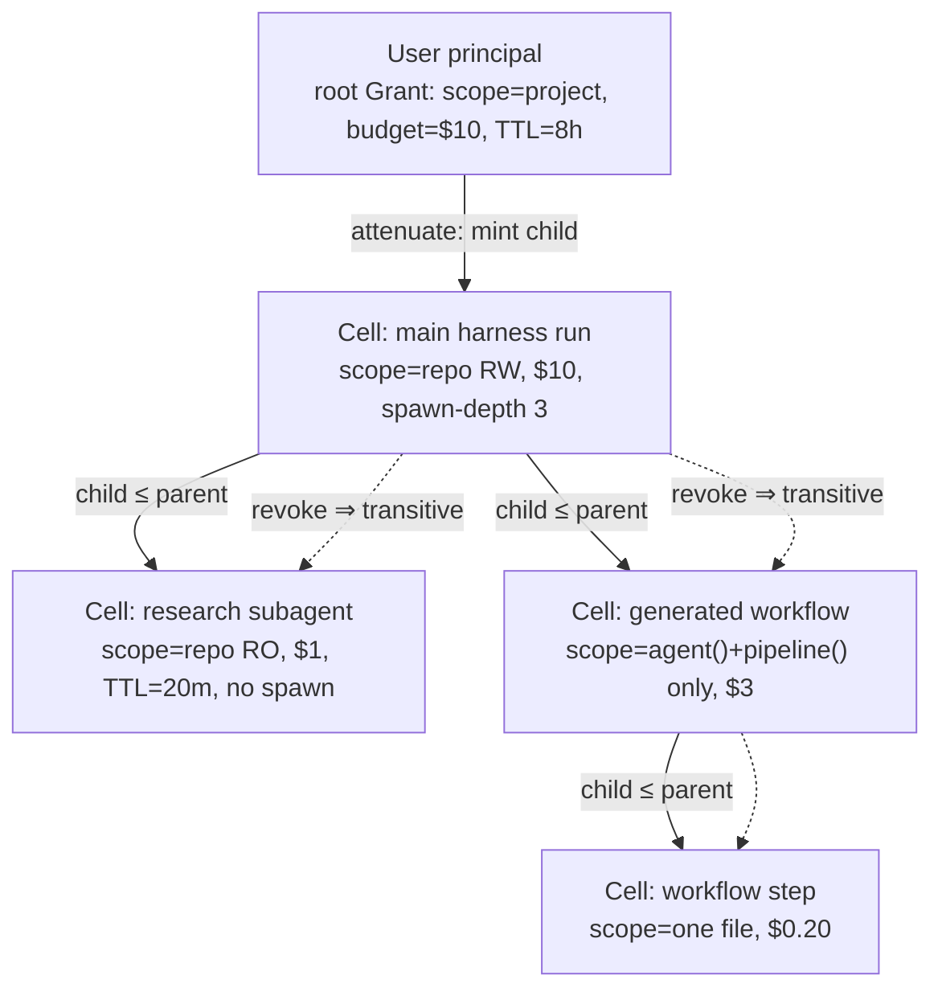
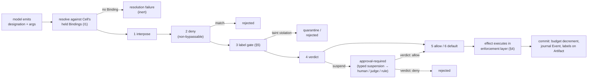

# 11 — Security and Policy

> **Post-review status (2026-08-16).** This document predates the adversarial review; the review's
> binding adjudications live in the Amendment log of `research/DESIGN-SPINE.md` (A1–A14), with the
> full findings in `research/ADVERSARIAL-REVIEW.md`.
> **Applied here:** none. **Adopted but not yet reflected in this document's body:** A3, A6, A8, A12. Where this document conflicts with the Amendment log, **the amendment log governs**; reconciling this body text is tracked as remaining editorial work.


Status: Phase 20 deliverable, written from `research/DESIGN-SPINE.md` (pre-adversarial-review).
Everything in this document not carrying an explicit evidence label is OUR PROPOSAL. Claim
labels and Evidence/Interpretation/Implication/Confidence blocks follow
`research/METHODOLOGY.md`. Vocabulary is spine §2 throughout: *kernel*, *Capability*,
*Binding*, *Invocation*, *Grant*, *Cell*, *Artifact*, *Event*, *harness*, *tool runtime*,
*policy/security layer* are never interchanged.

Position in the doc set: this document specifies the policy/security layer named in spine §2
— object-capability authority (Grants) + the ordered interposition pipeline + taint labels —
as kernel mechanism, not middleware. The objects it governs are defined in
05-KERNEL-PRIMITIVES; the manifest fields it consumes are defined in 06-CAPABILITY-SPEC; the
journal it writes to is defined in 08-EVENT-AND-STATE-MODEL; the context compiler that must
preserve its labels is defined in 09-CONTEXT-AND-MEMORY; the commit-gate verification hook it
feeds is detailed in doc 10; operational failure handling is doc 13.

The design goal in one sentence: **no sequence of model-emitted tokens may cause the
authority held by any Cell to grow.** Everything below is either machinery to make that
invariant structural, or an honest account of what the invariant does not buy.

---

## 1. Threat model

The kernel's trust stance: **the model is an unprivileged principal.** Every model emission —
text, tool-call arguments, generated code, judgments — is untrusted input to the kernel, in
exactly the way syscall arguments are untrusted input to an OS kernel. This is not a claim
that models are adversarial; it is the recognition that a model's output channel is the
composition of everything in its context, and any part of that context may be
attacker-controlled.

| # | Threat | Vector | Observed in the wild (evidence) | Primary kernel counter (section) |
|---|---|---|---|---|
| T1 | Direct prompt injection | Hostile instructions in user input | Copilot cloud agent filters hidden characters in user input against injection (FACT, research/notes/coding-agents-landscape.md) | §3 pipeline, §5 labels (user input is trusted-integrity but still policy-gated) |
| T2 | Indirect prompt injection | Tool results, fetched web content, repo files, subagent outputs carrying instruction-shaped text | Claude Code v2.1.210+ scans subagent final messages for imitation `<system-reminder>` tags, escapes `Human:`/`Assistant:` markers (FACT, research/notes/anthropic-claude-code-agent-sdk.md); FIDES exists because this class is endemic (SOURCE-CODE OBSERVATION, research/notes/microsoft-autogen-sk-agent-framework.md) | §5 structural taint, quarantine, variable-reference hiding |
| T3 | Malicious capability manifests | A manifest declares `readOnly`/benign behavior it does not have; registry poisoning | MCP spec: "clients MUST consider tool annotations to be untrusted unless they come from trusted servers" (FACT, research/notes/mcp-protocol.md) | §7 signing + verification-by-evidence; §4 enforcement independent of declarations |
| T4 | Compromised MCP servers | A previously-good server starts returning poisoned results or rewritten tool descriptions | MCP registry explicitly delegates security scanning; annotations untrusted (FACT, research/notes/mcp-protocol.md) | §5 all southbound results labeled untrusted-integrity by default; §4 egress scoping per Binding |
| T5 | Confused-deputy delegation | A child executor exercises the parent's authority, or credentials minted for one target are replayed against another | MCP SEP-2352 keys client credentials by issuer, "never reuse across servers", named anti-confused-deputy (FACT, research/notes/mcp-protocol.md) | §2 attenuation-on-delegation; §6 audience-bound per-Binding credentials |
| T6 | Model-generated code | Generated orchestration scripts, code-act programs, patches executing with runtime authority | Claude Code dynamic workflows run generated JS in a restricted runtime (no fs, no `import()`) (FACT, research/notes/anthropic-claude-code-agent-sdk.md); OpenAI runs programmatic tool calling in a fresh hosted V8 with no fs/network (FACT, research/notes/openai-agents-sdk-codex.md) | §4 isolate-tier sandboxing; generated code binds only kernel-API capabilities under the spawning Cell's Grant |
| T7 | Exfiltration via observability | Sensitive payloads leaving through traces, logs, third-party trace processors | OpenAI SDK: `trace_include_sensitive_data` defaults to *true*, 30+ third-party processors documented (FACT); Claude Code excludes prompt text from OTel by default (FACT) (research/notes/openai-agents-sdk-codex.md, anthropic-claude-code-agent-sdk.md) | §5 label-driven redaction; exporters are capabilities with confidentiality ceilings |
| T8 | Recursive self-privilege-escalation | The system modifies its own policy/config, or spawns children with wider grants than it holds | Claude Code deny rules and hooks survive `bypassPermissions` precisely because everything else is model-influenceable (FACT, research/notes/anthropic-claude-code-agent-sdk.md) | §2 ocap: grants are not data the model can write; child ≤ parent by construction |
| T9 | Supply chain | Malicious skills/plugins/packages entering via marketplaces or dependency resolution | Copilot cloud agent checks new dependencies against the GitHub Advisory Database and runs secret scanning/CodeQL on agent output (FACT, research/notes/coding-agents-landscape.md) | §7 signed manifests + registry namespace verification; doc 10 commit-gate scanners; §8 honest limits below the kernel |

Two structural observations about this table. First, T2 and T8 are the two threats that no
surveyed system solves structurally: Claude Code's subagent-output scanning is a *text
heuristic bolted at one trust boundary* (§5 replaces it), and every ACL-shaped permission
system in the landscape is one config write away from self-widening (§2 replaces that).
Second, T5–T7 share a shape: authority or data crossing a boundary the policy layer does not
see. The consistent answer is that **every crossing is a kernel event carrying a Grant
reference and labels** — there is no unmediated path.

---

## 2. The object-capability foundation

### 2.1 Grants recap

The Grant (kernel object 7, 05-KERNEL-PRIMITIVES) is an unforgeable, attenuable, revocable
authority reference carrying rights (what) and quantitative budget (how much: tokens, money,
wall-clock, invocations, spawn depth/width, risk class). Grants form a lineage tree; the
kernel decrements budgets at commit. This section states the security invariants that make
Grants the answer to T8, with their evidence.

### 2.2 The five invariants

**I1 — Unforgeability: a Grant is a kernel reference, never a string the model can
fabricate.** The model's output channel is text. When a model "calls a tool," it emits a
*name*. In Kyxo, that name is resolved against the table of Bindings the invoking Cell
actually holds — the model only ever *names bindings the kernel already holds on the Cell's
behalf*. Emitting the name of a Binding the Cell does not hold is a resolution failure, not
an authority question. There is no path from token emission to authority: authority is a
kernel-side reference, designation without possession is inert. This is Cap'n Proto's rule —
capabilities "both designate an object to call and confer permission to call it" (FACT,
research/notes/prior-art-negotiation-extension.md) — split correctly for a world where the
principal can only emit designations.

**I2 — No ambient authority: an empty Cell has no authority.** A freshly created Cell holds
nothing: no tools, no filesystem, no network, no model access. Everything it can do arrives
as Bindings passed by its creator under Grants attenuated from the creator's own. Zircon is
the production precedent: "kernel objects do not have an intrinsic notion of security and do
not do authorization checks; security rights are held by each handle"; "an empty process has
no ambient authority" (FACT, research/notes/prior-art-negotiation-extension.md). The Kyxo
kernel makes the same commitment: kernel objects carry no intrinsic permissions; all
authority is on Grants.

**I3 — Attenuation-on-delegation is mandatory, checked at mint time.** Delegation (spine §2:
invocation of a capability that is itself an orchestrator, under an attenuated grant) mints a
child Grant whose scope, budget, TTL, spawn depth, and risk-class ceiling are each ≤ the
parent's. The kernel refuses to mint otherwise — this is not policy, it is the Grant
constructor's type. seL4's precedent: copies are minted with a *subset* of rights, never
amplified (FACT, research/notes/prior-art-negotiation-extension.md). Budgets ride the same
mechanism as rights: a child's token/money/wall-clock budget is carved out of the parent's,
so the delegation tree is simultaneously the resource-lineage tree (spine §3.7 flags
budgets-as-attenuated-quantitative-rights as our one genuinely novel kernel object).

**I4 — Revocation is transitive over the delegation tree.** Revoking a Grant invalidates
every Grant derived from it, atomically from the kernel's perspective: killing a Cell kills
everything it delegated, however deep. seL4's `seL4_CNode_Revoke` "deletes a capability and
every capability derived from it" (FACT, research/notes/prior-art-negotiation-extension.md).
In-flight Invocations under a revoked Grant transition to `canceled` through the scheduler's
cancellation propagation (08-EVENT-AND-STATE-MODEL); their partial effects remain journaled
and labeled, but no further effect can commit.

**I5 — Interposition is invisible to the holder.** Policy wraps a Binding in a filter — a
recorder, a redactor, a rate-limiter, a sandbox adapter — and the holder cannot distinguish
the wrapped Binding from a direct one. This is seL4's "interpose access" and the WASI
Component Model's "virtualizable imports" (any import can be satisfied by another component,
and the component cannot tell) (FACT, research/notes/prior-art-negotiation-extension.md).
Invisibility matters for security, not just elegance: a model that can detect interposition
can condition its behavior on being observed.

### 2.3 The convergence evidence

```
Evidence       — Four unrelated systems independently converged on identical authority
                 invariants: the E language lineage (designation conveys authority; "ambient
                 authority" coined as the anti-pattern), Cap'n Proto RPC (capabilities as
                 first-class references, possession = authority, attenuation via membranes),
                 seL4 (unforgeable tokens, mint-with-subset-of-rights, transitive revoke,
                 formally verified on top of this model), Fuchsia/Zircon (rights on handles,
                 no kernel-side authorization checks, no ambient authority in an empty
                 process). All FACT, research/notes/prior-art-negotiation-extension.md.
Interpretation — A language, an RPC protocol, a verified microkernel, and a production OS
                 arriving at the same five invariants under unrelated pressures is the
                 strongest convergence signal in the entire research program (the note calls
                 it exactly that). These invariants are not a school of thought; they are
                 what authority looks like when delegation is the dominant operation.
Implication    — Grants adopt the invariants wholesale. Delegation-heavy workloads are
                 Kyxo's defining workload (every subagent spawn, every remote executor,
                 every generated workflow is a delegation), so the authority model must be
                 the one that composes under delegation.
Confidence     — HIGH.
```

### 2.4 Why ACL / policy-engine-only designs fail the test

The test: *can any sequence of model outputs cause a Cell's authority to grow?* Run every
surveyed permission system through it:

- **Rule engines over tool names** (Gemini CLI's TOML rules, OpenCode rulesets, Continue
  per-tool policies — SOURCE-CODE OBSERVATION, research/notes/coding-agents-landscape.md)
  adjudicate calls, but the rules are *files in the workspace the system can often edit*, and
  the authority being adjudicated is ambient (the process's own credentials and network). A
  model that can write config, or convince a human to, widens itself. Claude Code's designers
  understood this: deny rules and hooks are non-bypassable precisely because every other
  stage is influenceable (FACT, research/notes/anthropic-claude-code-agent-sdk.md) — an ocap
  instinct retrofitted onto an ACL design.
- **Central policy evaluation** (Kubernetes RBAC as the canonical instance) requires a
  policy-database write for every delegation, and evaluation cost/centralization scale
  poorly with delegation depth (INFERENCE/MEDIUM,
  research/notes/prior-art-negotiation-extension.md). The prior-art note's summary is the
  design rule: across seL4, Zircon, Cap'n Proto, and Plan 9 namespaces, "delegation =
  handing a narrower reference, never editing a policy database" (FACT-supported synthesis,
  same note).
- **Feature declarations are not authority.** MCP's capability objects are feature-support
  declarations; authority lives entirely in OAuth scopes and host policy — MCP "proves you
  can defer it to OAuth, and also shows the cost: no protocol-level budgets, leases, or
  fine-grained grants" (FACT + INFERENCE/HIGH, research/notes/mcp-protocol.md). A kernel
  cannot defer: it owns delegation, so it must own attenuation.

Under Grants, the test passes structurally: the model can only name Bindings its Cell holds
(I1); a Cell starts empty (I2); minting requires a parent Grant with a superset (I3); and
policy state that *could* widen authority (the pipeline definitions of §3) is itself reachable
only through capabilities that agent-facing Cells are never granted. Privilege escalation
requires a principal that already holds the privilege — which is the definition of not being
an escalation.

### 2.5 The delegation tree



Every edge is a kernel-minted attenuation; every node's authority is exactly its incoming
Grants; revoking any edge severs the whole subtree. The same tree carries budget lineage and
— per §6 — is the audit trail.

---

## 3. The policy pipeline

### 3.1 Shape

The policy pipeline is one of the kernel's two mechanisms (spine §3): **an ordered set of
declarative stages, evaluated at bind time and again at every effectful invocation.** Grants
answer "may this authority exist here at all"; the pipeline answers "may this particular use
proceed, and under what transformation." Both are required: Grants without a pipeline cannot
express contextual rules ("this write is fine, that write needs a human"); a pipeline without
Grants adjudicates ambient authority and fails §2.4.

Stage classes, in evaluation order:

| Order | Stage class | Verdicts | Bypassable by profile? |
|---|---|---|---|
| 1 | **Interpose** | wrap/observe/transform the Binding (invisible to holder, I5) | no (but stages are additive, not gating) |
| 2 | **Deny** | hard block; at bind time, removes the Binding from the offered surface entirely | **never** |
| 3 | **Label gate** | block/quarantine based on taint labels of arguments and target (§5) | never |
| 4 | **Verdict** | suspend the Invocation pending a decision by a named principal (§3.3) | configurable per risk class |
| 5 | **Allow** | positive match short-circuits to proceed | yes |
| 6 | **Default** | profile's default disposition (proceed / ask / deny) | yes — this *is* the profile |

Two evaluation points, deliberately: **bind-time** evaluation shapes what exists (a deny
stage matching at bind removes the capability from the negotiated surface, so the model never
sees it — the cheapest possible enforcement), and **invocation-time** evaluation judges each
effectful use with full argument and label visibility. Read-class invocations may be
fast-pathed by policy; effectful ones may not.

### 3.2 Evidence for the shape

```
Evidence       — Claude Code evaluates every tool call through a fixed six-step pipeline:
                 hooks → deny rules → ask rules → permission mode → allow rules → canUseTool
                 callback. Deny rules and hooks apply even in bypassPermissions mode.
                 Bare-name deny rules remove the tool definition from the request entirely —
                 the model never sees the tool (all FACT,
                 research/notes/anthropic-claude-code-agent-sdk.md). Gemini CLI ships a
                 priority-ordered TOML rule engine (allow|deny|ask); OpenCode uses
                 last-match-wins rulesets; both layer defaults < user < session approvals
                 (SOURCE-CODE OBSERVATION, research/notes/coding-agents-landscape.md).
Interpretation — Ordered pipelines with a non-bypassable deny class are convergent practice,
                 and the strongest implementation (Claude Code) discovered both key rules:
                 (a) some stages must survive every mode, or modes become escalation paths;
                 (b) denial is cheapest when applied to the offered surface, not the call.
                 "Modes" (plan, acceptEdits, bypass) are just profiles selecting stage
                 dispositions — the landscape note reaches the same verdict for plan mode
                 across four systems ("a policy profile, not an architectural construct",
                 INFERENCE/HIGH, research/notes/coding-agents-landscape.md).
Implication    — Kyxo makes the pipeline itself declarative data (a Kind, versioned and
                 auditable), makes deny-class stages structurally non-bypassable, and models
                 permission modes as profiles over stage dispositions rather than kernel
                 states.
Confidence     — HIGH.
```

### 3.3 Approval generalized: one verdict primitive

Every surveyed system independently built "an effect blocks until someone decides":

```
Evidence       — OpenAI Agents SDK: needs_approval → NextStepInterruption → serialized
                 RunState → approve/reject → resume (SOURCE-CODE OBSERVATION + FACT,
                 research/notes/openai-agents-sdk-codex.md). Codex: server→client RPCs
                 execCommandApproval / applyPatchApproval whose responses come from the
                 client; AskForApproval {UnlessTrusted, OnRequest, Granular, Never} (FACT /
                 SOURCE-CODE OBSERVATION, same note). MAF: ctx.request_info() typed
                 request/response ports, pending requests persisted inside checkpoints
                 (SOURCE-CODE OBSERVATION, research/notes/microsoft-autogen-sk-agent-framework.md).
                 MCP: MRTR input_required results with sealed, integrity-protected
                 requestState continuations (FACT, research/notes/mcp-protocol.md). A2A:
                 TASK_STATE_AUTH_REQUIRED with escalation chaining up the delegation chain
                 (FACT, research/notes/a2a-protocol.md).
Interpretation — Five independent designs, one shape: a typed suspension of an effect,
                 resolvable by an external decision, resumable across process boundaries.
                 The OpenAI note states the generalization exactly: "any effect may block on
                 a policy verdict from any principal (human, guardian model, execpolicy
                 rule)" (INFERENCE/HIGH).
Implication    — Kyxo has ONE verdict primitive. The Invocation lifecycle's interrupted
                 class (approval-required / auth-required / input-required /
                 budget-exceeded, spine §3.3) is that primitive; a Verdict-class pipeline
                 stage parks the Invocation with a typed suspension payload naming the
                 principal whose verdict is required. Humans, guardian models, and rule
                 engines are all capabilities that can hold the verdict role; suspensions
                 persist in Checkpoints (MAF's proof this composes with durability);
                 escalation up the Grant lineage reuses A2A's chaining pattern for
                 budget-exceeded and approval-required alike.
Confidence     — HIGH.
```

### 3.4 Policy handlers are capabilities — including model judges, with a hard caveat

Because pipeline stages dispatch to handlers, and handlers are invocable, **policy handlers
are themselves Capabilities** — a shell predicate, an HTTP endpoint, a rule engine, a human,
or a model. The precedent is live: Claude Code's hook system has `prompt` and `agent` handler
types (an LLM as policy evaluator) and its `auto` permission mode uses a model classifier
(FACT, research/notes/anthropic-claude-code-agent-sdk.md); MAF's harness terminates loops on
an LLM judge's structured verdict (SOURCE-CODE OBSERVATION,
research/notes/microsoft-autogen-sk-agent-framework.md).

The caveat is non-negotiable: **model-adjudicated policy is advisory-tier. A model verdict is
never the only gate on an irreversible action.** A model judge is a model — subject to the
same injection surface (T1/T2) and the same correlated failure modes as the principal it
judges. Capability manifests declare a risk class (06-CAPABILITY-SPEC); Grants carry a
risk-class ceiling (§2); and the pipeline enforces the tiering rule: for
irreversible/destructive-class effects, at least one Verdict stage must resolve to a
deterministic rule or a human principal. Model judges may *add* denials anywhere and may be
the sole gate only for reversible effects. Claude Code exhibits the same instinct in ACL
form: even in the model-adjudicated `auto` mode, deny rules still bind (FACT,
research/notes/anthropic-claude-code-agent-sdk.md).



---

## 4. Enforcement layering: the ceiling is credentials + egress + sandbox

### 4.1 Three layers, honestly ranked

Everything above this section adjudicates *requests*. A sufficiently confused or injected
system component will eventually make a request the pipeline wrongly allows, or find a path
the pipeline does not mediate. The question that decides real-world containment is: **what
can the process physically do when policy fails?** The landscape gives an unambiguous
answer about where that ceiling lives:

```
Evidence       — Copilot cloud agent enforces its guarantees below the harness: pushes are
                 restricted to a single copilot/* branch by credential design ("cannot
                 directly run git push"); it can open only draft PRs and cannot
                 approve/merge; the requester cannot approve (preserving required-reviewer
                 semantics); a default-on egress firewall bounds the network; CodeQL,
                 advisory-database, and secret-scanning run as platform stages on the output
                 (all FACT, research/notes/coding-agents-landscape.md). The landscape note's
                 synthesis: "real enforcement lives in credentials and network, not prompts
                 — the kernel's policy layer must bind to capability grants (what tokens/
                 egress the environment holds), not just tool-call filtering."
Interpretation — Tool filtering is context-shaping — valuable for guiding the model and for
                 cheap denial, but it is the weakest layer: it constrains what the model is
                 offered, not what the process can do. The enforcement ceiling is set by
                 (a) which credentials exist in the environment and what they are scoped to,
                 (b) what the network permits, (c) what the sandbox permits.
Implication    — Kyxo Grants must COMPILE DOWN to these three backends, not merely gate
                 calls: a Grant's scope materializes as short-lived, audience-bound
                 credentials minted at the boundary (never long-lived secrets in the
                 environment); its network rights compile to egress-proxy allowlists for
                 the Cell's sandbox; its filesystem/process rights compile to the sandbox
                 profile. A Grant that cannot be compiled to an enforcement backend is
                 flagged as advisory at bind time — the kernel never lets declared policy
                 silently exceed enforced policy.
Confidence     — HIGH.
```

### 4.2 Sandbox tiers behind a declarative enum

```
Evidence       — Codex separates intent from mechanism as a two-axis matrix: AskForApproval
                 {UnlessTrusted, OnRequest, Granular, Never} × SandboxPolicy
                 {DangerFullAccess, ReadOnly, WorkspaceWrite, ExternalSandbox}, with
                 mechanisms (macOS Seatbelt, Linux Landlock+seccomp, bwrap) hidden behind
                 the enum and ExternalSandbox as the "already isolated" passthrough;
                 workspace-write disables network by default (FACT / SOURCE-CODE
                 OBSERVATION, research/notes/openai-agents-sdk-codex.md). Claude Code uses
                 Seatbelt / bubblewrap+socat+optional seccomp with a domain-allowlisted
                 egress proxy (FACT, research/notes/anthropic-claude-code-agent-sdk.md).
                 MAF runs code-act in a Hyperlight WASM micro-VM or the Monty interpreter,
                 with registered tools callable from inside the sandbox but not exposed
                 as direct agent tools (SOURCE-CODE OBSERVATION,
                 research/notes/microsoft-autogen-sk-agent-framework.md). OpenAI runs
                 model-emitted programs in a fresh hosted V8 with no fs/network and
                 tool access restricted to allowed_callers opt-in (FACT,
                 research/notes/openai-agents-sdk-codex.md).
Interpretation — The industry converged on: a small declarative policy surface, per-platform
                 mechanism plugins beneath it, a passthrough tier for pre-isolated
                 environments, and — for model-generated code specifically — isolate-tier
                 sandboxes whose ONLY imports are explicitly passed tool bindings. That last
                 pattern is ocap discipline reinvented at the sandbox boundary.
Implication    — Kyxo's execution-environment capabilities declare a sandbox tier enum:
                 `none` (trusted stdlib code in-process) · `os` (Seatbelt / Landlock+seccomp
                 / bubblewrap per platform) · `isolate` (WASM/Hyperlight/V8-class, for
                 code-act and untrusted plugins; imports = passed Bindings only, aligning
                 with the WASM-component extension path in spine §8) · `external`
                 (passthrough for environments isolated by the host: cloud VMs, Actions
                 runners). The Binding records which tier was satisfied; policy can require
                 a minimum tier per risk class. Mechanisms are per-platform plugins;
                 the tier contract, not the mechanism, is the portable surface.
Confidence     — HIGH.
```

### 4.3 Secrets never transit the runtime

Secrets get a dedicated design because they are the one data class where "labeled and
policy-gated" is not good enough — the correct amount of secret material in model context,
journals, and sandboxes is zero.

- **Sentinel substitution + proxy re-injection.** Inside sandboxes, credentials are replaced
  with per-session sentinels; the egress proxy re-injects real values only for allowlisted
  hosts (requiring TLS termination at the proxy; re-signing where needed). This is Claude
  Code's shipped mechanism (FACT, research/notes/anthropic-claude-code-agent-sdk.md). Kyxo
  adopts it as the standard tool-runtime posture: the Cell computes with sentinels; the
  Grant→credential compilation of §4.1 happens at the proxy, so possession of the sandbox
  never equals possession of the secret.
- **Environment hygiene by default.** Codex's shell environment policy excludes
  `*KEY*`/`*SECRET*`/`*TOKEN*` globs by default and adds extra protection for `.git`/`.env`
  (FACT, research/notes/openai-agents-sdk-codex.md). Kyxo's default execution-environment
  profile does the same; the environment a Cell sees is constructed (Plan 9-style, a mounted
  namespace), not inherited.
- **Form-vs-URL elicitation.** When a capability needs a secret from the human, it must use
  the URL elicitation mode — the user completes the sensitive interaction out-of-band and
  the secret never passes through the runtime. MCP standardized exactly this split and made
  it normative: "Servers MUST NOT collect secrets via form mode" (FACT,
  research/notes/mcp-protocol.md). Humans-as-capabilities in Kyxo (spine §5) inherit the
  split: form elicitation for data, URL elicitation for credentials, and the resulting
  authority arrives as a Grant referencing a vault-held credential — never as a value in an
  Artifact.

---

## 5. Taint and provenance as a kernel invariant

### 5.1 The mechanism

Every Artifact and every context fragment carries **integrity** (trusted / untrusted, with
source principal) and **confidentiality** (public / private / user-identity, extensible via
Kinds) labels, plus provenance (producing Invocation, inputs). Propagation is **structural**:
an Invocation's outputs are labeled with the join of its inputs' labels; the context compiler
(09-CONTEXT-AND-MEMORY) preserves labels through compilation, so the compiled per-invocation
view knows which spans came from where; compaction and memory writes propagate joins.
Declassification — lowering a label — is itself a capability, requiring a Grant and, for
integrity upgrades, Evidence artifacts through the commit gate (doc 10). Southbound results
(MCP servers, web fetches, remote executors) default to untrusted integrity; only manifest-
or policy-designated trusted sources start higher.

The label gate (§3, stage 3) is where labels become enforcement: untrusted-integrity content
cannot flow into the argument position of an effectful Invocation, and content above a
Binding's confidentiality ceiling cannot flow out through it, unless a quarantine or
declassification path intervenes.

### 5.2 Evidence: productization on one side, retrofit on the other

```
Evidence       — MAF ships FIDES (~2,950 lines, ADR-recorded): IntegrityLabel
                 TRUSTED/UNTRUSTED and ConfidentialityLabel PUBLIC/PRIVATE/USER_IDENTITY on
                 content; LabelTrackingFunctionMiddleware propagates labels and
                 automatically hides UNTRUSTED content behind variable references (var_xxx
                 indirection via a ContentVariableStore); PolicyEnforcementFunctionMiddleware
                 deterministically blocks violating tool calls including
                 max_allowed_confidentiality exfiltration prevention; quarantined_llm runs
                 isolated model calls over labeled data; MCP tool results carry per-result
                 _meta.ifc labels that are parsed and enforced (SOURCE-CODE OBSERVATION,
                 research/notes/microsoft-autogen-sk-agent-framework.md). On the other side:
                 Claude Code, lacking labels, scans subagent final messages for
                 instruction-shaped patterns — neutralizing imitation <system-reminder>
                 tags, flagging permission-config mentions, escaping Human:/Assistant:
                 markers (FACT, research/notes/anthropic-claude-code-agent-sdk.md).
Interpretation — The same problem, solved twice: FIDES is information-flow control carried
                 by the data plane (deterministic, boundary-enforced); Claude Code's scanner
                 is a pattern heuristic at one trust boundary, added in a point release —
                 the retrofit shape. The MAF note draws the kernel-relevant conclusion
                 itself: "retrofitting it as middleware works but is per-framework; making
                 it a kernel invariant is the differentiator." The Claude Code note agrees
                 from the other direction: "carry provenance/taint metadata on every message
                 and artifact rather than pattern-scanning text after the fact"
                 (INFERENCE/HIGH in both notes).
Implication    — Kyxo makes labels a property of the Artifact and Event objects themselves
                 (spine §3.5), not middleware: every crossing is labeled because unlabeled
                 crossings do not exist. Subagent output handling becomes automatic — a
                 child Cell's result Artifact carries untrusted-or-joined integrity and its
                 full provenance, and the parent's context compiler renders it inertly
                 (data, not instructions) or behind a variable reference per FIDES.
                 Instruction-shaped-text scanning survives only as an optional
                 defense-in-depth interposer, never the mechanism of record.
Confidence     — HIGH for the mechanism; MEDIUM for how much utility survives conservative
                 label joins in long chains (see §8).
```

### 5.3 Quarantine and variable-reference hiding

Two FIDES moves are adopted as kernel-supported patterns. **Variable-reference hiding**: the
context compiler can replace an untrusted span with an opaque reference (`var_ref`), so the
model can route and reason *about* the content ("summarize var_17 into the report") without
the content's text entering the reasoning context that drives effectful calls.
**Quarantined invocation**: a model Invocation flagged quarantined may dereference untrusted
content, but its own outputs are labeled untrusted and its Binding set is restricted to
non-effectful capabilities — an untrusted-input, untrusted-output enclave. Together these
give the CaMeL/FIDES-lineage guarantee: untrusted text can be processed, but there is no
label-respecting path from untrusted text to a privileged effect without an explicit,
granted, journaled declassification.

### 5.4 Label-driven redaction in observability

Observability (spine §2) is projections of the journal, and the journal is two-tier —
payloads live in content-addressed storage, Events carry references. This makes T7
tractable: **exporters are capabilities with a confidentiality ceiling in their Grant**, and
projection applies label-driven redaction — an OTel exporter granted `public` receives
structure, timings, actor IDs, and hashes, never `private`/`user-identity` payloads. The
divergent defaults in the field — Claude Code excludes prompt text from telemetry by
default, the OpenAI SDK includes sensitive data by default with 30+ third-party processors
attachable (both FACT, research/notes/anthropic-claude-code-agent-sdk.md,
research/notes/openai-agents-sdk-codex.md) — show why this must be labeled policy rather
than exporter etiquette: the safe behavior must be the structural one, chosen per exporter
Grant, not a flag each integration remembers or forgets.

---

## 6. Identity model

### 6.1 Principals

Kyxo separates principals that current systems conflate. Each has distinct identity, and no
mechanism treats them interchangeably:

| Principal | Identity | Why separate |
|---|---|---|
| **User** | authenticated human; consent/approval metadata is non-negotiable (spine §5) | the only source of certain verdicts; responsibility must be attributable |
| **Operator** | the runtime deployment owner (managed policy tier) | operator policy binds even against the user (cf. Claude Code managed settings, FACT, research/notes/anthropic-claude-code-agent-sdk.md) |
| **Objective** | the Kind instance work is performed under | budgets and audit aggregate per objective, not per session |
| **Cell** | keyed execution scope | the actor of Events; the unit of delegation and revocation |
| **Capability provider** | manifest identity, signer (§7) | supply-chain attribution; telemetry keys to provider×version |
| **Binding / Invocation** | sealed negotiation result; single use with idempotency key, correlation and causation IDs | per-use accountability; exactly-once accounting |
| **Remote system** | A2A card identity / MCP server identity (CIMD) / provider runtime | trust decisions differ per remote principal; credentials are audience-bound per remote |

Every Event in the journal carries actor IDs alongside correlation/causation IDs (spine
§3.4). Because delegation only happens by Grant minting (§2), and every effect is an
Invocation Event naming its Grant, **the delegation lineage tree cross-referenced with the
causation chain *is* the audit trail** — "which principal, holding which authority derived
from whom, caused this effect" is a journal query, not a forensic reconstruction. No
surveyed system can answer that question today; the A2A note lists cross-agent attribution
as an unsolved, hand-rolled concern in the ecosystem (OBSERVED BEHAVIOR/MEDIUM,
research/notes/a2a-protocol.md).

### 6.2 Mapping to MCP and A2A at the edges

Kyxo does not invent wire-level auth; it projects Grants onto the two standardized planes:

- **MCP (southbound tools).** MCP servers are OAuth 2.1 resource servers; clients MUST send
  RFC 8707 resource indicators, servers MUST validate audience binding and "MUST NOT accept
  or transit any other tokens"; SEP-2352 keys client credentials by issuer, never reused
  across servers; CIMD makes client identity a dereferenceable URL (all FACT,
  research/notes/mcp-protocol.md). These are the external analogs of Kyxo invariants:
  audience binding ≈ non-transferable Grants; no-token-passthrough ≈ no authority laundering
  across a Binding; per-issuer credentials ≈ per-remote-principal identity (T5). The MCP
  client capability holds credentials in the vault (§4.3), scoped per server principal, and
  MCP's step-up scope flow (incremental consent on `insufficient_scope`) maps onto our
  `auth-required` suspension: the escalation surfaces as a typed verdict request to the
  principal that can consent — the user, via elicitation.
- **A2A (federation edge).** A2A puts identity entirely at the transport layer, declares
  requirements via card security schemes, supports per-skill `security_requirements`, and
  models mid-task authorization needs as `AUTH_REQUIRED` interruptions that chain up the
  delegation path (all FACT, research/notes/a2a-protocol.md). Kyxo's Invocation algebra
  already generalizes that chaining (spine §3.3): a remote executor's `AUTH_REQUIRED`
  becomes a typed suspension propagating up our Grant lineage to whichever principal holds
  the needed authority — the same primitive as approval and budget escalation (§3.3), which
  is exactly the generalization the A2A note recommends ("generalize the pair
  {interrupted-state, typed-requirement-payload} rather than hardcoding auth",
  INFERENCE/HIGH). Where A2A concedes the escalation payload semantics are undefined
  (§7.6.4), the Kyxo envelope types them.

---

## 7. Trust in remote and opaque capabilities

Remote executors are opaque by design — A2A standardizes delegation while specifying
*nothing* about the peer's internals (FACT, research/notes/a2a-protocol.md). Introspection
is therefore not available as a trust mechanism. Kyxo's substitute has three parts:

**Signed manifests.** Capability manifests (06-CAPABILITY-SPEC) may carry detached JWS
signatures over an RFC 8785 (JCS) canonicalization — precisely A2A's card-signing design,
the one integrity primitive that protocol ships (FACT, research/notes/a2a-protocol.md) —
with registry namespace ownership verified DNS/GitHub-style as in the MCP registry (FACT,
research/notes/mcp-protocol.md). Signatures authenticate *origin and claim integrity*, not
behavior: a signed manifest proves who said it, never that it is true (T3 remains open at
this layer; see §8).

**Enforced vs. advisory claims, and tenant scoping.** A2A's card design splits
machine-enforced protocol capabilities (violations produce typed errors) from advisory
skills (routing hints, never a contract) (FACT, research/notes/a2a-protocol.md). Kyxo's
manifests keep that split explicit per axis: enforced axes participate in Binding
negotiation and their violation is a Binding fault; advisory axes inform routing only.
A2A 1.0's `tenant` routing field is honored and mirrored: Bindings to multi-tenant remote
endpoints are tenant-scoped, and the tenant ID participates in credential audience binding.

**Verification by evidence, not introspection.** The contract has three information sources
(spine C3): declared manifest (what the provider claims), probe results (what we verified —
first-class, cacheable Evidence artifacts from conformance/capability probes, spine §4), and
outcome telemetry (what actually worked, per capability×model pair). Declarations gate
*eligibility*; probes and telemetry drive *selection* and can demote a provider without any
protocol event. The precedents: Copilot's EditToolLearningService measuring per-model
edit-tool success windows (SOURCE-CODE OBSERVATION, research/notes/coding-agents-landscape.md)
and MCP's conformance-scenario-gated SEP process (FACT, research/notes/mcp-protocol.md) —
empirical verification is how mature systems handle claims they cannot inspect.

One further consequence of opacity (spine §5): provider-side execution domains — the
Responses API storing state and running hosted tools server-side is the leading case
(FACT/INFERENCE-HIGH, research/notes/openai-agents-sdk-codex.md) — are modeled as **remote
Cells with mirrored artifacts, budgets, and policy**, because any effect the kernel does not
mediate is an effect the pipeline, labels, and audit trail silently miss. Everything a remote
executor returns enters as untrusted-integrity Artifacts (§5.1); its authority over us is
whatever Grant we attached to the Binding, and nothing more.

---

## 8. Residual risks — what this design does not solve

Stating limits precisely is part of the contract. Each row: the risk, why the design does
not close it, and the posture we take.

| # | Residual risk | Why unsolved | Posture |
|---|---|---|---|
| R1 | **Model deception / misaligned intent** | Ocap bounds *authority*, not *intent*. A model pursuing the wrong goal inside its granted scope is invisible to every mechanism here; the kernel bounds blast radius, not judgment. | Least-authority defaults, risk-class ceilings, out-of-loop verification (doc 10), and human verdicts on irreversibility. Explicitly a mitigation, not a solution. |
| R2 | **Semantic injection surviving labels** | Labels stop untrusted text from *reaching privileged argument positions*; they do not stop untrusted text from *persuading* within permitted flows. A quarantined summary of a hostile document is trusted-path text whose content is still attacker-influenced. Declassification points concentrate exactly this risk. | Conservative joins by default; declassification requires Grants + Evidence; quarantine restricts effect reach. INFERENCE/MEDIUM that this materially reduces, does not eliminate, T2. |
| R3 | **Revocation vs. checkpoint resurrection** | Transitive revocation (I4) conflicts with Checkpoints that embed Grant references: restoring a Checkpoint could resurrect revoked authority; the prior-art note flags this as an open question (research/notes/prior-art-negotiation-extension.md, open question 3). | V1 proposal: Checkpoints store *petname-style Grant designators*, re-resolved against the live Grant tree at resume under current policy — safer, admittedly weaker than pure ocap (a resumed Cell may find authority gone and must handle `rejected` bindings). Flagged for adversarial review. |
| R4 | **Taint coarsening under compaction/summarization** | A summary of 50 mixed-label fragments joins to the worst label; long-running Cells trend toward everything-untrusted-and-private, and the workload migrates into declassification requests. No surveyed system has field data on sustained IFC utility in agentic loops (FIDES adoption unknown — open question in research/notes/microsoft-autogen-sk-agent-framework.md). | Span-level labels in compiled context (not document-level) to slow coarsening; measure declassification rates in the prototype; accept that labels may need granularity tuning. Confidence in long-run utility: MEDIUM. |
| R5 | **Judge-model correlated failure and approval fatigue** | Guardian models share training-distribution failure modes with the models they judge; human verdict principals under volume rubber-stamp (observed across every approval UX in the landscape). | Advisory tier for model verdicts (§3.4); verdict-rate budgets and escalation policies on human capabilities; diversity of verdict principals is configuration, not guarantee. |
| R6 | **Covert channels** | Budget consumption, invocation timing, event cadence, and error patterns are observable by anything watching derived streams and can encode information across confidentiality boundaries. Classical IFC does not close timing channels; neither do we. | Documented non-goal for V1. Exporter Grants (§5.4) bound the *audience* of derived streams, which is the practical mitigation. |
| R7 | **Supply chain beneath the kernel** | The kernel's own dependencies, the sandbox implementations, model weights, and the signing infrastructure are all below the mechanisms defined here; a compromised Seatbelt profile or WASM runtime voids §4. | Standard software-supply-chain hygiene (pinning, provenance attestation, minimal kernel deps per spine §8's minimality discipline). Out of scope of this document's mechanisms; in scope of engineering practice. |
| R8 | **Manifest truthfulness** | Signing (§7) proves origin; probes and telemetry narrow the declared-vs-actual gap but sample it, never close it (spine C3: declared capability ≠ competence — and ≠ honesty). A provider can behave until it matters. | Enforcement independence (§4): a lying manifest meets the credential/egress/sandbox ceiling, which never trusted the manifest. Blast radius of a malicious capability = its Grant, exactly. |

The honest summary: this design makes privilege escalation structural rather than
probabilistic, makes injection a labeled-dataflow problem rather than a text-heuristic
problem, and makes every effect attributable to a principal and a Grant lineage. It does not
make the model trustworthy, and no mechanism in this document should be described as if it
did. The kernel's promise is bounded blast radius with a complete audit trail — that is the
whole promise, and it is enough to be worth building because (spine §6) nobody else owns it.
