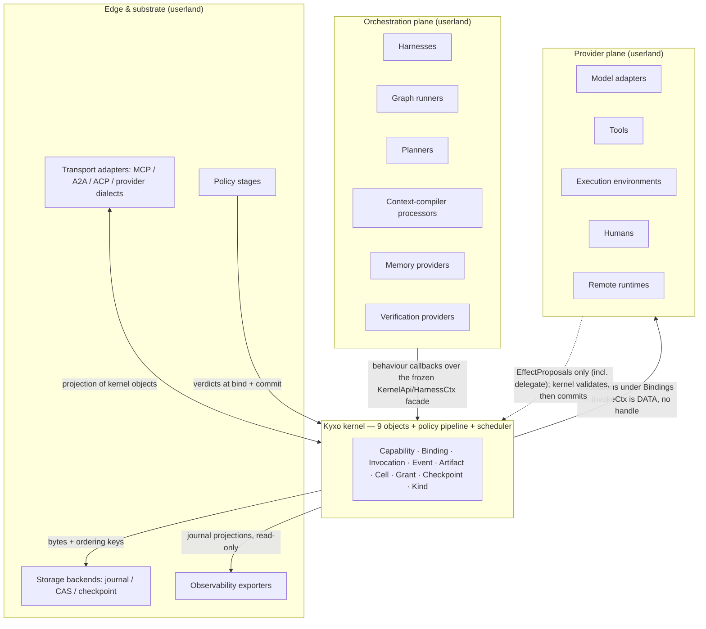

# 12 — Extension Model

> **Post-review status (2026-08-16, phase 2).** This document predates the adversarial review; the
> review's binding adjudications live in the Amendment log of `research/DESIGN-SPINE.md` (A1–A14),
> with the full findings in `research/ADVERSARIAL-REVIEW.md`. Since phase 2 the **executable
> semantics** in `prototypes/kernel-semantics/` — normative prose in `docs/17-KERNEL-SEMANTICS.md`
> and `docs/18-KERNEL-INVARIANTS.md` — supersede prose wherever the two disagree.
> **Applied here:** A5 (§2, §4.4, §6 rule 3 and its cost paragraph), A10 (§1, §1.1, §4.4), plus
> the GREASE-vs-signature resolution in §4.5; A2, A4 and A12 corrected where this document still
> described superseded or over-broad kernel behavior (§1 table, §1.1, §1.2, §1.3, §1.8, §2.1) —
> see the Revision record at the foot of this document. **Outstanding:** none known.
> Where this document conflicts with the Amendment log or the executable semantics, **those
> govern**.


Status: written from `research/DESIGN-SPINE.md` (pre-adversarial-review). Everything in this
document not carrying an explicit evidence label is OUR PROPOSAL. Claim labels and confidence
levels follow `research/METHODOLOGY.md`. Vocabulary is the spine §2 vocabulary and is used
exactly; see 05-KERNEL-PRIMITIVES.md for definitions.

Companion documents: 06-CAPABILITY-SPEC.md (the manifest and axis grammar this document's
surfaces declare against), 04-ORCHESTRATION-MODELS.md and 10-HARNESS-AND-GRAPH-RUNTIME.md
(the orchestration-strategy surfaces in depth), 08-EVENT-AND-STATE-MODEL.md (journal and
checkpoint semantics the storage surface implements), 09-CONTEXT-AND-MEMORY.md (context
compiler and memory system). Failure semantics live in 08-EVENT-AND-STATE-MODEL.md §7 and,
normatively since phase 2, in 17-KERNEL-SEMANTICS.md §§5–9 and 19-CRASH-RECOVERY-MODEL.md;
the verification commit gate is ADR-012 in `16-ADR/`. *(These three references previously
pointed at "13, failure semantics" and "16, the verification deliverable" — doc 13 is the
future-scenario test and 16 is the ADR directory. Corrected here and at the two use sites.)*

---

## 0. Stance

The Kyxo kernel admits nine objects and two mechanisms (spine §3) under Liedtke's minimality
test. Everything else — every model adapter, tool, harness, graph runner, planner, policy
stage, storage engine, protocol edge, context processor, memory provider, verifier, and
exporter — arrives through the extension model described here. This is not a plugin annex
bolted onto a complete product; it is how the runtime acquires *all* of its function. The
kernel's job is to make extension cheap, governed, and non-catastrophic; the extension
model's job is to make sure the minimal core does not decay into either a monolith (features
leaking inward) or a fragmented bazaar (Wayland's fate — §6).

Two consequences are worth stating as decisions, with their costs:

- **There is no privileged extension class.** The standard capabilities shipped with the
  Kyxo runtime (the tool runtime, the default reactive harness, the SQLite/JSONL storage
  backend) use the same contracts, the same Grants, and the same stability metadata as
  third-party extensions. Cost: the runtime team pays the full contract tax on its own
  components and cannot take shortcuts through private kernel APIs. This is deliberate — the
  Codex per-release SQ/EQ drift (spine §8) is what happens when the first-party surface is
  exempt from its own protocol.
- **Extension contracts are versioned data, not code linkage.** A plugin binds to a
  date-versioned kernel protocol and a semver'd contract schema, never to a kernel build.
  Cost: a serialization boundary everywhere, and the crossing-cost problem (Mach's failure
  mode) that spine §8 defers by making the in-process V1 crossing a reference pass.

---

## 1. The extension surfaces, enumerated

Ten surfaces. Each row names the contract the extension implements, and — as important —
the hard boundary: what it can never touch. The boundaries are enforced structurally
(Grants, isolation hosts, journal ownership), not by convention.

| # | Surface | Implements | Touches | CANNOT touch |
|---|---|---|---|---|
| 1 | Capability providers (model adapters, tools, execution environments, humans, remote runtimes) | Capability manifest (06) + invocation contract | The **data** handed to it in `InvokeCtx`; the effect *proposals* it yields (artifact, state, usage, external, evidence, delegate); typed suspension payloads | **Any kernel handle at all** — `InvokeCtx` is data-only (A4); the journal; Grants (cannot mint, widen, or resolve); other cells' state; the policy pipeline |
| 2 | Orchestration strategies (harnesses, graph runners, planners, supervisors) | Behaviour contract (OTP-style callbacks) over the frozen `KernelApi`/`HarnessCtx` facade (A4) | Its cell's state; invocation spawning; checkpoint requests | Journal writes (yield-is-commit only); budget arithmetic (the kernel reserves and settles); cancellation delivery; other cells; verbs outside the frozen list |
| 3 | Policy stages | Declarative stage contract in the policy pipeline | Read: invocation + binding + grant + labels; return: allow/deny/escalate/transform/require-Evidence | Grant widening (attenuate only); the deny-class stages above it; journal suppression — a stage can never suppress the record of its own verdict (which *plane* an allow-path trace lands on is a policy-class knob, A12: advisory by default, truth in the regulated profile; refusals and effect-gating judge verdicts are always truth-plane) |
| 4 | Storage backends (journal store, CAS, checkpoint store) | Storage interface + published conformance suite | Bytes and ordering keys handed to it | Payload semantics; event ordering decisions; append/commit semantics (kernel-owned) |
| 5 | Transport adapters (MCP, A2A, ACP-class, provider dialects) | Edge projection contract: kernel objects ⇄ external wire | Ingress/egress mapping; era detection; dialect manifests | The internal transition algebra (may not add states); durability (no transport-level replay contract) |
| 6 | Kinds (userland types) | Registered schema + conversion capability | Storage/validation/watch supplied by kernel | Kernel object schemas; invocation lifecycle; Grant semantics |
| 7 | Context-compiler processors | Ordered deterministic processor contract | Its budget slice; labeled sources offered to it | Effectful calls (deterministic by contract); provenance labels (must survive); other processors' output |
| 8 | Memory providers | Memory-cell contract: labeled, quota'd cells + compile hook | Cells it owns (single-writer) | Other cells; quota accounting; unlabeled injection into compiled context |
| 9 | Verification providers | Capability profile emitting Evidence artifacts | Artifacts under review; Evidence it signs | Promotion itself (only the kernel commit gate promotes); Evidence provenance (kernel-stamped) |
| 10 | Observability exporters | Read-only projection consumer (OTel export) | Journal projections; advisory streams | Everything. Read-only by construction; cannot backpressure the journal |



### 1.1 Capability providers

Model adapters, tools, execution environments, humans, and remote runtimes all implement the
same contract: an axis-typed manifest (06-CAPABILITY-SPEC.md), negotiated into a Binding,
exercised through Invocations, producing Artifacts. The differences live in the axes, not in
the contract shape — a model adapter declares reasoning-visibility and streaming-grammar
tiers; a human declares elicitation shapes, deadlines, and escalation policy; a remote
runtime declares a federation dialect and mirrored-budget support.

Two evidence-driven commitments shape this surface:

**Evidence** — MCP deprecated sampling (server-borrows-client's-model) in 2026-07-28 with the
stated rationale "complex to implement … low adoption … direct alternatives," while
elicitation — the ask-the-user inversion, with its form/URL split keeping secrets out of the
transit path — survived as the only non-deprecated client feature (FACT,
research/notes/mcp-protocol.md). Claude Code models humans the same way: elicitation surfaces
as typed hook events, and OAuth is deliberately pushed to the host (FACT,
research/notes/anthropic-claude-code-agent-sdk.md).
**Interpretation** — Protocol-mediated model access dies when it is more expensive than
calling the provider directly; protocol-mediated *user* access survives because only the host
owns the user.
**Implication** — (a) Kyxo's model-invocation surface must be cheaper than a direct SDK call
— which it can be, because unlike MCP the kernel attaches budgets, journaling, and caching to
the call, so the adapter provides value the raw API cannot. (b) Humans are first-class
capability providers with elicitation-shaped contracts, typed suspensions
(`input-required`/`approval-required`), and non-negotiable responsibility metadata — never
anonymous tools.
**Confidence** — HIGH.

Remote runtimes deserve one clarification: an A2A endpoint is a capability provider whose
manifest is compiled from its Agent Card by the A2A transport adapter (§1.5). A2A proves
total executor opacity is standardizable — 156KB of spec with zero model, planner, memory, or
tool concepts (FACT-by-absence, research/notes/a2a-protocol.md) — which is exactly why the
opaque-provider contract is sufficient: everything Kyxo guarantees about a remote (budget,
lineage, policy) lives in the envelope, because the kernel cannot reach inside.

What capability providers cannot touch: they never write the journal (the kernel appends
Events describing their invocations, with kernel-stamped correlation/causation/actor IDs —
provider-supplied provenance would be forgeable); they **hold no kernel object whatsoever**,
Grants included. This is stronger than the phase-1 formulation ("no Grants beyond an opaque
reference"), and the strengthening is load-bearing: `InvokeCtx` is *data only* — ids, an
injected clock value, the request, an optional resume payload, a cancellation predicate — and
a provider's sole channel to durable truth is the stream of `EffectProposal`s it yields
(amendment A4; doc 17 §4). A malicious provider that enumerates its context finds nothing to
call. Delegation therefore also needs no handle: a provider yields
`{ type: 'delegate', capabilityId, request }` and receives the child's outcome back through
the generator channel, with the kernel attenuating the child's authority from the parent's
remaining budget and running it in a fresh cell. Providers cannot enumerate other bindings or
cells. A provider that needs authority it was not granted has exactly one lawful move: park
the Invocation in an interrupted state (`auth-required`, `approval-required`) and let the
requirement escalate — the generalization of A2A's `AUTH_REQUIRED` chaining (FACT on the
mechanism, research/notes/a2a-protocol.md §7.6; the generalization is OUR PROPOSAL, detailed
in 08-EVENT-AND-STATE-MODEL.md).

**New traits and axes arrive as manifest data, not as kernel releases (amendment A10).** This
is the property that makes surface 1 an extension surface at all. The kernel branches on
*declared, negotiated properties* — `effectClass`, `probeable`, `compensatable`, `resumable`,
`streaming`, `cancellable`, `externallyStateful` — and never on what a capability *is* (doc 17
§11; invariant I1, which fails the build if kernel or record-format source names a capability
or branches on a conceptual type). Two consequences for extension authors:

- **A trait is a claim about mechanism that any capability may declare**, and the kernel acts
  on it generically. Where a trait is absent the kernel degrades to the safe behaviour rather
  than assuming the capability: a non-probeable capability's uncertain outcome cannot be
  resolved by probing, and the kernel says so instead of guessing. Traits compose; types do
  not — which is why the trait set can grow without partitioning the world into categories the
  kernel would then have to understand.
- **A tiered axis carries its own ordered ladder in the manifest.** The kernel compares and
  gates ladder positions for an axis whose semantics it has never been taught. The failure
  mode this forecloses is the one the prototype actually produced: a ladder hard-coded in
  kernel source, which quietly converts every new tier into a kernel release and makes the
  graduation ladder of §4.4 a lie at rungs 1–2.

### 1.2 Orchestration strategies

Harnesses, graph runners, loop runners, supervisors, and swarm coordinators are behaviour
modules: the kernel/stdlib owns the generic loop mechanics — event intake, checkpoint at
yield-is-commit points, budget reservation and settlement, cancellation, typed suspension —
and the strategy supplies callbacks against the frozen `KernelApi`/`HarnessCtx` facade
(amendment A4; doc 10 §1.3 defines `HarnessCtx` as a typed extension of `KernelApi`). This is OTP's generic/specific split applied verbatim (FACT on the OTP
mechanism, research/notes/prior-art-negotiation-extension.md §8), and it is what four
production stacks independently converged on (spine §1, H1).

A strategy is *also* a capability: it has a manifest, a version, stability metadata, and
outcome telemetry, so `model × harness` pairs are benchmarkable objects (spine §9). A planner
is nothing special on this surface — it is a capability that emits Plan artifacts, invoked by
a strategy that chooses to consult it.

What strategies cannot touch: they cannot append to the journal directly — their effects
enter the truth plane only at commit points, so a crashed strategy leaves a clean prefix; they
cannot do budget arithmetic (the kernel **reserves at lease and settles at outcome**, releasing
the remainder — amendment A2 — and userland never touches the ledger); they cannot suppress
cancellation (the scheduler delivers it, and the *request* is journaled when made, not only
when honoured — A10); they cannot reach into another cell. The boundary is
what makes strategies swappable mid-project: fork-from-checkpoint into a different strategy is
a supported verb because the checkpoint is kernel-owned, definition-scoped state, not
strategy-private memory (spine §3, object 8).

### 1.3 Policy stages

The policy pipeline is a kernel mechanism; its *stages* are extensions. A stage is a
declarative unit evaluated at bind time and at every effectful invocation, returning
allow / deny / escalate / transform / require-Evidence.

**Evidence** — Claude Code evaluates every tool call through a fixed six-step pipeline
(hooks → deny → ask → mode → allow → callback) in which deny rules and hooks survive even
`bypassPermissions`, and bare-name deny rules remove the tool definition from the model's
view entirely (FACT, research/notes/anthropic-claude-code-agent-sdk.md).
**Interpretation** — A shipped, production-hardened policy design has (a) a fixed evaluation
order, (b) non-bypassable deny-class stages, (c) stages that can rewrite inputs and inject
context, and (d) removal-from-visibility as the strongest deny.
**Implication** — Kyxo adopts the shape and makes the pipeline itself declarative: stages are
registered extensions with an order class ({deny, transform, ask, allow, audit}), and
deny-class stages are structurally non-bypassable — no permission mode, no plugin, and no
strategy can route around them.
**Confidence** — HIGH.

What stages cannot do: widen authority (a stage may attenuate a Grant or deny a binding,
never extend one — amplification is the ocap cardinal sin, FACT across seL4/Zircon/Cap'n
Proto, research/notes/prior-art-negotiation-extension.md §7); reorder or suppress the
journaling of their own verdicts; observe payloads their own grant does not cover. One
precision on the second of those (amendment A12): a stage can never suppress its own record,
but which *plane* the record lands on is a policy-class knob — allow-path traces are
advisory-plane by default and truth-plane in the regulated profile, because audit-grade
allow-path journaling is a real cost that not every deployment should pay. Refusals are always
truth-plane (invariant I22), and any model-judge verdict that gates an effect is always
journaled with an input hash regardless of profile. Stages are
interposition — invisible to the capability holder, per the seL4/Component-Model
virtualize-imports move (FACT on the mechanism, same note §§6–7).

### 1.4 Storage backends

The journal store, the content-addressed store, and the checkpoint store are pluggable behind
conformance-tested interfaces. V1 ships SQLite/JSONL + file CAS (spine §8); Postgres, S3, and
distributed backends are extension work, not kernel work.

**Evidence** — LangGraph publishes a dedicated checkpointer conformance test-suite package
(`libs/checkpoint-conformance/`), versions its checkpoint format (`Checkpoint.v`), and runs
checkpoint migrations in the compiler (SOURCE-CODE OBSERVATION,
research/notes/langgraph.md); its entire distributed platform is stateless workers over that
storage contract.
**Interpretation** — "Version the storage format, conformance-test the interface" is an
operationally proven discipline: it is what lets persistence be a marketplace rather than a
fork point, and it is what made LangGraph's control plane buildable entirely outside its
kernel.
**Implication** — Every Kyxo storage interface ships with a public conformance suite from
V1, and a backend is not listed as `stable` in the registry until it passes the suite —
the same gate the graduation ladder applies to protocol extensions (§4).
**Confidence** — HIGH.

The boundary here is sharp and easy to state: backends own bytes, the kernel owns meaning. A
journal backend receives opaque records with kernel-assigned positions; it cannot reorder,
interpret, or deduplicate them. A CAS backend receives content-addressed blobs; the hash is
computed kernel-side. A checkpoint backend stores named cuts; consistency of the cut
(journal position + snapshot + pending invocations) is the kernel's problem. This is what
makes at-least-once storage backends compatible with the exactly-once illusion built above
them (08 §7; normatively doc 17 §§5.1, 9 — and note that the illusion is bounded: Kyxo claims
at-most-once for effects whose outcome it observed, at-least-once for safe effect classes, and
explicit `uncertain` otherwise, never general exactly-once).

### 1.5 Transport adapters

Kyxo speaks MCP southbound to tool providers, A2A at the federation edge, ACP-class protocols
to surfaces, and provider dialects to model APIs — all through adapters at the edges, never
as internal architecture (spine §2, §6).

**Evidence** — A2A maintains three mandatory-equivalent bindings and pays for it with
method-mapping, error-mapping, and naming appendices; the 0.x→1.0 kind-discriminator breaking
change was the JSON model surrendering to the canonical proto, formalized in ADR-001
(FACT/SOURCE-CODE OBSERVATION, research/notes/a2a-protocol.md F8, F1). Meanwhile MCP's
experimental tasks converged on a near-isomorphic copy of A2A's lifecycle
(working/input_required/completed/failed/cancelled) (FACT, research/notes/a2a-protocol.md
F12), and MCP deleted transport-level SSE resumability in favor of durable application-level
handles (FACT, research/notes/mcp-protocol.md §8).
**Interpretation** — (a) Multi-binding lockstep is a tax; one canonical schema with gateway
adapters is where A2A effectively landed. (b) The "opaque long-running executor" contract now
exists in two wire dialects. (c) Durability does not belong to transports.
**Implication** — Kyxo has one canonical typed model (the kernel protocol schema) and treats
every external protocol as a projection. The A2A adapter and the MCP-tasks adapter project
the *same* internal Invocation lifecycle; "remote A2A agent" and "long-running MCP tool" are
one capability profile with two skins. Transport adapters may not introduce replay/durability
semantics of their own — reconnection is snapshot-first (A2A's model) and durability lives in
the journal and Checkpoints.
**Confidence** — HIGH.

The hard boundary: adapters cannot extend the closed transition algebra. A2A explicitly
permits state-machine extensions — new task states via extension URIs — and its own docs
imply the hazard: portable orchestrators can then rely only on the core states
(FACT + INFERENCE/MEDIUM, research/notes/a2a-protocol.md F10). Kyxo takes the opposite
position: the invocation lifecycle is closed; what varies is the *typed suspension payload*
inside the interrupted class. An adapter meeting an unknown remote state maps it into
`interrupted` with a payload carrying the foreign state verbatim — provenance-labeled, never
silently dropped (the three-layer escape hatch of spine §4).

### 1.6 Kinds

The registry of userland types — covered in full in §2, because it is the future-proofing
mechanism itself.

### 1.7 Context-compiler processors

The context-management system is a deterministic compiler: an ordered, inspectable processor
pipeline assembling the per-invocation view under a token budget (spine §5; detail in
09-CONTEXT-AND-MEMORY.md). Processors are extensions: instruction assemblers, memory-cell
compilers, retrieval injectors, tool-schema deferral (Claude Code's deferred MCP schemas and
skill-description/body split are the in-domain precedent — FACT,
research/notes/anthropic-claude-code-agent-sdk.md §§6, 8), compaction executors.

Boundaries: processors are deterministic — a processor that needs an effect (retrieval, a
model call for summarization) requests it as an ordinary Invocation *before* compilation and
consumes the resulting Artifact; provenance labels on sources must survive into the compiled
view (structural taint, spine §3 object 5); a processor cannot exceed its budget slice or
read another processor's contribution except through the declared pipeline order. Compaction
is an event with pluggable executors — client-side, harness-side, or provider-side — because
Anthropic is actively migrating compaction into the API and the kernel must not hard-code the
client-side assumption (FACT on `compact_20260112`,
research/notes/anthropic-claude-code-agent-sdk.md §1b).

### 1.8 Memory providers

Memory systems are durable labeled state cells with provenance, quotas, and a compile hook
(spine §2). A memory provider extension owns cells (single-writer, like all cells), enforces
nothing itself — quotas are Grant-attached and kernel-accounted, reserved and settled by the
kernel (A2) — and exposes a compile hook the context compiler calls. Memory management is a reassignable principal (the Letta
sleep-time pattern, spine §5): the "memory manager" is just an agent configuration holding
write grants to memory cells, which means swapping memory strategies is swapping a
capability, not patching the kernel. Cannot: write cells it does not own, bypass quota
accounting, or inject unlabeled content into a compiled context.

### 1.9 Verification providers

Verifiers — tests, lint, typecheck, schema validators, judges, consensus panels, human
review — are capabilities that produce Evidence artifacts. They attach at two altitudes:
in-loop observers feeding context, and out-of-loop gates controlling promotion (spine §5;
the decision is ADR-012 in `16-ADR/`). The kernel's contribution is the commit gate: a
policy stage may require Evidence before an invocation's outcome enters the truth plane or an
artifact is promoted. This hook is absent in every system studied — ADK, A2A, MCP, and all
durable-execution engines leave acceptance judgment entirely to the client
(FACT-by-absence recorded across research/notes/a2a-protocol.md F13,
research/notes/mcp-protocol.md §17; spine §6).

Boundary: a verifier never promotes anything. It signs Evidence; the kernel commit gate,
driven by policy stages, decides. Evidence provenance (which verifier, which inputs, which
binding) is kernel-stamped, so a compromised strategy cannot fabricate a passing verdict.

### 1.10 Observability exporters

Observability is a projection of the journal, never a separate event bus (spine §2).
Exporters consume the advisory plane — derived live streams with explicitly weaker
guarantees — and the journal read API, and emit OTel or anything else. MCP reserves
`traceparent`/`tracestate`/`baggage` in `_meta` for W3C trace context (FACT,
research/notes/mcp-protocol.md §4) and Claude Code exports OTel behind env vars (FACT,
research/notes/anthropic-claude-code-agent-sdk.md §11); the Kyxo transport adapters carry
those keys through, and exporters map journal correlation/causation IDs onto trace spans.
Boundary: exporters are read-only and unprivileged; they cannot backpressure the journal,
appear in the truth plane, or observe payloads beyond their grant (an exporter's grant may be
metadata-only, which is how prompt-text-excluded-by-default telemetry falls out of ordinary
Grant attenuation rather than a special redaction feature).

---

## 2. The Kind registry: how the future arrives

The Kind is kernel object #9 (spine §3): a registered userland type for which the kernel
provides storage, schema validation, multi-version serving with one storage version plus
conversion, and watch streams — while *all semantics* live in userland controllers and
strategies. This is the CRD move, adopted deliberately:

**Evidence** — Kubernetes CRDs let userland register new types served by the same API
machinery as core types: multiple versions served concurrently, "one and only one version
must be marked as the storage version," user-supplied conversion webhooks (round-trip-safe),
`status.storedVersions` tracking what exists on disk, watch via `resourceVersion` (FACT,
research/notes/prior-art-negotiation-extension.md §10). CRDs are characterized in that note
as the most successful userland-types mechanism in production software (INFERENCE/HIGH).
**Interpretation** — The kernel can supply persistence, validation, versioning, and watch
*generically*, for types it has never heard of, and reconciliation controllers absorb the
semantics — including partial failure, since a crashed controller resumes reconciling.
**Implication** — New concepts enter Kyxo as Kinds + controllers, with zero kernel changes.
Objective, Plan, Evidence, Memory block, TestReport are themselves Kinds — the standard
library is built on the same mechanism it hands to users.
**Confidence** — HIGH.

Kernel-provided, per registered Kind: schema validation on write (JSON Schema in V1, per
spine §4's contract-format decision); one storage version with conversion capabilities
invoked for other served versions (the conversion hook is an ordinary capability — typed,
versioned, benchmarkable, and replaceable); watch streams as journal projections; policy
hooks (Kind reads/writes pass the policy pipeline like any effect); provenance (every Kind
record carries producing-invocation lineage like any Artifact).

What a Kind cannot do — the boundary that keeps this future-proofing rather than
kernel-erosion: a Kind cannot alter kernel object schemas, add states to the invocation
lifecycle, define new Grant right-classes, or acquire kernel-enforced semantics. If a
proposed concept genuinely needs kernel enforcement — as budgets did — it must pass the
Liedtke admission test and become a kernel change through the **governance workstream's
published spec-change process** (§6, amendment A5), not a Kind. "Through governance" is no
longer a gesture at a process to be invented later: A5 makes that process a Wave-0 deliverable
with named maintainers, which is what distinguishes an admission test from an opinion.

### 2.1 Worked example: the `Commitment` Kind

Suppose a future orchestration paradigm arrives — *probabilistic commitments*: a strategy
commits that a capability will deliver an artifact satisfying a predicate by a deadline with
probability ≥ p, staking budget against the outcome. Nothing in today's landscape supports
this. In Kyxo it ships as a plugin, with zero kernel changes:

```json
{
  "kind": "Kind",
  "metadata": { "name": "commitments.orch.example.dev", "stability": "experimental" },
  "spec": {
    "group": "orch.example.dev",
    "names": { "kind": "Commitment", "plural": "commitments" },
    "versions": [
      { "name": "v1alpha1", "served": true, "storage": true,
        "schema": {
          "spec": {
            "subject":    "InvocationRef — the committed work",
            "predicate":  "CapabilityRef — a verification provider + params",
            "deadline":   "timestamp",
            "probability":"number (0,1]",
            "stake":      "GrantRef — escrowed, attenuated child grant"
          },
          "status": {
            "phase":    "open | satisfied | breached | withdrawn",
            "evidence": "ArtifactRef[]"
          }
        }
      }
    ],
    "conversion": { "strategy": "capability", "capability": "orch.example.dev/convert@1" }
  }
}
```

The semantics live in a userland **commitment controller** — a capability run in a cell,
holding grants no wider than it needs:

1. **Creation.** A strategy writes a `Commitment` record. The stake is an ordinary attenuated
   child Grant (child ≤ parent, TTL = deadline) — escrow is Grant attenuation, not a new
   kernel feature. The write passes the policy pipeline; a deny-class stage can forbid
   commitments above a risk class.
2. **Watching.** The controller consumes the Kind's watch stream (a journal projection) and
   subscribes to the subject invocation's events — both generic kernel services.
3. **Settlement.** At completion or deadline, the controller invokes the predicate — a
   verification provider producing an Evidence artifact. A commit-gate policy stage requires
   that Evidence before `status.phase` may transition to `satisfied`: the Kind write is the
   promotion the gate controls.
4. **Breach.** On failure, the controller exercises its settlement grant to forfeit the
   escrow — an operation possible only because its grant authorizes exactly
   {release, forfeit} on that escrow lineage. The kernel reserves at lease and settles at
   outcome (A2); the controller cannot move a token more than it was granted, and its own
   settlement invocation reserves against its own grant like any other.
5. **Recovery.** The controller's cell checkpoints like any cell; a crash resumes
   reconciling open commitments from the watch stream — the CRD failure-absorption property.

Consumed generically: Kind storage/validation/watch, Cells, Grants (escrow via attenuation),
Events, Artifacts (Evidence), the policy pipeline (commit gate), Checkpoints. Kernel changes:
none. When the paradigm matures, `v1beta1` adds fields (say, commitment portfolios), the
conversion capability round-trips both versions, storage flips after a storedVersions-style
migration, and `v1alpha1` readers keep working through conversion — the CRD versioning
machinery, verbatim (FACT on the mechanism,
research/notes/prior-art-negotiation-extension.md §10).

---

## 3. Plugin lifecycle: index without executing, activate lazily, isolate always

A Kyxo plugin is a distribution unit bundling extension contributions: capability manifests,
Kind registrations, policy stages, context processors, event subscriptions, activation
declarations. Its lifecycle copies the best-evidenced plugin architecture in production
software:

**Evidence** — VS Code contribution points are static JSON declarations in `package.json`,
read by the workbench *without running extension code*; activation events load extensions
lazily, and since 1.74 declared contributions auto-generate their activation events;
extensions execute in a separate extension host process, explicitly so that "misbehaving
extensions should not impact the user experience," reaching the workbench only through the
vscode API (FACT, research/notes/prior-art-negotiation-extension.md §11).
**Interpretation** — The static-manifest/lazy-activation pair solves plugin-ecosystem
cold-start: thousands of installed plugins cost nothing until an event proves them relevant;
process isolation converts plugin crashes into recoverable events; and the platform gains
full knowledge of a plugin's surface without executing it — the same property WIT worlds
give components.
**Implication** — The three-phase lifecycle below, with the isolation host as the ocap
perimeter.
**Confidence** — HIGH.



```mermaid
stateDiagram-v2
    [*] --> Indexed: manifest validated + contributions indexed (no plugin code executed)
    Indexed --> Active: activation event fires; host started; Grants bound
    Active --> Indexed: deactivation (idle / lease expiry); grants revoked
    Active --> Suspended: fault (crash, contract violation, grease failure)
    Suspended --> Active: supervision restart within intensity budget
    Suspended --> Quarantined: restart intensity exceeded or deny-class policy verdict
    Quarantined --> [*]: operator removal
```

**Indexing.** The registry ingests the static manifest: capability axes, Kinds, requested
grants, activation events, stability class. Nothing executes. Discovery, negotiation
planning, marketplace display, and policy pre-screening all run against the index — the VS
Code property, and also A2A's Agent-Card property (signed static self-description; Kyxo
adopts JCS-canonicalized detached JWS for manifest integrity as A2A does for cards — FACT on
the mechanism, research/notes/a2a-protocol.md F7).

**Activation.** Activation events are derived from contributions (a capability contribution
implies "activate on binding request"; a Kind controller implies "activate on first watch
delivery"), following VS Code 1.74's auto-generation. Activation starts the plugin in an
isolated host — in-process module in V1 (crossing = reference pass, spine §8), WASM
component or subprocess as the isolation wave lands — whose *only* door is the kernel API.

**Authority.** This is the decision that distinguishes Kyxo's plugin model from every AI
framework studied: **plugin capability grants are ordinary Grants.** There is no "plugin
permission" system, no unrestricted kernel access, no ambient authority inside the host. The
manifest *requests* axes and rights; activation *binds* what policy actually grants — an
attenuated Grant with budget, TTL, and lineage like any other. A plugin's authority is
revocable transitively (killing a plugin kills everything it delegated — seL4's revoke
semantics, FACT on the mechanism, research/notes/prior-art-negotiation-extension.md §7), and
interposable invisibly (policy stages wrap the plugin's capabilities; the plugin cannot
tell). The in-domain precedent that scoped, expiring grants work at this granularity:
Claude Code's skill `allowed-tools` frontmatter grants permissions for exactly one turn
(FACT, research/notes/anthropic-claude-code-agent-sdk.md §4).

**Failure.** A plugin crash is an Event, not an outage. Supervision applies the OTP
discipline extended to AI economics: restart classes, restart intensity budgets
(MaxR/MaxT generalized to token/cost intensity), escalation to the parent cell or a human
(spine §7; FACT on the OTP mechanism, research/notes/prior-art-negotiation-extension.md §8).
Quarantine is a registry state visible to discovery — a quarantined plugin's manifests stay
indexed but unbindable.

---

## 4. Stability and evolution

### 4.1 Stability classes as registry metadata

Every registered contract — capability manifest, Kind, storage interface, policy stage
schema, profile (§6) — carries one of four classes: **experimental** (behind opt-in flags,
unreachable by production dependents), **testing**, **stable**, **deprecated**. This is
Linux's documented ABI discipline (stable/testing/obsolete/removed, with a minimum
guarantee period for stable — FACT, research/notes/prior-art-negotiation-extension.md §15)
made first-class registry metadata rather than a documentation habit.

The *behind-flags* requirement for experimental is load-bearing, and its evidence is a
failure case: vendor prefixes put experiments in the production namespace under a different
name, production content depended on them, and competitors were forced to implement each
other's prefixes — ossified experiments, later replaced industry-wide by flags plus feature
detection (FACT, research/notes/prior-art-negotiation-extension.md §12). Kyxo experimental
axes and Kinds are therefore invisible to any binding that has not set an explicit
experiment flag, and experiment identifiers are never vendor-branded aliases of intended
finals.

### 4.2 The userspace constitution at the kernel boundary

Kyxo adopts the Linux kernel's first rule at the kernel↔userland boundary: **once a contract
is stable, observed behavior never breaks — even when the old behavior was a bug** — while
everything inside the kernel refactors freely ("we do API breakage inside the kernel all the
time"; scope of the no-regressions rule is precisely userspace-visible behavior — FACT,
research/notes/prior-art-negotiation-extension.md §15). Concretely: the TypeScript reference
kernel can be rewritten in Rust (spine §8) with zero userland changes, because the
constitution attaches to the protocol schema and its observed behavior, not to the
implementation. The cost is real and accepted: stable mistakes are kept alive behind
compatibility shims until the deprecation machinery (below) retires them, and "it was
documented as undefined" is not a defense if plugins observably depended on it.

### 4.3 Date-versioned protocol, 12-month deprecation floor

The kernel protocol is date-versioned (`YYYY-MM-DD`), revised only on breaking change, with
every revision's docs retained — MCP's scheme, which survived a full architectural rewrite
of its own protocol using its own versioning machinery (FACT,
research/notes/mcp-protocol.md §12). Feature lifecycle is Active/Deprecated/Removed with a
**minimum twelve-month deprecation window** measured from the deprecating revision, a
canonical what-is-leaving registry document, and SDK-surfaced deprecation warnings — all
lifted from MCP's SEP-2596 machinery (FACT, research/notes/mcp-protocol.md §12).

### 4.4 The graduation ladder, conformance-gated

New surface area climbs a ladder; each rung has an entry gate:

| Rung | Namespace | Gate to enter | Kernel release needed? | Evidence base |
|---|---|---|---|---|
| 1. Experiment | `experimental` bag in manifests, behind flags | none (flag-gated, unshippable to production) | **No** — manifest data (A10) | MCP `experimental` capability tier (FACT, research/notes/mcp-protocol.md §3) |
| 2. Governed extension | reverse-DNS identifier + settings object (`dev.example/commitments`) | spec PR through the A5 spec-change process + reference implementation + **conformance scenarios merged, with a traceability file mapping every MUST/SHOULD to a check ID** | **No** — manifest data, incl. a tiered axis's own ordered ladder (A10) | MCP three-tier grammar + SEP-2484 conformance requirement (FACT, research/notes/mcp-protocol.md §§3, 16) |
| 3. Core axis | typed named axis in the kernel protocol | Liedtke admission argument, adjudicated by the A5 process's named maintainers + a served-two-releases record as a governed extension + migration path for rung-2 users | **Yes** — this is the rung where the kernel must enforce something new | MCP extension→core path; L4's lesson that concepts also migrate *out* (FACT/INFERENCE, research/notes/prior-art-negotiation-extension.md §9) |

The fourth column is the point of the ladder and is guaranteed by amendment A10: because
traits and tiered axes are manifest *data* — the ladder travels with the axis, the kernel
never learns axis semantics — rungs 1 and 2 reach production without a kernel release. Only
rung 3, where the kernel itself must act on the concept, is a protocol revision. An
implementation that hard-codes an axis ladder in kernel source silently collapses the ladder
to a single rung and should be treated as a conformance failure (invariant I1).

The MCP precedent is the strongest evolution-governance mechanism observed anywhere in this
research program: normative language mechanically traced to executable checks as a
precondition of finalization (FACT + INFERENCE/MEDIUM on the "strongest" judgment,
research/notes/mcp-protocol.md §16). Kyxo applies the same gate one rung earlier than MCP
does — at governed-extension entry, not only at core adoption — because the registry serves
extensions to third parties the moment they are governed.

Extensions version by minting a new identifier on breaking change (`…/commitments-v2`), never
by silently changing semantics under an existing one — A2A's rule, including its prohibition
on silent fallback to older extension versions (FACT, research/notes/a2a-protocol.md F10).

### 4.5 GREASE from v0

**Evidence** — GREASE (RFC 8701) reserves values that will never mean anything and has
implementations advertise them at random: "correctly implemented peers will ignore these
values and interoperate. Peers that do not tolerate unknown values will fail to interoperate,
revealing the mistake before it is widespread." QUIC shipped greasing in its base spec
("Some identifiers are reserved in order to exercise this requirement") (FACT,
research/notes/prior-art-negotiation-extension.md §§3–4). The TLS 1.2→1.3 transition proved
that any readable, ungreased field ossifies (OBSERVED BEHAVIOR/HIGH, same note §3).
**Interpretation** — Must-ignore rules rot unless continuously exercised; greasing converts
them from parchment into a tested invariant.
**Implication** — The Kyxo kernel greases from v0: it injects reserved-space unknown axis
names into manifests it serves, unknown fields into declarations, reserved capability IDs
into discovery listings, unknown Kind groups into registry enumerations, and unknown event
types into advisory streams — plus a sampled, rate-limited trickle of reserved-type records
into the journal itself, because replay's ignore-unknown path is precisely the one that must
not rot. Checkpoint state snapshots are never greased (they must remain semantically exact
cuts). A plugin that chokes on grease faults into `Suspended` in CI or staging, not in a
customer incident.
**Confidence** — HIGH on the mechanism; the signed-records interaction that was flagged here
as an open question is **resolved below**, leaving MEDIUM confidence only on the journal
grease *rate* — too little and the path rots, too much and replay tooling drowns — which is a
tuning question with a conformance fixture, not a design question.

**Resolution: grease versus signatures.** Greasing writes fields that must be ignored; signing
commits to bytes that must not change. The two collide wherever a greased record is also
signed — manifests carry JCS-canonicalized detached JWS (§3), and journal records carry a
per-event hash chain (`integrity {prev, self}`, doc 17 §2). The resolution is a **schema rule,
not a runtime convention**: grease occupies a reserved namespace (reserved axis names,
reserved event types, reserved capability and Kind-group identifiers), and **every
canonicalization used for signing or hashing excludes the reserved namespace by construction**,
before serialization. Four consequences, each deliberate:

- **A signature covers exactly the semantic content.** A gateway or registry that adds,
  re-rolls, or strips grease in transit cannot invalidate a manifest signature, and a serving
  registry can vary its grease per response without re-signing. This is what makes greasing
  compatible with static signed self-description rather than in tension with it.
- **Grease therefore proves nothing about signature verification.** It exercises the *parser's*
  must-ignore path only. Verifiers get their own negative fixtures in the conformance suite:
  a record whose reserved-namespace fields were smuggled *inside* the canonical payload MUST
  fail verification. Without that fixture the exclusion rule becomes a laundering channel —
  "put it in the reserved namespace and it won't be signed for" is an attack, not a feature.
- **Journal grease rides in the record envelope's ignorable region, outside the hashed
  payload.** Replay's ignore-unknown path is exercised without touching the integrity chain,
  so a greased journal is still a verifiable one.
- **Checkpoint state snapshots stay ungreased**, for the reason already given, and are
  additionally the one place where a reserved-namespace field is a hard error rather than a
  shrug: a cut that must fold byte-identically from the journal prefix has no ignorable region
  by definition.

### 4.6 Asymmetric tolerance

The tolerance rule is two-sided, and both sides are mandatory (the TLS pair: "Servers MUST
ignore unrecognized extensions" vs. unsolicited extension responses abort the handshake —
FACT, research/notes/prior-art-negotiation-extension.md §3):

- **Must-ignore for declarations.** Unknown manifest fields, unknown axes in a peer's
  declaration, unknown parameters in a session bag, unknown event types in a subscribed
  stream: ignored, always. This is how a 2026 plugin talks to a 2029 kernel.
- **Hard-error for unsolicited use.** Invoking an axis not sealed into the Binding, emitting
  events of an un-negotiated tier, exercising an extension the counterparty never declared:
  typed error, invocation rejected, journaled. This is negotiation-by-typed-error — MCP's
  `MissingRequiredClientCapabilityError` pattern (FACT, research/notes/mcp-protocol.md §3) —
  and it is what keeps liberal ignore rules from becoming a silent-degradation channel. The
  kernel never silently drops or downgrades (spine §4's fail-loudly-at-bind rule is the
  bind-time face of the same principle).

---

## 5. Compatibility negotiation

### 5.1 Per-request declaration at the edges; sealed Bindings inside

Inside the runtime, negotiation happens once, at bind: two-sided declared feature sets
intersect, dialects and tiers are chosen, and the Binding is sealed (spine §3, object 2).
But the edges — transport adapters, federation, remote plugin hosts — cannot assume shared
bind-state, and the evidence says they should not try:

**Evidence** — MCP 2026-07-28 removed the initialize handshake and protocol-level sessions
entirely; every request now carries its protocol version and relevant capabilities in
`_meta`, with `server/discover` as an optional cached optimization — a pivot driven by
horizontal-scaling and gateway pressure (FACT + INFERENCE/HIGH,
research/notes/mcp-protocol.md §§1, 3). A2A negotiates version per request via the
`A2A-Version` service parameter, with an empty header grandfathered to 0.3 (FACT,
research/notes/a2a-protocol.md F1).
**Interpretation** — Self-describing requests make every message independently routable,
auditable, and replica-friendly; handshake state is a scaling liability at protocol edges.
**Implication** — Every kernel-protocol message crossing a process or trust boundary carries
the protocol date and the declaration set relevant to that request. One deviation from A2A:
Kyxo has no legacy to grandfather, so an absent declaration is a hard error from v0 —
retrofitting a legacy default later is cheap; removing one is nearly impossible (A2A's empty
header will mean "0.3" forever).
**Confidence** — HIGH.

### 5.2 Era model for breaking pivots

When a genuinely breaking pivot is unavoidable, Kyxo ships MCP's era machinery, which was
proven under maximum stress — the protocol replaced its own lifecycle model using its own
versioning model, in one revision: named eras (modern/legacy), a published compatibility
matrix covering every client×server era pairing, dual-era serving on one endpoint selected
by how the peer opens, and specified era-detection probes with cached results (FACT,
research/notes/mcp-protocol.md §§10, 12). Governed extensions and stdlib capabilities are
required to be dual-era-capable for the full 12-month deprecation window of the old era.

### 5.3 No load-bearing version integers

The date version is a *label for a feature-set*, never a runtime branch condition. TLS's
history is the binding evidence: middlebox version intolerance forced TLS 1.3 to freeze
`legacy_version` at 0x0303 and smuggle real negotiation into an extension, because "any field
an intermediary can read will be ossified by that intermediary" (FACT + OBSERVED
BEHAVIOR/HIGH, research/notes/prior-art-negotiation-extension.md §3). Kyxo enforces this two
ways: capability behavior differences are always expressed as axes/tiers (so consumers branch
on the declared feature, never on the date — the feature-detection-not-identity-sniffing
rule, FACT on the web-platform evidence, same note §12), and the version field itself is
greased in test deployments (reserved future dates that must be tolerated in *declarations*
while still failing correctly when *used* as an unsupported version — exercising both halves
of §4.6).

---

## 6. The anti-fragmentation instrument: named conformance profiles

A minimal core has a documented failure mode:

**Evidence** — Wayland's tiny core pushed everything into registry-advertised extension
protocols, and the ecosystem fragmented into per-compositor capability matrices (wlroots vs
GNOME vs KDE protocol support tables); the prior-art note draws the conclusion directly:
"a minimal core pushes the compatibility problem into the extension ecosystem —
discoverability must come with a conformance/profile story" (OBSERVED BEHAVIOR/MEDIUM +
INFERENCE/HIGH, research/notes/prior-art-negotiation-extension.md §5).
**Interpretation** — Discovery and negotiation solve pairwise compatibility; they do nothing
for *ecosystem* compatibility. Without a named baseline, "runs on Kyxo" becomes meaningless
and every strategy author maintains a support matrix.
**Implication** — Named conformance profiles, from V1.
**Confidence** — HIGH.

A **profile** is a named, date-versioned bundle of requirements: kernel protocol revision
floor, required capability axes at minimum tiers, required stdlib Kinds, required policy
stages, and required storage conformance level. The anchor profile is
**`kyxo:baseline-agent-world`** — the environment `runtime.run({ objective })` assumes
(spine §9): one reactive harness behaviour, the standard tool runtime, elicitation-shaped
human capability, journal + CAS + checkpoint stores at `stable` conformance, deny-class
policy stages, and default budgets. Vendor and domain profiles live in reverse-DNS
namespaces (`com.example:regulated-finance-world`).

Three rules keep profiles from becoming the monolithic version number that §5.3 forbids:

1. **Profiles expand; they never gate.** At bind time a declared profile expands into its
   axis requirement set and negotiation proceeds on axes as always. The kernel never
   branches on a profile name at runtime, and a peer that satisfies the expanded axes
   without declaring the profile binds identically. Profile names are eligibility and
   marketing metadata — the registry filters on them, the benchmark harness (doc 37 scope)
   matrixes over them — not wire semantics. (Profile names are also greased in discovery
   listings, so implementations that sniff them fail in CI.)
2. **Claims are advisory until probed.** A manifest's profile claim follows the spine's C3
   three-source rule: declaration gates eligibility, probe results verify, outcome telemetry
   drives selection. Each profile version ships an executable conformance suite (the probe),
   and probe results are cacheable Evidence artifacts.
3. **Profiles are governed registry objects — specifically, instances of a stdlib
   `Profile` Kind.** The mechanism eats its own dogfood: profiles get storage, validation,
   multi-version serving, and watch from the Kind machinery. Who versions them: the `kyxo:`
   namespace is owned by the **governance workstream** (amendment A5) — a Wave-0 deliverable
   carrying the same priority as the schema freeze, not a process to be improvised once
   adoption arrives. Its committed contents, each doing specific work here:

   | A5 deliverable | What it does for profiles |
   |---|---|
   | Apache-2.0 (code) + an open specification licence (schemas, conformance fixtures) | Lets a third party implement `kyxo:baseline-agent-world` and ship the conformance suite without asking permission — the precondition for a profile meaning anything outside this repo |
   | DCO on contributions | Makes profile requirement text safely mergeable from outside |
   | Trademark + conformance-mark policy | Makes "Kyxo-conformant" a claim that can be *lost*; without it, profile names are marketing and rule 1's eligibility-metadata framing collapses |
   | Published spec-change process with **named maintainers** | The body that arbitrates a profile revision and says no to proliferation |
   | Pre-committed neutral-home trigger at a defined adoption threshold | Bounds the "one vendor owns the baseline" objection before it is raised |

   A profile revision is a change proposal under that process, requiring the rung-2 gate of
   §4.4 (spec text + conformance suite + traceability mapping), with the 12-month deprecation
   floor applying to requirement *removals* and the era machinery applying if a profile
   revision rides a breaking protocol pivot. Third-party namespaces version their own profiles
   under the same registry metadata rules (stability classes included) but their own
   governance. This is the piece Wayland never built and MCP built late; Kyxo ships it in V1
   because the spine's C4 risk — the simple case not staying simple — is exactly a
   fragmentation risk, and profiles are the named guarantee that the simple case exists
   everywhere.

The cost, stated plainly: profile governance is a standing institutional commitment, not a
code artifact — someone must run the spec process, arbitrate requirement disputes, and say
no to profile proliferation (many overlapping profiles reproduce the matrix problem one
level up). We accept that cost because both alternatives are documented failures: no
profiles (Wayland's matrices) or one load-bearing version number (TLS's ossification). What
has changed since this section was drafted is that the commitment is **funded and named
rather than assumed**: it is the A5 governance workstream, scheduled in Wave 0 beside the
schema freeze, and its *absence* sits on the risk register with a kill signal attached. A
governance gap is now a tracked failure mode of this document's central instrument, not an
unstated dependency of it.

---

## 7. Summary of decisions

1. Ten extension surfaces, each with a typed contract and a structurally enforced
   cannot-touch boundary; first-party components get no private surface. Capability providers
   hold **no kernel object at all** — data in, effect proposals out (A4).
2. Kinds + userland controllers are the sanctioned arrival path for new *concepts*; new
   capability **traits and tiered axes arrive as manifest data** (A10), which is what keeps
   rungs 1–2 of the graduation ladder free of kernel releases. The `Commitment` worked example
   demonstrates a full future paradigm with zero kernel changes.
3. Plugins: static manifests indexed without execution, lazy activation derived from
   contributions, isolated hosts behind the kernel API, and authority exclusively via
   ordinary attenuated Grants.
4. Evolution: four stability classes as registry metadata; the Linux userspace constitution
   at the boundary; date-versioned protocol; 12-month deprecation floor; a conformance-gated
   graduation ladder; GREASE from v0 — with grease confined to a reserved namespace that
   **every signing/hashing canonicalization excludes by schema rule**, plus negative fixtures
   so the exclusion cannot be used to launder content past a signature; must-ignore
   declarations with hard-error unsolicited use.
5. Negotiation: sealed Bindings inside, per-request declaration at edges (no legacy default),
   era machinery for pivots, and no load-bearing version integers anywhere.
6. Named, governed, probe-verified conformance profiles as the anti-fragmentation
   instrument, with `kyxo:baseline-agent-world` as the anchor — governed by the **Wave-0
   governance workstream** (A5: Apache-2.0 + open spec licence, DCO, trademark and
   conformance-mark policy, a published spec-change process with named maintainers, and a
   pre-committed neutral-home trigger), whose absence is a tracked risk with a kill signal.

---

## Revision record (2026-08-16, phase 2)

Amendments A5 and A10 applied to the body, the GREASE-versus-signature question closed, and
A2/A4 corrected wherever this document still described superseded kernel behavior as current
fact. Nothing here should now state pre-review behavior as current; the one superseded
formulation worth keeping (the phase-1 "opaque Grant reference" boundary) is replaced rather
than retained, because it is weaker than the truth rather than instructive about it.

**A5 — governance workstream.**
- §6 rule 3: the hand-wave "the `kyxo:` namespace is owned by the project's spec process" is
  gone. It is now owned by the **Wave-0 governance workstream**, with a table mapping each A5
  deliverable to the work it does for profiles specifically: Apache-2.0 + open specification
  licence (third parties can implement the baseline and ship its conformance suite),
  DCO (outside requirement text is safely mergeable), trademark + conformance-mark policy
  ("Kyxo-conformant" becomes a claim that can be *lost*, without which rule 1's
  eligibility-metadata framing collapses into marketing), a published spec-change process with
  **named maintainers** (the body that arbitrates revisions and refuses proliferation), and the
  pre-committed neutral-home trigger at a defined adoption threshold.
- §6 cost paragraph: the standing institutional commitment is now **funded and named rather
  than assumed** — scheduled in Wave 0 beside the schema freeze, with governance absence on
  the risk register carrying a kill signal.
- §2 boundary paragraph: "become a kernel change through governance" now points at A5's
  published spec-change process, with the note that this is what distinguishes an admission
  test from an opinion.
- §4.4: rung-2 and rung-3 gates route through the A5 process; rung 3's Liedtke admission
  argument is adjudicated by named maintainers rather than by nobody in particular.

**A10 — new traits and axes arrive as manifest data.**
- §1.1: new closing block. The kernel branches only on declared, negotiated properties
  (`effectClass`, `probeable`, `compensatable`, `resumable`, `streaming`, `cancellable`,
  `externallyStateful`) and never on what a capability *is* (doc 17 §11, invariant I1). Traits
  compose where types partition; absent traits degrade to the safe behaviour rather than an
  assumption; and **a tiered axis carries its own ordered ladder in the manifest**, so the
  kernel gates ladder positions for axes it was never taught. The hard-coded-ladder failure
  mode the prototype produced is named, along with its consequence — it makes §4.4's ladder a
  lie at rungs 1–2.
- §4.4: a fourth column, "Kernel release needed?", added to the graduation ladder — No / No /
  Yes — with the paragraph explaining that A10 is what guarantees it, and that a hard-coded
  axis ladder should be treated as a conformance failure.
- §1.2 and §7 item 2 updated to match.

**GREASE versus signatures — resolved (was flagged as an open question).**
- §4.5: new **Resolution** block. Grease occupies a reserved namespace, and **every
  canonicalization used for signing or hashing excludes that namespace by construction**
  before serialization — a schema rule, not a runtime convention. Four consequences stated: a
  signature covers exactly the semantic content (so gateways may add, re-roll or strip grease
  without invalidating a manifest's detached JWS, and a registry may vary grease per response
  without re-signing); grease consequently exercises only the *parser's* must-ignore path, so
  verifiers get negative fixtures requiring that reserved-namespace fields smuggled *inside*
  the canonical payload MUST fail verification — without which the exclusion rule becomes a
  laundering channel; journal grease rides in the record envelope's ignorable region, outside
  the hashed payload, so a greased journal is still a verifiable one; and checkpoint snapshots
  stay ungreased, with a reserved-namespace field there being a hard error, since a cut that
  must fold byte-identically from the journal prefix has no ignorable region by definition.
- §4.5 confidence line: the open question is removed; residual MEDIUM confidence is narrowed
  to the journal grease *rate*, which is a tuning question with a conformance fixture.
- §7 item 4 updated to carry the rule.

**A4 (correction — this document was describing a superseded provider boundary).**
- §1 surface table, row 1: "Touches (via kernel API)" replaced — a capability provider touches
  the **data** in `InvokeCtx` and yields effect *proposals*; its CANNOT column now leads with
  "any kernel handle at all". Row 2's contract column names the frozen `KernelApi`/`HarnessCtx`
  facade and adds "verbs outside the frozen list" to its boundary.
- §1.1: "they never see or hold Grants beyond an opaque reference" → **they hold no kernel
  object whatsoever**, with `InvokeCtx` as data only and the proposal stream as the sole
  channel to durable truth; delegation stated as needing no handle either (yield a `delegate`
  proposal, receive the outcome through the generator, kernel attenuates and runs the child in
  a fresh cell).
- §1.2: strategies supply callbacks against the frozen facade (doc 10 §1.3 defines `HarnessCtx`
  as a typed extension of `KernelApi`).

**A2 (correction — three statements of retired accounting).**
- §1.2: "the kernel decrements the Grant at commit" → reserves at lease, settles at outcome,
  releases the remainder; cancellation requests journaled when made (A10).
- §1.8: memory quotas "kernel-decremented" → kernel-accounted, reserved and settled.
- §2.1 step 4: the `Commitment` controller's escrow forfeiture restated on reserve/settle, with
  the note that its own settlement invocation reserves against its own grant like any other.
- §1 surface table row 2: budget arithmetic boundary restated as "the kernel reserves and
  settles".

**A12 (correction — an over-broad journaling promise).**
- §1 surface table, row 3, and §1.3's boundary paragraph: "journal suppression (every verdict
  is journaled)" was true in spirit and wrong in detail. A stage still can never suppress the
  record of its own verdict; which *plane* the record lands on is a policy-class knob —
  allow-path traces are advisory by default and truth-plane in the regulated profile, because
  audit-grade allow-path journaling is a real cost not every deployment should pay. Refusals
  are always truth-plane (invariant I22), and a model-judge verdict that gates an effect is
  always journaled with an input hash regardless of profile.

**Cross-reference corrections (not amendment-driven).** Three pointers in this document named
the wrong deliverables: the header and §1.4 cited "13, failure semantics" (doc 13 is the
future-scenario test; failure semantics are 08 §7 and, normatively since phase 2, docs 17 and
19) and §1.9 cited "the verification deliverable, 16" (16 is the ADR directory; the commit-gate
decision is ADR-012). All three repointed. §1.4's exactly-once sentence additionally gained the
bound doc 17 §5.1 states: at-most-once for observed outcomes, at-least-once for safe effect
classes, explicit `uncertain` otherwise — never general exactly-once.
