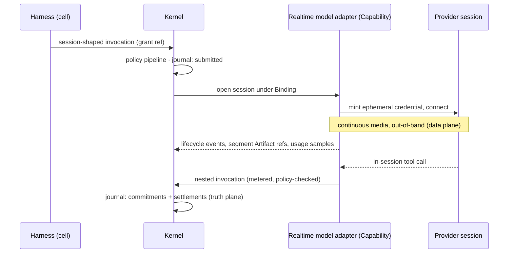
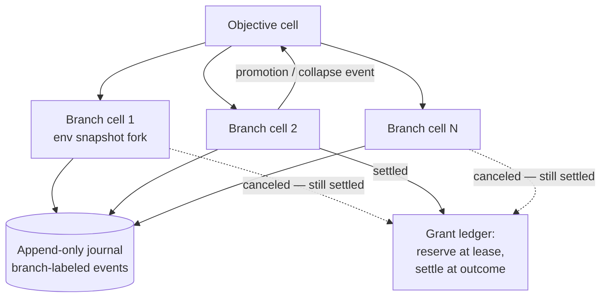

# 13 — Future-Scenario Test

Status: **DRAFT for adversarial review** (mission Phase 32). Written from `research/DESIGN-SPINE.md`
(binding contract) under `research/METHODOLOGY.md` discipline. Everything not explicitly labeled
otherwise is OUR PROPOSAL. Evidence claims carry explicit labels with note citations.

Sibling references: kernel objects are specified in 05-KERNEL-PRIMITIVES; the capability
manifest grammar in 06-CAPABILITY-SPEC; the event/state model in 08-EVENT-AND-STATE-MODEL;
failure semantics in 08 (§7 of the spine); context/memory split in 09-CONTEXT-AND-MEMORY;
strategies-as-behaviours in 10-HARNESS-AND-GRAPH-RUNTIME; grants and the policy pipeline in
11-SECURITY-AND-POLICY.

---

## 0. Purpose and method

A kernel earns the name only if concepts that do not exist yet can arrive without kernel
changes. This document runs the Kyxo kernel — the nine objects (Capability, Binding,
Invocation, Event, Artifact, Cell, Grant, Checkpoint, Kind) and two mechanisms (policy
pipeline, scheduler) of spine §3, plus the capability contract of spine §4 — against eighteen
future scenarios: the mission's fifteen (A–O) plus three (P–R) engineered by us to be
maximally hostile to *this specific* kernel's load-bearing assumptions.

**Fixed rubric per scenario:**

1. **Scenario** — what the future looks like.
2. **Absorption** — which kernel objects absorb it and how, concretely: what the manifest
   declares, what invocations look like, what events flow.
3. **Userland build** — new Kinds, strategies, adapters, policy stages that must be written.
4. **Verdict** — `YES` (kernel unchanged; only userland artifacts needed) /
   `YES-WITH-EXTENSION` (absorbed via a named, already-designed extension mechanism — Kind
   registry, manifest axes / reverse-DNS extensions, typed passthrough, policy stages,
   invocation profiles over the two first-class shapes, protocol-edge adapters, advertisement
   events — with **no change to any kernel object's semantics**) / `NO` (a kernel object's
   semantics must change; the change is named).
5. **Confidence** — HIGH / MEDIUM / LOW that the verdict is correct.

**Anti-vacuity rule.** The Kind registry exists precisely so new concepts arrive as data
(spine §3.9), so "define a Kind" can absorb almost any *noun*. That would make this test
unfalsifiable. The test therefore bites only on the parts with **fixed semantics**: the closed
invocation transition algebra, grant accounting (decrement-at-commit, attenuation, lineage),
the append-only truth plane, bind-time sealing of Bindings, checkpoint identity binding, and
single-writer cells. A scenario passes only if those survive; naming a Kind is never by itself
an answer. Per the mandate, we deliberately engineered several scenarios to land
YES-WITH-EXTENSION or NO — a test that always passes is not a test. Final tally: 11 YES,
6 YES-WITH-EXTENSION, 1 NO.

---

## 1. The mission scenarios A–O

### A. Persistent-state model

**Scenario.** A frontier provider ships a model whose conversation state lives entirely
server-side. You never resend history; you send a delta plus a state handle. The stateless
resend-everything world disappears for that provider.

**Absorption.** This is an existing tier on an existing manifest axis, not a new paradigm.
Statefulness is axis 1 of the 16-axis divergence list, with server-side state already
evidenced in OpenAI Responses `store`/`previous_response_id` (FACT,
research/notes/open-model-infrastructure.md §10.1). The model adapter's manifest declares
`statefulness: server-held`, plus a `state-export` sub-axis (exportable / opaque). The state
handle is an **Artifact**: opaque, provenance-labeled, bound to (provider, model, position) —
the carry-through channel the evidence demands for encrypted reasoning items and thought
signatures (INFERENCE/HIGH, open-model-infrastructure.md, Implications §2). The provider-side
conversation is a **remote cell** (spine §5: providers-becoming-runtimes are federated, not
proxied) with mirrored budget and policy. Events journal handle references and usage
settlements; invocations are ordinary request/response-with-streaming carrying the handle.

The real cost is truth-plane completeness: the kernel's journal no longer contains the full
conversation content, only references and commitments. A deny-class policy stage can refuse to
bind audit-mandated Objectives to non-exportable targets — failing loudly at bind time is the
designed behavior (spine §4).

**Userland build.** Adapter with handle lifecycle; a mirroring/eviction strategy for the
remote cell; an `AuditRequirement` policy stage.

**Verdict: YES.** The axis, the carry-through Artifact, and the remote-cell model were
designed for exactly this. **Confidence: HIGH.**

### B. Goal-seeking model without prompts

**Scenario.** A model API that accepts `{objective, constraints, tool endpoints}` and runs
autonomously — no messages, no chat surface at all. You get back a task handle and eventually
artifacts. The provider's API looks like A2A, not like Messages.

**Absorption.** The Invocation lifecycle is already A2A-extended and async-first (spine §3.3);
a goal-seeking model invocation is `submitted → working → {interrupted states} → terminal`,
indistinguishable from delegating to an opaque remote executor — which A2A proves is
standardizable (FACT, research/notes/a2a-protocol.md F2, F11). The manifest declares a new
*tier* on the prompt-encoding-level axis (axis 2): `objective-contract` alongside
`structured-messages` and `raw-tokens` — tiers within axes are the designed evolution path
(spine §4). The provider-side loop is a remote cell. Tools flow the other way: the kernel
projects the bound capability set to the provider through a protocol-edge adapter (an
MCP-server projection of the Binding), each callback metered and policy-checked as a nested
invocation under an attenuated Grant.

The strain is budget visibility: token spend inside the provider loop is invisible until usage
reports arrive. Grants handle this as a leased reservation with a hard cap, settled against
provider-reported usage — the manifest must declare a metering axis (usage-report latency and
granularity) so bind-time policy can reject targets whose metering is too coarse for the
grant's budget resolution.

**Userland build.** `GoalContract` Kind; the adapter; the capability-projection gateway; a
near-empty harness behaviour (supervision, escalation, verification gates only — context
compilation collapses to objective compilation).

**Verdict: YES-WITH-EXTENSION** — extension mechanisms: new axis tier in the manifest grammar
+ new Kind + protocol-edge adapter. No kernel-object semantics change. **Confidence: HIGH.**

### C. Continuously-operating capability

**Scenario.** A capability that never terminates: a monitoring daemon, a market maker, an
always-on personal presence. "Task" framing with an eventual terminal state stops matching.

**Absorption.** The **Cell** absorbs it: a keyed, single-writer, activation-on-demand scope
whose strategy schedules recurring or unbounded work — the Orleans-grain convergence the spine
adopts (INFERENCE/HIGH, research/notes/durable-execution.md §6). The invocation algebra does
not require termination on any wall clock (Temporal: no duration limit — FACT,
durable-execution.md §1); a continuously-operating capability is either a session-shaped
invocation that outlives everything around it, or — better — a cell issuing a stream of finite
invocations. Journal growth is the real threat, and it is priced in: two-tier store,
first-class checkpoint + trim rather than Continue-As-New gymnastics (spine H5;
durable-execution.md Implications §2). Budgets: a Grant's quantitative budget is finite by
design, which is a feature — continuous operation runs on *epochs*: a userland controller
watches budget-exceeded suspension events and issues fresh attenuated Grants per epoch,
keeping a human or parent cell in the renewal loop. Supervision uses OTP restart-intensity
budgets (spine §7).

**Userland build.** Daemon strategy behaviour; epoch-budget controller (a Kind + controller in
the CRD pattern); escalation policy.

**Verdict: YES.** **Confidence: HIGH.**

### D. 10,000-agent swarm

**Scenario.** Ten thousand concurrently-operating agents — in spine vocabulary, ten thousand
*configurations* (harness + bound capability set + grants) running in ten thousand cells —
coordinating on shared work.

**Absorption.** The object model is indifferent to the count: cells are cheap
activation-on-demand identities (Orleans routinely runs orders of magnitude more grains —
FACT, durable-execution.md §6); Grant lineage already carries **spawn depth/width** as
quantitative budget (spine §3.7), which is precisely the recursion/fan-out control absent from
A2A (FACT-by-absence, a2a-protocol.md F13.8) and every framework surveyed
(research/notes/agent-frameworks-crewai-pydantic-llamaindex-mastra-letta.md, open question 6).
Swarm coordination itself is an orchestration strategy in a coordinator cell — explicitly a
non-primitive (spine §3, non-primitives list). Correlation/causation IDs stitch the global
picture across per-cell journals.

Two honest costs. First, the single-node TypeScript V1 will not carry 10,000 active cells;
that is an implementation ceiling, not an object-model failure, and the protocol-first
decision (spine §8) exists so the reference implementation is replaceable. Second — the real
extension — a swarm spanning multiple kernel instances requires **federated grant
accounting**: attenuation crossing a kernel boundary must be mirrored (child kernel enforces a
budget the parent kernel accounts), carried as a reverse-DNS extension over the federation
edge (A2A's URI-keyed extension mechanism is expressly designed for envelope additions —
FACT, a2a-protocol.md F10). Cross-boundary settlement is eventual, not transactional; the
guarantee degrades from "kernel-enforced at commit" to "cap-enforced locally, reconciled
across the edge."

**Userland build.** Swarm coordinator strategy; sharding controller; federation adapter with
the grant-mirroring extension; digest/aggregation Kinds.

**Verdict: YES-WITH-EXTENSION** — federation-edge extension for mirrored grant lineage.
**Confidence: MEDIUM** (cross-boundary budget reconciliation has no direct prior art anywhere
in the evidence base; we are designing past the data).

### E. Physical robot

**Scenario.** A capability that is a robot: actuation in the physical world, 100 Hz control
loops, irreversible effects.

**Absorption.** The robot is an **execution environment** capability — leasable, exclusive
(single-writer discipline maps to "one controller per body"), with a declared lifecycle
(spine §2). The kernel line sits at the *skill* level: `move-to`, `grasp`, `navigate` are
invocations; the inner control loop runs inside the capability below the kernel line, exactly
as token generation runs inside a model. Events journal skill-level effects and sensor-derived
Evidence artifacts, not servo frames. Risk is first-class: Grants already carry risk class
(spine §3.7); manifests declare actuation axes (reversibility, safety envelope, e-stop
contract) using the same annotation move MCP makes with `destructiveHint` (SOURCE-CODE
OBSERVATION, research/notes/mcp-protocol.md §5) but *enforced* through deny-class policy
stages evaluated before every effectful invocation — the pre-actuation gate, plus out-of-loop
verification before artifact promotion.

The honest break is with repair semantics: spine §7 names **fork-from-checkpoint as the
primary repair verb**. A checkpoint cuts the *cell's* state, not the world's; you cannot fork
a world in which the arm already moved. For physical effects, repair is compensation (saga
discipline), not replay. This does not change the Checkpoint object — it restricts the domain
over which the "primary repair verb" claim holds, and doc 08's failure table must carry the
carve-out: *irreversible effects repair by compensation; checkpoints repair decision state
only*.

**Userland build.** Robot environment provider; safety policy stages; actuation manifest
axes (declared via the governed extension namespace until standardized); compensation
strategies; sensor→Evidence pipelines.

**Verdict: YES-WITH-EXTENSION** — actuation axes via the manifest extension tier + safety
policy stages. **Confidence: HIGH** on absorption; the spine amendment (compensation
co-primary with fork) is flagged as an open issue.

### F. Laptop-local capability

**Scenario.** Everything runs on a laptop: local models behind a local engine, intermittent
connectivity, no cloud dependency.

**Absorption.** This is close to the design center. The kernel is single-node-first with a
SQLite/JSONL journal and file CAS (spine §8) — it *is* laptop software. Local engines surface
resource-lifecycle concerns (model residency, `keep_alive`, per-request context allocation,
quantization) that cloud APIs hide; these are already axis 14 of the manifest list (FACT,
open-model-infrastructure.md §1, §10.14). Grants are kernel-local unforgeable references, so
authority works fully offline; connectivity is needed only at federation bind time.
Reconnection sync is checkpoint portability — the state-transfer migration model (spine §8),
not a distributed mesh.

**Userland build.** Ollama/llama.cpp/vLLM adapters (code-bearing plugins with template +
parser duties — INFERENCE/HIGH, open-model-infrastructure.md Implications §3); a sync strategy
for intermittent federation.

**Verdict: YES.** **Confidence: HIGH.**

### G. Opaque remote AI refusing to reveal reasoning

**Scenario.** A materially better AI service that will not expose reasoning, internal state,
or architecture — a black box with an API.

**Absorption.** Total executor opacity is the *proven* case: A2A standardizes collaboration
with agents "without needing access to each other's internal state, memory, or tools" (FACT,
a2a-protocol.md F1), and reasoning-visibility tiers including `hidden` are already a manifest
axis (open-model-infrastructure.md §5). The Binding intersects requirements with the manifest:
an Objective requiring reasoning visibility fails loudly at bind time; everything else binds.
The three-source contract (spine C3) does the heavy lifting — declarations gate eligibility,
probes verify claims, outcome telemetry drives selection — so the opaque capability competes
on measured results, not trust. Verification attaches at the commit gate to artifacts, not to
reasoning (spine §5); provenance taint labels mark outputs as unauditable-source so
downstream policy can quarantine or require independent verification.

**Userland build.** A2A adapter (already planned as a protocol edge); judge/consensus verifier
capabilities; telemetry-scoring Kinds.

**Verdict: YES.** This is the scenario the kernel is most directly built for.
**Confidence: HIGH.**

### H. Capability that creates capabilities

**Scenario.** A capability whose output is new capabilities: it writes tools, mints manifests,
registers them, and the system self-extends at runtime.

**Absorption.** Safe by construction under object-capability discipline. A manifest is data
and code artifacts are Artifacts with provenance; *registering* a capability confers zero
authority, because authority never lives in the capability — it arrives only as a Grant at
bind time, attenuated from some parent (spine §3.7). This closes the gap the framework survey
found nowhere addressed: model-authored delegation with no attenuation answer
(agent-frameworks note, open question 6; smolagents' CodeAgent can already "define its own
tools / start other agents" — FACT). Concretely: the factory capability emits {code Artifact,
manifest} → registration is an invocation against the registry → a runtime advertisement
event (Wayland-style, spine §4) announces it → policy stages gate bindability on stability
class, requiring probe/conformance Evidence artifacts before anything above `experimental`
binds. Generated code runs in sandboxed hosting (the WASM extension path, spine §8), and its
provenance chain (producing invocation, inputs, labels) survives structurally on everything it
later produces.

**Userland build.** CapabilityFactory profile; codegen strategies; promotion policy stages;
probe suites as first-class evidence.

**Verdict: YES.** **Confidence: HIGH.**

### I. Realtime multimodal streaming

**Scenario.** Bidirectional audio/video sessions as the dominant interaction mode: continuous
media in and out, sub-second turn-taking, in-session tool calls (the Realtime/Live paradigm
generalized).

**Absorption.** The session-shaped invocation exists because this cannot be lowered onto
function calls (FACT/HIGH, open-model-infrastructure.md §7; spine §4). The manifest declares
transport/session axes (WebRTC/WS/SIP, ephemeral-credential minting), streaming grammar, and
modality axes. The kernel's move is a disciplined split:

- **Data plane out-of-band.** Continuous media flows over the negotiated transport directly;
  the kernel is not in the frame path. The manifest *declares* the out-of-band channel; the
  Binding authorizes it; ephemeral provider credentials are minted under the Grant.
- **Truth plane records commitments, not frames.** The journal carries session lifecycle
  events, utterance/segment Artifacts (CAS-chunked), in-session tool invocations (each a
  nested, metered, policy-checked invocation), and usage settlements. The advisory plane
  (explicitly weaker guarantees — spine §3.4) carries live progress. This is the two-plane
  lesson from Temporal's Workflow Streams: the durable truth channel and the live observation
  channel cannot be the same channel (FACT, durable-execution.md §2).

The genuine strain is **budget units**: token-denominated budgets do not measure media
minutes. The Grant's budget dimensions (spine §3.7 enumerates tokens, money, wall-clock,
invocations, spawn) must be an open, namespaced unit registry with money as the universal
settlement denominator — treated here as an extension of the grant *schema*, not its
semantics (reserve, decrement, attenuate, lineage all unchanged).

**Userland build.** Realtime/Live adapters; media chunking → CAS strategies; VAD/turn policy
in the harness; media-unit definitions.

**Verdict: YES-WITH-EXTENSION** — manifest session/transport axes + open budget-unit
namespace + declared out-of-band data plane. **Confidence: MEDIUM-HIGH** (the accounting
extension is clean; declaring kernel-invisible data planes weakens the "journal sees every
effect" story and must be stated honestly in 08).

### J. Capability with own memory

**Scenario.** Capabilities arrive with internal, persistent, self-managed memory — Letta-style
agents-as-services whose behavior depends on state you cannot see.

**Absorption.** Opacity again, on the statefulness axis rather than the reasoning axis. The
manifest declares memory disclosure tier: `exportable` / `shared-blocks` / `opaque`. Letta is
the existence proof for the well-behaved end (server-persisted blocks, deterministic
`Memory.compile()`, shareable across principals — SOURCE-CODE OBSERVATION,
agent-frameworks note §5); an opaque-memory capability is the same shape with the disclosure
tier lowered. Consequences the kernel handles structurally: outputs get a
`history-dependent` taint label (same invocation ≠ same result — already true of models);
telemetry per capability×objective drives selection where behavior drifts; and — the sharp
edge — **portable checkpoints cannot capture what the capability holds internally**, so
migration eligibility (scenario M) is gated at bind time on the declared export tier. The
kernel's own Memory system (labeled, quota'd cells with provenance — spine §5) remains the
portable source of truth; policy can *require* kernel-side memory for regulated work rather
than pretending to see inside capabilities.

**Userland build.** Memory-audit probes; export/import adapters for the `.af`-style formats;
policy stages keyed on disclosure tier.

**Verdict: YES.** **Confidence: HIGH.**

### K. Probabilistic commitments

**Scenario.** Capabilities stop returning results and start returning calibrated commitments:
"delivered by Friday with p=0.8," answer distributions, confidence-weighted alternatives —
possibly traded and re-negotiated.

**Absorption.** The kernel never inspects payload semantics, so a distribution is just an
Artifact of a registered Kind. The invocation completes *normally* — its result is a
`Commitment` artifact; the commitment's later resolution is a separate, watchable fact. This
is the CRD move working as intended: `Commitment`, `Forecast`, `Resolution` Kinds with schema
validation and watch streams; a userland resolution controller observes deadline events
(scheduler-owned) and appends resolution events; calibration scoring (Brier-style) folds into
the outcome-telemetry channel the contract already mandates (spine H2 amendment: empirical
outcome telemetry is part of the capability contract). Verification gates can require minimum
declared confidence, or independent evidence, before promotion. Grants are untouched —
uncertainty prices into selection, not into accounting.

**Userland build.** The Kinds above; resolution controllers; calibration scorers feeding
telemetry; negotiation strategies if commitments become tradable.

**Verdict: YES.** **Confidence: MEDIUM** — no system in the evidence base does this; the
absorption argument is structural (INFERENCE), not empirical.

### L. Multi-week execution

**Scenario.** Individual undertakings that run for weeks: research programs, litigation
support, long build-outs — with humans in the loop on human timescales.

**Absorption.** Designed-in, with strong evidence: durable waits measured in days are solved
(Restate awakeables suspend free of charge; DBOS `recv` waits durably — FACT,
durable-execution.md §3–4); Temporal has no wall-clock ceiling (FACT, §1). The kernel's typed
suspensions (`input-required`, `approval-required` with suspend/resume schemas — the Mastra
pattern, FACT, agent-frameworks note §4) plus scheduler deadlines and escalation policies
cover the human side. The real multi-week problem is that the *definition* changes under the
execution: prompts, models, and tool wiring change weekly, which is exactly why the spine
rejected positional-replay determinism for record-and-inject journaling (spine H5) and made
version-by-data + fork-from-checkpoint the upgrade verb (spine §7) — the anti-Temporal-patching
decision. Checkpoints bound to definition identity make the upgrade an explicit, journaled
fork rather than a silent drift. Budget epochs (scenario C) handle long-horizon spend.

**Userland build.** Escalation/reminder strategies; upgrade controllers that fork checkpoints
onto new definition versions; long-horizon budget policies.

**Verdict: YES.** **Confidence: HIGH.**

### M. Mid-execution provider migration

**Scenario.** Three weeks into a multi-week execution, the provider must be replaced —
pricing, policy, capability, or geopolitical reasons. Move the work without restarting.

**Absorption.** The showcase for Checkpoint + Binding renegotiation, with commercial proof
that state-transfer migration works (Cursor's `&` handoff — spine §3.8). Mechanics: cut a
Checkpoint (journal position + state snapshot + pending invocations); re-negotiate a Binding
against the new target's manifest — missing required axes fail loudly, never degrade silently
(spine §4); the context-management system *recompiles* the per-invocation view from
kernel-side truth (journal artifacts, memory cells) rather than replaying wire history. Two
frictions are structural and must be stated, not hidden:

1. **Opaque carry-through artifacts do not migrate.** Reasoning items, thinking signatures,
   thought signatures are bound to (provider, model, position); replay onto a different model
   is dropped or a hard 400 (FACT/OBSERVED BEHAVIOR, open-model-infrastructure.md §5). The
   compiled view for the new provider is built without them — a real, measurable quality cost
   (dropping reasoning cost ~30% in Cursor's case — spine C2).
2. **Harness×model pairing changes.** Kyxo deliberately does not promise a universal harness
   (spine C2); migration selects a new harness×model pair via manifests + telemetry, and the
   benchmark harness exists to make that selection empirical (spine §9).

Provider-held state (scenario A) migrates only if the manifest declared exportability —
which is why the export axis is checked at *original* bind time for migration-critical work.

**Userland build.** Migration strategy (checkpoint → rebind → recompile → probe-validate);
A/B validation runs; export adapters.

**Verdict: YES.** **Confidence: HIGH.**

### N. Unlimited-context, expensive-retrieval model

**Scenario.** Context windows become effectively unlimited, but attention/retrieval over that
context is metered and expensive. Context management inverts from "what fits" to "what's
worth paying for."

**Absorption.** The context-management system is defined as a deterministic compiler *under a
budget* (spine §5) — nothing says the budget is a token count. The compile objective flips
from truncation to cost-optimization; the manifest's caching-contract axis (four incompatible
paradigms already evidenced — FACT, open-model-infrastructure.md §8) and pricing axes drive
the compile strategy, the already-acknowledged cross-layer constraint where a model capability
constrains context construction (INFERENCE/HIGH, open-model-infrastructure.md Implications
§6). The Memory-vs-Context hard split *survives and matters more*: if the provider retains
everything, kernel memory cells look redundant — until scenario M, where provider retention
evaporates and kernel-side memory is the only portable truth. Provider retention is treated
as a cache with a declared contract, never as the system of record.

**Userland build.** Cost-aware compile strategies; retrieval-budget policies; new caching
adapters.

**Verdict: YES.** **Confidence: MEDIUM-HIGH** (the inversion is absorbed by definitions
already chosen; the INFERENCE is that no new interaction shape emerges alongside it).

### O. The "agent" concept becomes obsolete

**Scenario.** The industry vocabulary moves on. "Agent" goes the way of "expert system";
whatever replaces it — ambient services, digital coworkers, learned processes — doesn't match
today's framing.

**Absorption.** By construction: the word "agent" never appears in kernel code — it is a
configuration (harness + bound capability set + grants + a cell), not a type (spine §2), and
Agent sits on the explicit non-primitives list alongside Harness, Graph, Planner, Workflow
(spine §3). The evidence for this being the right bet is the strongest class available:
convergent abandonment — ADK deprecated its own agent hierarchy one major version after
shipping it, Microsoft collapsed two agent frameworks into a typed-executor substrate, and
zero of eight coding agents contain the abstractions their marketing names (spine §1). If the
successor concept is invocation-shaped work under authority with recorded effects, it lands
on the nine objects and its nouns arrive as Kinds. The honest limit: if the successor
paradigm abandons *invocation-shaped work itself*, the kernel is genuinely at risk — that
case is tested at P, not here.

**Userland build.** New Kinds and strategies named in whatever vocabulary wins; deprecation
of old Kinds under the 12-month stability-class clock (spine §4).

**Verdict: YES.** **Confidence: HIGH.**

---

## 2. The engineered hostile scenarios P–R

These three were designed against this kernel's specific load-bearing assumptions:
charge-at-commit grant accounting (P), Binding as the sole authority attachment point (Q),
and bind-time sealing of manifests (R).

### P. Speculative branching execution

**Scenario.** Providers and accelerators generalize speculative decoding to whole task trees:
a service executes 16 candidate trajectories of your objective concurrently — including
*speculative tool execution* against snapshotted environment forks — then commits the best
trajectory and discards the rest. You are billed for all 16. Later, "quantum-ish" schedulers
make the branch set dynamic and partially observable.

**Absorption attempt.** The eventing survives, surprisingly cleanly: branches are speculative
child cells over environment snapshot forks (execution environments already declare
build/snapshot lifecycle — spine §2), every branch's events append to the journal carrying
branch identity, and "collapse" is an ordinary promotion event; discarded branches terminate
`canceled`. Append-only truth was never single-timeline — correlation/causation IDs plus
cell identity encode the tree. Policy survives: a deny-class stage restricts speculative
dispatch to capabilities whose manifests declare purity or snapshot-isolation, because
side effects on the real world cannot be speculated safely.

**What breaks is Grant accounting.** Spine §3.7: "the kernel decrements at commit." Fifteen of
sixteen branches never commit to the truth plane — yet their cost is real and billed.
Charge-at-commit undercharges by construction, and no extension mechanism fixes it, because
the charge point is kernel semantics, not schema.

**Required kernel change.** Split the charge point from the commit point: **reserve-at-lease /
settle-at-outcome** two-phase accounting. Every effectful invocation reserves against its
Grant when its lease is taken (leases already exist for every external effect — spine §7) and
settles at outcome — *charged whether or not the outcome is promoted to the truth plane*.
Commit-time remains the point where outcomes become truth; it stops being the point where
money moves. This is a semantic change to the Grant object and is proposed as a spine
amendment. It is also independently justified: attempt-based cost with outcome-based truth is
exactly the two-plane distinction Temporal's Workflow Streams was forced into for retries
(FACT, durable-execution.md §2 — failed attempts' tokens are real even though durable state
sees only the successful return), and the Pydantic AI usage-accounting hole shows what
silently dropped attempt-cost looks like in production (FACT, durable-execution.md §2).

**Userland build.** Speculative dispatch strategies; purity/isolation manifest axes;
branch-pruning policies.

**Verdict: NO — kernel change required**: Grant accounting moves from decrement-at-commit to
reserve-at-lease/settle-at-outcome. **Confidence: MEDIUM** (that the change suffices — HIGH
that the current semantics fail the scenario).

### Q. Capabilities negotiating with each other without kernel mediation

**Scenario.** An agent-economy paradigm: capabilities carry their own identities, wallets, and
reputation; they discover each other, negotiate prices, and subcontract peer-to-peer over
their own protocols. A capability bound into your runtime quietly recruits third parties using
authority the kernel never issued.

**Absorption attempt.** Split the scenario at the trust boundary. *Across* the federation
edge, this changes nothing: remote executors were always opaque (A2A's core premise — FACT,
a2a-protocol.md F1), and what the kernel guarantees was never "nothing happens over there" but
"what crosses *my* boundary is granted, attenuated, metered, and journaled." Spend caps bound
the money handed over; provenance labels mark artifacts from unattested chains. *Inside* the
trust domain, the interposition machinery holds for kernel-issued authority: egress is itself
a capability under Grant, deny-class stages are non-bypassable, and taint labels track what
flowed where (spine §2, policy/security layer).

**The genuine hit** is to the scope of the ocap guarantee: a wallet is **ambient authority**.
A capability that arrives holding its own external credentials can wield them without the
kernel's participation, and no interposition pipeline can attenuate authority it never
issued. The kernel's claim must be narrowed honestly from "the AI cannot grant itself
privilege" to "the AI cannot grant itself privilege *the kernel controls*." The designed
response uses existing mechanisms: a manifest axis declaring brought-authority
(none / declared / undeclared-unknown); policy stages that route high-assurance work only to
capabilities running in kernel-provisioned execution environments with no ambient credentials
(the confinement move MCP gestures at with host-mediated isolation — FACT, mcp-protocol.md
§2); and probe suites that test for undeclared egress. Doc 11-SECURITY-AND-POLICY must state
the guarantee boundary explicitly.

**Userland build.** Brought-authority manifest axis; confinement environment providers;
egress-probe suites; economic-delegation strategies for when peer negotiation is *wanted*
(the kernel can mediate it as ordinary delegation with attenuated spend Grants).

**Verdict: YES-WITH-EXTENSION** — manifest axis + policy stages + environment confinement; no
object changes, but a guarantee-scope clarification is mandatory. **Confidence: MEDIUM.**

### R. Continuous learning: the capability mutates its own manifest mid-binding

**Scenario.** Test-time training and online RL become standard. A capability's competence —
and eventually its feature surface — drifts *while bound*: the manifest sealed into your
Binding describes weights that no longer exist. Version identity dissolves; there are no
release points, only a stream of weights.

**Absorption attempt.** Competence drift was priced in: declared manifests were never trusted
alone (C3 — declarations gate eligibility, telemetry drives selection), and telemetry with
decay metadata tracks a moving target. *Surface* drift is the attack: Binding semantics are
bind-time sealing (unsolicited-use-is-error, TLS-shaped — spine §3.2), and Checkpoints bind to
definition identity. The absorption uses two designed mechanisms. First, **advertisement
events**: the Wayland-style runtime advertisement/removal channel (spine §4) carries manifest
*revision* events; a revision that touches any axis sealed into a live Binding invalidates it,
and grants are revocable, so invalidation is enforceable. Second, the **policy pipeline runs
at every effectful invocation** (spine §3, mechanisms), so binding-epoch freshness is checked
per effect, not once. The discipline this imposes on providers: drift must be *quantized into
declared epochs*. A continuously-learning capability's manifest carries a drift axis
(drift-free / epoch-signaled / continuous-undeclared), and epoch-signaled is the highest tier
policy will bind for consequential work. Identity becomes (capability, manifest epoch,
telemetry window); checkpoints record the epoch they were cut under, and cross-epoch resume is
an explicit fork, reusing the version-by-data machinery (spine §7).

**The honest residue**: mid-*session* drift. A session-shaped invocation held open across an
epoch boundary can degrade mid-flight; the kernel can detect (decode failures, commit-gate
verification failures, telemetry cliffs) and terminate/rebind, but not prevent. And if the
ecosystem ships continuous-undeclared drift as the norm — no honest epoch signals — the
declared-manifest leg of the three-source contract goes soft, leaving probes and telemetry
carrying the contract alone. That is degraded, not broken: it is how routing already works in
the wild, where nothing negotiates (FACT, open-model-infrastructure.md §10.15).

**Userland build.** Drift axis + epoch-signaling extension in the manifest grammar; rebind
controllers; probe schedules with decay-driven re-verification; session drift detectors.

**Verdict: YES-WITH-EXTENSION** — drift/epoch manifest axes + advertisement-event-driven
rebind, both existing mechanisms. **Confidence: MEDIUM** (contingent on providers accepting
epoch quantization; the continuous-undeclared world weakens the contract materially).

---

## 3. Scoreboard

| # | Scenario | Verdict | Load-bearing kernel objects | Extension used / change required | Confidence |
|---|---|---|---|---|---|
| A | Persistent-state model | YES | Capability (statefulness axis), Artifact (carry-through), Cell (remote) | — | HIGH |
| B | Goal-seeking model, no prompts | YES-WITH-EXT | Invocation (async lifecycle), Cell (remote), Grant (leased cap) | New axis tier + Kind + protocol-edge adapter | HIGH |
| C | Continuously-operating capability | YES | Cell, Checkpoint (+trim), Grant (epochs in userland) | — | HIGH |
| D | 10,000-agent swarm | YES-WITH-EXT | Cell, Grant (spawn depth/width), Event (correlation) | Federation-edge grant mirroring extension | MEDIUM |
| E | Physical robot | YES-WITH-EXT | Capability (environment), Grant (risk class), policy pipeline | Actuation axes + safety stages; repair-verb carve-out | HIGH |
| F | Laptop-local capability | YES | Whole kernel (design center), Capability (resource axes) | — | HIGH |
| G | Opaque remote AI | YES | Capability (visibility axis), Binding (fail-loud), Artifact (taint) | — | HIGH |
| H | Capability creating capabilities | YES | Grant (ocap: creation ≠ authority), Artifact (provenance), Kind | — | HIGH |
| I | Realtime multimodal streaming | YES-WITH-EXT | Invocation (session shape), Event (two planes), Artifact (CAS) | Session axes + open budget units + declared out-of-band data plane | MEDIUM-HIGH |
| J | Capability with own memory | YES | Capability (disclosure tier), Artifact (taint), Checkpoint (gated) | — | HIGH |
| K | Probabilistic commitments | YES | Kind, Event (watch), telemetry channel | — | MEDIUM |
| L | Multi-week execution | YES | Invocation (suspensions), Checkpoint, scheduler (deadlines) | — | HIGH |
| M | Mid-execution provider migration | YES | Checkpoint, Binding (renegotiation), context compiler | — | HIGH |
| N | Unlimited context, costly retrieval | YES | Context compiler (budget redefined), Capability (caching axes) | — | MEDIUM-HIGH |
| O | "Agent" obsolete | YES | Kind registry; non-primitives discipline | — | HIGH |
| P | Speculative branching execution | **NO** | Cell (branches), Event (branch-labeled), **Grant (breaks)** | **Kernel change: reserve-at-lease / settle-at-outcome accounting** | MEDIUM |
| Q | Unmediated peer negotiation | YES-WITH-EXT | Grant (scope narrowed), policy pipeline, execution environments | Brought-authority axis + confinement stages | MEDIUM |
| R | Self-mutating manifest mid-binding | YES-WITH-EXT | Binding (epoch invalidation), advertisement events, telemetry | Drift/epoch axes + rebind controllers | MEDIUM |

**Tally: 11 YES · 6 YES-WITH-EXTENSION · 1 NO.**

---

## 4. Analysis

### 4.1 Which objects did the absorbing work

Ranked by how many scenarios leaned on them as the *primary* absorber:

1. **Capability manifest (axes, tiers, extension namespace)** — 12 of 18. Nearly every
   paradigm shift arrived as "a new tier on an existing axis" (A, B, G, J, N) or "a new axis
   in the extension namespace" (E, I, Q, R). This confirms the mandate's expectation and the
   H4 refinement: axis-typed tiers, not booleans, is where future-proofing actually lives.
2. **Cell** — 7 of 18 (A, B, C, D, F, I, P). Keyed single-writer identity absorbed remote
   provider state, continuous operation, swarms, and speculative branches — the
   thrice-reinvented grain abstraction (INFERENCE/HIGH, durable-execution.md §6) earning its
   kernel seat.
3. **Invocation lifecycle (interrupted classes + session shape)** — 6 of 18. The closed
   algebra never needed a new *state* in any scenario; typed suspension payloads and the two
   first-class shapes covered everything. A2A's generalization ({interrupted state, typed
   requirement payload} — a2a-protocol.md Implications §6) held.
4. **Kind registry** — decisive in K, B, O; supporting everywhere. Correctly, it absorbed
   *nouns* while the fixed-semantics mechanisms absorbed *verbs* — the anti-vacuity split.
5. **Grant** — the most interesting result: heavily load-bearing (D, H, Q) *and* the only
   outright failure (P). The one genuinely novel kernel object is also the least
   evidence-backed, and the test found its soft spot exactly where the spine flagged
   "limited prior art."

**Evidence** — 12/18 scenarios resolved by manifest axes/tiers; the invocation algebra
required zero new states across 18 scenarios; the only NO landed on Grant charge semantics.
**Interpretation** — the kernel's extension mechanisms are correctly placed: variation
arrives overwhelmingly as capability-surface diversity, which is data, and only rarely as
lifecycle or accounting semantics, which are code. **Implication** — invest spec effort
proportionally: the manifest grammar (06-CAPABILITY-SPEC) is the document that must be
gotten right first; the invocation algebra can be frozen with more confidence than the grant
accounting rules. **Confidence** — HIGH.

### 4.2 The brittle assumptions

**(1) Charge-at-commit grant accounting — brittle, change proposed.**
**Evidence** — scenario P breaks it outright; scenario I strains it (media units); the
attempt-vs-outcome cost split is independently evidenced by Workflow Streams' retry-visible
streams and Pydantic AI's lost delegate-usage accounting (FACT, durable-execution.md §2).
**Interpretation** — cost is a property of *attempts*; truth is a property of *outcomes*;
conflating their timing was an error inherited from thinking of commit as the only
authoritative moment. **Implication** — adopt reserve-at-lease / settle-at-outcome as a spine
amendment before V1 freezes the journal schema; charge events become distinct event types
from outcome events. **Confidence** — HIGH that the current rule is wrong; MEDIUM that the
proposed rule is complete.

**(2) "The journal sees everything" — must be restated before it is ever promised.**
**Evidence** — scenarios A (provider-held conversations), I (out-of-band media planes), J
(opaque internal memory), and Q (ambient authority) each subtract content from the kernel's
view; the same pattern appears in the evidence base as MCP's host-owned conversation and
A2A's discretionary history (FACT, mcp-protocol.md §2; a2a-protocol.md F2).
**Interpretation** — the truth plane is a complete record of *commitments, effects, and
references the kernel mediated* — never of all content that existed. **Implication** — 08
must define journal completeness in exactly those terms, and audit-grade completeness becomes
a *negotiated property* (export axes, confinement environments) rather than a default.
**Confidence** — HIGH.

**(3) Bind-time sealing assumes quantized capability evolution.**
**Evidence** — scenario R; today's ecosystem already ships continuous drift unannounced
(model updates behind stable IDs; parser breakage across checkpoint revisions —
open-model-infrastructure.md, open question 2). **Interpretation** — sealing is only as good
as the provider's honesty about epochs; the three-source contract degrades gracefully to
telemetry-only but loses its eligibility-gating leg. **Implication** — build probe scheduling
and telemetry decay as first-class from V1 (not as later hardening), and make binding-epoch
freshness a standard policy stage. **Confidence** — MEDIUM.

**(4) Fork-from-checkpoint as the primary repair verb** fails for irreversible physical
effects (scenario E). Compensation must be documented as co-primary in doc 08. Confidence
HIGH; small blast radius.

**(5) Request-shaped invocation** — tested and *not* found brittle: the session shape
(spine §4, forced by Realtime/Live — FACT/HIGH) took the load in B, I, and R. The earlier
decision to refuse lowering sessions onto function calls is the single most vindicated call
in the test.

### 4.3 Pre-commitments to AVOID

To keep the brittle spots flexible, V1 must **not**:

1. **Freeze budget units as an enumeration.** Namespace units (reverse-DNS like everything
   else); money is the universal settlement denominator; token/wall-clock/invocation are
   predefined entries, not the schema.
2. **Fuse charge events with outcome events in the journal schema.** Even if reserve/settle
   ships later, distinct event types for reservation, settlement, and outcome cost nothing
   now and make the P amendment additive instead of breaking.
3. **Promise total-content audit.** Specify journal completeness as mediated-commitments
   completeness (4.2.2) in every public contract document.
4. **Require the kernel on the data plane.** The manifest must be able to declare out-of-band
   channels (transport, peer, accounting cadence) from V1, or realtime capabilities will
   route around the kernel undeclared — the worse outcome.
5. **Bind checkpoint validity to exact manifest-hash equality.** Bind to definition identity
   *plus a declared compatibility predicate* (epoch ranges), or scenario R turns every drift
   tick into a forced cold restart.
6. **Treat the closed transition algebra as extensible.** Keep it closed — 18 scenarios
   needed zero new states — but keep suspension *payloads* typed and open, which is where the
   pressure actually lands (the A2A lesson: generalize the payload, not the state set).
7. **Assume token-denominated budgets anywhere in the context compiler's interface** (scenario
   N): the compile budget is a cost function, of which token count is one instance.
8. **State the ocap guarantee without its boundary.** Every claim of "the AI cannot grant
   itself privilege" is scoped to kernel-issued authority; brought authority is declared,
   confined, or assumed hostile (scenario Q).

### 4.4 Proposed spine amendments (for the adversarial-review phase)

1. **Grant accounting**: decrement-at-commit → reserve-at-lease / settle-at-outcome (from P).
2. **Repair verbs**: fork-from-checkpoint primary *for decision state*; compensation primary
   for irreversible external effects (from E).
3. **Guarantee scoping**: ocap claims scoped to kernel-issued authority; brought-authority
   manifest axis added to the standard axis list (from Q).
4. **Budget units**: open namespaced registry, not an enumeration (from I).

The kernel's nine objects survived seventeen of eighteen futures without semantic change, and
the eighteenth failure is repairable with machinery (leases) the kernel already owns. That is
the result the minimality test predicts if the object selection is right — and the
concentration of both load and failure in Grant, the one object with no prior art, is exactly
where the adversarial review should now aim.
