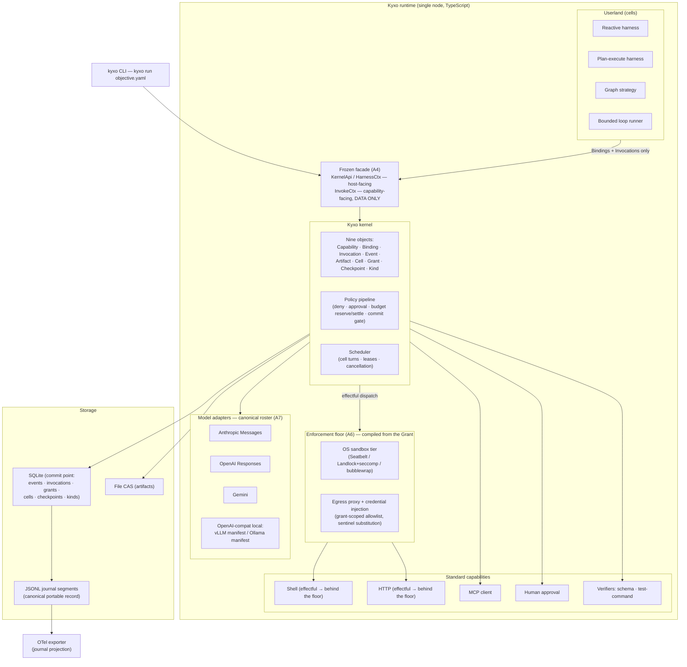

# 14 — MVP Architecture (Mission Phases 36–37)

> **Post-review status (2026-08-16, phase 2).** This document predates the adversarial review; the
> review's binding adjudications live in the Amendment log of `research/DESIGN-SPINE.md` (A1–A14),
> with the full findings in `research/ADVERSARIAL-REVIEW.md`. They are now reflected in the body.
> **Applied here:** A1 (lineage-scoped, content-inclusive effect identity; mandatory journaled fork
> dispositions — §1 F6, §2.1, §3.2, §3.3 D3/D5/D8), A2 (reserve/settle/release finishes replacing
> decrement-at-commit — §1 F7, §2.3, §3.2, §3.3 D5/D6, §4, §5.3), A3 (guarantee grades and the named
> V1 target segments — §2.0, §1 F7, §2.1, §4), A4 (the frozen facade joins the frozen wire schemas —
> §2.1, §2.2, §4 criterion 7), A5 (the Wave-0 governance workstream — §2.1a), A6 (the MVP
> non-cooperative enforcement floor — §2.1, §2.3, §3.1, §3.3 D9, §4 criterion 9, §6 X9), A7 (adapter
> roster canonical including Gemini; this document's deferral labels rewritten in doc 15's canonical
> wave numbers — §2, §2.2), A13 (selection contract: schema at Wave 0, telemetry ranking at Wave 3 —
> §2.1, §5.4), A14 (catalog scope: conformance-derived manifests for the four MVP adapters only —
> §2.1, §2.2), plus A9's evidence relabelling of the two claims this document carried (§1, §2.2) and
> incidental alignment with A8, A10 and A11 where the storage sketch and the scope table would
> otherwise have contradicted them (§2.1, §3.2). **Outstanding:** none known.
> Where this document conflicts with the Amendment log, **the amendment log governs**.
>
> **Executable semantics supersede prose.** The invocation lifecycle, the commit barrier, effect
> identity, fork/resume and budget accounting are executable in `prototypes/kernel-semantics/`
> (normative prose in `docs/17-KERNEL-SEMANTICS.md`, checked invariants in
> `docs/18-KERNEL-INVARIANTS.md`, falsifications in `docs/20-SEMANTIC-TEST-RESULTS.md`). Where this
> document's narrative and that code disagree, the code is correct and this document is the defect.


Status: draft for adversarial review. Written from `research/DESIGN-SPINE.md` (pre-adversarial-review) and the evidence notes cited inline. Labeling follows `research/METHODOLOGY.md`: everything in this document is OUR PROPOSAL unless explicitly labeled otherwise; evidence claims carry FACT / SOURCE-CODE OBSERVATION / OBSERVED BEHAVIOR / INFERENCE labels with confidence.

Vocabulary is spine §2 and is load-bearing throughout: *kernel* (nine objects + two mechanisms), *Kyxo runtime* (kernel + standard capabilities + SDKs), *harness* (an orchestration strategy behaviour, never the kernel), *model adapter* (code-bearing plugin, never a config record), *agent* (a configuration, never a type). Where this document says "strategy" it always means *orchestration strategy*.

Sibling references: object definitions in 05-KERNEL-PRIMITIVES.md; manifest grammar in 06-CAPABILITY-SPEC.md; full runtime layering in 07-RUNTIME-ARCHITECTURE.md; journal/event schema detail in 08-EVENT-AND-STATE-MODEL.md; strategy behaviours in 10-HARNESS-AND-GRAPH-RUNTIME.md; grants and policy detail in 11-SECURITY-AND-POLICY.md; kinds in 12-EXTENSION-MODEL.md; failure semantics in doc 13 (per spine §7).

---

## 1. The hypothesis the MVP must prove or disprove

Verbatim:

> **"Can heterogeneous AI execution mechanisms operate cleanly through the same minimal runtime primitives without losing their unique capabilities?"**

The MVP (Phase 36) exists to make this sentence falsifiable, and the benchmark harness (Phase 37) exists to measure it. "Cleanly" and "without losing" are the two ways the hypothesis can die: the kernel can fail by needing per-mechanism special cases (not clean), or by flattening what makes each mechanism valuable (lossy). We decompose the hypothesis into eight claims, each with a concrete falsification condition that the MVP demonstrations in §3.3 are designed to trigger if the claim is false.

| # | Claim | Falsified if... |
|---|---|---|
| **F1** | **Universality without `switch(type)`.** Every execution construct — agent, subagent, plan mode, planner, graph, loop, verifier, human — is a composition over the nine kernel objects; kernel code dispatches on Bindings only, never on a construct tag. | Any kernel source path branches on what *kind of thing* is invoking (a construct-name enum, an `isGraph`/`isAgent` flag, a strategy-specific code path). Enforced mechanically: a CI vocabulary lint asserting the strings `agent`, `harness`, `graph`, `loop`, `planner`, `workflow`, `supervisor` do not appear in `kernel/src` identifiers. |
| **F2** | **Harness independence.** The same model, via the same model adapter and Binding machinery, runs under two structurally different harnesses with zero kernel or adapter changes. | Swapping the harness requires touching adapter code, kernel code, or the journal schema; or harness-specific state leaks into the adapter contract. |
| **F3** | **Orchestration coexistence.** Reactive, plan-execute, graph, and bounded-loop strategies run in one Kyxo runtime instance, write to one journal, and can *nest* (a graph node delegates to a reactive harness cell) without privileged kernel paths. | Any strategy needs a kernel primitive the others cannot also use through the public surface (e.g. a graph-only barrier), or nesting requires out-of-band state sharing. |
| **F4** | **Open = closed model parity.** A locally served open model behind an OpenAI-compat engine operates through the same adapter contract, invocation lifecycle, grant charging, and checkpoint semantics as Anthropic/OpenAI/Gemini adapters — divergence lives in manifests, not in forked kernel behavior. | The local-engine path needs kernel changes, a parallel lifecycle, or is excluded from any of the §3.3 demos; or its manifest cannot express its real surface (e.g. logit-level structured outputs) without an untyped escape hatch. |
| **F5** | **Negotiation prevents silent degradation.** A Binding requiring an axis the target lacks fails loudly at bind time; provider-opaque state rides a typed passthrough; nothing is silently stripped or silently lowered. Negotiation decides **eligibility only**; choosing among eligible candidates is a userland routing strategy with a fixed contract and a journaled rationale (amendment A13, contract in 06-CAPABILITY-SPEC §4.4). | A demo run silently drops a required axis (the DeepSeek/Gemini class of failure reproduces *inside* Kyxo), or bind-time refusal is so frequent/imprecise that demos route around negotiation via raw passthrough; or a selection among eligible candidates cannot be explained from the journal alone (no recorded rationale), which would make routing an unauditable side channel. |
| **F6** | **Checkpoint/resume across process death.** `kill -9` at any event boundary, then restart, resumes the objective from the journal + checkpoint with the exactly-once illusion intact (content-inclusive effect keys + leases, effect identity **lineage-scoped** per amendment A1), for every strategy. Resume continues a lineage; fork branches one, and every invocation still pending at the cut carries an explicit journaled disposition (`adopt` / `re-lease` / `compensate` / `abandon`). | Resume requires strategy-specific recovery code in the kernel; any injected-kill position produces duplicated external effects or a stuck cell; a fork proceeds past a pending invocation without a recorded disposition; or an inherited irreversible effect is returned to the caller as a silent cache hit (the F-1 falsification, doc 20). |
| **F7** | **Grants actually bound spend and authority.** Admission **reserves** against every grant in the chain before dispatch and the outcome **settles** or **releases** it (`grant.reserved` / `grant.settled` / `grant.released`, amendment A2); budget exhaustion halts the charged subtree with a typed `budget-exceeded` suspension; delegation attenuates (child ≤ parent) by construction; no code path lets a strategy widen its own grant. **The bound must not depend on the bound code's cooperation:** every effectful standard capability runs behind the MVP enforcement floor — OS sandbox, grant-scoped credentials, grant-scoped egress, all compiled from the Grant (amendment A6, §2.1). | Any effectful invocation dispatches without a durable reservation or completes without a settlement; a child cell exceeds its parent's remaining budget; enforcement overhead forces batched accounting that decouples settlement from the outcome event; **or a deliberately non-cooperative capability reaches a path, socket or credential its Grant does not allow (D9)** — the test that separates this claim from what cooperative middleware already offers. |
| **F8** | **MCP and A2A project cleanly.** MCP servers project into Capabilities+manifests with no kernel awareness of MCP; the invocation transition algebra projects onto A2A task states as a total mapping. | The MCP client needs kernel hooks beyond the standard capability contract; or the A2A state mapping needs states the algebra lacks (proving the lifecycle is not a superset). |

Three scope notes on falsifiability. F8's A2A half is tested in the MVP by *projection mapping* (a pure function from our transition algebra to A2A task states, run against A2A state fixtures), not by wire interop — the A2A server is deferred (§2.2); this is the weakest of the eight tests and is flagged as such. F5 is deliberately asymmetric: false *negatives* at bind time (refusing a workable binding) are a quality bug; false *positives* (silent degradation) are hypothesis-falsifying, because silent loss is the documented ecosystem failure mode. And third: **every claim above is scoped by the guarantee grade of the property it touches** (amendment A3). F7's enforcement claim is a claim about `enforced`-grade properties — those below the mediation waterline, where the kernel actually mediates — and an `observed`- or `declared`-grade property cannot falsify or vindicate it. §2.0 states which segments that scoping makes V1 for, and why saying so is a strengthening rather than a retreat.

**Evidence** — The same client behavior (strip unknown fields) is correct on one provider and a hard 400 on another; reasoning replay contracts alone span must-echo-verbatim, must-carry-opaque-blob, and dropped-server-side (OBSERVED BEHAVIOR/HIGH and FACT, research/notes/open-model-infrastructure.md §5, §10 axis 16). Zero of the **seven source-inspected** competitive coding agents contain a graph/DAG engine (SOURCE-CODE OBSERVATION/HIGH); the Copilot cloud agent shows none in its documented pipeline (FACT); Windsurf is not evidenced either way (amendment A9 scoping — the earlier "zero of eight" overstated the inspected set). Five of the inspected agents independently converged on subagent = session + policy diff + budget + single result message (SOURCE-CODE OBSERVATION and INFERENCE/HIGH, research/notes/coding-agents-landscape.md §6, §10).
**Interpretation** — The constructs the ecosystem actually uses are compositions over a small substrate, and the losses the ecosystem actually suffers are negotiation failures, not missing primitives.
**Implication** — F1 and F5 are the load-bearing claims: if composition or negotiation fails, the kernel thesis fails; the other six claims are the mechanisms that make those two demonstrable.
**Confidence** — HIGH that these eight claims decompose the hypothesis without remainder; MEDIUM that the falsification conditions are tight enough to resist "demo theater" (see §6).

---

## 2. MVP scope

Scope rule: the MVP contains exactly what the eight claims need to be tested, and nothing whose absence does not weaken a claim.

**Wave numbering (amendment A7).** Deferrals are staged in the canonical wave numbering of
`15-IMPLEMENTATION-ROADMAP.md` §2 — **Waves 0–5** — which A7 makes authoritative. This document's
earlier three-wave labels ("Wave 1 = benchmark + probes + Python SDK; Wave 2 = isolation, memory
tiers, registry, benchmark UI; Wave 3 = federation") were a *different scale* and are superseded;
every deferral in §2.2 is now labeled in doc 15's terms:

| Wave | Content (doc 15 §2) | Relation to this document |
|---|---|---|
| **0** | Protocol + schema freeze, the frozen kernel facade (A4), governance (A5), the executable property-test spec of journal/checkpoint/fork/dedup (A1), the selection-contract and telemetry schemas (A13) | Precondition of the MVP |
| **1** | Kernel core: journal, cells, invocations, grants, policy pipeline, checkpoints | MVP |
| **2** | Capability tier: four model adapters, four tool-runtime providers **with the enforcement floor (A6)**, probes, the conformance-derived manifest catalog (A14) | MVP |
| **3** | Strategy tier: the four strategies, the DX default profile, routing strategies, benchmark matrix runner | MVP + Phase 37 |
| **4** | Hardening: taint end-to-end, isolation boundary extended beyond the floor, chaos, published crossing benchmark | Post-MVP |
| **5** | Ecosystem: Python SDK, A2A server projection, registry service, WASM spike, dogfood | Post-MVP |

So **the MVP of this document is Waves 0–3**, and Phase 37's benchmark is the Wave-3 matrix runner.
Anything labeled Wave 4 or Wave 5 below is deferred, not abandoned.

### 2.0 Who V1 is for, and what it claims for them (amendment A3)

The MVP does not claim uniform enforcement everywhere. Every Binding carries a sealed, journaled
**guarantee grade per policy-relevant property** — `enforced` (kernel-mediated), `observed`
(reconciled after the fact), `declared` (manifest-trusted) — and the honest positioning follows the
grade: Kyxo claims kernel-grade enforcement **below the mediation waterline** (local tools,
self-hosted and open models, sandboxed effects) and attestation + audit above it (delegated vendor
harnesses, provider-side execution domains). Detail: 11-SECURITY-AND-POLICY §7; grade grammar:
06-CAPABILITY-SPEC §2.3a.

That scoping names the V1 target segments rather than leaving them implied — the mediation-dominant
ones:

1. **Self-hosted / open-model stacks**, where the model, the tool runtime and the effects are all
   inside the mediation boundary and every property can carry an `enforced` grade.
2. **Regulated and air-gapped deployments**, which need the truth-plane journal, the commit gate and
   attenuated budgets precisely *because* they cannot delegate execution outward.
3. **Local-first products**, where the runtime ships inside the user's process or machine and the
   portable record is the durable asset.

Two consequences the MVP must live with. First, demos that route through a delegated vendor harness
prove `observed`-grade properties and are labeled as such — they are not evidence for F7. Second, a
leading indicator is tracked from V1 (risk R5 in doc 15): **the share of effectful journal events
originating in remote or delegated execution domains.** If that share rises steadily, the waterline
is falling and the enforceable surface is shrinking under us — the earliest honest signal that the
positioning, not the implementation, needs to change.

### 2.1 IN

| Area | MVP contents | Claim(s) served |
|---|---|---|
| Kernel (TypeScript, single node) | The nine objects (Capability, Binding, Invocation, Event, Artifact, Cell, Grant, Checkpoint, Kind) + policy pipeline + scheduler; journal on SQLite + JSONL segments; file CAS; closed invocation transition algebra including the `uncertain` state; **content-inclusive, lineage-scoped effect keys** (A1), leases, a bounded reliability dedup window kept distinct from the content-keyed replay cache (A11); **reserve-at-lease / settle-at-outcome grant accounting** (A2); **guarantee grades sealed on every Binding** (A3); GREASE injection in Bindings from v0 | All |
| Kernel facade | The Wave-0 **frozen, versioned, conformance-tested** provider/strategy-facing contract (`KernelApi` / `HarnessCtx` host-facing; `InvokeCtx` capability-facing and **data-only**) — amendment A4. The MVP ships the facade conformance fixtures beside the wire-schema fixtures; a verb outside the frozen list is a spec change, not a patch | F1, F2, F4, extensibility criterion |
| Model adapters | **The canonical roster (amendment A7):** Anthropic Messages; OpenAI Responses; Gemini; one OpenAI-compat local engine — **vLLM primary**, with the same adapter driving an Ollama manifest as a degraded target (rationale in §2.3). Four adapters, five manifests, one compat adapter — and per amendment A14 these four are the *entire* set for which V1 ships conformance-derived manifests | F2, F4, F5 |
| Standard capabilities | Shell, HTTP, MCP client (2026-07-28 revision, stateless per-request declaration), human-approval (form-mode elicitation contract + typed `approval-required` suspension) — with the **MVP enforcement floor** (amendment A6) under every effectful one: shell and HTTP run **OS-sandboxed** (Seatbelt / Landlock+seccomp / bubblewrap per platform) with **grant-scoped credentials** and **grant-scoped egress**, the sandbox profile and allowlist *compiled from the Grant* rather than configured beside it (11-SECURITY-AND-POLICY §4.1a) | F1, F5, F7, F8 |
| Selection | The routing-strategy contract `rank(candidates, telemetry, policy) → choice + journaled rationale` (amendment A13), with the V1 default strategy: **declared preference order + probe freshness**, no outcome telemetry. The contract and the `TelemetryView` schema are frozen at Wave 0 so V1 journals are usable by Wave-3 telemetry ranking; only the *ranking* is deferred, never the *recording* | F5 |
| Orchestration strategies | One reactive harness; one plan-execute harness; one graph strategy (declarative artifact compiled to cell steps, dynamic spawn with deterministic uuid5-style identity); one bounded loop runner (termination policies: no-pending-tools, mistake budget, max-iterations) | F1, F2, F3 |
| Verification | Commit-gate hook in the policy pipeline + two verifier capabilities: JSON-schema verifier, test-command verifier (runs a declared command in the sandbox; exit code + captured report become Evidence artifacts) | F1, F7 |
| Interface | `kyxo run objective.yaml` (Objective kind instance + profile; default profile = reactive harness + standard tools + sane budgets per spine §9); `kyxo journal`, `kyxo checkpoint fork` inspection/repair verbs | F6, simplicity criterion |
| Observability | OTel export as a projection of the journal (GenAI semconv alignment); no second event bus | Observability criterion |
| Kind registry | Storage + schema validation + one storage version with conversion + watch streams; seed kinds: Objective, Plan, Evidence, TestReport | F1, extensibility criterion |

### 2.1a Governance is in scope, and it is a Wave-0 deliverable (amendment A5)

Governance is not architecture, which is why this document originally omitted it — and why the
review's fourth fatal finding landed here. A substrate whose adoption strategy is "become the
portable record format" cannot be unilaterally owned; the record format is only a standard if
someone other than us can depend on it without depending on us. A5 therefore makes governance a
Wave-0 workstream with the same priority as the schema freeze, and the MVP inherits it as a
precondition rather than a follow-up:

- **Licensing.** Apache-2.0 for code; an open specification licence for the schemas, the conformance
  fixtures and the facade contract, so a second implementation is legally as well as technically
  possible (the property Wave 0's independent-parser exit criterion tests).
- **Contribution and provenance.** DCO on every commit.
- **Marks.** A trademark and conformance-mark policy — "Kyxo-conformant" must mean *passed the
  fixtures*, which requires a mark someone is entitled to withhold. This is the same instrument
  A14 relies on when it forbids enforcement badges on axes no probe backs.
- **Spec process.** A published change process with named maintainers, stability classes and the
  12-month deprecation floor, so protocol revisions are trackable by people who do not read our
  commits.
- **Neutral home, pre-committed.** A defined adoption threshold at which the spec moves to a neutral
  foundation, decided *now* rather than negotiated later under pressure (MCP and A2A both needed
  foundation homes; deciding the trigger in advance is the cheap moment).

The MVP-visible consequence: the license files, the DCO check and the conformance-mark policy ship
with the Wave-0 schema tag, and the community manifest catalog (A14) is a governance deliverable
routed through this workstream, not a kernel promise. Absence of governance is now a tracked risk
with a kill signal (doc 15 §4, R11).

### 2.2 OUT — deferred, not abandoned

Wave labels below are doc 15's canonical 0–5 (amendment A7); the pre-review labels on this table
were a different scale and have been rewritten in place.

| Deferred item | Why not in the MVP | Lands in |
|---|---|---|
| A2A server | Federation adds a second wire surface without strengthening any claim the projection-mapping test doesn't already cover; the transition algebra is designed as a superset of A2A states (spine §3, object 3), so the mapping is testable as data | **Wave 5** |
| Distributed execution | Spine §8: single-node first; distribution = portable checkpoints + protocol edges, never an in-kernel mesh (the MAF precedent, spine §1). Nothing in F1–F8 requires two nodes | **Beyond Wave 5** — no wave builds it; the enterprise topology stays a sketch until a deployment demands it (doc 15 §3) |
| WASM isolation | The crossing-primitive cost question is explicitly deferred (spine §8); in-process reference passing keeps the MVP honest about kernel overhead (F7's overhead test) without conflating it with isolation cost. **Note the narrowed deferral (amendment A6):** what is deferred is *WASM* and the extension of the isolation boundary to arbitrary in-process providers — **not** enforcement itself. The OS-sandbox enforcement floor under shell and HTTP is in the MVP (§2.1), because without it F7 is untestable against non-cooperative code | **Wave 5** (WASM spike); boundary extension to arbitrary capability providers in **Wave 4**; the floor itself is **MVP/Wave 2** |
| Memory tiers beyond basic cells | Labeled state cells suffice for every demo; Letta-style blocks with compile hooks are a userland pattern the Kind registry must be able to host later — the MVP proves the hosting mechanism, not the pattern | **Wave 5** (as a userland pattern over the Kind registry; no wave puts tiers in the kernel) |
| Registry service | A static in-repo manifest directory (indexed without execution) serves discovery for four adapters and a dozen capabilities; the static/dynamic discovery split is preserved so a registry slots in without contract change (FACT precedent: MCP registry's deliberate metadata/runtime split, research/notes/mcp-protocol.md §15). Per A14 the *community* catalog it would serve is a governance deliverable (§2.1a), not a kernel promise | **Wave 5** |
| Realtime/Live sessions | The bidirectional session invocation shape is **reserved in the contract schema v0 but not implemented** — deferring the schema (not just the code) would force the retrofit the contract exists to prevent, since sessions cannot be lowered onto request/response (**INFERENCE/HIGH**, grounded in the transport FACTs of research/notes/open-model-infrastructure.md §7; relabeled per amendment A9 — the methodology has no mechanism for elevating an inference to a FACT, and this document previously mislabeled it) | **Wave 5** (implementation) |
| Model×harness benchmark UI | Phase 37 V1 is CLI + JSONL result records + OTel; a UI adds no measurement validity | **Wave 5 at the earliest**; unscheduled |
| Python SDK, Rust kernel | Protocol-first kernel API — versioned wire schema *and* the frozen facade (amendment A4) — is the portability mechanism; second SDK and reference-implementation replacement wait for a validated contract | **Wave 5** (Python SDK); Rust kernel unscheduled, post-validation |

### 2.3 Scope decisions that need defending

**vLLM over Ollama as the primary local target.** The mandate allows either. We choose vLLM because parity (F4) is only a strong claim if the open target's *distinctive* capabilities survive: vLLM exposes the tier-1 grammar surface (five structured-output constraint classes including EBNF and structural tags), ~25 pluggable tool-call parsers, and named reasoning parsers — the richest axis surface in the open stack (FACT, research/notes/open-model-infrastructure.md §3–§4). Proving parity against Ollama alone would test the *easy* half of F4. Ollama is retained as a second **manifest** over the same adapter code: its compat layer silently drops `tool_choice` and does not enforce thinking budgets (FACT, same note §6), so the pair {vLLM manifest, Ollama manifest} over one adapter is itself a negotiation demo — same dialect family, different declared axes, different bind results. One adapter, two manifests, zero forks.

**SQLite is the commit point; JSONL is the canonical portable record.** Spine H5 mandates journal-first record-and-inject with a two-tier store. The MVP implements commit as a single SQLite transaction (event append + invocation state transition + the grant's **reservation or settlement** transition — atomicity is what makes the exactly-once illusion and F7 cheap to reason about), and writes JSONL segments from the same commit path as the *canonical serialization* — the published execution-record format, sufficient to rebuild the SQLite projection from scratch (`kyxo journal rebuild` is a conformance test, not a slogan). This is a deliberate interpretation of "journal SQLite+JSONL," and the authority ordering (transaction-first vs file-first) is flagged for adversarial review.

Under amendment A2 there are **two** transactional accounting points per invocation rather than one: admission commits `grant.reserved` before dispatch (so a crash cannot lose a hold), and the outcome commits `grant.settled` plus `grant.released` for the unused remainder, atomically with the outcome event. Both are still single transactions in the same store; the cost argument below survives the change, and doubling a write that is already negligible against model latency is not what would break it.

**Evidence** — DBOS demonstrates checkpoint-per-step as one Postgres write per step at >40K workflows-or-steps/s on a single database (FACT, research/notes/durable-execution.md §4); Temporal's history caps (51,200 events / 50 MB / 2 MB payloads) and the base64 tax are the documented cost of putting payloads in the log (FACT, same note §1–§2).
**Interpretation** — Transactional per-effect accounting is cheap relative to model/tool latency; log bloat, not write overhead, is the real risk — and it is solved by the two-tier split, not by weakening accounting.
**Implication** — *(Original: "Decrement-at-commit inside the event transaction is affordable" — **superseded by amendment A2**; retained because the affordability analysis is what licensed keeping accounting inside the transaction at all, and it is the same analysis that now licenses two points instead of one.)* Reserve-at-lease and settle-at-outcome, each inside an event transaction, are affordable (bounding F7's overhead risk, measured by X4's ≤5% budget); payloads above a small inline cap (32 KB) go to CAS by reference, always.
**Confidence** — HIGH.

**The enforcement floor is MVP scope, not hardening scope (amendment A6).** The pre-review plan put all isolation after the MVP and defended that with "in-process reference passing keeps the MVP honest about kernel overhead." The review's fatal objection: with no isolation at all, F7 is a claim about *cooperative* code — and a middleware retrofit into LangGraph or MAF binds cooperative code too. Two systems that both depend on components choosing the front door are not distinguished by one of them calling its front door a kernel. So the floor moves in: shell and HTTP run OS-sandboxed with grant-scoped credentials and grant-scoped egress compiled from the Grant, and D9 is the probe that makes F7 falsifiable against a capability that ignores every kernel verb. What stays deferred is the *extent* of the boundary (arbitrary in-process providers → Wave 4; WASM → Wave 5), and the overhead question stays honest because the floor's cost is measured separately from the in-process baseline. The counter-cost is real and accepted: three OS mechanisms with three behaviours, a credential proxy in the MVP, and platform-specific red-team fixtures — which is why the floor covers exactly the two effectful standard capabilities rather than everything.

---

## 3. MVP architecture

### 3.1 Components



The arrows encode the discipline: strategies reach capabilities and adapters *only* through kernel Bindings/Invocations (F1), and they reach the kernel only through the **frozen facade** — the Wave-0 versioned verb list of amendment A4, whose capability-facing half (`InvokeCtx`) carries data and no kernel handle at all, so a provider that enumerates its context finds nothing to call. Effectful standard capabilities are dispatched *through* the enforcement floor (amendment A6): the sandbox profile, the egress allowlist and the injected credentials are compiled from the Grant, so a capability that ignores every kernel verb is still bounded by its Grant. The kernel reaches storage; observability hangs off the journal, never off a side channel. Model adapters and harnesses sit at the same altitude — both are capabilities with manifests, which is what makes the Phase 37 matrix expressible (§5.4).

### 3.2 Storage sketch

SQLite (authoritative commit point; all writes in one transaction per commit):

```sql
events(seq PK, execution_id, cell_id, type, schema_ver, ts,
       invocation_id, grant_ref /* non-resolvable identifier, A8 */,
       correlation_id, causation_id, actor_id /* kernel-stamped */,
       payload_inline /* <=32KB */, payload_ref /* CAS hash otherwise */,
       config_hash /* strategy+prompt+model pin, spine §7 */)
invocations(id PK, execution_id, cell_id, binding_id, state /* closed algebra, incl. uncertain */,
       effect_key /* content-inclusive: capability + step + args hash, A1 */,
       effect_class /* pure | local | external-idempotent |
                       external-compensatable | external-irreversible */,
       lease_epoch, grant_ref, suspension_type, suspension_origin /* provider|policy|kernel */,
       suspension_payload_ref, lease_expires_ts, created_seq, updated_seq,
       UNIQUE(execution_id, effect_key) /* effect identity is LINEAGE-scoped, A1 */)
bindings(id PK, capability_id, manifest_hash, dialect_tier_set_json,
       grease_json, grant_ref, policy_route_json,
       guarantee_grades_json /* per policy-relevant property: enforced|observed|declared, A3 */,
       selection_json /* chosen + rejected candidates + rationale, A13 */,
       sealed_seq)
grants(id PK, parent_id /* lineage tree */, rights_json,
       limits_json      /* ceilings per unit: tokens, usd_micros, wallclock_ms,
                           invocations, spawn_depth, spawn_width */,
       reserved_json    /* in-flight holds, A2 */,
       settled_json     /* spend at outcome, A2 */,
       risk_class, revoked_seq NULL)
       /* remaining(unit) = limit - reserved - settled; limits are chain-enforced
          CEILINGS, not partitioned allocations (doc 17 §9a) */
cells(id PK, execution_id, key, definition_hash, status, journal_head_seq, state_ref)
checkpoints(id PK, execution_id, cell_id, name, cut_seq, snapshot_ref,
       pending_invocations_json /* id, effect_key, effect_class, lease_epoch, state */,
       dedup_window_json /* BOUNDED reliability window only — not the replay cache, A11 */,
       protected_effects_json /* landed irreversible effects a fork must not silently redo, A1 */,
       grants_json, definition_hash, lineage_json)
kinds(name PK, storage_version, schemas_json, conversion_ref)
artifacts(hash PK, size, media_type, label, labels_json)
artifact_provenance(event_seq PK, hash, producing_invocation_id)
       /* one row per producing invocation even when CAS dedups the bytes, A10 */
```

Three shapes here are amendment-driven and load-bearing. `UNIQUE(execution_id, effect_key)` is
amendment A1's **lineage-scoped effect identity**: a fork gets a new `execution_id`, inherits index
entries only at the cut, and therefore may legitimately perform post-cut work the parent already
did — while `protected_effects_json` ensures an inherited irreversible effect refuses loudly rather
than returning as a cache hit. The grant columns are amendment A2's reserve/settle ledger rather
than a single decrementing counter. And `guarantee_grades_json` is amendment A3's grade seal: the
grade is fixed at bind time and travels in the record, so an audit can tell an enforced property
from a trusted declaration years later without re-deriving the deployment topology.

JSONL: `journal/<cell_id>/segment-NNNN.jsonl`, one event envelope per line, segment rotation at size threshold; the full directory + CAS is the portable execution record (differentiator 5, spine §6). CAS: `cas/sha256/<2>/<2>/<hash>`, immutable, taint labels in the artifact index and provenance recorded per *producing invocation* even when the bytes dedup. Checkpoint = the committed cut (`cut_seq`) + state snapshot ref + pending invocations with their effect classes and lease epochs + the protected-effect set + grant states, bound to `definition_hash` — the MAF definition-scoped shape (spine §3, object 8) extended by amendment A1 with everything a fork needs to refuse silently redoing an irreversible effect. The snapshot is an accelerator, never a second source of truth: `resume` re-folds the journal prefix and compares (doc 17 §7).

The two-plane rule is structural: live streams (token deltas, progress) are projections served from the event pipeline with explicitly weaker guarantees — at-least-once, truncatable, retry-visible. **Evidence** — Temporal's Workflow Streams had to surface failed attempts' partial tokens to subscribers while durable state saw only successful returns; the truth plane and the observation plane could not be one channel (FACT, research/notes/durable-execution.md §2). **Interpretation** — this is a law of the workload, not a Temporal artifact. **Implication** — the MVP journals *outcomes* and streams *attempts*, and never lets an observer channel become load-bearing for recovery. **Confidence** — HIGH.

### 3.3 The demo scenarios (proof obligations)

Each demo is a scripted, repeatable run in CI with a machine-checked pass condition. Together they cover F1–F8.

| # | Demo | What happens | Pass condition | Claims |
|---|---|---|---|---|
| D1 | **8-construct universality** | One objective exercises, in one run: an "agent" (reactive harness config), a subagent (child cell + attenuated grant + single result), plan mode (same harness under an effect-denying policy route), a planner (capability emitting a Plan kind), a graph workflow, a bounded loop, a verifier at the commit gate, and a human approval | Run completes; vocabulary lint on `kernel/src` passes; every construct visible in the journal as compositions of the nine objects only | F1, F7 |
| D2 | **Same model, two harnesses** | The identical model + adapter + manifest runs the same objective under the reactive harness and the plan-execute harness | Zero diff in kernel + adapter code between runs; journal shows identical adapter-facing event types; outcome recorded for Phase 37 | F2 |
| D3 | **Graph with mutation** | Graph strategy mid-execution emits a new plan version (dynamic dispatch: a node's result spawns steps not in the original artifact) with deterministic derived invocation identity | Resume-after-kill during the mutated section replays correctly from the **content-keyed replay cache** — effect keys are content-inclusive, so a step whose arguments changed under an unchanged call site re-executes instead of returning a stale outcome (A1); both plan versions in the journal with lineage. The bounded reliability dedup window is a separate mechanism with a separate TTL and is not what makes this pass (A11) | F3, F6 |
| D4 | **Loop with escalation** | Bounded loop runner exhausts its mistake budget; kernel raises typed `approval-required` suspension routed to the human-approval capability; human resumes or cancels | Suspension payload is typed; the wait costs nothing (no busy poll); decision + responsibility metadata journaled | F1, F7 |
| D5 | **kill -9 resume** | SIGKILL injected at every event-type boundary (parameterized fault-injection matrix), restart, resume | For every injection point: no duplicated external effect (content-inclusive effect keys + lease redelivery), no stuck cell, no lost budget reservation, objective completes. An unsafe-class effect whose outcome was never recorded lands in `uncertain` and is resolved by an explicit journaled disposition — never by a retry and never by assuming failure; sequence diagram below | F6 |
| D6 | **Budget-exhaustion cascade** | Parent grant sized so a delegated child exhausts tokens mid-objective; child suspends `budget-exceeded`; escalation walks the grant lineage to the parent cell, which reallocates or aborts | **Settled** totals in the grant lineage equal adapter-reported usage exactly, and every invocation shows a matching reserve→settle/release triple with no orphaned reservations after recovery; child never exceeds parent's remaining budget (`limit − reserved − settled`); exhaustion is detected at admission, *before* spend; cascade order matches lineage tree | F7 |
| D7 | **MCP tool + native tool side by side** | One harness turn uses a native shell capability and an MCP-served tool (projected via `tools/list` → manifest) interchangeably | Kernel path identical for both (same invocation lifecycle, same policy pipeline, same grant charging); MCP-ness visible only in the capability's manifest provenance | F1, F8 |
| D8 | **Provider swap via checkpoint fork** | Objective starts on Anthropic Messages; `kyxo checkpoint fork` re-binds to the vLLM manifest mid-objective; opaque carry-through artifacts (thinking blocks + signatures) are *explicitly dropped with a journaled degradation event*, never silently | Fork completes on the new provider under a **new execution identity** whose first event is `execution.forked`; **every invocation pending at the cut carries an explicit disposition** (`adopt` / `re-lease` / `compensate` / `abandon`) recorded in that event, and a fork attempted with an unaddressed pending fails loudly (A1); the parent lineage is bit-identical before and after; the carry-through drop is a typed, policy-visible event; a forced bind requiring an axis vLLM lacks fails loudly at bind time | F4, F5, F6 |
| D9 | **Non-cooperative capability vs the enforcement floor** (amendment A6) | A deliberately hostile capability implementation — one that never calls a kernel verb — attempts, from inside the shell and HTTP capabilities: reading a path outside its workspace jail, opening a socket to a host absent from its Binding's egress allowlist, exfiltrating an injected credential, and spending past its Grant by looping effects the kernel never sees | Every attempt fails at the OS/proxy boundary, not at a policy check the capability could have skipped; each refusal is journaled; the sandbox profile and allowlist used are derivable from the Grant alone. This is the demo that makes F7 a claim about **enforcement** rather than about cooperation — without it, F7 measures the same thing a middleware retrofit measures | F7, criterion 9 |

D5's mechanics, since it is the least forgiving demo:

```mermaid
sequenceDiagram
    participant H as Harness cell
    participant K as Kernel (scheduler + journal)
    participant A as Model adapter
    participant S as Shell capability (behind the floor)
    H->>K: invoke(model binding, effect key k1)
    K->>K: COMMIT tx: admission + grant.reserved (durable BEFORE dispatch)
    K->>A: dispatch
    A-->>K: tool_use decoded (proposals staged, never durable)
    K->>K: COMMIT tx: outcome event + state + grant.settled + grant.released
    H->>K: invoke(shell binding, effect key k2 = capability+step+args hash)
    K->>K: COMMIT tx: grant.reserved + invocation.dispatched (intent record: key, class, lease epoch)
    K->>S: dispatch (lease minted, visibility timeout, sandbox+egress compiled from Grant)
    Note over K,S: kill -9 here
    Note over K: restart
    K->>K: rebuild from SQLite (verify vs JSONL tail); reservations survive
    K->>K: scan cells with pending invocations; triage BY EFFECT CLASS
    alt safe class (pure / local / external-idempotent)
        K->>S: lease expired -> re-lease (k2 is lineage-scoped: no cross-lineage stale hit)
        S-->>K: result
        K->>K: COMMIT tx: outcome + grant.settled + grant.released
    else unsafe class (external-compensatable / external-irreversible)
        K->>K: state := uncertain; NO retry, NO assumed failure
        K->>H: explicit disposition required (probe / adopt-landed / compensate / abandon-failed)
    end
    K->>H: record-and-inject journal tail into behaviour
    H->>K: continues (no re-execution of committed effects)
```

**Evidence** — All three durable-execution systems impose deterministic orchestration + journaled effects + idempotent consumers, and all synthesize exactly-once from at-least-once + dedup keys, never from transport guarantees (FACT across Temporal/Restate/DBOS/Celery, research/notes/durable-execution.md §5, §7). Temporal's positional command-matching taxes AI code whose prompts change weekly (patching edge-case tables; RunState bound to tool-graph identity) (FACT, same note §1–§2).
**Interpretation** — Record-and-inject (Restate/DBOS shape) fits a workload whose durable artifact is the event data, not the code.
**Implication** — D5 resumes by injecting the journal tail into the behaviour, not by re-emitting commands positionally; version pinning is per-event `config_hash`, and fork-from-checkpoint (D8) is the repair/upgrade verb — old code paths never need to survive.
**Confidence** — HIGH.

---

## 4. Acceptance criteria

The mission's eleven architecture-phase success criteria, each mapped to a concrete MVP demonstration with a binary pass condition. A criterion without a row in this table would be unfalsifiable; there are none.

| Criterion | MVP demonstration | Pass condition |
|---|---|---|
| 1. Portability | Same objective + same strategy across all four adapters of the canonical roster — Anthropic Messages, OpenAI Responses, Gemini, OpenAI-compat (D2 machinery × 4) | Only the Binding changes between runs; journal event-type sequence identical modulo adapter payloads; portable record (JSONL+CAS) replays into an equivalent SQLite projection on a clean checkout |
| 2. Open models | vLLM (and Ollama-manifest) adapter passes the identical adapter conformance suite as the three closed adapters; D8 lands on vLLM | No conformance carve-outs for the local target beyond declared manifest axes; vLLM's tier-1 grammar axis usable through the typed contract (not passthrough); every axis the shipped manifests mark probe-backed is traceable to a retained probe Evidence artifact, and every other axis is labeled `declared` (amendment A14) |
| 3. Harness independence | D2 | Zero kernel/adapter diff between harness runs |
| 4. Orchestration independence | D1 + D3; graph node delegates to a reactive harness cell (nesting) | All four strategies run over the unchanged public kernel surface; vocabulary lint passes |
| 5. Protocol interop | D7 (MCP southbound); A2A projection test (total mapping from the invocation transition algebra onto A2A task states, run against fixtures) | MCP tools indistinguishable in kernel treatment; A2A mapping total — every algebra state maps, no A2A state unreachable |
| 6. Durability | D5 fault-injection matrix; D3 resume-during-mutation; D8's fork dispositions | Every injection point in the matrix green; zero duplicated external effects across the matrix; every unresolved external outcome represented as `uncertain` and closed by a journaled disposition rather than a guess; no fork proceeds past an undispositioned pending invocation (amendment A1) |
| 7. Extensibility | Add one new Kind (with schema + watch) and one new verifier capability, post-freeze | `git diff --stat kernel/` is empty for both additions, **and neither addition required a new facade verb** — the Wave-0 frozen verb list of amendment A4 covers them, or the freeze was wrong. Facade conformance fixtures run in the same CI job as the wire-schema fixtures |
| 8. Capability preservation | Anthropic thinking signatures and OpenAI encrypted reasoning items round-trip via typed carry-through artifacts; vLLM structural-tag constraint used in a demo; D8's degradation event | Provider-opaque state survives replay bound to (provider, model, position); cross-model replay drops it *loudly*; no capability reachable only via untyped `extra_body`-style leakage |
| 9. Security | D6 (budgets); D9 (non-cooperative capability vs the enforcement floor); forged-grant test (a fabricated grant *reference* is a non-resolvable identifier and buys nothing — authority is handle identity); attenuation test (child grant request > parent remainder rejected at delegation); deny-stage non-bypass test; sandbox escape probes per platform (egress beyond the Binding allowlist, workdir escape, credential exfiltration) | All red-team probes fail closed, **including the ones run by code that never calls a kernel verb** (amendment A6); every effectful dispatch carries a durable reservation and every outcome a settlement in the same transaction as its event (amendment A2); every refusal is journaled, so a denial is distinguishable from work never attempted |
| 10. Observability | OTel export consumed by a stock collector; trace reconstruction exercise: from one external effect, recover invocation → binding → grant lineage → objective purely from exported spans + journal | Reconstruction succeeds with no auxiliary logging; no second event bus exists in the codebase |
| 11. Simplicity | `kyxo run objective.yaml` with an empty profile section completes a nontrivial objective on defaults; the nine-object public API fits one reference page | New-user path requires zero kernel-object mentions; default profile = reactive harness + standard tools + sane budgets (spine §9) |

Criterion 8 deserves its explicit evidence block, because it is where "without losing their unique capabilities" is won or lost.

**Evidence** — Encrypted reasoning items, thinking signatures, thought signatures, and DeepSeek's echo-required `reasoning_content` are four instances of the same requirement: provider-opaque state that must be persisted and replayed bound to provider/model/position, that generic history sanitizers destroy, with hard-400 consequences (FACT and OBSERVED BEHAVIOR/HIGH, research/notes/open-model-infrastructure.md §5, §10 axes 3–5). Keeping reasoning items measurably improves results and cache utilization (FACT, same note §5).
**Interpretation** — Capability preservation is not a manifest formality; it has measured quality and cost consequences, and the failure mode is silent until it is a 400 or a benchmark regression.
**Implication** — Carry-through artifacts are first-class, taint-labeled, non-portable-by-declaration; criterion 8's test is round-trip fidelity plus *loud* cross-model dropping, and Phase 37 measures the quality delta of preservation (§5).
**Confidence** — HIGH.

---

## 5. Benchmark strategy (Phase 37)

### 5.1 The separation methodology

The benchmark exists to measure the three-way separation the architecture asserts: **model** (adapter + manifest), **harness** (strategy behaviour), and **runtime** (kernel mechanics) as independently swappable factors. Design: hold two factors fixed, vary the third, over a fixed objective corpus, with paired runs sharing grants, policies, seeds where the target honors them, and environment snapshots. The runtime factor is fixed at Kyxo-MVP in V1 — cross-runtime comparison (the same harness hosted on other substrates) is methodologically desirable and deferred (§5.5).

This design takes counter-hypothesis C2 seriously (spine §1): harness quality *is* partially model-coupled — Cursor's weeks-per-model adaptation and ~30% loss from dropping reasoning traces (FACT/HIGH via spine C2, research/notes/cursor.md) mean the matrix's off-diagonal cells are expected to be *worse* than tuned pairs, and that is a finding, not a bug. The benchmark's product is the **measured shape of model×harness coupling**, which no one publishes today (INFERENCE/HIGH: no system in the landscape publishes evals of its own compaction or pairing choices — research/notes/coding-agents-landscape.md, open questions).

### 5.2 Corpora and pairing

V1 corpus: 20–50 owned objectives in three task classes — (a) repo bug-fix/feature tasks with executable test oracles, (b) research-synthesis tasks with schema-verifiable outputs, (c) structured-extraction/transformation tasks with exact-match oracles. Every objective ships as an Objective kind instance + an environment checkpoint (workspace CAS snapshot), so runs start from a bit-identical state. Paired-run protocol: for each corpus item, all matrix cells run under identical grants (token/USD/wall-clock budgets) and identical policy routes; N≥3 repetitions per cell in V1 (variance is reported, not hidden). Public benchmark reuse (SWE-bench-class) is deliberately deferred: contamination management and harness-tuning-to-benchmark are validity threats V1 should not take on.

### 5.3 Metrics

All metrics are journal projections — no instrumentation exists outside the truth plane.

| Metric | Definition | Journal derivation | V1 |
|---|---|---|---|
| Success rate | Terminal `completed` + commit-gate Evidence pass | Invocation terminal states × Evidence artifacts | Yes |
| Completion quality | Graded score beyond binary success | Judge-verifier capability (calibration required) | Partial (report, don't rank) |
| Time | Objective start → terminal event | Event timestamps | Yes |
| Tokens | Prompt + completion + reasoning tokens | Adapter usage events settled against grants (`grant.settled`) | Yes |
| Cost | Monetary spend | `grant.settled` events in `usd_micros`; `grant.reserved` minus `grant.released` gives in-flight exposure, which is a different number and is reported separately | Yes |
| Tool calls | Effectful invocations by capability class | Invocation records | Yes |
| Context consumption | Compiled-context size per invocation; peak and growth | Context-compiler events | Yes (raw); normalization deferred |
| Recovery rate | Injected-kill runs reaching `completed` | D5 machinery over corpus subset | Yes |
| Human interventions | `approval-required` suspensions per run | Suspension events | Yes |
| Verification pass rate | First-attempt Evidence pass at commit gates | Commit-gate events | Yes |
| Iterations | Harness turn cycles per objective | Behaviour turn events | Yes |

### 5.4 Why the matrix is expressible at all

Because harnesses and model adapters are both capabilities with axis-typed manifests, a matrix cell is just a Binding: the benchmark runner enumerates (harness h, model manifest m), attempts `bind(h, m, corpus policy)`, and runs on success. Bind failures are *first-class results* — the coverage map of which cells are impossible and why (missing axis, tier mismatch) is itself a deliverable, and it is precisely the data the ecosystem lacks (FACT-by-absence: capability discovery today is `/v1/models` returning IDs; nothing negotiates — research/notes/open-model-infrastructure.md §10 axis 15). Outcome telemetry per (capability × model) pair feeds back as the third information source (declared / probed / observed — spine C3); Copilot's EditToolLearningService is the SOURCE-CODE-OBSERVATION/HIGH precedent that per-model outcome measurement changes which capability variant you should bind (research/notes/coding-agents-landscape.md §4).

**Where that telemetry is allowed to act (amendment A13).** Negotiation decides *eligibility* and is kernel mechanism; choosing among eligible candidates is *selection* and is a userland routing strategy with the contract `rank(candidates, telemetry, policy) → choice + journaled rationale` (06-CAPABILITY-SPEC §4.4). The split matters for the benchmark specifically: telemetry never edits a manifest behind the operator's back — a manifest states what a target *declares* and what a probe *verified*, while measured outcomes flow into `TelemetryView` and influence *ranking*. Three consequences for Phase 37. (1) The V1 default strategy is **declared preference order + probe freshness** and deliberately ignores outcome telemetry, so V1 matrix cells are deterministic and explainable rather than adaptively self-selecting — an adaptive router would confound the very coupling the matrix exists to measure. (2) `TelemetryView`'s schema is frozen at Wave 0, so journals recorded from V1 onward are usable by the Wave-3 telemetry-ranking strategy; the deferral is on ranking, never on recording. (3) Every selection is journaled with its rejected candidates and reasons, which makes "why did this cell pick that variant?" a truth-plane query rather than an archaeology exercise — and selection can never launder a guarantee grade (A3): preferring a `declared`-grade remote over an `enforced`-grade local one is a policy-visible trade the pipeline may forbid.

### 5.5 V1 measures vs defers

**V1 measures**: the full metric table above across the 4-adapter × 4-strategy matrix on the owned corpus; carry-through preservation deltas (same pair, carry-through on vs off — quantifying criterion 8); grant-enforcement overhead, reported as **two** separately attributable numbers so X4 and X9 can fail independently — (i) reserve/settle accounting overhead (no-op-policy baseline vs full pipeline) and (ii) enforcement-floor overhead (in-process effectful capability vs the same capability behind the sandbox + egress proxy); and the A3 waterline indicator (share of effectful journal events originating in remote or delegated execution domains) as a standing per-run figure. **V1 defers**: judge calibration for completion quality (report raw, no rankings); cross-provider *cost normalization* under four incompatible caching contracts — explicit annotations vs automatic prefix vs server-side cache resources vs engine-internal radix reuse make naive $/objective comparisons misleading (FACT, research/notes/open-model-infrastructure.md §8), so V1 reports cost with the caching contract as a labeled covariate; cross-runtime baselines (hosting our reactive harness on other substrates); statistical power beyond N=3; public-benchmark results.

---

## 6. What failure looks like

The hypothesis is only worth holding if we can say in advance what would kill it. The following observations, if made during Phases 36–37, DISPROVE the hypothesis or force a spine amendment, and each names its redesign trigger. These are standing red-team targets, not remote contingencies.

| # | Disproving observation | What it kills | Redesign trigger |
|---|---|---|---|
| X1 | Adding a provider adapter requires kernel changes — new event types outside the Kind/extension mechanism, lifecycle states, or scheduler behavior per provider | F4, and the kernel's universality outright | Re-open spine §3: the nine objects are wrong or incomplete; the missing axis becomes a candidate tenth object only if it passes the Liedtke admission rule |
| X2 | A strategy needs a special-case kernel path — e.g. the graph runner needs a kernel-side barrier or the plan-execute harness needs privileged context access that cannot be expressed as scheduler policy or behaviour callbacks | F1, F3; "strategies as behaviours" (spine §5) | Re-open the behaviour contract in doc 10; if two of four strategies need private paths, H1's "orchestration is userland" verdict was wrong |
| X3 | The 8-construct demo (D1) cannot pass the vocabulary lint — kernel code ends up inspecting construct identity to behave correctly | F1 directly — the literal `switch(type)` failure | Same as X2; additionally invalidates the positioning claim of spine §6 (substrate, not framework) |
| X4 | Grant enforcement is unaffordable: reserve-at-lease/settle-at-outcome accounting (amendment A2) adds >5% wall-clock on a tool-heavy objective (vs no-op policy baseline), or accurate lineage requires batching that decouples settlement from the outcome event | F7; budgets-as-kernel-object (our one novel kernel object, spine §3) | Re-open grant granularity beyond A2's reserve/settle (e.g. coarser reservation windows with periodic reconciliation); if accuracy cannot survive that, budgets demote to advisory — a major thesis retreat that must be logged in the spine amendment log |
| X5 | Negotiation becomes ceremony: manifests drift from reality faster than probes correct them, bind-time refusals are so common that demos route through typed passthrough for ordinary work, or the axis set balloons past maintainability | F5; H4's refinement | Re-open 06-CAPABILITY-SPEC.md tiering: collapse axes to the empirically load-bearing subset; if even the 16-axis core can't stay truthful for four adapters, negotiation-over-identity fails as a mechanism, not just a design |
| X6 | Cross-provider checkpoint fork is semantically hollow: D8 runs, but dropped carry-through state degrades outcomes so severely (the ~30%-class regression, spine C2) that provider-swap is a false promise in practice | The *practical* value of F4/F6's portable record; not their mechanics | Re-scope the portability claim: the record is portable, the *conversation quality* is provider-bound; spine §6 differentiator 5 gets re-worded from "portable execution" toward "auditable + forkable execution," and Phase 37 publishes the measured penalty |
| X7 | The two-plane split fails operationally: journal-projected live streams cannot meet interactive latency, creating pressure for a second, load-bearing event bus | The event-system doctrine (spine §2, §3 object 4) | Re-open 08-EVENT-AND-STATE-MODEL.md: the advisory plane may need its own store (the DBOS separate-streams-table shape) — acceptable — but if *recovery* ever reads the advisory plane, the doctrine is dead |
| X8 | Single-writer cells serialize real work: parallel tool fan-out inside one harness turn, or graph parallel branches, bottleneck on cell turns badly enough that strategies start sharing state outside cells | F3; the Cell object's granularity | Re-open cell granularity (turn-scoped child cells, shared-read handlers per the Orleans/Restate precedent — research/notes/durable-execution.md §6); if strategies still need extra-cellular shared mutable state, the single-writer claim was wrong |
| X9 | **The enforcement floor does not hold or does not pay** (amendment A6): D9's non-cooperative probes succeed on any platform; or the floor's cost (sandbox setup + proxied egress + credential injection) exceeds the same ≤5% wall-clock budget X4 sets; or the floor can only be made to work by requiring capabilities to cooperate with it, which returns F7 to a cooperative claim | The *enforcement* half of F7 — and with it the strongest surviving BUILD discriminator over a middleware retrofit (A6) | Two moves, in order: narrow the floor's covered surface to what genuinely holds (and re-grade the affected properties from `enforced` to `observed` per A3, in public, in the Binding record); then, if the crossing-cost budget is what failed, read it as the trigger condition A6 pre-committed to — the documented EXTEND fallback (strategies + spec-only record format hosted on MAF/LangGraph) becomes live, with the floor surviving the move and the nine-object kernel not |

Two failure modes deserve prose because they are the sneaky ones.

**Demo theater.** Every demo in §3.3 can be passed by a kernel that special-cases the demo. The countermeasures are structural: the vocabulary lint (X3) runs on every commit, not on demo day; the fault-injection matrix (D5) is parameterized over *all* event types including ones added later; criterion 7 (extensibility) is executed *after* interface freeze by adding capabilities the kernel authors did not design for. If the MVP passes demos but fails the post-freeze extensibility test, we treat the hypothesis as **unproven**, not proven.

**Silent success.** The hypothesis can also fail by the MVP working while measuring nothing — if Phase 37's matrix shows no meaningful variance across harnesses (all coupling lives in the model) or across models (all quality lives in the harness), then the three-way separation is real but *uninteresting*, and the program's value proposition narrows to durability + grants + record format. That outcome would not disprove the kernel; it would disprove the *benchmark's premise* and redirect Wave 2 investment toward the differentiators in spine §6 that do not depend on the matrix (grants, verification at commit, provenance). We commit in advance to reporting that outcome rather than re-cutting the corpus until variance appears.

The honest summary of the MVP's epistemic role: Phases 36–37 cannot *prove* the hypothesis — universality claims are only ever falsified or survived. What the MVP can do is put all eight claims in a position where surviving is informative: four adapters spanning the genuinely divergent paradigms (research/notes/open-model-infrastructure.md §10), four strategies spanning the observed orchestration space (research/notes/coding-agents-landscape.md §1), death-by-SIGKILL at every boundary, budgets that are either reserved before dispatch and settled at outcome in the same transaction as truth or demonstrably not, and — since amendment A6 — a bound on effects that a capability cannot opt out of by declining to call the kernel. That last item is what keeps F7 from being a claim any cooperative middleware could also make. If the kernel is wrong, this MVP is designed to find out in weeks, not after a distributed system is built on top of it.

One class of doubt has already been discharged ahead of the MVP rather than inside it. The interaction of journal, checkpoint, fork and deduplication — the semantics that make D3, D5 and D8 meaningful — was written as an executable property-test spec and **built**: `prototypes/kernel-semantics/` with normative prose in `17-KERNEL-SEMANTICS.md`, checked invariants in `18-KERNEL-INVARIANTS.md`, and results in `20-SEMANTIC-TEST-RESULTS.md` — crash, fork, dedup, grant, universality, property and coverage suites, with the full invariant set asserted after *every* generated operation and a seeded fuzz run on top, all passing. (Doc 20 carries the current counts and is the authority on them; it also carries the falsifications the gate produced, which are the point — a fork absorbing an inherited irreversible effect as a silent cache hit, a leaked staging area, an exported mint guard, protection lost across a restart.) Amendment A1 made that spec a Wave-0 exit gate precisely because a coherent answer might not have existed — ADR-002 would have reopened. It exists, and the MVP inherits the semantics rather than inventing them under demo pressure.

---

## Revision record (2026-08-16, phase 2)

Amendments A1, A3, A4, A5, A6, A7, A13 and A14 applied to the body, with A2's replacement of
decrement-at-commit finished (the phase-1 banner claimed A2 was applied; five sites still said
"decrement"), and A9's two mislabeled evidence claims corrected where this document carried them.
The document is reconciled against `15-IMPLEMENTATION-ROADMAP.md` per A7 and against the executable
semantics in `prototypes/kernel-semantics/` (docs 17, 18, 20). Superseded reasoning is retained
where it is the evidence for a change and marked at the point of use; nothing here now states
pre-amendment behavior as current fact.

**A1 — lineage-scoped, content-inclusive effect identity; mandatory fork dispositions.**
- §1 F6: "idempotency keys + leases" → content-inclusive effect keys with **lineage-scoped**
  identity; resume-vs-fork distinguished; falsification extended to an undispositioned fork and to
  an inherited irreversible effect returned as a silent cache hit (doc 20 F-1).
- §2.1 kernel row: `uncertain` added to the transition algebra; content-inclusive lineage-scoped
  effect keys; the bounded reliability dedup window kept explicitly distinct from the content-keyed
  replay cache (A11).
- §3.2: `invocations` keyed `UNIQUE(execution_id, effect_key)` with `effect_class` and `lease_epoch`
  columns; `checkpoints` gains `cut_seq`, `protected_effects_json`, `dedup_window_json`, and
  pending invocations carrying class and lease epoch; the checkpoint prose now says the snapshot is
  an accelerator that resume re-folds and compares against.
- §3.3 D3: "memoizes correctly (uuid5 identity dedups)" → replay from the content-keyed cache, with
  the point that changed arguments under an unchanged call site must re-execute.
- §3.3 D5 + its sequence diagram: recovery triage is by **effect class**; safe classes re-lease,
  unsafe classes land `uncertain` and require an explicit journaled disposition.
- §3.3 D8: fork now requires a disposition per pending invocation, a new execution identity, an
  `execution.forked` first event, and an untouched parent lineage.
- §4 criterion 6: pass condition extended to uncertainty representation and fork dispositions.
- §6 closing: the Wave-0 property-test gate recorded as **built and passing**, with the suites it
  comprises and the falsifications it produced (doc 20 cited as the authority on counts, since it is
  still accumulating them), and the note that ADR-002 would have reopened had it not been writable.

**A2 — reserve-at-lease / settle-at-outcome / release-remainder (completing an incomplete pass).**
- §1 F7: claim and falsification restated in reserve/settle terms (durable reservation before
  dispatch; settlement at outcome; no batching that decouples settlement from the outcome event).
- §2.3 SQLite paragraph: the commit transaction now names the reservation/settlement transition, and
  a new paragraph states there are two accounting points per invocation rather than one.
- §2.3 Implication: "Decrement-at-commit inside the event transaction is affordable" explicitly
  marked **superseded by A2** and retained — it is the analysis that licensed keeping accounting
  inside the transaction at all, and the same analysis licenses two points instead of one.
- §3.1 diagram: policy pipeline stage relabeled "budget reserve/settle".
- §3.2 `grants`: `*_remaining` columns replaced by `limits_json` / `reserved_json` / `settled_json`
  with the remaining-budget formula, and the doc-17 §9a note that limits are chain-enforced ceilings
  rather than partitioned allocations.
- §3.3 D5 diagram: "COMMIT tx: event + state + grant decrement" → `grant.reserved` before dispatch,
  `grant.settled` + `grant.released` at outcome.
- §3.3 D6: pass condition now checks settled totals, matching reserve→settle/release triples, no
  orphaned reservations after recovery, and exhaustion detected at admission before spend.
- §4 criterion 9 and §5.3 metrics (Tokens, Cost) restated; in-flight exposure reported separately
  from settled spend.

**A3 — guarantee grades and honest positioning.**
- New §2.0 *Who V1 is for*: the grade triple (`enforced` / `observed` / `declared`), the mediation
  waterline, and the three named V1 target segments — self-hosted/open-model stacks,
  regulated/air-gapped deployments, local-first products — plus the R5 leading indicator (share of
  effectful journal events originating in remote/delegated domains).
- §1: a third scope note on falsifiability — every claim is scoped by the grade of the property it
  touches; an `observed`-grade property cannot falsify or vindicate F7.
- §2.1 kernel row: grades sealed on every Binding. §3.2 `bindings`: `guarantee_grades_json`.
- §5.4: selection can never launder a grade.
- §5.5: the waterline indicator added to what V1 measures.

**A4 — facade freeze.**
- §2.1: new **Kernel facade** row — the Wave-0 frozen, versioned, conformance-tested
  `KernelApi` / `HarnessCtx` / `InvokeCtx` contract, with `InvokeCtx` data-only.
- §2.2 Python SDK row: portability mechanism restated as the wire schema *and* the facade.
- §3.1 diagram: the facade drawn as the sole path from CLI/strategies into the kernel.
- §4 criterion 7: extensibility now also requires that neither post-freeze addition needed a new
  facade verb, with facade fixtures running in the same CI job as the wire-schema fixtures.

**A5 — governance workstream.**
- New §2.1a: licensing (Apache-2.0 + open spec licence), DCO, trademark and conformance-mark
  policy, published spec process with named maintainers, and the pre-committed neutral-home
  trigger — as a Wave-0 precondition of the MVP, with the community catalog routed through it and
  a pointer to the new risk R11 in doc 15.

**A6 — the MVP non-cooperative enforcement floor.**
- §1 F7: the floor written into the claim, and into the falsification condition via D9.
- §2.1 standard-capabilities row: shell and HTTP OS-sandboxed with grant-scoped credentials and
  egress, compiled from the Grant.
- §2.2 WASM row: deferral **narrowed** — what is deferred is WASM and the extension of the boundary
  to arbitrary providers, not enforcement itself.
- §2.3: new defended scope decision explaining why the floor moved into the MVP (a retrofit and a
  cooperative-only V1 are not distinguished by calling one of them a kernel), what stays deferred,
  and the accepted counter-cost.
- §3.1 diagram: the floor drawn as a mandatory stage between the kernel and effectful capabilities.
- §3.3: new demo **D9** — a capability that never calls a kernel verb attempts jail escape, egress
  beyond the allowlist, credential exfiltration and unaccounted spend.
- §4 criterion 9: probes must fail closed *including* those run by non-cooperative code.
- §6: new failure mode **X9** with its redesign trigger, including the A6-defined EXTEND fallback.

**A7 — MVP/roadmap reconciliation.**
- §2: the three-wave preamble replaced by doc 15's canonical Waves 0–5, a mapping table, and the
  statement that this document's MVP is Waves 0–3 with Phase 37 as the Wave-3 matrix runner.
- §2.2: every deferral label rewritten in canonical wave numbers (A2A server → 5; distribution →
  beyond 5, unscheduled; WASM → 5 with boundary extension at 4 and the floor at 2/MVP; memory tiers
  → 5; registry → 5; realtime → 5; benchmark UI → 5 at the earliest; Python SDK → 5, Rust kernel
  unscheduled), with a header note that the old labels were a different scale.
- §2.1 adapters row: the roster marked canonical per A7 (Anthropic Messages, OpenAI Responses,
  Gemini, one OpenAI-compat adapter with vLLM and Ollama manifests) — the roster doc 15's Wave 2
  has been corrected to match. §3.1 diagram subgraph relabeled. §4 criterion 1 names the four.

**A13 — selection contract.**
- §1 F5: negotiation gates eligibility; selection is a userland routing strategy with a journaled
  rationale, and an unexplainable selection is a falsification.
- §2.1: new **Selection** row — contract and `TelemetryView` schema frozen at Wave 0, V1 default
  strategy (declared preference order + probe freshness), telemetry ranking at Wave 3.
- §3.2 `bindings`: `selection_json` (chosen, rejected, rationale).
- §5.4: new paragraph on where telemetry is allowed to act, including why an adaptive router would
  confound the matrix the benchmark exists to measure.

**A14 — curation economics.**
- §2.1 adapters row: the four MVP adapters are the entire set for which V1 ships conformance-derived
  manifests.
- §2.2 registry row: the community catalog named as a governance deliverable, not a kernel promise.
- §4 criterion 2: probe-backed axes must trace to a retained probe Evidence artifact; everything
  else is labeled `declared`.

**A9 — evidence relabeling (this document carried both mislabeled claims).**
- §1 Evidence: "zero of eight competitive coding agents" → zero of the **seven source-inspected**
  (SOURCE-CODE OBSERVATION/HIGH), Copilot's cloud agent by documented pipeline (FACT), Windsurf not
  evidenced.
- §2.2 realtime row: "sessions cannot be lowered onto request/response (FACT/HIGH)" →
  **INFERENCE/HIGH** grounded in transport FACTs, with the note that the methodology has no
  label-elevation mechanism.

**Incidental alignment with amendments assigned elsewhere.** §3.2's schema also reflects A8 (journal
grant references are non-resolvable identifiers; authority is handle identity) and A10 (suspension
`origin`; artifact provenance recorded per producing invocation even when CAS dedups the bytes;
ArtifactMeta label), because leaving the SQL contradicting them would have re-introduced the
inconsistency this pass exists to remove.
