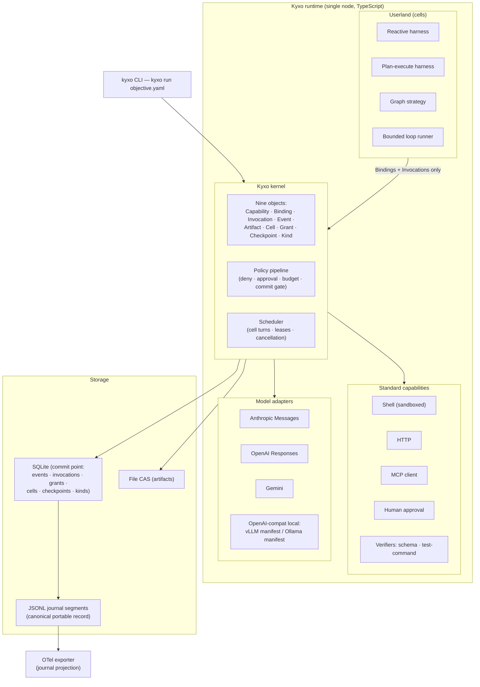
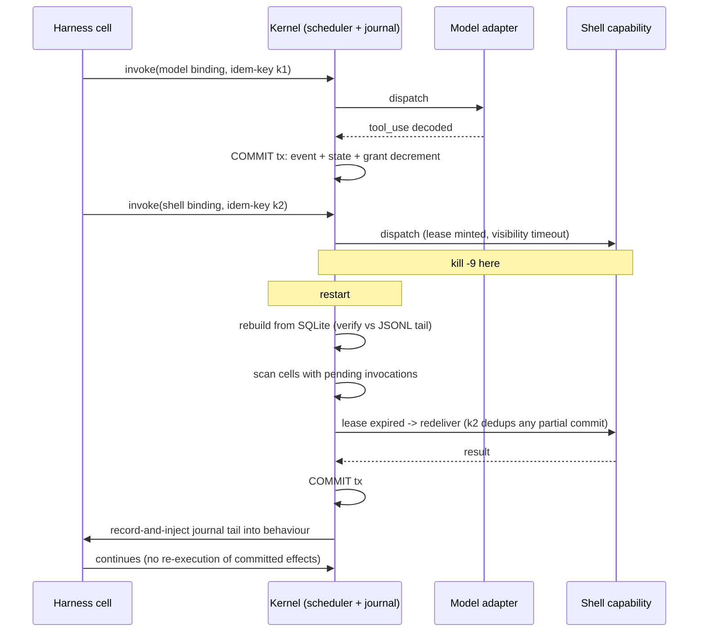

# 14 — MVP Architecture (Mission Phases 36–37)

Status: draft for adversarial review. Written from `research/DESIGN-SPINE.md` (pre-adversarial-review) and the evidence notes cited inline. Labeling follows `research/METHODOLOGY.md`: everything in this document is OUR PROPOSAL unless explicitly labeled otherwise; evidence claims carry FACT / SOURCE-CODE OBSERVATION / OBSERVED BEHAVIOR / INFERENCE labels with confidence.

Vocabulary is spine §2 and is load-bearing throughout: *kernel* (nine objects + two mechanisms), *Kyxo runtime* (kernel + standard capabilities + SDKs), *harness* (an orchestration strategy behaviour, never the kernel), *model adapter* (code-bearing plugin, never a config record), *agent* (a configuration, never a type). Where this document says "strategy" it always means *orchestration strategy*.

Sibling references: object definitions in 05-KERNEL-PRIMITIVES.md; manifest grammar in 06-CAPABILITY-SPEC.md; full runtime layering in 07-RUNTIME-ARCHITECTURE.md; journal/event schema detail in 08-EVENT-AND-STATE-MODEL.md; strategy behaviours in 10-HARNESS-AND-GRAPH-RUNTIME.md; grants and policy detail in 11-SECURITY-AND-POLICY.md; kinds in 12-EXTENSION-MODEL.md; failure semantics in doc 13 (per spine §7).

---

## 1. The hypothesis the MVP must prove or disprove

Verbatim:

> **"Can heterogeneous AI execution mechanisms operate cleanly through the same minimal runtime primitives without losing their unique capabilities?"**

The MVP (Phase 36) exists to make this sentence falsifiable, and the benchmark harness (Phase 37) exists to measure it. "Cleanly" and "without losing" are the two ways the hypothesis can die: the kernel can fail by needing per-mechanism special cases (not clean), or by flattening what makes each mechanism valuable (lossy). We decompose the hypothesis into eight claims, each with a concrete falsification condition that the MVP demonstrations in §3.3 are designed to trigger if the claim is false.

| # | Claim | Falsified if... |
|---|---|---|
| **F1** | **Universality without `switch(type)`.** Every execution construct — agent, subagent, plan mode, planner, graph, loop, verifier, human — is a composition over the nine kernel objects; kernel code dispatches on Bindings only, never on a construct tag. | Any kernel source path branches on what *kind of thing* is invoking (a construct-name enum, an `isGraph`/`isAgent` flag, a strategy-specific code path). Enforced mechanically: a CI vocabulary lint asserting the strings `agent`, `harness`, `graph`, `loop`, `planner`, `workflow`, `supervisor` do not appear in `kernel/src` identifiers. |
| **F2** | **Harness independence.** The same model, via the same model adapter and Binding machinery, runs under two structurally different harnesses with zero kernel or adapter changes. | Swapping the harness requires touching adapter code, kernel code, or the journal schema; or harness-specific state leaks into the adapter contract. |
| **F3** | **Orchestration coexistence.** Reactive, plan-execute, graph, and bounded-loop strategies run in one Kyxo runtime instance, write to one journal, and can *nest* (a graph node delegates to a reactive harness cell) without privileged kernel paths. | Any strategy needs a kernel primitive the others cannot also use through the public surface (e.g. a graph-only barrier), or nesting requires out-of-band state sharing. |
| **F4** | **Open = closed model parity.** A locally served open model behind an OpenAI-compat engine operates through the same adapter contract, invocation lifecycle, grant charging, and checkpoint semantics as Anthropic/OpenAI/Gemini adapters — divergence lives in manifests, not in forked kernel behavior. | The local-engine path needs kernel changes, a parallel lifecycle, or is excluded from any of the §3.3 demos; or its manifest cannot express its real surface (e.g. logit-level structured outputs) without an untyped escape hatch. |
| **F5** | **Negotiation prevents silent degradation.** A Binding requiring an axis the target lacks fails loudly at bind time; provider-opaque state rides a typed passthrough; nothing is silently stripped or silently lowered. | A demo run silently drops a required axis (the DeepSeek/Gemini class of failure reproduces *inside* Kyxo), or bind-time refusal is so frequent/imprecise that demos route around negotiation via raw passthrough. |
| **F6** | **Checkpoint/resume across process death.** `kill -9` at any event boundary, then restart, resumes the objective from the journal + checkpoint with the exactly-once illusion intact (idempotency keys + leases), for every strategy. | Resume requires strategy-specific recovery code in the kernel; or any injected-kill position produces duplicated external effects or a stuck cell. |
| **F7** | **Grants actually bound spend and authority.** Budget exhaustion halts the charged subtree with a typed `budget-exceeded` suspension; delegation attenuates (child ≤ parent) by construction; no code path lets a strategy widen its own grant. | Any effectful invocation commits without a grant decrement; a child cell exceeds its parent's remaining budget; or enforcement overhead forces batched/deferred accounting that breaks lineage accuracy. |
| **F8** | **MCP and A2A project cleanly.** MCP servers project into Capabilities+manifests with no kernel awareness of MCP; the invocation transition algebra projects onto A2A task states as a total mapping. | The MCP client needs kernel hooks beyond the standard capability contract; or the A2A state mapping needs states the algebra lacks (proving the lifecycle is not a superset). |

Two scope notes on falsifiability. F8's A2A half is tested in the MVP by *projection mapping* (a pure function from our transition algebra to A2A task states, run against A2A state fixtures), not by wire interop — the A2A server is deferred (§2.2); this is the weakest of the eight tests and is flagged as such. F5 is deliberately asymmetric: false *negatives* at bind time (refusing a workable binding) are a quality bug; false *positives* (silent degradation) are hypothesis-falsifying, because silent loss is the documented ecosystem failure mode.

**Evidence** — The same client behavior (strip unknown fields) is correct on one provider and a hard 400 on another; reasoning replay contracts alone span must-echo-verbatim, must-carry-opaque-blob, and dropped-server-side (OBSERVED BEHAVIOR/HIGH and FACT, research/notes/open-model-infrastructure.md §5, §10 axis 16). Zero of eight competitive coding agents contain a graph/DAG engine, and five independently converged on subagent = session + policy diff + budget + single result message (SOURCE-CODE OBSERVATION and INFERENCE/HIGH, research/notes/coding-agents-landscape.md §6, §10).
**Interpretation** — The constructs the ecosystem actually uses are compositions over a small substrate, and the losses the ecosystem actually suffers are negotiation failures, not missing primitives.
**Implication** — F1 and F5 are the load-bearing claims: if composition or negotiation fails, the kernel thesis fails; the other six claims are the mechanisms that make those two demonstrable.
**Confidence** — HIGH that these eight claims decompose the hypothesis without remainder; MEDIUM that the falsification conditions are tight enough to resist "demo theater" (see §6).

---

## 2. MVP scope

Scope rule: the MVP contains exactly what the eight claims need to be tested, and nothing whose absence does not weaken a claim. Deferrals are staged in waves: **Wave 1** = Phase 37 benchmark validation + probe suite + Python SDK start; **Wave 2** = isolation, memory tiers, registry, benchmark UI; **Wave 3** = federation (A2A server, remote cells, distribution, realtime sessions).

### 2.1 IN

| Area | MVP contents | Claim(s) served |
|---|---|---|
| Kernel (TypeScript, single node) | The nine objects (Capability, Binding, Invocation, Event, Artifact, Cell, Grant, Checkpoint, Kind) + policy pipeline + scheduler; journal on SQLite + JSONL segments; file CAS; closed invocation transition algebra; idempotency keys, leases, dedup windows; GREASE injection in Bindings from v0 | All |
| Model adapters | Anthropic Messages; OpenAI Responses; Gemini; one OpenAI-compat local engine — **vLLM primary**, with the same adapter driving an Ollama manifest as a degraded target (rationale in §2.3) | F2, F4, F5 |
| Standard capabilities | Shell (subprocess sandbox: workdir jail + env allowlist + no-network default), HTTP (egress allowlist), MCP client (2026-07-28 revision, stateless per-request declaration), human-approval (form-mode elicitation contract + typed `approval-required` suspension) | F1, F5, F7, F8 |
| Orchestration strategies | One reactive harness; one plan-execute harness; one graph strategy (declarative artifact compiled to cell steps, dynamic spawn with deterministic uuid5-style identity); one bounded loop runner (termination policies: no-pending-tools, mistake budget, max-iterations) | F1, F2, F3 |
| Verification | Commit-gate hook in the policy pipeline + two verifier capabilities: JSON-schema verifier, test-command verifier (runs a declared command in the sandbox; exit code + captured report become Evidence artifacts) | F1, F7 |
| Interface | `kyxo run objective.yaml` (Objective kind instance + profile; default profile = reactive harness + standard tools + sane budgets per spine §9); `kyxo journal`, `kyxo checkpoint fork` inspection/repair verbs | F6, simplicity criterion |
| Observability | OTel export as a projection of the journal (GenAI semconv alignment); no second event bus | Observability criterion |
| Kind registry | Storage + schema validation + one storage version with conversion + watch streams; seed kinds: Objective, Plan, Evidence, TestReport | F1, extensibility criterion |

### 2.2 OUT — deferred, not abandoned

| Deferred item | Why not in the MVP | Lands in |
|---|---|---|
| A2A server | Federation adds a second wire surface without strengthening any claim the projection-mapping test doesn't already cover; the transition algebra is designed as a superset of A2A states (spine §3, object 3), so the mapping is testable as data | Wave 3 |
| Distributed execution | Spine §8: single-node first; distribution = portable checkpoints + protocol edges, never an in-kernel mesh (the MAF precedent, spine §1). Nothing in F1–F8 requires two nodes | Wave 3 |
| WASM isolation | The crossing-primitive cost question is explicitly deferred (spine §8); in-process reference passing keeps the MVP honest about kernel overhead (F7's overhead test) without conflating it with isolation cost. Shell sandbox covers the security demo floor | Wave 2 |
| Memory tiers beyond basic cells | Labeled state cells suffice for every demo; Letta-style blocks with compile hooks are a userland pattern the Kind registry must be able to host later — the MVP proves the hosting mechanism, not the pattern | Wave 2 |
| Registry service | A static in-repo manifest directory (indexed without execution) serves discovery for four adapters and a dozen capabilities; the static/dynamic discovery split is preserved so a registry slots in without contract change (FACT precedent: MCP registry's deliberate metadata/runtime split, research/notes/mcp-protocol.md §15) | Wave 2 |
| Realtime/Live sessions | The bidirectional session invocation shape is **reserved in the contract schema v0 but not implemented** — deferring the schema (not just the code) would force the retrofit the contract exists to prevent, since sessions cannot be lowered onto request/response (FACT/HIGH, research/notes/open-model-infrastructure.md §7) | Wave 3 (implementation) |
| Model×harness benchmark UI | Phase 37 V1 is CLI + JSONL result records + OTel; a UI adds no measurement validity | Wave 2 |
| Python SDK, Rust kernel | Protocol-first kernel API (versioned schema) is the portability mechanism; second SDK and reference-implementation replacement wait for a validated contract | Wave 1 / post-validation |

### 2.3 Scope decisions that need defending

**vLLM over Ollama as the primary local target.** The mandate allows either. We choose vLLM because parity (F4) is only a strong claim if the open target's *distinctive* capabilities survive: vLLM exposes the tier-1 grammar surface (five structured-output constraint classes including EBNF and structural tags), ~25 pluggable tool-call parsers, and named reasoning parsers — the richest axis surface in the open stack (FACT, research/notes/open-model-infrastructure.md §3–§4). Proving parity against Ollama alone would test the *easy* half of F4. Ollama is retained as a second **manifest** over the same adapter code: its compat layer silently drops `tool_choice` and does not enforce thinking budgets (FACT, same note §6), so the pair {vLLM manifest, Ollama manifest} over one adapter is itself a negotiation demo — same dialect family, different declared axes, different bind results. One adapter, two manifests, zero forks.

**SQLite is the commit point; JSONL is the canonical portable record.** Spine H5 mandates journal-first record-and-inject with a two-tier store. The MVP implements commit as a single SQLite transaction (event append + invocation state transition + grant decrement — atomicity is what makes the exactly-once illusion and F7 cheap to reason about), and writes JSONL segments from the same commit path as the *canonical serialization* — the published execution-record format, sufficient to rebuild the SQLite projection from scratch (`kyxo journal rebuild` is a conformance test, not a slogan). This is a deliberate interpretation of "journal SQLite+JSONL," and the authority ordering (transaction-first vs file-first) is flagged for adversarial review.

**Evidence** — DBOS demonstrates checkpoint-per-step as one Postgres write per step at >40K workflows-or-steps/s on a single database (FACT, research/notes/durable-execution.md §4); Temporal's history caps (51,200 events / 50 MB / 2 MB payloads) and the base64 tax are the documented cost of putting payloads in the log (FACT, same note §1–§2).
**Interpretation** — Transactional per-effect accounting is cheap relative to model/tool latency; log bloat, not write overhead, is the real risk — and it is solved by the two-tier split, not by weakening accounting.
**Implication** — Decrement-at-commit inside the event transaction is affordable (bounding F7's overhead risk); payloads above a small inline cap (32 KB) go to CAS by reference, always.
**Confidence** — HIGH.

---

## 3. MVP architecture

### 3.1 Components



The arrows encode the discipline: strategies reach capabilities and adapters *only* through kernel Bindings/Invocations (F1); the kernel reaches storage; observability hangs off the journal, never off a side channel. Model adapters and harnesses sit at the same altitude — both are capabilities with manifests, which is what makes the Phase 37 matrix expressible (§5.4).

### 3.2 Storage sketch

SQLite (authoritative commit point; all writes in one transaction per commit):

```sql
events(seq PK, cell_id, type, schema_ver, ts,
       invocation_id, grant_id, correlation_id, causation_id, actor_id,
       payload_inline /* <=32KB */, payload_ref /* CAS hash otherwise */,
       config_hash /* strategy+prompt+model pin, spine §7 */)
invocations(id PK, cell_id, binding_id, state /* closed algebra */,
       idempotency_key, grant_id, suspension_type, suspension_payload_ref,
       lease_expires_ts, created_seq, updated_seq,
       UNIQUE(cell_id, idempotency_key))
bindings(id PK, capability_id, manifest_hash, dialect_tier_set_json,
       grease_json, grant_id, policy_route_json, sealed_seq)
grants(id PK, parent_id /* lineage tree */, rights_json,
       tokens_remaining, usd_micros_remaining, wallclock_ms_remaining,
       invocations_remaining, spawn_depth, spawn_width, risk_class,
       revoked_seq NULL)
cells(id PK, key, definition_hash, status, journal_head_seq, state_ref)
checkpoints(id PK, cell_id, name, journal_seq, snapshot_ref,
       pending_invocations_json, definition_hash, lineage_json)
kinds(name PK, storage_version, schemas_json, conversion_ref)
artifacts(hash PK, size, media_type, producing_invocation_id, labels_json)
```

JSONL: `journal/<cell_id>/segment-NNNN.jsonl`, one event envelope per line, segment rotation at size threshold; the full directory + CAS is the portable execution record (differentiator 5, spine §6). CAS: `cas/sha256/<2>/<2>/<hash>`, immutable, provenance and taint labels in the artifact index. Checkpoint = journal position + state snapshot ref + pending invocations, bound to `definition_hash` — the MAF definition-scoped shape (spine §3, object 8).

The two-plane rule is structural: live streams (token deltas, progress) are projections served from the event pipeline with explicitly weaker guarantees — at-least-once, truncatable, retry-visible. **Evidence** — Temporal's Workflow Streams had to surface failed attempts' partial tokens to subscribers while durable state saw only successful returns; the truth plane and the observation plane could not be one channel (FACT, research/notes/durable-execution.md §2). **Interpretation** — this is a law of the workload, not a Temporal artifact. **Implication** — the MVP journals *outcomes* and streams *attempts*, and never lets an observer channel become load-bearing for recovery. **Confidence** — HIGH.

### 3.3 The demo scenarios (proof obligations)

Each demo is a scripted, repeatable run in CI with a machine-checked pass condition. Together they cover F1–F8.

| # | Demo | What happens | Pass condition | Claims |
|---|---|---|---|---|
| D1 | **8-construct universality** | One objective exercises, in one run: an "agent" (reactive harness config), a subagent (child cell + attenuated grant + single result), plan mode (same harness under an effect-denying policy route), a planner (capability emitting a Plan kind), a graph workflow, a bounded loop, a verifier at the commit gate, and a human approval | Run completes; vocabulary lint on `kernel/src` passes; every construct visible in the journal as compositions of the nine objects only | F1, F7 |
| D2 | **Same model, two harnesses** | The identical model + adapter + manifest runs the same objective under the reactive harness and the plan-execute harness | Zero diff in kernel + adapter code between runs; journal shows identical adapter-facing event types; outcome recorded for Phase 37 | F2 |
| D3 | **Graph with mutation** | Graph strategy mid-execution emits a new plan version (dynamic dispatch: a node's result spawns steps not in the original artifact) with deterministic derived invocation identity | Resume-after-kill during the mutated section memoizes correctly (uuid5 identity dedups); both plan versions in the journal with lineage | F3, F6 |
| D4 | **Loop with escalation** | Bounded loop runner exhausts its mistake budget; kernel raises typed `approval-required` suspension routed to the human-approval capability; human resumes or cancels | Suspension payload is typed; the wait costs nothing (no busy poll); decision + responsibility metadata journaled | F1, F7 |
| D5 | **kill -9 resume** | SIGKILL injected at every event-type boundary (parameterized fault-injection matrix), restart, resume | For every injection point: no duplicated external effect (idempotency + lease redelivery), no stuck cell, objective completes; sequence diagram below | F6 |
| D6 | **Budget-exhaustion cascade** | Parent grant sized so a delegated child exhausts tokens mid-objective; child suspends `budget-exceeded`; escalation walks the grant lineage to the parent cell, which reallocates or aborts | Charged totals in grant lineage equal adapter-reported usage exactly; child never exceeds parent's remaining budget; cascade order matches lineage tree | F7 |
| D7 | **MCP tool + native tool side by side** | One harness turn uses a native shell capability and an MCP-served tool (projected via `tools/list` → manifest) interchangeably | Kernel path identical for both (same invocation lifecycle, same policy pipeline, same grant charging); MCP-ness visible only in the capability's manifest provenance | F1, F8 |
| D8 | **Provider swap via checkpoint fork** | Objective starts on Anthropic Messages; `kyxo checkpoint fork` re-binds to the vLLM manifest mid-objective; opaque carry-through artifacts (thinking blocks + signatures) are *explicitly dropped with a journaled degradation event*, never silently | Fork completes on the new provider; the drop is a typed, policy-visible event; a forced bind requiring an axis vLLM lacks fails loudly at bind time | F4, F5, F6 |

D5's mechanics, since it is the least forgiving demo:



**Evidence** — All three durable-execution systems impose deterministic orchestration + journaled effects + idempotent consumers, and all synthesize exactly-once from at-least-once + dedup keys, never from transport guarantees (FACT across Temporal/Restate/DBOS/Celery, research/notes/durable-execution.md §5, §7). Temporal's positional command-matching taxes AI code whose prompts change weekly (patching edge-case tables; RunState bound to tool-graph identity) (FACT, same note §1–§2).
**Interpretation** — Record-and-inject (Restate/DBOS shape) fits a workload whose durable artifact is the event data, not the code.
**Implication** — D5 resumes by injecting the journal tail into the behaviour, not by re-emitting commands positionally; version pinning is per-event `config_hash`, and fork-from-checkpoint (D8) is the repair/upgrade verb — old code paths never need to survive.
**Confidence** — HIGH.

---

## 4. Acceptance criteria

The mission's eleven architecture-phase success criteria, each mapped to a concrete MVP demonstration with a binary pass condition. A criterion without a row in this table would be unfalsifiable; there are none.

| Criterion | MVP demonstration | Pass condition |
|---|---|---|
| 1. Portability | Same objective + same strategy across all four adapters (D2 machinery × 4) | Only the Binding changes between runs; journal event-type sequence identical modulo adapter payloads; portable record (JSONL+CAS) replays into an equivalent SQLite projection on a clean checkout |
| 2. Open models | vLLM (and Ollama-manifest) adapter passes the identical adapter conformance suite as the three closed adapters; D8 lands on vLLM | No conformance carve-outs for the local target beyond declared manifest axes; vLLM's tier-1 grammar axis usable through the typed contract (not passthrough) |
| 3. Harness independence | D2 | Zero kernel/adapter diff between harness runs |
| 4. Orchestration independence | D1 + D3; graph node delegates to a reactive harness cell (nesting) | All four strategies run over the unchanged public kernel surface; vocabulary lint passes |
| 5. Protocol interop | D7 (MCP southbound); A2A projection test (total mapping from the invocation transition algebra onto A2A task states, run against fixtures) | MCP tools indistinguishable in kernel treatment; A2A mapping total — every algebra state maps, no A2A state unreachable |
| 6. Durability | D5 fault-injection matrix; D3 resume-during-mutation | Every injection point in the matrix green; zero duplicated external effects across the matrix |
| 7. Extensibility | Add one new Kind (with schema + watch) and one new verifier capability, post-freeze | `git diff --stat kernel/` is empty for both additions |
| 8. Capability preservation | Anthropic thinking signatures and OpenAI encrypted reasoning items round-trip via typed carry-through artifacts; vLLM structural-tag constraint used in a demo; D8's degradation event | Provider-opaque state survives replay bound to (provider, model, position); cross-model replay drops it *loudly*; no capability reachable only via untyped `extra_body`-style leakage |
| 9. Security | D6 (budgets); forged-grant test (fabricated grant reference rejected at invocation); attenuation test (child grant request > parent remainder rejected at delegation); deny-stage non-bypass test; shell sandbox escape probes (network egress, workdir escape) | All five red-team probes fail closed; every effectful commit carries a grant decrement in the same transaction |
| 10. Observability | OTel export consumed by a stock collector; trace reconstruction exercise: from one external effect, recover invocation → binding → grant lineage → objective purely from exported spans + journal | Reconstruction succeeds with no auxiliary logging; no second event bus exists in the codebase |
| 11. Simplicity | `kyxo run objective.yaml` with an empty profile section completes a nontrivial objective on defaults; the nine-object public API fits one reference page | New-user path requires zero kernel-object mentions; default profile = reactive harness + standard tools + sane budgets (spine §9) |

Criterion 8 deserves its explicit evidence block, because it is where "without losing their unique capabilities" is won or lost.

**Evidence** — Encrypted reasoning items, thinking signatures, thought signatures, and DeepSeek's echo-required `reasoning_content` are four instances of the same requirement: provider-opaque state that must be persisted and replayed bound to provider/model/position, that generic history sanitizers destroy, with hard-400 consequences (FACT and OBSERVED BEHAVIOR/HIGH, research/notes/open-model-infrastructure.md §5, §10 axes 3–5). Keeping reasoning items measurably improves results and cache utilization (FACT, same note §5).
**Interpretation** — Capability preservation is not a manifest formality; it has measured quality and cost consequences, and the failure mode is silent until it is a 400 or a benchmark regression.
**Implication** — Carry-through artifacts are first-class, taint-labeled, non-portable-by-declaration; criterion 8's test is round-trip fidelity plus *loud* cross-model dropping, and Phase 37 measures the quality delta of preservation (§5).
**Confidence** — HIGH.

---

## 5. Benchmark strategy (Phase 37)

### 5.1 The separation methodology

The benchmark exists to measure the three-way separation the architecture asserts: **model** (adapter + manifest), **harness** (strategy behaviour), and **runtime** (kernel mechanics) as independently swappable factors. Design: hold two factors fixed, vary the third, over a fixed objective corpus, with paired runs sharing grants, policies, seeds where the target honors them, and environment snapshots. The runtime factor is fixed at Kyxo-MVP in V1 — cross-runtime comparison (the same harness hosted on other substrates) is methodologically desirable and deferred (§5.5).

This design takes counter-hypothesis C2 seriously (spine §1): harness quality *is* partially model-coupled — Cursor's weeks-per-model adaptation and ~30% loss from dropping reasoning traces (FACT/HIGH via spine C2, research/notes/cursor.md) mean the matrix's off-diagonal cells are expected to be *worse* than tuned pairs, and that is a finding, not a bug. The benchmark's product is the **measured shape of model×harness coupling**, which no one publishes today (INFERENCE/HIGH: no system in the landscape publishes evals of its own compaction or pairing choices — research/notes/coding-agents-landscape.md, open questions).

### 5.2 Corpora and pairing

V1 corpus: 20–50 owned objectives in three task classes — (a) repo bug-fix/feature tasks with executable test oracles, (b) research-synthesis tasks with schema-verifiable outputs, (c) structured-extraction/transformation tasks with exact-match oracles. Every objective ships as an Objective kind instance + an environment checkpoint (workspace CAS snapshot), so runs start from a bit-identical state. Paired-run protocol: for each corpus item, all matrix cells run under identical grants (token/USD/wall-clock budgets) and identical policy routes; N≥3 repetitions per cell in V1 (variance is reported, not hidden). Public benchmark reuse (SWE-bench-class) is deliberately deferred: contamination management and harness-tuning-to-benchmark are validity threats V1 should not take on.

### 5.3 Metrics

All metrics are journal projections — no instrumentation exists outside the truth plane.

| Metric | Definition | Journal derivation | V1 |
|---|---|---|---|
| Success rate | Terminal `completed` + commit-gate Evidence pass | Invocation terminal states × Evidence artifacts | Yes |
| Completion quality | Graded score beyond binary success | Judge-verifier capability (calibration required) | Partial (report, don't rank) |
| Time | Objective start → terminal event | Event timestamps | Yes |
| Tokens | Prompt + completion + reasoning tokens | Adapter usage events charged to grants | Yes |
| Cost | Monetary spend | Grant `usd_micros` decrements | Yes |
| Tool calls | Effectful invocations by capability class | Invocation records | Yes |
| Context consumption | Compiled-context size per invocation; peak and growth | Context-compiler events | Yes (raw); normalization deferred |
| Recovery rate | Injected-kill runs reaching `completed` | D5 machinery over corpus subset | Yes |
| Human interventions | `approval-required` suspensions per run | Suspension events | Yes |
| Verification pass rate | First-attempt Evidence pass at commit gates | Commit-gate events | Yes |
| Iterations | Harness turn cycles per objective | Behaviour turn events | Yes |

### 5.4 Why the matrix is expressible at all

Because harnesses and model adapters are both capabilities with axis-typed manifests, a matrix cell is just a Binding: the benchmark runner enumerates (harness h, model manifest m), attempts `bind(h, m, corpus policy)`, and runs on success. Bind failures are *first-class results* — the coverage map of which cells are impossible and why (missing axis, tier mismatch) is itself a deliverable, and it is precisely the data the ecosystem lacks (FACT-by-absence: capability discovery today is `/v1/models` returning IDs; nothing negotiates — research/notes/open-model-infrastructure.md §10 axis 15). Outcome telemetry per (capability × model) pair feeds back into manifests as the third information source (declared / probed / observed — spine C3); Copilot's EditToolLearningService is the SOURCE-CODE-OBSERVATION/HIGH precedent that per-model outcome measurement changes which capability variant you should bind (research/notes/coding-agents-landscape.md §4).

### 5.5 V1 measures vs defers

**V1 measures**: the full metric table above across the 4-adapter × 4-strategy matrix on the owned corpus; carry-through preservation deltas (same pair, carry-through on vs off — quantifying criterion 8); grant-enforcement overhead (no-op-policy baseline vs full pipeline). **V1 defers**: judge calibration for completion quality (report raw, no rankings); cross-provider *cost normalization* under four incompatible caching contracts — explicit annotations vs automatic prefix vs server-side cache resources vs engine-internal radix reuse make naive $/objective comparisons misleading (FACT, research/notes/open-model-infrastructure.md §8), so V1 reports cost with the caching contract as a labeled covariate; cross-runtime baselines (hosting our reactive harness on other substrates); statistical power beyond N=3; public-benchmark results.

---

## 6. What failure looks like

The hypothesis is only worth holding if we can say in advance what would kill it. The following observations, if made during Phases 36–37, DISPROVE the hypothesis or force a spine amendment, and each names its redesign trigger. These are standing red-team targets, not remote contingencies.

| # | Disproving observation | What it kills | Redesign trigger |
|---|---|---|---|
| X1 | Adding a provider adapter requires kernel changes — new event types outside the Kind/extension mechanism, lifecycle states, or scheduler behavior per provider | F4, and the kernel's universality outright | Re-open spine §3: the nine objects are wrong or incomplete; the missing axis becomes a candidate tenth object only if it passes the Liedtke admission rule |
| X2 | A strategy needs a special-case kernel path — e.g. the graph runner needs a kernel-side barrier or the plan-execute harness needs privileged context access that cannot be expressed as scheduler policy or behaviour callbacks | F1, F3; "strategies as behaviours" (spine §5) | Re-open the behaviour contract in doc 10; if two of four strategies need private paths, H1's "orchestration is userland" verdict was wrong |
| X3 | The 8-construct demo (D1) cannot pass the vocabulary lint — kernel code ends up inspecting construct identity to behave correctly | F1 directly — the literal `switch(type)` failure | Same as X2; additionally invalidates the positioning claim of spine §6 (substrate, not framework) |
| X4 | Grant enforcement is unaffordable: decrement-at-commit adds >5% wall-clock on a tool-heavy objective (vs no-op policy baseline), or accurate lineage requires batching that decouples charge from commit | F7; budgets-as-kernel-object (our one novel kernel object, spine §3) | Re-open grant granularity: charge-at-commit may need to become charge-at-lease with reconciliation; if accuracy cannot survive that, budgets demote to advisory — a major thesis retreat that must be logged in the spine amendment log |
| X5 | Negotiation becomes ceremony: manifests drift from reality faster than probes correct them, bind-time refusals are so common that demos route through typed passthrough for ordinary work, or the axis set balloons past maintainability | F5; H4's refinement | Re-open 06-CAPABILITY-SPEC.md tiering: collapse axes to the empirically load-bearing subset; if even the 16-axis core can't stay truthful for four adapters, negotiation-over-identity fails as a mechanism, not just a design |
| X6 | Cross-provider checkpoint fork is semantically hollow: D8 runs, but dropped carry-through state degrades outcomes so severely (the ~30%-class regression, spine C2) that provider-swap is a false promise in practice | The *practical* value of F4/F6's portable record; not their mechanics | Re-scope the portability claim: the record is portable, the *conversation quality* is provider-bound; spine §6 differentiator 5 gets re-worded from "portable execution" toward "auditable + forkable execution," and Phase 37 publishes the measured penalty |
| X7 | The two-plane split fails operationally: journal-projected live streams cannot meet interactive latency, creating pressure for a second, load-bearing event bus | The event-system doctrine (spine §2, §3 object 4) | Re-open 08-EVENT-AND-STATE-MODEL.md: the advisory plane may need its own store (the DBOS separate-streams-table shape) — acceptable — but if *recovery* ever reads the advisory plane, the doctrine is dead |
| X8 | Single-writer cells serialize real work: parallel tool fan-out inside one harness turn, or graph parallel branches, bottleneck on cell turns badly enough that strategies start sharing state outside cells | F3; the Cell object's granularity | Re-open cell granularity (turn-scoped child cells, shared-read handlers per the Orleans/Restate precedent — research/notes/durable-execution.md §6); if strategies still need extra-cellular shared mutable state, the single-writer claim was wrong |

Two failure modes deserve prose because they are the sneaky ones.

**Demo theater.** Every demo in §3.3 can be passed by a kernel that special-cases the demo. The countermeasures are structural: the vocabulary lint (X3) runs on every commit, not on demo day; the fault-injection matrix (D5) is parameterized over *all* event types including ones added later; criterion 7 (extensibility) is executed *after* interface freeze by adding capabilities the kernel authors did not design for. If the MVP passes demos but fails the post-freeze extensibility test, we treat the hypothesis as **unproven**, not proven.

**Silent success.** The hypothesis can also fail by the MVP working while measuring nothing — if Phase 37's matrix shows no meaningful variance across harnesses (all coupling lives in the model) or across models (all quality lives in the harness), then the three-way separation is real but *uninteresting*, and the program's value proposition narrows to durability + grants + record format. That outcome would not disprove the kernel; it would disprove the *benchmark's premise* and redirect Wave 2 investment toward the differentiators in spine §6 that do not depend on the matrix (grants, verification at commit, provenance). We commit in advance to reporting that outcome rather than re-cutting the corpus until variance appears.

The honest summary of the MVP's epistemic role: Phases 36–37 cannot *prove* the hypothesis — universality claims are only ever falsified or survived. What the MVP can do is put all eight claims in a position where surviving is informative: four adapters spanning the genuinely divergent paradigms (research/notes/open-model-infrastructure.md §10), four strategies spanning the observed orchestration space (research/notes/coding-agents-landscape.md §1), death-by-SIGKILL at every boundary, and budgets that are either enforced in the same transaction as truth or demonstrably not. If the kernel is wrong, this MVP is designed to find out in weeks, not after a distributed system is built on top of it.
