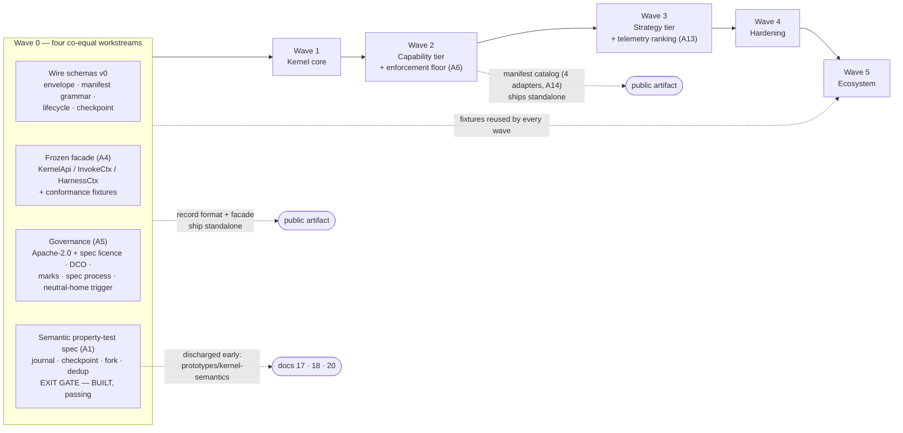
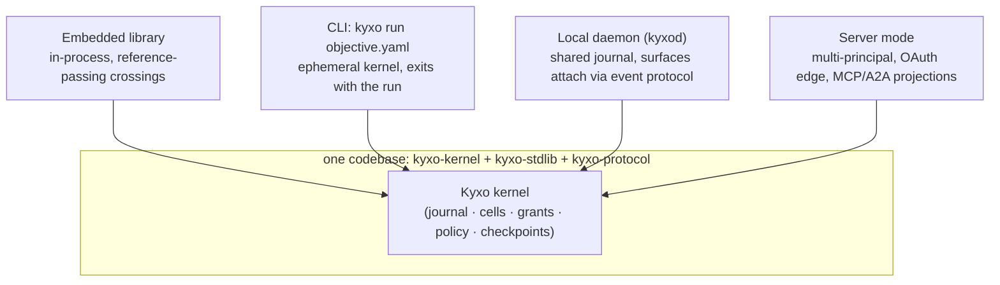

# 15 — Implementation Roadmap

> **Post-review status (2026-08-16, phase 2).** This document predates the adversarial review; the
> review's binding adjudications live in the Amendment log of `research/DESIGN-SPINE.md` (A1–A14),
> with the full findings in `research/ADVERSARIAL-REVIEW.md`. They are now reflected in the body.
> **Applied here:** A1 (the executable property-test spec of journal/checkpoint/fork/dedup as a
> Wave-0 exit gate — **since built and passing**, §2 Wave 0, §4), A2 (reserve/settle/release,
> §2 Wave 1), A3 (guarantee grades frozen at Wave 0, graded at Wave 2; the waterline indicator on
> risk R5), A4 (the facade freeze joins the schema freeze in Wave 0), A5 (the governance workstream
> in Wave 0, with risk R11), A6 (the enforcement floor ships with the capability tier in Wave 2, not
> the hardening wave; risk R12), A7 (this document's wave numbering is canonical; **Wave 2's adapter
> roster corrected to doc 14's** — Anthropic Messages, OpenAI Responses, Gemini, one OpenAI-compat
> adapter carrying vLLM *and* Ollama manifests), A13 (selection contract and telemetry schema frozen
> at Wave 0, ranking in Wave 3), A14 (catalog scope: conformance-derived manifests for the four MVP
> adapters only; the community catalog is a governance deliverable — Wave 2, Wave 5, risk R6).
> **Outstanding:** none known.
> Where this document conflicts with the Amendment log, **the amendment log governs**.
>
> **Executable semantics supersede prose.** The Wave-0 semantic gate has been discharged ahead of
> schedule: `prototypes/kernel-semantics/` with normative prose in `docs/17-KERNEL-SEMANTICS.md`,
> checked invariants in `docs/18-KERNEL-INVARIANTS.md` and results in
> `docs/20-SEMANTIC-TEST-RESULTS.md`. Two risks in §4 are retired by that evidence and the residual
> risks that survive it are stated explicitly rather than left implied.


Status: DECIDED (pre-adversarial-review). Covers mission Phases 30 (waves), 31 (deployment
architecture), 35 (build-vs-reuse), 38 (self-hosting note). Written from
`research/DESIGN-SPINE.md`; vocabulary per spine §2 and `docs/05-KERNEL-PRIMITIVES.md`.
Everything here is OUR PROPOSAL unless carrying an explicit evidence label; evidence claims
cite the research notes.

Inherited implementation decisions this roadmap does not relitigate (spine §8): TypeScript
reference kernel, protocol-first (the kernel API is a versioned schema, the implementation is
replaceable); single-node V1; SQLite/JSONL journal + file CAS behind a conformance-tested
storage interface. The roadmap's job is to sequence that build so that (a) every wave ends in
something independently valuable, (b) the contracts freeze before the code that would ossify
them, and (c) the risks with kill-signals are instrumented from the wave in which they can
first fire.

---

## 1. Build vs. reuse (Phase 35)

The selection rule mirrors the kernel admission rule: **reuse everything that is not the
product surface.** The gap map (spine §6) says Kyxo's differentiation is grants/budgets,
commit-gate verification, axis-typed negotiation, structural provenance, the portable
execution-record format, and delegation attenuation. Every component on that list is BUILD.
Everything else — protocol plumbing, OAuth, tracing, sandbox primitives, model wire clients —
is ADOPT, WRAP, INTEGRATE, or DEFER. Building any of those would burn the schedule on
undifferentiated machinery and, worse, put us in maintenance competition with ecosystems
(MCP Tier-1 SDKs, OTel, OS sandboxes) that have full-time staff.

| Component | Decision | Reason | Risk |
|---|---|---|---|
| MCP protocol library | **ADOPT** the official TypeScript SDK (Tier 1) | The 2026-07-28 stateless pivot rewrote the protocol's session model, handshake, and transport rules in one revision, with a 7-row era-compatibility matrix and typed negotiation-by-error; the Tier-1 SDK is contractually maintained against that churn (SDK tiering with relegation, SEP-1730) and the spec is conformance-test-gated per SEP (FACT, research/notes/mcp-protocol.md §12, §16). Reimplementing era detection and dual-era behavior is pure cost. | Coupled to their release cadence; a future pivot of similar magnitude lands on our schedule. Mitigation: the SDK is confined inside the MCP capability provider; kernel code never sees MCP types. |
| A2A | **ADOPT** official SDK; **INTEGRATE at the edge** (client role: remote agents as capabilities); **DEFER server projection** to Wave 5 | A2A's task lifecycle is the substrate our invocation algebra extends (spine §3.3); the SDK gives tri-binding conformance and the 0.3-compat mode for free (FACT, research/notes/a2a-protocol.md F11). Projecting Kyxo cells *as* A2A servers is valuable but not on the critical path. | Observed SDK/spec drift (`TASK_STATE_ERROR` docstring vs proto — SOURCE-CODE OBSERVATION, a2a-protocol.md F11); 1.0 was a breaking release and extensions may add states (F10), so our mapping table must pin spec versions. |
| Journal store | **BUILD thin over SQLite**; **ADOPT Postgres as a second backend later** behind the storage interface | The record-and-inject journal with a two-tier reference/payload split *is* the product (spine H5, §6.5); no off-the-shelf store implements our envelope, and DBOS demonstrates that one database + a thin library is a sufficient durable substrate at >40K steps/s (FACT, research/notes/durable-execution.md §4). | Hand-rolled durability correctness. Mitigation: conformance-tested storage interface (LangGraph checkpointer precedent, spine §8) plus Wave-1 crash-resume fuzzing; kill-signal in risk R9. |
| CAS (content-addressed store) | **BUILD thin** (hash → file; later hash → object store) | Content addressing is trivial; the value is enforcing the two-tier discipline from day one — every durable-execution system retrofitted a claim-check because payloads-in-the-log is the recurring pathology (51,200-event caps, 2 MB payloads, base64 tax — FACT, durable-execution.md §1–2, Implication 2). | GC/retention is the genuinely hard part and is deliberately deferred; risk is unbounded disk growth in V1. Accepted for single-node V1 with a manual `kyxo gc` escape hatch. |
| Workflow engine | **BUILD-as-strategy** (graph/workflow runner is userland over the kernel); explicitly **NOT ADOPT Temporal for the kernel**; **INTEGRATE later**: document hosting Kyxo cells under external durable engines | See the full block below. | We rebuild journaling machinery Temporal has hardened for a decade. Bounded by scope: single-node, leases, idempotency keys, no mesh — and the INTEGRATE path is the hedge if our durability layer stalls. |
| Tracing | **ADOPT OpenTelemetry** (export-only) | OTel is the only observability surface every studied system converges on: MCP reserves `traceparent`/`tracestate`/`baggage` in `_meta` (SEP-414), A2A delegates observability to W3C Trace Context/OTel by documentation, Temporal ships a replay-safe OTel tracer (FACT, mcp-protocol.md §4; a2a-protocol.md F-vocab; durable-execution.md vocab). Spine §2: observability is a *projection of the journal*, never a second event bus. | GenAI semantic conventions still moving. Keep the exporter a thin projection so semconv churn touches one module. |
| Model APIs | **WRAP provider SDKs; BUILD model adapters** | Model interaction paradigms diverge on 16 axes; LCD flattening fails loudly (Gemini signature 400s, DeepSeek `reasoning_content` 400s) and silently (dropped reasoning measurably degrades results) (FACT/OBSERVED BEHAVIOR, research/notes/open-model-infrastructure.md §5, §10). The adapter — encode/decode + manifest + opaque carry-through — is kernel-adjacent product surface; the raw HTTP client is not. | Adapter maintenance burden tracks provider drift (parser breakage across DeepSeek v3→v3.2 is documented — open-model-infrastructure.md OQ2). Mitigation: probe suite + outcome telemetry detect drift before users do; see risk R6. |
| Sandbox | **ADOPT OS primitives** (seatbelt, Landlock/seccomp, AppContainer) + **EXTEND Codex/Claude-Code patterns** (policy-tiered escalation, approval-gated escape); **DEFER WASM**. **Schedule moved forward by amendment A6:** the OS-sandbox enforcement floor under shell and HTTP ships **with the capability tier in Wave 2**, not in the Wave-4 hardening pass | Competitive coding agents shipped working OS-primitive sandboxes with policy tiers (spine H1/H2 evidence base); WASM component hosting is the declared extension path (spine §8) but its crossing-cost question is deliberately deferred to the wave that measures it (Wave 5 spike). A6's reason for pulling the floor forward: until an effectful capability is bounded by something it cannot decline to call, the grant claim (F7 in doc 14) is a claim about cooperative code — which is exactly what a middleware retrofit into LangGraph or MAF already offers, so shipping without it would leave the BUILD case resting on a discriminator the review retracted. | Platform fragmentation (three OS mechanisms, three behaviors); sandbox tiers must be conservative-by-default or they become theater. Pulling the floor into Wave 2 also front-loads the credential-proxy and egress-allowlist machinery, which is new risk surface in the wave that already carries adapter fidelity — priced in R12. |
| Licensing, governance and marks | **ADOPT standard instruments; BUILD nothing** — Apache-2.0 for code, an open specification licence for schemas/fixtures/facade, DCO, an existing-practice spec-change process, and a foundation home on a pre-committed trigger | Amendment A5 makes governance a Wave-0 deliverable with the same priority as the schema freeze, and none of it is product surface: every instrument here has a well-tested off-the-shelf form, and inventing bespoke ones would signal exactly the unilateral ownership that would keep the record format from being adopted as a format. MCP and A2A both ended in foundation homes (FACT); deciding our trigger before we need it is free now and expensive later. | Governance is cheap to write and expensive to mean: a conformance mark nobody withholds is decoration, and a spec process without named maintainers is a README. Kill-signal and tracking in R11. |
| Auth | **ADOPT OAuth 2.1 libraries** | MCP mandates OAuth 2.1 RS + RFC 9728/8707/9207 + CIMD, with DCR already deprecated (FACT, mcp-protocol.md §11); A2A declares OpenAPI-style schemes at the HTTP layer (FACT, a2a-protocol.md F9). Hand-rolling auth is a security anti-decision. | CIMD is still a draft; auth extension churn (EMA, client-credentials ext). Confine to the edge; Grants — our authority model — are kernel-internal and unrelated to wire auth. |
| Container runtime | **DEFER** | Execution environments are leasable capabilities (spine §2); V1 is single-node with process sandboxes. Container/VM environments arrive as capability providers, not kernel features. | None material in V1; the deferral is cheap because the environment contract is already a manifest. |
| Vector DB | **DEFER** | Retrieval is a capability; memory is labeled state cells (spine §5). The kernel owns neither embeddings nor indexes. Embed/rerank are first-class *invocation profiles* (spine §4), which is all the kernel needs to know. | Ecosystem expectation mismatch ("where's the RAG?"); answered by docs 09-CONTEXT-AND-MEMORY positioning, not code. |
| Constrained decoding | **INTEGRATE xgrammar-class engines via open-model serving** | XGrammar is already the default structured-output backend of vLLM/SGLang/TensorRT-LLM/MLC-LLM (FACT, open-model-infrastructure.md §4); the kernel models grammar expressivity as a negotiated axis with tiers (CFG > regex > schema-subset > json-mode > none) and treats constrained decoding as verification at the model boundary. | Only exists where logit access exists; the same guarantee on closed APIs degrades to post-hoc validate+retry at different cost — the negotiation layer must price that difference, not hide it. |
| Eval harness | **BUILD minimal** | The benchmark matrix (`model × harness`) is expressible precisely because both are capabilities with manifests (spine §9); no external eval framework understands our Binding/Grant/journal objects. Minimal = matrix runner + fixture objectives + journal-derived scoring, nothing more. | Eval scope creep is a classic sink; the kill-signal is the runner growing opinions about *tasks* rather than *plumbing*. |

### Why not Temporal for the kernel (the contested row)

```
Evidence      — All three durable-execution vendors impose deterministic orchestration +
                journaled effects, and their 2025–26 AI integrations document the friction:
                WorkflowSafeMemorySession rebuilt because host state isn't replay-safe and
                dying at Continue-As-New; HITL requiring serialized RunState bound to the
                exact tool-graph identity; usage accounting silently lost across the activity
                boundary; 2 MB payload caps and 51,200-event history limits hit by
                conversation data; stateful MCP connections requiring a pinned-worker hack;
                ~100 lines of docs on patch-marker edge cases (FACT throughout,
                research/notes/durable-execution.md §1–2). The note's root-cause reading:
                Temporal assumes code is the durable artifact and data flows through it;
                agent workloads invert this (INFERENCE/HIGH, §2).
Interpretation— Positional-replay determinism is a tax proportional to code volatility, and
                AI orchestration code (prompts, model wiring, tool schemas) is the most
                volatile code in the industry. Record-and-inject journaling (Restate-shaped)
                plus checkpoint-lookup (DBOS-shaped) achieve the same recovery invariant
                without making the harness configuration a durable contract.
Implication   — The kernel BUILDs a journal-first store per spine H5 and never adopts a
                replay-first engine as its substrate. Temporal-class engines remain
                INTEGRATE targets in two directions: (a) a Kyxo cell hosted inside an
                external engine's effect unit (activity/handler) for shops standardized on
                Temporal — documented, not built, until demand exists; (b) their operational
                verbs (Restate 1.6 restart-from-journal-point, DBOS fork) are the design
                brief for our checkpoint/fork verbs.
Confidence    — HIGH. This is the best-evidenced negative decision in the program; the
                counter-case (their decade of hardening) is priced in risk R9.
```

### Why the official MCP SDK despite the churn

```
Evidence      — MCP executed a breaking architectural rewrite (sessions removed, handshake
                removed, MRTR replacing server-initiated requests, resumability deleted)
                sixteen months after adding some of those features, and shipped the
                compatibility path in the same revision; deprecation windows are 12 months
                minimum and conformance scenarios gate SEP finalization (FACT,
                research/notes/mcp-protocol.md §1, §12, §16).
Interpretation— The protocol will keep moving, but the governance machinery makes the
                movement trackable — and the SDK tier system makes tracking someone else's
                funded job. The churn is an argument FOR adopting and AGAINST wrapping the
                wire format ourselves.
Implication   — Adopt the TypeScript SDK inside the MCP capability provider; forbid MCP
                types north of the provider boundary; pin spec revisions in the provider's
                manifest so negotiation can express "speaks 2026-07-28 and 2025-11-25".
Confidence    — HIGH.
```

---

## 2. Implementation waves (Phase 30)

Six waves, 0–5. **This numbering is canonical** (amendment A7): where `14-MVP-ARCHITECTURE.md`
previously staged deferrals on a different three-wave scale, its labels have been rewritten in
these terms, and the MVP of that document is Waves 0–3. Each wave ends in something usable and
testable on its own; no wave's exit criteria depend on a later wave. The two standalone-value bets
are deliberate: Wave 0's frozen record format is publishable without any kernel (spine §6.5 —
durable execution has no MCP-equivalent), and Wave 2's manifest catalog + probe suite is usable by
people who never run Kyxo (open-model-infrastructure.md, Implication 10: nobody negotiates today;
accurate manifests for the top targets are immediate value) — bounded, per amendment A14, to the
four MVP adapters, because a catalog is a maintenance commitment and an unmaintained one is worse
than none.



### Wave 0 — Protocol, facade and governance freeze v0

- **Goal.** Freeze the contracts before any kernel code exists to ossify around accidents. Four
  workstreams, and amendments A4/A5/A1 make the last three co-equal with the first rather than
  follow-ons:
  1. **The wire-visible contracts** — event envelope, manifest grammar, invocation lifecycle
     machine, checkpoint schema — as versioned JSON-Schema (2020-12) artifacts with conformance
     fixtures. This is the anti-Codex move: their SQ/EQ protocol drifted per release because it
     was never a spec (spine §8); ours is a spec before it is an implementation.
  2. **The facade** (amendment A4). The wire schemas alone never covered what a provider or a
     strategy actually programs against, so `KernelApi` / `InvokeCtx` / `HarnessCtx` are frozen
     here too: versioned, conformance-tested, with the same stability classes and deprecation
     clock. The normative verb list — decided by what the four phase-1 prototypes demonstrably
     needed — is bind, invoke, resume (with re-grant option), cancel, attenuate, getGrant
     (handle-shaped, A8), charge, storeArtifact/readArtifact, scoped journal read, checkpoint,
     createCell, discovery (listCapabilities), the Kind verbs
     (registerKind/createKindObject/getKindObject/watch), and an injected clock. `InvokeCtx` is
     **data only** — no kernel handle reaches a capability, which is what makes the commit barrier
     structural rather than cooperative. ADR-010's replaceability claim stays scoped to the
     execution record until these fixtures exist; with them, "the TypeScript kernel is replaceable"
     becomes a testable statement instead of an intention.
  3. **Governance** (amendment A5), with the same priority as the schema freeze — see the dedicated
     bullet below.
  4. **The executable semantic spec** (amendment A1) as this wave's hardest exit gate — see below.
- **Architecture introduced.** Date-versioned kernel protocol with stability classes
  (experimental/testing/stable/deprecated, 12-month deprecation floor — MCP's lifecycle
  lifted verbatim, mcp-protocol.md §12). Two-tier event envelope (payloads by Artifact
  reference; correlation/causation/actor IDs). Three-tier manifest grammar (typed named axes
  / `experimental` bag / governed reverse-DNS extensions — the shape that survived MCP's
  full rewrite, FACT, mcp-protocol.md §3). Closed transition algebra extending A2A's states
  with `approval-required` and `budget-exceeded` in the interrupted class (spine §3.3;
  a2a-protocol.md F2 documents that A2A's own machine is deliberately permissive —
  INFERENCE/HIGH there — and OQ1 asks for exactly the closed algebra we are freezing).
  **GREASE from v0**: reserved axis values and extension IDs that conforming implementations
  must ignore, injected randomly by the fixture generator so intolerant parsers fail in
  CI rather than in the field three years from now (TLS's lesson, spine §3.2).
  Four schema shapes are amendment-mandated at freeze time because retrofitting them would break
  every recorded journal: **guarantee grades** sealed per policy-relevant property on the Binding
  (`enforced` / `observed` / `declared`, amendment A3); **reserve/settle event kinds**
  (`grant.reserved`, `grant.settled`, `grant.released`, amendment A2) rather than a single charge
  event; **lineage-scoped, content-inclusive effect identity** plus the fork-disposition record
  (`adopt` / `re-lease` / `compensate` / `abandon`) and the checkpoint's protected-effect set
  (amendment A1); and the **selection contract** — `rank(candidates, telemetry, policy) → choice +
  journaled rationale` with the `TelemetryView` shape (amendment A13). A13's split is deliberate
  and belongs here rather than in Wave 3: the *recording* is frozen now so journals written from
  V1 onward are usable by the Wave-3 ranking strategies, while the *ranking* is deferred.
- **Governance workstream (amendment A5).** Same wave, same priority as the schema freeze, because
  a record format that only we may steward is not a format. Deliverables: **Apache-2.0** for code
  and an **open specification licence** for schemas, conformance fixtures and the facade contract;
  **DCO** on every commit; a **trademark and conformance-mark policy** (a "Kyxo-conformant" claim
  must mean *passed the fixtures*, which requires a mark someone is entitled to withhold — the same
  instrument amendment A14 leans on when it forbids enforcement badges on unprobed axes); a
  **published spec-change process** with named maintainers, the stability classes and the 12-month
  deprecation floor; and a **pre-committed neutral-home trigger** — a defined adoption threshold at
  which the spec moves to a neutral foundation, decided now rather than negotiated later under
  pressure. MCP and A2A both ended up needing foundation homes; the cheap moment to decide the
  trigger is before anyone has an interest in the answer.
- **Code introduced.** `kyxo-protocol` package: schemas, TypeScript types generated from
  them, a fixture corpus (valid, invalid, greased, and future-versioned envelopes), a
  validator CLI, golden serialization vectors. **Facade conformance fixtures** (amendment A4): the
  frozen verb list expressed as an executable contract suite any implementation of `KernelApi` must
  pass, including the negative case that `InvokeCtx` exposes no callable kernel surface. Governance
  files: `LICENSE`, `LICENSE-SPEC`, `DCO`, `TRADEMARK.md`, `GOVERNANCE.md`, `CONTRIBUTING.md`.
  No runtime code.
- **Dependencies.** None. Inputs: spine §§3–4, docs 05-KERNEL-PRIMITIVES,
  06-CAPABILITY-SPEC, 08-EVENT-AND-STATE-MODEL (schemas here must match their prose; any
  divergence is a bug in one of the two and goes to 16-ADR), and — since it now exists —
  `17-KERNEL-SEMANTICS.md` with the executable kernel behind it, which supersedes prose wherever
  the two disagree.
- **Risks.** Protocol-freeze-too-early (risk R2) — mitigated by stability classes: v0 freezes
  the *envelope and grammar*, not the axis vocabulary, which stays `testing` until Wave 2
  probes have validated it against real targets. Over-specification — mitigated by the rule
  that nothing enters `stable` without two consumers. Facade-freeze-too-early is the same risk on
  a new surface and takes the same mitigation, with one addition: a verb enters the frozen list
  only if a phase-1 prototype needed it (R7). Governance absence (risk R11) fires here if the
  workstream slips behind the schema tag.
- **Tests.** Fixture validation in CI; round-trip property tests (parse∘serialize = id);
  must-ignore-unknown tests; GREASE tolerance tests; a negative suite proving the lifecycle
  machine rejects illegal transitions (terminal states are sinks; interrupted states resume
  only via typed payloads); facade conformance fixtures run in the same job as the wire fixtures.
- **The semantic exit gate (amendment A1) — written, built, and passing.** A1 made this wave's
  hardest gate an *executable property-test spec* of the journal/checkpoint/fork/dedup
  interactions: linear crash recovery, fork with a non-empty parent suffix, fork with in-flight
  pendings, and per-lineage effect-key scope. The gate was deliberately double-edged — if a
  consistent spec could not be written, ADR-002 reopened and the checkpoint composite was wrong.
  **It was written and it holds.** `prototypes/kernel-semantics/` implements it against a
  differential reference model; `17-KERNEL-SEMANTICS.md` is the normative prose,
  `18-KERNEL-INVARIANTS.md` the 24 checked invariants, `20-SEMANTIC-TEST-RESULTS.md` the results:
  39 tests, a 32-recovery crash sweep, 4,500 + 4,800 generated operations with a full invariant
  check after **every** operation, and 70,000 further fuzz operations — all passing, with five real
  defects found and fixed along the way (including a fork that absorbed an inherited irreversible
  effect as a silent cache hit, and a staging leak that would have let an unvalidated candidate
  survive settlement). Two consequences for this roadmap: the record-format freeze may proceed on
  evidence rather than on argument, and two entries in the §4 risk register are retired (see
  *Retired by executable evidence*). What the gate does **not** discharge is stated there too — the
  semantic kernel runs on in-memory storage in one process, so it validates the *semantics*, not
  the SQLite/JSONL implementation of them.
- **Exit criteria.** v0 schemas tagged **and** the facade contract tagged with them. A second,
  independent implementation of the fixture parser (generated Python, no shared code) passes the
  full corpus — the proof that the record format is implementation-independent, which is the
  property we intend to sell. The governance files are merged and the neutral-home trigger is
  written down with a number in it, not an adverb. The semantic property-test suite is green in CI
  as a permanent gate (**met**, ahead of the wave).

### Wave 1 — Kernel core

- **Goal.** The nine kernel objects and two mechanisms (spine §3) running single-node:
  journal, cells, invocations, grants, policy pipeline, checkpoints, over SQLite + file CAS.
- **Architecture introduced.** Record-and-inject journaling (effects journaled with
  content-inclusive effect keys — capability + step identity + args hash, amendment A1; resume
  injects recorded outcomes — the Restate/DBOS-shaped invariant,
  durable-execution.md §7, without positional command matching). Single-writer cell
  scheduler with activation-on-demand (the Orleans/Virtual-Object/Entity-Workflow
  convergence, INFERENCE/HIGH, durable-execution.md §6). Grant lineage tree with
  reserve-at-lease/settle-at-outcome accounting (amendment A2) and mandatory attenuation on delegation. Ordered policy pipeline
  evaluated at bind and at every effectful invocation, deny-class stages non-bypassable.
  Checkpoint = the committed cut + state snapshot + pending invocations with their effect classes
  and lease epochs + the protected-effect set, bound to definition identity. Leases with visibility
  timeouts on every external effect. **Two separate dedup mechanisms, not one** (amendment A11): a
  bounded reliability window with `dedupTTL ≥ maxRetryHorizon` (the TTL-vs-retry-window coupling is
  a real correctness knob — durable-execution.md §2 on Workflow Streams) and a content-keyed replay
  cache that is policy-governed and indefinite; only the window belongs in the checkpoint.
  **`resume` and `fork` are different verbs** (amendment A1): resume continues a lineage by folding
  the snapshot plus the committed suffix, fork branches one at the cut with a new execution
  identity, effect identity scoped to the lineage, and an explicit journaled disposition for every
  invocation still pending at the cut.
- **Code introduced.** `kyxo-kernel`: journal + storage interface + SQLite backend, CAS,
  scheduler, lifecycle machine, grant table, policy pipeline, checkpoint cut/fork. A
  storage-conformance suite any future backend (Postgres) must pass.
- **Dependencies.** Wave 0 schemas and facade (the kernel implements them; it does not define
  them). Wave 0's semantic reference: `prototypes/kernel-semantics/` is the behavioural
  specification this wave re-implements against durable storage, and the differential harness
  against its reference model is inherited rather than rebuilt.
- **Risks.** Hand-rolled durability bugs (R9). Scope creep toward distribution — explicitly
  out (spine §8: single-node; distribution = portable checkpoints + protocol edges).
- **Tests.** The Wave-0 semantic suites re-pointed at the durable kernel — this is the wave where
  they stop testing a model and start testing the product. Property tests: the transition algebra
  is closed under all event sequences; child grant ≤ parent on every delegation path;
  at-least-once delivery + content-inclusive effect keys yields exactly-once *observable* effects
  under injected duplicates, with the honest scope of that guarantee (doc 17 §5.1) asserted rather
  than assumed. **Crash-resume fuzzing**: kill the process at randomized points (including
  mid-commit and mid-checkpoint-write), resume, assert journal consistency, no double-charged
  budgets, no orphaned reservations, no orphaned leases — thousands of cycles in CI. Differential
  agreement with the Wave-0 reference model on invocation outcomes and budgets.
- **Exit criteria.** A scripted cell performing journaled effects survives 10,000 randomized
  crash-resume cycles with zero divergence; a checkpoint cut mid-run forks into a new lineage that
  completes identically, with every pending invocation at the cut carrying a journaled disposition
  and inherited irreversible effects refusing rather than replaying; budget exhaustion mid-invocation
  lands in `budget-exceeded` (interrupted), never in an inconsistent journal, and reservations
  survive a crash so exhaustion is still detected at admission after recovery.

### Wave 2 — Capability tier

- **Goal.** Real capabilities behind real manifests. **Model adapters ×4 — the canonical roster of
  `14-MVP-ARCHITECTURE.md` §2.1, which amendment A7 makes authoritative:** Anthropic Messages;
  OpenAI Responses (stateful + encrypted-reasoning modes); **Gemini** (thought signatures, the
  distinct tool/grounding surface); and **one** OpenAI-compat adapter carrying **two manifests** —
  vLLM primary (`extra_body` extensions, the tier-1 grammar surface, ~25 tool-call parsers) and
  Ollama as a second manifest over the *same adapter code* (the resource-lifecycle outlier:
  `keep_alive`, `num_ctx`; its compat layer silently drops `tool_choice` and does not enforce
  thinking budgets). *(This document previously listed Ollama native as a fourth adapter and omitted
  Gemini — superseded by A7. The pairing matters beyond bookkeeping: one adapter with two manifests
  of the same dialect family but different declared axes is itself the negotiation demo, and making
  Ollama a fourth adapter would have bought a fork of adapter code and lost that demo.)*
  Plus the four standard tool-runtime providers: **shell, HTTP, MCP client, human**
  (elicitation-shaped, form/URL split so secrets never transit the runtime — mcp-protocol.md §6).
  Probe suite. **The manifest catalog — standalone value, scoped per amendment A14.**
- **Architecture introduced.** Live negotiation: axis intersection at bind time, sealed
  Bindings, fail-loud on missing required axes (the silent-degradation ban, spine §4) — and
  negotiation decides **eligibility only**; choosing among eligible candidates is the userland
  routing strategy of amendment A13, whose contract was frozen at Wave 0 and whose V1 default
  (declared preference order + probe freshness) ships with the strategy tier in Wave 3.
  Typed provider-native passthrough (the `extra_body` pattern made honest). Opaque
  carry-through artifacts for provider state — reasoning items, thinking signatures, thought
  signatures — provenance-bound to (provider, model, position) and never sanitized away
  (the 400-class failures are the enforcement evidence: OBSERVED BEHAVIOR/HIGH,
  open-model-infrastructure.md §5). Probe invocations as cacheable evidence artifacts, and the
  **guarantee grade** each Binding seals (amendment A3) is derived here: probe-backed properties
  may be graded `enforced` or `observed`, manifest-trusted ones are `declared` and are labeled so
  everywhere they are rendered.
  **The enforcement floor lands in this wave, not in hardening (amendment A6).** Every effectful
  standard capability — shell and HTTP — runs OS-sandboxed (Seatbelt / Landlock+seccomp /
  bubblewrap) with grant-scoped credentials and a grant-scoped egress allowlist, both *compiled
  from the Grant* rather than configured beside it (11-SECURITY-AND-POLICY §4.1a). Without it the
  capability tier ships an enforcement story that binds only cooperative code, which is what the
  review's fatal finding said was indistinguishable from a middleware retrofit.
- **Catalog scope (amendment A14).** What ships is **conformance-derived manifests for the four
  adapters above and nothing else**: every axis marked probe-backed was generated from a recorded
  probe run against a real target, with the Evidence artifact retained and referenced. The
  *community* catalog is a Wave-0 governance deliverable (third-party manifests publish, bind
  normally, and enter at `declared` grade under their publisher's signature — registry presence
  upgrades nothing), not a kernel promise and not this wave's burden. Enforcement badges appear
  only on probe-backed axes. Four targets is the number we can commit to re-probing on a schedule;
  saying so is the difference between a maintained artifact and an abandoned one.
- **Code introduced.** Adapter framework + four adapters (five manifests); four tool-runtime
  providers; the sandbox host, credential proxy and egress proxy that constitute the enforcement
  floor; `kyxo probe` runner; the catalog repository (static manifests, indexed without execution).
- **Dependencies.** Wave 1 kernel; Wave 0 manifest grammar, facade contract, grade vocabulary and
  selection/telemetry schemas.
- **Risks.** Catalog maintenance burden begins here and never ends (R6, now bounded by A14's
  four-target scope). MCP SDK coupling surfaces here (contained per §1). Adapter fidelity: an
  adapter that misdeclares an axis poisons negotiation — hence probes gate catalog entries.
  Enforcement-floor risk enters here rather than at Wave 4 (R12): three OS mechanisms with three
  behaviours, plus a credential proxy, in the wave that already carries adapter drift.
- **Tests.** Probe suite against recorded wire fixtures and (nightly, allowlisted) live
  targets; negotiation matrix tests including mandatory-failure cases (required axis absent
  → loud bind error with the missing axis named) and GREASE injection; carry-through tests
  proving opaque artifacts survive journal round-trips and are refused across model
  boundaries; **floor red-team fixtures**: a capability implementation that never calls a kernel
  verb attempts workdir escape, egress to a host outside its Binding's allowlist, exfiltration of
  an injected credential, and unaccounted spend — all must fail at the OS/proxy boundary, and each
  refusal must be journaled (doc 14 demo D9).
- **Exit criteria.** `kyxo probe <target>` emits a manifest that round-trips through
  negotiation; the catalog covers **the four MVP adapters across all four dialect families**, every
  probe-backed axis traceable to a retained Evidence artifact and every other axis labeled
  `declared`, published as a standalone artifact; one end-to-end journaled invocation through every
  adapter and provider, surviving a crash-resume mid-invocation; the floor red-team fixtures are
  green on every supported platform, and a platform whose floor cannot be made to hold ships with
  its affected properties graded `observed` rather than silently graded `enforced`.

### Wave 3 — Strategy tier

- **Goal.** The stdlib strategies as behaviours over the kernel: `ReactiveHarness`,
  `PlanExecuteHarness`, the graph runner, the loop runner — and the DX contract:
  `runtime.run({ objective })` with the default profile works (spine §9). Benchmark matrix
  MVP.
- **Architecture introduced.** The behaviour contract (kernel/stdlib owns event intake,
  yield-is-commit checkpointing, budget reservation and settlement, cancellation — including
  journaling cancellation *requests*, not only honoured transitions; the harness supplies
  callbacks — spine §2, §5). Dynamic invocation spawn with deterministic identity
  (uuid5-style derivation, folded into the content-inclusive effect key) so graphs and generated
  code are frontends over one dispatch mechanism. Pluggable termination/continuation policies.
  Profiles bundling strategy + policy + budget defaults.
  **Routing strategies land here (amendment A13).** Selection is userland, so it arrives with the
  other strategies: the V1 default — declared preference order with probe-freshness tie-breaking
  and refusal of candidates whose probe Evidence is stale past the policy bound — plus the first
  **telemetry-ranking** strategy, both implementations of the `rank(candidates, telemetry, policy)`
  contract frozen at Wave 0. Every selection journals its chosen candidate, its rejected ones and
  the inputs that decided it; a routing strategy that cannot explain a choice from the journal is a
  bug, not a tuning opportunity. Selection may never widen authority or upgrade a guarantee grade.
- **Code introduced.** `kyxo-stdlib` strategies; the two routing strategies; profile system; the
  `kyxo run objective.yaml` CLI path (see §3); benchmark matrix runner (model × harness over
  capability manifests) — the doc-37-scope MVP, journal-derived scoring only.
- **Dependencies.** Waves 1–2 (harnesses invoke model adapters and tool runtimes as
  capabilities; nothing else) plus Wave 0's frozen selection/telemetry contract — the reason the
  ranking work can start here without a schema migration of V1 journals.
- **Risks.** DX complexity creep (R3) — the default profile is the tripwire. C2 discipline:
  harnesses are model-paired and benchmarked, never advertised as universal; the matrix
  exists to make the pairing empirical (spine H1/C2). Adaptive routing confounding the benchmark:
  the matrix must be run under the deterministic default strategy, or the coupling it exists to
  measure is contaminated by the router's own adaptation (doc 14 §5.4).
- **Tests.** Golden-transcript tests per strategy (journal in → deterministic projection
  out); suspension/resume through every interrupted state including `approval-required` and
  `budget-exceeded`, with the suspension `origin` discriminator honoured on resume;
  checkpoint-fork mid-strategy resuming on a fresh process **with explicit dispositions for the
  invocations pending at the cut**; selection-rationale tests (every bind under a routing strategy
  yields a journaled rationale reconstructible without access to the strategy's internals); matrix
  run over ≥2 models × 2 harnesses producing comparable artifacts.
- **Exit criteria.** `kyxo run objective.yaml` with zero configuration completes a
  nontrivial multi-tool objective under default budgets; the same run killed at an arbitrary
  point resumes from its last checkpoint; the benchmark matrix emits a reproducible report
  addressed by (model, harness, objective, config-hash), with every cell's model choice explained
  by a journaled selection rationale.

### Wave 4 — Hardening

- **Goal.** The security invariants stop being declarations: taint labels end-to-end,
  redaction, sandbox tiers beyond the Wave-2 floor, budget-exhaustion chaos.
- **Architecture introduced.** Structural taint/integrity/confidentiality propagation across
  artifacts and compiled context, with declared endorsement as the only downgrade path
  (spine §3.5 — replacing the retrofit-scanning pattern). **The isolation boundary extends beyond
  the MVP floor:** Wave 2 shipped OS-sandboxed shell and HTTP with grant-scoped
  credentials/egress (amendment A6), so this wave's work is generalizing that boundary to
  *arbitrary* capability providers (subprocess hosting per 07-RUNTIME-ARCHITECTURE §8.2) and
  completing the tier ladder keyed to grant risk class with approval-gated escalation per the
  Codex/Claude-Code pattern. In-process strategy code remains the one row where the claim is
  auditability rather than containment, and this wave is where that row starts shrinking.
  Redaction at the journal boundary: secrets are never in the truth plane, so
  they can never leak from it. Supervision with restart-intensity budgets extended to
  token/cost, escalating to parent cells or humans (the OTP complement no durable runtime
  has — INFERENCE/HIGH, durable-execution.md §6, Implication 6).
- **Code introduced.** Label propagation in kernel paths; subprocess capability hosting and the
  remaining sandbox tiers; redaction filters; a chaos harness (spawn storms, token exhaustion
  mid-invocation, grant revocation mid-flight, clock skew, storage-full).
- **Dependencies.** Waves 1–3 (there must be strategies worth attacking); the Wave-2 floor, whose
  cost measurement is this wave's baseline input rather than its output.
- **Risks.** Kernel-crossing overhead for *general* isolation becomes measurable here (R4) —
  this wave produces the baseline the Wave-5 WASM spike is compared against, and the floor's own
  overhead is already known from Wave 2 (R12), so the two are not conflated. Over-tainting
  making the system unusable — the usability counter-metric is tracked alongside soundness.
- **Tests.** Taint-flow property tests (no untainted output derivable from tainted input
  without an endorsement event in the journal); a red-team fixture set (prompt-injected tool
  output attempting exfiltration and privilege escalation) that must fail closed; the Wave-2 floor
  fixtures re-run against generalized providers; sandbox escape suite per platform;
  budget-exhaustion chaos runs asserting every exhaustion lands in the interrupted class with
  intact lineage and no orphaned reservations.
- **Exit criteria.** Published crossing-cost benchmark (in-process reference passing vs
  process-isolated capability); red-team suite green; a full benchmark-matrix run under
  chaos injection completes with zero journal inconsistencies. **This is also the first of the two
  measurement points A6 named as the EXTEND trigger:** if isolation costs blow the crossing-cost
  budget here and at Wave 5, the documented fallback (strategies + spec-only record format hosted
  on MAF/LangGraph) becomes live rather than theoretical.

### Wave 5 — Ecosystem

- **Goal.** Python SDK; A2A server projection; registry; WASM isolation spike; self-hosting
  dogfood.
- **Architecture introduced.** Protocol-first pays off: the Python SDK is a second client of
  the versioned kernel protocol, not a port of the TypeScript code. The A2A projection maps
  cells to A2A tasks — our lifecycle projects onto A2A's states by construction because it
  extends them; `approval-required`/`budget-exceeded` surface via A2A's extension mechanism
  (URI-keyed metadata; state-machine extensions are sanctioned — FACT, a2a-protocol.md F10).
  Registry: static manifests, DNS-verified namespacing, indexed without execution — the
  static/dynamic split MCP's registry and `server/discover` model proved (INFERENCE/MEDIUM,
  mcp-protocol.md §15) — and it is here that the **community catalog** of amendment A14 becomes
  operable: third-party manifests publish under their own signature, bind exactly like first-party
  ones, and enter at `declared` grade. The registry never upgrades a grade, and enforcement badges
  stay confined to probe-backed axes; the curation policy behind that is a Wave-0 governance
  deliverable, not a registry feature. WASM spike: host one capability provider as a WASM component
  and measure against the Wave-4 baseline — the second of A6's two EXTEND-trigger measurement
  points.
- **Code introduced.** `kyxo-py`; A2A projection service; registry service + CLI; WASM host
  spike; the dogfood configuration.
- **Dependencies.** All prior waves; the projection additionally depends on the Wave-0
  lifecycle mapping table.
- **Risks.** Ecosystem investment ahead of adoption signal (R1's kill-signal is read here);
  A2A/MCP convergence churn could obsolete parts of the projection (a2a-protocol.md OQ3).
- **Tests.** Cross-SDK conformance (both SDKs against the same Wave-0 corpus); A2A
  compatibility against official SDK clients across all three bindings; WASM spike
  benchmark; dogfood runs under full Wave-4 policy.
- **Exit criteria.** An external, unmodified A2A client drives a Kyxo cell through the full
  lifecycle including an interrupted-state round-trip; the Python SDK passes the conformance
  corpus — **both halves of it, wire schemas and facade** (amendment A4), since a second SDK that
  needs TypeScript-implementation knowledge rather than the spec is R7 firing; registry serves the
  Wave-2 catalog and accepts third-party manifests at `declared` grade. **Dogfood (Phase 38):** a Kyxo-hosted coding
  harness proposes an improvement to the Kyxo repository that lands through the verification
  commit gate. The architecture permits this by construction — harnesses are capabilities,
  grants attenuate, verification gates promotion — and the wave schedules the attempt; it
  makes **no promise** of the outcome. Self-hosting is a probe of the design, not a success
  criterion.

---

## 3. Deployment architecture (Phase 31)

One codebase, four modes. The kernel is a library first; every other mode is a thin host
around the same objects, differing only in process boundary and principal model. There is
**no Kubernetes requirement anywhere**: a complete Kyxo deployment is one binary, one SQLite
file, one CAS directory.



- **Embedded library.** `runtime.run({ objective })` inside a host application. Crossings
  are in-process reference passing (zero-cost, spine §8); the journal is a local file. This
  is the mode the DBOS evidence validates: a library plus one database is a sufficient
  durable kernel, with distributed concerns out-of-band (FACT/INFERENCE-HIGH,
  durable-execution.md §4).
- **CLI.** `kyxo run objective.yaml` is the north-star simple case: parse the objective,
  assemble the default profile, run one cell, stream the advisory plane to the terminal,
  leave the journal + checkpoints on disk so `kyxo resume` and `kyxo fork` work afterward.
  If this command ever requires a daemon, a container, or a cloud account, risk R3 has
  fired.
- **Local daemon (`kyxod`).** Long-lived cells (sessions, memory, scheduled work) shared by
  CLI invocations and local apps. Surfaces attach via the same versioned event protocol —
  the Codex App-Server precedent (spine §8) with the drift failure fixed by Wave 0's frozen
  schema. stdio and local HTTP transports; same journal format as every other mode.
- **Server mode.** The same daemon with a principal boundary: OAuth at the edge (adopted
  libraries, §1), Grants minted per principal, MCP southbound and the A2A projection
  northbound (Wave 5). Postgres storage backend when concurrency demands it — a storage
  interface swap, not an architecture change.
- **Enterprise topology (sketch, deferred).** Multi-node = portable checkpoints + protocol
  edges, never an in-kernel mesh (spine §8; MAF killed theirs). The sketch: N server-mode
  nodes over shared Postgres + object-store CAS; a shared registry; provider-side execution
  domains federated as remote cells (spine §5). Deliberately unscheduled: no wave builds
  it, and it stays a sketch until a real deployment demands it — designing it now would be
  speculation compounding on speculation.

```
Evidence      — DBOS ships durability as a library over the user's Postgres with an
                out-of-band control plane; Restate is a single binary; MCP's 2026 pivot
                optimized for gateway/middlebox deployment; Temporal's server+worker+queue
                topology is the outlier and its AI integrations carry the most ceremony
                (FACT across research/notes/durable-execution.md §§1–4,
                research/notes/mcp-protocol.md §10).
Interpretation— Adoption of infrastructure this low in the stack tracks time-to-first-value;
                topology-heavy systems get adopted by platform teams, library-shaped systems
                get adopted by developers — and frameworks (our competition, risk R1) are
                adopted by developers.
Implication   — Library-first, daemon-optional, server-capable, Kubernetes-never-required.
                The four modes share one journal format so a run started in the CLI can be
                resumed under the daemon: deployment modes are views over the record, not
                different systems.
Confidence    — HIGH for library-first; MEDIUM for the enterprise sketch (deferred
                precisely because evidence there is thinnest).
```

---

## 4. Risk register

Thirteen risks (the original ten, plus R11–R13 added by amendments A5, A6 and by the executable
work of this phase). Likelihood/impact on a L/M/H scale; every risk carries a kill-signal — the
observable that says the mitigation failed and the strategy, not the execution, must change. Two
risks this register previously carried are **retired by executable evidence** and are recorded,
with what closed them and what they do not cover, immediately after the table.

| # | Risk | Likelihood | Impact | Mitigation | Kill-signal |
|---|---|---|---|---|---|
| R1 | **Adoption vs frameworks.** Developers default to LangGraph/MAF/vendor SDKs; a kernel beneath frameworks is invisible to them | H | H | Standalone-value artifacts that don't require betting on Kyxo (record format, manifest catalog + probes); INTEGRATE posture toward frameworks (they are strategies/adapters, not enemies — spine §10); library-first deployment (§3) | Wave-2 catalog and Wave-0 format each fail to attract any external consumer within two quarters of publication |
| R2 | **Protocol-freeze-too-early.** v0 enshrines wrong axes/envelope fields; MCP's 16-month rewrite shows even well-governed protocols get it wrong first (FACT, mcp-protocol.md §1) | M | H | Stability classes with `experimental`→`stable` promotion gated on two consumers; GREASE from v0 keeps the ecosystem tolerant of change; 12-month deprecation clock; Wave-2 probes validate axes against reality before they harden | A Wave-3+ feature requires a breaking envelope change to a `stable` schema — i.e., the escape valves (extensions, experimental bag) proved insufficient |
| R3 | **DX complexity creep** (spine C4). Nine kernel objects leak into the simple case; `kyxo run` grows mandatory flags | H | H | The default profile is CI-enforced: `kyxo run objective.yaml` with zero config is an integration test from Wave 3 onward; profiles absorb complexity; advanced surface is the same objects, explicit | The zero-config test needs its fixture "simplified" to keep passing, or first-run-to-first-result exceeds minutes |
| R4 | **Kernel-crossing overhead when isolation lands.** Zero-cost in-process references hide a cost model that process/WASM isolation exposes (the Mach/L4 lesson, spine §3.5) | M | M | Two-tier envelope keeps payloads out of crossings by construction; Wave 4 publishes the crossing benchmark; Wave 5 WASM spike measures before any commitment | Isolated-capability overhead exceeds low-single-digit % of end-to-end turn latency on the benchmark matrix, and artifact-reference passing can't close the gap |
| R5 | **Provider-runtime absorption outpacing the kernel.** Responses-style state, hosted tools, server-side compaction absorb the layer we're building (spine §5) — equivalently, in amendment A3's terms, the **mediation waterline falls** and the surface on which we can claim `enforced` grades shrinks | M | H | Providers-as-remote-cells federation stance (mirror artifacts/budgets/policy rather than proxy); the cross-provider record, grants, and verification remain outside any one provider's reach by construction; guarantee grades keep the claim honest as the waterline moves instead of quietly overstating it. **Leading indicator, tracked from V1 (A3):** the share of effectful journal events originating in remote or delegated execution domains — a rising share is the earliest measurable form of this risk | A major provider ships cross-provider budgets/lineage/verification — the gap map (spine §6) loses rows to a platform we can't federate with; or the leading indicator crosses the majority mark, at which point the enforcement positioning describes a minority of real workloads |
| R6 | **Negotiation catalog maintenance burden.** Manifests for N targets × M axes decay continuously; parser/format drift is documented (open-model-infrastructure.md OQ2) | H | M | Probes generate manifests (humans review, machines produce); outcome telemetry flags manifest-vs-reality divergence in the field; **catalog scope is now a normative bound, not an intention** (amendment A14): conformance-derived manifests for the four MVP adapters only, community manifests carried at `declared` grade through the governance workstream, enforcement badges only on probe-backed axes | Re-probing the four MVP targets on schedule consumes a full engineer indefinitely while the axis set is still churning; or shipped manifests are found `enforced`-badged on axes no probe backs, which is the failure that turns a catalog into a liability |
| R7 | **Reference-kernel replaceability proves theoretical.** TypeScript kernel accretes behavior the schemas don't capture; the "replaceable with Rust" claim (spine §8) silently dies | M | M | Wave-0 independent-parser exit criterion; conformance corpus grows with every wave; storage interface conformance suite; behavior-not-in-a-fixture treated as a bug | The Python SDK (Wave 5) needs TypeScript-implementation knowledge — not just schemas — to pass conformance |
| R8 | **Edge-protocol churn.** MCP and A2A both shipped breaking rewrites within 18 months (FACT, mcp-protocol.md §1; a2a-protocol.md F1); our adapters and projection chase them | H | L–M | Official SDKs absorb wire churn (§1); protocol types confined to edge providers; spec revisions pinned in manifests and negotiated like any axis | An edge-protocol revision forces changes to kernel objects (not just edge providers) — the containment boundary failed |
| R9 | **Hand-rolled durability correctness.** Our journal/lease/dedup machinery has the bug classes Temporal spent a decade fixing. **Partially retired** — the *semantics* are now executable and tested (see below); what remains is their durable implementation | M→L-M | H | Narrow scope (single-node, no mesh, no positional replay); the Wave-0 semantic suites re-pointed at the durable kernel in Wave 1; crash-resume fuzzing as a permanent CI gate; differential agreement with the reference model; storage conformance suite; INTEGRATE hedge (cells under an external durable engine) documented | A journal-consistency bug reaches a user despite the fuzz gate, or fuzzing keeps finding new invariant violations after Wave 2 **in the semantics rather than in the storage layer** — that would mean the invariant set itself is wrong, which the executable evidence currently says it is not |
| R10 | **Security model unsound or unusable.** Taint + grants either leak (unsound) or over-restrict until users bypass them (unusable — the historical ocap failure mode) | M | H | Wave-4 red-team fixtures as permanent regression suite; usability counter-metric (endorsement events per successful run) tracked beside soundness; deny-class stages non-bypassable so bypass attempts are at least visible | Default profiles need blanket endorsements to stay usable, or the red-team suite is green while a novel exfiltration class succeeds in dogfooding |
| R11 | **Governance absence** (amendment A5). A record format nobody else may steward is a product feature, not a standard; without a licence, a mark, a spec process and a pre-committed neutral home, external adopters correctly read the format as ours rather than theirs | M | H | The Wave-0 governance workstream shipped *with* the schema tag, not after it: Apache-2.0 + open spec licence, DCO, trademark/conformance-mark policy, published change process with named maintainers, neutral-home trigger written as a number | The Wave-0 schemas tag without the governance files merged; or the neutral-home trigger is renegotiated once it is reached — proving it was a slogan; or an external implementer cites governance uncertainty as a reason for not adopting the format (R1's kill-signal and this one fire together) |
| R12 | **The enforcement floor does not hold or does not pay** (amendment A6). The floor is what makes the grant claim non-cooperative; three OS mechanisms, a credential proxy and an egress proxy are new risk surface landing in Wave 2 | M | H | Floor red-team fixtures (doc 14 D9) as a permanent gate on every supported platform from Wave 2; the floor's overhead measured separately from general isolation overhead so R4 and R12 fail independently; guarantee grades (A3) let a platform ship honestly at `observed` rather than silently claiming `enforced` | Non-cooperative probes succeed on any supported platform; or floor overhead exceeds the same ≤5% wall-clock budget X4 sets (doc 14 §6); or the floor can only be made to work by requiring capabilities to cooperate with it — at which point F7 is cooperative again and A6's EXTEND fallback is live |
| R13 | **Semantic reference and shipping kernel diverge.** The executable semantics that retired two risks below run on in-memory storage in one process; the shipping kernel runs on SQLite + JSONL with real crashes. A divergence would silently un-retire them | M | M | Wave 1 re-points the Wave-0 suites at the durable kernel rather than writing new ones; differential testing against the reference model is a permanent CI gate, not a phase activity; any behaviour present in the kernel and absent from the reference model is treated as a bug in one of them and adjudicated in an ADR | The durable kernel needs a semantic carve-out the reference model cannot express, or the two are allowed to drift because reconciling them is "editorial" |

### Retired by executable evidence (2026-08-16)

Two entries that this register carried as live risks are closed by
`prototypes/kernel-semantics/` (docs 17, 18, 20). They are recorded here rather than deleted,
because a retired risk with its evidence attached is how a future reader checks whether the
retirement still holds.

| Retired risk | Why it was live | What closed it |
|---|---|---|
| **Fork/checkpoint coherence** — that `resume` and `fork` could not be given consistent semantics at all: dedup-state ownership across a fork with a non-empty parent suffix was undefined, and `restore` could neither rewind nor reconcile (distsys FATAL-1; amendment A1 made a written spec a Wave-0 exit gate precisely because it might not be writable, in which case ADR-002 reopened) | Phase-1 had no `fork()`; journal replay rebuilt past the cut; effect identity had no lineage scope, so a fork either inherited everything or nothing and both were wrong | The spec was written **and built**: resume folds snapshot + committed suffix within one lineage; fork branches at the cut with a new execution identity, lineage-scoped effect identity, marked inheritance, mandatory dispositions for pendings, and loud refusal of inherited unsafe effects. `fork.test.ts` (8 tests), the differential fork-isolation test across 21 seeds, and invariants I11/I12/I13/I24 hold it. The gate found the real bug it existed to find: doc 20 F-1, a fork absorbing an inherited irreversible effect as a silent cache hit |
| **"The commit gate is voluntary"** — that verification-at-commit was a convention a capability or strategy could route around (CTO FATAL; the phase-1 prototype handed every provider a live `KernelApi` with `storeArtifact`/`bind`/`invoke` on `InvokeCtx`) | A capability could produce durable artifacts with no outcome commit, and a strategy could yield a result without ever invoking a verifier — so the gate was enforced by everyone's good behaviour | Capabilities are **pure proposers**: `InvokeCtx` carries data only, effect proposals accumulate in a staging area the provider cannot address, and promotion happens only after kernel validation. A capability that reports success while proposing failing evidence lands `failed` with zero artifacts promoted (`universality.test.ts`); invariants I3/I4/I16/I17 check it after every generated operation, and the property suite caught a real staging leak (doc 20 F-5) |

**What those retirements do not cover** — the residual, now tracked as R13 above: the semantic
kernel is single-process and in-memory, so it validates the semantics and not their SQLite/JSONL
implementation; the commit barrier is structural *in TypeScript within one process*, which is the
containment caveat A6's floor and the Wave-4 boundary work exist to narrow; and the property suites
generate workloads from a fixed operation vocabulary, so they establish that the invariants hold
over what we thought to generate — the coverage guard exists to stop that vocabulary quietly
degenerating, not to prove it complete.

The register's overall shape: the *execution* risks (R7, R9, R13) have strong mechanical
mitigations and are the ones we control; the *strategic* risks (R1, R5, R11) do not, which is why
they are wired to standalone-value artifacts and to governance instruments whose adoption is
measurable early. R1 is the program's dominant risk and the reason Waves 0 and 2 are sequenced to
produce public artifacts before the kernel is even interesting. R12 is the newest and the sharpest:
it is the one risk whose failure would return the project's justification to the position the
review retracted.

---

## 5. The exact next engineering step

Create the `kyxo-protocol` package and land the v0 JSON Schema for the Event envelope
(spine §3.4: type + version, correlation/causation/actor IDs, two-tier Artifact-reference
payload) **generated from the record shapes the semantic kernel already emits** — the envelope,
the `grant.reserved`/`grant.settled`/`grant.released` triple, `execution.forked` with its
dispositions, and the checkpoint's protected-effect set — together with its first ten conformance
fixtures, including two GREASE fixtures, and a CI job that fails on any fixture the schema does not
validate.

Three things ship in the same wave and should not slip behind it, because each is a Wave-0
deliverable that a later wave cannot retrofit: the **facade conformance fixtures** (A4), the
**governance files** — `LICENSE`, `LICENSE-SPEC`, `DCO`, `TRADEMARK.md`, `GOVERNANCE.md` — with the
neutral-home trigger stated as a number (A5), and the **selection/telemetry schemas** whose ranking
implementation waits for Wave 3 (A13). The fourth Wave-0 deliverable, the executable property-test
spec of journal/checkpoint/fork/dedup (A1), is **done**: `prototypes/kernel-semantics/` is green and
becomes the schema generator's source of truth rather than a parallel artifact to keep in sync.

---

## Revision record (2026-08-16, phase 2)

Amendments A1, A3, A4, A5, A6, A7, A13 and A14 applied to the body; A2's reserve/settle wording
extended from the single Wave-1 sentence it occupied into the places the accounting is actually
tested. The document is reconciled against `14-MVP-ARCHITECTURE.md` per A7 — this document's wave
numbering is canonical and doc 14's deferral labels were rewritten to match, while doc 14's adapter
roster is canonical and **this document's Wave 2 roster was wrong and is corrected**. The risk
register gains three entries, retires two, and states what the retirements do not cover.

**A7 — reconciliation, in both directions.**
- §2 preamble: the numbering declared canonical, with a pointer to the rewritten doc-14 labels.
- **Wave 2 roster corrected**: was "Anthropic, OpenAI Responses, vLLM, Ollama native" — four
  adapters, no Gemini. Now the canonical roster: Anthropic Messages, OpenAI Responses, **Gemini**,
  and **one** OpenAI-compat adapter carrying **two manifests** (vLLM primary, Ollama second). The
  superseded reading is noted in place with the reason the pairing matters: one adapter with two
  manifests of the same dialect family is itself the negotiation demo, and a fourth adapter would
  have bought a code fork and lost it.
- §1 A2A row and §2 Wave 5 already read Wave 5 for the server projection; doc 14's "Wave 3" label
  for the same item was the side that was wrong and has been fixed there.

**A1 — the semantic exit gate, and the semantics it gates.**
- Wave 0: new bullet *The semantic exit gate — written, built, and passing*, with the four required
  property classes (linear crash recovery, fork with non-empty suffix, fork with in-flight pendings,
  per-lineage key scope), the double-edged framing (if unwritable, ADR-002 reopens), the built
  artifacts and volumes (39 tests, 32-recovery crash sweep, 9,300 invariant evaluations per run,
  70,000 fuzz operations, five defects found and fixed), and an explicit statement of what the gate
  does *not* discharge.
- Wave 0 architecture: lineage-scoped content-inclusive effect identity, the fork-disposition record
  and the checkpoint protected-effect set named among the shapes that must be frozen at v0 because
  retrofitting them would break every recorded journal.
- Wave 0 exit criteria and §2 diagram updated to show the gate and its discharge.
- Wave 1: record-and-inject now keyed on content-inclusive effect keys; `resume` and `fork`
  distinguished as different verbs with lineage-scoped identity and mandatory dispositions; the
  checkpoint definition extended with effect classes, lease epochs and the protected-effect set;
  A11's two dedup mechanisms separated with the TTL rule; exit criteria require dispositions at the
  cut and refusal of inherited irreversible effects.
- Wave 1 dependencies: the semantic kernel named as the behavioural specification Wave 1
  re-implements against durable storage, and its differential harness as inherited rather than
  rebuilt.

**A2 — reserve/settle carried past the one sentence that had it.**
- Wave 1 tests and exit criteria: no double-charged budgets **and no orphaned reservations**;
  reservations survive a crash so exhaustion is still detected at admission after recovery.
- Wave 3: the behaviour contract's "budget charging" → reservation and settlement (plus journaled
  cancellation *requests*, A10).
- Wave 4 chaos tests: exhaustion runs assert intact lineage and no orphaned reservations.

**A3 — guarantee grades.**
- Wave 0: grades named among the four amendment-mandated schema shapes, sealed per policy-relevant
  property on the Binding.
- Wave 2: grade derivation described — probe-backed properties may be `enforced`/`observed`,
  manifest-trusted ones are `declared` and labeled wherever rendered; exit criteria allow a platform
  whose floor does not hold to ship at `observed` rather than silently at `enforced`.
- §4 R5 restated in waterline terms with A3's leading indicator (share of effectful journal events
  originating in remote/delegated domains) and a second kill-signal when it crosses the majority
  mark.

**A4 — facade freeze.**
- Wave 0 goal restructured into four workstreams; workstream 2 is the facade, with the normative
  verb list, the data-only `InvokeCtx`, and the scoping of ADR-010's replaceability claim until the
  fixtures exist.
- Wave 0 code, tests and exit criteria: facade conformance fixtures ship and are tagged with the
  schemas; Wave 0 risk note adds facade-freeze-too-early with the "a verb enters only if a phase-1
  prototype needed it" rule.
- Wave 5 exit criteria: the Python SDK must pass **both halves** of the conformance corpus.
- §2 diagram: Wave 0 drawn as four parallel surfaces rather than one.

**A5 — governance workstream.**
- §1: new build-vs-reuse row — adopt standard instruments, build none — with the reason bespoke
  governance would signal the unilateral ownership that defeats the adoption strategy.
- Wave 0: new *Governance workstream* bullet with all five deliverables and the neutral-home trigger
  stated as a pre-committed threshold; governance files named in *Code introduced*; exit criteria
  require them merged with the trigger "written down with a number in it, not an adverb".
- §4: new risk **R11** (governance absence) with a three-part kill-signal.
- §5: governance files named among the deliverables that must not slip behind the schema tag.

**A6 — enforcement floor, moved into Wave 2.**
- §1 sandbox row: schedule moved forward, with A6's reasoning (a cooperative-only V1 is not
  distinguished from a middleware retrofit by calling its front door a kernel) and the new risk
  surface priced.
- Wave 2: the floor added to goal, architecture, code, risks, tests (the non-cooperative red-team
  fixtures = doc 14 D9) and exit criteria.
- Wave 4: rewritten so the floor is *already shipped* and this wave **extends the boundary** to
  arbitrary providers (subprocess hosting) rather than introducing enforcement; the in-process row
  named as the one place the claim stays auditability-not-containment; exit criteria named as the
  first of A6's two EXTEND-trigger measurement points, with Wave 5's WASM spike as the second.
- §4: new risk **R12**, with the floor's overhead measured separately from general isolation
  overhead so R4 and R12 can fail independently.

**A13 — selection contract.**
- Wave 0: the `rank(candidates, telemetry, policy) → choice + journaled rationale` contract and the
  `TelemetryView` shape frozen here, with the explicit note that recording is frozen now and only
  ranking is deferred.
- Wave 2: negotiation restated as gating **eligibility only**.
- Wave 3: routing strategies added — the V1 default (declared preference order + probe freshness)
  and the first telemetry-ranking strategy — with the journaled-rationale test, the
  no-grade-laundering rule, and the new risk that adaptive routing would confound the benchmark it
  is measured by.

**A14 — curation economics.**
- §2 preamble: the standalone-catalog bet bounded to the four MVP adapters, with the reason.
- Wave 2: new *Catalog scope* bullet — conformance-derived manifests for the four MVP adapters only,
  community catalog as a governance deliverable entering at `declared` grade, enforcement badges
  only on probe-backed axes, curation cost stated as per-target and ongoing; exit criteria rewritten
  from "top targets" to the four with Evidence traceability.
- Wave 5: the registry described as where the community catalog becomes operable without ever
  upgrading a grade.
- §4 R6: mitigation and kill-signal restated around the normative scope bound.

**Risk register — retirements and residuals.**
- New subsection *Retired by executable evidence (2026-08-16)*: the **fork/checkpoint coherence**
  risk and the **"commit gate is voluntary"** risk, each with why it was live, what closed it
  (tests, invariants and the defects the gate actually caught — doc 20 F-1 and F-5), and a closing
  paragraph on what the retirements do **not** cover.
- **R9** downgraded to partially retired (semantics executable; durable implementation outstanding)
  with its kill-signal narrowed to violations in the semantics rather than the storage layer.
- **R13** added: divergence between the semantic reference and the shipping kernel, which is the
  precise way the two retirements could silently un-retire.
- Register preamble updated from "Top 10" and the closing shape paragraph rewritten to place R11,
  R12 and R13.
