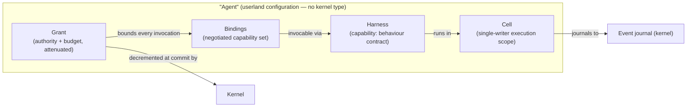

# ADR-001: Agent Is Not a Kernel Primitive

> **Post-review status (2026-08-16).** This document predates the adversarial review; the review's
> binding adjudications live in the Amendment log of `research/DESIGN-SPINE.md` (A1–A14), with the
> full findings in `research/ADVERSARIAL-REVIEW.md`.
> **Applied here:** none. No further amendments are outstanding for this document.


- **Status:** Proposed (pre-adversarial-review)
- **Date:** 2026-08-16
- **Spine anchor:** `research/DESIGN-SPINE.md` §1 (H1), §2 (vocabulary: *Agent*), §3 (explicit non-primitives)
- **Related:** 05-KERNEL-PRIMITIVES, 04-ORCHESTRATION-MODELS, 10-HARNESS-AND-GRAPH-RUNTIME

## Context

Every framework studied began with "agent" as a load-bearing type, and every one that survived production contact demoted it. The question this ADR settles is whether the Kyxo kernel defines an Agent object — with identity, lifecycle, and semantics — or whether "agent" is a userland word for a configuration of kernel objects.

The forces:

**Force 1 — the strongest evidence class available: independent convergent demotion.**

- SOURCE-CODE OBSERVATION (HIGH): Google ADK shipped "everything is an agent" in 1.x and abandoned it in 2.0: `BaseAgent` now subclasses `BaseNode`, and `SequentialAgent`, `ParallelAgent`, and `LoopAgent` are all decorated `@deprecated('… in favor of Workflow …')` — Google deprecated its own agent-shaped orchestration classes one major version after shipping them. The stated reason is that deterministic orchestration written as *agents* inherited agent baggage (instructions, callbacks, sub-agent trees) it did not need (research/notes/google-adk.md).
- SOURCE-CODE OBSERVATION (HIGH): Microsoft's three-generation convergence (AutoGen → Semantic Kernel → MAF) ended with typed executors, Pregel supersteps, checkpoint-at-barrier, and one discriminated event stream as the substrate. Group chat, handoff, Magentic planning — AutoGen's core "agent" abstractions — survive only as *builders that emit workflows* in an orchestrations pattern library. Even a Claude-Code-class harness (`create_harness_agent`) is pure composition: middleware plus context providers around an unchanged loop; no new kernel-level concept was needed (research/notes/microsoft-autogen-sk-agent-framework.md).
- SOURCE-CODE OBSERVATION (HIGH) + INFERENCE (HIGH): Across eight competitive coding agents, "agent" is universally *a named configuration* — prompt + toolset + permissions + optional model — never a runtime object. OpenCode literally schema-tizes it (`agent/agent.ts`, `mode: primary|subagent|all`); Roo Code calls the same thing "mode"; Gemini CLI, Cline, and Copilot call it agent/custom agent (research/notes/coding-agents-landscape.md).
- FACT + SOURCE-CODE OBSERVATION (HIGH): The Claude stack reduces to model call + tool call + typed vetoable event + append-only transcript; a subagent is exactly (new transcript + tool call), and `AgentDefinition` is a data record, not an engine (research/notes/anthropic-claude-code-agent-sdk.md).

**Force 2 — the delegation algebra.** Five independent implementations (Roo Code `new_task`, OpenCode `task.ts`, Gemini CLI subagents, Cline `use_subagents`, Copilot custom agents) converged on the identical construct: *a subagent is a fresh session + a capability/policy diff + a budget + a single result message returned to a paused or notified parent* (INFERENCE/HIGH, research/notes/coding-agents-landscape.md). No system needed an Agent type — or a graph engine — to express delegation. If the most agent-intensive pattern in the ecosystem decomposes into session, policy scope, budget, and events, an Agent primitive has nothing left to do.

**Force 3 — the subagents-as-tools victory.** FACT: LangChain's `langgraph-supervisor` package (and by association `langgraph-swarm`) is "no longer actively maintained"; the documented migration path is the subagents pattern — "a main agent coordinates specialized workers by calling them as tools" (research/notes/langgraph.md). The same shape appears independently: smolagents `managed_agents` are listed alongside tools in the model's action space; PydanticAI's only multi-agent primitives are agent-as-tool (with `usage=ctx.usage` budget accrual) and programmatic hand-off; ADK's `agent_tool.py` wraps any agent as a callable tool; CrewAI repositions Crews as components invoked from Flows (research/notes/agent-frameworks-crewai-pydantic-llamaindex-mastra-letta.md). Multi-agent-as-topology lost to multi-agent-as-invocation. An invocable thing with a manifest is, in Kyxo vocabulary, a *capability* — no second concept required.

**Force 4 — the minimality test.** The spine's admission rule tolerates a kernel concept only if competing userland implementations would prevent required functionality (security, accounting, recovery, coordination). "Agent" fails immediately: competing userland definitions of agent not only can exist, they demonstrably *do* — configuration record (coding agents), persisted server state (Letta), typed generic class (PydanticAI), role template (CrewAI) — and all of them run today on substrates that have no Agent primitive. Nothing about security, accounting, recovery, or coordination requires the kernel to know which invocations a user mentally groups as "an agent."

## Decision

**Do not define an Agent object in the Kyxo kernel. The word "agent" never appears in kernel code, kernel schemas, or the kernel event protocol.**

An agent is a *configuration*, assembled entirely from existing kernel objects:

> **agent = harness (a capability) + bound capability set (Bindings) + Grants + a Cell to run in**

Concretely:

1. The kernel SHALL expose only the nine kernel objects (Capability, Binding, Invocation, Event, Artifact, Cell, Grant, Checkpoint, Kind) and the two mechanisms (policy pipeline, scheduler). None of them is, or contains, an Agent.
2. SDKs MAY ship an `Agent`-named convenience constructor, but it MUST desugar completely to the configuration above, adding no semantics the four constituents do not already carry. It is sugar, not a type: two "agents" with identical harness, bindings, grants, and cell are indistinguishable to the kernel.
3. Delegation ("spawn a subagent") SHALL be expressed as: invoke a capability that is itself an orchestrator, in a fresh Cell, under an attenuated Grant (child ≤ parent), returning a result Artifact/Event to the parent's cell — the delegation system of the spine, which is the five-system algebra of Force 2 made kernel-enforced.
4. Anything the ecosystem markets as an agent (a remote A2A executor, a Claude Agent SDK binary, a Letta server-side agent) enters Kyxo as a **capability with a manifest**, invoked through a Binding — the same contract as a tool, a model adapter, or a graph strategy.



## Alternatives considered

**A. Agent as a kernel type (ADK 1.x / AutoGen-classic position).** A first-class Agent with identity, instructions, sub-agent tree, and lifecycle callbacks. Rejected: this is the exact design Google shipped and then deprecated within one major version, because deterministic orchestration inherited agent baggage it didn't need (SOURCE-CODE OBSERVATION/HIGH, research/notes/google-adk.md). It also fails the Liedtke admission rule — nothing required for security, accounting, recovery, or coordination lives in the Agent concept itself; it all lives in cells, grants, events, and bindings. Baking in one blessed agent shape would force every divergent userland definition (Letta's persisted-state agent, PydanticAI's typed agent, CrewAI's role agent) through an ill-fitting kernel type, repeating ADK 1.x at larger scale.

**B. Agent as a virtual actor (autogen-core / Orleans-style `AgentId = (type, key)`).** Make agents addressable actors with runtime-managed activation and a message bus. Rejected: Microsoft built precisely this (`autogen-core`'s AgentRuntime protocol, gRPC worker mesh, CloudEvents envelopes) and killed it in the MAF convergence — the distributed actor mesh has no MAF successor; protocol boundaries won (SOURCE-CODE OBSERVATION/HIGH, research/notes/microsoft-autogen-sk-agent-framework.md). The legitimate need inside the actor idea — keyed, single-writer, activation-on-demand execution scopes — is already the **Cell** (spine object 6), which carries none of the role/conversation/identity semantics. Adopting the actor framing would smuggle "agent" back in under a different name and re-open the in-kernel distribution question the spine closes (single-node first, distribution via portable checkpoints).

**C. Agent as a privileged SDK type above a kernel that still tracks agent identity (middle position).** Keep the kernel agent-free but stamp events/invocations with a kernel-understood `agent_id` for observability and policy. Rejected: the moment the kernel interprets agent identity, policy authors will bind policy to it, and it becomes semantics — a de facto primitive with all of A's lock-in and none of its honesty. Kyxo already has the right identity spine: correlation/causation/actor IDs on events and Grant lineage on invocations. Grouping those into "an agent" is a *projection* userland and observability tooling can compute; the kernel does not need to own the grouping. (SDK-level sugar remains allowed per Decision point 2.)

## Consequences

**Positive:**

- **Churn isolation.** Agent fashions (role teams, supervisors, swarms, planner-executors, code-as-action) have turned over roughly yearly across the evidence base; all of them are expressible as harness + bindings + grants + cell, so none of them will ever force a kernel change. This is the future-proofing H1 buys.
- **Delegation attenuation comes from construction.** Because "spawning an agent" is just invocation-under-attenuated-Grant in a fresh Cell, the child-≤-parent budget/authority rule is enforced by the kernel for every delegation, not re-implemented per framework — the gap none of the eight coding agents closes today (research/notes/coding-agents-landscape.md).
- **Benchmarkability.** Harness×model pairs are versioned capabilities (see ADR-005), so the benchmark harness can express `model × harness` matrices without an Agent abstraction obscuring what varied.
- **Interop by default.** External "agents" (A2A endpoints, vendor agent SDK binaries) map onto the capability contract without a special case, exactly as ADK wraps LangGraph graphs and remote A2A agents as adapters (research/notes/google-adk.md).

**Negative (real costs):**

- **DX friction against the entire ecosystem's grain.** Every competing framework hands users an `Agent` class on line one; Kyxo hands them four concepts. The `runtime.run({ objective })` default profile and SDK sugar (Decision point 2) mitigate but do not eliminate this — the spine's C4 risk ("the simple case won't stay simple") lands hardest here, and if profiles fail, adoption fails.
- **Vocabulary enforcement is a standing tax.** Docs, examples, error messages, and community answers must consistently say "configuration" where users expect "agent object"; drift here re-creates the ambiguity the decision exists to kill.
- **No blessed agent shape means userland fragmentation is possible.** Two SDKs can desugar `Agent` differently (e.g., one cell per agent vs. one cell per conversation), and the kernel will not arbitrate. Conformance guidance in the SDK layer is required work this decision creates.
- **Observability must reconstruct the grouping.** "Show me this agent's trace" becomes a projection over correlation/causation/grant-lineage rather than a keyed lookup; tooling pays that join cost on every query.
- **Migration friction.** Users arriving from ADK/MAF/CrewAI must unlearn agent-as-object; wrappers can translate their configurations, but their mental model migrates slower than their code.

## Evidence & confidence

```
Evidence      — ADK 2.0 deprecating SequentialAgent/ParallelAgent/LoopAgent and re-basing
                BaseAgent on BaseNode (SOURCE-CODE OBSERVATION/HIGH, research/notes/google-adk.md);
                MAF demoting group chat/handoff/Magentic to a pattern library and shipping its
                harness as pure composition (SOURCE-CODE OBSERVATION/HIGH,
                research/notes/microsoft-autogen-sk-agent-framework.md);
                the five-system delegation algebra "session + policy diff + budget + single
                result message" (INFERENCE/HIGH, research/notes/coding-agents-landscape.md);
                langgraph-supervisor unmaintained, subagents-as-tools as documented successor
                (FACT, research/notes/langgraph.md); agent-as-tool in smolagents/PydanticAI/ADK,
                Crews demoted under Flows (research/notes/agent-frameworks-crewai-pydantic-
                llamaindex-mastra-letta.md); Claude stack reducing to four primitives with
                subagent = transcript + tool call (research/notes/anthropic-claude-code-agent-sdk.md).
Interpretation— Four unrelated vendors under production pressure independently discovered that
                "agent" adds no execution semantics beyond configuration of loop, capabilities,
                policy scope, and state scope. That is convergent evolution, the strongest
                evidence class this program has.
Implication   — The kernel defines Cell, Grant, Binding, Capability; "agent" is userland
                vocabulary and SDK sugar. Delegation becomes kernel-enforced attenuation instead
                of per-framework convention.
Confidence    — HIGH. The main residual risk is DX (C4), which is a product risk, not an
                architectural counter-signal; no studied system's evidence points the other way.
```
