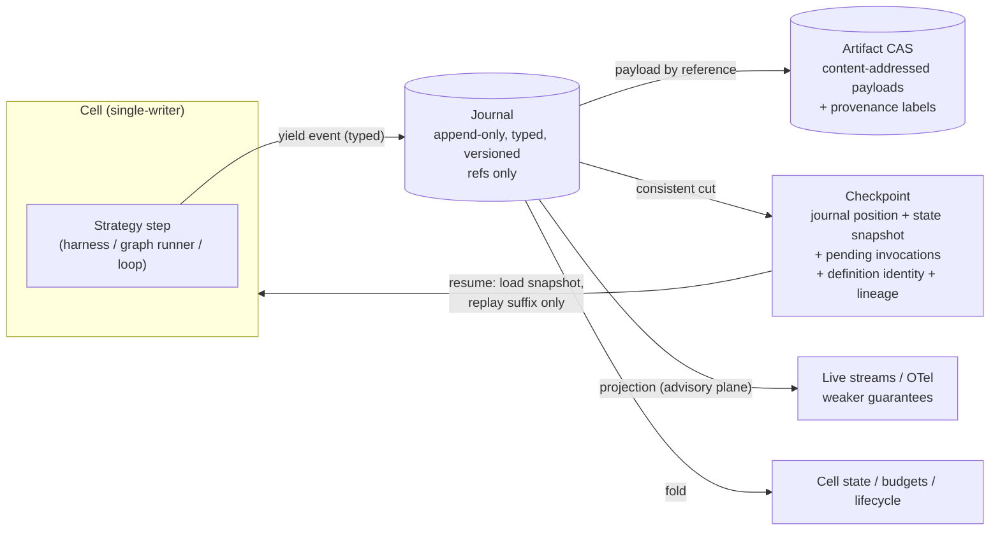

# ADR-002: Journal-First Event Sourcing with Checkpoint Composite

- **Status:** Proposed (pre-adversarial-review)
- **Date:** 2026-08-16
- **Spine anchor:** `research/DESIGN-SPINE.md` §1 (H5), §3 (objects 4 *Event*, 8 *Checkpoint*), §7, §8 (storage V1)
- **Related:** 08-EVENT-AND-STATE-MODEL, 07-RUNTIME-ARCHITECTURE, 13-FUTURE-SCENARIO-TEST

## Context

The kernel owns durable execution: something must be the source of truth from which recovery, audit, resume, fork, and observability all derive. The ecosystem offers three proven-but-flawed answers, and the forces pull in different directions.

**Force 1 — append-only logs are already the working truth wherever agents run in production.**

- SOURCE-CODE OBSERVATION (HIGH): ADK's session is an append-only Event list from which *everything* folds: state (from `state_delta`), artifact versions, checkpoints (`agent_state` events), compaction records, undo (rewind computed as an inverse delta and itself appended as an event), routing, HITL. The yield-is-commit contract — effects commit atomically when the runner accepts the event, and execution resumes only after commit — survived the 1.x→2.x rewrite intact and was re-implemented across a task boundary with a queue+ack handshake (research/notes/google-adk.md).
- FACT: Claude Code's session is an append-only JSONL transcript; `continue`/`resume`/`fork` are log operations; durability is log-replay-based (research/notes/anthropic-claude-code-agent-sdk.md).
- The spine records the same shape in Codex rollout JSONL and Restate (research/DESIGN-SPINE.md §1 H5, citing research/notes/durable-execution.md and research/notes/openai-agents-sdk-codex.md).

**Force 2 — log-scan resume without first-class checkpoints hits a wall.** SOURCE-CODE OBSERVATION (HIGH): ADK resume requires rescanning all session events, a `ReplaySequenceBarrier` for deterministic replay ordering, and user discipline (don't catch `BaseException`); a code TODO admits "resume from checkpoint event" is still pending (research/notes/google-adk.md). The journal alone makes resume O(history).

**Force 3 — pure snapshots hit a different wall.** SOURCE-CODE OBSERVATION (HIGH) + INFERENCE (MEDIUM): LangGraph's durability is state-snapshot-per-barrier: `channel_values` + version vectors, with `pending_writes` as a bolt-on write-ahead side channel for partial-step recovery. Costs it is still patching: checkpoint size grows with state size (the DeltaChannel beta exists to stop checkpoints growing linearly with thread length), and sub-step effects needed `pending_writes` plus `interrupt()` semantics that *re-execute the node body* on resume — converting a runtime concern into user-code idempotency discipline with a documented exponential-replay footgun (research/notes/langgraph.md). Snapshots without a journal also surrender causality: no audit, no provenance, no "why did this happen."

**Force 4 — positional-replay determinism taxes exactly the code that changes weekly.** FACT: PydanticAI's Temporal integration must declare the agent run loop deterministic workflow code (no I/O), route every model request and tool call through activities, cap payloads at 2MB, and buffer streaming (research/notes/agent-frameworks-crewai-pydantic-llamaindex-mastra-letta.md). The spine's H3/H5 adjudication: the deterministic-orchestration/journaled-effects split is correct, but Temporal-style *positional replay* — where old orchestration code must survive so histories replay — is hostile to AI systems whose prompts, models, and harness logic change weekly. Kyxo's failure-semantics stance is version-by-data + fork-from-checkpoint, explicitly anti-Temporal-patching (research/DESIGN-SPINE.md §7, citing research/notes/durable-execution.md).

**Force 5 — the ecosystem's protocol test.** FACT: MCP shipped transport-level event-ID stream resumability in 2025-03-26 and deleted it in 2026-07-28, keeping durable task handles instead — durability belongs to *handles over state*, not replayable byte streams (research/notes/mcp-protocol.md). And FACT: MAF checkpoints are definition-scoped, lineage-chained (`previous_checkpoint_id`), topology-hash-validated, and portable across instances/processes — checkpoints as shareable artifacts work (research/notes/microsoft-autogen-sk-agent-framework.md). Cursor's `&` handoff proves state-transfer migration commercially (research/DESIGN-SPINE.md §3 object 8, citing research/notes/cursor.md).

**Force 6 — typing and payload discipline.** FACT + SOURCE-CODE OBSERVATION (HIGH): ADK's untyped widening envelope (`Event extends LlmResponse`) broke downstream session stores and validators when 2.0 added fields — the documented cost of an unversioned, provider-shaped event type (research/notes/google-adk.md). MAF and its content model both collapsed to single discriminated unions for serialization and cross-language parity (research/notes/microsoft-autogen-sk-agent-framework.md). Claude Code spills tool results over 25k tokens to files rather than inline (research/notes/anthropic-claude-code-agent-sdk.md) — large payloads do not belong in the log.

## Decision

**The Kyxo kernel's truth plane SHALL be a typed, versioned, append-only journal, composed with first-class checkpoint records. Neither alone is the durability primitive; the composite is.**

1. **Journal as truth.** Every effectful outcome enters the truth plane as a typed, versioned Event carrying correlation ID, causation ID, actor ID, and grant reference. The journal is the *working* source of truth: state, budgets-consumed, artifact versions, and lifecycle transitions are folds over it. The event envelope is a kernel-owned discriminated union; it MUST NOT inherit from or embed any model-API shape (the ADK failure). Commit semantics are yield-is-commit: an event's effects apply atomically at append, and the producing strategy resumes only after commit.
2. **Checkpoint as composite cut.** A Checkpoint is a named consistent cut of a Cell: **(journal position, state snapshot, pending-invocations set)**, bound to definition identity (strategy hash + config/prompt/model hashes) and chained by lineage (`previous_checkpoint_id`). Resume loads the snapshot and replays only the journal suffix; the pending-invocations set covers the partial-step window so completed effects are never re-executed (the LangGraph `pending_writes` lesson, made a primitive instead of a patch). Fork-from-checkpoint is the primary repair and upgrade verb.
3. **Two-tier storage.** The journal stores *references*; payloads (tool outputs, model responses, compiled contexts, media) live in content-addressed Artifact storage. Events stay small, scannable, and cheap to replicate; Artifacts carry provenance and are shared zero-copy by reference.
4. **Two-plane events.** The journal is the truth plane. Live observation streams (token deltas, progress, debug) are *projections* on an advisory plane with explicitly weaker guarantees — droppable, reorderable within documented bounds, never load-bearing for recovery. Observability (OTel export) is a projection of the journal, never a separate bolted-on bus.
5. **Determinism contract.** The kernel does NOT require orchestration code to be positionally replayable. Recovery is record-and-inject: journaled effect results are injected by deterministic effect identity (uuid5-style derivation, per the LangGraph task-ID linchpin) into resumed strategies. Code changes are handled by version-by-data pinning plus fork-from-checkpoint, never by requiring old code paths to survive.



## Alternatives considered

**A. Mutable state + audit log.** Keep authoritative state in mutable stores and write an audit log on the side. Rejected: the log and the state inevitably diverge (the log is advisory the moment it is not the commit path), recovery cannot be proven equivalent to the lost execution, rewind/fork require inverse operations the store cannot express, and provenance is reconstructed rather than recorded. Every production agent system examined that takes durability seriously made the log the commit path, not a side effect (ADK `append_event` as the single commit point; Claude Code transcript; research/notes/google-adk.md, research/notes/anthropic-claude-code-agent-sdk.md). This alternative also destroys the two-plane property: with no authoritative journal, observability becomes a second, disagreeing history.

**B. Pure replay determinism (Temporal-style).** The journal records effect results; recovery re-executes orchestration code from the top, injecting recorded results positionally; determinism of orchestration code is mandatory forever. Rejected for Kyxo's workload: harness logic, prompts, and model choices change weekly, and positional replay requires either version-patching gymnastics or old code surviving indefinitely — the anti-pattern the spine explicitly rejects (research/DESIGN-SPINE.md §7). The determinism constraints also leak into user code (PydanticAI×Temporal: no I/O in the loop, payload caps, buffered streaming — FACT, research/notes/agent-frameworks-crewai-pydantic-llamaindex-mastra-letta.md). What replay gets right — journaled effects with stable identity — the composite keeps, via record-and-inject against deterministic effect IDs, without demanding whole-program replayability.

**C. Pure snapshot (LangGraph-style).** Checkpoint = state snapshot + version vectors per barrier; no authoritative event journal. Rejected: resume is cheap but the model demonstrably needs patches LangGraph itself is shipping — `pending_writes` for sub-step effects, DeltaChannel because snapshot size grows with state, node re-execution discipline for `interrupt()` (SOURCE-CODE OBSERVATION/HIGH + FACT, research/notes/langgraph.md). Without a journal there is no audit trail, no causation/provenance chain, no commit-point verification hook (doc 08's gate needs an event to gate), and budget decrement-at-commit has no commit record. Snapshots are the right *resume accelerator*; they are the wrong *truth*.

**Why the composite specifically:** each pure design fails on exactly the dimension the other covers. The journal gives audit, provenance, verification gating, and budget commit; checkpoints give O(state) resume, portability, and fork identity. ADK proves journal-without-checkpoints hits O(history) resume and replay barriers (their own TODO); LangGraph proves checkpoints-without-journal hits pending-writes patches and lost causality. MAF's definition-scoped checkpoint (topology hash + lineage) supplies the portability contract; MCP's deletion of stream resumability confirms durability-as-handles at protocol edges (research/notes/microsoft-autogen-sk-agent-framework.md, research/notes/mcp-protocol.md).

## Consequences

**Positive:**

- Recovery, rewind, fork, time-travel, audit, provenance, observability, and eval sampling all derive from one substrate; no second event bus exists to disagree with the first (the convergent lesson across five frameworks that bolted observability buses onto execution — research/notes/agent-frameworks-crewai-pydantic-llamaindex-mastra-letta.md).
- Resume is O(state + journal suffix), not O(history); checkpoints are portable artifacts enabling Cursor-style state-transfer migration and the single-node-first distribution stance (research/DESIGN-SPINE.md §8).
- The commit point exists as a real place: verification gates (doc 08), budget decrement, and policy interposition all attach to event append, mechanically.
- A published journal + checkpoint schema is the portable execution-record format the ecosystem lacks ("durable execution has no MCP-equivalent" — research/DESIGN-SPINE.md §6, citing research/notes/durable-execution.md); this is product surface, not just plumbing.

**Negative (real costs):**

- **Two stores, one consistency problem.** Journal and CAS must stay mutually consistent (a journal entry referencing a missing artifact is corruption); checkpoint cuts must be consistent with both. This is kernel engineering that mutable-state designs simply do not pay.
- **The event schema is a forever-contract.** Typed, versioned envelopes mean every event-kind change goes through versioning machinery (one storage version + conversion, per the Kind model); the flexibility ADK bought with an untyped envelope — ship fields fast, break consumers later — is deliberately unavailable to us. Velocity cost is real.
- **Write amplification and latency.** Yield-is-commit serializes strategy progress behind durable append (ADK pays the same via its queue+ack handshake). High-frequency small updates (token counters, progress) must be pushed to the advisory plane or batched, and getting that split wrong shows up as either lost truth or slow loops.
- **CAS lifecycle management.** Content-addressed payloads need garbage collection with provenance-aware retention; "delete this user's data" becomes a nontrivial operation across journal references, checkpoints, and CAS.
- **Checkpoint invalidation semantics.** Binding checkpoints to definition identity means legitimate code changes invalidate resume paths by design; fork-from-checkpoint is the answer, but users will experience "why can't I just resume" friction that Temporal-style systems (at their own cost) avoid.

## Evidence & confidence

```
Evidence      — ADK: append-only event log as single source of truth, yield-is-commit surviving
                the 2.x rewrite, log-scan resume limits + checkpoint TODO, untyped-envelope
                breakage (SOURCE-CODE OBSERVATION/HIGH, FACT; research/notes/google-adk.md).
                LangGraph: snapshot+pending_writes composite emerging by patches, DeltaChannel
                beta, interrupt re-execution discipline, deterministic task IDs as resume
                linchpin (SOURCE-CODE OBSERVATION/HIGH, FACT; research/notes/langgraph.md).
                MAF: definition-scoped, lineage-chained, hash-validated checkpoints; discriminated
                event union (SOURCE-CODE OBSERVATION/HIGH; research/notes/microsoft-autogen-sk-
                agent-framework.md). MCP: transport resumability added then deleted; durable
                handles kept (FACT; research/notes/mcp-protocol.md). Claude Code: JSONL transcript,
                resume/fork as log ops, no external-effect journal as the named gap (FACT;
                research/notes/anthropic-claude-code-agent-sdk.md). Temporal determinism tax via
                PydanticAI integration (FACT; research/notes/agent-frameworks-crewai-pydantic-
                llamaindex-mastra-letta.md); replay-vs-journal adjudication per spine H5
                (research/DESIGN-SPINE.md, citing research/notes/durable-execution.md).
Interpretation— The ecosystem has independently built every corner of the composite and patched
                toward the middle from both sides: journal systems are adding checkpoints,
                snapshot systems are adding write-ahead effect logs. Nobody starts with the
                composite; everyone converges on it.
Implication   — Kyxo builds journal + checkpoint + two-tier storage + two-plane events as one
                designed primitive set from day one, and publishes the record format.
Confidence    — HIGH for the composite direction (convergence from both sides). MEDIUM for the
                exact checkpoint contents (pending-invocations representation and definition-
                identity granularity need prototype validation — see doc 14).
```
