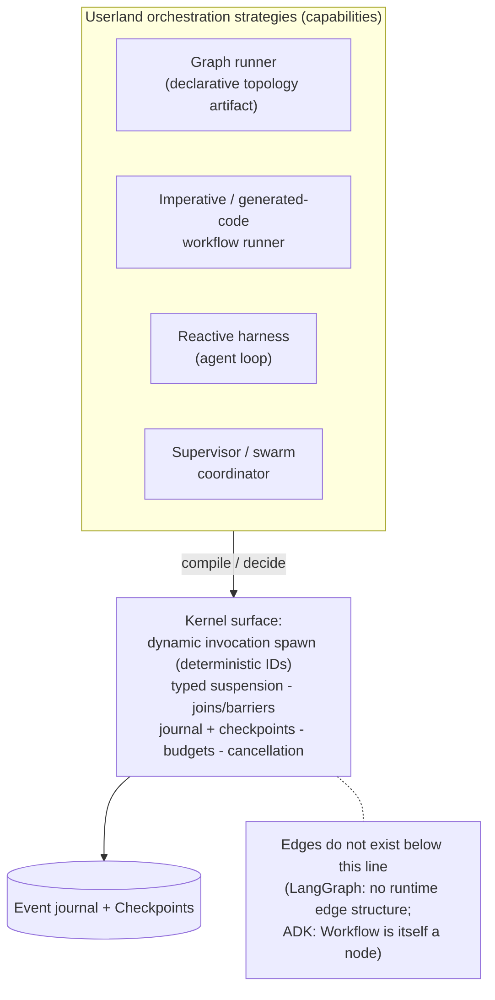

# ADR-004: Graph Is an Orchestration Strategy, Not the Kernel

> **Post-review status (2026-08-16).** This document predates the adversarial review; the review's
> binding adjudications live in the Amendment log of `research/DESIGN-SPINE.md` (A1–A14), with the
> full findings in `research/ADVERSARIAL-REVIEW.md`.
> **Applied here:** none. **Adopted but not yet reflected in this document's body:** A9(i). Where this document conflicts with the Amendment log, **the amendment log governs**; reconciling this body text is tracked as remaining editorial work.


- **Status:** Proposed (pre-adversarial-review)
- **Date:** 2026-08-16
- **Spine anchor:** `research/DESIGN-SPINE.md` §1 (H1), §2 (vocabulary: *Graph/Workflow*), §3 (non-primitives), §5 (dynamic dispatch)
- **Related:** 04-ORCHESTRATION-MODELS, 10-HARNESS-AND-GRAPH-RUNTIME, 05-KERNEL-PRIMITIVES

## Context

Graph/DAG engines are the most heavily marketed execution abstraction in the agent ecosystem — LangGraph's name is a graph, MAF's workflow subsystem is its convergence centerpiece, ADK 2.0's headline is a "graph-based execution engine." The kernel question: does Kyxo execute graphs natively, or does it execute something smaller onto which graphs compile?

**Force 1 — the flagship graph runtime does not run a graph.** SOURCE-CODE OBSERVATION (HIGH): LangGraph's kernel is channels + BSP super-steps + checkpoints. Task planning is version-vector diffing (`prepare_next_tasks` compares `versions_seen` against `channel_versions`); **there is no runtime edge data structure at all**. `StateGraph.compile()` lowers edges into channel writers (`branch:to:` channels; multi-input joins become `NamedBarrierValue` channel types); visualization is *reconstructed* from channel wiring. INFERENCE (HIGH): "graph" in LangGraph is a frontend authoring notation — and the Temporal-shaped functional API (`@entrypoint`/`@task`) is a second frontend compiling onto the *same* kernel constructs with full fidelity (research/notes/langgraph.md).

**Force 2 — static topology always grows dynamic backdoors.** SOURCE-CODE OBSERVATION (HIGH): LangGraph accumulated three escape hatches — `Send` (runtime fan-out with private state), `Command(goto=…)` (dynamic routing, cross-graph transfer), and mid-super-step `accept_push` (tasks injected while a step runs, no graph at all). ADK 2.0 pairs its declarative graph with imperative `ctx.run_node` "dynamic workflows" as a co-equal style; Claude Code skipped declarative graphs entirely — its workflow construct is *generated imperative JavaScript* against `agent()`/`pipeline()` primitives, with repeatability from saving the script (research/notes/langgraph.md; research/notes/google-adk.md; research/notes/anthropic-claude-code-agent-sdk.md). INFERENCE (HIGH): control flow migrates from static topology into runtime decisions — often the model's — in every system that lives with LLM workloads long enough.

**Force 3 — the systems that ship the most working agents have no graph engine at all.** Zero of eight competitive coding agents contain a graph/DAG abstraction internally; orchestration is prompts + delegation + triggers, and "plan mode" is uniformly a policy profile over the same agent loop (SOURCE-CODE OBSERVATION/INFERENCE HIGH, research/notes/coding-agents-landscape.md). The most agentic production workloads in existence never needed the construct.

**Force 4 — multi-agent-as-topology lost.** FACT: `langgraph-supervisor` is unmaintained; the documented successor is subagents-as-tools, with graph-based "custom workflow" as the fall-through case (research/notes/langgraph.md). AutoGen's conversation-topology teams became MAF *builders that emit workflows* — a pattern library, not a runtime (research/notes/microsoft-autogen-sk-agent-framework.md).

**Force 5 — but declarative graphs do earn their keep, in a specific role.** FACT: ADK docs position graph-based workflows as one of three complementary composition styles; MAF ships a YAML declarative plane compiling to the same runner; every framework surveyed that has a workflow construct ships a pre-run validator *and* a diagram generator (INFERENCE/HIGH: pre-run static checkability is a de facto requirement of the model — research/notes/agent-frameworks-crewai-pydantic-llamaindex-mastra-letta.md). Enterprises want workflows they can validate, visualize, review, and approve before execution. A kernel that *cannot host* graphs would forfeit that demand.

**Force 6 — what graph runtimes actually need from below is small.** LangGraph's resume/memoization/fork all hang off deterministic task identity (uuid5 over checkpoint/step/node/path); MAF's runner needs typed messages, barrier semantics, and checkpoint-at-barrier; ADK's `Workflow` is *itself a node* that is a client of the same event log as everything else, with no private persistence (research/notes/langgraph.md; research/notes/microsoft-autogen-sk-agent-framework.md; research/notes/google-adk.md).

## Decision

**The Kyxo kernel SHALL NOT contain a graph engine, edge data structures, or topology semantics. Graphs and workflows are declarative orchestration-strategy artifacts, compiled by userland strategy runners onto kernel primitives.**

1. The kernel provides what every observed graph runtime actually consumed from below: **dynamic invocation spawn with deterministic identity** (uuid5-style derivation from cell/checkpoint/step/path so memoized resume works), typed suspension, join/barrier support via event-subscription matching in the scheduler, journaled effects, checkpoint-at-yield points, budget charging, and cancellation propagation.
2. A **graph strategy** is a userland behaviour module (per ADR-005's behaviour-contract shape) running in a Cell: it holds the topology as data (a versioned Kind artifact), schedules ready nodes as kernel invocations, and folds completions from the journal. Graph *artifacts* are versioned and mutable at runtime by publishing new plan versions — never by mutating in-flight kernel state.
3. Generated imperative code (Claude-Code-style workflow scripts) and typed pub/sub step systems (LlamaIndex-style) are peer frontends over the same primitives. The kernel is indifferent among them; the benchmark harness can compare them because each is a capability with a manifest.
4. Static validation and visualization are strategy-layer obligations: a graph strategy SHOULD validate its topology before execution and SHOULD emit a renderable projection — but the kernel neither checks nor understands topology.



## Alternatives considered

**A. Graph-as-kernel (the LangGraph public position).** Make the graph the execution substrate: nodes and edges as kernel objects, traversal as scheduling. Rejected on LangGraph's own source: the strongest graph runtime in the ecosystem compiles edges away before running and schedules by version-vector diffing (SOURCE-CODE OBSERVATION/HIGH, research/notes/langgraph.md). Its three dynamic-dispatch escape hatches, absorbed cleanly *because the kernel was never really a graph*, show the abstraction cannot hold the workload; a kernel that genuinely ran edges would have had to break itself to add `Send`/`Command`/`accept_push`. Additionally, a graph kernel privileges one authoring model: the functional API, generated-code workflows, and plain reactive loops would all become second-class emulations — inverting the observed reality that the loop is the dominant production strategy (Force 3).

**B. No graph support (pure-loop kernel, coding-agent position).** Ship only the reactive loop; tell workflow users to use triggers and delegation. Rejected: it conflates "not kernel material" with "not needed." The enterprise/deterministic segment demonstrably wants pre-run-checkable, visualizable, reviewable workflow artifacts (Force 5 — every surveyed framework ships validators and diagram generators; MAF's YAML plane and Copilot's platform automations serve real demand). More structurally: without deterministic-identity dynamic spawn and join/barrier semantics in the kernel, graph strategies *cannot be built well in userland* — each would reinvent memoized resume and fan-in, badly. The kernel must be small, but it must be the *right* small: the admission test asks whether competing userland implementations are *possible*, and they are only possible if the spawn/join/identity substrate is kernel-provided.

**C. Two engines (graph engine + loop engine side by side, ADK-transition-style).** Ship a native graph runtime alongside a native loop runtime. Rejected: ADK's 1.x→2.x transition period — two coexisting execution paths with a TODO to unify (SOURCE-CODE OBSERVATION/HIGH, research/notes/google-adk.md) — is the cautionary exhibit, not the target. Two engines mean two checkpoint semantics, two budget paths, two policy attachment points, and a permanent unification debt. One substrate, many strategies, is the entire H1 verdict.

## Consequences

**Positive:**

- Every observed orchestration model — declarative graph, imperative generated code, type-routed pub/sub, completion-listening, reactive loop, supervisor — is hostable as a strategy without kernel changes; new fashions arrive as userland packages (the five recurring computational models all reduce to the same scheduling contract — INFERENCE/HIGH, research/notes/agent-frameworks-crewai-pydantic-llamaindex-mastra-letta.md).
- Graph strategies inherit kernel guarantees (journaled effects, checkpoints, budgets, cancellation, policy interposition) instead of reimplementing durability — the property ADK 2.0 proves out, where the graph engine is a client of the same event log as everything else.
- Dynamic dispatch is native, not an escape hatch: `Send`-style fan-out, model-driven routing, and generated-code orchestration are first-class spawns with deterministic identity, so resume/memoization works uniformly across strategies.
- LangGraph and MAF remain *integration targets*: their authoring formats can be compiled onto Kyxo primitives by adapters (consistent with the spine §10 EXTEND adjudication).

**Negative (real costs):**

- **No blessed orchestration language.** Kyxo ships no canonical graph DSL; the ecosystem may fragment across incompatible strategy packages, and "which workflow library do I use on Kyxo" has no single answer. This is a deliberate trade against LangGraph/MAF, whose opinionated frontends are genuine adoption assets.
- **Strategy authors carry validator/visualizer burden.** Static checking and diagrams — table stakes in every surveyed framework — are strategy-layer work Kyxo does not provide; a weak strategy ecosystem would leave Kyxo *feeling* less capable than graph-native competitors even when it is strictly more capable.
- **The deterministic-identity derivation becomes a forever-contract.** Memoized resume across strategies depends on the kernel's invocation-ID derivation scheme; changing it invalidates every stored checkpoint's pending/completed matching. This is LangGraph's task-ID linchpin (research/notes/langgraph.md) promoted to a public kernel API — with the correspondingly higher cost of ever getting it wrong.
- **Join/barrier semantics in the scheduler are subtle kernel complexity.** Supporting both eager reaction and blocking joins (the `and_`/`collect_events`/`.parallel()` family) pushes subscription-matching and barrier bookkeeping into the kernel scheduler — real surface area, and a place where bugs corrupt every strategy at once.
- **Migration cost for graph-native users.** LangGraph/MAF users must relearn where graphs live (artifact + strategy, not kernel), and adapters will not preserve every semantic (e.g., LangGraph channel reducers map to Kyxo state cells imperfectly at the edges).

## Evidence & confidence

```
Evidence      — LangGraph: edges compiled away, version-vector scheduling, two frontends on one
                kernel, three dynamic-dispatch escape hatches, deterministic task IDs
                (SOURCE-CODE OBSERVATION/HIGH + INFERENCE/HIGH, research/notes/langgraph.md).
                ADK 2.0: Workflow(BaseNode) as a log-client node; graph/imperative/LLM-driven as
                co-equal styles; dual-engine transition pain (SOURCE-CODE OBSERVATION/HIGH + FACT,
                research/notes/google-adk.md). Zero graph engines across eight coding agents;
                plan mode as policy profile (SOURCE-CODE OBSERVATION + INFERENCE/HIGH,
                research/notes/coding-agents-landscape.md). Supervisor-graph deprecation in favor
                of subagents-as-tools (FACT, research/notes/langgraph.md). MAF orchestrations as
                builders-emitting-workflows; BSP+checkpoint substrate as the survivor
                (SOURCE-CODE OBSERVATION/HIGH, research/notes/microsoft-autogen-sk-agent-
                framework.md). Claude Code workflows as generated imperative code (FACT,
                research/notes/anthropic-claude-code-agent-sdk.md). Pre-run static checkability
                as de facto frontend requirement (INFERENCE/HIGH, research/notes/agent-frameworks-
                crewai-pydantic-llamaindex-mastra-letta.md).
Interpretation— The graph is a UX and verification layer, not an execution requirement. Systems
                that made it the substrate either compiled it away (LangGraph), demoted it to a
                node (ADK), or never built it (all eight coding agents). What all of them consume
                from below is dynamic spawn with deterministic identity plus barriers and
                checkpoints.
Implication   — Kyxo kernelizes spawn/identity/join/suspension/journal; graphs, generated code,
                and pub/sub steps are peer strategies compiled onto them, each a versioned,
                benchmarkable capability.
Confidence    — HIGH. The one counter-current — MAF keeps typed edges as a prominent runtime
                concept — is addressed: its load-bearing substrate is supersteps + checkpoints +
                typed ports, and its own harness bypasses the graph entirely; flagged for the
                adversarial review as the strongest opposing exhibit even so.
```
