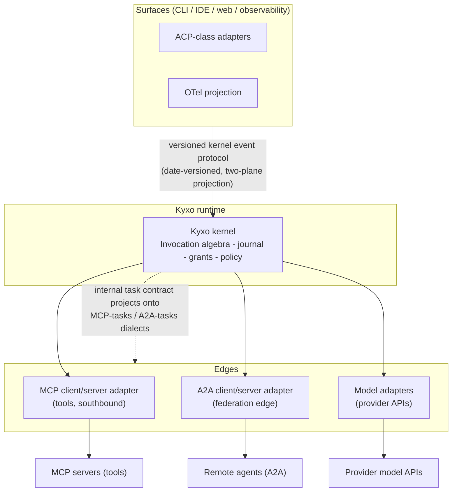

# ADR-007: Protocol Strategy — Project, Don't Invent

> **Post-review status (2026-08-16).** This document predates the adversarial review; the review's
> binding adjudications live in the Amendment log of `research/DESIGN-SPINE.md` (A1–A14), with the
> full findings in `research/ADVERSARIAL-REVIEW.md`.
> **Applied here:** none. **Adopted but not yet reflected in this document's body:** A3. Where this document conflicts with the Amendment log, **the amendment log governs**; reconciling this body text is tracked as remaining editorial work.


- **Status:** Proposed (pre-adversarial-review)
- **Date:** 2026-08-16
- **Spine anchor:** `research/DESIGN-SPINE.md` §2 (vocabulary: *Protocol*), §3 (Invocation transition algebra), §6 (positioning), §10
- **Related:** 07-RUNTIME-ARCHITECTURE, 12-EXTENSION-MODEL, 05-KERNEL-PRIMITIVES (Invocation)

## Context

Kyxo must decide its wire posture: which external protocols it speaks, at which edges, and — critically — whether any external protocol becomes the *internal* architecture. Three protocols are load-bearing in the ecosystem today, and the temptation exists both to replace them and to adopt one of them wholesale.

**Force 1 — the protocol seams have already formed, at exactly the right joints.** MCP is universal at the tool edge: all eight coding agents consume it, and frameworks both consume and *serve* it (ADK exposes agents as MCP servers; LangGraph's Agent Server exposes assistants as MCP tools; MAF hosts MCP servers) (research/notes/coding-agents-landscape.md; research/notes/google-adk.md; research/notes/langgraph.md; research/notes/microsoft-autogen-sk-agent-framework.md). A2A is forming at the agent-federation edge (Gemini CLI consumes and serves it; ADK is bidirectional; LangGraph and MAF expose it at their platform boundaries). ACP-class protocols occupy the surface/editor-hosting seam (OpenCode in Zed; Cline SDK). The note's conclusion: these three seams match exactly a runtime's needed interfaces — capability provider, peer delegation, client surface — and "a universal runtime should speak all three at the edges rather than invent replacements" (INFERENCE/HIGH, research/notes/coding-agents-landscape.md).

**Force 2 — MCP's own scope declaration leaves the kernel's ground uncontested.** FACT (by scope statement and verified absence): MCP deliberately does not cover agent lifecycle, delegation, budgets, planning/graphs, conversational checkpoints, memory, policy language, or retry/exactly-once semantics; the roadmap frames MCP as "enabling agent workflows rather than as an agent orchestration protocol" (research/notes/mcp-protocol.md). The gap map *is* Kyxo's product surface (research/DESIGN-SPINE.md §6). Projecting onto MCP is therefore complementary, not competitive.

**Force 3 — external protocols churn, and internal architectures bound to them break.** FACT: MCP executed a breaking architectural pivot in 2026-07-28 — protocol-level sessions removed, the initialize handshake removed, server-initiated requests replaced by MRTR, transport resumability deleted, roots/sampling/logging deprecated (research/notes/mcp-protocol.md). Any runtime that had adopted MCP-2025's stateful session model as its internal architecture would have absorbed a breaking rewrite of its own core. Adapters at edges absorb this churn; internal adoption amplifies it.

**Force 4 — inventing a new universal wire protocol loses on adoption economics.** FACT: MCP's sampling feature — protocol-mediated model access, backed by the protocol's own incumbents — was deprecated for "complex to implement … low adoption … direct alternatives" (research/notes/mcp-protocol.md). If an inversion *inside* the ecosystem's flagship protocol dies of adoption friction, a from-scratch universal protocol from a new entrant fares worse. Meanwhile MAF's ADR-0009 shows the winning posture: Microsoft designed long-running operations by *surveying* OpenAI Responses background tasks, Foundry Runs, and A2A Tasks, and aligning to interoperate with all three rather than minting a fourth (SOURCE-CODE OBSERVATION/HIGH, research/notes/microsoft-autogen-sk-agent-framework.md).

**Force 5 — surfaces need a versioned event protocol, and the precedent is documented in both success and failure.** The Codex App-Server pattern (surfaces attach to the runtime over an event protocol) is the proven shape, and its per-release drift is the documented failure mode (research/DESIGN-SPINE.md §8, citing research/notes/openai-agents-sdk-codex.md). Claude Code's NDJSON-over-stdio SDK↔CLI protocol is the same shape, undocumented and observed only from source (research/notes/anthropic-claude-code-agent-sdk.md). The lesson is not "don't have a surface protocol" — it is "version it as a real spec from day one."

**Force 6 — the internal task contract already subsumes the external ones.** Kyxo's Invocation lifecycle is a closed transition algebra extending A2A's states (`submitted → working → {input-required, auth-required, approval-required, budget-exceeded} → … → {completed, failed, canceled, rejected}`) (research/DESIGN-SPINE.md §3, object 3). MCP's Tasks extension carries `working / input_required / completed / failed / cancelled` with MRTR-style sealed input requests (FACT, research/notes/mcp-protocol.md). Both external vocabularies are projections — subsets plus renamings — of the internal algebra.

## Decision

**Kyxo SHALL speak existing protocols at its edges and SHALL NOT adopt any external protocol as internal architecture, nor invent a new universal wire protocol.**

1. **Southbound (tools): MCP.** The tool runtime includes an MCP client as a standard capability provider; MCP servers enter the capability registry via manifest adapters (their declared capabilities, tool annotations, and discover results mapped into axis-typed manifests, with MCP annotations classified `advisory` per ADR-003). Kyxo can also *serve* MCP: a bound Kyxo capability is projectable as an MCP tool.
2. **Federation edge: A2A.** Remote agents mount as capabilities via A2A client adapters (agent card → manifest); Kyxo cells are exposable as A2A servers. A2A's executor opacity is respected outward and compensated inward: a remote A2A capability binds with the opaque-class guarantee level (cf. ADR-005 point 4), and grants attenuate at the boundary even though the remote side cannot enforce them.
3. **Northbound (surfaces): a versioned kernel event protocol.** Surfaces (CLIs, IDEs, web UIs, observability) attach via a date-versioned projection of the two-plane event system (ADR-002) — the Codex App-Server pattern with the versioning discipline it lacked. ACP-class editor protocols are served by adapters over this protocol.
4. **Internal task contract projects onto dialects.** The Invocation transition algebra is the single internal lifecycle; MCP-tasks and A2A tasks are *dialect projections* maintained by the respective edge adapters (state-name mapping, suspension-payload translation into MRTR `inputRequests` / A2A escalations). New states added internally (e.g., `budget-exceeded`) project onto the nearest external class (`input-required`-family) with fidelity loss documented per edge.
5. **Provider model APIs via adapters** (ADR-006). No provider dialect is internal.
6. **Kernel semantics that cannot cross an edge are declared, not faked.** Where a projection cannot carry a kernel guarantee (grant attenuation beyond the boundary, taint labels, budget lineage), the edge adapter marks the crossing in the journal and the binding's manifest declares the loss — the fail-loud posture of ADR-003 applied to protocol edges.



## Alternatives considered

**A. Invent a new universal wire protocol** (one protocol for tools, agents, surfaces, and models). Rejected: adoption economics are decisively against it — MCP sampling died *inside* the incumbent protocol for implementation friction (FACT, research/notes/mcp-protocol.md); a new entrant's replacement protocol competes with three Linux-Foundation-or-vendor-backed standards at seams where they already work. Kyxo's differentiation is the execution record, grants, and negotiation — none of which requires displacing MCP/A2A, and all of which can *ride* them (MCP's `_meta` extension bus and governed extensions exist precisely to carry such payloads — e.g., MAF's FIDES labels over `_meta.ifc`). The one genuinely missing wire artifact — a portable execution-record format — is a *schema to publish*, not a live protocol to operate (research/DESIGN-SPINE.md §6.5).

**B. MCP as the internal architecture** (kernel objects modeled as MCP primitives; internal calls as MCP messages). Rejected: MCP is by design stateless with explicit handles, has no budgets, no lifecycle beyond opaque tasks, no checkpoints, no policy language, and its isolation principle puts context and policy in the *host* — i.e., MCP normatively assumes something like Kyxo exists above it (FACT + INFERENCE/HIGH, research/notes/mcp-protocol.md). Internal adoption would also import MCP's churn into kernel semantics (Force 3: the 2026 pivot removed the very session model an internal adoption would have depended on), and would force kernel-internal calls through JSON-RPC serialization for no gain — the crossing primitive in-process is reference passing (research/DESIGN-SPINE.md §8).

**C. A2A as the internal architecture** (every cell an A2A server; delegation as A2A tasks). Rejected: A2A's contribution is proof that *total executor opacity* is standardizable (research/DESIGN-SPINE.md §1 H2) — the exact opposite of what Kyxo needs internally, where grants, commit-gate verification, budget lineage, and provenance require visibility into and authority over execution. A2A task states are a proper subset of the Invocation algebra; adopting the subset internally would forfeit `approval-required`/`budget-exceeded` typed suspensions or push them into unspecified extensions. A2A remains the correct *edge* precisely because its opacity matches the trust reality of remote peers.

## Consequences

**Positive:**

- Kyxo inherits three ecosystems on day one: every MCP server is a candidate capability, every A2A endpoint a candidate remote capability, every ACP-capable editor a candidate surface — with zero protocol evangelism required.
- Protocol churn is absorbed at adapters: MCP's next pivot, A2A's v2 evolution, and provider dialect drift each cost an adapter release, not a kernel release.
- The internal Invocation algebra can be *richer* than any external dialect (typed suspension payloads, budget-exceeded, approval chaining) because it is not hostage to external standardization pace; edges project down.
- The versioned surface protocol turns the Codex/Claude-Code pattern from an undocumented liability into a compatibility contract, and OTel projection of the journal keeps observability standard.

**Negative (real costs):**

- **Projections are lossy by construction, and the losses are Kyxo's crown jewels.** Grant attenuation, taint labels, and budget lineage do not survive crossing MCP or A2A edges; a federated task's remote half runs on trust, not enforcement. Declaring the loss (Decision 6) is honesty, not remedy — federation weakens exactly the guarantees Kyxo sells, and users must architect around that.
- **Permanent tracking overhead across three governance bodies we don't control.** MCP's SEP process, A2A's Linux Foundation track, and ACP-class evolution each move on their own schedule; edge adapters and manifest mappings need maintenance on every revision (MCP alone shipped five revisions in ~20 months). Dialect-projection drift (internal algebra vs. MCP-tasks retry semantics, still a roadmap item on their side) is a standing correctness risk.
- **Dialect-mapping ambiguity produces subtle bugs.** Projecting `budget-exceeded` onto an `input-required`-class external state is semantically defensible and operationally confusing — remote peers will prompt users to "provide input" for what is actually a funding decision. Each such mapping needs per-edge documentation and tests, and some will simply be bad.
- **Serving three edges is real surface area.** MCP server + A2A server + surface protocol + OTel are four production protocol implementations to secure, version, and conformance-test — a material slice of V1 engineering that delivers no differentiated capability, only table stakes.

## Evidence & confidence

```
Evidence      — Three formed seams (MCP universal, ACP editor-hosting, A2A federation) matching
                the runtime's needed interfaces (SOURCE-CODE OBSERVATION + INFERENCE/HIGH,
                research/notes/coding-agents-landscape.md). MCP scope exclusions and roadmap
                framing; 2026-07-28 breaking pivot; sampling deprecation for adoption friction;
                _meta extension bus and governed extensions (FACT, research/notes/mcp-protocol.md).
                MAF ADR-0009 survey-and-align posture; protocol boundary winning over the actor
                mesh; A2A/MCP/Responses hosting adapters (SOURCE-CODE OBSERVATION/HIGH,
                research/notes/microsoft-autogen-sk-agent-framework.md). ADK/LangGraph bidirectional
                MCP/A2A adapters at platform boundaries (SOURCE-CODE OBSERVATION/HIGH + FACT,
                research/notes/google-adk.md, research/notes/langgraph.md). Codex App-Server
                precedent and per-release drift failure mode (research/DESIGN-SPINE.md §8, citing
                research/notes/openai-agents-sdk-codex.md). Invocation algebra extending A2A
                states (research/DESIGN-SPINE.md §3).
Interpretation— The ecosystem has settled its wire seams where they belong; the uncontested layer
                is execution semantics, which no wire protocol claims. The winning industrial
                posture (MAF) is survey-and-project; the losing postures (invent, or
                internal-adopt) have documented failure exhibits.
Implication   — MCP southbound, A2A at the federation edge, a date-versioned kernel event protocol
                to surfaces, provider APIs via adapters; one internal Invocation algebra with
                per-edge dialect projections and declared fidelity loss.
Confidence    — HIGH for the overall posture. MEDIUM for the specific dialect projections
                (MCP-tasks retry/expiry semantics are still on MCP's roadmap; mappings will need
                revision as that lands — flagged for adversarial review).
```
