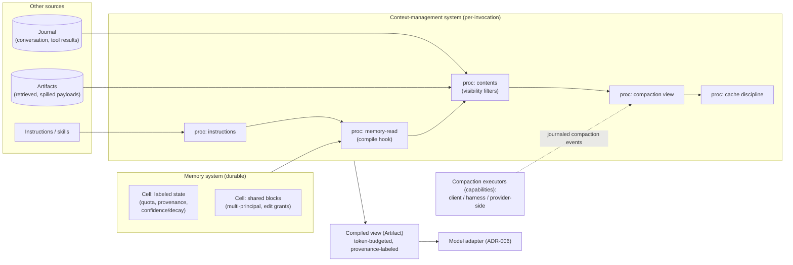

# ADR-008: Context and Memory Are Separate Subsystems

> **Post-review status (2026-08-16).** This document predates the adversarial review; the review's
> binding adjudications live in the Amendment log of `research/DESIGN-SPINE.md` (A1–A14), with the
> full findings in `research/ADVERSARIAL-REVIEW.md`.
> **Applied here:** none. No further amendments are outstanding for this document.


- **Status:** Proposed (pre-adversarial-review)
- **Date:** 2026-08-16
- **Spine anchor:** `research/DESIGN-SPINE.md` §2 (vocabulary: *Context-management system*, *Memory system*), §5 (Context ≠ Memory)
- **Related:** 09-CONTEXT-AND-MEMORY, 08-EVENT-AND-STATE-MODEL, 06-CAPABILITY-SPEC

## Context

"Context" and "memory" are the two most conflated words in the agent ecosystem, and systems that conflate them structurally inherit the defects of both. The kernel must decide whether these are one subsystem (a conversation store that is also what the model sees) or two (a deterministic per-invocation compiler, and durable state cells it reads from).

**Force 1 — the compile-pipeline shape is proven, twice, independently.** SOURCE-CODE OBSERVATION (HIGH): ADK's context construction is an ordered request-processor pipeline (`instructions → identity → compaction → contents-from-event-log-with-visibility-filters → context-cache → planning → …`) building the per-invocation `LlmRequest`; "memory," "caching," and "delegation" are all just processors, and visibility (branch, isolation_scope) is a *filter over the shared log* applied at context-construction time (research/notes/google-adk.md). SOURCE-CODE OBSERVATION (HIGH): MAF's `ContextProvider` pipeline does the same job with a crucial addition — every injected message carries an `attribution` marker (source id, source type, origin sessions) "for governance, audit, or behavioral-analysis purposes"; compaction is a strategy library exposed *through the same provider slot* (research/notes/microsoft-autogen-sk-agent-framework.md). Two vendors, same shape: context is a deterministic, ordered, inspectable compile over sources.

**Force 2 — the durable-cells shape is proven, and it makes the harness stateless.** SOURCE-CODE OBSERVATION (HIGH): Letta's in-context memory is a list of `Block(label, value, limit)` objects; `Memory.compile()` deterministically renders blocks into the prompt with per-block capacity accounting, and `ContextWindowOverview` gives full token accounting. Memory editing is ordinary tool calls; blocks are shareable between agents with consistent views; and memory *management* is reassignable to a different principal — the sleep-time agent holds the memory-editing tools the primary agent lacks (research/notes/agent-frameworks-crewai-pydantic-llamaindex-mastra-letta.md). The note's conclusion (INFERENCE/HIGH): when durable state is labeled, quota'd, and stored behind an API, context construction becomes a deterministic compile function, and the harness becomes stateless and interchangeable — Letta Code's cloud-state/local-harness split is that design shipped. LangGraph independently draws the same line at the infrastructure level: checkpointers (thread-scoped state) vs. stores (cross-thread KV with semantic search) are two deliberately separate systems (FACT, research/notes/langgraph.md).

**Force 3 — compaction is escaping the harness, in real time.** FACT: Anthropic's API now performs *server-side* compaction (`compact_20260112`: the API detects a token threshold, generates a summary, returns a `compaction` content block, and drops prior blocks on subsequent requests) — docs call it "the recommended strategy" for long-running conversations; Claude Code's own client-side two-stage compactor (clear tool outputs, then summarize) is on a path to becoming a fallback (research/notes/anthropic-claude-code-agent-sdk.md). SOURCE-CODE OBSERVATION (HIGH): ADK stores compaction results as typed `EventCompaction` records in the log, honored by the contents processor; MAF ships seven pluggable compaction strategies; Gemini's Interactions processor leans on server-retained state (research/notes/google-adk.md; research/notes/microsoft-autogen-sk-agent-framework.md). INFERENCE (HIGH): compaction is an *event with a pluggable executor* — client-side, harness, or provider-side — and a kernel that hard-codes client-side assumptions will be wrong on the largest provider within a year.

**Force 4 — the messages[] conflation has measured costs.** When the conversation array is simultaneously truth, memory, and model view: provider reasoning state gets stripped by history sanitizers (hard 400s on DeepSeek/Gemini, measured quality loss on OpenAI — research/notes/open-model-infrastructure.md); caching contracts impose prompt-construction discipline (stable prefixes, breakpoint placement) that an undifferentiated array cannot honor per-provider; and compaction becomes destructive mutation of history rather than a derived view. ADK and Claude Code both avoid the conflation the same way — keep the append-only log as truth and *derive* the model view (research/notes/google-adk.md; research/notes/anthropic-claude-code-agent-sdk.md).

**Force 5 — provenance must survive into the compiled view.** MAF's attribution markers and FIDES labels flowing through middleware (research/notes/microsoft-autogen-sk-agent-framework.md), and Claude Code's subagent-output scanning at the trust boundary (research/notes/anthropic-claude-code-agent-sdk.md), both show the same need: the policy layer must know *where each span of context came from*. A context compiler can carry labels structurally; a raw message array cannot.

## Decision

**Context and memory SHALL be two kernel-recognized subsystems with distinct contracts. Context is a compiled view; memory is durable cells. The compile hook connects them.**

1. **Context-management system = deterministic context compiler.** An ordered, inspectable processor pipeline assembles the per-invocation view from declared sources — instructions, memory cells, retrieved artifacts, journal-derived conversation, tool results — under an explicit token budget, with provenance labels surviving into the compiled view span-by-span. The compile is deterministic given (journal position, cell states, pipeline config, budget): any nondeterministic input (retrieval sampling, clock reads) MUST be journaled as an event so the compile is replayable. The compiled view is itself an Artifact (content-addressed, provenance-labeled), which is what the model adapter encodes (ADR-006).
2. **Memory system = durable labeled state cells.** Memory lives in labeled, quota'd cells with provenance, confidence/decay/invalidation metadata, and shareability across principals. Cells survive provider replacement by construction — no provider session handle is ever the system of record. Memory *policy* (tiering, extraction, consolidation, sleep-time reorganization) is userland: memory management is a reassignable principal (the Letta sleep-time pattern), expressible as an ordinary capability holding edit grants on shared cells.
3. **The compile hook is the only sanctioned junction.** Memory enters context exclusively through compile-pipeline processors that read cells; nothing else reaches the model. This keeps the harness stateless with respect to memory (interchangeable, Letta-style) and makes "what did the model see and why" answerable from the journal + compiled-view artifact alone.
4. **Compaction is an event with pluggable executors.** A compaction is journaled as a typed event referencing (input range, executor identity, output artifact). Executors are capabilities: client-side summarizers, harness strategies, or **provider-side** compaction (the Anthropic `compact_20260112` shape) — the kernel treats all three identically and hard-codes none. Provider-side compaction's output block is captured as an opaque carry-through artifact per ADR-006 where required.
5. **Provider-side state is federated, not trusted as memory.** Provider sessions/threads (Responses `previous_response_id`, Gemini Live sessions, Foundry threads) are modeled as remote-cell state with mirrored artifacts under lease semantics (research/DESIGN-SPINE.md §5) — usable for continuity and cost, never the durable record.



## Alternatives considered

**A. messages[]-as-context.** The conversation array is the state; context is the array (or a truncated suffix); memory is whatever survives in it. Rejected: this conflates the truth plane with the model view and inherits every documented defect — provider-state stripping with loud failures (research/notes/open-model-infrastructure.md), per-provider cache discipline that an undifferentiated array cannot express (a *cross-layer constraint*: a model capability that constrains context construction — same note, implication #6), compaction as destructive history mutation, and zero provenance. Every mature system studied already derives the model view from a log rather than treating the array as primary (ADK contents processor; Claude Code startup assembly + compaction over a JSONL transcript; MAF providers over session stores). The array is a *wire encoding* owned by model adapters, not an architecture.

**B. provider-session-as-memory.** Use provider-held state (Responses `store`/`previous_response_id`, Gemini Live session memory, Foundry threads) as the durable memory system. Rejected: it locks the most valuable accumulated state to one provider and one model, violating the memory system's defining requirement — survives provider replacement (research/DESIGN-SPINE.md §2). The mechanics are also wrong for a system of record: provider sessions are lease-shaped (TTLs, resumption handles, third-party reimplementations that are stateless-only — Ollama's `/v1/responses` "non-stateful flavor only," FACT, research/notes/open-model-infrastructure.md), and MAF's own docstring warns that a `service_session_id` is not an authorization boundary (SOURCE-CODE OBSERVATION/HIGH, research/notes/microsoft-autogen-sk-agent-framework.md). Provider state earns a real place — as federated remote-cell state under lease, mirrored into Kyxo artifacts (Decision 5) — but never as the record.

**C. One unified "memory manager" owning both jobs.** A single subsystem that stores durable state *and* decides what the model sees. Rejected: the two jobs have opposite lifecycles and ownership. Context is recomputed per-invocation, disposable, budget-bound, and must be deterministic for replay; memory is durable, quota'd by capacity, shared across principals, and deliberately nondeterministic in its evolution (models and background agents edit it). Fusing them re-creates the Letta *pre*-split world where the harness must be stateful to function — foreclosing the stateless-harness property that makes harness×model pairs swappable (ADR-005) — and gives the policy layer no clean seam: "who may read cell X" and "what entered this prompt" become one tangled question. Letta's sleep-time design is the existence proof that separating *management* (a principal with edit grants) from *compilation* (a deterministic function) is what makes memory governable (research/notes/agent-frameworks-crewai-pydantic-llamaindex-mastra-letta.md).

## Consequences

**Positive:**

- **"What did the model see" is always answerable.** The compiled view is an artifact with span-level provenance; audits, injection forensics (the Claude Code subagent-scanning problem, solved structurally rather than by pattern-matching text), and eval reproduction read it directly.
- **Harnesses are stateless and swappable** with respect to memory — the Letta property — which is precisely what harness×model pairing (ADR-005) and fork-from-checkpoint repair (ADR-002) require.
- **Compaction survives the provider migration underway.** Client, harness, and provider-side executors are interchangeable capabilities; when the next provider ships server-side compaction, Kyxo gains an executor, not a redesign.
- **Memory becomes governable**: cells with labels, quotas, provenance, and edit grants give the policy layer a real seam (who may read/write which cell), and reassignable management principals make sleep-time-style background memory work an ordinary delegation.

**Negative (real costs):**

- **Two subsystems, two APIs, one more concept than every "just use messages" framework.** The C4 simplicity risk lands here almost as hard as on ADR-001; the default profile must make the common case (one conversation, default compaction, no explicit cells) invisible, or users will experience the split as ceremony.
- **The determinism requirement taxes processor authors.** Every context processor must either be pure or journal its nondeterminism (retrieval scores, sampling, timestamps); this is unfamiliar discipline, and violations are silent until a replay diverges. Tooling to detect unjournaled nondeterminism is required work this decision creates.
- **Compiled-view artifacts cost storage and latency.** Materializing and content-addressing a per-invocation view (potentially hundreds of KB, per model call) is a real write on the hot path; deduplication via CAS helps precisely because prefixes are stable, but the overhead is nonzero and must be measured against the audit value (flagged for the doc-14 prototype).
- **Pluggable compaction fragments comparability.** The same cell history compacted by different executors yields different compiled views; cross-run evaluation and fork-replay must record executor identity and treat views as executor-relative — a subtle wrinkle in the "deterministic compile" story that provider-side executors (whose summaries we cannot regenerate) make permanent.
- **Provenance labels consume budget.** Span-level labels survive into a token-budgeted view; the accounting must ensure labels never displace content invisibly, and label-preserving compaction is genuinely harder than naive summarization.

## Evidence & confidence

```
Evidence      — ADK ordered request-processor pipeline with log-derived contents and visibility
                filters; compaction as typed log records (SOURCE-CODE OBSERVATION/HIGH,
                research/notes/google-adk.md). MAF ContextProvider pipeline with attribution
                provenance; seven-strategy compaction library in the provider slot (SOURCE-CODE
                OBSERVATION/HIGH, research/notes/microsoft-autogen-sk-agent-framework.md).
                Letta Block/compile with token accounting, shared blocks, sleep-time reassignable
                memory management; stateless-harness conclusion (SOURCE-CODE OBSERVATION/HIGH +
                INFERENCE/HIGH, research/notes/agent-frameworks-crewai-pydantic-llamaindex-
                mastra-letta.md). LangGraph checkpointer-vs-store split (FACT, research/notes/
                langgraph.md). Server-side compaction as recommended API strategy; Claude Code
                two-stage compactor and skill-reattachment budgets (FACT, research/notes/
                anthropic-claude-code-agent-sdk.md). Cache-contract and reasoning-replay
                cross-layer constraints on context construction (FACT/OBSERVED BEHAVIOR/HIGH,
                research/notes/open-model-infrastructure.md).
Interpretation— The ecosystem's mature systems have all split the roles de facto — a compile
                pipeline over sources on one side, durable addressable state on the other — while
                the immature ones still ship messages[] and pay for it. Compaction's migration
                into provider APIs settles the executor question: it must be pluggable.
Implication   — Kyxo names the split, contracts both sides (deterministic compile with journaled
                nondeterminism and provenance-bearing views; labeled/quota'd/shareable cells with
                a compile hook), and models compaction as journaled events with client/harness/
                provider executors.
Confidence    — HIGH for the split and the compile-pipeline shape (independently convergent).
                MEDIUM for compiled-view-as-artifact overhead and for label-preserving compaction
                practicality — both flagged for prototype measurement and adversarial review.
```
