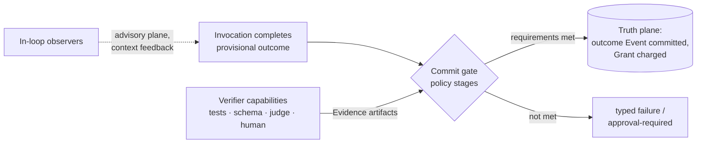

# ADR-012: Verification is a kernel commit-gate hook with userland verifiers

Status: **Proposed**

Deciders: Kyxo architecture program. Related: 08-EVENT-AND-STATE-MODEL (truth plane), 11-SECURITY-AND-POLICY (policy pipeline), ADR-009 (commit semantics), ADR-011 (success criteria), ADR-015 (delegated-result verification).

## Context

**Evidence — verification is absent at the substrate layer in every system studied.** This is the single most consistent absence in the corpus:

- FACT: across Temporal, Restate, and DBOS, "success = no exception"; retry policies classify errors, nothing evaluates *outputs*. "Verification is the layer nobody has" (research/notes/durable-execution.md, Architecture decomposition + Implication 9).
- FACT (by absence): A2A specifies "no verification/acceptance: nothing represents acceptance criteria, evaluation, or client accept/reject of artifacts"; the life-of-a-task doc explicitly assigns "acceptable result" judgment to the client, out of protocol (research/notes/a2a-protocol.md F13).
- SOURCE-CODE OBSERVATION/HIGH: OpenAI's guardrails are validators pinned to three hard-coded loop positions (run input, run output, tool I/O); final output is *detected* by the no-pending-tools heuristic, not verified against criteria; `output_type` gives schema validation only (research/notes/openai-agents-sdk-codex.md §§1, 3).
- OBSERVED BEHAVIOR/HIGH (indirect retrieval): Cursor's verification is all in-loop and advisory — lint feedback, agent-run tests, browser iteration, Bugbot's multi-pass voting — with human selection as the final gate; nothing structurally prevents an unverified result from being presented as done (research/notes/cursor.md §5).
- FACT: constrained decoding is "the only in-band verification layer" the open-model stack has, and it exists at the logit level, not the outcome level (research/notes/open-model-infrastructure.md, Architecture decomposition).

**Evidence — the ingredients exist, scattered.** FACT: grammar-constrained generation guarantees well-formed output where logit access exists, and the same abstract guarantee is re-implementable as post-hoc validation + retry where it doesn't — "same abstract capability, two execution strategies" (research/notes/open-model-infrastructure.md, Implication 7). The agent-frameworks sweep found Mastra's sampled async scorers (observers writing to storage) and PydanticAI's `ModelRetry` (validation feeding back into the loop) as the two production shapes — one advisory, one blocking (research/notes/agent-frameworks-crewai-pydantic-llamaindex-mastra-letta.md, Implication 9, via spine §5).

**Interpretation.** INFERENCE/HIGH: the universal absence is structural, not accidental. In every studied system the "commit point" — where an outcome becomes authoritative — is implicit (a function return, a task state flip), so there is no place to demand evidence. Kyxo's journal-first design (ADR-009) creates an explicit commit point: the append of an outcome Event to the truth plane. A hook there is cheap to specify and impossible to retrofit elsewhere — which is why nobody has it and why it is genuine differentiation (spine §6, gap 2), not repackaging.

**Interpretation — why judgment must stay out of the kernel.** Verifier judgment (which tests to run, what an LLM judge should accept, what consensus threshold suffices) is nondeterministic, model-involved, and workload-specific. Placing it in the kernel violates the determinism split (H3: deterministic orchestration, journaled nondeterministic effects) and the admission test — competing verifier implementations are not just permittable but the entire point.

## Decision

1. **The kernel provides a commit gate: a policy-pipeline hook at two promotion points.** Policy stages may require Evidence artifacts before:
   - **(a) outcome-commit** — an invocation's outcome Event enters the truth plane; until then the outcome is provisional (visible on the advisory plane only);
   - **(b) artifact-promotion** — an Artifact acquires a promoted label (e.g., `releasable`, `trusted-input`) that downstream policy stages key on.

2. **Verifiers are ordinary capabilities.** Tests, lint, typecheck, schema validation, LLM judges, consensus panels, and human review are all invocable capabilities with manifests, versions, budgets, and their own journal records. Evidence is a registered Kind (spine §3.9): a typed artifact carrying the verifier identity/version, the verified target's content address, the verdict, and provenance labels.

3. **Two attachment altitudes, both first-class:**
   - **In-loop observers** — subscribed to the advisory event stream, feeding results back into context (lint-loop, scorer, judge-as-critic). Non-blocking; failure costs quality, not liveness.
   - **Out-of-loop gates** — commit-gate stages requiring Evidence of a declared class before promotion. Blocking; this is where "done" becomes a checked claim. Success criteria on the Objective (ADR-011) compile to gate requirements.

4. **The kernel's guarantee is deliberately narrow:** it enforces *that evidence of the required class, from an eligible verifier, with a passing verdict, exists and is journal-linked to the outcome* — never what the evidence means. Determinism stays in the kernel; judgment stays in userland.

5. **Gate failure is a typed outcome, not a hang.** An invocation whose gate requirements cannot be satisfied transitions through the closed algebra (spine §3.3): to `failed` with the failing Evidence attached, or to an interrupted state (`approval-required`) when policy routes the verdict to a human.

## Alternatives considered

**A. Verification as convention (agent-says-done).** Rejected. This is the incumbent design in all eight coding agents, both OpenAI SDKs, A2A, and all three durable engines, and its signature failure is documented in source: termination inferred from "no pending tool calls" (research/notes/openai-agents-sdk-codex.md §1). Under convention, verification exists exactly when a harness author remembered it, is invisible to audit, and evaporates under delegation (a subagent's "done" is unexamined text — the problem Claude Code's subagent output *scanning* retrofits, per spine §3.5). The absence evidence across all systems is the strongest argument that convention does not produce verification.

**B. Verification hardcoded in the kernel** (built-in judges, built-in test runners, fixed verdict semantics). Rejected. Judgment in the kernel breaks the determinism split — kernel behavior would depend on model outputs — and freezes one verification ideology at the immortal layer. It also fails operationally: verifier quality is workload-specific and evolves faster than any kernel release cadence (judge models, consensus schemes, and scoring rubrics changed more in the evidence window than any protocol did).

**C. Verification as a harness-level library only (no kernel hook).** Seriously considered — it is the Copilot/Mastra shape and requires zero kernel surface. Rejected because a library cannot make the guarantee non-bypassable: any harness (or compromised strategy) that skips the library commits unverified outcomes to the same truth plane as verified ones, and delegated results (ADR-015) cross harness boundaries where no library is in force. Non-bypassability at the commit point is exactly what "permitting competing userland implementations would prevent" — the hook (not the judgment) passes the admission test.

## Consequences

**Positive.**
- "Done" becomes a checked claim with an audit trail: every committed outcome can carry journal-linked Evidence, chained through delegation (ADR-015).
- Genuine differentiation: no studied system, protocol, or engine has an outcome-commit hook (spine §6.2).
- The two-altitude design maps cleanly onto both production shapes already observed (observers and gates), so existing verifier logic ports as capabilities.
- Constrained decoding slots in as the cheap tier: where the model boundary offers grammar enforcement, the gate requirement is satisfiable at generation time for near-zero marginal cost.

**Negative (real costs).**
- **Latency and money at every gated commit.** Verifier invocations cost tokens, wall-clock, and cash, charged against the same grants as the work itself (ADR-014). Aggressive gating can spend more verifying than doing; profiles must ship sane defaults, and the temptation to gate everything is a real failure mode.
- **Gates can deadlock progress.** Misconfigured requirements (evidence class no verifier can produce; judge that never passes) stall runs into `approval-required`/`failed` loops. The typed-failure path bounds the damage but does not diagnose the misconfiguration.
- **Verified ≠ correct.** LLM judges are unreliable; tests are incomplete; consensus can converge on wrong. The kernel's narrow guarantee is honest but will be misread as a correctness promise, and evidence chains may create unwarranted confidence — an audit trail of bad judgment is still bad judgment.
- **Provisional-outcome bookkeeping complicates the event model:** the advisory plane now carries outcomes the truth plane may reject, and downstream consumers must not act on provisional results — a discipline the kernel can label but not fully enforce outside its own boundary.

## Evidence & confidence

| Claim | Label | Confidence | Source |
|---|---|---|---|
| All three durable engines: success = no exception; no output evaluation | FACT | — | research/notes/durable-execution.md |
| A2A: acceptance/verification explicitly out of protocol | FACT (by absence) | HIGH | research/notes/a2a-protocol.md F13 |
| OpenAI guardrails pinned to three positions; done = no-pending-tools | SOURCE-CODE OBSERVATION | HIGH | research/notes/openai-agents-sdk-codex.md §§1, 3 |
| Cursor verification is in-loop/advisory + human selection | OBSERVED BEHAVIOR (indirect) | HIGH | research/notes/cursor.md §5 |
| Constrained decoding = in-generation verification; two execution strategies for one guarantee | FACT + INFERENCE | HIGH | research/notes/open-model-infrastructure.md §4, Implication 7 |
| The absence is structural (no explicit commit point elsewhere) | INFERENCE | HIGH | synthesis across all cited notes |

Decision confidence: **HIGH** on hook-in-kernel / judgment-in-userland; **MEDIUM** on the two promotion points being sufficient (a third point — context-admission gating for taint, ADR-013 — may collapse into this mechanism or need its own; flagged for adversarial review).
