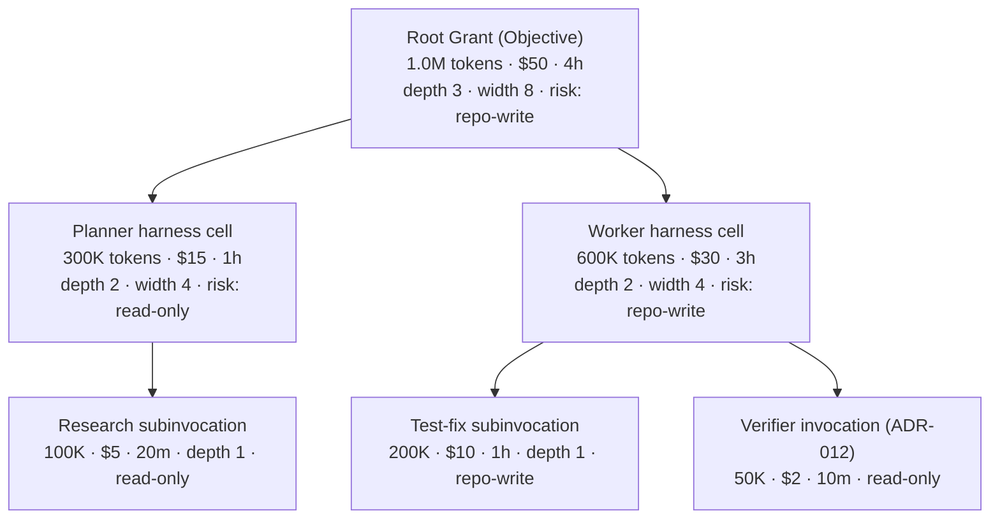

# ADR-014: Budgets are attenuated quantitative grants, kernel-decremented

Status: **Proposed**

Deciders: Kyxo architecture program. Related: 11-SECURITY-AND-POLICY, ADR-013 (Grant substrate), ADR-015 (attenuation across delegation), ADR-009 (charge-at-commit), ADR-011 (budget requests on Objectives).

## Context

**Evidence — the state of the art is counters and caps, and it leaks.**

- SOURCE-CODE OBSERVATION/HIGH: in the OpenAI Agents SDK, budget *enforcement* is "ABSENT everywhere except `max_turns`"; token accounting exists only as reporting (`TokenCount` events, `Usage` objects). Nothing budget-shaped surfaced in any open-source Codex layer; cloud attempt/time/token enforcement, if it exists, is proprietary server-side (research/notes/openai-agents-sdk-codex.md, vocabulary + open question 6).
- FACT: Claude Code's caps are env vars for subagent depth/concurrency plus a single USD cap, with no deadlines — the note's own verdict: "budgets are currently bolted on," and the kernel lesson it draws is a first-class hierarchical resource attached to every execution scope (research/notes/anthropic-claude-code-agent-sdk.md, Implication 5, via spine).
- FACT: the PydanticAI × Temporal integration documents the leak that flat counters produce at effect boundaries: the activity's context is a copy, so "usage accounting mutations made inside activities are lost — a delegate agent's tokens are never charged against the parent's usage limits" (open upstream issue for a cross-backend return channel) (research/notes/durable-execution.md §2). PydanticAI's own delegation pattern requires the user to manually thread `usage=ctx.usage` for child usage to accrue at all (research/notes/agent-frameworks-crewai-pydantic-llamaindex-mastra-letta.md, via spine).
- FACT (by absence): A2A specifies "no budgets/economics: no cost, token, or resource-budget fields on tasks, no quota negotiation" and "no delegation-depth/loop protection" — chains of delegating agents have no hop counts or cycle detection (research/notes/a2a-protocol.md F13).
- OBSERVED BEHAVIOR/HIGH (indirect): Cursor makes the routing decision financially load-bearing (billing at the routed model's rate) — cost is adjudicated per-dispatch by policy, which is only auditable because Cursor owns both sides (research/notes/cursor.md §2, Implication 9).

**Evidence — the nearest prior art, and the novelty admission.** FACT: seL4 creates all kernel objects from user-held *untyped memory* capabilities — resource quantity as a capability you subdivide; Zircon job policies bound what a process subtree may do. The prior-art note's open question 6 asks directly whether "budgets as attenuated quantitative rights (capability with a spend meter)" has precedent and answers: seL4 untyped retyping and Zircon job policies are "close but not identical; this may be a genuinely novel kernel object needing careful design" (research/notes/prior-art-negotiation-extension.md §7, open question 6). The spine carries the same flag (spine §3.7). We do not claim precedent we do not have.

**Interpretation.** INFERENCE/HIGH: three independent failure shapes — enforcement absent (OpenAI), enforcement flat and global (Claude Code env vars), accounting present but leaking across delegation boundaries (PydanticAI/Temporal) — plus the A2A absence at the federation layer, all point at the same missing structure: budgets must *travel with authority* and *subdivide with delegation*, or they are either unenforced, unattributable, or wrong. That structure already exists in the design: the Grant lineage tree (ADR-013). Budgets are the quantitative half of the same object.

## Decision

1. **Budgets ride on Grants.** Every Grant carries, alongside rights, quantitative allowances in typed units: **tokens, money, wall-clock, invocation count, spawn depth, spawn width, risk class**. There is no separate budget subsystem; there is one authority object with a qualitative and a quantitative face.

2. **Attenuation is mandatory and arithmetic.** Delegation mints a child Grant with child ≤ parent on every unit (ADR-015). The lineage tree *is* the resource-attribution tree: any node's consumption is the sum over its subtree, by construction, with no manual `usage=ctx.usage` threading.

3. **The kernel decrements at commit.** The journaled outcome Event (ADR-009) is the charging event: when an invocation's outcome commits, the kernel debits the grant chain atomically with the append. Reported usage from capabilities (model adapters' usage blocks, with their divergent field names — research/notes/open-model-infrastructure.md, vocabulary) is normalized by the adapter into the typed units; the kernel trusts the adapter's declaration and journals it, making mischarging auditable.

4. **Exhaustion is a typed interrupted state, not an exception.** `budget-exceeded` is a member of the invocation lifecycle's interrupted class (spine §3.3), generalizing A2A's `AUTH_REQUIRED` escalation chaining: the requirement (a typed top-up request) propagates up the grant lineage to whoever can approve — parent cell, human, or policy — and work resumes on fulfillment or terminates typed. Runaway loops become escalations with attribution, not silent cost.

5. **Risk class is a budget unit**, not just a label: a grant carries the maximum risk class it may exercise (read-only < workspace-write < external-effect …), and attenuation can only lower it — folding the Codex sandbox-policy axis into the same lineage arithmetic.

## Alternatives considered

**A. Environment-variable / config caps (the Claude Code shape).** Rejected. Flat process-global caps cannot answer *who spent it* (no attribution), cannot subdivide (a subagent inherits the same globals), and cannot travel (a delegated execution in another cell or runtime sees different env). The evidence's own author draws the same conclusion — the retrofit is named as a retrofit.

**B. Reporting-only usage (the OpenAI shape).** Rejected. Observation without enforcement means the control loop is the operator's dashboard — after the money is gone. It also pushes enforcement to the provider's proprietary side (Codex cloud), which a neutral kernel cannot inherit. Kyxo keeps the reporting plane (usage events are journaled) and adds the missing enforcement plane.

**C. Per-run counters without lineage (the PydanticAI shape).** Rejected on direct leak evidence: counters keyed to a run object are wrong by construction the moment execution crosses an effect or delegation boundary — the Temporal integration loses child usage entirely, and correct accrual depends on every author remembering to thread context. Lineage-by-construction is the fix, and it requires the kernel because only the kernel mints grants.

## Consequences

**Positive.**
- Hierarchical budgets with attribution close the gap the entire corpus documents (spine §6.1: "absent everywhere; max_turns/max_llm_calls are the state of the art").
- Recursion control (depth/width) and cost control unify into one enforcement point; A2A's missing hop-count protection is supplied at the kernel layer for local delegation.
- Charge-at-commit makes the journal the billing record — audit, cost attribution, and recovery share one substrate.
- Typed `budget-exceeded` escalation turns the most common agent failure (runaway spend) into a governable workflow.

**Negative (real costs).**
- **Novelty risk, stated plainly.** No production system implements budgets-as-attenuated-quantitative-rights; seL4 untyped and Zircon job policies are the closest analogs and neither meters spend. We are designing without a reference implementation to crib from, and the first design will be wrong somewhere (e.g., reservation vs decrement semantics for parallel children).
- **Charge-at-commit permits in-flight overshoot.** A running invocation can exceed its remaining budget before its outcome commits; leases and pre-flight reservations bound the exposure but a streaming model call cannot be un-spent. Exact enforcement would require charge-at-issue with reconciliation — more machinery, still estimates.
- **Metering-unit brittleness.** Tokens and money assume today's inference economics. Provider-side execution domains (Responses API hosted tools, server-side compaction — research/notes/openai-agents-sdk-codex.md §7) spend resources the kernel never sees; federation (ADR-016) can only mirror their reported usage. Future paradigms (continuous realtime sessions, per-GPU-second local serving, KV-cache residency — research/notes/open-model-infrastructure.md §§1, 8) fit the unit list awkwardly; the unit set must be extensible, and an extensible unit set weakens the closed arithmetic that makes attenuation checkable.
- **Risk-class arithmetic is judgment wearing math's clothes.** Ordering risk classes totally (so child ≤ parent is decidable) forces a one-dimensional collapse of a multi-dimensional space; adversarial capability compositions can be individually low-risk and jointly dangerous. The unit prevents obvious escalation, not clever escalation.
- **Adapter-trusted metering.** The kernel cannot count another process's tokens; it journals what adapters declare. A buggy or malicious adapter mis-meters until telemetry/probes catch it — the C3 amendment (declared ≠ actual) applies to budgets too.

## Evidence & confidence

| Claim | Label | Confidence | Source |
|---|---|---|---|
| OpenAI: enforcement absent beyond max_turns; usage is reporting | SOURCE-CODE OBSERVATION / FACT | HIGH | research/notes/openai-agents-sdk-codex.md vocabulary, open question 6 |
| Claude Code: env-var depth/concurrency caps + one USD cap | FACT | HIGH | research/notes/anthropic-claude-code-agent-sdk.md Implication 5 (via spine) |
| PydanticAI×Temporal: child usage lost at activity boundary | FACT | — | research/notes/durable-execution.md §2 |
| A2A: no budgets, no depth/loop protection | FACT (by absence) | HIGH | research/notes/a2a-protocol.md F13 |
| seL4 untyped / Zircon job policies closest prior art; genuinely novel object | FACT + INFERENCE | HIGH (on novelty) | research/notes/prior-art-negotiation-extension.md §7, open question 6 |
| Usage field names divergent across providers (normalization burden) | FACT | — | research/notes/open-model-infrastructure.md vocabulary |

Decision confidence: **HIGH** that budgets must be hierarchical, grant-borne, and kernel-enforced (three independent failure shapes + explicit absences); **MEDIUM** on the unit list and charge-at-commit semantics (novel design, no prior art to validate against; reservation semantics for parallelism deliberately deferred to the prototype).
