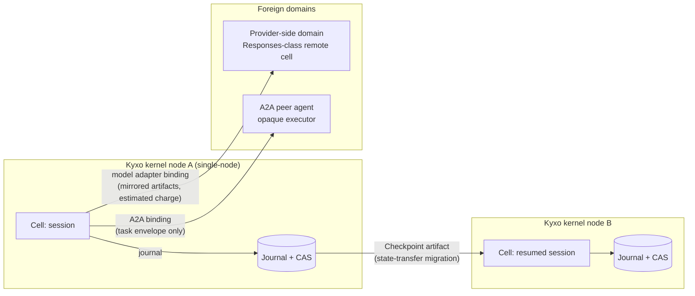

# ADR-016: Single-node kernel; distribution via portable checkpoints and protocol edges

> **Post-review status (2026-08-16).** This document predates the adversarial review; the review's
> binding adjudications live in the Amendment log of `research/DESIGN-SPINE.md` (A1–A14), with the
> full findings in `research/ADVERSARIAL-REVIEW.md`.
> **Applied here:** none. No further amendments are outstanding for this document.

Status: **Proposed**

Deciders: Kyxo architecture program. Related: 07-RUNTIME-ARCHITECTURE, 13-FUTURE-SCENARIO-TEST, ADR-009 (checkpoint format), ADR-010 (V1 scope), ADR-015 (delegation across edges).

## Context

The kernel must decide where distribution lives: inside the kernel (an actor mesh or consensus log), or outside it (moved state and spoken protocols). The evidence contains one full-scale corporate experiment that answers this, one commercial proof of the alternative, and one architecture that shows what "distributed kernel" actually costs when done properly.

**Evidence — the in-kernel mesh was built and killed.** SOURCE-CODE OBSERVATION/HIGH: AutoGen v0.4's distributed story was a gRPC worker protocol (`agent_worker.proto`: `service AgentRpc` with bidirectional `OpenChannel`, control channel, `RegisterAgent`, subscription RPCs, CloudEvents envelopes), built on the actor model with "easily move to a distributed system in the cloud" as the pitch. In the MAF convergence, Microsoft *dropped the distributed actor mesh entirely*: what survived is typed nodes + superstep barriers + checkpoint-at-barrier + hosting adapters; the note's synthesis is blunt — "Distribution belongs to protocols, not the kernel. The gRPC actor mesh died; A2A/MCP/HTTP hosting adapters won… treat 'distributed runtime' as an anti-goal" (research/notes/microsoft-autogen-sk-agent-framework.md §§2, 7, Implication 8).

**Evidence — state-transfer migration ships commercially.** FACT (indirect retrieval): Cursor's `&` handoff pushes a live local conversation to a Cloud Agent that continues it server-side; threads resume by ID across IDE/web/mobile; INFERENCE/HIGH from the same note: Cursor treats an agent as *portable conversation + workspace state* migrating between execution substrates while remaining one logical thread — "continuity is achieved by state transfer, not event-sourced re-execution," and there is no evidence of deterministic replay anywhere in the product (research/notes/cursor.md §8).

**Evidence — checkpoints can be portable artifacts.** SOURCE-CODE OBSERVATION/HIGH: MAF's `WorkflowCheckpoint` is definition-scoped and lineage-chained (`graph_signature_hash` + `previous_checkpoint_id`), validated against topology at resume — checkpoints as shareable artifacts resumable in fresh processes (research/notes/microsoft-autogen-sk-agent-framework.md, vocabulary + Implication 3). The spine's Checkpoint object adopts exactly this (spine §3.8).

**Evidence — what a distributed kernel really costs.** FACT: Restate's architecture is a control plane + Bifrost (virtual-consensus distributed log per Delos, Flexible Paxos, sealed segments, loglets) + partition processors materializing state into RocksDB with object-store snapshots. INFERENCE/HIGH: Restate is an event-sourced database whose tables are invocation journals — i.e., the distributed-kernel option is a *database engineering program* (research/notes/durable-execution.md §3). Temporal's topology (server + worker fleets + task queues + sticky caches with 5 s fallback-to-full-replay) shows the operational weight of the server-mediated alternative, and its stateful-MCP integration needed a dedicated worker pinned to a per-run task queue — "location transparency breaks down exactly where the environment holds session state" (research/notes/durable-execution.md §§1–2).

**Evidence — the other end of the wire is already a runtime.** FACT: the Responses API stores conversation state, executes hosted tools and MCP calls server-side, runs V8 programs, and executes in background with resumable stream cursors; the Assistants sunset confirms the direction is permanent. The note's implication: treat "execution that happens inside the provider" as a foreign execution domain with its own artifacts, policies, and budgets that the kernel mirrors — "federate, don't wrap" (research/notes/openai-agents-sdk-codex.md §7, Implication 5). A2A supplies the contract shape for opaque remote executors: server-owned task records, terminal/interrupted state classes, "state is authoritative, events are advisory" (research/notes/a2a-protocol.md F5, Implications 1–2).

**Interpretation.** INFERENCE/HIGH: agent workloads are session-shaped and coarse-grained (cells with single-writer turns, effects dominated by network calls to models/tools), not fine-grained message storms. The scaling unit is the *cell*, and cells move whole (checkpoint) or are reached remotely (protocol) — nothing in the evidence requires cross-node shared execution state inside one kernel, and the one team that built it deleted it.

## Decision

1. **The Kyxo kernel is single-node.** One process owns a cell's journal, scheduler, policy pipeline, and grants; execution semantics never span kernels. There is no in-kernel transport, membership, or placement (distributed transport is an explicit non-primitive — spine §3).

2. **Distribution mechanism 1: portable Checkpoints (state-transfer migration).** A Checkpoint — journal position + state snapshot + pending invocations, bound to definition identity (strategy hash + lineage) — is a self-contained artifact; migrating a cell = checkpoint on node A, transfer (checkpoint + referenced CAS artifacts), resume on node B. This is the Cursor `&` handoff made a kernel verb over the MAF checkpoint discipline (topology/definition-hash validation at resume, ADR-009's fork machinery reused).

3. **Distribution mechanism 2: protocol edges.** Remote execution is invocation of a capability whose Binding crosses a protocol boundary: A2A for peer agent federation, MCP for tools, provider APIs via model adapters, ACP-class protocols to surfaces. The remote party is opaque; the kernel holds the envelope (task lifecycle, artifacts, typed interruptions) and nothing else.

4. **Provider-side execution domains are remote cells.** A provider that stores state and executes tools server-side is modeled as a *remote cell in a foreign execution domain*: its artifacts are mirrored into local CAS by reference, its reported usage is charged against the invoking grant (with `estimated` provenance — ADR-014), its policy exposure is declared in the adapter manifest so the policy pipeline can veto binding to domains that would evade required stages. Federated, never proxied-and-forgotten.

## Alternatives considered

**A. In-kernel actor mesh** (Orleans-style placement/activation across nodes, AutoGen-style gRPC agent mesh). Rejected on the strongest kind of evidence available: a resourced team built exactly this, shipped it, and deleted it one framework-generation later; what users actually adopted were hosting adapters at protocol boundaries. The mesh also imports a decade of hard problems (membership, failure detection — Orleans needed years to get from 10 minutes to 90 seconds — placement, routing) into a kernel whose workload evidence shows coarse session-grained parallelism that plain horizontal sharding of cells over independent kernels serves. Orleans-class virtual-actor semantics survive in Kyxo *within* a node as the Cell object; it is the cross-node mesh that is rejected, not the grain.

**B. Distributed-consensus kernel** (build on a Bifrost-class replicated log from day one). Rejected as premature, not as wrong. Restate demonstrates the shape works — and that it is a Rust database program with virtual consensus, partition processors, snapshotting, and log trimming as *prerequisites*. Adopting it first would spend the validation window on infrastructure that does not test a single kernel hypothesis (grants, negotiation, commit gates). The journal-behind-an-interface design (ADR-009, ADR-010's conformance-tested storage) keeps a replicated-log backend as the documented later option: the record format, not the deployment topology, is the compatibility promise. If Kyxo succeeds, a Restate-architecture storage/consensus tier under unchanged kernel semantics is the intended scale-out path.

**C. Server-mediated worker topology** (Temporal shape: central service + polling worker fleets). Rejected for the kernel: it centralizes the journal (good) at the cost of mandatory service topology for every deployment (bad for the `runtime.run(objective)` DX floor) and shows documented friction precisely at stateful environments (pinned-worker hack). Nothing prevents a *product* from arranging Kyxo nodes behind a scheduler in this shape; the kernel just doesn't require it.

## Consequences

**Positive.**
- V1 deploys as one process with SQLite — the DX floor (spine §9) survives; no consensus, membership, or fleet operations to run or debug.
- Migration, session handoff (laptop→cloud), and blue-green upgrades all reduce to one verb: checkpoint + resume, with definition-hash validation catching incompatible resumes loudly.
- Federation treats the two real growth directions of the ecosystem — provider-side runtimes and A2A peers — as first-class, with budgets/policy/provenance mirrored rather than silently lost (the coverage gap Implication 5 of the OpenAI note warns about).
- The portable checkpoint + published record format is itself differentiation (spine §6.5): no incumbent's execution record moves between vendors.

**Negative (real costs).**
- **A hard per-cell and per-node ceiling.** One kernel bounds throughput and availability: a node crash takes all its cells down until journals are re-opened elsewhere (recovery, not failover — no replica is warm). Workloads needing thousands of concurrent hot cells need application-level sharding that Kyxo V1 gives no placement help for.
- **Migration is stop-the-world for the cell.** Checkpoint-transfer-resume has a blackout window (grows with snapshot + unmirrored CAS size); there is no live migration. Cursor's UX gets away with seconds of handoff; long-blackout cases (huge workspaces) will be visibly worse than mesh-based designs that never move state.
- **Federation guarantees degrade at every edge, and honestly so.** Grants do not cross to opaque peers (ADR-015); provider-domain budget charges are estimates from adapter-reported usage; policy coverage inside a foreign domain is declared, not enforced. The kernel's invariants are domain-local, and the documentation must repeat this until it is boring.
- **Deferred consensus is deferred, not free.** If multi-node demand arrives early, retrofitting a replicated log under live deployments is major surgery — mitigated by the storage interface and record-format discipline, but the failure-scenario doc (13-FUTURE-SCENARIO-TEST) must carry this as a standing risk, and the adversarial review should probe whether any V1 target workload already breaks the single-node ceiling.
- **Checkpoint portability drags the environment problem behind it.** A cell referencing a leased execution environment (workspace, browser, VM — spine §2) cannot checkpoint the environment itself; resume on another node requires environment re-provisioning (Cursor's snapshot/Builds pattern) that is a capability concern, out of kernel — meaning "portable checkpoint" is portable only as far as its environment references are reconstructible.

## Evidence & confidence

| Claim | Label | Confidence | Source |
|---|---|---|---|
| AutoGen gRPC actor mesh built, then killed in MAF; adapters won | SOURCE-CODE OBSERVATION + INFERENCE | HIGH | research/notes/microsoft-autogen-sk-agent-framework.md §§2, 7, Implication 8 |
| Cursor `&` handoff: commercial state-transfer migration, no replay | FACT (indirect) + INFERENCE | HIGH | research/notes/cursor.md §8 |
| MAF checkpoints definition-scoped, lineage-chained, portable | SOURCE-CODE OBSERVATION | HIGH | research/notes/microsoft-autogen-sk-agent-framework.md |
| Restate distributed substrate = virtual-consensus log + partition processors (the later option's real cost) | FACT + INFERENCE | HIGH | research/notes/durable-execution.md §3 |
| Temporal topology weight; pinned-worker hack for stateful MCP | FACT | — | research/notes/durable-execution.md §§1–2 |
| Providers are becoming runtimes; federate, don't wrap | FACT + INFERENCE | HIGH | research/notes/openai-agents-sdk-codex.md §7, Implication 5 |
| A2A envelope contract for opaque remote executors | FACT | — | research/notes/a2a-protocol.md F5 |

Decision confidence: **HIGH** on no-in-kernel-mesh (built-and-deleted evidence) and on checkpoints + protocol edges as the distribution story; **MEDIUM** on single-node sufficiency for all V1 target workloads (an assumption about adoption shape, not a measured fact — explicitly offered to the adversarial review).
