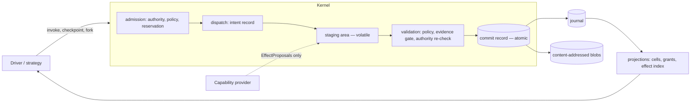
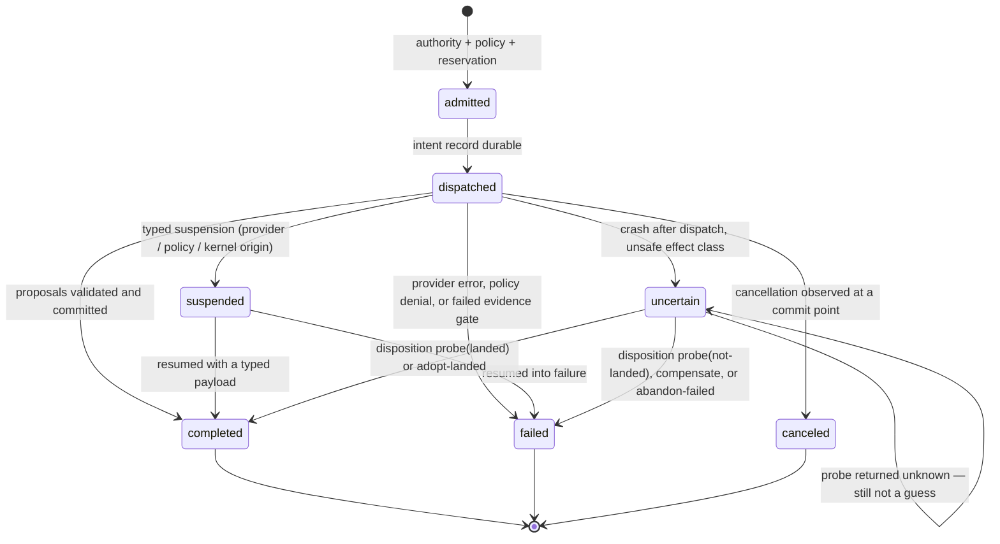

# 17 — Kernel Semantics (normative)

Status: **NORMATIVE DRAFT v0**, 2026-08-16. Protocol revision `2026-08-16`.

> **SUPERSEDED IN PART by Wave S1 (2026-08-16). Record format revision `2026-08-17`.**
>
> This document describes the phase-2 record format. Wave S1 replaced that format to resolve
> freeze blockers B1, B2, B3, B4, B5, B6, B8, B9a and B9b. Where this document and the S1
> kernel disagree, **the S1 kernel governs** under the precedence rule (doc 24 §2), and the
> disagreement is one of these:
>
> | Area | This document says | The `2026-08-17` format does | Record |
> |---|---|---|---|
> | Effect claims | key indexed at settlement | claimed at admission, before dispatch | ADR-024 |
> | Grants | per-execution state copied at fork | one family-scoped ledger per grant id | ADR-025 |
> | Protected effects | list captured at a checkpoint cut | family-wide ledger derived by fold | ADR-025 |
> | Budget units | `invocations` enforced, others advisory | every unit reserved; metered vs unmetered settlement | ADR-026 |
> | Landed effects | candidate held until settlement | committed at yield | ADR-028 |
> | Resume | `resumeInvocation`, a second settlement path | one shared path; lease read from the journal | ADR-028 |
> | Integrity | chain covers the payload | chain covers `payloadHash`; whole-record checksum | ADR-027 |
> | Recovery | skips bad records and continues | fails closed on non-trailing corruption | ADR-027 |
>
> §2's redaction specification is now **true** — it was the thing the format could not do,
> and B8's redaction half is resolved. `leaseEpoch` remains declared here and implemented
> nowhere; it must be implemented or normatively withdrawn before freeze.
>
> Results, blocker reclassification and the freeze reassessment: `25-S1-RECORD-FORMAT-RESULTS.md`.
> This document is **not** rewritten to match, because rewriting a normative record to agree
> with a later decision destroys the evidence that the decision was made.

This document specifies the semantics of the Kyxo kernel's durable core: events, the
journal, the commit barrier, invocations, side effects, checkpoints, resume, fork,
deduplication and lineage. It is *executable*: every normative statement here is
enforced by `prototypes/kernel-semantics/` and asserted by its test suite. Where prose
and code disagreed during this phase, the code won and the prose was corrected — five
such corrections are recorded in `20-SEMANTIC-TEST-RESULTS.md`.

RFC 2119 terms (MUST, MUST NOT, SHOULD, MAY) are used only for genuine conformance
requirements. Ordinary description is written in plain prose deliberately.

Superseded by nothing. Supersedes, where they conflict: `08-EVENT-AND-STATE-MODEL.md`
(§6.4, §6.5, §7.1) and the corresponding passages of `05-KERNEL-PRIMITIVES.md`.

---

## 1. Model overview

Four roles, and the boundary between them is the whole design:

| Role | May do | May NOT do |
|---|---|---|
| **Kernel** | Append to the journal, mint authority, promote artifacts, evaluate policy, cut checkpoints, fork lineages | Reason about task content; branch on what a capability *is* |
| **Capability provider** | Receive data, perform work, *propose* effects, return an outcome | Hold a kernel reference; write to the journal; mint or widen authority; promote its own artifacts |
| **Driver (orchestration strategy)** | Call kernel verbs (invoke, checkpoint, fork, resume), read committed projections | Append events directly; fabricate authority; bypass a commit gate |
| **Storage** | Persist commit records, blobs, checkpoints | Interpret them |

The commit barrier is **structural**: a provider's only channel to durable truth is the
proposal stream, which the kernel validates before committing. This is not a policy that
can be disabled; there is no API through which a provider could write truth.



---

## 2. Event

**Definition.** An Event is an immutable, typed record of something that *has happened*
in exactly one execution. Events are the only durable truth; every projection is a fold
over them.

Normative requirements:

- Every event MUST carry: `id` (globally unique), `seq` (execution-local position),
  `kind`, `schemaVersion`, `protocolVersion`, `executionId`, `correlationId`,
  `actorId`, `occurredAt`, `payload`, and `integrity {prev, self}`.
- `actorId` MUST be stamped by the kernel and MUST NOT be writer-supplied. Attribution
  that a participant can forge is not attribution.
- Events MUST be immutable after commit. Correction is a new event; there is no update
  or delete. Redaction is performed by tombstoning payload content while preserving the
  hash chain (the envelope's `payloadHash` continues to attest what was there).
- **Ordering is per execution, not global.** `seq` is dense and strictly monotonic
  within an execution; there is no global total order and none is required. Cross-
  execution ordering is expressed causally via `correlationId` / `causationId`, not by
  timestamps. `occurredAt` is advisory and MUST NOT be used as an ordering authority.
- Two events MAY share a logical cause: `causationId` forms a DAG, not a chain.
- **Events cannot arrive twice or out of order**, because events are not messages: they
  are created by the kernel at commit time inside the record that carries them.
  Duplication and reordering are properties of *deliveries* and *invocations*, which are
  handled in §9 — and each such occurrence is itself recorded as an event.
- An event MAY NOT be rejected after generation, because generation and commit are the
  same act. Candidate effects, which *can* be rejected, are not events (§4).

**What makes an event authoritative:** it appears inside a commit record whose checksum
validates, in an execution whose hash chain is unbroken up to it. Nothing else.

## 3. Journal

The journal is an ordered sequence of **commit records**. A commit record is the unit of
atomicity:

```
CommitRecord = { commitToken, executionId, events[1..n], checksum }
```

- A commit record MUST land entirely or not at all. Readers MUST discard a trailing
  record whose checksum does not validate (a torn write) and MUST NOT partially apply
  it.
- What is appended is a commit record; what is committed is the same thing — Kyxo has no
  two-phase append. **Before** a commit record is durable, its contents are visible only
  to the kernel's staging area, which is volatile by construction. **After** it is
  durable, its events are visible to every projection.
- An append MUST NOT be rolled back. Compensation for a landed effect is a new,
  forward-moving record (§5).
- Storage MUST provide: append-atomicity per record, durability before acknowledgement,
  and detection of truncated records. It need NOT provide global ordering across
  executions, transactions spanning records, or mutation.
- The journal MAY contain multiple records describing the same *external* effect (an
  attempt, a duplicate delivery, a resolution). It MUST NOT contain the same *event*
  twice: event identity is minted at commit.
- **Deduplication happens before journaling of an effect, and is itself journaled.** A
  suppressed duplicate produces a `delivery.duplicate` or `effect.deduplicated` record.
  Suppressing the effect while also suppressing the record would destroy the audit
  evidence that the duplicate occurred — the single most important rule in §9.
- The journal is the source of truth. Checkpoints, projections, caches and indexes are
  derived and MUST be reconstructable from it.

## 4. The commit barrier

> **What is impossible before commit:** a capability's proposed effect being observed by
> any other participant, counted against a budget, promoted to an artifact anyone can
> reference, or surviving a crash.
>
> **What becomes true after commit:** the effect is authoritative, ordered within its
> execution, attributable to an actor and a grant, visible to projections, and
> immutable.

The barrier is enforced by construction, in three parts:

1. **No handle.** `InvokeCtx` — everything a provider receives — contains data only:
   ids, a logical clock value, the request, an optional resume payload, and a
   cancellation predicate. There is no kernel, journal, storage, or grant object on it.
   A malicious provider that enumerates its context finds nothing to call (asserted in
   `tests/universality.test.ts`).
2. **Proposals, not writes.** A provider yields `EffectProposal` values. They accumulate
   in a staging area the provider cannot address. Staging MUST be released on every exit
   path, including exceptions.
3. **Kernel validation before promotion.** At settlement the kernel re-checks authority
   (catching revocation that occurred mid-flight), runs commit-phase policy stages
   against the actual proposals, and applies the evidence gate. Only then does it
   construct events and write one commit record.

Consequences that MUST hold:

- A capability MUST NOT be able to report success when the commit gate rejects its
  outcome. A provider returning `{status:'ok'}` while proposing failing evidence under
  `requiresEvidence` lands in `failed`, and its staged artifacts are discarded rather
  than promoted.
- No userland component — provider or driver — may append an authoritative event
  directly. Drivers cause events only by invoking kernel verbs.
- Crash recovery MUST NOT convert a staged candidate into a committed effect. Staging is
  never durable, so this holds by construction rather than by care.

**Challenge considered.** An alternative design lets capabilities write to the journal
through a mediated, policy-checked writer. Rejected: it makes the barrier a property of
the mediator's correctness, and every future writer verb becomes a new bypass to audit.
The generator-based proposal channel costs one indirection and removes the class.

## 5. Side effects

The kernel MUST classify every invocation by a **declared effect class**, and its
recovery behaviour is derived from that class alone — never from what kind of thing the
capability is:

| Class | Meaning | Re-execution after unknown outcome |
|---|---|---|
| `pure` | No effect outside the kernel | Safe |
| `local` | Mutates kernel-owned state only (cells, artifacts) | Safe under dedup |
| `external-idempotent` | External, declared idempotent under the effect key | Safe: re-lease |
| `external-compensatable` | External, not idempotent, reversible via declared compensation | **Unsafe**: requires disposition |
| `external-irreversible` | External, not idempotent, not reversible | **Unsafe**: requires disposition |

Additional distinctions the model carries: *artifact creation* is a `local` effect that
becomes durable only at commit; *runtime-local state change* is likewise `local`; an
*effect with unknown outcome* is not a class but a **state** (§6).

### 5.1 The guarantee actually provided

Kyxo does **not** provide general exactly-once execution, and this specification does
not pretend otherwise. What it provides:

- **At-most-once for effects whose outcome the kernel observed.** An effect key that has
  completed in a lineage will not execute again in that lineage.
- **At-least-once for safe classes**, via re-lease after crash.
- **Explicit uncertainty for unsafe classes.** When an external effect may have landed
  but no outcome was recorded, the kernel MUST represent that as `uncertain` and MUST
  NOT resolve it by guessing, by retrying, or by assuming failure.
- **Exactly-once as an illusion**, and only where an idempotency key plus a bounded
  dedup window plus lease fencing can construct it.

## 6. Invocation lifecycle



Normative rules:

- Admission MUST precede dispatch, and reservation MUST be durable before dispatch, so
  a crash cannot lose a budget hold.
- For external effect classes the kernel MUST commit an **intent record**
  (`invocation.dispatched`, carrying the effect key, class and lease epoch) *before*
  invoking the provider. This record is what makes post-crash uncertainty detectable;
  without it, a landed effect is indistinguishable from one that never started.
- Terminal states are `completed`, `failed`, `canceled`. `suspended` and `uncertain` are
  non-terminal and MUST be resolvable.
- On recovery, an invocation observed in `dispatched` with no outcome MUST be triaged by
  effect class: safe classes MAY be re-leased automatically; unsafe classes MUST become
  `uncertain`.
- Resolving uncertainty MUST be an explicit, journaled disposition: `probe`,
  `adopt-landed` (with a recorded authority), `compensate`, or `abandon-failed` (with a
  recorded authority). A probe that answers `unknown` MUST leave the invocation
  `uncertain`.
- Cancellation *requests* MUST be journaled when made, not only when honoured, so that
  operator intent racing a completion leaves a trace.

## 7. Checkpoint

A checkpoint is a named consistent cut of one execution:

```
Checkpoint = {
  id, executionId,
  cutSeq,             // last COMMITTED seq folded into this cut — the consistency boundary
  stateSnapshot,      // CAS reference to the folded state
  pending[],          // in-flight invocations: id, effectKey, effectClass, leaseEpoch, state
  dedupWindow[],      // BOUNDED reliability window only — not the replay cache
  protectedEffects[], // landed irreversible effects that a fork must not silently redo
  grants[],           // grant states as of the cut
  definitionHash, protocolVersion
}
```

**Durable runtime truth** (MUST be in or referenced by the checkpoint): the committed
journal offset, pending invocations with their effect classes and lease epochs, the
protected-effect set, grant states, and definition identity.

**Cached / reconstructable state** (MAY be in the checkpoint purely as an accelerator):
the folded cell state, materialized views, context, memory projections. These MUST be
byte-reproducible by folding the journal prefix — the property asserted at every
`resumeFromCheckpoint`.

**Referenced, never contained**: artifacts (CAS refs), provider session state (external
references plus a declaration of whether they are resumable), external resource handles.

Checkpoints MUST be durable and MUST be reloaded on recovery. (A kernel that persisted
checkpoints but could not reload them would be unable to fork after a restart — the
disaster-recovery case. This was falsified during implementation; see doc 20 F-4.)

## 8. Resume and fork — two different verbs

This is the resolution of the first review's FATAL-1. The phase-1 design conflated them,
which is why "restore" could neither rewind nor reconcile.

### 8.1 `resume(checkpoint)` — continue a lineage

- Keeps the **same execution identity** and the same lineage.
- State = snapshot at the cut, **plus** the committed journal suffix after the cut.
  A checkpoint is an accelerator, not a rewind.
- MUST verify that folding the journal prefix reproduces the snapshot; a mismatch means
  corruption and MUST be reported, not silently accepted.
- Pending invocations are triaged exactly as in recovery (§6).
- New invocations MAY be issued. Committed history MUST NOT be rewritten.
- If the provider of a suspended invocation cannot be re-entered (its declared
  `resumable` trait is false, or its external session is gone), the invocation MUST
  fail explicitly rather than silently restart.

### 8.2 `fork(checkpoint, dispositions)` — branch a lineage

- Creates a **new execution identity** whose first event is `execution.forked`, carrying
  `parentExecution`, `checkpointId`, `cutSeq`, the dispositions, and any replay override.
- Inherits state **at the cut only**. Post-cut parent events MUST NOT be visible to the
  child; inheritance is by causal reference to the cut, not by copying the parent's log.
- **Effect identity is lineage-scoped.** The child's effect index contains only entries
  at or before the cut, each marked `inherited`. The parent's post-cut effects are
  invisible, so the child may legitimately perform that work itself.
- **Inherited unsafe effects refuse loudly.** An inherited `external-irreversible` or
  `external-compensatable` effect MUST NOT be returned as a silent cache hit; attempting
  it raises a refusal and journals `policy.denied`. Only an explicit
  `allowReplayOfProtected` override — carrying a reason, journaled in the fork event —
  permits the child to redo it. (Falsified during implementation: without this,
  inherited irreversible effects were absorbed as cache hits, indistinguishable to the
  caller from having performed them. See doc 20 F-1.)
- **Every pending invocation at the cut MUST have an explicit disposition**: `adopt`
  (the world saw it; treat as landed, protect it), `re-lease` (re-execute — permitted
  only for safe classes, or under an explicit override), `compensate`, or `abandon`.
  Forking with an unaddressed pending invocation MUST fail loudly. Silence about an
  unknown external outcome is the bug this rule exists to prevent.
- Grants are re-resolved at fork time: authority revoked after the cut stays revoked in
  the child. A checkpoint MUST NOT resurrect revoked authority.
- The parent MUST be unaffected. Parent and child MAY execute concurrently.
- A checkpoint MAY have any number of forks; forks MAY be nested recursively.
- **Merge is not supported.** Two lineages that diverged have divergent world effects,
  and no automatic rule can reconcile them safely. Reconciliation, where it is wanted,
  is ordinary work performed by a strategy in a third lineage.

**Lineage representation.** `execution.forked` is the ancestry record; the chain of such
events is the lineage. `correlationId` is preserved across forks so an audit query
retrieves the whole family; `executionId` distinguishes members.

## 9. Deduplication — six mechanisms, deliberately distinct

Conflating any two of these produces a real bug; the phase-1 prototype demonstrated two
of them.

| # | Mechanism | Scope | Suppresses | Journals |
|---|---|---|---|---|
| 1 | **Delivery dedup** | A repeated delivery of the same request | The effect | `delivery.duplicate` — MUST be recorded |
| 2 | **Effect dedup** | Effect key already executed in *this* lineage | The effect | `effect.deduplicated` — MUST be recorded |
| 3 | **Invocation dedup** | Same invocation resubmitted | The new invocation | Maps to the original id |
| 4 | **Artifact/CAS dedup** | Identical bytes | The *storage write* only | `artifact.produced` MUST still be journaled, per producing invocation, with its own provenance |
| 5 | **Event dedup** | — | MUST NOT exist | — |
| 6 | **Commit dedup** | Retried commit of the same token | The duplicate write | `commit.retried` |

Normative rules:

- **A duplicate occurrence is audit evidence even when its effect must not run twice.**
  Suppressing an effect MUST NOT suppress its record.
- **CAS dedup is a storage optimization and MUST NOT become event dedup.** First-writer-
  wins provenance is a defect: each producing invocation gets its own `artifact.produced`
  event naming *it* as producer, even when the bytes already exist.
- Effect keys MUST be **content-inclusive**: derived from the capability, the step
  identity and a hash of the request. Position-only keys silently inject stale outcomes
  when arguments change under an unchanged call site.
- The **bounded reliability window** (mechanism 1/6) and the **replay cache**
  (mechanism 2) are separate structures with separate lifetimes. The window MUST satisfy
  `dedupTTL ≥ maxRetryHorizon`; the replay cache is content-keyed and policy-governed.
  Only the window belongs in the checkpoint.

## 9a. Grants: ceilings, not reservations

A grant's limits are **ceilings enforced along the whole chain at admission**, not
partitioned reservations. Two consequences that MUST be understood by anyone reading a
grant:

- Sibling grants MAY overcommit: a parent holding 5 invocations may mint ten children
  each declaring 4. Attenuation validates each child against the parent independently.
- Actual spend is nevertheless bounded by every ancestor: admission checks remaining
  budget for each grant in the chain, so the ten siblings above collectively admit
  exactly 5 invocations and the rest are denied with a journaled `grant.denied`.

In other words, a grant's limit is *the most this child may ever spend*, not *this much
is set aside for it*. This is thin provisioning, chosen because AI workloads cannot
predict how spend distributes across delegated branches; hard partitioning would strand
budget in branches that never run. An implementation MAY offer a partitioned mode, but
the default and the guarantee specified here are as above. Verified by
`grants.test.ts`, "sibling grants may overcommit limits, but chain spend is still
bounded".

Reservation and settlement (amendment A2) apply to *invocations in flight*: admission
reserves, outcome settles or releases. Reservation is durable before dispatch so a crash
cannot lose a hold.

## 10. Lineage and provenance

- Every committed event carries `executionId` and `correlationId`; causally-derived
  events carry `causationId`.
- Every artifact carries provenance naming the producing invocation, and MUST be
  present in the CAS when referenced.
- Every invocation carries the grant under whose authority it ran; grants form an
  attenuation tree, so spend and authority are attributable along the whole delegation
  chain.
- Delegation creates a child invocation under an attenuated grant; there is no separate
  delegation mechanism to audit.

## 11. Capability traits and the no-branching rule

The kernel MUST NOT branch on what a capability *is* (`agent`, `tool`, `model`,
`harness`). It MAY — and does — branch on **declared, negotiated properties**:

`effectClass`, `probeable`, `compensatable`, `resumable`, `streaming`, `cancellable`,
`externallyStateful`.

The distinction is not cosmetic. A trait is a claim about *mechanism* that the kernel can
act on generically and that any capability may declare; a type is an identity that
partitions the world into categories the kernel would then have to understand. Traits
compose (a capability may be probeable and resumable and streaming); types do not.
Enforcement: `tests/universality.test.ts` fails the build if kernel or record-format
source names any capability, or branches on a conceptual type, and CI runs it on every
push.

Where a trait is absent, the kernel MUST degrade to the safe behaviour rather than
assume the capability: a non-probeable capability's uncertainty cannot be resolved by
probing, and the kernel says so instead of guessing.

## 12. Conformance

An implementation conforms to protocol revision `2026-08-16` if it satisfies every MUST
in this document and passes:

- the invariant suite of `18-KERNEL-INVARIANTS.md`,
- the crash matrix of `19-CRASH-RECOVERY-MODEL.md`,
- the fork, dedup, grant and universality suites,
- differential agreement with the reference model on invocation outcomes and budgets.

Serialization evolution and version migration are specified in
`22-RECORD-FORMAT-FREEZE-DECISION.md` §4, which also states the freeze criteria this
document must satisfy before the record format is declared stable.
