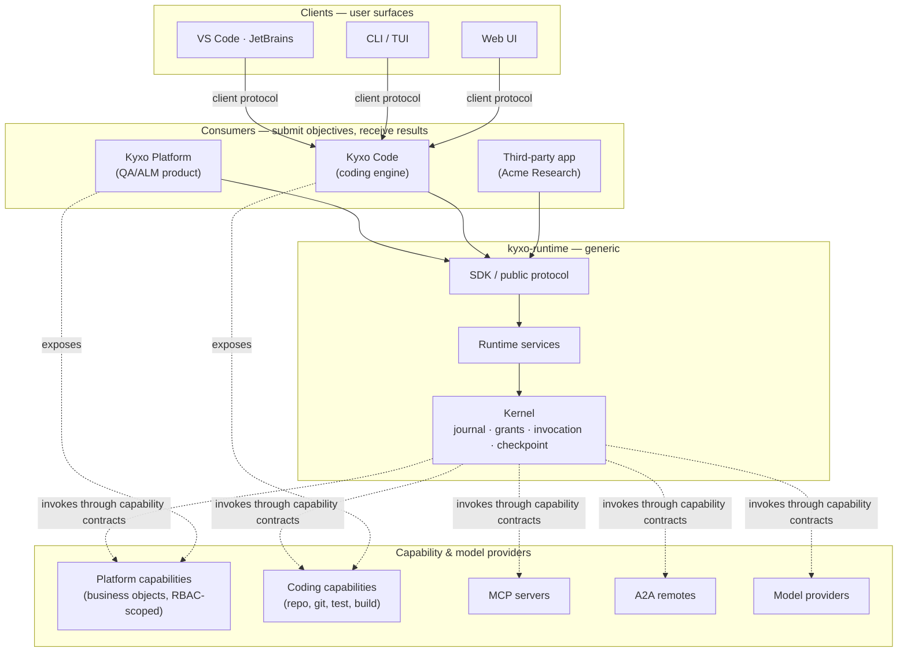
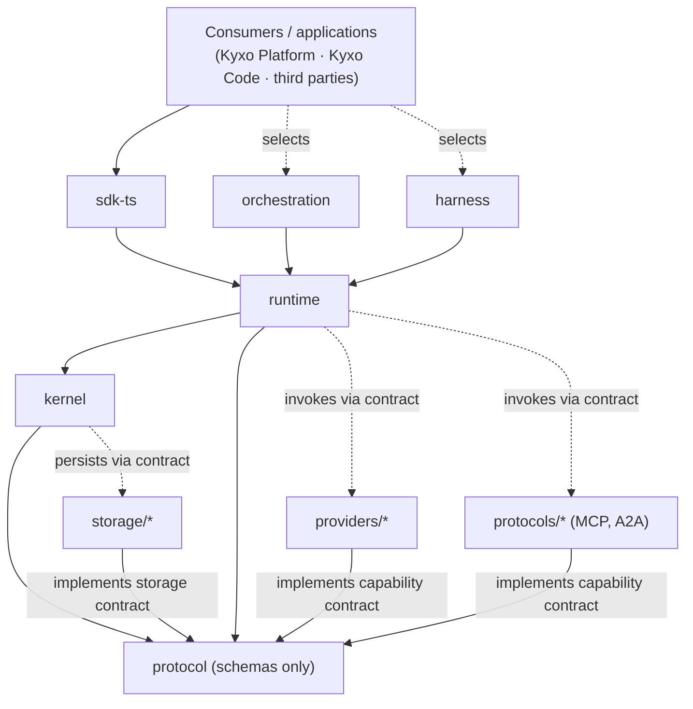
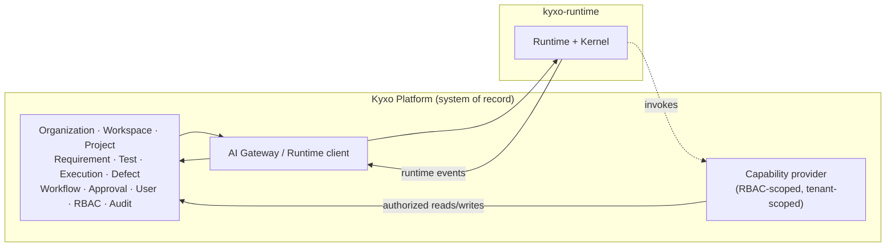
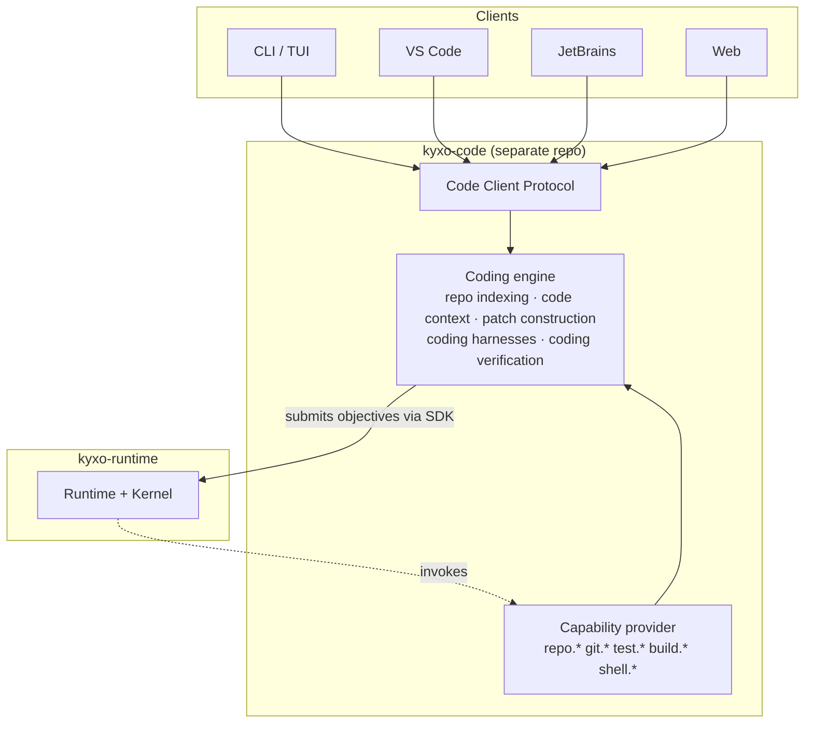
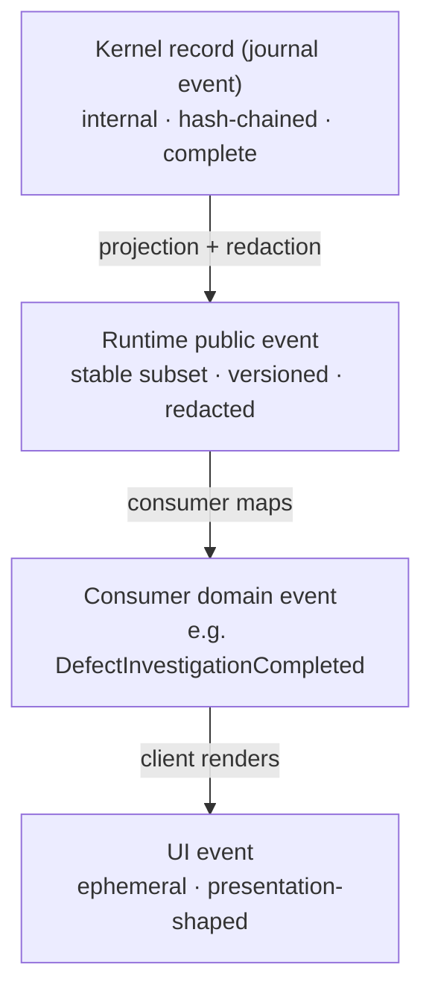
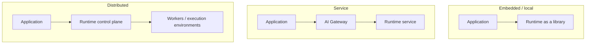
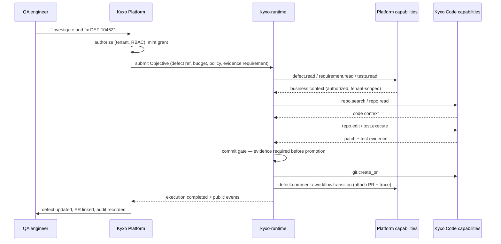

# 23 — Repository and Consumer Architecture

Status: **CANONICAL** for repository organization and consumer boundaries, 2026-08-16.
This is an architecture document: it defines where things belong. It does **not** authorize
implementation of any consumer, and it does not restructure the repository. The engineering
priority remains kernel semantics → record-format freeze (doc 22).

Companion decisions: `16-ADR/ADR-022-runtime-consumer-boundary.md` (Kyxo Runtime is an
independently usable runtime; Kyxo Platform and Kyxo Code are consumers) and
`16-ADR/ADR-023-coding-engine-is-ide-independent.md` (IDEs are clients of an engine, never
its host).

---

## 1. The one-sentence architecture

> **Kyxo Runtime is a generic, capability-oriented AI execution runtime. Kyxo Platform and
> Kyxo Code are two of its consumers, integrated through exactly the same contracts a third
> party would use, and neither exists as a concept anywhere inside the runtime.**

Everything below follows from that sentence, and §12 tests it by deleting each consumer in
turn and checking that the runtime still makes sense.



Note what the diagram does **not** contain: any arrow from the runtime *into* a product.
The runtime never imports, names, or branches on a consumer.

---

## 2. Current repository assessment (PART 1)

Audited from the working tree, not from memory. 63 markdown files, 40 TypeScript files, no
production package structure yet.

```text
kyxo-runtime/
├── .github/workflows/kernel-semantics.yml   CI: typecheck, invariants, semantic suite, fuzz profile
├── README.md
├── docs/                                    24 architecture documents (01–23) + ADRs
│   ├── 01-EXECUTIVE-THESIS.md … 15-IMPLEMENTATION-ROADMAP.md
│   ├── 16-ADR/                              ADR-001…021 + README index
│   ├── 17-KERNEL-SEMANTICS.md               normative
│   ├── 18-KERNEL-INVARIANTS.md              normative + executable
│   ├── 19-CRASH-RECOVERY-MODEL.md
│   ├── 20-SEMANTIC-TEST-RESULTS.md
│   ├── 21-AMENDMENT-RECONCILIATION.md
│   ├── 22-RECORD-FORMAT-FREEZE-DECISION.md  gate: NOT READY
│   └── 23-REPOSITORY-AND-CONSUMER-ARCHITECTURE.md  (this document)
├── research/                                evidence base, ~142k words
│   ├── METHODOLOGY.md  DESIGN-SPINE.md (+ Amendment log A1–A14)
│   ├── ADVERSARIAL-REVIEW.md  ADVERSARIAL-REVIEW-2.md
│   ├── OPEN-ISSUES.md  PHASE2-STATE-ASSESSMENT.md
│   └── notes/                               13 ecosystem research notes
└── prototypes/                              executable falsification only
    ├── kernel/                              phase-1 universality demo (8 constructs)
    ├── harness/ graph/ loop/                phase-1 strategy demos
    └── kernel-semantics/                    phase-2 semantic kernel (src, tests, reference-model, fuzz)
```

### Classification

| Area | Classification | Rationale |
|---|---|---|
| `docs/01–15` | **DOCUMENTATION / KEEP** | Architecture and research synthesis; some superseded by 17–19 where noted |
| `docs/16-ADR/` | **DOCUMENTATION / KEEP** (rename later) | Decision history. The `16-` prefix wrongly implies it is the sixteenth *document*; it is a directory. Rename to `docs/adr/` at the next structural change, not now |
| `docs/17–22` | **DOCUMENTATION / KEEP — normative** | 17 and 18 are the normative specification; they govern over 05–08 where they conflict |
| `research/` | **RESEARCH / ARCHIVE-IN-PLACE** | Historical evidence. Never becomes production input; must never be edited to match later decisions |
| `prototypes/kernel/`, `harness/`, `graph/`, `loop/` | **PROTOTYPE ONLY** | Phase-1 demonstrations. Disposable |
| `prototypes/kernel-semantics/` | **PROTOTYPE ONLY — reference implementation** | Executable specification. *Semi*-disposable: its semantics survive, its code does not |
| `.github/workflows/` | **KEEP / FUTURE PRODUCTION** | Gates will extend to architecture linting (§10) |
| `prototypes/package.json` etc. | **PROTOTYPE ONLY** | Not the future workspace root |

### Naming hazards found

1. **`prototypes/kernel/` and `prototypes/kernel-semantics/` both sound authoritative.** A
   future contributor could reasonably mistake either for production kernel code. *Actively
   misleading* → mitigated now by `prototypes/README.md` (added with this document), which
   states unambiguously that nothing under `prototypes/` is production code and that the
   phase-2 kernel is an executable specification.
2. **`AxisRequirement` vs Kyxo Platform's `Requirement` business object.** A pure naming
   collision today (capability negotiation vs QA artifact), but it will confuse every
   Platform engineer who reads runtime code. Recommendation: rename the runtime concept to
   `AxisConstraint` at the next record-format revision — cheap now, expensive after freeze.
3. **`docs/16-ADR/`** — see above.
4. **`prototypes/kernel/capabilities/coding-agent.ts`** is a *test fixture* named after a
   domain. Harmless (it is a mock capability proving universality) but should be renamed
   `delegating-agent.ts` if it ever moves, so no one reads it as coding support.

**No restructuring is performed by this document** beyond adding `prototypes/README.md`.

---

## 3. Repository lifecycle stages (PART 2)

Eight stages, each with one rule that makes misclassification impossible:

| Stage | Location (today → later) | The rule |
|---|---|---|
| **Research** | `research/` | Append-only history. Never edited to agree with later decisions; contradictions are resolved in `docs/`, not by rewriting evidence |
| **Architecture** | `docs/` | Explains and specifies. Normative documents say so in their status line |
| **ADRs** | `docs/16-ADR/` → `docs/adr/` | One decision per file, superseded rather than deleted |
| **Prototypes** | `prototypes/` | **Never imported by production code.** Enforced by CI once packages exist (§10, C11) |
| **Production runtime** | *(does not exist yet)* → `packages/` | Created only after the record-format freeze |
| **SDKs** | → `packages/sdk-*` | Public surface; its own compatibility policy (§9) |
| **Integrations** | → `providers/`, `protocols/` | Adapters. Depend on contracts, never on kernel internals |
| **Reference consumers** | → `examples/` | Demonstrations. Never a dependency of anything shipped |

---

## 4. Recommended long-term structure (PART 3)

The candidate tree in the brief proposed thirteen packages. Applying the project's
complexity budget — *what becomes impossible if this boundary does not exist?* — six
survive for V1. The rest are collapsed or deferred, with reasons.

```text
kyxo-runtime/
├── docs/
│   ├── architecture/          01–15 (moved, renumbered at the structural change)
│   ├── specs/                 17–19 normative + the record-format schema
│   ├── adr/                   ADR-001…NNN
│   ├── integration/           23 (this doc) + consumer/provider integration guides
│   └── research/ → stays at repo root as research/ (it is evidence, not documentation)
│
├── prototypes/                unchanged; never a dependency
│
├── packages/
│   ├── kernel/                journal · commit · invocation · grants · checkpoint · fork · policy pipeline
│   ├── runtime/               registries, capability resolution, scheduling, services over the kernel
│   ├── protocol/              the wire/record schemas + conformance fixtures (no logic)
│   ├── sdk-ts/                developer-facing API (the only surface most consumers see)
│   ├── orchestration/         loops, graphs, planners, supervisors — userland strategies
│   └── harness/               harness behaviour contract + reference harnesses
│
├── providers/                 model adapters: anthropic/ openai/ openai-compatible/ local/
├── protocols/                 mcp/ a2a/ — protocol adapters at the edges
├── storage/                   journal/CAS/checkpoint backends (sqlite, postgres, memory)
│
├── examples/                  reference consumers (§11)
├── tests/                     cross-package conformance, property, crash, compatibility
└── tooling/                   architecture lints, codegen, release
```

### Packages deliberately **not** created

| Proposed | Decision | Reason |
|---|---|---|
| `capability/` | **Collapsed into `protocol/` + `runtime/`** | The capability *contract* is schema (protocol); *resolution* is a runtime service. A third package would own nothing |
| `policy/` | **Collapsed into `kernel/`** | The policy pipeline is a kernel mechanism (doc 17 §4). Extracting it would let someone ship a runtime without it |
| `events/` | **Collapsed into `kernel/` + `protocol/`** | Events *are* the journal. A separate package invites a second event system |
| `context/`, `memory/` | **Deferred — they are capabilities** | Docs 09 establishes both as userland. Create when a second implementation exists |
| `verification/` | **Deferred — commit gate is kernel, verifiers are capabilities** | Nothing left to package |
| `observability/` | **Deferred** | Projections of the journal + an OTel exporter. Ships in `runtime/` until a second exporter exists |

Each deferral has the same trigger: **create the package when a second implementation
exists, not before.**

---

## 5. Package boundaries (PART 4)

| Package | Layer | Responsibility | May depend on | Must NOT depend on | Public surface | Stability |
|---|---|---|---|---|---|---|
| `protocol` | contract | Record/wire schemas, event kinds, manifest grammar, conformance fixtures. **No logic** | nothing | everything else | The schemas themselves | **Highest** — versioned, frozen per revision |
| `kernel` | kernel | Journal, atomic commit, invocation lifecycle, grants, checkpoint/fork, policy pipeline, effect identity | `protocol` | runtime, sdk, orchestration, harness, providers, protocols, any product | Kernel API + record format | **Highest after freeze**; changes are protocol revisions |
| `runtime` | runtime | Capability registry, resolution/negotiation, scheduling, services, observability export | `protocol`, `kernel`, `storage` contracts | sdk, orchestration, harness, providers, products | Runtime API | High; versioned |
| `orchestration` | userland | Loops, graphs, planners, supervisors | `protocol`, `runtime` (as a client) | `kernel` internals, products | Strategy contracts | Medium — expected to churn |
| `harness` | userland | Harness behaviour contract + reference harnesses | `protocol`, `runtime` | `kernel` internals, providers, products | Behaviour contract | Medium |
| `sdk-ts` | public | Ergonomic developer API; the only surface most consumers touch | `protocol`, `runtime` | `kernel` internals | The SDK API | **Public compatibility promise** |
| `providers/*` | integration | Model adapters (encode/decode, behaviour profiles, passthrough) | `protocol` + their vendor SDK | `kernel`, other providers | Capability manifest + provider | Per-provider |
| `protocols/*` | integration | MCP/A2A adapters at the edges | `protocol`, `runtime` | `kernel` internals | Adapter API | Tracks the external spec |
| `storage/*` | integration | Journal/CAS/checkpoint backends | `protocol` | `kernel` internals beyond the storage contract | Storage contract | Contract stable; backends independent |

### The kernel's ignorance list (normative)

The kernel MUST NOT know about, name, import, or branch on: Kyxo Platform; Kyxo Code;
coding, repositories, requirements, tests, defects, workflows, approvals as *domain
concepts*; IDEs (VS Code, JetBrains, Cursor, Claude Code); any provider identity
(Anthropic, OpenAI, Google, local engines); agent/tool/harness/graph conceptual types;
tenants, organizations, or RBAC roles.

The kernel knows only: capabilities with declared traits, bindings, invocations, effects
with declared classes, grants with rights and quantitative limits, events, artifacts,
checkpoints, and registered Kinds. Every item on the ignorance list is expressible as one
of those without the kernel learning what it is.

**Current status: clean.** A scan of `prototypes/kernel-semantics/src/` finds no product
name, no provider name, and no IDE name; the existing CI universality test already fails
the build on capability-identity branching (I1).

---

## 6. Dependency rules (PART 5)



Dependencies point **downward and inward**. Providers, protocol adapters and storage
backends attach by *implementing a contract*, never by importing the kernel.

### Forbidden relationships (normative)

| Forbidden | Why |
|---|---|
| `kernel` → `kyxo-code`, `kyxo-platform`, any product | The whole thesis; also C1/C2 |
| `kernel` → any IDE API | C3 |
| `kernel` → any provider SDK (Anthropic, OpenAI, …) | Providers are adapters behind a contract; a kernel dependency would make one vendor structural |
| `kernel` → `runtime`, `sdk`, `orchestration`, `harness` | Inverts the layering; the kernel would gain userland semantics |
| `orchestration` / `harness` → `kernel` internals | Strategies are userland; they may call kernel *verbs* through the runtime, never reach past the facade |
| `orchestration` → any consumer database | An orchestrator that reads a product's DB is a product feature wearing a strategy costume |
| `provider` → `kernel` internals beyond the documented contract | Breaks provider portability and the freeze |
| any package → `prototypes/*` | Prototypes are falsification artifacts, not libraries |
| `examples/*` → being imported by `packages/*` | Reference consumers must never become hidden production dependencies |
| consumer code → journal writes | Only the kernel writes truth (I3) |

**Permitted and important:** a consumer may depend on `sdk-ts` *and* register capabilities
*and* supply harnesses. Occupying several roles is normal (§7); what is forbidden is the
runtime knowing which product is doing it.

---

## 7. The four integration roles (PART 16)

Keeping these distinct is what prevents "Kyxo Code" from becoming a kernel concept.

| Role | Definition | Direction | Examples |
|---|---|---|---|
| **Provider** | Supplies underlying intelligence/inference | Runtime → provider | Anthropic, OpenAI, vLLM, a local model |
| **Capability provider** | Exposes callable capabilities behind manifests | Runtime → capability | MCP servers, Kyxo Platform business capabilities, Kyxo Code repo/git capabilities, GitHub |
| **Consumer** | Submits objectives, receives execution results | Consumer → runtime | Kyxo Platform, Kyxo Code, a CLI, a third-party SaaS |
| **Client** | User-facing surface | Client → consumer (not the runtime) | VS Code, JetBrains, web UI, terminal |

An entity may hold several roles. **Kyxo Code is simultaneously a consumer (it submits
coding objectives), a capability provider (it exposes `repo.*`, `git.*`, `test.*`), and a
harness supplier (coding harnesses).** The runtime sees three unrelated registrations, not
one product.

Clients talk to consumers, **never directly to the runtime**. This is what keeps IDE state
out of runtime truth (C7).

---

## 8. Consumer architecture

### 8.1 Consumer A — Kyxo Platform (PARTS 6, 7)



**The boundary, stated plainly:** the Platform is the system of record for its business
objects; the runtime is the system of record for *executions*. Neither stores the other's
truth. The runtime never receives database access "for convenience" — every touch of a
business object is a capability invocation subject to grants and policy.

**Identity and RBAC flow** (the Platform's model stops at the boundary):

```text
Platform identity (user, tenant, roles)
        ↓  translated at the AI Gateway
Grant   (generic rights + quantitative limits + TTL)
        ↓
Binding (sealed at negotiation)
        ↓
Invocation (authority checked at admission AND at commit)
```

The kernel enforces *generic* authority: rights, attenuation, budgets, revocation,
lineage. It has no notion of a role, a tenant or a permission name. The Platform's
capability provider is responsible for refusing anything its own RBAC forbids, and for
scoping every capability to the tenant that the grant was minted for. Two enforcement
layers, deliberately: the Platform enforces *what this user may do*, the kernel enforces
*what this execution may spend and reach*.

**Example capability surface** (illustrative only — the real model is derived later):
`kyxo.requirement.read`, `kyxo.requirement.create`, `kyxo.test.read`, `kyxo.defect.create`,
`kyxo.workflow.transition`, `kyxo.approval.request`. Note these are *the Platform's*
names in *the Platform's* namespace. The runtime stores them as opaque capability ids.

### 8.2 Consumer B — Kyxo Code (PARTS 8, 9, 10)

Kyxo Code is a **future consumer**, not a runtime subsystem. Nothing in the runtime is
built for it.



**What belongs to Kyxo Code** (coding-domain intelligence): repository discovery, indexing
and semantic search; code context construction; patch construction and edit-format
strategy; git operations; build/test/lint integration; coding-specific planning; coding
verification policy; developer interaction.

**What belongs to the runtime** (generic): the invocation lifecycle those capabilities run
through; grants and budgets; the journal and checkpoints; the commit gate that requires
evidence; the harness *contract*; orchestration *strategies* (a loop is a loop whether it
edits code or files a defect).

**What is a shared provider, not Kyxo Code:** model adapters. A coding harness selects a
model through the same provider layer everything else uses.

**The judgement calls, decided:**

| Concept | Owner | Reason |
|---|---|---|
| `shell.execute` | **Runtime standard capability** (sandboxed) | Not coding-specific; a research consumer needs it too. Kyxo Code *uses* it |
| File read/write | **Runtime standard capability** | Same argument |
| `repo.search` / indexing | **Kyxo Code** | Requires code-aware indexing and ranking; a generic runtime should not own tree-sitter and PageRank |
| Patch construction / edit formats | **Kyxo Code** | Model-family-specific edit dialects are coding-domain expertise (evidence: Aider, Copilot edit-tool learning) |
| Coding harnesses | **Kyxo Code**, registered through the generic harness contract | The contract is generic; the behaviour is domain |
| `test.execute` | **Kyxo Code** exposes it; the *verification gate* is kernel | Running tests is domain; requiring evidence before promotion is generic |

**Harness relationship.** Kyxo Code **registers harnesses with the runtime and invokes the
runtime naming a harness×model profile**. It does not host its own execution loop. This
preserves the benchmarkable profile from doc 10:

```text
Claude          × PlanningCodingHarness
GPT             × PlanningCodingHarness
Claude          × ReactiveCodingHarness
OpenModel-X     × CodingHarness-Y
```

Each pair is a versioned artifact with telemetry, expressible because both the model
adapter and the harness are capabilities with manifests. `ReactiveCodingHarness` and its
siblings are **never kernel types**; they are registrations.

### 8.3 Consumer C — third parties (PART 15)

The runtime must serve: third-party SaaS, enterprise internal applications, CLIs, backend
services, automation pipelines, remote agents, IDE plugins (via their own consumer), web
applications, and consumers that do not exist yet.

The test in §12.4 uses **Acme Research** — a consumer with no connection to coding, QA,
requirements, Kyxo or IDEs — to check that nothing Kyxo-specific is required.

---

## 9. Contract layers and stability (PARTS 19, 20)

**The internal journal format is not the public event contract.** Four distinct layers,
deliberately:



| Surface | Changes | Versioning | Compatibility promise | Exposes internals? |
|---|---|---|---|---|
| Kernel record format | Only via protocol revision | Date-versioned; frozen per revision (doc 22) | Readers must tolerate unknown kinds/fields | It **is** the internals |
| Runtime internal API | Freely between releases | Package semver | None across major versions | Yes — not for consumers |
| Runtime public protocol | Deliberately, with notice | Date-versioned, negotiated per request | Long-term; deprecation window | No |
| SDK | Ergonomics may churn early | Semver | Long-term after 1.0 | No |
| Consumer integrations | Consumer's own pace | Consumer's own | Consumer's own | No |

**Rule: do not freeze consumer-facing surfaces while kernel semantics are still moving.**
The SDK stays 0.x until the record format freezes. Conversely, once the public protocol
ships, kernel churn must not be observable through it — that is the entire purpose of the
projection layer.

---

## 10. Consumer-isolation invariants (PART 25)

Refined from the brief's C1–C10, with mechanization noted. **Enforceable-now** items can
become CI checks as soon as `packages/` exists; two already run today.

| # | Invariant | Mechanization |
|---|---|---|
| **C1** | Kernel MUST NOT import product code (Platform, Code, or any consumer) | Static import-graph lint |
| **C2** | Kernel MUST NOT import IDE, editor or client APIs | Static import-graph lint |
| **C3** | Kernel MUST NOT import a provider SDK | Static import-graph lint |
| **C4** | No kernel behaviour branches on consumer, product or capability identity | **Running today** (universality test, I1) |
| **C5** | Kyxo Code and Kyxo Platform use only contracts available to third parties | Conformance suite: their capability providers pass the same suite as any third party (§11) |
| **C6** | Consumer business objects are opaque references, never kernel primitives | Review + Kind-registry rule: no `kyxo.*` domain Kind ships in `packages/` |
| **C7** | Clients cannot mutate runtime truth; only the kernel writes | **Structural today** (providers hold no kernel handle, I3) |
| **C8** | Consumer APIs cannot bypass grants or policy | Every SDK path resolves to an invocation; no direct journal API is exported |
| **C9** | Local and remote execution preserve identical semantics | Conformance suite run against both topologies |
| **C10** | Provider-native behaviour stays reachable without provider branching in the kernel | Typed passthrough + manifest axes; kernel scan for provider names |
| **C11** *(new)* | Production packages MUST NOT import `prototypes/*` | Static import-graph lint |
| **C12** *(new)* | `examples/*` MUST NOT be imported by `packages/*` | Static import-graph lint |
| **C13** *(new)* | No `packages/*` module may name a consumer product in identifiers, strings or file names | Vocabulary lint, extending the existing I1 check |

C11–C13 are added because they close the three ways this architecture would most plausibly
erode in practice: someone reuses a prototype "temporarily", an example becomes a
dependency, and a product name creeps into a variable name.

---

## 11. Reference consumers and conformance (PARTS 23, 24)

**Examples belong in the repository; production consumers do not.** Three reference
consumers earn their place by testing a boundary that nothing else tests:

| Example | Proves |
|---|---|
| `examples/minimal-objective/` | The simple case stays simple: submit an objective, stream events, get a result |
| `examples/capability-provider/` | A third party can expose capabilities without runtime-side changes |
| `examples/enterprise-consumer/` | Identity → grant → binding → invocation flows end-to-end **without any Kyxo concept** |

Each must be runnable in CI and must import only published package surfaces (C12).

**Conformance suites** are the mechanism that keeps Kyxo-specific assumptions out:

| Suite | Who must pass | What it proves |
|---|---|---|
| Capability conformance | Every capability provider, **including Kyxo Code and Kyxo Platform** | Manifests, negotiation, lifecycle, effect classes, cancellation, suspension |
| Provider conformance | Every model adapter | Axis declarations, passthrough, carry-through state, error mapping |
| Storage conformance | Every journal/CAS/checkpoint backend | Atomic append, torn-record discard, checkpoint durability, recovery |
| Orchestration conformance | Every strategy | Uses only kernel verbs; no privileged path |
| Record-format conformance | Every implementation | Golden corpus per event kind per version; unknown-field tolerance |

**Kyxo Code passing the same capability conformance suite as any third party is the single
best check that the boundary held.** If it ever needs an exemption, the boundary has
already broken.

---

## 12. The critical architectural tests

### 12.1 Assume `kyxo-code` never exists — does the runtime still make sense?
**YES.** Nothing in docs 05–22 mentions coding. The kernel objects are capability, binding,
invocation, event, artifact, cell, grant, checkpoint, kind; the semantic suite exercises a
raw model, a pure tool, an MCP-shaped server, an opaque remote, a human approver and a
local model. Coding appears only as one *example* capability among many.

### 12.2 Assume Kyxo Platform never existed — could a third party build on it?
**YES.** No Platform concept appears in any package boundary, contract or record. The
identity chain terminates at *grant*; everything above (tenant, RBAC, role) is the
consumer's. A third party mints grants from its own identity system the same way.

### 12.3 Assume VS Code disappears — could Kyxo Code still operate?
**YES**, by construction (ADR-023): the engine is a process with a client protocol. VS Code
is one client among CLI, JetBrains, web, CI and automation. Nothing in the engine may
import an editor API.

### 12.4 Acme Research — a consumer with no connection to coding, QA, requirements or IDEs
Acme runs long-horizon literature analysis with human review gates.

| Acme needs | Runtime mechanism | Kyxo-specific? |
|---|---|---|
| Submit "survey the field, produce a report" | Objective (a registered Kind) | No |
| Search papers, run analyses | Their own capability providers | No |
| A model of their choice | Provider adapter + manifest axes | No |
| Multi-week execution | Checkpoint, resume, suspension | No |
| Human review before publication | Human capability + evidence commit gate | No |
| Spend limits per project | Grants with quantitative limits + attenuation | No |
| Audit of what was done | Journal projections → public events | No |
| A custom research strategy | Orchestration strategy over kernel verbs | No |

**Nothing Acme needs is Kyxo-shaped.** The one thing Acme would find missing is a
*domain*: it must supply its own capabilities, exactly as Kyxo Code and Kyxo Platform must.
That symmetry is the architecture working.

---

## 13. Data ownership (PARTS 17, 18)

| Concern | Authoritative owner |
|---|---|
| Journal, events, hash chain | **Kernel** |
| Commit atomicity, effect identity | **Kernel** |
| Checkpoint, fork, lineage | **Kernel** |
| Grant state, attenuation, budget ledger | **Kernel** |
| Invocation lifecycle and uncertainty | **Kernel** |
| Artifact bytes + provenance | **Kernel** (CAS), referenced elsewhere |
| Capability registry and negotiation | **Runtime** |
| Scheduling, leases, deadlines | **Runtime** |
| Execution trace / observability projections | **Runtime** |
| Loop, graph, planner, supervisor behaviour | **Orchestration (userland)** |
| Context assembly for a model turn | **Harness (userland)** |
| Model API dialects, carry-through state | **Provider** |
| Organization, workspace, project | **Kyxo Platform** |
| Requirement, test, execution, defect | **Kyxo Platform** |
| Business workflow, approval records | **Kyxo Platform** |
| Users, tenants, RBAC | **Kyxo Platform** (or any consumer's IdP) |
| Business audit history | **Kyxo Platform** |
| Repository content | **The user's VCS** — never the runtime, never Kyxo Code |
| Repo index / code embeddings | **Kyxo Code** (derived cache, rebuildable) |
| Coding harness configuration | **Kyxo Code** |
| Editor/IDE state, selection, open files | **IDE client** — ephemeral, never durable runtime state |
| Workspace session metadata | **Kyxo Code** (see challenge below) |

**Challenge, as instructed:** should Kyxo Code own *durable* state at all? Mostly no. The
repo index is a rebuildable cache, not a source of truth — losing it costs time, not
correctness. Coding session metadata is largely duplicative of the runtime's execution
identity. **Recommendation: Kyxo Code should own only rebuildable caches plus a thin
mapping from its workspace identity to runtime execution ids.** Anything else it feels
tempted to persist is a signal that either the runtime or the VCS should own it.

**The general rule: no durable duplication of another system's source of truth.** The
runtime references business objects by opaque id; the Platform references executions by
runtime id; neither copies the other.

---

## 14. Deployment topologies (PARTS 12, 21)

All three run identical kernel semantics. Location transparency is a contract requirement,
not an implementation detail.



| Consumer | Expected topology |
|---|---|
| Kyxo Platform | **Service** — the Gateway translates identity to grants and is the policy chokepoint |
| Kyxo Code (local) | **Embedded/daemon** — engine and runtime local to the developer's machine and repository |
| Kyxo Code (cloud) | **Distributed** — isolated workspace per execution |
| Third-party CLI | Embedded |
| Third-party SaaS | Service or distributed |

**Contracts that MUST remain location-transparent**, so the coding engine is not rewritten
per topology: objective submission; the event stream; approval/suspension round-trips;
artifact references (content-addressed, not paths); capability invocation; checkpoint and
fork. Anything that would need a local file path, a process handle or an in-memory object
to cross the boundary is a design error — this is why grant *handles* (in-process object
identity, ADR-020) are explicitly V1-scoped and must become a token design before remote
authority ships.

**Hybrid** (local editor, cloud execution) is the composition of the two, and works only if
the above holds.

### Code Client Protocol (PART 13) — designed, not built

A lightweight client protocol is eventually needed so IDEs stay thin. Conceptual surface:
`openWorkspace`, `submitObjective`, `streamExecutionEvents`, `requestApproval`,
`approve`/`reject`, `getDiff`, `applyChange`, `rollback`, `cancel`, `getRunState`.

**Recommendation: JSON-RPC 2.0 over stdio locally and WebSocket remotely** — the same
framing both ways, which is what keeps local and cloud clients identical. Precedent is
strong (LSP, MCP, ACP, Codex's app-server). **It MUST NOT expose kernel internals**: it
speaks workspaces, objectives, diffs and approvals — never journals, grants or bindings.
Not to be built in this phase, and not to be frozen before the runtime's public protocol.

---

## 15. Repository split (PART 22)

**Recommendation: three repositories**, which matches the hypothesis in the brief.

| Repository | Contains |
|---|---|
| `kyxo-runtime` | Kernel, runtime, protocol, SDK, orchestration, harness contract, providers, protocol adapters, storage backends, conformance suites, examples, docs |
| `kyxo-code` | Coding engine, coding harnesses, coding capabilities, client protocol, IDE clients |
| Kyxo Platform (existing) | Business application + its capability provider + AI Gateway |

**Why not a monorepo** (challenged, as instructed): a single repo would be *convenient* and
is how the boundary dies. Every erosion mechanism is a shortcut that a shared repo makes
easy — a "temporary" import, a shared type, a test that reaches across, a release that
couples versions. Separate repositories make each crossing an explicit, reviewable
dependency. The cost is real (cross-repo changes need coordination) and is the point.

**What the runtime repo may contain about consumers:** integration *documentation*, generic
*contracts*, and minimal *examples*. Never product code — not even "just the interfaces",
because interfaces are how domain vocabulary enters a codebase.

---

## 16. Worked flow: Platform → Runtime → Code (PART 14)

The scenario that most tempts a monolith, and the clearest demonstration of why these are
two consumers.



Three observations that the architecture depends on:

1. **The runtime orchestrated two unrelated capability providers** and knew nothing about
   either domain — it saw manifests, grants and effect classes.
2. **Each provider enforced its own domain rules**: the Platform refused anything the
   user's RBAC forbids; Kyxo Code refused writes outside the workspace.
3. **The audit trail is split correctly**: the runtime owns *what the AI did* (journal,
   evidence, spend); the Platform owns *what happened to the defect* (business audit). No
   duplication, and each is authoritative where it should be.

---

## 17. What this document does not do

- It does **not** create `packages/`, `providers/`, `protocols/`, `storage/`, `examples/`,
  `tests/` or `tooling/`. Empty directories that match a diagram are a liability.
- It does **not** rename `docs/16-ADR/`, `AxisRequirement` or any prototype file. Those are
  queued for the next structural change, after the freeze.
- It does **not** authorize any consumer implementation.
- It does **not** freeze package names. They are a proposal, revisited when the first
  package is actually created.

The single change made alongside it is `prototypes/README.md`, because "which of these two
kernel directories is real?" is a question a new contributor would get wrong today.
